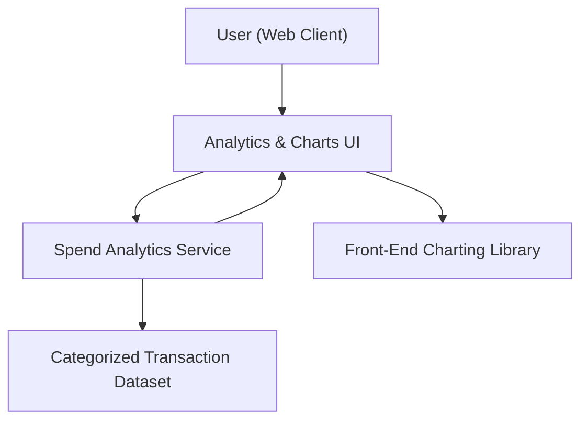

#### 1. High-Level Design
- Summary: Implement interactive analytics and visualizations for monthly spend trends, card-wise spend analysis, and predefined category-wise insights across all cards, aggregating transactions to help users understand and optimize their spending patterns.

- Component Flow:

- Integration Points:
  - Internal transaction dataset categorized into predefined spending categories (Food & Dining, Fuel, Shopping, Travel, Entertainment, Utilities, Healthcare, Education, Miscellaneous).
  - Internal aggregation logic or analytics service to compute monthly trends, card-wise spend, and category-wise totals across cards.
  - Front-end charting/visualization library for interactive spend charts and responsive analytics views.

- Key Assumptions:
  - Transaction categorization into the predefined categories is already performed or available via upstream logic prior to analytics calculations.
  - Analytics are computed over recent historical data (e.g., last 12 months) within typical consumer transaction volumes, without external analytics platform integration.

- NFR Highlights:
  - Analytics visualizations must render within acceptable time for typical monthly transaction volumes, remain responsive across device types, and handle data securely within the app, with no real-time external banking analytics integration.

#### 2. Validation Report
- Requirements Coverage: The design meets the epic’s requirements for monthly spend trends, card-wise analysis, category-wise insights across predefined categories, interactive charts, and cross-card aggregation, leveraging categorized internal transaction data and visualization libraries while adhering to performance, responsiveness, and security constraints and excluding external analytics or advanced budgeting features.
