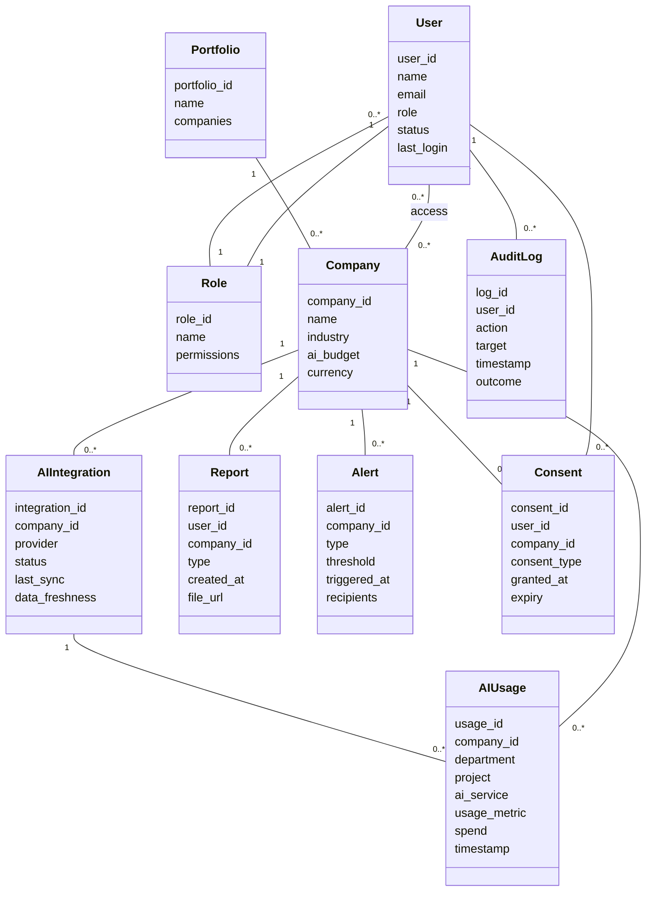

# AI Portfolio Management Dashboard – High Level Design (HLD) & Domain Model

## Domain Model

---

## High-Level Design (HLD)

### Architecture Overview

**Frontend**: Web dashboard (React/Angular, WCAG 2.1 AA compliant)  
**Backend**: RESTful API (Node.js/Java/.NET), microservices  
**Data Layer**: Cloud SQL (Postgres/MySQL), Data Lake  
**Integrations**: Secure APIs for AWS, Azure, GCP  
**Auth**: SSO (OAuth2/SAML), RBAC  
**Reporting**: PDF/Excel generator  
**Alerting**: Email/In-app notifications  
**Monitoring**: Synthetic monitoring, audit logging

### Major Components

- User Management & RBAC
- Company/Portfolio Registry
- AI Integration Engine
- AI Usage & Spend Analytics
- Alerting & Notifications
- Report Generation & Export
- Benchmarking & Drill-down Analytics
- Consent & Compliance Tracker
- Audit Log System

### Integration Points

- AWS, Azure, GCP APIs
- SSO/IdP
- Email/SMS gateway
- PDF/Excel export libraries

### Security & Compliance Features

- Input validation/output filtering at APIs
- AES-256 encryption at rest, TLS 1.3 in transit
- RBAC/ABAC
- Audit logging
- Secrets in cloud KMS/HSM
- Data retention policies
- Consent management
- Data lineage for all usage/spend records
- Compliance reporting

### Data Flow

1. Admin configures cloud integrations/SSO.
2. Data ingestion fetches AI usage/spend.
3. Data is processed, aggregated, stored.
4. Authorized users access dashboards.
5. Visualizations, analytics, alerts, reports generated.
6. Actions logged for audit/compliance.

---

## Validation Report

**Requirements Coverage**:  
- All functional and non-functional requirements mapped

**Compliance**:  
- Encryption, RBAC, logging, retention, consent, reporting, lineage

**Error Handling**:  
- Retries, logging, circuit breakers, user notifications
