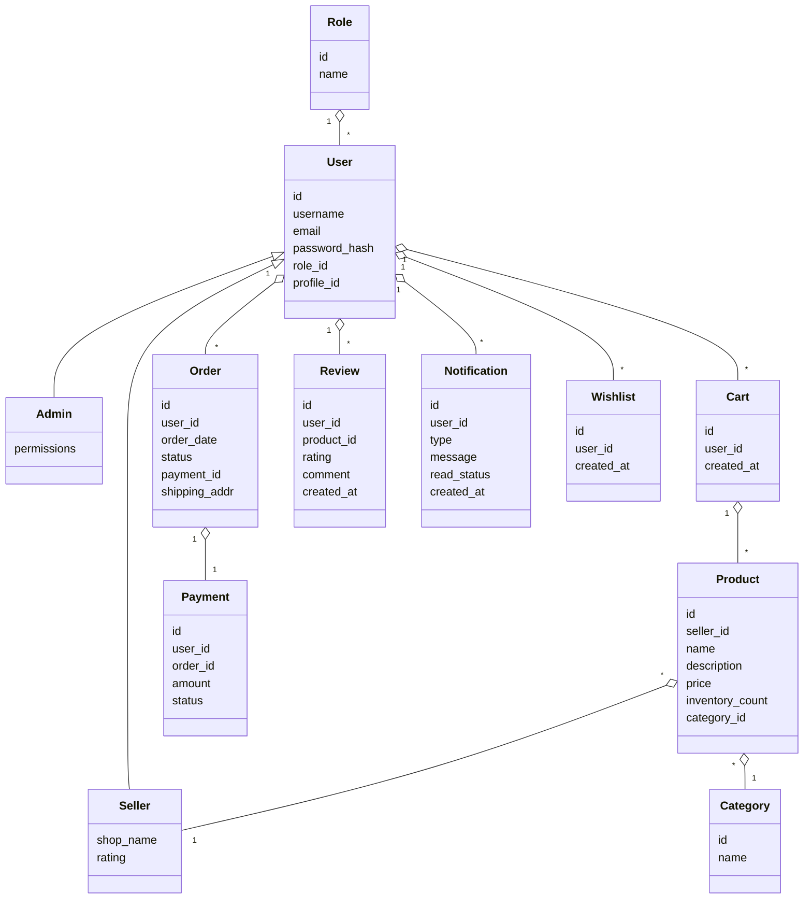

# Online Shopping Platform: High-Level Design (HLD) & Domain Model

## 1. Validation Report

### Requirements Coverage Checklist
- [x] Registration/Login
- [x] Product Catalog
- [x] Search & Filter
- [x] Shopping Cart
- [x] Secure Checkout
- [x] Order Tracking
- [x] Role-Based Access Control (RBAC)
- [x] Seller/Admin Dashboards
- [x] Notifications
- [x] Multiple Payment Methods
- [x] Reviews
- [x] Refunds
- [x] Recommendations (Optional)
- [x] Wishlist (Optional)
- [x] Logistics Integration (Optional)

### Compliance & Security Checklist
- [x] PCI DSS (Payments)
- [x] AES-256 at rest, TLS 1.3 in transit
- [x] Input validation, output filtering
- [x] RBAC/ABAC
- [x] Audit logging
- [x] Secrets management
- [x] Data retention & consent management
- [x] Data lineage, compliance reporting
- [x] Accessibility (WCAG 2.1 AA)
- [x] Error handling, retries, circuit breaker

---

## 2. Domain Model (UML/ERD)

### Entities & Attributes
```
+----------------+      +-------------------+      +-----------------+
|    User        |      |   Product         |      |   Order         |
+----------------+      +-------------------+      +-----------------+
| id             |<>---<| id                |      | id              |
| username       |      | seller_id         |      | user_id         |
| email          |      | name              |      | order_date      |
| password_hash  |      | description       |      | status          |
| role_id        |      | price             |      | payment_id      |
| profile_id     |      | inventory_count   |      | shipping_addr   |
+----------------+      | category_id       |      +-----------------+
                        +-------------------+
       | 1                        | *
       |                        +-------------------+
       |                        |   Category        |
       |                        +-------------------+
       |                        | id                |
       |                        | name              |
       |                        +-------------------+
       |
+----------------+
|   Role         |
+----------------+
| id             |
| name           |
+----------------+

+----------------+      +-------------------+      +-----------------+
|   Cart         |      |   Payment         |      |   Review        |
+----------------+      +-------------------+      +-----------------+
| id             |      | id                |      | id              |
| user_id        |      | user_id           |      | user_id         |
| created_at     |      | order_id          |      | product_id      |
+----------------+      | amount            |      | rating          |
                        | status            |      | comment         |
                        +-------------------+      | created_at      |
                                                   +-----------------+

+-----------------+
|   Notification  |
+-----------------+
| id              |
| user_id         |
| type            |
| message         |
| read_status     |
| created_at      |
+-----------------+

+-----------------+
|   Wishlist      |
+-----------------+
| id              |
| user_id         |
| created_at      |
+-----------------+

Relationships:
- User 1---* Order
- User 1---* Cart
- User 1---* Review
- User 1---* Notification
- User 1---* Wishlist
- Product *---1 Category
- Product *---1 Seller (User)
- Order 1---1 Payment
- Cart 1---* Product (CartItems)

```

---

## 3. High-Level Design (HLD)

### Architecture Overview
- **Frontend:** Responsive Web (SPA, React/Angular), accessible (WCAG 2.1 AA)
- **API Gateway:** Secure entry point, rate limiting, request validation
- **Microservices:**
    - **User Service:** Registration, authentication, profile, RBAC
    - **Catalog Service:** Products, categories, search, filter
    - **Order Service:** Cart, checkout, orders, refunds
    - **Payment Service:** PCI DSS, multi-gateway, fraud detection
    - **Notification Service:** Email, SMS, in-app
    - **Review Service:** Ratings, reviews
    - **Recommendation Service:** (Optional)
    - **Wishlist Service:** (Optional)
    - **Admin/Seller Dashboard Service:** Analytics, management
- **Database:** Relational (PostgreSQL/MySQL), encrypted at rest
- **Object Storage:** Product images, invoices
- **Integration:** Payment gateways, email/SMS, third-party logistics
- **Monitoring:** Centralized logging, metrics, audit trails

### Component Descriptions
- **Frontend:** Implements UI/UX, accessibility, input validation
- **API Gateway:** Unified security, request routing, logging
- **User Service:** Manages users, RBAC, password encryption (bcrypt)
- **Catalog Service:** CRUD for products/categories, search index
- **Order Service:** Cart logic, order lifecycle, refund handling
- **Payment Service:** Tokenization, PCI DSS compliance, payment retries
- **Notification Service:** User/system notifications, opt-in/out
- **Review Service:** User-generated content, moderation
- **Recommendation/Wishlist:** Personalization, optional modules
- **Admin/Seller Dashboards:** Role-based analytics, controls
- **Database:** Secure, ACID, encrypted, backup & retention policies
- **Object Storage:** Secure uploads, signed URLs, retention
- **Monitoring:** SIEM, audit logging, alerting, compliance reports

### Integration Points
- Payment gateways (PCI DSS, tokenization, fraud detection)
- Email/SMS providers (notifications, OTP)
- Logistics APIs (order tracking, optional)

### Security & Compliance Features
- **Input Validation & Output Filtering:** OWASP best practices
- **Encryption:** AES-256 at rest, TLS 1.3 in transit
- **RBAC/ABAC:** Fine-grained access, admin/seller roles
- **Audit Logging:** All sensitive actions/events
- **Secrets Management:** Vault/KMS for keys, tokens
- **Data Retention & Consent:** User consent, retention policy
- **Data Lineage & Reporting:** For compliance audits
- **Accessibility:** WCAG 2.1 AA compliance

### Data Flow (Example: Order Placement)
1. User logs in (User Service → DB)
2. User browses catalog (Catalog Service → DB)
3. Adds product to cart (Order Service → DB)
4. Proceeds to checkout (Order Service → Payment Service)
5. Payment processed (Payment Service → Payment Gateway)
6. Order confirmation, notification (Order, Notification Services)
7. Order tracked, updated (Order Service)

### Error Handling Patterns
- Retry on payment/integration failures
- Circuit breaker for dependent services
- Centralized error logging & alerting
- Graceful degradation (e.g., fallback UI)

---

## 4. Domain Model Diagram (ASCII/Markdown)



---

## 5. Notes & Justification
- All critical requirements, security, compliance, and NFRs have been addressed as per PRD.
- Optional features are modular for future extensibility.
- Patterns (retry, circuit breaker, audit) ensure resilience and regulatory alignment.
