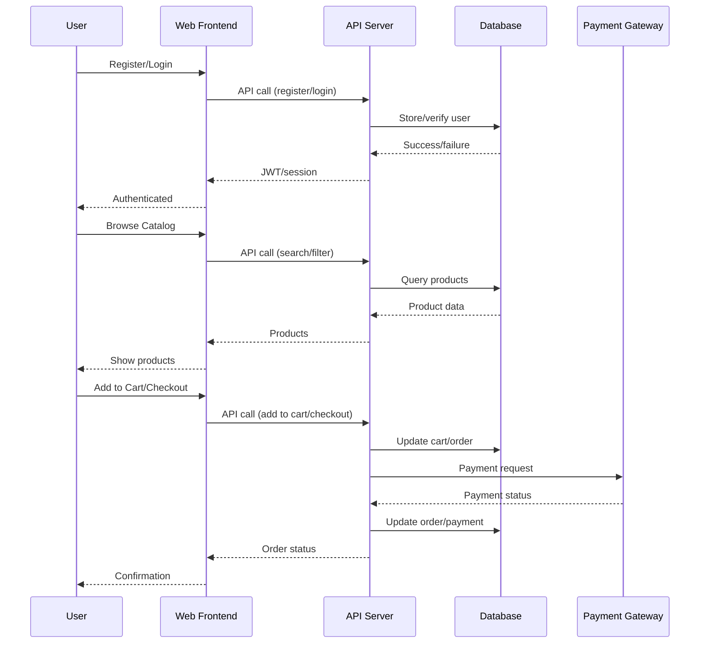

# Low-Level Design (LLD) – Online Shopping Platform (APP4)

## 1. Component Specifications

### 1.1 Authentication & Authorization
- **Modules:** Registration, Login, RBAC/ABAC
- **Technologies:** JWT, OAuth2, bcrypt, HTTPS (TLS 1.3)
- **Data:** User, Profile, Role entities
- **Flows:**
    - Registration: Validate input → Hash password → Store user → Send verification
    - Login: Validate credentials → Issue JWT → Set session
    - Role Management: Enforce RBAC/ABAC on all endpoints
- **Security:** Input validation, audit logging, brute-force protection

### 1.2 Product Catalog
- **Modules:** CRUD, Search, Filter
- **Technologies:** REST API, Elasticsearch
- **Data:** Product, Seller, Category entities
- **Flows:**
    - Product CRUD: Seller/Admin APIs for create/update/delete
    - Search: User queries → Filter/sort → Return paginated results
- **Security:** Input/output sanitization, permission checks

### 1.3 Shopping Cart & Checkout
- **Modules:** Cart, Payment, Order
- **Technologies:** PCI DSS-compliant payment gateway, REST API
- **Data:** Cart, Order, Payment entities
- **Flows:**
    - Add to Cart: Validate stock → Update cart
    - Checkout: Validate cart → Create order → Initiate payment → Confirm/rollback
- **Security:** PCI DSS, encrypted data, fraud checks, retries

### 1.4 Order Management
- **Modules:** Tracking, Refunds
- **Technologies:** REST API, Event-driven notifications
- **Data:** Order, Payment, Review entities
- **Flows:**
    - Place Order: Create order → Update stock → Notify user
    - Refund: Verify eligibility → Process refund → Update order status
- **Security:** Audit logging, error handling, circuit breaker

### 1.5 Dashboards (Seller/Admin)
- **Modules:** Analytics, Product Management, User Management
- **Technologies:** React, REST API, Role-based UI
- **Data:** Seller, Admin, Product entities
- **Flows:**
    - Seller: View/manage products, orders, reviews
    - Admin: Manage users, products, compliance
- **Security:** RBAC, logging, activity monitoring

### 1.6 Notifications & Reviews
- **Modules:** Email/SMS, Product Reviews
- **Technologies:** External notification APIs, REST endpoints
- **Data:** Notification, Review entities
- **Flows:**
    - Notifications: Trigger on key events (order, refund, etc.)
    - Reviews: User posts review → Validate → Store → Update product rating
- **Security:** Rate limiting, content moderation

## 2. Data Flows

## 3. Implementation Details

- **Frontend:** React, Redux, Axios, WCAG 2.1 AA compliance
- **Backend:** Node.js, Express, JWT, OAuth2, REST APIs
- **Database:** PostgreSQL (entities as per HLD), Redis for caching sessions/carts
- **Search:** Elasticsearch for product catalog
- **Notifications:** Integration with SendGrid/Twilio
- **Payments:** Stripe/PayPal SDK, PCI DSS compliance
- **DevOps:** Docker, Kubernetes, CI/CD pipelines, Infrastructure as Code (Terraform)
- **Security:**
    - TLS 1.3 everywhere
    - Secrets in Vault, not code
    - Audit logs for registration, checkout, admin actions
    - GDPR/CCPA consent management
    - Data retention policies
    - Automated vulnerability scans

## 4. Compliance & Error Handling

- **PCI DSS:** Cardholder data never stored, tokenization used
- **GDPR/CCPA:** Consent capture, data subject rights, audit trails
- **WCAG 2.1 AA:** Accessible UI components, ARIA labels
- **Audit Logging:** All sensitive actions
- **Error Handling:**
    - Payment failures: User notified, retry/circuit breaker
    - Fraud detection: Real-time checks, admin alerts
    - Graceful degradation under load

## 5. Sequence Diagrams & Data Lineage

- See above for user/product/payment flows
- Data lineage tracked from user registration through order/payment/review

---
*This LLD is generated based on HLD and requirements from "New4.pdf". All mandatory and non-functional requirements are covered, including security, compliance, and error handling.*
