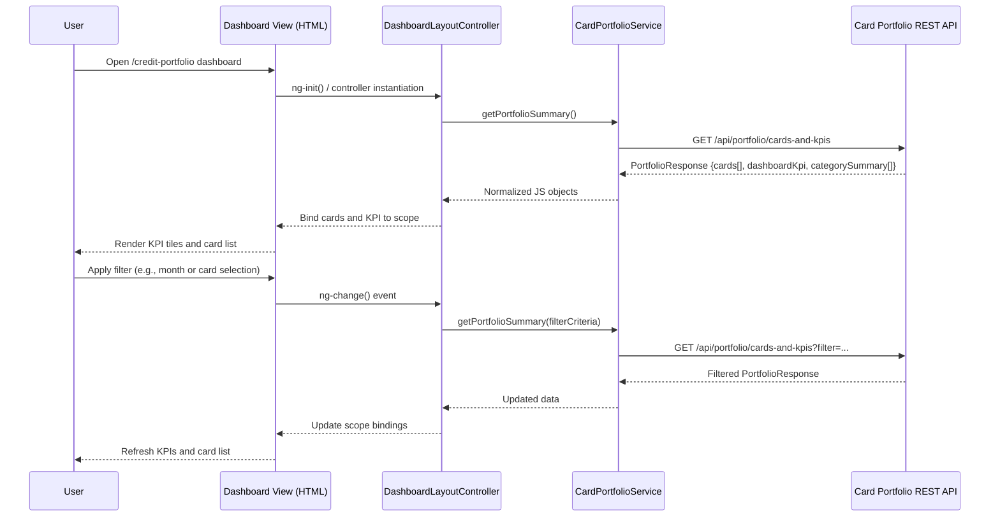

# Low-Level Design (LLD) – APPTesing1 Credit Card Portfolio Overview Dashboard Updated

## a. Architecture Mapping (brief)

- Credit Card Portfolio Dashboard → `creditPortfolioModule` (AngularJS module)
- Dashboard Shell/Layout → `DashboardLayoutController` (controller)
- Card List Panel → `CardListController` + `cardList` (directive)
- KPI Summary Panel (monthly spend, credit limit, available, outstanding) → `KpiSummaryController` + `kpiSummary` (directive)
- Charting/Visualization (category-wise trends, if extended) → `ChartService` (service) + `spendTrend` (directive)
- Data Access for Cards and KPIs → `CardPortfolioService` (service, REST API integration)
- Routing and State Management → `portfolioRoutes` (config block on module)

**Recommended folder structure**
- `app/`
  - `modules/credit-portfolio/`
    - `credit-portfolio.module.js`
    - `credit-portfolio.routes.js`
    - `controllers/dashboard-layout.controller.js`
    - `controllers/card-list.controller.js`
    - `controllers/kpi-summary.controller.js`
    - `services/card-portfolio.service.js`
    - `services/chart.service.js`
    - `directives/card-list.directive.js`
    - `directives/kpi-summary.directive.js`
    - `directives/spend-trend.directive.js`
    - `views/credit-portfolio-dashboard.html`
  - `assets/styles/credit-portfolio-dashboard.css`

## b. Component Specifications (table)

| Name | Artifact Type | Responsibility | Key Dependencies |
|------|---------------|----------------|------------------|
| creditPortfolioModule | AngularJS Module | Bootstraps credit card portfolio dashboard features and wiring | AngularJS, ui-router/ngRoute, Bootstrap |
| portfolioRoutes | Route Config | Defines routes/states for `/credit-portfolio` dashboard view | creditPortfolioModule, DashboardLayoutController |
| DashboardLayoutController | Controller | Manages overall dashboard state, responsive layout flags, and aggregates card and KPI data | CardPortfolioService, $scope, $window |
| CardListController | Controller | Fetches and exposes consolidated card list with key attributes per card | CardPortfolioService, $scope |
| KpiSummaryController | Controller | Calculates and exposes KPI values (monthly spend, total limit, available credit, outstanding amount) | CardPortfolioService, $scope |
| cardList | Directive | Renders responsive card list grid/table with Bootstrap styles | CardListController, credit-portfolio-dashboard.html partials |
| kpiSummary | Directive | Displays KPI tiles/cards using Bootstrap panels and chart snippets | KpiSummaryController, ChartService (optional) |
| spendTrend | Directive | Hosts charts for monthly or category-wise spend trends when available | ChartService, AngularJS directive API |
| CardPortfolioService | Service | Provides REST/HTTP methods for card portfolio and KPI retrieval via backend or mock data | $http, REST endpoints, $q |
| ChartService | Service | Wraps charting library calls for KPI visualizations and trends | External charting lib (e.g., Chart.js), $q |
| credit-portfolio-dashboard.html | View (HTML5) | Defines dashboard layout: KPI strip, card list, responsive containers | AngularJS templates, Bootstrap grid |
| credit-portfolio-dashboard.css | Stylesheet | Provides custom CSS for responsive dashboard look-and-feel | Base Bootstrap CSS |

## c. Data Model (brief)

```js
// Core JS objects
Card = {
  cardId: String,
  maskedCardNumber: String,
  cardNetwork: String,        // e.g., 'Visa', 'MasterCard'
  issuerName: String,
  billingCycleStart: String,  // ISO date string
  billingCycleEnd: String,    // ISO date string
  creditLimit: Number,
  availableCredit: Number,
  outstandingAmount: Number,
  currentMonthSpend: Number,
  currency: String
};

DashboardKpi = {
  totalMonthlySpend: Number,
  totalCreditLimit: Number,
  totalAvailableCredit: Number,
  totalOutstandingAmount: Number,
  asOfDate: String            // ISO timestamp
};

SpendCategorySummary = {
  categoryCode: String,       // e.g., 'FOOD', 'FUEL', 'SHOPPING'
  categoryLabel: String,
  month: String,              // YYYY-MM
  amount: Number,
  currency: String
};
```

## d. Data Flow (one paragraph)

User navigates to the Credit Card Portfolio Dashboard route, which loads `credit-portfolio-dashboard.html` and instantiates `DashboardLayoutController`; on init, the controller invokes `CardPortfolioService` to fetch cards and KPI aggregates via REST APIs, the service calls backend endpoints and returns normalized JS objects, controllers bind this data to the scope which is rendered by `kpiSummary` and `cardList` directives, and when the user interacts with filters or date ranges the controllers re-trigger the service calls and the view updates in real time with refreshed KPI tiles and card list values.

## e. Primary Sequence Diagram (ONE)



## f. Implementation Notes (brief)

- Use AngularJS module pattern with DI for controllers and services, ensuring all artifacts register under `creditPortfolioModule`.
- Implement REST calls in `CardPortfolioService` using ES6 promises or `$http` returning `$q` promises and centralizing endpoint URLs.
- Structure views with Bootstrap grid (rows/cols) and media queries in CSS to honor responsive NFRs across devices.
- Integrate charting via `ChartService` that wraps the chosen chart library to keep controllers free of rendering logic.
- Cache recent portfolio responses in `CardPortfolioService` (in-memory) to avoid unnecessary repeat API calls within a short session window.

## g. Error Handling (ONE line)

Client-side HTTP errors are handled via an `$http` interceptor that maps API failures to user-friendly toast/alert messages and logs minimal diagnostics.

## h. Security Notes (ONE line)

Standard input validation and secure API calls assumed, with masking of card numbers and exclusion of any real credentials or payment details from the UI and payloads.
