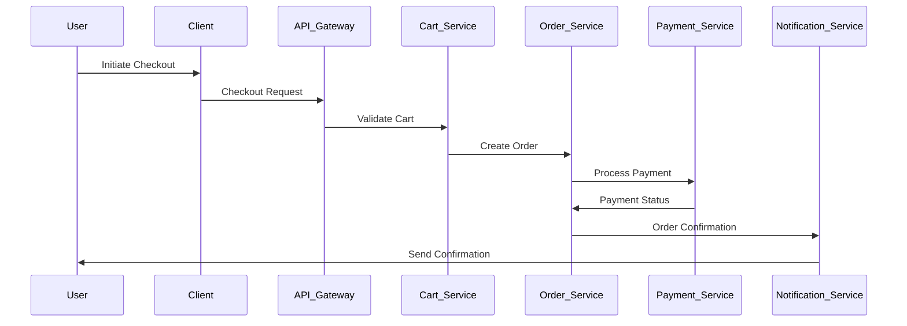
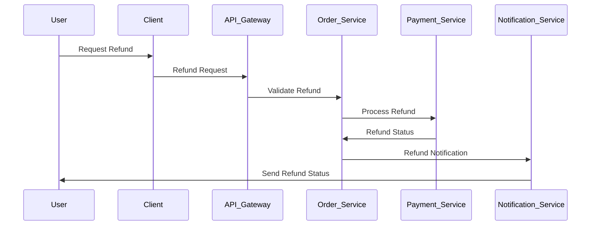

# Low-Level Design (LLD): Online Shopping Platform

## 1. Component Specifications

### 1.1 Authentication & RBAC
- **Technology:** JWT tokens, OAuth2/SAML integration
- **Endpoints:**
  - `/auth/register` (POST): Register user
  - `/auth/login` (POST): Authenticate user
  - `/auth/logout` (POST): End session
- **RBAC Enforcement:** Middleware checks user role per endpoint
- **Password Security:** Argon2 hashing, salted
- **Audit Logging:** Login attempts, role changes

### 1.2 Product Catalog Service
- **Technology:** RESTful API, RDBMS (PostgreSQL), ElasticSearch for search
- **Endpoints:**
  - `/products` (GET): List/search/filter products
  - `/products/{id}` (GET): Product details
  - `/products` (POST): Add product (Seller/Admin)
  - `/products/{id}` (PUT): Update product
  - `/products/{id}` (DELETE): Remove product
- **Inventory Management:** Atomic updates, stock validation
- **Category Management:** CRUD endpoints for categories

### 1.3 Shopping Cart Service
- **Technology:** Redis for session cart, RDBMS for persistent cart
- **Endpoints:**
  - `/cart` (GET): Retrieve cart
  - `/cart` (POST): Add item
  - `/cart/{itemId}` (PUT): Update quantity
  - `/cart/{itemId}` (DELETE): Remove item
- **Real-Time Updates:** WebSocket for cart changes

### 1.4 Order Management Service
- **Technology:** RESTful API, RDBMS
- **Endpoints:**
  - `/orders` (GET): List user orders
  - `/orders` (POST): Place order
  - `/orders/{id}` (GET): Order details
  - `/orders/{id}` (PUT): Update status (Seller/Admin)
- **Status Tracking:** Enum (Pending, Paid, Shipped, Delivered, Cancelled)
- **Audit Logging:** Order creation, status changes

### 1.5 Payment Service
- **Technology:** PCI DSS-compliant integration, Vault for secrets
- **Endpoints:**
  - `/payments` (POST): Initiate payment
  - `/payments/{id}` (GET): Payment status
  - `/payments/refund` (POST): Refund request
- **Encryption:** AES-256 at rest, TLS 1.3 in transit
- **Payment Methods:** Credit/Debit Card, UPI, Net Banking
- **Audit Logging:** All payment events

### 1.6 Notification Service
- **Technology:** Event-driven (RabbitMQ), REST API
- **Endpoints:**
  - `/notifications` (GET): List notifications
  - `/notifications/{id}` (PUT): Mark as read
- **Providers:** Email (SMTP), SMS (Twilio), Push
- **Template Management:** Markdown/HTML templates

### 1.7 Review & Refund Service
- **Technology:** REST API, RDBMS
- **Endpoints:**
  - `/reviews` (POST): Add review
  - `/reviews/{productId}` (GET): List reviews
  - `/refunds` (POST): Initiate refund
- **Validation:** Only after delivery

### 1.8 Dashboards
- **Seller Dashboard:** Product analytics, inventory, order management
- **Admin Dashboard:** Compliance, audit logs, user management

### 1.9 Compliance/Audit Service
- **Technology:** Centralized logging (ELK stack), reporting tools
- **Endpoints:**
  - `/audit/logs` (GET): Retrieve logs
  - `/compliance/report` (GET): Compliance reports
- **Data Retention:** Configurable per GDPR/CCPA

## 2. Data Flows

### 2.1 Registration & Login
1. User submits registration/login via client
2. API Gateway forwards to Auth Service
3. Auth Service validates, hashes password, stores user
4. JWT token issued
5. Audit log created

### 2.2 Product Search & Cart
1. User searches via client
2. API Gateway routes to Product Catalog Service
3. Results returned, user adds to cart
4. Cart Service updates cart (Redis/RDBMS)

### 2.3 Checkout & Payment
1. User proceeds to checkout
2. Cart Service validates items
3. Order Service creates order
4. Payment Service processes payment
5. Payment gateway returns status
6. Notification Service sends confirmation
7. Audit logs for each step

### 2.4 Order Tracking & Notifications
1. User checks order status
2. Order Service returns status
3. Notification Service updates user

### 2.5 Review & Refund
1. User submits review/refund post-delivery
2. Review/Refund Service validates
3. Updates product/order
4. Audit logs

## 3. Sequence Diagrams

### 3.1 Checkout Sequence (Mermaid)

### 3.2 Refund Sequence (Mermaid)

## 4. Implementation Details

- **Programming Languages:** Node.js (backend), React (frontend), Python (microservices)
- **Database:** PostgreSQL, Redis, ElasticSearch
- **Infrastructure:** Docker, Kubernetes, AWS/GCP
- **CI/CD:** GitHub Actions, SonarQube for code quality
- **Secrets Management:** HashiCorp Vault/KMS
- **Monitoring:** ELK Stack, Prometheus, Grafana
- **Accessibility:** WCAG 2.1 AA compliance
- **Security:** AES-256 encryption, TLS 1.3, RBAC, audit logging, circuit breaker, input validation
- **Compliance:** PCI DSS, GDPR, CCPA

---

**End of LLD Document**
