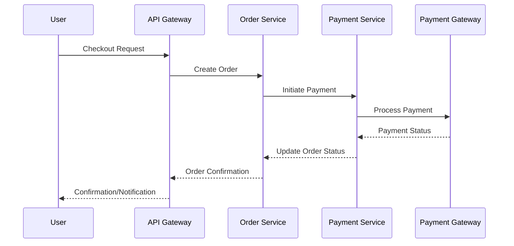
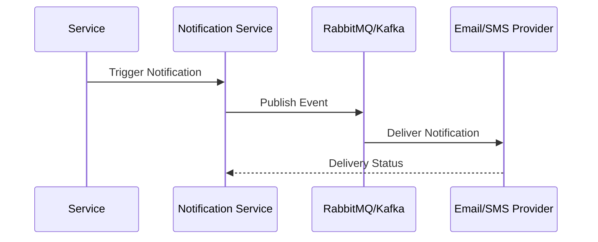

# Low-Level Design (LLD) Document: App1

## 1. Component Specifications

### 1.1 Authentication/Authorization Service
- **Technology**: Node.js/Java (Spring Boot)
- **Endpoints**:
  - `/register` (POST): User registration, stores encrypted credentials
  - `/login` (POST): JWT issuance, session management
  - `/roles` (GET/PUT): RBAC/ABAC management
- **Security**:
  - Input validation, password hashing (bcrypt/argon2)
  - TLS 1.3 enforced
  - Audit logging

### 1.2 User/Profile Service
- **Technology**: Node.js/Java
- **Endpoints**:
  - `/users/{id}` (GET/PUT/DELETE): CRUD for user/profile
- **Data**:
  - User, Profile entities; relational mapping
- **Security**:
  - Role-based access

### 1.3 Catalog Service
- **Technology**: Node.js/Java
- **Endpoints**:
  - `/products` (GET/POST/PUT/DELETE): CRUD for products
  - `/categories` (GET): Product categories
- **Data**:
  - Product, Seller entities
- **Caching**:
  - Redis for product search, session

### 1.4 Cart & Checkout Service
- **Technology**: Node.js/Java
- **Endpoints**:
  - `/cart` (GET/POST/PUT/DELETE): Cart management
  - `/checkout` (POST): Initiate order
- **Data**:
  - Cart, CartItem entities

### 1.5 Order & Payment Service
- **Technology**: Node.js/Java
- **Endpoints**:
  - `/orders` (GET/POST/PUT): Order management
  - `/payment` (POST): Payment initiation
- **Integration**:
  - Payment Gateway (PCI DSS)
- **Data**:
  - Order, OrderItem, Payment entities
- **Security**:
  - PCI DSS compliance, encrypted payment data

### 1.6 Notification Service
- **Technology**: Node.js/Java
- **Endpoints**:
  - `/notifications` (GET/POST): Notification management
- **Integration**:
  - Email/SMS providers
- **Messaging**:
  - RabbitMQ/Kafka

### 1.7 Review Service
- **Technology**: Node.js/Java
- **Endpoints**:
  - `/reviews` (GET/POST): Review management
- **Data**:
  - Review entity

### 1.8 Dashboard Service
- **Technology**: Node.js/Java
- **Endpoints**:
  - `/dashboard/admin` (GET): Admin metrics
  - `/dashboard/seller` (GET): Seller metrics
- **Data**:
  - Aggregation from all entities

### 1.9 Refunds Service
- **Technology**: Node.js/Java
- **Endpoints**:
  - `/refunds` (GET/POST): Refund management
- **Data**:
  - Refund entity

## 2. Data Flows

### Registration/Login
```
User → API Gateway → Authentication Service → DB
```
- Credentials encrypted, role assigned, JWT returned.

### Product Browsing/Search
```
User → API Gateway → Catalog Service → DB/Redis
```
- Search/filter handled, cache for performance.

### Cart Operations
```
User → API Gateway → Cart Service → DB
```
- Add/update/remove items, cart status tracked.

### Checkout/Order/Payment
```
User → API Gateway → Order Service → Payment Service → Payment Gateway
```
- Payment request, PCI DSS validation, status update.

### Notifications
```
Order/Refund Events → Notification Service → RabbitMQ/Kafka → Email/SMS Providers
```
- Asynchronous delivery, retry logic.

### Reviews
```
User → API Gateway → Review Service → DB
```
- Review creation, rating update.

### Refunds
```
User/Admin → API Gateway → Refunds Service → DB
```
- Refund request, processing, status update.

## 3. Sequence Diagrams

### 3.1 Order Placement & Payment


### 3.2 Notification Delivery


## 4. Implementation Details

- **API Gateway**: NGINX/Kong for routing, TLS termination
- **Microservices**: Dockerized, orchestrated via Kubernetes
- **DB**: PostgreSQL/MySQL, encrypted at rest
- **Cache**: Redis for sessions/search
- **Messaging**: RabbitMQ/Kafka for async events
- **Secrets**: Vault/KMS for secret management
- **Audit Logging**: Centralized ELK stack
- **CI/CD**: GitHub Actions, vulnerability scanning
- **Compliance**: PCI DSS, GDPR/CCPA, WCAG 2.1 AA
- **Error Handling**: Circuit breaker, retry logic, user-friendly responses

## 5. Security & Compliance

- Input validation, output filtering
- TLS 1.3 for all endpoints
- AES-256 for data at rest
- RBAC/ABAC enforced
- Audit logs for sensitive actions
- Data retention/deletion policies
- Consent management
- Data lineage tracking
- Vulnerability scanning

## 6. Accessibility & Performance

- SPA frontend (React/Angular) WCAG 2.1 AA compliant
- Caching for performance
- Horizontal scaling via Kubernetes

---

*This LLD is generated based on the HLD requirements and covers all architectural components, data flows, sequence diagrams, and implementation details as per compliance and security standards.*
