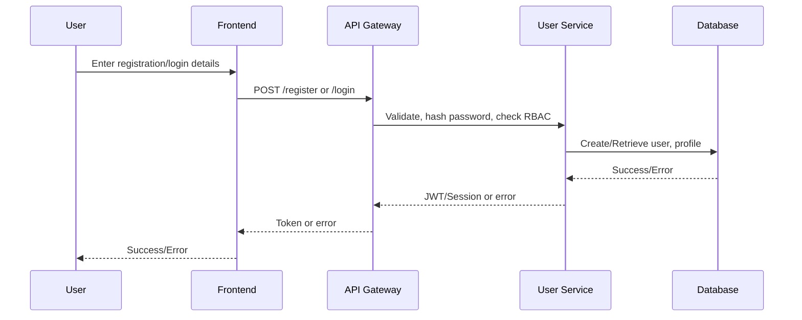
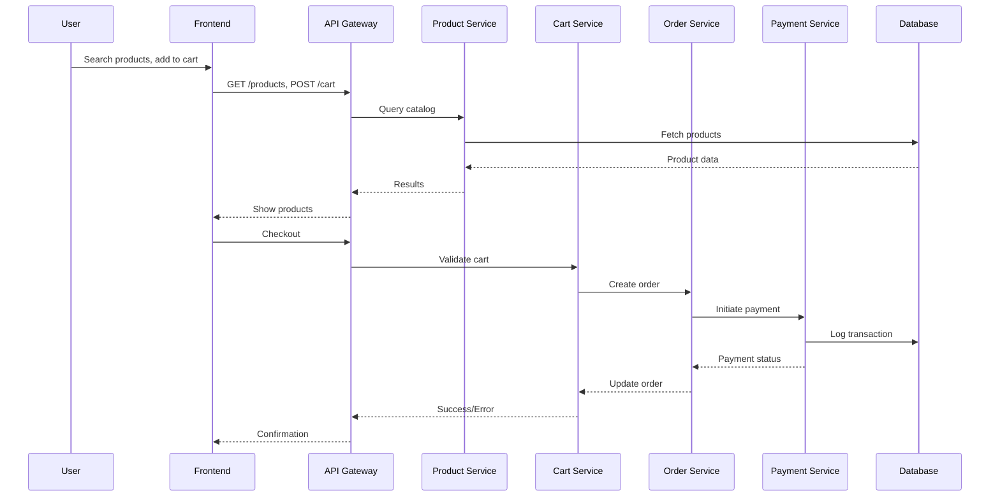
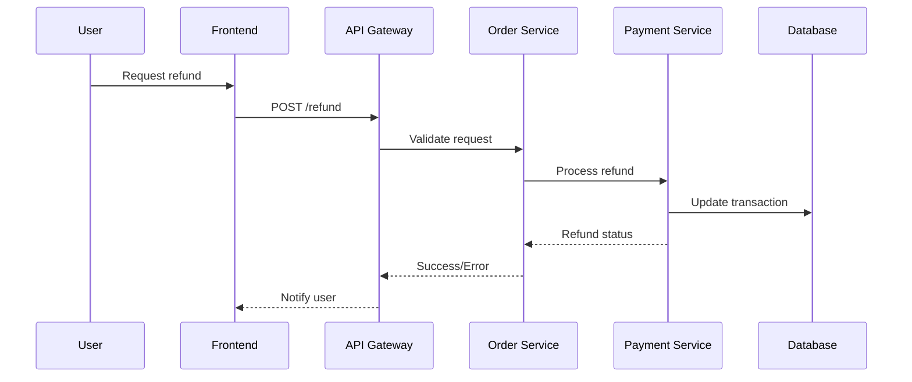

# Low-Level Design (LLD) for APB_Demo: Apptest

## 1. Component Specifications

### 1.1 User Service
- **Authentication:** OAuth2, JWT tokens, password hashing (bcrypt), session management.
- **RBAC:** Role-based access control, permission checks at API gateway and service layer.
- **Profile Management:** CRUD operations on Profile entity, validation (address, phone, preferences), linkage to User.
- **Audit Logging:** Log all authentication and profile changes, user actions.

### 1.2 Product Service
- **Catalog:** RESTful APIs for CRUD, search, filter (category, price, status), pagination, indexing (Elasticsearch).
- **Recommendations:** Plug-in interface for future recommendation engine.
- **Reviews:** API endpoints for CRUD, moderation, rating aggregation.

### 1.3 Cart & Checkout Service
- **Cart Management:** CRUD on Cart/CartItem, session/user linkage, concurrency handling.
- **Checkout:** Validation (stock, user status), order summary, price calculation, integration with Payment Service.

### 1.4 Order Service
- **Order Processing:** Order creation, status transitions, linkage to payment/refund, atomic operations.
- **Refunds:** Workflow for refund requests, approval, processing, audit logging.
- **Order Tracking:** Status updates, notifications, user/seller/admin views.

### 1.5 Payment Service
- **Integration:** Payment gateway interface (PCI DSS), support for multiple methods, transaction logs.
- **Security:** Tokenization, sensitive data encryption (AES-256), error handling, retries.

### 1.6 Notification Service
- **Channels:** Email, SMS, Push (configurable), user preferences, retry logic.
- **Templates:** Dynamic content, localization, audit trail.

### 1.7 Dashboard
- **Analytics:** Aggregated queries for sales, refunds, ratings, user activity.
- **Management:** Seller/admin CRUD, RBAC enforcement, export/reporting.

### 1.8 Integration Layer
- **External APIs:** Payment, notifications, future recommendation engine (API clients, error handling, security).

## 2. Data Flows

### 2.1 User Registration/Login

### 2.2 Product Search & Checkout

## 3. Sequence Diagrams

### 3.1 Refund Workflow

## 4. Implementation Details

- **Tech Stack:**
    - Frontend: React.js, Redux, TypeScript
    - Backend: Node.js (Express.js/NestJS), REST APIs, microservices
    - Database: PostgreSQL (RDBMS), MongoDB (logs/notifications)
    - Caching: Redis
    - Message Queue: RabbitMQ/Kafka (async tasks)
    - Storage: AWS S3 (images, assets)
    - CI/CD: GitHub Actions, Docker, Kubernetes
- **Security:**
    - Input sanitization, output encoding
    - HTTPS/TLS 1.3 everywhere
    - JWT expiration and refresh
    - Secrets in Vault/KMS
    - PCI DSS, GDPR compliance
- **Monitoring & Logging:**
    - Centralized logging (ELK/EFK stack)
    - Metrics: Prometheus, Grafana
    - Alerting: PagerDuty, Slack integration
- **Testing:**
    - Unit, integration, and E2E tests (Jest, Cypress)
    - Automated security scans (Snyk, Trivy)
- **Accessibility:**
    - WCAG 2.1 AA compliance, ARIA roles, keyboard navigation
- **Deployment:**
    - Blue/Green deployments, canary releases
    - Rollback and audit trails

---

**End of LLD for Apptest**
