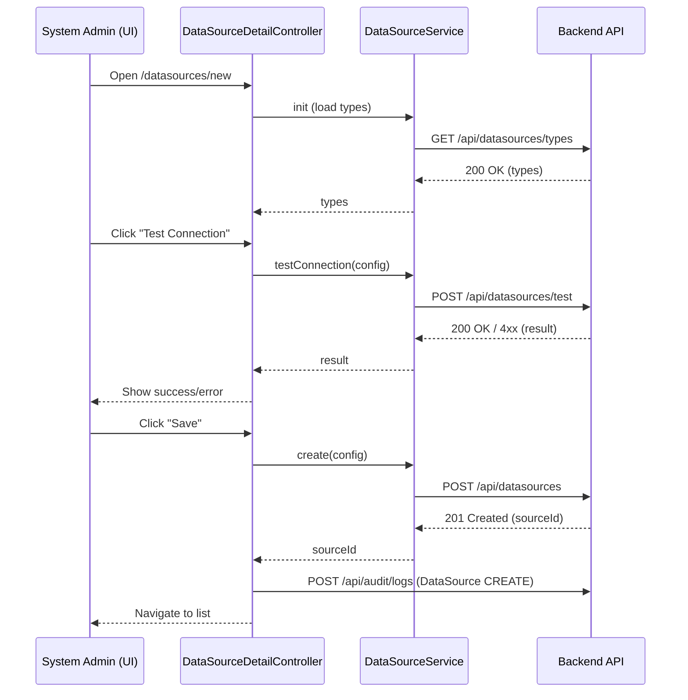
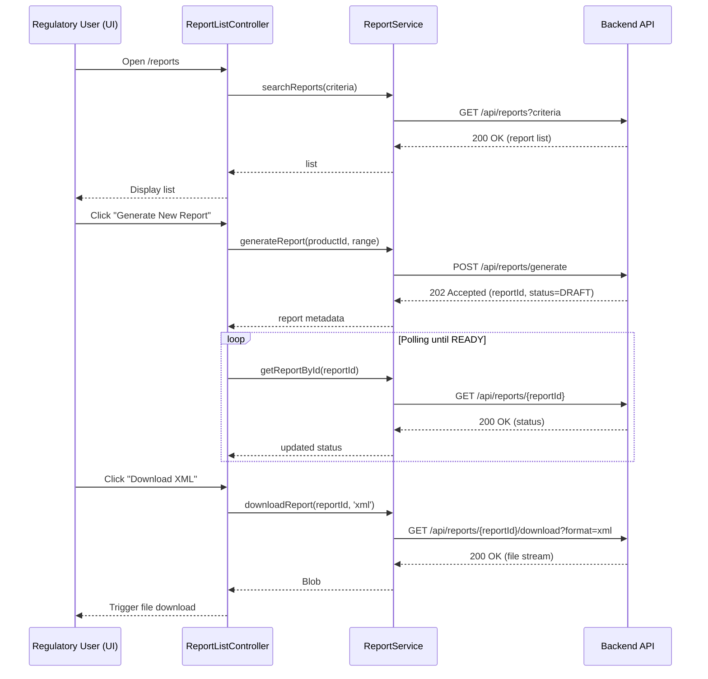
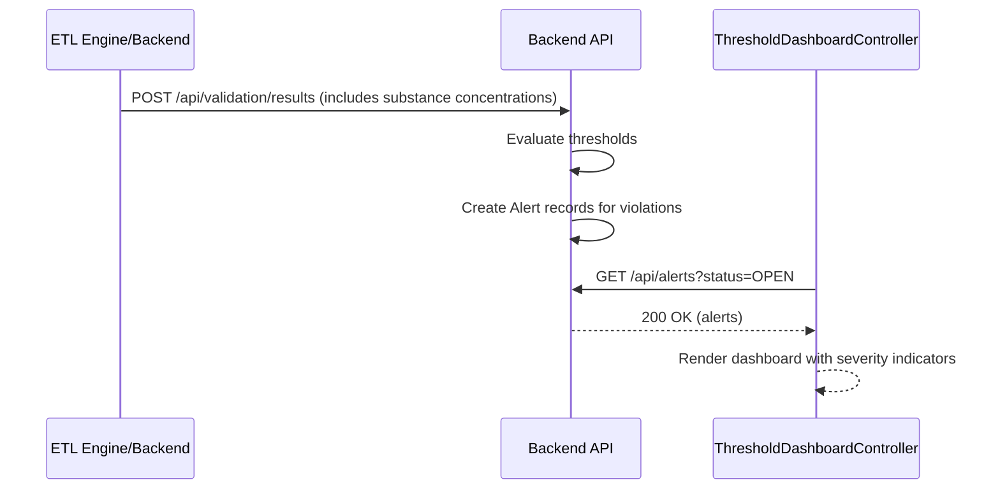

# Low-Level Design (LLD) – ETL Data Management for EUMDR Compliance (AngularJS 1.x Web Application)

> Epic: Implement ETL Data Management capabilities for EUMDR
> Scope of this LLD: AngularJS (1.x) web application layer that provides UI, orchestration, monitoring, configuration, and reporting capabilities on top of an existing ETL / services backend.

---
## 1. Application Architecture (AngularJS 1.x)

### 1.1 Module Structure

```text
app/
 ├─ index.html
 ├─ app.js                         (root module & route config)
 ├─ config/
 │   ├─ app.config.js              (constants, env, logging)
 │   ├─ app.routes.js              (ui-router states)
 │   └─ http.config.js             ($http, interceptors, CSRF)
 ├─ core/
 │   ├─ services/
 │   │   ├─ auth.service.js
 │   │   ├─ notification.service.js
 │   │   ├─ logger.service.js
 │   │   ├─ audit.service.js
 │   │   └─ lookup.service.js
 │   └─ directives/
 │       ├─ loading-spinner.directive.js
 │       └─ access-control.directive.js
 ├─ datasource/
 │   ├─ datasource.module.js
 │   ├─ datasource.routes.js
 │   ├─ services/datasource.service.js
 │   ├─ controllers/datasource-list.controller.js
 │   ├─ controllers/datasource-detail.controller.js
 │   └─ views/
 │       ├─ datasource-list.html
 │       └─ datasource-detail.html
 ├─ etl-jobs/
 │   ├─ etl-jobs.module.js
 │   ├─ etl-jobs.routes.js
 │   ├─ services/etl-job.service.js
 │   ├─ controllers/etl-job-list.controller.js
 │   ├─ controllers/etl-job-detail.controller.js
 │   └─ views/
 │       ├─ etl-job-list.html
 │       └─ etl-job-detail.html
 ├─ validation/
 │   ├─ validation.module.js
 │   ├─ validation.routes.js
 │   ├─ services/validation-rule.service.js
 │   ├─ controllers/validation-rule-list.controller.js
 │   ├─ controllers/validation-rule-detail.controller.js
 │   ├─ controllers/validation-result-list.controller.js
 │   └─ views/
 │       ├─ validation-rule-list.html
 │       ├─ validation-rule-detail.html
 │       └─ validation-result-list.html
 ├─ compliance/
 │   ├─ compliance.module.js
 │   ├─ compliance.routes.js
 │   ├─ services/report.service.js
 │   ├─ controllers/report-list.controller.js
 │   ├─ controllers/report-detail.controller.js
 │   └─ views/
 │       ├─ report-list.html
 │       └─ report-detail.html
 ├─ thresholds/
 │   ├─ thresholds.module.js
 │   ├─ thresholds.routes.js
 │   ├─ services/threshold.service.js
 │   ├─ controllers/threshold-list.controller.js
 │   ├─ controllers/threshold-detail.controller.js
 │   └─ views/
 │       ├─ threshold-list.html
 │       └─ threshold-detail.html
 ├─ scip/
 │   ├─ scip.module.js
 │   ├─ scip.routes.js
 │   ├─ services/scip.service.js
 │   ├─ controllers/scip-submission-list.controller.js
 │   ├─ controllers/scip-submission-detail.controller.js
 │   └─ views/
 │       ├─ scip-submission-list.html
 │       └─ scip-submission-detail.html
 ├─ audit/
 │   ├─ audit.module.js
 │   ├─ audit.routes.js
 │   ├─ services/audit-trail.service.js
 │   ├─ controllers/audit-list.controller.js
 │   └─ views/audit-list.html
 └─ shared/
     ├─ components/
     │   ├─ pagination.directive.js
     │   ├─ table-sort.directive.js
     │   └─ alert-panel.directive.js
     └─ filters/
         ├─ date-utc.filter.js
         ├─ status-label.filter.js
         └─ severity-label.filter.js
```

#### Core AngularJS Modules

- `eumdrApp` – root module
- Feature modules:
  - `eumdrApp.datasource`
  - `eumdrApp.etlJobs`
  - `eumdrApp.validation`
  - `eumdrApp.compliance`
  - `eumdrApp.thresholds`
  - `eumdrApp.scip`
  - `eumdrApp.audit`
  - `eumdrApp.shared`

Each feature module encapsulates controllers, services, views, and routes specific to that functional area.

---
## 2. Component Specifications

Below list is representative for core flows covered by the HLD / epic. File paths are relative to `app/`.

### 2.1 Data Source Management Components

#### 2.1.1 Service: `DataSourceService`
- **File:** `datasource/services/datasource.service.js`
- **AngularJS Type:** Service (`.service`)
- **Responsibilities:**
  - CRUD operations for data sources
  - Connection testing endpoint invocation
  - Sensitive field redaction on UI side
- **Public Methods:**
  - `getAll(params)` – fetch paged list of data sources
  - `getById(sourceId)` – fetch single data source
  - `create(dataSource)` – create new data source
  - `update(sourceId, dataSource)` – update existing
  - `testConnection(dataSource)` – call backend test endpoint
  - `deactivate(sourceId)` – set `isActive=false`
- **Dependencies:** `$http`, `$q`, `LoggerService`, `AuditService`, `ENV_CONFIG`
- **REST Endpoints Used:**
  - `GET /api/datasources`
  - `GET /api/datasources/{id}`
  - `POST /api/datasources`
  - `PUT /api/datasources/{id}`
  - `POST /api/datasources/test`
  - `PATCH /api/datasources/{id}/deactivate`

#### 2.1.2 Controller: `DataSourceListController`
- **File:** `datasource/controllers/datasource-list.controller.js`
- **Responsibilities:**
  - Display list of data sources
  - Filter by name/type/status
  - Navigate to detail/edit screen
- **Scope/ViewModel (`vm`) Properties:**
  - `vm.dataSources: DataSource[]`
  - `vm.filter = { name, type, isActive }`
  - `vm.pagination = { page, pageSize, total }`
  - `vm.isLoading: boolean`
- **Methods:**
  - `vm.loadDataSources()` – queries API with filter & pagination
  - `vm.onFilterChange()` – reloads first page
  - `vm.goToDetail(sourceId)` – `$state.go('datasource.detail', { id: sourceId })`
- **Dependencies:** `DataSourceService`, `$state`, `NotificationService`, `LoggerService`

#### 2.1.3 Controller: `DataSourceDetailController`
- **File:** `datasource/controllers/datasource-detail.controller.js`
- **Responsibilities:**
  - Create / edit data source configuration
  - Invoke connection test
  - Ensure secure handling of credentials (masked on load)
- **Properties:**
  - `vm.dataSource: DataSource`
  - `vm.isEditMode: boolean`
  - `vm.testResult: { success, message }`
  - `vm.isTesting: boolean`
- **Methods:**
  - `vm.init()` – if edit, load by id
  - `vm.save()` – create/update via service
  - `vm.testConnection()` – call `DataSourceService.testConnection`
- **Dependencies:** `DataSourceService`, `$stateParams`, `$state`, `NotificationService`, `AuditService`

### 2.2 ETL Job Monitoring Components

#### 2.2.1 Service: `EtlJobService`
- **File:** `etl-jobs/services/etl-job.service.js`
- **Responsibilities:**
  - Interact with ETL job backend (NiFi/Talend façade REST)
  - Start/stop jobs, fetch status & logs
- **Public Methods:**
  - `getJobs(params)` – list jobs
  - `getJobById(jobId)`
  - `triggerNow(jobId)` – manual run
  - `getJobRuns(jobId, params)` – historical runs
- **Endpoints:**
  - `GET /api/etl/jobs`
  - `GET /api/etl/jobs/{jobId}`
  - `POST /api/etl/jobs/{jobId}/run`
  - `GET /api/etl/jobs/{jobId}/runs`

#### 2.2.2 Controller: `EtlJobListController`
- **File:** `etl-jobs/controllers/etl-job-list.controller.js`
- **Responsibilities:**
  - Present job list (type, scheduleTime, status, lastRunTime, errorCount)
  - Allow manual trigger where permitted
- **Key Methods:**
  - `vm.loadJobs()`
  - `vm.runJob(job)` – call `EtlJobService.triggerNow(job.jobId)`

#### 2.2.3 Controller: `EtlJobDetailController`
- **File:** `etl-jobs/controllers/etl-job-detail.controller.js`
- **Responsibilities:**
  - Show job configuration and recent runs
  - Display metrics: `recordsProcessed`, `errorCount`, duration

### 2.3 Validation Rule Management & Results

#### 2.3.1 Service: `ValidationRuleService`
- **File:** `validation/services/validation-rule.service.js`
- **Responsibilities:**
  - CRUD for validation rules
  - Activate/deactivate rules
- **Methods:**
  - `getRules(params)`
  - `getRuleById(ruleId)`
  - `createRule(rule)`
  - `updateRule(ruleId, rule)`
  - `setActive(ruleId, isActive)`
- **Endpoints:**
  - `GET /api/validation/rules`
  - `GET /api/validation/rules/{id}`
  - `POST /api/validation/rules`
  - `PUT /api/validation/rules/{id}`
  - `PATCH /api/validation/rules/{id}/status`

#### 2.3.2 Controller: `ValidationRuleListController`
- **File:** `validation/controllers/validation-rule-list.controller.js`
- **Responsibilities:**
  - List and filter rules (by type, severity, isActive)

#### 2.3.3 Controller: `ValidationRuleDetailController`
- **File:** `validation/controllers/validation-rule-detail.controller.js`
- **Responsibilities:**
  - Create/edit rule details including expression, regulatory basis
  - Show rule version history (if provided by backend)

#### 2.3.4 Service: `ValidationResultService`
- **File:** `validation/services/validation-result.service.js`
- **Responsibilities:**
  - Fetch validation run results and summaries
- **Endpoints:**
  - `GET /api/validation/results`
  - `GET /api/validation/results/{runId}`

#### 2.3.5 Controller: `ValidationResultListController`
- **File:** `validation/controllers/validation-result-list.controller.js`
- **Responsibilities:**
  - Show per-run statistics and detailed record issues

### 2.4 Compliance Report Management

#### 2.4.1 Service: `ReportService`
- **File:** `compliance/services/report.service.js`
- **Responsibilities:**
  - Search and generate EUMDR compliance reports
  - Download reports in XML/PDF
- **Methods:**
  - `searchReports(params)`
  - `getReportById(reportId)`
  - `generateReport(criteria)`
  - `downloadReport(reportId, format)` – returns file blob
- **Endpoints:**
  - `GET /api/reports`
  - `GET /api/reports/{id}`
  - `POST /api/reports/generate`
  - `GET /api/reports/{id}/download?format={xml|pdf}`

#### 2.4.2 Controller: `ReportListController`
- **File:** `compliance/controllers/report-list.controller.js`
- **Responsibilities:**
  - Search by productId, date range, submissionRef, status
  - Launch new report generation

#### 2.4.3 Controller: `ReportDetailController`
- **File:** `compliance/controllers/report-detail.controller.js`
- **Responsibilities:**
  - Display report metadata and status
  - Provide links for XML/PDF download

### 2.5 Threshold & Alert Management

#### 2.5.1 Service: `ThresholdService`
- **File:** `thresholds/services/threshold.service.js`
- **Responsibilities:**
  - Manage substance threshold configurations and alerts
- **Methods:**
  - `getThresholds(params)`
  - `getThreshold(id)`
  - `createThreshold(threshold)`
  - `updateThreshold(id, threshold)`
  - `getActiveAlerts(params)`
- **Endpoints:**
  - `GET /api/thresholds`
  - `GET /api/thresholds/{id}`
  - `POST /api/thresholds`
  - `PUT /api/thresholds/{id}`
  - `GET /api/alerts`

#### 2.5.2 Controller: `ThresholdListController`
- **File:** `thresholds/controllers/threshold-list.controller.js`

#### 2.5.3 Controller: `ThresholdDetailController`
- **File:** `thresholds/controllers/threshold-detail.controller.js`

### 2.6 SCIP Submission UI

#### 2.6.1 Service: `ScipService`
- **File:** `scip/services/scip.service.js`
- **Responsibilities:**
  - Prepare submissions, trigger API calls to backend SCIP connector
  - Track submission status
- **Methods:**
  - `searchSubmissions(params)`
  - `getSubmission(submissionId)`
  - `prepareSubmission(criteria)`
  - `submit(submissionId)`
  - `refreshStatus(submissionId)`
- **Endpoints:**
  - `GET /api/scip/submissions`
  - `GET /api/scip/submissions/{id}`
  - `POST /api/scip/submissions/prepare`
  - `POST /api/scip/submissions/{id}/submit`
  - `GET /api/scip/submissions/{id}/status`

#### 2.6.2 Controllers: `ScipSubmissionListController`, `ScipSubmissionDetailController`
- List/search all submissions; view status, errors, and resubmit if necessary.

### 2.7 Audit Trail

#### 2.7.1 Service: `AuditTrailService`
- **File:** `audit/services/audit-trail.service.js`
- **Responsibilities:**
  - Read-only access to audit logs for UI search
- **Methods:**
  - `searchAuditLogs(params)` – filter by entityType, entityId, userId, date range, action
- **Endpoints:**
  - `GET /api/audit/logs`

#### 2.7.2 Controller: `AuditListController`
- **File:** `audit/controllers/audit-list.controller.js`

### 2.8 Shared Components

- `loadingSpinner` directive – shows spinner during async operations.
- `accessControl` directive – show/hide DOM elements based on RBAC/ABAC.
- `alertPanel` directive – standardized message panel for errors/warnings/info.
- `pagination` directive – generic paging controls.
- Filters: `dateUtc`, `statusLabel`, `severityLabel`.

---
## 3. Interface Specifications

### 3.1 Controller–Service Interactions

- Controllers never use `$http` directly.
- All asynchronous operations return `$q` promises.
- Controllers handle success/error and propagate notifications via `NotificationService`.

Example for `DataSourceDetailController.save()`:

```javascript
vm.save = function() {
  vm.isSaving = true;
  DataSourceService[vm.isEditMode ? 'update' : 'create'](vm.dataSourceId, vm.dataSource)
    .then(function(response) {
      NotificationService.success('Data source saved successfully');
      AuditService.logEntityChange('DataSource', response.data.sourceId, vm.isEditMode ? 'UPDATE' : 'CREATE');
      $state.go('datasource.list');
    })
    .catch(function(error) {
      LoggerService.error('Failed to save data source', error);
      NotificationService.error('Failed to save data source. Please review errors.');
    })
    .finally(function() { vm.isSaving = false; });
};
```

### 3.2 REST API Contracts (Front-end Perspective)

**DataSource**
- Request/Response JSON (simplified):

```json
{
  "sourceId": "string",
  "sourceName": "SAP ERP",
  "sourceType": "ERP | PLM | SUBSTANCE_DB | FILE",
  "connectionString": "string (masked in UI)",
  "isActive": true,
  "createdDate": "2024-05-20T10:20:30Z"
}
```

**ETLJob**

```json
{
  "jobId": "ETL_RESTRICTED_SUBSTANCES_DAILY",
  "sourceId": "ERP_MAIN",
  "jobType": "EXTRACT | TRANSFORM | LOAD | FULL_ETL",
  "scheduleTime": "02:00",
  "status": "ENABLED | DISABLED",
  "lastRunTime": "2024-05-21T02:00:45Z",
  "recordsProcessed": 12345,
  "errorCount": 3
}
```

**ValidationRule**

```json
{
  "ruleId": 1001,
  "ruleName": "SVHC Threshold Check",
  "ruleType": "MANDATORY_FIELD | BUSINESS_RULE | CONSISTENCY",
  "expression": "concentration <= 0.1",
  "severity": "ERROR | WARNING",
  "isActive": true,
  "regulatoryBasis": "EUMDR 2017/745 Art. X; REACH 1907/2006"
}
```

**ComplianceReport**

```json
{
  "reportId": 2001,
  "productId": "PROD-001",
  "reportType": "EUMDR_RESTRICTED_SUBSTANCES",
  "generatedDate": "2024-05-21T10:00:00Z",
  "submissionRef": "EUDAMED-REF-123",
  "status": "DRAFT | READY_FOR_SUBMISSION | SUBMITTED | REJECTED",
  "digitalSignature": "<omitted>",
  "retentionDate": "2034-05-21T00:00:00Z"
}
```

**AuditTrail** (UI read model)

```json
{
  "auditId": 90001,
  "entityType": "DataSource",
  "entityId": "ERP_MAIN",
  "action": "CREATE | UPDATE | DELETE | ACCESS | LOGIN | LOGOUT",
  "oldValue": "{}",
  "newValue": "{}",
  "userId": "reg-admin",
  "timestamp": "2024-05-20T11:00:00Z",
  "ipAddress": "10.1.1.5"
}
```

### 3.3 External Interface Expectations

The AngularJS app assumes the following backend capabilities based on HLD:

- All APIs served over HTTPS with TLS 1.3.
- OAuth2 / SAML-based authentication; Angular interacts via bearer tokens stored in memory (not localStorage) to minimize XSS risk.
- CSRF protection for state-changing operations using token header.
- Standard error envelope:

```json
{
  "timestamp": "2024-05-21T10:20:30Z",
  "correlationId": "uuid",
  "message": "User-friendly message",
  "details": [
    {
      "code": "VALIDATION_ERROR",
      "field": "sourceName",
      "description": "Source name is required"
    }
  ]
}
```

---
## 4. Data Model Design (Front-End View Models)

The backend owns canonical domain models (DataSource, ETLJob, Substance, Product, ProductSubstance, ValidationRule, AuditTrail, ComplianceReport). In AngularJS we define TypeScript-like JSDoc typings for clarity.

### 4.1 View Model Definitions

```javascript
/** @typedef {Object} DataSourceVM
 *  @property {string} sourceId
 *  @property {string} sourceName
 *  @property {string} sourceType
 *  @property {string} connectionStringMasked
 *  @property {boolean} isActive
 *  @property {string} createdDate // ISO-8601
 */

/** @typedef {Object} EtlJobVM
 *  @property {string} jobId
 *  @property {string} sourceId
 *  @property {string} jobType
 *  @property {string} scheduleTime
 *  @property {string} status
 *  @property {string} lastRunTime
 *  @property {number} recordsProcessed
 *  @property {number} errorCount
 */

/** @typedef {Object} ValidationRuleVM
 *  @property {number} ruleId
 *  @property {string} ruleName
 *  @property {string} ruleType
 *  @property {string} expression
 *  @property {string} severity
 *  @property {boolean} isActive
 *  @property {string} regulatoryBasis
 */

/** @typedef {Object} ValidationResultVM
 *  @property {string} runId
 *  @property {string} runDate
 *  @property {number} totalRecords
 *  @property {number} failedRecords
 *  @property {Array<Object>} errors
 */

/** @typedef {Object} ComplianceReportVM
 *  @property {number} reportId
 *  @property {string} productId
 *  @property {string} reportType
 *  @property {string} generatedDate
 *  @property {string} submissionRef
 *  @property {string} status
 *  @property {string} retentionDate
 */

/** @typedef {Object} ThresholdVM
 *  @property {number} thresholdId
 *  @property {string} substanceId
 *  @property {number} limitValue
 *  @property {string} unit
 *  @property {number} warningLevelPercent
 *  @property {number} criticalLevelPercent
 *  @property {boolean} isActive
 *  @property {string} regulatoryBasis
 */

/** @typedef {Object} AlertVM
 *  @property {number} alertId
 *  @property {string} substanceId
 *  @property {string} productId
 *  @property {string} severity
 *  @property {number} value
 *  @property {number} limitValue
 *  @property {string} status
 *  @property {string} createdDate
 */

/** @typedef {Object} ScipSubmissionVM
 *  @property {string} submissionId
 *  @property {string} productId
 *  @property {string} status
 *  @property {string} referenceNumber
 *  @property {string} createdDate
 *  @property {string} lastUpdatedDate
 */

/** @typedef {Object} AuditLogVM
 *  @property {number} auditId
 *  @property {string} entityType
 *  @property {string} entityId
 *  @property {string} action
 *  @property {string} userId
 *  @property {string} timestamp
 *  @property {string} ipAddress
 */
```

### 4.2 Client-Side Validations

- `DataSource`:
  - `sourceName`: required, max length 128
  - `sourceType`: required, enumeration
  - `connectionString`: required, pattern based on type (DB, REST, FILE); never logged.
- `ValidationRule`:
  - `ruleName`: required, unique combination with `ruleType`
  - `expression`: required, validated by backend parser; front-end checks non-empty.
- `Threshold`:
  - `limitValue`: numeric > 0
  - `warningLevelPercent` < `criticalLevelPercent` ≤ 100

---
## 5. Data Flow Descriptions

### 5.1 Configure Data Source

1. User (System Administrator) navigates to `#/datasources`.
2. `DataSourceListController` loads existing data sources via `DataSourceService.getAll()`.
3. User clicks "Create" → route `#/datasources/new` handled by `DataSourceDetailController`.
4. User fills in fields and clicks "Test Connection".
   - Controller calls `DataSourceService.testConnection(data)`.
   - Service invokes `POST /api/datasources/test`.
   - Backend returns success/failure with details.
5. On success, user clicks "Save".
6. Controller calls `DataSourceService.create(data)`.
7. On success, `AuditService.logEntityChange('DataSource', id, 'CREATE')` is called and the UI navigates back to list.

### 5.2 Run Scheduled Extraction & Show Status

- Scheduled runs are initiated by backend/ETL engine. The UI consumes job status.
1. User opens ETL Jobs page `#/etl-jobs`.
2. `EtlJobListController` invokes `EtlJobService.getJobs()`.
3. Backend returns job definitions and last run stats.
4. For manual run, controller calls `EtlJobService.triggerNow(jobId)`.
5. A polling mechanism (e.g., `$interval`) periodically calls `getJobs()` to refresh run status and metrics.

### 5.3 Validation Results Drill-Down

1. QA user navigates to `#/validation/results`.
2. `ValidationResultListController` calls `ValidationResultService.getRuns(params)`.
3. User selects a specific run; details are loaded via `GET /api/validation/results/{runId}`.
4. Errors are shown grouped by rule severity and type.

### 5.4 Report Generation & Download

1. Regulatory user opens `#/reports`.
2. `ReportListController` executes search via `ReportService.searchReports()`.
3. To generate a new report, user opens a dialog/form specifying product and date range.
4. `ReportService.generateReport(criteria)` triggers `POST /api/reports/generate`.
5. Backend responds with `reportId` and initial `status='DRAFT'`.
6. UI transitions to detail view and shows progress (polling `getReportById`).
7. Once `status='READY_FOR_SUBMISSION'`, user can click "Download XML" or "Download PDF"; `downloadReport` triggers file download with proper headers.

### 5.5 SCIP Submission Flow

1. User selects a product and timeframe, then clicks "Prepare SCIP Submission".
2. `ScipService.prepareSubmission(criteria)` posts to `/api/scip/submissions/prepare`.
3. Backend builds IUCLID package and returns `submissionId`.
4. After validation, user presses "Submit".
5. `ScipService.submit(submissionId)` calls backend; backend communicates with ECHA SCIP.
6. Submission status is polled using `refreshStatus(submissionId)`.

---
## 6. Mermaid Sequence Diagrams

### 6.1 Configure Data Source & Test Connection



### 6.2 Generate EUMDR Compliance Report



### 6.3 Threshold Alert Generation (Read Only from UI Perspective)



---
## 7. Implementation Details

### 7.1 AngularJS Coding Patterns

- Use `controllerAs vm` syntax; avoid `$scope` where possible.
- All modules declared with explicit dependency lists, e.g.:

```javascript
angular.module('eumdrApp.datasource', ['ui.router', 'eumdrApp.shared']);
```

- Services defined as named functions, DI annotated for minification:

```javascript
angular
  .module('eumdrApp.datasource')
  .service('DataSourceService', DataSourceService);

DataSourceService.$inject = ['$http', '$q', 'ENV_CONFIG', 'LoggerService'];
function DataSourceService($http, $q, ENV_CONFIG, LoggerService) {
  var baseUrl = ENV_CONFIG.apiBaseUrl + '/datasources';

  this.getAll = function(params) {
    return $http.get(baseUrl, { params: params })
      .then(handleSuccess)
      .catch(handleError);
  };
  // ... other methods ...

  function handleSuccess(response) { return response; }
  function handleError(error) {
    LoggerService.error('DataSource API error', error);
    return $q.reject(error);
  }
}
```

### 7.2 Dependency Injection & State Management

- DI via `$inject` arrays to ensure minification safety.
- Application-level state (current user, roles, auth token, environment) stored in an `AuthService` and `ENV_CONFIG` constant; transient UI filters stored in controllers only.
- No global variables in `window` scope.

### 7.3 API Integration

- All HTTP calls go through:
  - Base URL from `ENV_CONFIG.apiBaseUrl`.
  - `$http` defaults configured in `http.config.js` for:
    - `X-Requested-With: XMLHttpRequest`
    - CSRF header (`X-CSRF-TOKEN`) if cookie available
    - `Authorization: Bearer <token>` from `AuthService`.
- HTTP interceptor `AuthInterceptor` handles 401/403 responses and redirects to login.

### 7.4 Routing & Navigation

- Implemented using `ui.router` with state-based routing.

Example for DataSource states:

```javascript
$stateProvider
  .state('datasource', {
    abstract: true,
    url: '/datasources',
    template: '<ui-view></ui-view>',
    data: { roles: ['SYSTEM_ADMIN'] }
  })
  .state('datasource.list', {
    url: '',
    templateUrl: 'datasource/views/datasource-list.html',
    controller: 'DataSourceListController',
    controllerAs: 'vm'
  })
  .state('datasource.new', {
    url: '/new',
    templateUrl: 'datasource/views/datasource-detail.html',
    controller: 'DataSourceDetailController',
    controllerAs: 'vm'
  })
  .state('datasource.detail', {
    url: '/:id',
    templateUrl: 'datasource/views/datasource-detail.html',
    controller: 'DataSourceDetailController',
    controllerAs: 'vm'
  });
```

Route guards will be implemented via a state change listener that checks user roles from `AuthService` against `toState.data.roles`.

---
## 8. Configuration

### 8.1 Environment Configuration

**File:** `config/app.config.js`

```javascript
angular
  .module('eumdrApp')
  .constant('ENV_CONFIG', {
    env: 'DEV',
    apiBaseUrl: 'https://dev-api.example.com/api',
    logLevel: 'DEBUG',
    idleTimeoutMinutes: 15
  });
```

Separate build-time replacements for DEV/QA/PROD via CI pipeline (e.g., Gulp/Grunt/webpack replacement task).

### 8.2 Logging Configuration

- `LoggerService` wraps `$log` and sends important events to backend log endpoint `/api/client-logs` in PROD only.
- Log levels: `DEBUG`, `INFO`, `WARN`, `ERROR` based on `ENV_CONFIG.logLevel`.

### 8.3 Feature Toggles

- Optional `FEATURE_FLAGS` constant:
  - `enableScipIntegration`
  - `enableThresholdDashboard`
  - `enableAdvancedAuditSearch`

UI elements are conditionally rendered based on flags.

---
## 9. Error Handling & Resiliency

### 9.1 HTTP Error Handling Pattern

- Central `$http` interceptor `ErrorHandlingInterceptor`:
  - For network errors / 5xx: show generic message, log with correlationId if available.
  - For 4xx validation errors: map backend error fields to form controls.

```javascript
$httpProvider.interceptors.push(['$q', 'NotificationService', 'LoggerService', function($q, NotificationService, LoggerService) {
  return {
    responseError: function(rejection) {
      LoggerService.error('HTTP error', rejection);

      if (rejection.status >= 500) {
        NotificationService.error('A server error occurred. Please try again or contact support.');
      } else if (rejection.status === 400 && rejection.data && rejection.data.details) {
        NotificationService.error('Validation error. Please correct highlighted fields.');
      } else if (rejection.status === 401 || rejection.status === 403) {
        NotificationService.error('You are not authorized to perform this action.');
      }

      return $q.reject(rejection);
    }
  };
}]);
```

### 9.2 UI Resilience Patterns

- Retry UI loads (non-mutating GETs) via user-initiated "Retry" button – no automatic retries in the browser for idempotency and avoiding thundering herd; backend handles exponential backoff.
- All long-running operations (report generation, SCIP submissions) are asynchronous; UI polls status with backoff configuration to avoid overloading backend.

### 9.3 Graceful Degradation

- If certain services (e.g., SCIP integration) are down, UI displays an informative banner and disables corresponding action buttons, while leaving other functionality intact.

---
## 10. Security Considerations

### 10.1 Input Validation & Sanitization

- All user-entered text (names, descriptions, expressions) is validated on the client for length and simple patterns, then re-validated on server.
- Use `ngSanitize` and limit use of `ng-bind-html`; any rich-text fields must be sanitized on the server and rendered via trusted HTML only when explicitly allowed.
- Avoid directly interpolating untrusted data inside `ng-bind-html`; prefer `{{ }}`.

### 10.2 XSS Protection

- Disable AngularJS debug info in production (`$compileProvider.debugInfoEnabled(false)`).
- Use strict contextual escaping; no dynamic script injections.
- Templates are static files served from trusted domain; CSP headers set by server (`script-src 'self'`; `object-src 'none'`).

### 10.3 CSRF Protection

- All state-changing requests must include CSRF header; AngularJS `$http` configured to read `XSRF-TOKEN` cookie and send `X-XSRF-TOKEN` header if backend follows standard.
- For non-cookie-based CSRF schemes, `AuthService` injects token into headers.

### 10.4 Secure API Consumption

- Always use HTTPS endpoints.
- `AuthService` stores access tokens only in memory or secure cookies (HTTPOnly, Secure); no localStorage/sessionStorage to minimize token theft risk.
- On logout, tokens are removed and user is redirected to IdP logout URL if required.

### 10.5 Role-Based & Attribute-Based Access Control

- `accessControl` directive reads roles/attributes from `AuthService.getCurrentUser()`.

```html
<button access-control="['SYSTEM_ADMIN']">Create Data Source</button>
```

- UI hides controls for unauthorized users but backend additionally enforces RBAC/ABAC.

### 10.6 Audit Logging from UI

- UI does not own compliance audit trail (server side), but may send additional context (e.g., front-end correlationId, screen name) in custom headers `X-Client-Context`.
- All sensitive actions (configuration changes, submissions) are logged via backend; UI doesn’t log sensitive data in the browser console.

### 10.7 Privacy & GDPR

- Avoid showing personal data in logs or error messages.
- If any user-related data is shown (e.g., userId in audit logs), only authorized roles (Compliance Officer, Auditor) can access the pages.

---
## 11. Logging, Monitoring & Compliance Hooks

- `LoggerService` includes `addContext(correlationId, userId)` to attach context to subsequent logs.
- For each major operation, controllers log at INFO level (start, success, failure) without including PII or sensitive configuration data (like full connection strings or credentials).
- Backend integrates logs with centralized SIEM; front-end just provides correlation IDs.

---
## 12. Summary of Files Created/Modified

- **New directories:** `datasource/`, `etl-jobs/`, `validation/`, `compliance/`, `thresholds/`, `scip/`, `audit/`, `shared/`
- **Core config:**
  - `config/app.config.js`
  - `config/app.routes.js`
  - `config/http.config.js`
- **Core services:**
  - `core/services/auth.service.js`
  - `core/services/logger.service.js`
  - `core/services/notification.service.js`
  - `core/services/audit.service.js`
- **Feature services/controllers/views** as described in Section 2.

This LLD provides the necessary AngularJS (1.x) design to implement UI and client-side logic supporting the ETL Data Management capabilities for EUMDR compliance, aligned with the provided high-level design and domain model.
