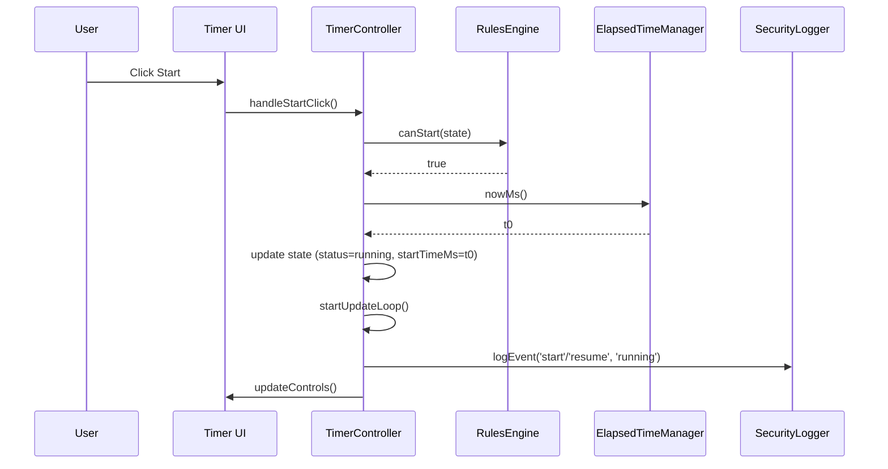
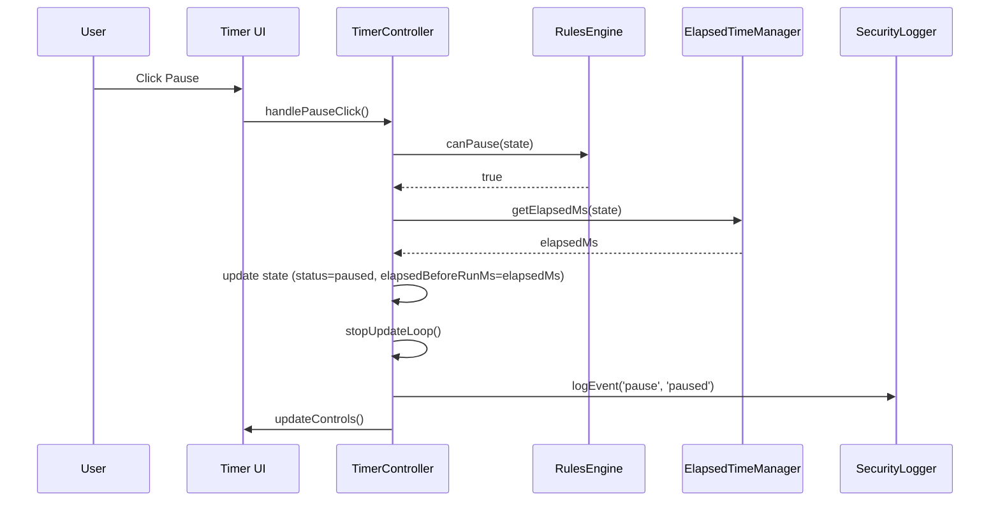
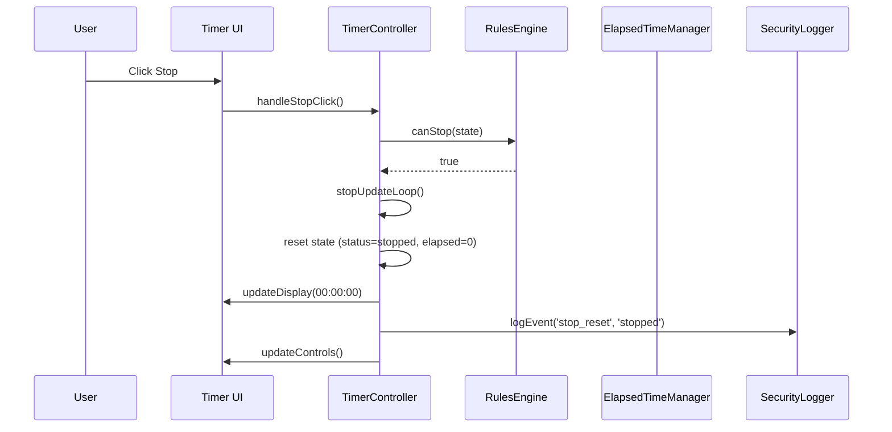

# Low-Level Design (LLD) – Timer Application (Epic QE-2213)

---

## 1. Overview

This Low-Level Design describes the implementation of a browser-based timer application that supports Start, Pause, Resume, and Stop/Reset, showing elapsed time in `HH:MM:SS` format on a white-background page. It is a purely front-end solution using HTML, CSS, and vanilla JavaScript, running entirely in the user’s browser with no backend.

The LLD maps directly to the HLD components:
- Timer UI (HTML/CSS/JS)
- Timer Controller (State & Event Handler)
- Elapsed Time Manager
- Validation & Rules Engine
- Security & Logging Module
- Storage Layer (in-memory state)
- Browser APIs (DOM, `performance.now`, `setInterval` / `requestAnimationFrame`)

All state is in-memory per browser tab; no data is persisted.

---

## 2. Component Specifications

### 2.1 Timer UI (HTML/CSS/JS)

**Technology Stack**
- HTML5
- CSS3
- Vanilla JavaScript (ES6+)

**Files**
- `index.html` – Main HTML document
- `styles.css` – Presentation layer
- `timer.js` – Application logic (controller, manager, rules, logging)

**DOM Structure (Logical)**

```html
<body class="app app--timer">
  <main class="timer" aria-label="Elapsed Time Timer">
    <h1 class="timer__title">Timer</h1>

    <div class="timer__display" id="timer-display" role="timer" aria-live="off">
      00:00:00
    </div>

    <div class="timer__controls" role="group" aria-label="Timer controls">
      <button
        id="btn-start"
        class="btn btn--primary"
        type="button"
      >
        Start
      </button>

      <button
        id="btn-pause"
        class="btn btn--secondary"
        type="button"
        disabled
      >
        Pause
      </button>

      <button
        id="btn-stop"
        class="btn btn--danger"
        type="button"
        disabled
      >
        Stop
      </button>
    </div>

    <section class="timer__log" aria-label="Timer event log" hidden>
      <ul id="timer-log-list" class="timer-log__list"></ul>
    </section>
  </main>
</body>
```

**UI Behaviors**
- Background color: solid white (`#ffffff`).
- Timer display:
  - Initial value `00:00:00` on load.
  - Monospaced or tabular-nums font to prevent layout shift.
- Controls:
  - Start: enabled on initial load.
  - Pause/Stop: disabled until timer first starts.
  - Buttons indicate state through enabled/disabled styling.

### 2.2 Timer Controller (State & Event Handler)

**Module Name**
- `TimerController`

**Responsibilities**
- Initialize application state and UI.
- Handle user events from Start, Pause, Stop buttons.
- Enforce allowed state transitions (delegating to Validation & Rules Engine).
- Start/stop the periodic update loop.
- Coordinate with Elapsed Time Manager to compute elapsed time.
- Propagate state changes to UI.
- Invoke Security & Logging Module for each significant event.

### 2.3 Elapsed Time Manager

**Module Name**
- `ElapsedTimeManager`

**Responsibilities**
- Track timestamps and elapsed time.
- Maintain accurate elapsed-time computation even with interval drift or throttling.
- Provide formatted `HH:MM:SS` strings for display.

### 2.4 Validation & Rules Engine

**Module Name**
- `RulesEngine`

**Responsibilities**
- Enforce single-timer rule (only one running instance per page).
- Validate state transitions for actions (Start/Pause/Stop).
- Optionally debounce excessive clicks.

### 2.5 Security & Logging Module

**Module Name**
- `SecurityLogger`

**Responsibilities**
- Validate/normalize incoming events.
- Record timer actions in an in-memory log. 
- Provide a hook for future telemetry.
- Ensure only safe, internal content is added to DOM.

### 2.6 Storage Layer (In-Memory Runtime State)

**Module Name**
- `TimerState`

**Data Retention**
- Lives only in memory; cleared on page refresh/tab close.

### 2.7 Browser APIs

**APIs Used**
- DOM: `document.getElementById`, `addEventListener`, `.textContent`, `.setAttribute`, `.removeAttribute`.
- Timing: `performance.now()` (preferred), fallback to `Date.now()` if unavailable.
- Scheduling updates: `setInterval` or `requestAnimationFrame`.

---

## 3. Component Responsibilities (with Data Structures)

### 3.1 TimerState

**Type Definitions (Conceptual, in JS JSDoc-style)**

```js
/**
 * @typedef {('stopped' | 'running' | 'paused')} TimerStatus
 */

/**
 * @typedef {Object} TimerState
 * @property {TimerStatus} status - Current status of timer.
 * @property {number} startTimeMs - High-resolution timestamp when current run started.
 * @property {number} elapsedBeforeRunMs - Total elapsed ms from previous runs (when paused).
 * @property {number} lastTickTimeMs - Timestamp of the last update tick.
 * @property {number} currentElapsedMs - Current total elapsed ms (for display).
 * @property {number | null} intervalId - Identifier of active interval (if using setInterval).
 */
```

**Initial State**

```js
const initialState = /** @type {TimerState} */ ({
  status: 'stopped',
  startTimeMs: 0,
  elapsedBeforeRunMs: 0,
  lastTickTimeMs: 0,
  currentElapsedMs: 0,
  intervalId: null,
});
```

### 3.2 TimerController Methods

```js
const TimerController = {
  /** @type {TimerState} */
  state: { ...initialState },

  init(),
  handleStartClick(),
  handlePauseClick(),
  handleStopClick(),
  startTimer(),
  pauseTimer(),
  stopTimer(),
  startUpdateLoop(),
  stopUpdateLoop(),
  onTick(),
  updateDisplay(),
  updateControls(),
};
```

**Detailed Responsibilities**
- `init()`
  - Bind DOM elements.
  - Attach event listeners.
  - Set initial display to `00:00:00`.
  - Initialize `TimerController.state` using `initialState`.

- `handleStartClick()`
  - Invoked on Start button click.
  - Validates state transition (`RulesEngine.canStart`).
  - Calls `startTimer()` on success.

- `handlePauseClick()`
  - Invoked on Pause button click.
  - Validates state transition (`RulesEngine.canPause`).
  - Calls `pauseTimer()` on success.

- `handleStopClick()`
  - Invoked on Stop button click.
  - Validates state transition (`RulesEngine.canStop`).
  - Calls `stopTimer()` on success.

- `startTimer()`
  - If status is `stopped` → reset elapsed to 0.
  - If status is `paused` → resume from `elapsedBeforeRunMs`.
  - Set `startTimeMs` to `nowMs()`.
  - Update `status` to `running`.
  - Start update loop and log `start`/`resume`.

- `pauseTimer()`
  - Compute current elapsed via `ElapsedTimeManager.getElapsedMs`.
  - Store in `elapsedBeforeRunMs` and `currentElapsedMs`.
  - Stop update loop.
  - Update `status` to `paused`.
  - Log `pause`.

- `stopTimer()`
  - Stop update loop.
  - Reset `elapsedBeforeRunMs` and `currentElapsedMs` to 0.
  - Update `status` to `stopped`.
  - Update display to `00:00:00`.
  - Log `stop_reset`.

- `startUpdateLoop()` / `stopUpdateLoop()`
  - Manage `setInterval`/`clearInterval` or equivalent.

- `onTick()`
  - Calculate new elapsed time.
  - Update state and call `updateDisplay()`.

- `updateDisplay()`
  - Uses `ElapsedTimeManager.formatElapsed`.
  - Updates `textContent` of timer display.

- `updateControls()`
  - Sets `disabled` attribute based on `state.status`.

### 3.3 ElapsedTimeManager Methods

```js
const ElapsedTimeManager = {
  nowMs(),
  getElapsedMs(state),
  formatElapsed(elapsedMs),
};
```

**Responsibilities**
- `nowMs()` – Return `performance.now()` when available, otherwise `Date.now()`.
- `getElapsedMs(state)` –
  - If `state.status === 'running'`:
    - `elapsed = state.elapsedBeforeRunMs + (nowMs() - state.startTimeMs)`.
  - If `paused` or `stopped`:
    - `elapsed = state.currentElapsedMs`.
- `formatElapsed(elapsedMs)` – Returns `"HH:MM:SS"`.

### 3.4 RulesEngine Methods

```js
const RulesEngine = {
  canStart(state),
  canPause(state),
  canStop(state),
};
```

**Rules**
- `canStart(state)`
  - Allowed when `state.status === 'stopped'` or `state.status === 'paused'`.
- `canPause(state)`
  - Allowed when `state.status === 'running'`.
- `canStop(state)`
  - Allowed when `state.status === 'running'` or `state.status === 'paused'`.

### 3.5 SecurityLogger Methods

```js
/**
 * @typedef {Object} TimerLogEntry
 * @property {string} type - 'start' | 'pause' | 'resume' | 'stop_reset' | 'warning' | 'error'
 * @property {string} timestampIso
 * @property {string} status
 * @property {string} [message]
 */

const SecurityLogger = {
  /** @type {TimerLogEntry[]} */
  logEntries: [],

  logEvent(type, status, message),
  logWarning(message, statusOverride),
  logError(error, statusOverride),
};
```

**Responsibilities**
- Maintain `logEntries` in memory.
- Optionally render to the hidden log UI when dev mode is enabled.
- Ensure messages are treated as plain text for DOM rendering.

---

## 4. Interfaces and Integrations

### 4.1 Internal Interfaces

**TimerController ↔ Timer UI**
- Input: Click events from Start/Pause/Stop buttons.
- Output: DOM updates (display text, button disabled states).

**TimerController ↔ ElapsedTimeManager**
- `ElapsedTimeManager.getElapsedMs(state)` – to compute elapsed time.
- `ElapsedTimeManager.formatElapsed(elapsedMs)` – to convert ms to `HH:MM:SS`.

**TimerController ↔ RulesEngine**
- `RulesEngine.canStart(state)` for Start/Resume actions.
- `RulesEngine.canPause(state)` for Pause.
- `RulesEngine.canStop(state)` for Stop.

**TimerController ↔ SecurityLogger**
- `SecurityLogger.logEvent('start' | 'pause' | 'resume' | 'stop_reset', state.status, optionalMessage)`.
- `SecurityLogger.logWarning(message)` for invalid transitions.
- `SecurityLogger.logError(err)` for unexpected runtime issues.

### 4.2 External Interfaces (Browser APIs)

- DOM event listeners: `element.addEventListener('click', handler)`.
- Timing: `setInterval(handler, intervalMs)` / `clearInterval(intervalId)`.
- Time source: `performance.now()`.

No network calls or persistence APIs are used in-scope.

---

## 5. Dependencies

### 5.1 Runtime Dependencies

- Modern browser with:
  - ES6 JavaScript support.
  - `performance.now` (or `Date.now` fallback).
  - Standard DOM APIs.

### 5.2 Build/Deployment Dependencies

- Static hosting capability (e.g., Nginx, S3 + CloudFront, or similar).
- HTTPS termination configured at load balancer / web server enforcing TLS 1.3 with strong cipher suites (AES-256-based where configured).

No package manager dependencies (e.g., npm) are required for this minimal implementation.

---

## 6. Data Flow

### 6.1 Normal Operation Flow

1. **Page Load**
   - Browser retrieves `index.html`, `styles.css`, `timer.js`.
   - `timer.js` executes `TimerController.init()` on `DOMContentLoaded`.
   - State initialized to `stopped`, elapsed set to `0`.
   - UI display shows `00:00:00`.

2. **Start**
   - User clicks Start.
   - `handleStartClick` is invoked.
   - `RulesEngine.canStart(state)` is checked.
   - On success:
     - If status `stopped`: `elapsedBeforeRunMs = 0`.
     - If status `paused`: keep previous `elapsedBeforeRunMs` and `currentElapsedMs`.
     - `startTimeMs = nowMs()`; `status = 'running'`.
     - `startUpdateLoop()` sets an interval (e.g., 200ms).
     - Each tick calls `onTick()`.
     - `SecurityLogger.logEvent('start' | 'resume', 'running')`.

3. **Periodic Update (Tick)**
   - `onTick()` called by interval.
   - `getElapsedMs(state)` computes accurate elapsed based on timestamps.
   - `currentElapsedMs` is updated.
   - `formatElapsed(currentElapsedMs)` returns `HH:MM:SS`.
   - Display DOM is updated.

4. **Pause**
   - User clicks Pause.
   - `handlePauseClick()` is invoked.
   - `RulesEngine.canPause(state)` is checked.
   - On success:
     - Compute `elapsed = getElapsedMs(state)`.
     - `elapsedBeforeRunMs = elapsed`.
     - `currentElapsedMs = elapsed`.
     - Stop the update loop.
     - `status = 'paused'`.
     - Display remains at last `HH:MM:SS`.
     - `SecurityLogger.logEvent('pause', 'paused')`.

5. **Resume**
   - Same as Start while in `paused` state.
   - Type logged as `resume`.

6. **Stop**
   - User clicks Stop.
   - `handleStopClick()` → `RulesEngine.canStop(state)`.
   - On success:
     - Stop update loop.
     - Reset `elapsedBeforeRunMs = 0`, `currentElapsedMs = 0`, `startTimeMs = 0`.
     - `status = 'stopped'`.
     - Display set to `00:00:00`.
     - `SecurityLogger.logEvent('stop_reset', 'stopped')`.

7. **Invalid Actions**
   - If the user clicks a button in an invalid state (e.g., Start while already running):
     - `RulesEngine` returns false.
     - No state change, optional `SecurityLogger.logWarning`.
     - Buttons are generally managed to avoid these via disabled attributes.

---

## 7. Sequence Diagrams

### 7.1 Start Timer Sequence



### 7.2 Pause Timer Sequence



### 7.3 Stop Timer Sequence



---

## 8. Implementation Details

### 8.1 HTML (`index.html` – Outline)

```html
<!doctype html>
<html lang="en">
  <head>
    <meta charset="utf-8" />
    <meta name="viewport" content="width=device-width, initial-scale=1" />
    <title>Timer</title>
    <link rel="stylesheet" href="styles.css" />
  </head>
  <body class="app app--timer">
    <main class="timer" aria-label="Elapsed Time Timer">
      <h1 class="timer__title">Timer</h1>
      <div
        class="timer__display"
        id="timer-display"
        role="timer"
        aria-live="off"
      >
        00:00:00
      </div>
      <div class="timer__controls" role="group" aria-label="Timer controls">
        <button id="btn-start" class="btn btn--primary" type="button">Start</button>
        <button
          id="btn-pause"
          class="btn btn--secondary"
          type="button"
          disabled
        >
          Pause
        </button>
        <button
          id="btn-stop"
          class="btn btn--danger"
          type="button"
          disabled
        >
          Stop
        </button>
      </div>
      <section class="timer__log" aria-label="Timer event log" hidden>
        <ul id="timer-log-list" class="timer-log__list"></ul>
      </section>
    </main>

    <script src="timer.js"></script>
  </body>
</html>
```

### 8.2 CSS (`styles.css` – Key Rules)

```css
:root {
  --color-bg: #ffffff;
  --color-text: #222222;
  --color-primary: #007acc;
  --color-secondary: #555555;
  --color-danger: #c0392b;
  --color-disabled: #cccccc;
  --font-family-base: system-ui, -apple-system, BlinkMacSystemFont, 'Segoe UI',
    sans-serif;
}

body.app--timer {
  margin: 0;
  padding: 0;
  background-color: var(--color-bg);
  color: var(--color-text);
  font-family: var(--font-family-base);
}

.timer {
  min-height: 100vh;
  display: flex;
  flex-direction: column;
  align-items: center;
  justify-content: center;
  gap: 1.5rem;
}

.timer__title {
  margin: 0;
  font-size: 1.5rem;
}

.timer__display {
  font-size: 3rem;
  font-variant-numeric: tabular-nums;
  letter-spacing: 0.1em;
}

.timer__controls {
  display: flex;
  gap: 0.75rem;
}

.btn {
  padding: 0.5rem 1.25rem;
  font-size: 1rem;
  border-radius: 0.25rem;
  border: 1px solid transparent;
  cursor: pointer;
}

.btn:disabled {
  cursor: not-allowed;
  background-color: var(--color-disabled);
  border-color: var(--color-disabled);
}

.btn--primary {
  background-color: var(--color-primary);
  color: #ffffff;
}

.btn--secondary {
  background-color: var(--color-secondary);
  color: #ffffff;
}

.btn--danger {
  background-color: var(--color-danger);
  color: #ffffff;
}

.timer__log {
  max-width: 400px;
  width: 100%;
  font-size: 0.875rem;
}

.timer-log__list {
  list-style: none;
  padding: 0;
  margin: 0;
}

.timer-log__list li {
  padding: 0.25rem 0;
}
```

### 8.3 JavaScript (`timer.js` – Core Logic)

> NOTE: This is representative implementation-level pseudocode written as real JS. Minor adjustments may be needed to integrate with build toolchains or frameworks if introduced later.

```js
(function () {
  'use strict';

  // ----------------------------
  // ElapsedTimeManager
  // ----------------------------

  const ElapsedTimeManager = {
    nowMs() {
      if (window.performance && typeof window.performance.now === 'function') {
        return window.performance.now();
      }
      return Date.now();
    },

    /**
     * @param {TimerState} state
     * @returns {number}
     */
    getElapsedMs(state) {
      if (state.status === 'running') {
        return state.elapsedBeforeRunMs + (this.nowMs() - state.startTimeMs);
      }
      return state.currentElapsedMs;
    },

    /**
     * @param {number} elapsedMs
     * @returns {string} HH:MM:SS
     */
    formatElapsed(elapsedMs) {
      const totalSeconds = Math.floor(elapsedMs / 1000);
      const hours = Math.floor(totalSeconds / 3600);
      const minutes = Math.floor((totalSeconds % 3600) / 60);
      const seconds = totalSeconds % 60;

      const pad = (n) => String(n).padStart(2, '0');
      return `${pad(hours)}:${pad(minutes)}:${pad(seconds)}`;
    },
  };

  // ----------------------------
  // RulesEngine
  // ----------------------------

  const RulesEngine = {
    /** @param {TimerState} state */
    canStart(state) {
      return state.status === 'stopped' || state.status === 'paused';
    },

    /** @param {TimerState} state */
    canPause(state) {
      return state.status === 'running';
    },

    /** @param {TimerState} state */
    canStop(state) {
      return state.status === 'running' || state.status === 'paused';
    },
  };

  // ----------------------------
  // SecurityLogger
  // ----------------------------

  const SecurityLogger = {
    /** @type {TimerLogEntry[]} */
    logEntries: [],

    /**
     * @param {string} type
     * @param {string} status
     * @param {string} [message]
     */
    logEvent(type, status, message) {
      const entry = {
        type,
        status,
        timestampIso: new Date().toISOString(),
      };
      if (message) {
        entry.message = message;
      }
      this.logEntries.push(entry);
      // Optionally render to UI in dev mode.
      // this._renderToDom(entry);
    },

    logWarning(message, statusOverride) {
      this.logEvent('warning', statusOverride || 'unknown', message);
    },

    logError(error, statusOverride) {
      const msg = error && error.message ? error.message : String(error);
      this.logEvent('error', statusOverride || 'unknown', msg);
    },

    _renderToDom(entry) {
      const list = document.getElementById('timer-log-list');
      const container = list && list.parentElement;
      if (!list || !container) return;
      container.hidden = false;

      const li = document.createElement('li');
      // Ensure safe text insertion
      li.textContent = `${entry.timestampIso} [${entry.type}] (${entry.status})${
        entry.message ? ' - ' + entry.message : ''
      }`;
      list.appendChild(li);
    },
  };

  // ----------------------------
  // TimerController
  // ----------------------------

  const TimerController = {
    /** @type {TimerState} */
    state: {
      status: 'stopped',
      startTimeMs: 0,
      elapsedBeforeRunMs: 0,
      lastTickTimeMs: 0,
      currentElapsedMs: 0,
      intervalId: null,
    },

    displayEl: null,
    btnStart: null,
    btnPause: null,
    btnStop: null,

    init() {
      this.displayEl = document.getElementById('timer-display');
      this.btnStart = document.getElementById('btn-start');
      this.btnPause = document.getElementById('btn-pause');
      this.btnStop = document.getElementById('btn-stop');

      if (!this.displayEl || !this.btnStart || !this.btnPause || !this.btnStop) {
        SecurityLogger.logError('Timer UI elements not found', this.state.status);
        return;
      }

      this.displayEl.textContent = '00:00:00';
      this.updateControls();

      this.btnStart.addEventListener('click', () => this.safeHandle(() => this.handleStartClick()));
      this.btnPause.addEventListener('click', () => this.safeHandle(() => this.handlePauseClick()));
      this.btnStop.addEventListener('click', () => this.safeHandle(() => this.handleStopClick()));
    },

    safeHandle(fn) {
      try {
        fn();
      } catch (err) {
        SecurityLogger.logError(err, this.state.status);
      }
    },

    handleStartClick() {
      if (!RulesEngine.canStart(this.state)) {
        SecurityLogger.logWarning('Start clicked in invalid state: ' + this.state.status, this.state.status);
        return;
      }
      const previousStatus = this.state.status;
      this.startTimer(previousStatus === 'paused');
    },

    handlePauseClick() {
      if (!RulesEngine.canPause(this.state)) {
        SecurityLogger.logWarning('Pause clicked in invalid state: ' + this.state.status, this.state.status);
        return;
      }
      this.pauseTimer();
    },

    handleStopClick() {
      if (!RulesEngine.canStop(this.state)) {
        SecurityLogger.logWarning('Stop clicked in invalid state: ' + this.state.status, this.state.status);
        return;
      }
      this.stopTimer();
    },

    startTimer(isResume) {
      if (this.state.status === 'stopped') {
        this.state.elapsedBeforeRunMs = 0;
        this.state.currentElapsedMs = 0;
      }
      this.state.startTimeMs = ElapsedTimeManager.nowMs();
      this.state.status = 'running';

      this.startUpdateLoop();
      this.updateControls();

      SecurityLogger.logEvent(isResume ? 'resume' : 'start', this.state.status);
    },

    pauseTimer() {
      const elapsed = ElapsedTimeManager.getElapsedMs(this.state);
      this.state.elapsedBeforeRunMs = elapsed;
      this.state.currentElapsedMs = elapsed;
      this.state.status = 'paused';

      this.stopUpdateLoop();
      this.updateDisplay();
      this.updateControls();

      SecurityLogger.logEvent('pause', this.state.status);
    },

    stopTimer() {
      this.stopUpdateLoop();
      this.state.status = 'stopped';
      this.state.elapsedBeforeRunMs = 0;
      this.state.currentElapsedMs = 0;
      this.state.startTimeMs = 0;

      this.updateDisplay();
      this.updateControls();

      SecurityLogger.logEvent('stop_reset', this.state.status);
    },

    startUpdateLoop() {
      if (this.state.intervalId != null) {
        clearInterval(this.state.intervalId);
      }
      const INTERVAL_MS = 200; // Configurable
      this.state.intervalId = window.setInterval(() => this.onTick(), INTERVAL_MS);
    },

    stopUpdateLoop() {
      if (this.state.intervalId != null) {
        clearInterval(this.state.intervalId);
        this.state.intervalId = null;
      }
    },

    onTick() {
      if (this.state.status !== 'running') {
        return;
      }
      const elapsed = ElapsedTimeManager.getElapsedMs(this.state);
      this.state.currentElapsedMs = elapsed;
      this.updateDisplay();
    },

    updateDisplay() {
      if (!this.displayEl) return;
      const elapsed = this.state.currentElapsedMs;
      const formatted = ElapsedTimeManager.formatElapsed(elapsed);
      this.displayEl.textContent = formatted;
    },

    updateControls() {
      if (!this.btnStart || !this.btnPause || !this.btnStop) return;

      const { status } = this.state;

      if (status === 'stopped') {
        this.btnStart.disabled = false;
        this.btnPause.disabled = true;
        this.btnStop.disabled = true;
      } else if (status === 'running') {
        this.btnStart.disabled = true; // prevents multiple concurrent starts
        this.btnPause.disabled = false;
        this.btnStop.disabled = false;
      } else if (status === 'paused') {
        this.btnStart.disabled = false; // resume allowed
        this.btnPause.disabled = true;
        this.btnStop.disabled = false;
      }
    },
  };

  document.addEventListener('DOMContentLoaded', () => {
    TimerController.init();
  });
})();
```

---

## 9. Configuration

### 9.1 Configurable Parameters

All configuration in this minimal implementation is static and in-code, but can be externalized later.

- `INTERVAL_MS` in `startUpdateLoop()` – controls visual update frequency.
  - Default: `200` ms.
  - Rationale: smooth enough for UX while minimizing CPU usage.

### 9.2 Environment-specific Settings (Deployment)

- **Enforce HTTPS**: All environments except local development must be served via HTTPS (TLS 1.3).
- **Security Headers** (configured on web server/proxy):
  - `Strict-Transport-Security` (HSTS)
  - `X-Content-Type-Options: nosniff`
  - `X-Frame-Options: DENY` or CSP `frame-ancestors 'none'`
  - `Content-Security-Policy` limiting script sources to trusted origins.

No runtime configuration for persistence or backend endpoints is required.

---

## 10. Error Handling

### 10.1 UI-Level Error Handling

- All user interaction handlers are wrapped via `safeHandle()` to prevent unhandled exceptions from breaking the timer.
- On caught exception:
  - `SecurityLogger.logError(err, currentStatus)` is called.
  - Optionally, a non-intrusive banner could be added in future: “Timer encountered a problem; please reload the page.” (not mandatory in current scope).

### 10.2 State Validation

- `RulesEngine` prevents illegal transitions:
  - Start when already `running` → ignored & optionally logged.
  - Pause when `stopped`/`paused` → ignored & logged.
  - Stop when `stopped` → ignored & logged.
- The UI disables buttons according to state to make invalid actions impossible by design.

### 10.3 Resilience Against Timing Issues

- Elapsed time is derived from timestamp differences (`nowMs() - startTimeMs`) rather than assuming a specific number of ticks. This preserves correctness even when:
  - Browser throttles intervals in background tabs.
  - System sleeps or CPU is under heavy load.

### 10.4 Fallbacks

- If `performance.now` is not available, `Date.now` is used, which provides sufficient accuracy for the timer’s purpose.

---

## 11. Security Considerations

### 11.1 Input Validation

- User inputs are limited to button clicks for Start, Pause, Stop.
- Event handlers only accept these predetermined actions; any other events are ignored.
- `RulesEngine` ensures state integrity and single running timer instance.

### 11.2 Output Handling

- Timer display values are generated solely from internal numeric state.
- DOM is updated using `.textContent`, never `.innerHTML`, preventing injection of arbitrary HTML or scripts.
- Any log rendering to DOM uses `.textContent` as well.

### 11.3 Transport Security

- Application must be served over HTTPS with TLS 1.3 and enterprise-approved cipher suites (e.g., AES-256-based) in all non-local environments.
- No sensitive data is transmitted, but this policy aligns with standard security posture and anticipates future enhancements.

### 11.4 Authentication & Authorization (RBAC/ABAC)

- Not implemented in current scope because:
  - No user identity or multi-user data exists.
  - All state is anonymous and local to the browser tab.
- Future features involving user persistence must introduce:
  - Authentication layer.
  - RBAC/ABAC to ensure that users access only their timer histories.

### 11.5 Secrets Management

- No secrets (API keys, tokens) are stored in front-end code.
- If in future the timer reports telemetry to a backend:
  - Secrets must be stored on server-side (e.g., in a key vault).
  - Browser receives only scoped, time-limited tokens when unavoidable.

### 11.6 Audit Logging & Compliance

- `SecurityLogger.logEntries` contains only operational data:
  - Event type, timestamp, timer status, and optional textual message.
  - No personal data or identifiers.
- Data retention is ephemeral (memory only) and cleared when page unloads, aligning with strict minimal-retention principles.

---

## 12. Non-Functional Considerations

### 12.1 Performance

- UI updates at a moderate interval (e.g., 200ms) for smooth perception without excessive CPU usage.
- No heavy computations or external calls.

### 12.2 Accessibility

- Semantic HTML for buttons and labels.
- Sufficient contrast via dark text on white background.
- Full keyboard operability (buttons focusable and activatable via Enter/Space).
- ARIA attributes (`role="timer"`, `aria-label`, `aria-live`) included for screen reader support.

### 12.3 Extensibility

- Clear module separation (Controller, Manager, Rules, Logger) supports future extension for:
  - Multiple timers (by instantiation of multiple controller instances) while preserving “one running per instance”.
  - Telemetry or backend integration.
  - Theming, localization, and accessibility enhancements.

---

## 13. Traceability to HLD & PRD

- White background → `styles.css` body background setting.
- Initial `00:00:00` → `TimerController.init()`.
- HH:MM:SS format → `ElapsedTimeManager.formatElapsed()`.
- Start/Pause/Resume/Stop behavior → `TimerController` methods & `RulesEngine`.
- Only one running timer → `RulesEngine` + single state machine instance.
- In-memory state only, no persistence → `TimerState` design and absence of storage APIs.
- Security, data retention, and compliance → in-memory logs, HTTPS deployment requirements, and no personal data handling.
