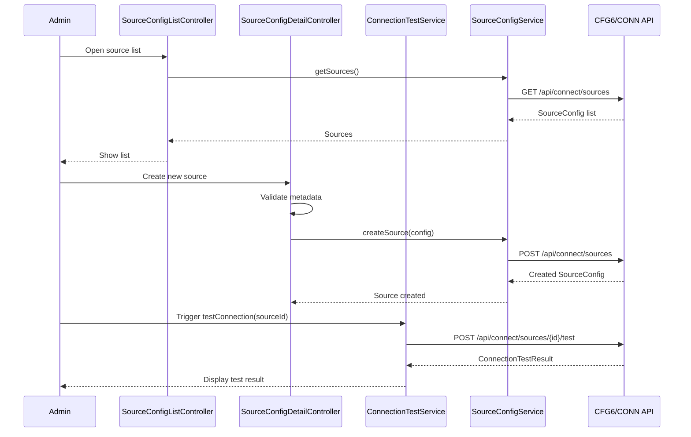

# Low-Level Design (LLD) – QE-2541 – TNSETLPROJ ETL Data Source Configuration and Connectivity

## 1. Application Overview

Front-end administration module for configuring and testing secure connectivity to data sources used in ETL for restricted substances and EUMDR reporting.

Key capabilities:
- Create and maintain data source connection configurations (host, port, DB type, etc.).
- Trigger secure connectivity tests.
- View connectivity audit logs.

Technology:
- AngularJS 1.x, ES6, HTML5, CSS3, Bootstrap
- REST APIs for Connection Configuration Service (CFG6), Connection Testing Service (CONN), and Connectivity Audit (AUD7).

---

## 2. Application Architecture

### 2.1 Modules

1. `tnsetlproj.connectCore`
   - Shared models and services for data source connectivity.

2. `tnsetlproj.connectAdmin`
   - Admin UI for CRUD operations on data sources.

3. `tnsetlproj.connectAudit`
   - UI for viewing connectivity audit logs.

Reuses shared core/security modules.

### 2.2 Controllers

- `SourceConfigListController`
- `SourceConfigDetailController`
- `ConnectionTestController`
- `ConnectivityAuditController`

### 2.3 Services

- `SourceConfigService` – integration with CFG6/SECST.
- `ConnectionTestService` – integration with CONN.
- `ConnectivityAuditService` – integration with AUD7.

### 2.4 Folder Structure

```text
/app/connect-core
  connect-core.module.js
  services
    source-config.service.js
    connection-test.service.js
    connectivity-audit.service.js
  models
    source-config.model.js
    connection-test-result.model.js

/app/connect-admin
  connect-admin.module.js
  controllers
    source-config-list.controller.js
    source-config-detail.controller.js
    connection-test.controller.js
  views
    source-config-list.html
    source-config-detail.html
    connection-test.html

/app/connect-audit
  connect-audit.module.js
  controllers
    connectivity-audit.controller.js
  views
    connectivity-audit.html
```

---

## 3. Component Specifications

### 3.1 `SourceConfigService`

- **File**: `app/connect-core/services/source-config.service.js`
- **Responsibility**: CRUD operations for source configuration metadata (excluding secrets).
- **Public Methods**:
  - `getSources(filter, paging)`
  - `getSourceById(id)`
  - `createSource(config)`
  - `updateSource(config)`
  - `deactivateSource(id)`
- **Endpoints**:
  - `GET /api/connect/sources`
  - `GET /api/connect/sources/{id}`
  - `POST /api/connect/sources`
  - `PUT /api/connect/sources/{id}`
  - `DELETE /api/connect/sources/{id}` (soft delete/deactivate)

### 3.2 `ConnectionTestService`

- **File**: `app/connect-core/services/connection-test.service.js`
- **Responsibility**: Trigger connection tests via CONN.
- **Public Methods**:
  - `testConnection(sourceId)`
- **Endpoint**:
  - `POST /api/connect/sources/{id}/test`

### 3.3 `ConnectivityAuditService`

- **File**: `app/connect-core/services/connectivity-audit.service.js`
- **Responsibility**: Read connectivity-related audit logs from AUD7.
- **Public Methods**:
  - `getAuditEvents(filter, paging)`
- **Endpoint**:
  - `GET /api/connect/audit`

---

### 3.4 Controllers

#### 3.4.1 `SourceConfigListController`

- **File**: `app/connect-admin/controllers/source-config-list.controller.js`
- **Responsibility**: List configured data sources and their status.

#### 3.4.2 `SourceConfigDetailController`

- **File**: `app/connect-admin/controllers/source-config-detail.controller.js`
- **Responsibility**: Create/edit source configuration metadata.

#### 3.4.3 `ConnectionTestController`

- **File**: `app/connect-admin/controllers/connection-test.controller.js`
- **Responsibility**: Trigger and display results of connectivity test.

#### 3.4.4 `ConnectivityAuditController`

- **File**: `app/connect-audit/controllers/connectivity-audit.controller.js`
- **Responsibility**: Display connectivity audit events.

---

## 4. Data Model Design

### 4.1 `SourceConfig`

- **File**: `app/connect-core/models/source-config.model.js`
- **Attributes**:
  - `id: string`
  - `name: string`
  - `type: 'ERP' | 'PLM' | 'DATABASE' | 'API'`
  - `host: string`
  - `port: number`
  - `databaseName: string`
  - `useTls: boolean`
  - `status: 'ACTIVE' | 'INACTIVE'`
  - `createdAtUtc: string`
  - `createdBy: string`
  - `updatedAtUtc: string`
  - `updatedBy: string`

### 4.2 `ConnectionTestResult`

- **File**: `app/connect-core/models/connection-test-result.model.js`
- **Attributes**:
  - `id: string`
  - `sourceId: string`
  - `timestampUtc: string`
  - `success: boolean`
  - `message: string`
  - `latencyMs: number`

---

## 5. Data Flow & Sequence Diagrams

### 5.1 Configure Source & Test Connection



---

## 6. Security & Validation

- Only roles `Connectivity_Admin` and `ETL_Admin` can manage connections.
- Credential handling:
  - Raw credentials never exposed to UI; only connection metadata managed.
- TLS enforcement:
  - UI forces `useTls = true` for new connections; downgrade only possible for special roles and with explicit warning.
- Client validation of host/port formats and required fields.

---

## 7. Mapping HLD Components

- UI6: implemented via `connect-admin` module views.
- CFG6: surfaced via `SourceConfigService`.
- SECST: backend only; UI never shows secrets.
- CONN: surfaced via `ConnectionTestService`.
- AUD7: surfaced via `ConnectivityAuditService`.
- MON6: integrated via backend; UI may show summarized status.
