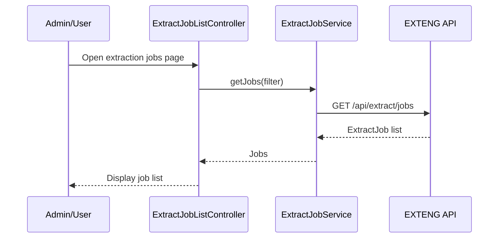
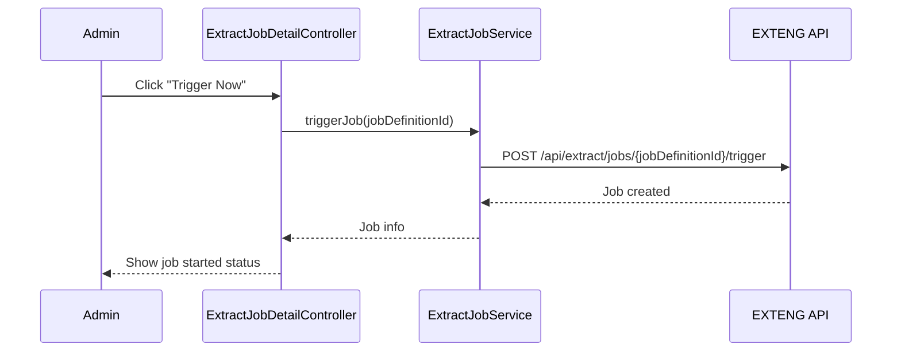

# Low-Level Design (LLD) – QE-2542 – TNSETLPROJ Automated Restricted Substances Data Extraction

## 1. Application Overview

Front-end capabilities to configure and monitor automated extraction of restricted substances data from ERP/PLM and related systems.

Key features:
- View extraction job status, history, and metrics.
- (Optionally) allow manual trigger of extractions for authorized users.
- Expose configuration details provided by Data Source Connectivity epic.

Technology:
- AngularJS 1.x, ES6, HTML5, CSS3, Bootstrap
- REST APIs for Extraction Engine (EXTENG), Scheduler (SCHED), Metrics/Logs (LOG5), and Extraction Audit (AUD6).

---

## 2. Application Architecture

### 2.1 Modules

1. `tnsetlproj.extractCore`
   - Shared services and models for extraction monitoring.

2. `tnsetlproj.extractJobs`
   - UI for job listing and detail.

3. `tnsetlproj.extractConfigView`
   - Read-only view of data source configurations from QE-2541.

Reuses `tnsetlproj.core`, `tnsetlproj.shared`, `tnsetlproj.security`.

### 2.2 Controllers

- `ExtractJobListController`
- `ExtractJobDetailController`
- `ExtractConfigViewController`

### 2.3 Services

- `ExtractJobService` – EXTENG/LOG5/AUD6 integration.
- `ExtractConfigViewService` – read-only CFGSRC info.

### 2.4 Folder Structure

```text
/app/extract-core
  extract-core.module.js
  services
    extract-job.service.js
    extract-config-view.service.js
  models
    extract-job.model.js

/app/extract-jobs
  extract-jobs.module.js
  controllers
    extract-job-list.controller.js
    extract-job-detail.controller.js
  views
    extract-job-list.html
    extract-job-detail.html

/app/extract-config-view
  extract-config-view.module.js
  controllers
    extract-config-view.controller.js
  views
    extract-config-view.html
```

---

## 3. Component Specifications

### 3.1 `ExtractJobService`

- **File**: `app/extract-core/services/extract-job.service.js`
- **Responsibility**: Interact with extraction job APIs.
- **Public Methods**:
  - `getJobs(filter, paging)`
  - `getJobById(id)`
  - `triggerJob(jobDefinitionId)` – optional manual trigger.
- **Endpoints**:
  - `GET /api/extract/jobs`
  - `GET /api/extract/jobs/{id}`
  - `POST /api/extract/jobs/{jobDefinitionId}/trigger`

### 3.2 `ExtractConfigViewService`

- **File**: `app/extract-core/services/extract-config-view.service.js`
- **Responsibility**: Provide view of extraction configurations from CFGSRC.
- **Public Methods**:
  - `getSources()`
- **Endpoint**:
  - `GET /api/extract/sources`

---

### 3.3 Controllers

#### 3.3.1 `ExtractJobListController`

- **File**: `app/extract-jobs/controllers/extract-job-list.controller.js`
- **Responsibility**: Show list of extraction jobs and their status.
- **Dependencies**:
  - `ExtractJobService`.

#### 3.3.2 `ExtractJobDetailController`

- **File**: `app/extract-jobs/controllers/extract-job-detail.controller.js`
- **Responsibility**: Show detailed metrics and logs for a job.

#### 3.3.3 `ExtractConfigViewController`

- **File**: `app/extract-config-view/controllers/extract-config-view.controller.js`
- **Responsibility**: Read-only view of data source configurations for transparency.
- **Dependencies**:
  - `ExtractConfigViewService`.

---

## 4. Data Model Design

### 4.1 `ExtractJob`

- **File**: `app/extract-core/models/extract-job.model.js`
- **Attributes**:
  - `id: string`
  - `sourceId: string`
  - `startedAtUtc: string`
  - `completedAtUtc: string`
  - `status: 'RUNNING' | 'COMPLETED' | 'FAILED' | 'PARTIAL'`
  - `recordsExtracted: number`
  - `retryCount: number`
  - `errorMessage: string`

---

## 5. Data Flow & Sequence Diagrams

### 5.1 View Extraction Jobs



### 5.2 Optional Manual Job Trigger



---

## 6. Security & Error Handling

- Access to extraction monitoring limited to `ETL_Operator`, `Admin`, `QA_Specialist` roles via `SecurityContextService`.
- Manual trigger available only to `Admin` role.
- Error responses (e.g., failure details) are shown in a sanitized manner (no raw stack traces).

---

## 7. Mapping HLD Components

- CFGSRC, SCHED, EXTENG, LOG5, STG5, NOT5, IAM5, AUD6: backend systems; UI exposes monitoring and partial configuration:
  - `ExtractJobService` wraps EXTENG/LOG5/AUD6 endpoints.
  - `ExtractConfigViewService` surfaces CFGSRC metadata.
