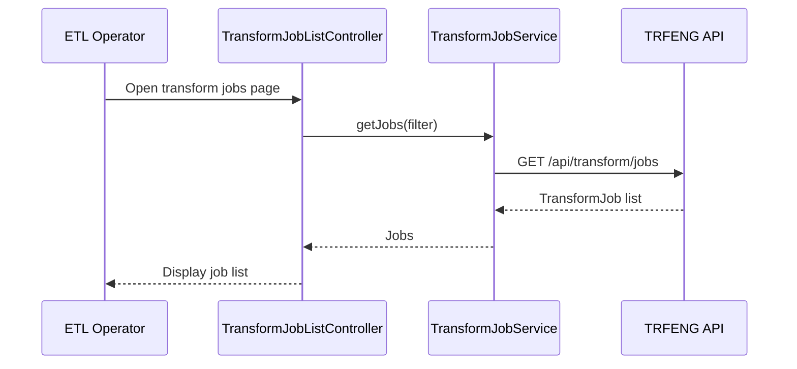
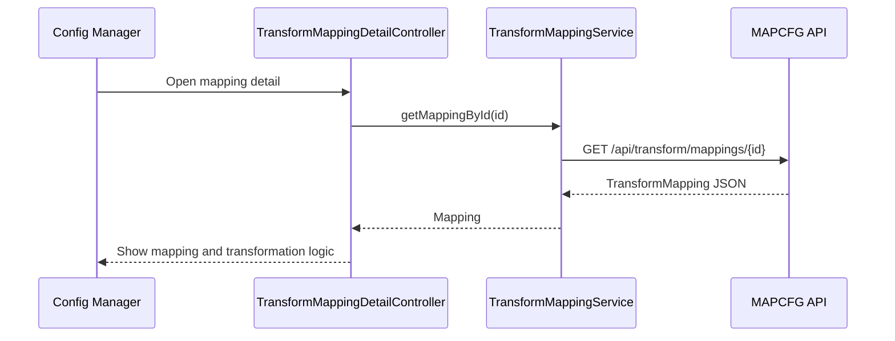

# Low-Level Design (LLD) – QE-2543 – TNSETLPROJ Transformation to EUMDR-Compliant Data Structures

## 1. Application Overview

This LLD covers the front-end monitoring and configuration aspects relevant to transformation of extracted restricted substances data into EUMDR-compliant structures.

Key UI capabilities:
- View configuration and mapping rules used by the Transformation Engine.
- Monitor transformation jobs and their outcomes.
- Inspect lineage for transformed datasets (linked with audit modules).

Technology stack:
- AngularJS 1.x, ES6, HTML5, CSS3, Bootstrap
- REST APIs for Transformation Engine (TRFENG), Mapping & Configuration (MAPCFG/CFGMGR), Unit Conversion (UNIT), and Transformation Audit (AUD5).

---

## 2. Application Architecture

### 2.1 Modules

1. `tnsetlproj.transformCore`
   - Shared services and models around transformation configuration.

2. `tnsetlproj.transformJobs`
   - Job monitoring UI.

3. `tnsetlproj.transformMappings`
   - Mapping rule visualization and management UI.

4. `tnsetlproj.transformLineage`
   - Transformation lineage views (integrates with audit module).

Reuses core/shared/security modules.

### 2.2 Controllers

- `TransformJobListController`
- `TransformJobDetailController`
- `TransformMappingListController`
- `TransformMappingDetailController`

### 2.3 Services

- `TransformJobService` – TRFENG jobs.
- `TransformMappingService` – MAPCFG/CFGMGR.

### 2.4 Folder Structure

```text
/app/transform-core
  transform-core.module.js
  services
    transform-job.service.js
    transform-mapping.service.js
  models
    transform-job.model.js
    transform-mapping.model.js

/app/transform-jobs
  transform-jobs.module.js
  controllers
    transform-job-list.controller.js
    transform-job-detail.controller.js
  views
    transform-job-list.html
    transform-job-detail.html

/app/transform-mappings
  transform-mappings.module.js
  controllers
    transform-mapping-list.controller.js
    transform-mapping-detail.controller.js
  views
    transform-mapping-list.html
    transform-mapping-detail.html
```

---

## 3. Component Specifications

### 3.1 `TransformJobService`

- **File**: `app/transform-core/services/transform-job.service.js`
- **Responsibility**: Communicate with TRFENG job APIs.
- **Public Methods**:
  - `getJobs(filter, paging)`
  - `getJobById(id)`
- **Endpoints**:
  - `GET /api/transform/jobs`
  - `GET /api/transform/jobs/{id}`

### 3.2 `TransformMappingService`

- **File**: `app/transform-core/services/transform-mapping.service.js`
- **Responsibility**: Read and manage mapping configurations.
- **Public Methods**:
  - `getMappings(filter, paging)`
  - `getMappingById(id)`
  - `updateMapping(mapping)` – for authorized roles.
- **Endpoints**:
  - `GET /api/transform/mappings`
  - `GET /api/transform/mappings/{id}`
  - `PUT /api/transform/mappings/{id}`

---

### 3.3 Controllers

#### 3.3.1 `TransformJobListController`

- **File**: `app/transform-jobs/controllers/transform-job-list.controller.js`
- **Responsibility**: List transformation jobs, show status and metrics.
- **Dependencies**:
  - `TransformJobService`.

#### 3.3.2 `TransformJobDetailController`

- **File**: `app/transform-jobs/controllers/transform-job-detail.controller.js`
- **Responsibility**: Show job detail, including source datasets and output datasets.

#### 3.3.3 `TransformMappingListController`

- **File**: `app/transform-mappings/controllers/transform-mapping-list.controller.js`
- **Responsibility**: Show list of mapping rules.

#### 3.3.4 `TransformMappingDetailController`

- **File**: `app/transform-mappings/controllers/transform-mapping-detail.controller.js`
- **Responsibility**: Display mapping rule detail and, for authorized users, edit transformation formulas.

---

## 4. Data Model Design

### 4.1 `TransformJob`

- **File**: `app/transform-core/models/transform-job.model.js`
- **Attributes**:
  - `id: string`
  - `inputDatasetId: string`
  - `outputDatasetId: string`
  - `startedAtUtc: string`
  - `completedAtUtc: string`
  - `status: 'RUNNING' | 'COMPLETED' | 'FAILED' | 'PARTIAL'`
  - `recordCount: number`
  - `errorCount: number`

### 4.2 `TransformMapping`

- **File**: `app/transform-core/models/transform-mapping.model.js`
- **Attributes**:
  - `id: string`
  - `sourceSystem: string`
  - `sourceField: string`
  - `targetField: string`
  - `mandatory: boolean`
  - `transformationExpression: string`
  - `unitConversionRuleId: string`
  - `effectiveFromUtc: string`
  - `effectiveToUtc: string`
  - `status: 'ACTIVE' | 'INACTIVE'`

---

## 5. Data Flow & Sequence Diagrams

### 5.1 View Transformation Jobs



### 5.2 View Mapping Detail



---

## 6. Security & Validation

- Only `Config_Manager` and `ETL_Operator` roles can access transformation UIs.
- Only `Config_Manager` can modify mappings; UI shows editing controls conditionally via `tnRoleBasedSection`.
- Client validates mapping edits for non-empty fields and basic expression sanity, but server validates fully.

---

## 7. Mapping HLD Components

- RAW, UNIT, REF4, META, OUT: mostly backend/ETL; UI surfaces only configuration and monitoring aspects.
- MAPCFG & CFGMGR: represented via `TransformMappingService` and mapping views.
- AUD5: integrated via lineage/audit modules from QE-2546 LLD.
