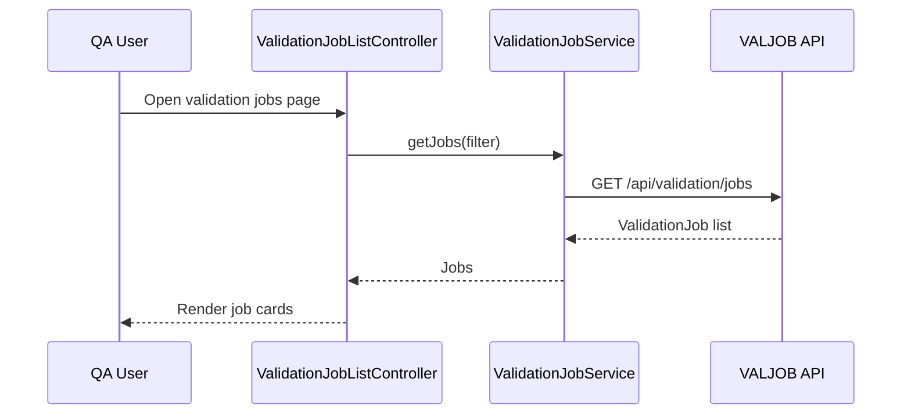
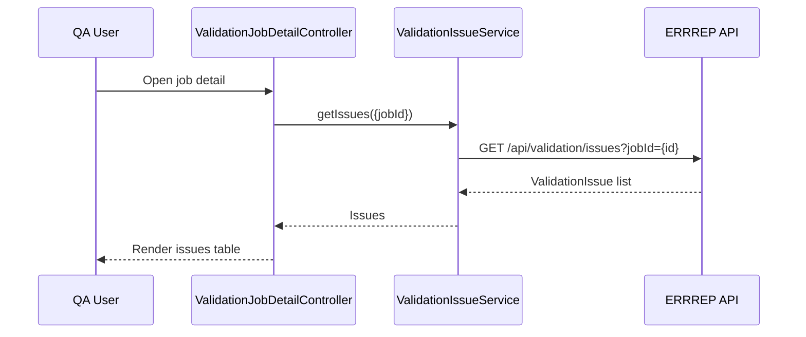

# Low-Level Design (LLD) – QE-2544 – TNSETLPROJ EUMDR Data Quality and Compliance Validation

## 1. Application Overview

UI for monitoring and managing validation of transformed EUMDR data before it enters the reporting database. Provides:
- Visibility into validation job status and statistics.
- Drill-down to record-level validation errors and warnings.
- Notification management for critical issues.

Technology:
- AngularJS 1.x, ES6, HTML5, CSS3, Bootstrap
- REST APIs for Validation Job Orchestrator (VALJOB), Validation Rules Engine (RULEVAL) outputs, Error Repository (ERRREP), and Validation Audit Store (AUD4).

---

## 2. Application Architecture

### 2.1 Modules

1. `tnsetlproj.validationCore`
   - Shared validation models and services.

2. `tnsetlproj.validationJobs`
   - Job orchestration and monitoring UI.

3. `tnsetlproj.validationIssues`
   - Error and warning listing and drill-down.

4. `tnsetlproj.validationAudit`
   - Validation audit & rule usage history viewers.

Reuses `tnsetlproj.core`, `tnsetlproj.shared`, `tnsetlproj.security`.

### 2.2 Controllers

- `ValidationJobListController`
- `ValidationJobDetailController`
- `ValidationIssueListController`
- `ValidationIssueDetailController`
- `ValidationAuditController`

### 2.3 Services

- `ValidationJobService` – VALJOB interaction.
- `ValidationIssueService` – ERRREP interaction.
- `ValidationAuditService` – AUD4 interaction.

### 2.4 Directives / Components

- `tnValidationJobCard` – summary of a validation job.
- `tnValidationIssueTable` – list of issues.
- `tnValidationIssueDetailPanel` – details and suggested remediation.

### 2.5 Folder Structure

```text
/app/validation-core
  validation-core.module.js
  services
    validation-job.service.js
    validation-issue.service.js
    validation-audit.service.js
  models
    validation-job.model.js
    validation-issue.model.js

/app/validation-jobs
  validation-jobs.module.js
  controllers
    validation-job-list.controller.js
    validation-job-detail.controller.js
  views
    validation-job-list.html
    validation-job-detail.html
  directives
    tn-validation-job-card.directive.js

/app/validation-issues
  validation-issues.module.js
  controllers
    validation-issue-list.controller.js
    validation-issue-detail.controller.js
  views
    validation-issue-list.html
    validation-issue-detail.html
  directives
    tn-validation-issue-table.directive.js
    tn-validation-issue-detail-panel.directive.js

/app/validation-audit
  validation-audit.module.js
  controllers
    validation-audit.controller.js
  views
    validation-audit.html
```

---

## 3. Component Specifications

### 3.1 `ValidationJobService`

- **File**: `app/validation-core/services/validation-job.service.js`
- **Responsibility**: Interact with VALJOB API.
- **Public Methods**:
  - `getJobs(filter, paging)`
  - `getJobById(id)`
  - `retryJob(id)`
- **Endpoints**:
  - `GET /api/validation/jobs`
  - `GET /api/validation/jobs/{id}`
  - `POST /api/validation/jobs/{id}/retry`

### 3.2 `ValidationIssueService`

- **File**: `app/validation-core/services/validation-issue.service.js`
- **Responsibility**: Retrieve validation errors and warnings from ERRREP.
- **Public Methods**:
  - `getIssues(filter, paging)`
  - `getIssueById(id)`
- **Endpoints**:
  - `GET /api/validation/issues`
  - `GET /api/validation/issues/{id}`

### 3.3 `ValidationAuditService`

- **File**: `app/validation-core/services/validation-audit.service.js`
- **Responsibility**: Access validation audit events from AUD4.
- **Public Methods**:
  - `getAuditEvents(filter, paging)`
- **Endpoint**:
  - `GET /api/validation/audit`

---

### 3.4 Controllers

#### 3.4.1 `ValidationJobListController`

- **File**: `app/validation-jobs/controllers/validation-job-list.controller.js`
- **Responsibility**: List recent validation jobs and status.
- **ViewModel**:
  - `vm.filter` – date range, dataset, status.
  - `vm.jobs` – list of `ValidationJob`.
- **Dependencies**:
  - `ValidationJobService`, `SecurityContextService`.

#### 3.4.2 `ValidationJobDetailController`

- **File**: `app/validation-jobs/controllers/validation-job-detail.controller.js`
- **Responsibility**: Show job detail including rule versions used and counts.
- **Dependencies**:
  - `ValidationJobService`, `ValidationIssueService`.

#### 3.4.3 `ValidationIssueListController`

- **File**: `app/validation-issues/controllers/validation-issue-list.controller.js`
- **Responsibility**: List issues for a job or global view.
- **Dependencies**:
  - `ValidationIssueService`.

#### 3.4.4 `ValidationIssueDetailController`

- **File**: `app/validation-issues/controllers/validation-issue-detail.controller.js`
- **Responsibility**: Display individual issue, affected records, and suggested remediation.

#### 3.4.5 `ValidationAuditController`

- **File**: `app/validation-audit/controllers/validation-audit.controller.js`
- **Responsibility**: Show validation audit events for governance.

---

## 4. Data Model Design

### 4.1 `ValidationJob`

- **File**: `app/validation-core/models/validation-job.model.js`
- **Attributes**:
  - `id: string`
  - `datasetId: string`
  - `startedAtUtc: string`
  - `completedAtUtc: string`
  - `status: 'RUNNING' | 'COMPLETED' | 'FAILED' | 'PARTIAL'`
  - `totalRecords: number`
  - `errorCount: number`
  - `warningCount: number`
  - `ruleVersionSetId: string`

### 4.2 `ValidationIssue`

- **File**: `app/validation-core/models/validation-issue.model.js`
- **Attributes**:
  - `id: string`
  - `jobId: string`
  - `severity: 'ERROR' | 'WARNING'`
  - `code: string`
  - `message: string`
  - `recordIdentifier: string`
  - `fieldName: string`
  - `currentValue: string`
  - `expectedPattern: string`
  - `createdAtUtc: string`
  - `ownerRole: string`

---

## 5. Data Flow

### 5.1 Validation Job Monitoring

1. User opens Validation Jobs view.
2. `ValidationJobListController` calls `ValidationJobService.getJobs(filter)`.
3. Backend returns list of jobs from VALJOB.
4. Jobs rendered via `tnValidationJobCard`.

### 5.2 Issue Drill-down

1. User clicks job → `ValidationJobDetailController`.
2. Controller loads job detail and calls `ValidationIssueService.getIssues({jobId})`.
3. Issues listed in `validation-issue-list.html` through `tnValidationIssueTable`.
4. User clicks issue → `ValidationIssueDetailController.getIssueById(id)` for full detail.

---

## 6. Sequence Diagrams (Mermaid)

### 6.1 View Validation Jobs



### 6.2 View Issues for a Job



---

## 7. Implementation & Security

- Access restricted to roles: `Data_Steward`, `QA_Specialist`, `Auditor`.
- Client-side validation for filters (dates, numeric ranges).
- Ensure record identifiers and any PII in issues are displayed only according to ABAC rules from backend.

---

## 8. Mapping HLD Components

- STAGE: not directly surfaced.
- RULEVAL, REFD, VALJOB: UI interacts primarily via validation job and issues APIs.
- ERRREP: `ValidationIssueService`.
- NOTIFY: backend-managed notifications; UI may show indicators when critical issues exist.
- UIVAL: implemented via `validation-jobs` and `validation-issues` modules.
- IAM4 & AUD4: integrated through shared security and audit viewing.
