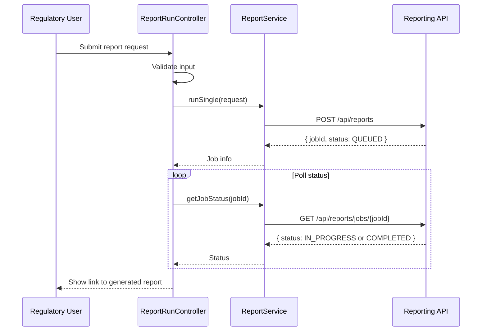
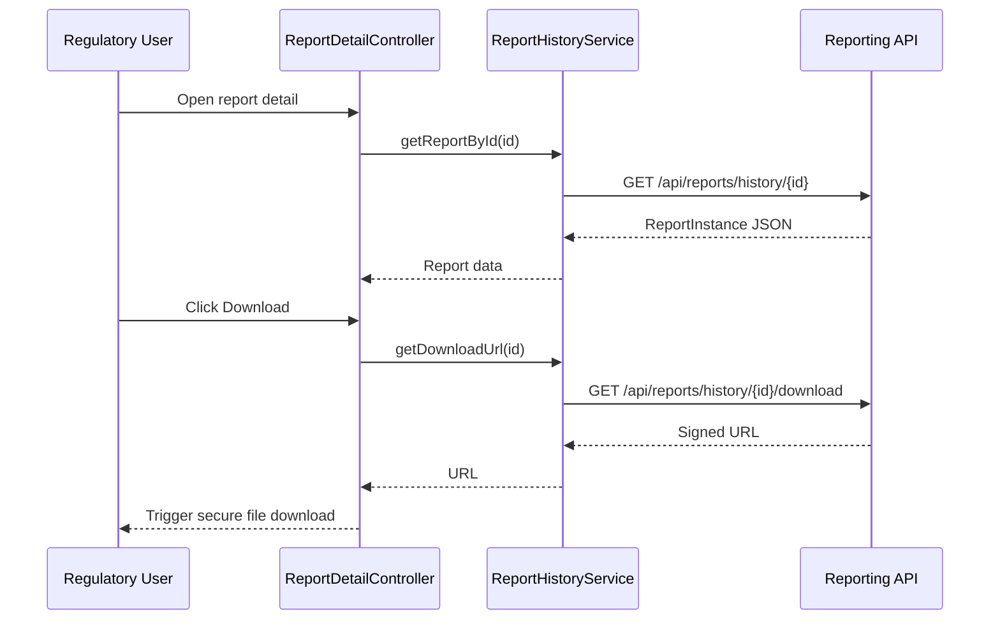

# Low-Level Design (LLD) – QE-2545 – TNSETLPROJ EUMDR Restricted Substances Reporting & Document Management

## 1. Application Overview

Front-end modules enabling:
- Single and batch generation of EUMDR-compliant restricted substances reports.
- Tracking generation status.
- Secure search, view, and download of signed reports.
- View of report-related audit events.

Technology:
- AngularJS 1.x, ES6, HTML5, CSS3, Bootstrap
- REST APIs for Reporting Engine (REGEN), Document Management System (DMS), Audit (AUD3)

---

## 2. Application Architecture

### 2.1 Modules

1. `tnsetlproj.reportingCore`
   - Core services, models, and shared directives for reporting.

2. `tnsetlproj.reportingRun`
   - UI for single and batch report generation.

3. `tnsetlproj.reportingHistory`
   - UI for searching and viewing stored reports.

4. `tnsetlproj.reportingAudit`
   - UI for viewing report generation and access logs.

Uses common `tnsetlproj.core`, `tnsetlproj.shared`, `tnsetlproj.security` modules.

### 2.2 Controllers

- `ReportRunController`
- `BatchReportRunController`
- `ReportHistoryController`
- `ReportDetailController`
- `ReportAuditController`

### 2.3 Services

- `ReportService` – orchestrates calls to REGEN.
- `ReportHistoryService` – integrates with DMS.
- `ReportAuditService` – integrates with AUD3.

### 2.4 Directives / Components

- `tnReportRunForm` – parameter form for report requests.
- `tnBatchRunTable` – manages batches.
- `tnReportCard` – summary of a report.

### 2.5 Folder Structure

```text
/app/reporting-core
  reporting-core.module.js
  services
    report.service.js
    report-history.service.js
    report-audit.service.js
  models
    report-request.model.js
    report-instance.model.js

/app/reporting-run
  reporting-run.module.js
  controllers
    report-run.controller.js
    batch-report-run.controller.js
  views
    report-run.html
    batch-report-run.html
  directives
    tn-report-run-form.directive.js
    tn-batch-run-table.directive.js

/app/reporting-history
  reporting-history.module.js
  controllers
    report-history.controller.js
    report-detail.controller.js
  views
    report-history.html
    report-detail.html
  directives
    tn-report-card.directive.js

/app/reporting-audit
  reporting-audit.module.js
  controllers
    report-audit.controller.js
  views
    report-audit.html
```

---

## 3. Component Specifications

### 3.1 `ReportService`

- **File**: `app/reporting-core/services/report.service.js`
- **Responsibility**: Interact with Reporting Engine (REGEN) and Signing/Timestamp (SIG) workflows via backend.
- **Public Methods**:
  - `runSingle(request)` – request single product report.
  - `runBatch(request)` – request batch reports.
  - `getJobStatus(jobId)` – poll job status.
- **Endpoints** (front-end → consolidated backend API):
  - `POST /api/reports` – single or batch, distinguished in payload.
  - `GET /api/reports/jobs/{jobId}` – job status.

#### Request Payload Example (Single)

```json
{
  "type": "SINGLE",
  "productIds": ["PROD-001"],
  "format": "PDF",
  "regulation": "EUMDR",
  "requestedBy": "user123"
}
```

#### Response (Job Submission)

```json
{
  "jobId": "job-789",
  "status": "QUEUED"
}
```

- **Error Handling**:
  - 400 invalid parameters → show inline validation errors.
  - 409 conflicting request (duplicate job) → show informative message.

---

### 3.2 `ReportHistoryService`

- **File**: `app/reporting-core/services/report-history.service.js`
- **Responsibility**: Integrate with DMS to search/view/download reports.
- **Public Methods**:
  - `searchReports(filter, paging)`
  - `getReportById(id)`
  - `getDownloadUrl(id)`
- **Endpoints**:
  - `GET /api/reports/history`
  - `GET /api/reports/history/{id}`
  - `GET /api/reports/history/{id}/download`

---

### 3.3 `ReportAuditService`

- **File**: `app/reporting-core/services/report-audit.service.js`
- **Responsibility**: Retrieve report-related audit trail from AUD3.
- **Public Methods**:
  - `getGenerationEvents(filter, paging)`
  - `getAccessEvents(filter, paging)`
- **Endpoints**:
  - `GET /api/reports/audit/generation`
  - `GET /api/reports/audit/access`

---

### 3.4 Controllers

#### 3.4.1 `ReportRunController`

- **File**: `app/reporting-run/controllers/report-run.controller.js`
- **Responsibility**: Single-product report requests.
- **ViewModel**:
  - `vm.request` – `ReportRequest`.
  - `vm.jobId`, `vm.jobStatus`.
  - `vm.submit()`, `vm.pollStatus()`.
- **Dependencies**:
  - `ReportService`, `NotificationService`, `SecurityContextService`.

#### 3.4.2 `BatchReportRunController`

- **File**: `app/reporting-run/controllers/batch-report-run.controller.js`
- **Responsibility**: Batch report submissions.
- **ViewModel**:
  - `vm.request` – includes multiple product IDs and batch parameters (chunk size, schedule).
- **Dependencies**:
  - Same as `ReportRunController`.

#### 3.4.3 `ReportHistoryController`

- **File**: `app/reporting-history/controllers/report-history.controller.js`
- **Responsibility**: Search and list stored reports.
- **ViewModel**:
  - `vm.filter` – product, date range, status, regulation.
  - `vm.reports` – list of `ReportInstance`.
- **Dependencies**:
  - `ReportHistoryService`, `SecurityContextService`.

#### 3.4.4 `ReportDetailController`

- **File**: `app/reporting-history/controllers/report-detail.controller.js`
- **Responsibility**: Show metadata and allow download.
- **ViewModel**:
  - `vm.report` – `ReportInstance`.
  - `vm.download()`.
- **Dependencies**:
  - `ReportHistoryService`.

#### 3.4.5 `ReportAuditController`

- **File**: `app/reporting-audit/controllers/report-audit.controller.js`
- **Responsibility**: View generation and access audit logs.
- **ViewModel**:
  - `vm.generationEvents`, `vm.accessEvents`.
- **Dependencies**:
  - `ReportAuditService`.

---

## 4. Data Model Design

### 4.1 `ReportRequest`

- **File**: `app/reporting-core/models/report-request.model.js`
- **Attributes**:
  - `type: 'SINGLE' | 'BATCH'`
  - `productIds: string[]`
  - `format: 'PDF' | 'XML'`
  - `regulation: 'EUMDR' | string`
  - `scheduledAtUtc: string | null`
  - `priority: 'NORMAL' | 'HIGH'`
- **Validation**:
  - At least one `productId`.
  - Format required; type-specific constraints (batch must have more than one product).

### 4.2 `ReportInstance`

- **File**: `app/reporting-core/models/report-instance.model.js`
- **Attributes**:
  - `id: string`
  - `jobId: string`
  - `productIds: string[]`
  - `format: 'PDF' | 'XML'`
  - `createdAtUtc: string`
  - `status: 'GENERATED' | 'FAILED' | 'IN_PROGRESS'`
  - `signed: boolean`
  - `signedBy: string`
  - `signedAtUtc: string`
  - `regulation: string`
  - `region: string`

---

## 5. Data Flow

### 5.1 Single Report Generation

1. User accesses `report-run.html`.
2. `ReportRunController` initializes a `ReportRequest` with default `type='SINGLE'`.
3. User enters product ID, selects format and regulation.
4. Controller validates and calls `ReportService.runSingle(vm.request)`.
5. Service issues `POST /api/reports` with payload.
6. Backend enqueues job in REGEN, SIG, DMS pipeline and returns jobId.
7. Controller polls job status with `getJobStatus(jobId)` until `COMPLETED` or timeouts.
8. On completion, user is redirected to report detail or history view.

### 5.2 Report Retrieval

1. User opens `report-history.html`.
2. `ReportHistoryController` uses `ReportHistoryService.searchReports(filter)`.
3. Backend queries DMS metadata and returns paginated list.
4. User selects a report; route to `/reports/:id`.
5. `ReportDetailController` uses `getReportById(id)` and obtains `getDownloadUrl(id)`.
6. Browser triggers secure download via `window.open(downloadUrl)`.

---

## 6. Sequence Diagrams (Mermaid)

### 6.1 Single Report Flow



### 6.2 Report Download



---

## 7. Implementation Details

- Controllers use `controllerAs vm` syntax.
- Form-level validation using `ngMessages` for required fields, valid product IDs and date ranges.
- Pagination and sorting in history view using shared table directives.
- Access control via `tnRoleBasedSection` and `SecurityContextService` to ensure only authorized roles can initiate/report generation or access history.

---

## 8. Configuration & Security

- API base URLs defined in `env.config.json`:
  - `reportApiBaseUrl`, `dmsApiBaseUrl`, `reportAuditApiBaseUrl`.
- All calls over HTTPS.
- Download endpoints must require valid auth token and short-lived signed URLs.
- Client does not store report content; downloads are streamed directly.

---

## 9. Mapping HLD Components

- SRC3: used implicitly by backend; not surfaced directly.
- REGEN: orchestrated through `/api/reports` endpoint.
- SIG: part of backend flow; status shown via `signed` fields in `ReportInstance`.
- DMS: integrated via `ReportHistoryService` endpoints.
- UIREP: implemented via modules `reporting-run` and `reporting-history`.
- IAM3: integrated via shared security modules.
- AUD3: surfaced via `ReportAuditService` and `reporting-audit` UI.
- RET3, EXTAPI: backend components; UI logs and indicates export actions via metadata.
