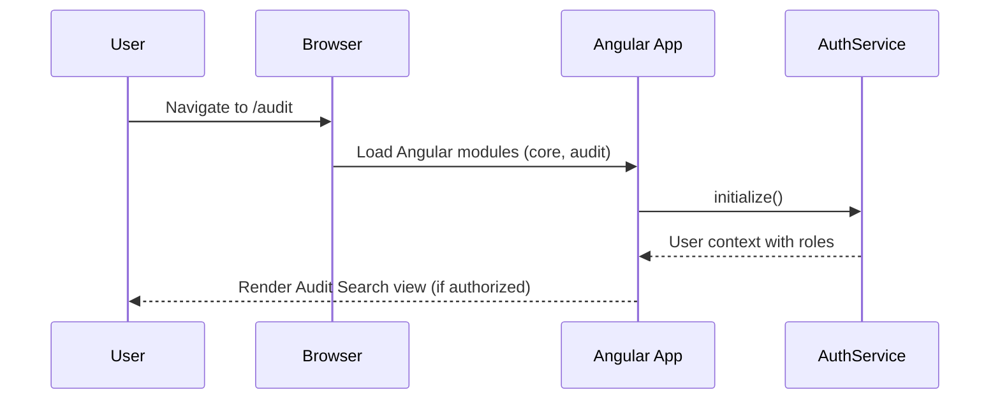
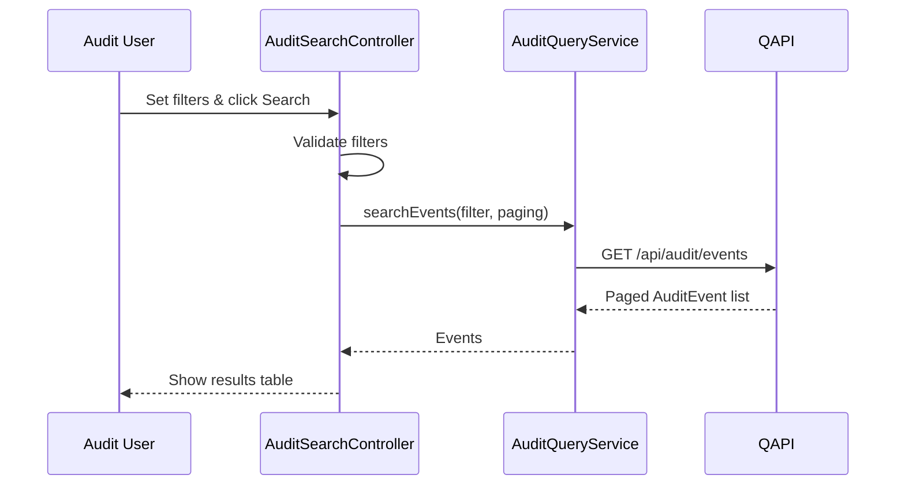
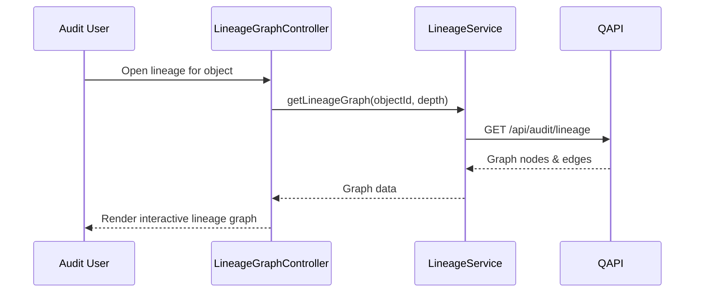
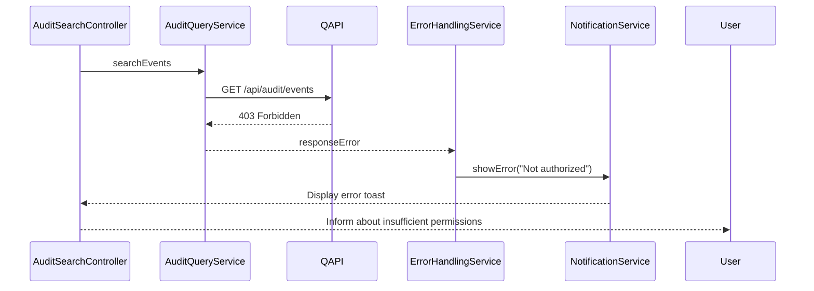

# Low-Level Design (LLD) – QE-2546 – TNSETLPROJ Audit Trail & Data Lineage for ETL and Compliance

## 1. Application Overview

Front-end module providing governed access to ETL and compliance audit logs and lineage information. It enables:
- Search and filtering of audit events across ETL, applications, and user interfaces.
- Visualization of data lineage from source extraction through transformation, validation, and reporting.
- Generation of inspection-ready reports.

Technology stack:
- AngularJS 1.x SPA
- JavaScript ES6
- HTML5, CSS3, Bootstrap
- RESTful APIs for audit query (`QAPI`) and configuration (`CFG2`)

---

## 2. Application Architecture

### 2.1 AngularJS Modules

1. `tnsetlproj.auditCore`
   - Core audit viewer infrastructure, shared models and services.

2. `tnsetlproj.auditSearch`
   - Search and list views for audit events (ETL, application, access).

3. `tnsetlproj.auditLineage`
   - Lineage visualization between jobs, datasets, and reports.

4. `tnsetlproj.auditReporting`
   - Report generation and export (PDF/CSV) for audits.

5. `tnsetlproj.auditConfig`
   - Audit configuration/policy UI (subset of CFG2, for allowed roles only).

6. Reuse `tnsetlproj.core`, `tnsetlproj.shared`, and `tnsetlproj.security` from QE-2547 LLD.

### 2.2 Controllers

- `AuditSearchController`
- `AuditDetailController`
- `LineageGraphController`
- `AuditReportController`
- `AuditConfigController`

### 2.3 Services

- `AuditQueryService` – search and retrieval of audit events.
- `LineageService` – lineage graph data and traversal.
- `AuditReportService` – server-side report generation trigger and download.
- `AuditConfigService` – audit policy configuration.

### 2.4 Directives / Components

- `tnAuditSearchForm` – filter form.
- `tnAuditEventTable` – reusable table for audit events.
- `tnLineageGraph` – visualization of lineage (e.g., using D3/third-party lib).
- `tnAuditEventDetail` – structured display for single event.

### 2.5 Folder Structure

```text
/app/audit-core
  audit-core.module.js
  services
    audit-query.service.js
    lineage.service.js
    audit-report.service.js
    audit-config.service.js
  models
    audit-event.model.js
    lineage-node.model.js

/app/audit-search
  audit-search.module.js
  controllers
    audit-search.controller.js
    audit-detail.controller.js
  views
    audit-search.html
    audit-detail.html
  directives
    tn-audit-search-form.directive.js
    tn-audit-event-table.directive.js

/app/audit-lineage
  audit-lineage.module.js
  controllers
    lineage-graph.controller.js
  views
    lineage-graph.html
  directives
    tn-lineage-graph.directive.js

/app/audit-reporting
  audit-reporting.module.js
  controllers
    audit-report.controller.js
  views
    audit-report.html

/app/audit-config
  audit-config.module.js
  controllers
    audit-config.controller.js
  views
    audit-config.html
```

---

## 3. Component Specifications

### 3.1 `AuditQueryService`

- **Type**: Service
- **File**: `app/audit-core/services/audit-query.service.js`
- **Responsibility**: Communicate with QAPI for audit event queries.
- **Public Methods**:
  - `searchEvents(filter, paging)`
  - `getEventById(id)`
  - `getEventTypes()`
- **Inputs**:
  - Filter object: time range, actor, action, system, objectId, severity, regulationTag.
- **Outputs**:
  - Paged list of `AuditEvent` objects.
- **Endpoints**:
  - `GET /api/audit/events`
  - `GET /api/audit/events/{id}`
  - `GET /api/audit/event-types`

#### Request Payload (search via query params)

`GET /api/audit/events?from=2024-01-01T00:00:00Z&to=2024-01-31T23:59:59Z&actor=user123&action=JOB_RUN&system=ETL&page=1&pageSize=50`

#### Response Structure

```json
{
  "items": [ { /* AuditEvent */ } ],
  "page": 1,
  "pageSize": 50,
  "totalCount": 1250
}
```

- **Error Responses**:
  - 400 – invalid filter.
  - 401/403 – unauthorized/forbidden.

---

### 3.2 `LineageService`

- **Type**: Service
- **File**: `app/audit-core/services/lineage.service.js`
- **Responsibility**: Retrieve lineage graphs between source data, jobs, and reports.
- **Public Methods**:
  - `getLineageGraph(rootObjectId, options)` – returns nodes and edges.
- **Endpoint**:
  - `GET /api/audit/lineage?rootObjectId={id}&depth={n}`
- **Response**:
  ```json
  {
    "nodes": [
      {"id": "job123", "type": "ETL_JOB", "label": "Nightly Extract"},
      {"id": "dataset456", "type": "DATASET", "label": "EUMDR Staging"}
    ],
    "edges": [
      {"from": "job123", "to": "dataset456", "relationship": "OUTPUT"}
    ]
  }
  ```

---

### 3.3 `AuditReportService`

- **Type**: Service
- **File**: `app/audit-core/services/audit-report.service.js`
- **Responsibility**: Trigger generation of audit reports (PDF/CSV) and retrieve download links.
- **Public Methods**:
  - `requestReport(filter, format)` – returns job ID.
  - `getReportStatus(jobId)` – poll status.
  - `downloadReport(jobId)` – returns file stream URL.
- **Endpoints**:
  - `POST /api/audit/reports`
  - `GET /api/audit/reports/{jobId}`
  - `GET /api/audit/reports/{jobId}/download`

---

### 3.4 `AuditConfigService`

- **Type**: Service
- **File**: `app/audit-core/services/audit-config.service.js`
- **Responsibility**: Manage audit configuration policies (front-end subset of CFG2).
- **Public Methods**:
  - `getPolicies()`
  - `updatePolicy(policy)`
- **Endpoints**:
  - `GET /api/audit/policies`
  - `PUT /api/audit/policies/{id}`

---

### 3.5 Controllers

#### 3.5.1 `AuditSearchController`

- **File**: `app/audit-search/controllers/audit-search.controller.js`
- **Responsibility**: Manage audit search filters and results.
- **ViewModel**:
  - `vm.filter` – includes from/to, actor, system, action, objectId.
  - `vm.events` – array of `AuditEvent`.
  - `vm.page`, `vm.pageSize`, `vm.totalCount`.
  - `vm.search()`, `vm.clearFilters()`, `vm.openEvent(id)`.
- **Dependencies**:
  - `AuditQueryService`, `SecurityContextService`, `NotificationService`, `$location`.

#### 3.5.2 `AuditDetailController`

- **File**: `app/audit-search/controllers/audit-detail.controller.js`
- **Responsibility**: Show details and contextual links for a specific event.
- **ViewModel**:
  - `vm.event`
  - `vm.relatedEvents`
- **Dependencies**:
  - `AuditQueryService`, `LineageService`, `$routeParams`.

#### 3.5.3 `LineageGraphController`

- **File**: `app/audit-lineage/controllers/lineage-graph.controller.js`
- **Responsibility**: Load lineage graph for selected root object.
- **ViewModel**:
  - `vm.rootObjectId`
  - `vm.graphData` – nodes & edges.
- **Dependencies**:
  - `LineageService`.

#### 3.5.4 `AuditReportController`

- **File**: `app/audit-reporting/controllers/audit-report.controller.js`
- **Responsibility**: Initiate and monitor audit report generation.
- **ViewModel**:
  - `vm.filter`
  - `vm.format` – 'PDF' or 'CSV'.
  - `vm.jobId`, `vm.status`.
- **Dependencies**:
  - `AuditReportService`, `NotificationService`.

#### 3.5.5 `AuditConfigController`

- **File**: `app/audit-config/controllers/audit-config.controller.js`
- **Responsibility**: Display and edit policy-level audit configuration.
- **ViewModel**:
  - `vm.policies`
- **Dependencies**:
  - `AuditConfigService`, `SecurityContextService`.

---

## 4. Data Model Design

### 4.1 `AuditEvent`

- **File**: `app/audit-core/models/audit-event.model.js`
- **Attributes**:
  - `id: string`
  - `timestampUtc: string`
  - `actorId: string`
  - `actorRole: string`
  - `action: string` – e.g., `JOB_START`, `JOB_END`, `DATA_ACCESS`, `CONFIG_CHANGE`.
  - `system: string` – `ETL`, `APP`, `UI`, `IAM`.
  - `objectType: string` – `JOB`, `DATASET`, `REPORT`, `CONFIG`.
  - `objectId: string`
  - `correlationId: string`
  - `result: 'SUCCESS' | 'FAILURE'`
  - `reason: string`
  - `regulationTags: string[]` – e.g., `['GxP','PART11','EUMDR']`.
  - `metadata: object` – additional key-value pairs.

### 4.2 `LineageNode`

- **File**: `app/audit-core/models/lineage-node.model.js`
- **Attributes**:
  - `id: string`
  - `type: 'SOURCE' | 'ETL_JOB' | 'DATASET' | 'VALIDATION' | 'REPORT'`
  - `label: string`
  - `metadata: object`

### 4.3 `LineageEdge`

- Used only in service response and directives.
- **Attributes**:
  - `from: string`
  - `to: string`
  - `relationship: string` – e.g., `INPUT`, `OUTPUT`, `TRANSFORMED_TO`.

---

## 5. Data Flow

### 5.1 Audit Event Search

1. User opens Audit Search view.
2. `AuditSearchController` initializes default filter (e.g., last 24 hours).
3. User adjusts filters and clicks "Search".
4. Controller validates date range and calls `AuditQueryService.searchEvents(filter, paging)`.
5. Service sends `GET /api/audit/events` with query params.
6. Backend validates RBAC/ABAC and returns paged events.
7. Controller updates `vm.events` and pagination info.

### 5.2 View Event Detail and Lineage

1. User selects event from table.
2. Route changes to `/audit/events/:id`.
3. `AuditDetailController` calls `AuditQueryService.getEventById(id)`.
4. Backend returns event; controller populates `vm.event`.
5. User clicks "View Lineage".
6. `LineageGraphController` calls `LineageService.getLineageGraph(vm.event.objectId, depth)`.
7. Backend builds lineage graph from ENRICH/STORE and returns nodes & edges.
8. `tnLineageGraph` directive renders interactive graph.

---

## 6. Sequence Diagrams (Mermaid)

### 6.1 Application Initialization with Audit Modules



### 6.2 Audit Search



### 6.3 Lineage Visualization



### 6.4 Error Handling in Audit Search



---

## 7. Implementation Details

- Reuse shared `AuthService`, `SecurityContextService`, `ErrorHandlingService`, and `LoggingService` implementation.
- All audit data is read-only in UI; no delete operations.
- Tight RBAC:
  - Only users with `Audit_Viewer` or `Compliance_Auditor` roles see audit modules.
- Use server-side pagination to avoid large payloads.

---

## 8. Configuration

- `env.config.json` includes `auditApiBaseUrl` if distinct.
- Feature flags:
  - `enableLineageGraph` – may be disabled in low-resource environments.
  - `enableAuditConfigUi` – restrict configuration UI.

---

## 9. Error Handling & Security

- Standard Angular error handling as per core module.
- Strict filtering of search scopes in backend; UI exposes only allowed filters (e.g., cannot search outside own region if ABAC restricts).
- Sensitive metadata fields are hidden in UI if backend marks them as such (e.g., via `sensitive: true`).

---

## 10. Mapping HLD Components

- ETL, APP, UI emitters → surfaced via `AuditEvent` model and `AuditQueryService`.
- LOGCOL, ENRICH, STORE → backend-only; UI interacts via QAPI.
- VIEW → implemented through `audit-search`, `audit-lineage`, and `audit-reporting` modules.
- CFG2 → partially exposed via `audit-config` module for policy management (where permitted).
- IAM2 → integrated via shared `AuthService`/`SecurityContextService`.
- SIEM, ARCH2 → backend systems not directly exposed; may appear only in metadata.
