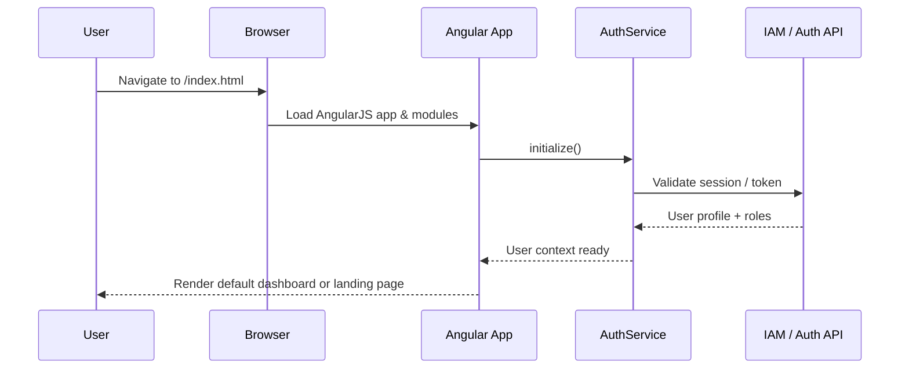
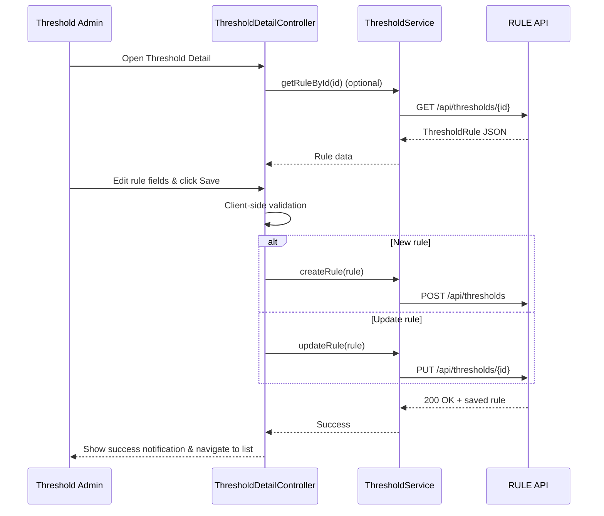
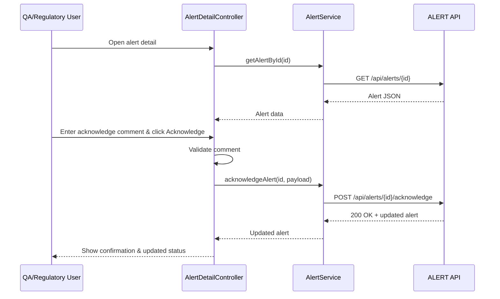
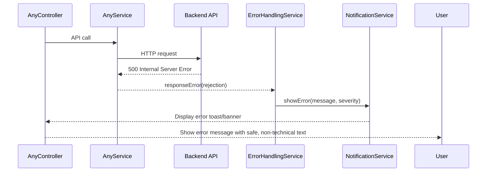

# Low-Level Design (LLD) – QE-2547 – TNSETLPROJ EUMDR Threshold Monitoring & Alerting

## 1. Application Overview

Web application providing configuration, monitoring, and alert handling for restricted substances threshold evaluation, targeting EUMDR and related regulations.

Technology stack:
- AngularJS 1.x (SPA, MVC)
- JavaScript ES6 (transpiled/bundled where needed)
- HTML5, CSS3, Bootstrap 3/4
- RESTful backend APIs (Java/.NET or similar, not detailed here)
- Secure transport over TLS 1.3

Front-end responsibilities:
- Threshold rule configuration (warning/critical)
- Alert monitoring dashboard and drill-down
- Alert acknowledgment, escalation, and resolution
- Read-only audit views for threshold evaluations and alert lifecycle

---

## 2. Application Architecture

### 2.1 AngularJS MVC Mapping

Single-page application with two primary functional areas:
- Threshold Configuration (CFG)
- Compliance Dashboard & Alert Handling (DASH)

#### AngularJS Modules

1. `tnsetlproj.core`
   - Cross-cutting services, configuration, constants, interceptors.

2. `tnsetlproj.shared`
   - Reusable components (directives, filters, utilities).

3. `tnsetlproj.thresholdConfig`
   - Threshold rule management and configuration UIs.

4. `tnsetlproj.alertDashboard`
   - Alert list, detail, dashboards, acknowledgment and resolution workflows.

5. `tnsetlproj.audit`
   - Lightweight audit trail viewers related to thresholds and alerts.

6. `tnsetlproj.security`
   - Security helpers (role checks, authorization directives) around IAM integration.

#### Controllers

- Threshold Config Module
  - `ThresholdListController`
  - `ThresholdDetailController`
  - `EscalationRuleController`

- Alert Dashboard Module
  - `AlertListController`
  - `AlertDetailController`
  - `AlertDashboardController`

- Audit Module
  - `EvaluationAuditController`
  - `AlertAuditController`

- Core/Security
  - `MainShellController`
  - `UserProfileController`

#### Services / Factories

- `ApiConfigService` – API base URLs, environment configuration
- `AuthService` – IAM integration and token handling
- `SessionService` – user/session state
- `ThresholdService` – CRUD operations for threshold rules
- `EscalationRuleService` – CRUD for escalation/notification rules
- `AlertService` – alert query/update lifecycle
- `EvaluationService` – evaluation summaries for dashboard
- `AuditService` – audit-related read APIs
- `NotificationService` – in-app notifications (toasts/banners)
- `LoggingService` – client logging to server
- `ErrorHandlingService` – error classification and user messaging
- `SecurityContextService` – role/permission resolution
- `UnitFormatterService` – formatting of concentration values and thresholds

#### Directives / Components

- `tnLoadingSpinner` – loading indicator
- `tnThresholdRuleForm` – reusable threshold rule form
- `tnEscalationRuleForm` – reusable escalation rule form
- `tnAlertSummaryCard` – card view for alerts
- `tnSeverityBadge` – severity label (info/warning/critical)
- `tnPagination` – list pagination
- `tnSortHeader` – sortable table headers
- `tnRoleBasedSection` – hide/show sections based on RBAC/ABAC

#### Filters

- `severityLabel` – converts severity code to human-readable label
- `alertStatusLabel` – maps alert status to display text
- `dateTimeUtc` – formats UTC timestamps
- `thresholdLevelLabel` – maps threshold type (warning/critical)

### 2.2 Project Folder Structure

```text
/web
  /app
    app.module.js
    app.routes.js
    app.config.js
    app.constants.js

    /core
      core.module.js
      api-config.service.js
      auth.service.js
      session.service.js
      security-context.service.js
      error-handling.service.js
      logging.service.js
      http-interceptor.factory.js

    /shared
      shared.module.js
      directives
        tn-loading-spinner.directive.js
        tn-role-based-section.directive.js
        tn-sort-header.directive.js
        tn-pagination.directive.js
        tn-severity-badge.directive.js
        tn-alert-summary-card.directive.js
        tn-threshold-rule-form.directive.js
        tn-escalation-rule-form.directive.js
      filters
        severity-label.filter.js
        alert-status-label.filter.js
        date-time-utc.filter.js
        threshold-level-label.filter.js
      models
        threshold-rule.model.js
        escalation-rule.model.js
        alert.model.js
        evaluation-event.model.js

    /threshold-config
      threshold-config.module.js
      controllers
        threshold-list.controller.js
        threshold-detail.controller.js
        escalation-rule.controller.js
      services
        threshold.service.js
        escalation-rule.service.js
      views
        threshold-list.html
        threshold-detail.html
        escalation-rule.html

    /alert-dashboard
      alert-dashboard.module.js
      controllers
        alert-list.controller.js
        alert-detail.controller.js
        alert-dashboard.controller.js
      services
        alert.service.js
        evaluation.service.js
      views
        alert-list.html
        alert-detail.html
        alert-dashboard.html

    /audit
      audit.module.js
      controllers
        evaluation-audit.controller.js
        alert-audit.controller.js
      services
        audit.service.js
      views
        evaluation-audit.html
        alert-audit.html

    /security
      security.module.js
      controllers
        user-profile.controller.js
      directives
        tn-has-role.directive.js
      views
        access-denied.html

  /assets
    /css
      main.css
    /img
    /fonts

  /config
    env.config.json
    logging.config.json

  index.html
```

---

## 3. Component Specifications

### 3.1 Core Module Components

#### 3.1.1 `tnsetlproj.core` (Module)

- **File**: `app/core/core.module.js`
- **Responsibility**: Declare shared infrastructure services and attach HTTP interceptors.
- **Dependencies**: `ngRoute`, `ngResource`, `ngMessages`, `tnsetlproj.shared`, `tnsetlproj.security`.

##### Public Configuration
- Registers `$httpInterceptor` for auth token injection and error handling.
- Configures default `$http` timeouts and base headers.

---

#### 3.1.2 `ApiConfigService`

- **Type**: Service
- **File**: `app/core/api-config.service.js`
- **Responsibility**: Provide environment-specific API endpoints and toggles.
- **Public Methods**:
  - `getBaseUrl()` → string
  - `getThresholdApiUrl()` → string
  - `getAlertApiUrl()` → string
  - `getEvaluationApiUrl()` → string
  - `getAuditApiUrl()` → string
  - `isFeatureEnabled(featureKey)` → boolean
- **Inputs**:
  - Reads `env.config.json` at bootstrap.
- **Outputs**:
  - Normalized URLs for REST calls.
- **Dependencies**:
  - `$http`, `$q`, `$window` (for cached env), `LoggingService`.

---

#### 3.1.3 `AuthService`

- **Type**: Service
- **File**: `app/core/auth.service.js`
- **Responsibility**: Handle IAM/OIDC integration, tokens, user roles.
- **Public Methods**:
  - `initialize()` – load user context from IAM session or token.
  - `getToken()` → string
  - `getUser()` → `UserProfile`
  - `hasRole(role)` → boolean
  - `hasAnyRole(roles[])` → boolean
  - `logout()` → void
- **Inputs**:
  - IAM redirect response or `sessionStorage` token.
- **Outputs**:
  - Exposes current user and token to other components.
- **Dependencies**:
  - `$http`, `$q`, `$window`, `SessionService`, `LoggingService`.

---

#### 3.1.4 `SessionService`

- **Type**: Service
- **File**: `app/core/session.service.js`
- **Responsibility**: Maintain client-side session state.
- **Public Methods**:
  - `set(key, value)`
  - `get(key, defaultValue)`
  - `remove(key)`
  - `clear()`
- **Inputs/Outputs**:
  - Stores simple JSON-serializable values.
- **Dependencies**:
  - `$window` (localStorage/sessionStorage).

---

#### 3.1.5 `SecurityContextService`

- **Type**: Service
- **File**: `app/core/security-context.service.js`
- **Responsibility**: RBAC/ABAC helper around IAM roles and attributes.
- **Public Methods**:
  - `canViewThresholds()`
  - `canEditThresholds()`
  - `canApproveThresholds()`
  - `canViewAlerts()`
  - `canAcknowledgeAlerts()`
  - `canResolveAlerts()`
  - `canViewAudit()`
- **Inputs**:
  - User roles & attributes from `AuthService`.
- **Outputs**:
  - Boolean guard decisions.

---

#### 3.1.6 `ErrorHandlingService`

- **Type**: Service
- **File**: `app/core/error-handling.service.js`
- **Responsibility**: Centralized client error processing.
- **Public Methods**:
  - `handleHttpError(response)` – classify error, log, and call `NotificationService`.
  - `handleClientError(error, context)` – for JS errors.
- **Dependencies**:
  - `LoggingService`, `NotificationService`.

---

#### 3.1.7 `LoggingService`

- **Type**: Service
- **File**: `app/core/logging.service.js`
- **Responsibility**: Client log and telemetry façade.
- **Public Methods**:
  - `info(message, meta)`
  - `warn(message, meta)`
  - `error(message, meta)`
- **Dependencies**:
  - `$http`, `ApiConfigService`.
- **Behavior**:
  - In non-production: log to console and optionally server.
  - In production: batch and send to server logging endpoint.

---

#### 3.1.8 HTTP Interceptor

- **Type**: Factory
- **File**: `app/core/http-interceptor.factory.js`
- **Responsibility**: Inject auth header; handle global HTTP errors.
- **Public Methods**:
  - `request(config)` – add `Authorization: Bearer <token>`.
  - `responseError(rejection)` – forward to `ErrorHandlingService`.
- **Dependencies**:
  - `$q`, `AuthService`, `ErrorHandlingService`.

---

### 3.2 Shared Components

#### 3.2.1 `tnLoadingSpinner` Directive

- **File**: `app/shared/directives/tn-loading-spinner.directive.js`
- **Responsibility**: Show spinner while `isLoading` is true.
- **Inputs**:
  - `is-loading` (boolean, two-way).
- **Outputs**:
  - Visual spinner overlay.

---

#### 3.2.2 `tnRoleBasedSection` Directive

- **File**: `app/shared/directives/tn-role-based-section.directive.js`
- **Responsibility**: Conditionally display content based on permissions.
- **Attributes**:
  - `tn-role-any="['Threshold_Config_Admin','Regulatory_Manager']"`
- **Dependencies**:
  - `SecurityContextService`.

---

#### 3.2.3 `tnThresholdRuleForm` Directive

- **File**: `app/shared/directives/tn-threshold-rule-form.directive.js`
- **Responsibility**: Reusable form for create/edit threshold rules.
- **Inputs**:
  - `rule` – `ThresholdRule` object (two-way).
  - `on-save(rule)` – callback.
  - `on-cancel()` – callback.
- **Outputs**:
  - Emits `on-save` and `on-cancel` events.
- **Validation**:
  - Required: substanceId, productScope, regionScope, warningThreshold, criticalThreshold.
  - `warningThreshold < criticalThreshold` enforced.

---

#### 3.2.4 `tnEscalationRuleForm` Directive

- Similar structure to `tnThresholdRuleForm`, with fields for escalation paths, roles, and channels.

---

### 3.3 Threshold Configuration Module

#### 3.3.1 `ThresholdService`

- **Type**: Service
- **File**: `app/threshold-config/services/threshold.service.js`
- **Responsibility**: REST API integration for threshold rules (RULE service).
- **Public Methods**:
  - `getRules(filter)` – list with filters (substance, product, region, status).
  - `getRuleById(id)`
  - `createRule(rule)`
  - `updateRule(rule)`
  - `deleteRule(id)` – soft delete/deactivate.
  - `getRuleVersions(id)` – list versions for audit.
- **REST Endpoints** (example):
  - `GET /api/thresholds` – list
  - `GET /api/thresholds/{id}` – detail
  - `POST /api/thresholds` – create
  - `PUT /api/thresholds/{id}` – update
  - `DELETE /api/thresholds/{id}` – deactivate
  - `GET /api/thresholds/{id}/versions` – versions
- **Request/Response**:
  - Request body: `ThresholdRule` JSON (see Data Model Design).
  - Responses: JSON objects; errors via standard error envelope.
- **Dependencies**:
  - `$http`, `$q`, `ApiConfigService`, `ErrorHandlingService`.

---

#### 3.3.2 `EscalationRuleService`

- **Type**: Service
- **File**: `app/threshold-config/services/escalation-rule.service.js`
- **Responsibility**: Manage escalation and notification routing rules.
- **Public Methods**:
  - `getEscalationRules(filter)`
  - `getEscalationRuleById(id)`
  - `saveEscalationRule(rule)` (create/update)
  - `deleteEscalationRule(id)`
- **REST Endpoints** (example):
  - `GET /api/escalations`
  - `GET /api/escalations/{id}`
  - `POST /api/escalations`
  - `PUT /api/escalations/{id}`
  - `DELETE /api/escalations/{id}`

---

#### 3.3.3 `ThresholdListController`

- **File**: `app/threshold-config/controllers/threshold-list.controller.js`
- **Responsibility**: Manage list and filtering of threshold rules.
- **Scope/ViewModel**:
  - `vm.filters` – substance, product, region, status.
  - `vm.rules` – array of `ThresholdRule`.
  - `vm.page`, `vm.pageSize`, `vm.totalCount`.
  - `vm.loadRules()`, `vm.openRule(id)`.
- **Dependencies**:
  - `ThresholdService`, `$location`, `SecurityContextService`, `NotificationService`.

---

#### 3.3.4 `ThresholdDetailController`

- **File**: `app/threshold-config/controllers/threshold-detail.controller.js`
- **Responsibility**: Create/edit threshold rules and show version history.
- **Scope/ViewModel**:
  - `vm.rule` – `ThresholdRule`.
  - `vm.isNew` – bool.
  - `vm.save()`, `vm.cancel()`, `vm.loadVersions()`.
  - `vm.versionHistory` – list of versions.
- **Dependencies**:
  - `ThresholdService`, `$routeParams`, `$location`, `NotificationService`, `SecurityContextService`.

---

#### 3.3.5 `EscalationRuleController`

- **File**: `app/threshold-config/controllers/escalation-rule.controller.js`
- **Responsibility**: Manage escalation rule configuration.
- **Scope/ViewModel**:
  - `vm.rules`, `vm.selectedRule`, CRUD methods.
- **Dependencies**:
  - `EscalationRuleService`, `NotificationService`, `SecurityContextService`.

---

### 3.4 Alert Dashboard Module

#### 3.4.1 `AlertService`

- **Type**: Service
- **File**: `app/alert-dashboard/services/alert.service.js`
- **Responsibility**: Integrate with ALERT backend service.
- **Public Methods**:
  - `getAlerts(filter, paging)`
  - `getAlertById(id)`
  - `acknowledgeAlert(id, payload)`
  - `resolveAlert(id, payload)`
  - `escalateAlert(id, payload)`
- **REST Endpoints**:
  - `GET /api/alerts`
  - `GET /api/alerts/{id}`
  - `POST /api/alerts/{id}/acknowledge`
  - `POST /api/alerts/{id}/resolve`
  - `POST /api/alerts/{id}/escalate`
- **Request Payload examples**:
  - Acknowledge:
    ```json
    {
      "comment": "Reviewed by QA.",
      "reasonCode": "QA_REVIEW",
      "acknowledgedBy": "userId"
    }
    ```
  - Resolve:
    ```json
    {
      "comment": "Threshold updated per regulatory change.",
      "reasonCode": "RULE_UPDATED",
      "resolvedBy": "userId"
    }
    ```
- **Error Responses**:
  - HTTP 400: validation failure.
  - HTTP 401/403: not authorized.
  - HTTP 409: concurrent modification.

---

#### 3.4.2 `EvaluationService`

- **Type**: Service
- **File**: `app/alert-dashboard/services/evaluation.service.js`
- **Responsibility**: Provide evaluation statistics for dashboard (counts, trends).
- **Public Methods**:
  - `getSummary(filter)` – counts by severity, open vs resolved.
  - `getTrend(filter)` – time series.
- **Endpoints**:
  - `GET /api/evaluations/summary`
  - `GET /api/evaluations/trend`

---

#### 3.4.3 `AlertListController`

- **File**: `app/alert-dashboard/controllers/alert-list.controller.js`
- **Responsibility**: Display paginated list of alerts with filtering.
- **Scope/ViewModel**:
  - `vm.filters` – severity, status, region, product, date range.
  - `vm.alerts`, `vm.page`, `vm.pageSize`, `vm.totalCount`.
  - `vm.loadAlerts()`, `vm.openAlert(id)`.
- **Dependencies**:
  - `AlertService`, `$location`, `SecurityContextService`, `NotificationService`.

---

#### 3.4.4 `AlertDetailController`

- **File**: `app/alert-dashboard/controllers/alert-detail.controller.js`
- **Responsibility**: View and act on a single alert.
- **Scope/ViewModel**:
  - `vm.alert` – `Alert` object.
  - `vm.ackComment`, `vm.resolutionComment`, `vm.resolutionReasonCode`.
  - Methods: `vm.acknowledge()`, `vm.resolve()`, `vm.escalate()`.
- **Dependencies**:
  - `AlertService`, `$routeParams`, `NotificationService`, `SecurityContextService`.

---

#### 3.4.5 `AlertDashboardController`

- **File**: `app/alert-dashboard/controllers/alert-dashboard.controller.js`
- **Responsibility**: Top-level dashboard; shows KPIs and charts.
- **Scope/ViewModel**:
  - `vm.summary`, `vm.trendData`.
  - `vm.loadSummary()`, `vm.loadTrend()`.
- **Dependencies**:
  - `EvaluationService`, `SecurityContextService`.

---

### 3.5 Audit Module

#### 3.5.1 `AuditService`

- **Type**: Service
- **File**: `app/audit/services/audit.service.js`
- **Responsibility**: Read audit events related to thresholds and alerts.
- **Public Methods**:
  - `getThresholdAudit(filter)`
  - `getAlertAudit(filter)`
- **Endpoints**:
  - `GET /api/audit/thresholds`
  - `GET /api/audit/alerts`

---

#### 3.5.2 `EvaluationAuditController`

- **File**: `app/audit/controllers/evaluation-audit.controller.js`
- **Responsibility**: Show evaluation events (warning/critical violations, clears).

#### 3.5.3 `AlertAuditController`

- **File**: `app/audit/controllers/alert-audit.controller.js`
- **Responsibility**: Display alert lifecycle audit trail.

---

## 4. Data Model Design

### 4.1 `ThresholdRule`

- **Object Name**: `ThresholdRule`
- **File**: `app/shared/models/threshold-rule.model.js`
- **Attributes**:
  - `id: string | null` – default `null` for new.
  - `epicId: string` – default `"QE-2547"`.
  - `substanceId: string` – required.
  - `substanceName: string` – readonly/display.
  - `productScope: string[]` – list of product IDs/families.
  - `regionScope: string[]` – regulatory regions.
  - `warningThreshold: number` – % or unit-normalized.
  - `criticalThreshold: number` – greater than warning.
  - `unit: string` – e.g., `"% w/w"`.
  - `hysteresisWindowMinutes: number` – default `0`.
  - `aggregationWindowHours: number` – default `24`.
  - `notificationPolicyId: string` – link to escalation rule.
  - `effectiveFrom: string (ISO UTC)`.
  - `effectiveTo: string (ISO UTC) | null`.
  - `status: 'DRAFT' | 'PENDING_APPROVAL' | 'ACTIVE' | 'INACTIVE'`.
  - `createdBy: string`.
  - `createdAtUtc: string`.
  - `updatedBy: string`.
  - `updatedAtUtc: string`.
  - `approvedBy: string | null`.
  - `approvedAtUtc: string | null`.
  - `version: number`.
- **Validation Rules**:
  - `substanceId` required.
  - `warningThreshold` & `criticalThreshold` > 0.
  - `warningThreshold < criticalThreshold`.
  - `effectiveFrom < effectiveTo` (if `effectiveTo` not null).
  - `status` transitions controlled (see state transitions).
- **State Transitions**:
  - `DRAFT` → `PENDING_APPROVAL` → `ACTIVE` → `INACTIVE`.
  - `ACTIVE` cannot move back to `DRAFT`.

---

### 4.2 `EscalationRule`

- **File**: `app/shared/models/escalation-rule.model.js`
- **Attributes**:
  - `id: string | null`
  - `name: string`
  - `description: string`
  - `severity: 'WARNING' | 'CRITICAL' | 'BOTH'`
  - `channels: string[]` – e.g., `['EMAIL','MSG']`.
  - `primaryRoles: string[]` – initial recipients roles.
  - `escalationRoles: string[]` – escalation recipients.
  - `escalationDelayMinutes: number`
  - `repeatIntervalMinutes: number`
  - `maxNotificationsPerDay: number`
  - `status: 'ACTIVE' | 'INACTIVE'`
- **Validation**:
  - `name` required.
  - Positive numeric intervals.

---

### 4.3 `Alert`

- **File**: `app/shared/models/alert.model.js`
- **Attributes**:
  - `id: string`
  - `substanceId: string`
  - `substanceName: string`
  - `productId: string`
  - `productName: string`
  - `batchId: string`
  - `region: string`
  - `severity: 'WARNING' | 'CRITICAL'`
  - `status: 'OPEN' | 'ACKNOWLEDGED' | 'ESCALATED' | 'RESOLVED' | 'CLOSED'`
  - `currentConcentration: number`
  - `thresholdValue: number`
  - `unit: string`
  - `firstDetectedAtUtc: string`
  - `lastEvaluatedAtUtc: string`
  - `assignedToUserId: string | null`
  - `assignedToRole: string | null`
  - `acknowledgedBy: string | null`
  - `acknowledgedAtUtc: string | null`
  - `resolvedBy: string | null`
  - `resolvedAtUtc: string | null`
  - `resolutionReasonCode: string | null`
  - `comments: AlertComment[]`
- **Validation**:
  - `severity` required.
  - `status` transitions controlled.
- **State Transitions**:
  - `OPEN` → `ACKNOWLEDGED` → (`ESCALATED` optional) → `RESOLVED` → `CLOSED`.

---

### 4.4 `EvaluationEvent`

- **File**: `app/shared/models/evaluation-event.model.js`
- **Attributes**:
  - `id: string`
  - `substanceId: string`
  - `productId: string`
  - `batchId: string`
  - `evaluationType: 'WARNING_VIOLATION' | 'CRITICAL_VIOLATION' | 'THRESHOLD_CLEARED'`
  - `evaluationTimeUtc: string`
  - `previousState: string`
  - `newState: string`
  - `ruleVersion: number`
- **Usage**:
  - Display evaluation history, not editable client-side.

---

## 5. Data Flow

### 5.1 Threshold Rule Lifecycle

Flow: User Action → View → Controller → Service → API → Response → UI Update

1. User (Threshold_Config_Admin) opens Threshold List.
2. `threshold-list.html` initializes `ThresholdListController`.
3. Controller calls `ThresholdService.getRules(filters)`.
4. Service builds `GET /api/thresholds` with query params.
5. Backend responds with array of `ThresholdRule` JSONs.
6. Controller sets `vm.rules`; view renders table.
7. User selects a rule or clicks "Create New".
8. `ThresholdDetailController` loads existing rule or initializes new `ThresholdRule`.
9. User edits fields in `tnThresholdRuleForm`.
10. On save, form calls `on-save(rule)` → `ThresholdDetailController.save()`.
11. Controller validates thresholds client-side (e.g., warning < critical); if OK, calls service:
    - New: `POST /api/thresholds`
    - Update: `PUT /api/thresholds/{id}`
12. On success, controller notifies user and navigates back to list.

---

### 5.2 Alert Handling Workflow

1. User opens Alert List page.
2. `AlertListController` loads filters from query string or defaults.
3. Calls `AlertService.getAlerts(filter, paging)` → `GET /api/alerts`.
4. Backend returns list with pagination metadata.
5. Controller binds `vm.alerts`; view uses `tnAlertSummaryCard` to render.
6. User clicks specific alert → route `/alerts/:id`.
7. `AlertDetailController` calls `AlertService.getAlertById(id)`.
8. User acknowledges alert by entering comment and clicking "Acknowledge".
9. Controller validates comment (non-empty, 1–2000 chars), then calls `AlertService.acknowledgeAlert(id, payload)`.
10. On success, controller updates `vm.alert.status` to `ACKNOWLEDGED` and adds comment to history; UI updates badges.

---

### 5.3 Evaluation Summary Dashboard

1. User opens Dashboard.
2. `AlertDashboardController` calls `EvaluationService.getSummary(filter)`.
3. Backend returns aggregated counts grouped by severity and status.
4. Controller prepares chart data; view displays KPIs.

---

## 6. Sequence Diagrams (Mermaid)

### 6.1 Application Initialization



### 6.2 Create/Update Threshold Rule



### 6.3 Alert Acknowledgment



### 6.4 Error Handling – API Failure



---

## 7. Implementation Details

### 7.1 AngularJS Implementation Approach

- Use module-per-feature structure.
- Controllers use `controllerAs vm` syntax; avoid `$scope` where possible.
- Services use ES6 classes wrapped in Angular factories/services for readability.
- REST calls via `$http`; consider `$resource` only for simple CRUD.
- Routing via `ngRoute` (`$routeProvider`) mapping URLs to feature views/controllers.

### 7.2 JavaScript ES6 Patterns

- Use `const` and `let` instead of `var`.
- Use arrow functions for callback-bound context where not conflicting with Angular DI.
- Use promises (`$q`) and, where supported, wrap async/await transpilation in build step.
- Implement thin controllers; push logic into services.

### 7.3 Dependency Injection

- Explicit `$inject` arrays for minification safety:
  ```js
  ThresholdService.$inject = ['$http', '$q', 'ApiConfigService', 'ErrorHandlingService'];
  ```
- Register components in module files to keep DI wiring localized.

### 7.4 Business Logic Flow

- Threshold rules are only editable by users with appropriate roles; UI checks via `SecurityContextService` and backend enforces via IAM.
- Business validations implemented client-side for responsiveness; server-side validations still authoritative.
- Hysteresis and alert deduplication logic reside in backend EVAL/ALERT engines; UI merely displays computed states.

### 7.5 Validation Logic

- AngularJS form validation with `ngMessages`:
  - Required fields
  - Numeric ranges (`min`, `max` attributes)
  - Custom directive to validate `warningThreshold < criticalThreshold`.
- On submission, block save if form invalid; show inline messages.

### 7.6 State Management

- Use `SessionService` only for lightweight per-session state (filters, UI preferences).
- Avoid storing regulatory data in client-side storage.
- Use URL query parameters for filter persistence where appropriate.

### 7.7 DOM Interaction

- Avoid direct DOM manipulation; use directives and Angular bindings.
- Charts for dashboard (if required) implemented via directive wrappers around charting library (e.g., Chart.js), with sanitized data.

### 7.8 API Integration Approach

- All REST calls go through services; controllers never construct raw URLs.
- Uniform error handling via HTTP interceptor and `ErrorHandlingService`.
- Include correlation ID header (generated in client if not provided by IAM) for tracing:
  - `X-Correlation-Id` header on each request.

---

## 8. Configuration

### 8.1 AngularJS Configuration Files

- `app.config.js`
  - Route configuration.
  - HTTP interceptor registration.
- `app.constants.js`
  - Application-wide constants (e.g., poll intervals, page sizes).
- `config/env.config.json`
  - `apiBaseUrl`
  - `logLevel`
  - `featureFlags` (e.g., `enableEvaluationTrend`, `enableAdvancedFilters`).

### 8.2 Environment-Specific Properties

Example `env.config.json` structure:
```json
{
  "environment": "DEV",
  "apiBaseUrl": "https://dev-api.example.com/tnsetlproj",
  "loggingEndpoint": "https://dev-logs.example.com/client",
  "featureFlags": {
    "enableEvaluationTrend": true,
    "enableAdvancedFilters": false
  }
}
```

### 8.3 API Base URLs

- Threshold APIs: `${apiBaseUrl}/thresholds`
- Alert APIs: `${apiBaseUrl}/alerts`
- Evaluation APIs: `${apiBaseUrl}/evaluations`
- Audit APIs: `${apiBaseUrl}/audit`

### 8.4 Feature Flags

- `enableEvaluationTrend` – toggle trend graphs.
- `enableExperimentalFilters` – toggle advanced filters.

### 8.5 Logging & Telemetry

- `logging.config.json` defines log levels to send to server.
- Client logs include:
  - User ID hash
  - Timestamp (UTC)
  - Event type (UI_ACTION, VALIDATION_ERROR, API_ERROR)
  - Correlation ID

---

## 9. Error Handling & Resiliency

### 9.1 Client-Side Exception Handling

- `$exceptionHandler` override to send unhandled exceptions to `LoggingService`.
- Display generic error banner for unexpected errors.

### 9.2 REST API Error Handling

- Interceptor inspects HTTP status:
  - 400: show validation message.
  - 401/403: redirect to access-denied or login.
  - 404: show not-found message.
  - 409: show conflict message with retry guidance.
  - 5xx: show "temporary issue" banner.

### 9.3 Retry Mechanisms

- Client does not auto-retry write operations.
- Optional retry for idempotent reads (e.g., `getSummary`) with cautious backoff via `RetryService` (optional shared service).

### 9.4 Logging Strategy

- Log key user actions:
  - Threshold create/update/approve
  - Alert acknowledge/resolve
- Avoid logging sensitive free-text comments in full; truncate or mask where necessary.

### 9.5 Recovery & Fallback

- If dashboard summary fails, show partial data (e.g., last cached) with banner indicating stale data.
- If audit endpoints unavailable, hide audit tabs with appropriate message.

---

## 10. Security Considerations

### 10.1 Input Validation & Sanitization

- Angular form validations on all user inputs.
- Use `$sanitize` (or ngSanitize) for any HTML-rendered comments; encode outputs.
- Reject suspicious patterns in comments client-side (e.g., script tags), but rely on server-side sanitization as primary defense.

### 10.2 XSS Prevention

- Never bind `ng-bind-html` without sanitization.
- Escape variables in templates; do not trust server strings.
- Use Content Security Policy on hosting page.

### 10.3 CSRF Protection

- Rely on backend CSRF tokens or OAuth2/OIDC.
- Include CSRF header if provided by backend.

### 10.4 Secure API Communication

- All endpoints accessed via HTTPS only.
- Enforce `secure` and `HttpOnly` for cookies (if used).

### 10.5 Authentication & Authorization Integration Points

- After IAM login, JWT or opaque token stored in memory or session storage (not localStorage if possible, to reduce XSS impact).
- `AuthService` attaches token to all API calls.
- `SecurityContextService` uses roles from token claims.

### 10.6 Sensitive Data Handling

- Avoid displaying unnecessary PII; use pseudonymized identifiers if upstream includes personal data (expected to be minimal).
- Mask identifiers where regulation demands.

### 10.7 Audit Logging Approach

- For each user-triggered threshold or alert lifecycle change, backend emits audit events; UI ensures required fields (reason codes, comments) are provided.

---

## 11. Mapping HLD Components to AngularJS Artifacts

- Validated Substance Data Store (SRC): backend only; UI surfaces data via `AlertService` and `EvaluationService` in dashboards.
- Threshold Rules & Configuration Service (RULE): surfaced via `ThresholdService` and `EscalationRuleService`; UIs: `threshold-list.html`, `threshold-detail.html`, `escalation-rule.html`.
- Threshold Evaluation Engine (EVAL): backend; UI consumes via `EvaluationService` and `AlertService` (for evaluation outcomes).
- Alert & Notification Service (ALERT): backend orchestrator; UI integrates via `AlertService`.
- Compliance Dashboard (DASH): `alert-dashboard` module (controllers and views); shared directives for cards and charts.
- Configuration UI (CFG): `threshold-config` module.
- Audit Logging & Lineage Store (AUDIT): read-only surfaces via `audit` module.
- Identity & Access Management (IAM): integrated in `security` and `core` modules via `AuthService`, `SecurityContextService`, `tnRoleBasedSection`, etc.
- Email Gateway (MAIL), Messaging Bus (MSG), Archive Store (ARCH): backend infrastructure; surfaced only indirectly via alert state and audit details in UI.
