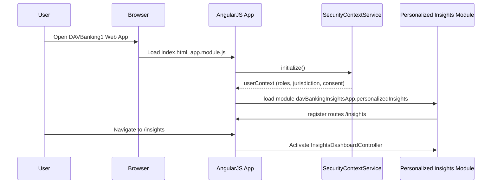
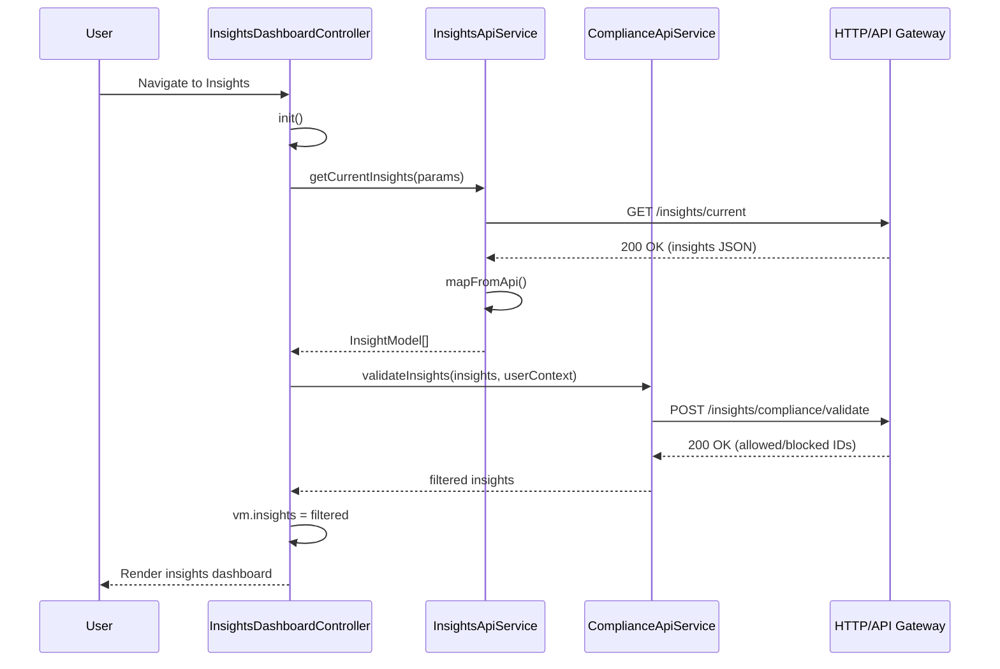

# Low-Level Design (LLD)

## Epic: QE-3010 – DAVBanking1 – Personalized Financial Insight Generation

---

## 1. Application Architecture

### 1.1 Technology Stack

- Frontend:
  - AngularJS 1.x (Angular 1.7.x)
  - JavaScript ES6 (transpiled for legacy browsers if needed)
  - HTML5, CSS3, Bootstrap 3/4
- Architecture:
  - AngularJS MVC (module → config/run → routes → controllers → services → directives → views)
  - RESTful integration with backend Personalized Insight Service via API Gateway
- Patterns:
  - Dependency Injection (AngularJS DI)
  - Service/Factory for API communication
  - Controller-as syntax
  - Component-style directives for reusable UI blocks
  - Promise-based async flows ($http, $q)

### 1.2 AngularJS Module and Component Mapping

**Root Application Module**
- Module: `davBankingInsightsApp`
- File: `src/app/app.module.js`
- Responsibility: Root AngularJS module wiring together feature modules, shared utilities, and configuration.

**Feature Module – Personalized Insights**
- Module: `davBankingInsightsApp.personalizedInsights`
- File: `src/app/personalized-insights/personalized-insights.module.js`
- Responsibility: Encapsulates all functionality related to personalized financial insights, including views, controllers, services, models, and directives.

**Sub-Modules**
- `davBankingInsightsApp.personalizedInsights.core`
  - File: `src/app/personalized-insights/core/core.module.js`
  - Shared models, helpers, constants.
- `davBankingInsightsApp.personalizedInsights.services`
  - File: `src/app/personalized-insights/services/services.module.js`
  - REST services for insights, preferences, compliance, logging.
- `davBankingInsightsApp.personalizedInsights.ui`
  - File: `src/app/personalized-insights/ui/ui.module.js`
  - Controllers, directives, views.

### 1.3 Project Folder Structure (src as root)

```text
HLD/
LLD/
src/
  app/
    app.module.js
    app.config.js
    app.routes.js
    app.constants.js
    app.run.js

    shared/
      models/
        insight.model.js
        transaction.model.js
        user-preferences.model.js
      services/
        api-interceptor.service.js
        error-handler.service.js
        logging.service.js
        security-context.service.js
      directives/
        loading-spinner/
          loading-spinner.directive.js
          loading-spinner.template.html
      filters/
        currency-abbrev.filter.js
        date-range.filter.js

    personalized-insights/
      personalized-insights.module.js
      core/
        core.module.js
        insight-mapper.factory.js
        insight-constants.constant.js
        feature-flags.constant.js
      services/
        services.module.js
        insights-api.service.js
        preferences-api.service.js
        compliance-api.service.js
        audit-log-api.service.js
        cache.service.js
      ui/
        ui.module.js
        insights.routes.js
        controllers/
          insights-dashboard.controller.js
          insight-detail.controller.js
          insight-preferences.controller.js
        directives/
          insight-card/
            insight-card.directive.js
            insight-card.template.html
          insight-list/
            insight-list.directive.js
            insight-list.template.html
        views/
          insights-dashboard.html
          insight-detail.html
          insight-preferences.html

  assets/
    css/
      main.css
      insights.css
    img/
      insights/
        categories/*.svg
        placeholders/*.png

  config/
    env.config.dev.js
    env.config.uat.js
    env.config.prod.js

  tests/
    unit/
      personalized-insights/
        insights-api.service.spec.js
        insights-dashboard.controller.spec.js
        insight-card.directive.spec.js
    e2e/
      personalized-insights/
        insights-workflows.e2e.spec.js
```

- Only `HLD` and `LLD` exist outside `src` as required.

---

## 2. Component Specifications

### 2.1 Root Module – `davBankingInsightsApp`

- Type: AngularJS Module
- File: `src/app/app.module.js`
- Responsibility: Bootstrap application, declare dependencies (`ui.router` or `ngRoute`, `davBankingInsightsApp.personalizedInsights`, shared modules).
- Public API: N/A (module declaration only)
- Dependencies:
  - `ngAnimate`, `ngSanitize`, `ui.bootstrap`, `ui.router`
  - `davBankingInsightsApp.personalizedInsights`

### 2.2 App Configuration – `app.config`

- Type: Config Block
- File: `src/app/app.config.js`
- Responsibility:
  - Configure routing defaults, HTTP interceptors, security headers, global error handling hooks.
- Public Methods:
  - N/A (configuration functions for `$stateProvider`, `$urlRouterProvider`, `$httpProvider`)
- Injected Dependencies:
  - `$stateProvider`, `$urlRouterProvider`, `$httpProvider`, `ENV_CONFIG`, `FEATURE_FLAGS`

### 2.3 App Run Block – `app.run`

- Type: Run Block
- File: `src/app/app.run.js`
- Responsibility:
  - Initialize security context, load user profile and preferences, register global event listeners (state change, API error broadcast).
- Public Methods:
  - N/A, but exposes events on `$rootScope` (e.g. `insights:refresh`)
- Injected Dependencies:
  - `$rootScope`, `$state`, `SecurityContextService`, `LoggingService`

### 2.4 Insight Models

#### 2.4.1 `InsightModel`

- Type: Factory
- File: `src/app/shared/models/insight.model.js`
- Responsibility:
  - Represent a personalized financial insight with fields for metadata, content, lifecycle, and lineage.
- Public Methods:
  - `create(rawInsight)` → `InsightModel` instance
  - `isActionable()` → boolean
  - `isExpired()` → boolean
- Dependencies:
  - None (pure object factory)

#### 2.4.2 `TransactionModel`

- Type: Factory
- File: `src/app/shared/models/transaction.model.js`
- Responsibility:
  - Represent a financial transaction used in insight explanations (when necessary).
- Public Methods:
  - `create(rawTxn)` → `TransactionModel`
- Dependencies: None

#### 2.4.3 `UserPreferencesModel`

- Type: Factory
- File: `src/app/shared/models/user-preferences.model.js`
- Responsibility:
  - Store insight-related preferences such as categories enabled, notification thresholds, consent flags.
- Public Methods:
  - `create(rawPrefs)`
  - `hasConsent(category)`
  - `isCategoryEnabled(category)`
- Dependencies: None

### 2.5 Core Insight Mapping – `InsightMapper`

- Type: Factory
- File: `src/app/personalized-insights/core/insight-mapper.factory.js`
- Responsibility:
  - Transform backend DTOs into `InsightModel` instances, enforcing data minimization and output filtering.
- Public Methods:
  - `mapFromApi(apiResponse)` → `InsightModel[]`
- Dependencies:
  - `InsightModel`, `TransactionModel`

### 2.6 Insight Constants – `INSIGHT_CONSTANTS`

- Type: Constant
- File: `src/app/personalized-insights/core/insight-constants.constant.js`
- Responsibility:
  - Provide categories, severity levels, default thresholds, error messages.
- Public Fields:
  - `CATEGORIES`, `SEVERITY`, `DEFAULT_LIMITS`, `MESSAGES`

### 2.7 Feature Flags – `FEATURE_FLAGS`

- Type: Constant
- File: `src/app/personalized-insights/core/feature-flags.constant.js`
- Responsibility:
  - Toggle experimental insight types, AI engine variants, and UI behaviors.

### 2.8 Services

#### 2.8.1 `InsightsApiService`

- Type: Service
- File: `src/app/personalized-insights/services/insights-api.service.js`
- Responsibility:
  - Communication with backend Personalized Insight Service through API Gateway.
  - Supports fetching current insights, historical insights, and acknowledging actions.
- Public Methods:
  - `getCurrentInsights(params)` → Promise<InsightModel[]>
  - `getInsightById(insightId)` → Promise<InsightModel>
  - `acknowledgeInsight(insightId, action)` → Promise
  - `refreshInsights()` → Promise<InsightModel[]>
- Inputs:
  - `params`: filter criteria (date range, category, severity)
  - `insightId`, `action` (e.g., "viewed", "dismissed", "navigated")
- Outputs:
  - Promise resolving to mapped `InsightModel` array or single instance
- Dependencies:
  - `$http`, `$q`, `ENV_CONFIG`, `InsightMapper`, `ErrorHandlerService`, `LoggingService`, `CacheService`

#### 2.8.2 `PreferencesApiService`

- Type: Service
- File: `src/app/personalized-insights/services/preferences-api.service.js`
- Responsibility:
  - CRUD operations for insight preferences and consent settings.
- Public Methods:
  - `getPreferences()` → Promise<UserPreferencesModel>
  - `updatePreferences(preferences)` → Promise<UserPreferencesModel>
- Inputs:
  - `preferences` (UserPreferencesModel or plain object)
- Outputs:
  - Updated preferences model
- Dependencies:
  - `$http`, `$q`, `ENV_CONFIG`, `UserPreferencesModel`, `ErrorHandlerService`

#### 2.8.3 `ComplianceApiService`

- Type: Service
- File: `src/app/personalized-insights/services/compliance-api.service.js`
- Responsibility:
  - Validate whether certain insight categories can be displayed based on jurisdiction and consent.
- Public Methods:
  - `validateInsights(insights, userContext)` → Promise<InsightModel[]>
- Inputs:
  - `insights`: array of `InsightModel`
  - `userContext`: includes jurisdiction, roles, consent flags
- Dependencies:
  - `$http`, `ENV_CONFIG`, `ErrorHandlerService`

#### 2.8.4 `AuditLogApiService`

- Type: Service
- File: `src/app/personalized-insights/services/audit-log-api.service.js`
- Responsibility:
  - Send audit events for insight generation, view, dismiss, and navigation.
- Public Methods:
  - `logEvent(eventType, payload)` → Promise
- Inputs:
  - `eventType`: e.g., `INSIGHT_VIEW`, `INSIGHT_DISMISS`, `INSIGHT_CLICK_THROUGH`
  - `payload`: anonymized, non-sensitive fields (insightId, category, timestamp, modelVersion)
- Dependencies:
  - `$http`, `ENV_CONFIG`, `ErrorHandlerService`

#### 2.8.5 `CacheService`

- Type: Service
- File: `src/app/personalized-insights/services/cache.service.js`
- Responsibility:
  - Cache insights for session to support fallback when backend is unavailable.
- Public Methods:
  - `set(key, value)`
  - `get(key)`
  - `clear(key)`
- Dependencies:
  - `$window` (for sessionStorage/localStorage)

#### 2.8.6 Shared `ApiInterceptorService`

- Type: Service (HTTP interceptor)
- File: `src/app/shared/services/api-interceptor.service.js`
- Responsibility:
  - Attach auth tokens, correlation IDs, and handle global HTTP responses.
- Public Methods:
  - `request(config)`
  - `response(response)`
  - `responseError(rejection)`
- Dependencies:
  - `$q`, `SecurityContextService`, `LoggingService`, `ErrorHandlerService`

#### 2.8.7 Shared `ErrorHandlerService`

- Type: Service
- File: `src/app/shared/services/error-handler.service.js`
- Responsibility:
  - Normalize errors from backend and provide user-friendly messages.
- Public Methods:
  - `handle(error, context)` → normalized error object
  - `getUserMessage(errorCode)`
- Dependencies:
  - `LoggingService`

#### 2.8.8 Shared `LoggingService`

- Type: Service
- File: `src/app/shared/services/logging.service.js`
- Responsibility:
  - Client-side logging with log levels and optional remote logging.
- Public Methods:
  - `info(message, meta)`
  - `warn(message, meta)`
  - `error(message, meta)`
- Dependencies:
  - `$http`, `ENV_CONFIG`

#### 2.8.9 Shared `SecurityContextService`

- Type: Service
- File: `src/app/shared/services/security-context.service.js`
- Responsibility:
  - Store and expose authenticated user details, roles, and consent context.
- Public Methods:
  - `getUser()`
  - `getRoles()`
  - `getJurisdiction()`
  - `getConsentContext()`
- Dependencies:
  - None (initialized from `app.run` with backend session info)

### 2.9 Controllers

#### 2.9.1 `InsightsDashboardController`

- Type: Controller
- File: `src/app/personalized-insights/ui/controllers/insights-dashboard.controller.js`
- Responsibility:
  - Fetch, filter, and display list of personalized insights on dashboard.
  - Manage state (loading, empty, error) and handle user interactions (view, dismiss, navigate).
- Alias: `vm`
- Public Methods:
  - `init()` – load current insights
  - `refresh()` – reload insights
  - `applyFilter(filter)` – update filters
  - `onInsightAction(insight, action)` – handle actions from `insight-card`
- Scope/Bindings:
  - Data: `vm.insights`, `vm.filter`, `vm.state`
- Dependencies:
  - `InsightsApiService`, `ComplianceApiService`, `AuditLogApiService`, `UserPreferencesModel`, `ErrorHandlerService`, `$scope`, `$rootScope`

#### 2.9.2 `InsightDetailController`

- Type: Controller
- File: `src/app/personalized-insights/ui/controllers/insight-detail.controller.js`
- Responsibility:
  - Display detailed explanation for a specific insight, including derived metrics and limited transaction samples.
- Public Methods:
  - `init()` – load insight by ID
- Dependencies:
  - `$stateParams`, `InsightsApiService`, `AuditLogApiService`, `ErrorHandlerService`

#### 2.9.3 `InsightPreferencesController`

- Type: Controller
- File: `src/app/personalized-insights/ui/controllers/insight-preferences.controller.js`
- Responsibility:
  - View/edit user insight preferences and consent flags.
- Public Methods:
  - `loadPreferences()`
  - `savePreferences()`
- Dependencies:
  - `PreferencesApiService`, `ErrorHandlerService`, `UserPreferencesModel`

### 2.10 Directives / Components

#### 2.10.1 `insightCard` Directive

- Type: Directive (component-style)
- File: `src/app/personalized-insights/ui/directives/insight-card/insight-card.directive.js`
- Template: `src/app/personalized-insights/ui/directives/insight-card/insight-card.template.html`
- Responsibility:
  - Present single insight summary (title, category, highlight, timestamp, CTA button).
- Scope:
  - `insight` (one-way binding)
  - `onAction` (output callback)
- Public API:
  - Emits `onAction({ insight: insight, action: actionType })`
- Dependencies:
  - None (presentational)

#### 2.10.2 `insightList` Directive

- Type: Directive
- File: `src/app/personalized-insights/ui/directives/insight-list/insight-list.directive.js`
- Template: `src/app/personalized-insights/ui/directives/insight-list/insight-list.template.html`
- Responsibility:
  - Render list/grid of `insightCard` components with infinite scroll / pagination.
- Scope:
  - `insights`, `onAction`

#### 2.10.3 Shared `loadingSpinner` Directive

- Type: Directive
- File: `src/app/shared/directives/loading-spinner/loading-spinner.directive.js`
- Responsibility:
  - Display loading animation for async states.

### 2.11 Views

- `insights-dashboard.html`
  - File: `src/app/personalized-insights/ui/views/insights-dashboard.html`
  - Contains header, filters, `insight-list`, and empty/error states.

- `insight-detail.html`
  - File: `src/app/personalized-insights/ui/views/insight-detail.html`
  - Detailed representation of selected insight.

- `insight-preferences.html`
  - File: `src/app/personalized-insights/ui/views/insight-preferences.html`

---

## 3. Component Responsibilities

### 3.1 UI Layer

- **Controllers** own:
  - View-level state (loading/error/empty)
  - Coordination between services and directives
  - Non-visual business logic like filtering, sorting, local state transitions

- **Directives** own:
  - DOM representation
  - User interaction events (clicks, hovers) and UI-specific logic

### 3.2 Service Layer

- **InsightsApiService** owns:
  - All communication with backend insight endpoints.
  - Invokes `InsightMapper` for transforming API payloads.
  - Minimal business logic related to query params, caching, retries.

- **PreferencesApiService** owns:
  - Syncing preference changes with backend.
  - Applying defaults when no preferences exist.

- **ComplianceApiService** owns:
  - Enforcing client-side filtering based on backend compliance decisions (e.g., hide credit-related insights for certain jurisdictions if flagged).

- **AuditLogApiService** owns:
  - Capturing user actions and sending them to backend.

- **SecurityContextService** owns:
  - Providing current user, roles, jurisdiction, consent context.

### 3.3 Model Layer

- **Models** (InsightModel, TransactionModel, UserPreferencesModel) own:
  - Data structure definition
  - Validation logic per object
  - Derived properties (e.g., `isActionable`, `isExpired`)

---

## 4. Interface Specifications

### 4.1 REST API Interfaces

All API base URLs are prefixed with `ENV_CONFIG.API_BASE_URL` (e.g., `/api/v1`).

#### 4.1.1 Get Current Insights

- Endpoint: `GET /insights/current`
- Description: Fetch latest personalized insights for authenticated customer.
- Request:
  - Headers:
    - `Authorization: Bearer <token>`
    - `X-Correlation-Id: <uuid>`
  - Query Params:
    - `category` (optional, string)
    - `fromDate` (optional, ISO-8601 date)
    - `toDate` (optional, ISO-8601 date)
    - `severity` (optional, string)
- Response (200):
  ```json
  {
    "insights": [
      {
        "id": "INS-12345",
        "title": "You spent more on dining this month",
        "category": "SPENDING_TREND",
        "severity": "MEDIUM",
        "summary": "Dining spend increased by 25% vs last month.",
        "createdAt": "2025-03-05T10:15:30Z",
        "validUntil": "2025-04-05T10:15:30Z",
        "actionLabel": "View breakdown",
        "actions": ["VIEW_DETAILS", "DISMISS"],
        "lineageId": "LIN-98765",
        "modelVersion": "insight-model-2025.03.01",
        "explanation": {
          "highLevel": "Based on 42 recent transactions.",
          "keyDrivers": ["Increased restaurant visits"]
        }
      }
    ],
    "lastGeneratedAt": "2025-03-05T10:15:30Z"
  }
  ```
- Error Responses:
  - 401: Unauthorized
  - 403: Forbidden (lack of consent)
  - 503: Service unavailable

#### 4.1.2 Get Insight by ID

- Endpoint: `GET /insights/{insightId}`
- Response (200):
  ```json
  {
    "id": "INS-12345",
    "title": "You spent more on dining this month",
    "category": "SPENDING_TREND",
    "details": {
      "period": {
        "start": "2025-02-01",
        "end": "2025-02-28"
      },
      "amount": 250.75,
      "vsBaseline": 0.25,
      "topMerchants": ["Restaurant A", "Restaurant B"],
      "sampleTransactions": [
        {
          "date": "2025-02-10",
          "description": "Restaurant A",
          "amount": 45.6,
          "category": "DINING"
        }
      ]
    },
    "explanation": {
      "highLevel": "Dining expenses higher than typical month.",
      "keyDrivers": ["Weekend outings", "New restaurant"]
    }
  }
  ```

#### 4.1.3 Acknowledge Insight Action

- Endpoint: `POST /insights/{insightId}/actions`
- Request Body:
  ```json
  {
    "action": "VIEW_DETAILS",
    "actionAt": "2025-03-05T11:00:00Z",
    "metadata": {
      "source": "WEB",
      "device": "DESKTOP"
    }
  }
  ```
- Response (202):
  ```json
  {
    "status": "ACCEPTED"
  }
  ```

#### 4.1.4 Get Preferences

- Endpoint: `GET /insights/preferences`
- Response (200):
  ```json
  {
    "categoriesEnabled": ["SPENDING_TREND", "BUDGET_ALERT"],
    "notifications": {
      "email": true,
      "push": true
    },
    "consent": {
      "insightsProcessing": true,
      "thirdPartySharing": false
    }
  }
  ```

#### 4.1.5 Update Preferences

- Endpoint: `PUT /insights/preferences`
- Request Body:
  ```json
  {
    "categoriesEnabled": ["SPENDING_TREND"],
    "notifications": {
      "email": false,
      "push": true
    },
    "consent": {
      "insightsProcessing": true,
      "thirdPartySharing": false
    }
  }
  ```

#### 4.1.6 Compliance Validation (Client-Side)

- Endpoint: `POST /insights/compliance/validate`
- Request Body:
  ```json
  {
    "insights": [
      {
        "id": "INS-12345",
        "category": "SPENDING_TREND",
        "jurisdiction": "EU",
        "consentFlags": {
          "insightsProcessing": true
        }
      }
    ]
  }
  ```
- Response (200):
  ```json
  {
    "allowedInsightIds": ["INS-12345"],
    "blockedInsightIds": [],
    "reasonByInsightId": {}
  }
  ```

#### 4.1.7 Audit Logging

- Endpoint: `POST /audit/events`
- Request Body:
  ```json
  {
    "eventType": "INSIGHT_VIEW",
    "eventTime": "2025-03-05T11:00:00Z",
    "insightId": "INS-12345",
    "category": "SPENDING_TREND",
    "modelVersion": "insight-model-2025.03.01",
    "channel": "WEB",
    "userIdHash": "abc123",
    "sessionId": "sess-999",
    "lineageId": "LIN-98765"
  }
  ```

### 4.2 Controller-Service-Directive Interactions

- `InsightsDashboardController` calls:
  - `InsightsApiService.getCurrentInsights()`
  - `ComplianceApiService.validateInsights()`
  - `AuditLogApiService.logEvent()`
  - Emits events to directives via bound callbacks.

- `insightCard` directive:
  - Receives `insight` object
  - Invokes `onAction` bound from controller (`onAction({ insight, action })`).

---

## 5. Data Model Design

### 5.1 InsightModel

- Object Name: `InsightModel`
- Attributes:
  - `id` (string, required)
  - `title` (string, required)
  - `category` (string, required; enum from `INSIGHT_CONSTANTS.CATEGORIES`)
  - `severity` (string, optional; enum `LOW|MEDIUM|HIGH`)
  - `summary` (string, required)
  - `details` (object, optional)
  - `actions` (array<string>, default `[]`)
  - `actionLabel` (string, optional)
  - `createdAt` (Date, required)
  - `validUntil` (Date, optional)
  - `lineageId` (string, required)
  - `modelVersion` (string, required)
  - `explanation` (object, optional; sanitized strings only)
  - `state` (string; enum `NEW|VIEWED|DISMISSED` default `NEW`)

- Default Values:
  - `severity = 'LOW'`
  - `actions = []`
  - `state = 'NEW'`

- Validation Rules:
  - `id`, `title`, `category`, `summary` must be non-empty.
  - `category` must be whitelisted; unknown categories rejected.
  - `explanation` content sanitized to prevent HTML injection.

- State Transitions:
  - `NEW` → `VIEWED` (on view action)
  - `NEW` or `VIEWED` → `DISMISSED` (on dismiss action)
  - No transitions from `DISMISSED` back to `NEW`.

### 5.2 TransactionModel

- Attributes:
  - `date` (Date, required)
  - `description` (string, required)
  - `amount` (number, required)
  - `currency` (string, default from user profile)
  - `category` (string, optional)

- Validation:
  - `amount` must be non-negative.
  - `description` sanitized.

### 5.3 UserPreferencesModel

- Attributes:
  - `categoriesEnabled` (array<string>, default: all available categories)
  - `notifications` (object: `email`, `push` booleans)
  - `consent` (object: `insightsProcessing`, `thirdPartySharing`)

- Validation:
  - `insightsProcessing` must be true for insights to be fetched; otherwise, UI shows consent required message.

### 5.4 Error Model (Client-Side)

- Object: `ClientError`
- Attributes:
  - `code` (string)
  - `message` (string)
  - `httpStatus` (number)
  - `details` (object)

---

## 6. Data Flow

### 6.1 High-Level Flow (Dashboard)

1. **User Action**: User navigates to Personalized Insights screen.
2. **View**: `insights-dashboard.html` is loaded.
3. **Controller**: `InsightsDashboardController.init()` is invoked from `ng-init` or `$onInit`.
4. **Service**: `InsightsApiService.getCurrentInsights()` called.
5. **Model/API**: `$http` request to `/insights/current` via API Gateway.
6. **Response**: Insights JSON returned; `InsightMapper.mapFromApi()` converts to `InsightModel[]`.
7. **Compliance**: `ComplianceApiService.validateInsights()` filters insights.
8. **UI Update**: Controller sets `vm.insights`, transitions state to `loaded`; `insight-list` renders cards.
9. **User Interaction**: User clicks an insight card action; `insightCard` calls `onAction`.
10. **Controller**: `onInsightAction()` updates local state, calls `AuditLogApiService.logEvent()` and possibly `acknowledgeInsight()`.

### 6.2 Error Flow

- On HTTP error:
  - `ApiInterceptorService.responseError()` is called.
  - It passes error to `ErrorHandlerService.handle()`.
  - `ErrorHandlerService` categorizes error (network, auth, server) and returns `ClientError`.
  - Controller sets `vm.state = 'error'` and `vm.errorMessage` from `ClientError`.
  - UI displays non-sensitive message such as "Insights are temporarily unavailable. Please try again later."

---

## 7. Sequence Diagrams (Mermaid)

### 7.1 Application Initialization



### 7.2 Primary User Workflow – View Insights Dashboard



### 7.3 Service/API Interactions – Acknowledge Insight

```mermaid
sequenceDiagram
  participant U as User
  participant D as insightCard Directive
  participant C as InsightsDashboardController
  participant S as InsightsApiService
  participant A as AuditLogApiService
  participant H as API Gateway

  U->>D: Click 