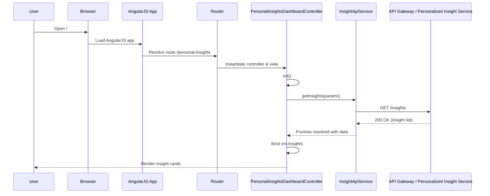
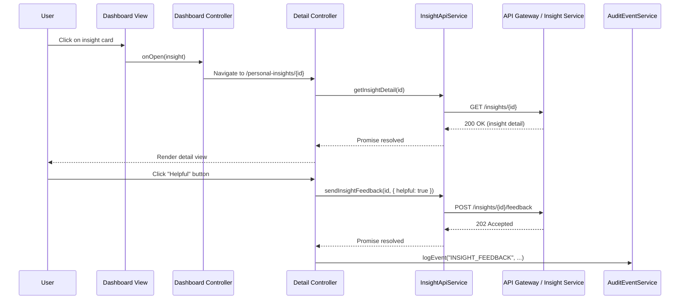
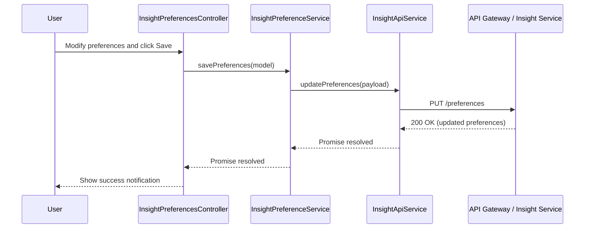
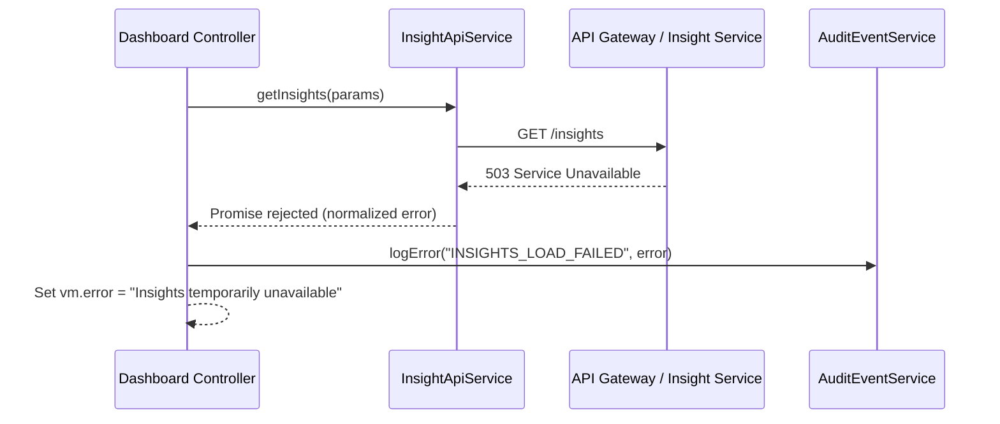

# Low-Level Design (LLD)
## Epic QE-3010 – DAVBanking1 – Personalized Financial Insight Generation

---

## 1. Application Architecture

### 1.1 Overall AngularJS MVC Mapping

This epic implements the **Personalized Financial Insights** feature set inside the DAVBanking1 web channel as an AngularJS (1.x) single-page module. The front end consumes back-end APIs exposed via the bank’s API Gateway and the Personalized Insight Service.

**High-level mapping:**

- **AngularJS Module**: `davBanking.personalInsights`
- **Views (HTML templates)** (V):
  - `personal-insights-dashboard.html` – main insight dashboard with cards and summaries.
  - `personal-insights-detail.html` – drill-down view for a specific insight.
  - `personal-insights-preferences.html` – user consent, channels, and visibility preferences.
- **Controllers** (C):
  - `PersonalInsightsDashboardController` – orchestrates retrieval, filtering, and display of insight cards.
  - `PersonalInsightDetailController` – displays insight details and interaction history.
  - `InsightPreferencesController` – manages user consent and preference configuration.
- **Services / Factories** (M / data + integration):
  - `InsightApiService` – REST client for Personalized Insight Service via API Gateway.
  - `InsightModelService` – client-side state/model manager for insights and related metadata.
  - `InsightPreferenceService` – manages preference and consent state in UI and via APIs.
  - `SecurityContextService` (shared from core app) – exposes current authenticated user, roles, and tokens.
  - `AuditEventService` (shared) – logs UI events (view, dismiss, click-through) to logging endpoint.
- **Directives / Components**:
  - `piInsightCard` – reusable insight card directive.
  - `piInsightList` – container directive for lists with paging/filtering.
  - `piInsightSkeleton` – loading placeholder.
  - `piConsentBanner` – compact banner for consent capture.
- **Filters**:
  - `piCurrency` – currency formatting consistent with locale.
  - `piPercent` – ratio/percentage formatting.
  - `piDateRange` – transforms date ranges into human-readable strings.

**HLD → AngularJS artifact mapping (front-end view of HLD components):**

- **Customer Channel (Mobile / Web App)** → AngularJS views + controllers + directives (`personal-insights-*` templates and controllers, `pi*` directives).
- **API Gateway** → Not implemented in Angular; represented by base URL configuration and `$http` interceptors for auth/headers.
- **Personalized Insight Service** → `InsightApiService` (REST client), `InsightModelService`.
- **Transaction Data Platform / Core Banking** → Indirect; surfaced via Personalized Insight Service responses. Mapped to `TransactionSummaryModel` objects.
- **AI Insight and Recommendation Engine** → Indirect; outputs appear as `InsightModel` objects managed in `InsightModelService`.
- **Authentication and Authorization Service** → `SecurityContextService`, `$http` interceptors adding bearer tokens, route guards.
- **Regulatory Compliance Services** → Indirect; UI honours flags from API (`isRestricted`, `jurisdiction`, `maskingLevel`). Validation logic in controllers.
- **Audit Logging and Monitoring Platform** → `AuditEventService` for client-side event logging.
- **Security Services (Encryption, KMS)** → Enforced on back end; front end ensures HTTPS, secure headers, no sensitive data persisted in local storage.
- **Data Quality and Lineage Service** → Data lineage identifiers exposed as `lineageId` in `InsightModel` (used for support, not user-facing).
- **Analytics and Model Monitoring Store** → Indirect via event logging APIs.
- **Insight Preference and Consent Store** → `InsightPreferenceService` wrapping REST APIs for preferences.

### 1.2 Recommended Project Folder Structure

```text
app/
  core/
    services/
      security-context.service.js
      audit-event.service.js
      http-interceptor.factory.js
  personal-insights/
    personal-insights.module.js
    config/
      personal-insights.routes.js
      personal-insights.constants.js
    controllers/
      personal-insights-dashboard.controller.js
      personal-insights-detail.controller.js
      insight-preferences.controller.js
    services/
      insight-api.service.js
      insight-model.service.js
      insight-preference.service.js
    directives/
      pi-insight-card.directive.js
      pi-insight-list.directive.js
      pi-insight-skeleton.directive.js
      pi-consent-banner.directive.js
    filters/
      pi-currency.filter.js
      pi-percent.filter.js
      pi-date-range.filter.js
    views/
      personal-insights-dashboard.html
      personal-insights-detail.html
      personal-insights-preferences.html
assets/
  styles/
    personal-insights.css
```

The module `davBanking.personalInsights` is wired into the root application module, e.g. `davBankingWebApp`.

---

## 2. Component Specifications

### 2.1 AngularJS Module: `davBanking.personalInsights`

- **Type**: Module
- **File**: `app/personal-insights/personal-insights.module.js`
- **Responsibility**: Declare dependencies, register controllers, services, directives, and configuration (routes, constants).
- **Public API**: N/A (Angular module definition)
- **Dependencies**:
  - `ngRoute` or `ui.router`
  - `davBanking.core` (for shared services)

**Implementation Sketch:**
```js
angular.module('davBanking.personalInsights', [
  'ngRoute',
  'davBanking.core'
]);
```

---

### 2.2 Controllers

#### 2.2.1 `PersonalInsightsDashboardController`

- **Type**: Controller
- **File**: `app/personal-insights/controllers/personal-insights-dashboard.controller.js`
- **Responsibility**:
  - Load current user’s summarized insights.
  - Manage filters (time range, categories, severity).
  - Handle user interactions on insight cards (open detail, mark as read, dismiss, navigate to budgeting or recommendations modules).
  - Coordinate loading states and error messages.
- **Public Methods** (exposed on `$scope` / `vm`):
  - `init()` – initializes controller state and triggers initial load.
  - `refreshInsights()` – reloads insight list.
  - `applyFilter(filterCriteria)` – updates filter and refreshes view.
  - `openInsight(insight)` – navigates to detail route.
  - `dismissInsight(insight)` – hides insight from dashboard and calls API if supported.
  - `navigateToBudgets()` – route to Budgeting module (QE-3012).
- **Inputs**:
  - Route params: optional `timeRange`, `segment`.
  - User context from `SecurityContextService`.
- **Outputs**:
  - Updates to view model (`vm.insights`, `vm.filters`, `vm.loading`, `vm.error`).
  - Calls to `AuditEventService` for events.
- **Injected Dependencies**:
  - `$scope` or controller-as `vm` pattern
  - `$location` or `$state`
  - `InsightApiService`
  - `InsightModelService`
  - `InsightPreferenceService`
  - `SecurityContextService`
  - `AuditEventService`
  - `$q`, `$log`

#### 2.2.2 `PersonalInsightDetailController`

- **Type**: Controller
- **File**: `app/personal-insights/controllers/personal-insights-detail.controller.js`
- **Responsibility**:
  - Retrieve and display full details for a specific insight (description, rationale, impacted accounts, time series).
  - Present recommended actions (link to other modules like QE-3011/3012/3013/3014/3015).
  - Handle user interactions: mark as helpful/not helpful, open related transactions.
- **Public Methods**:
  - `init()` – load by `insightId` from route.
  - `markHelpful()` / `markNotHelpful()` – send feedback to back end.
  - `showRelatedTransactions()` – emits event to transactions module or navigates with account/transaction filters.
  - `backToDashboard()` – navigation helper.
- **Inputs**:
  - Route param `insightId`.
- **Outputs**:
  - UI state updates; logs view and feedback events.
- **Injected Dependencies**:
  - `$stateParams` or `$routeParams`
  - `InsightApiService`
  - `InsightModelService`
  - `AuditEventService`
  - `SecurityContextService`
  - `$log`

#### 2.2.3 `InsightPreferencesController`

- **Type**: Controller
- **File**: `app/personal-insights/controllers/insight-preferences.controller.js`
- **Responsibility**:
  - Display and update user consent and preferences for personalized insights.
  - Manage toggles like: enable insights, categories visibility, notification channels, data-sharing scope.
  - Enforce rules based on jurisdiction attributes from back end.
- **Public Methods**:
  - `init()` – load preferences from API.
  - `savePreferences()` – validate and persist changes.
  - `resetToDefaults()` – revert to server-provided defaults.
- **Inputs**:
  - Existing preferences from `InsightPreferenceService`.
- **Outputs**:
  - Updated preference model; success/error notifications.
- **Injected Dependencies**:
  - `InsightPreferenceService`
  - `SecurityContextService`
  - `AuditEventService`
  - `$log`, `$q`

---

### 2.3 Services / Factories

#### 2.3.1 `InsightApiService`

- **Type**: Service (factory)
- **File**: `app/personal-insights/services/insight-api.service.js`
- **Responsibility**:
  - Encapsulate all REST communication with the Personalized Insight backend.
  - Handle HTTP concerns: headers, auth token injection (via interceptor), error normalization, timeouts.
- **Public Methods**:
  - `getInsights(params)` – fetch list of insights.
  - `getInsightDetail(insightId)` – fetch details for a single insight.
  - `getPreferences()` – fetch current user insight preferences.
  - `updatePreferences(preferences)` – save preferences/consent.
  - `dismissInsight(insightId)` – mark insight as dismissed/hidden.
  - `sendInsightFeedback(insightId, payload)` – send helpful/not-helpful or interaction feedback.
- **Inputs**:
  - Query parameters (`timeRange`, `category`, `limit`, `offset`).
  - Insight identifiers and preference payloads.
- **Outputs**:
  - Normalized promise-based responses with data objects.
- **Injected Dependencies**:
  - `$http`
  - `$q`
  - `PERSONAL_INSIGHTS_API_BASE_URL` (constant)

#### 2.3.2 `InsightModelService`

- **Type**: Service
- **File**: `app/personal-insights/services/insight-model.service.js`
- **Responsibility**:
  - Maintain client-side cache of insights and provide transformation/mapping from API DTOs to view models.
  - Provide convenience methods for filtering, grouping, and summarizing insights.
- **Public Methods**:
  - `setInsights(rawList)` – store and normalize insight list.
  - `getInsights()` – retrieve current cached list.
  - `getInsightById(id)` – get a single insight from cache.
  - `updateInsight(insight)` – update a single insight in cache.
  - `clear()` – clear cache on logout or user switch.
- **Inputs**:
  - Raw API data structures.
- **Outputs**:
  - `InsightModel` objects (see Data Model section).
- **Injected Dependencies**:
  - `$log`
  - Optional: `lodash` or custom utility service.

#### 2.3.3 `InsightPreferenceService`

- **Type**: Service
- **File**: `app/personal-insights/services/insight-preference.service.js`
- **Responsibility**:
  - Read and update user insight preferences/consents.
  - Expose synchronous getters for cached preferences for fast UI checks.
- **Public Methods**:
  - `loadPreferences()` – calls `InsightApiService.getPreferences()` and caches result.
  - `getPreferences()` – returns cached preference model.
  - `savePreferences(model)` – validates and calls `updatePreferences` on API.
  - `isInsightsEnabled()` – quick boolean used for feature gating.
- **Injected Dependencies**:
  - `InsightApiService`
  - `$q`, `$log`

---

### 2.4 Directives / Components

#### 2.4.1 `piInsightCard`

- **Type**: Directive (element)
- **File**: `app/personal-insights/directives/pi-insight-card.directive.js`
- **Responsibility**:
  - Display a single insight card with title, summary, impact, and action buttons.
  - Emit events on click/dismiss/CTA actions.
- **Isolated Scope Bindings**:
  - `insight` – `=` two-way bound `InsightModel`.
  - `onOpen` – `&` callback for card open.
  - `onDismiss` – `&` callback for dismiss action.
- **Template**:
  - Bootstrap card with badges for severity/category and icons.
- **Dependencies**:
  - `piCurrency`, `piDateRange` filters, Bootstrap CSS.

#### 2.4.2 `piInsightList`

- **Type**: Directive (element)
- **File**: `app/personal-insights/directives/pi-insight-list.directive.js`
- **Responsibility**:
  - Render list of `piInsightCard` with pagination or infinite scroll.
  - Accept filters and apply them client-side when appropriate.
- **Bindings**:
  - `insights` – array of `InsightModel`.
  - `filters` – filter model.
  - `onOpen`, `onDismiss` – card-level callbacks.

#### 2.4.3 `piInsightSkeleton`

- **Type**: Directive (attribute or element)
- **Responsibility**:
  - Show skeleton loading placeholders while insights load.

#### 2.4.4 `piConsentBanner`

- **Type**: Directive (element)
- **Responsibility**:
  - Display inline consent banner when insights enabled is false or consent is required.
  - Provide accept/decline/learn more actions.

---

### 2.5 Filters

- **`piCurrency`** – localized currency formatting; wraps Angular’s `$filter('currency')` but uses bank-specific rules.
- **`piPercent`** – displays decimals as percentages with correct precision.
- **`piDateRange`** – transforms two dates into strings like `"Last 30 days"`, `"Jan–Mar 2026"`.

---

## 3. Component Responsibilities (Detailed)

### 3.1 UI Handling & State Management

- **Dashboard Controller** owns:
  - Dashboard-level state: filters, current page, sort order.
  - View loading indicator and error banners.
  - Decision to show `piConsentBanner` or list, based on `InsightPreferenceService.isInsightsEnabled()`.

- **Detail Controller** owns:
  - New fetch vs cached detail logic.
  - Mapping of insight attributes into UI elements: charts, recommendation CTA buttons.
  - Sending feedback events to API and `AuditEventService`.

- **Preference Controller** owns:
  - Client-side validation of consent and preferences.
  - Preventing contradictory choices based on compliance flags (read-only fields for restricted jurisdictions).

- **Model Services** own:
  - Local caching to minimize re-fetching.
  - Normalization of back-end data into consistent, UI-friendly shapes.

- **Directives** own:
  - Reusable visual representation.
  - DOM interaction (hover, toggles) without leaking business logic; they call provided callbacks rather than call APIs directly.

### 3.2 Business Logic Allocation

- **Front-end**:
  - Light transformation logic (formatting, derived labels). Example: computing risk level display label from `impactScore`.
  - Preference validation (e.g., min/max thresholds, required consents).
  - UI state transitions (read/unread, dismissed locally until refresh).

- **Back-end (assumed)**:
  - Heavy business logic: insight generation, AI evaluation, compliance checks, lineage, auditing.

Front-end must avoid replicating compliance rules; instead it uses flags such as `isActionAllowed`, `isInsightViewable`, `maskingLevel` from API.

### 3.3 API Communication Ownership

- **InsightApiService**:
  - Sole owner of URLs, HTTP methods, and back-end payload schemas.
  - Centralizes error normalization (HTTP codes → front-end error codes).

- **Controllers**:
  - Call service methods and handle success/error states.

- **Interceptors (in `davBanking.core`)**:
  - Attach authorization headers.
  - Global error handling for 401/403/5xx.

---

## 4. Interface Specifications

### 4.1 Front-End Service to Back-End REST APIs

Base path is configurable by environment.

- **Constant**: `PERSONAL_INSIGHTS_API_BASE_URL`
  - Example values:
    - Dev: `https://dev-api.davbanking.com/personal-insights/v1`
    - Prod: `https://api.davbanking.com/personal-insights/v1`

#### 4.1.1 Get Insights List

- **Endpoint**: `GET {BASE_URL}/insights`
- **Headers**:
  - `Authorization: Bearer <JWT>`
  - `X-Client-Channel: WEB`
- **Query Parameters**:
  - `timeRange` – `string` (`"LAST_30_DAYS"`, `"LAST_90_DAYS"`, `"YTD"`)
  - `category` – optional string (e.g., `"SPENDING"`, `"SAVINGS"`, `"FEES"`)
  - `limit` – integer, default 20, max 100
  - `offset` – integer, default 0
- **Response 200 (application/json)**:
```json
{
  "insights": [
    {
      "id": "INS-12345",
      "title": "You spent more on dining this month",
      "summary": "Dining expenses increased by 25% compared to last month.",
      "category": "SPENDING",
      "severity": "MEDIUM",
      "impactAmount": 75.34,
      "currency": "USD",
      "timeRange": {"from": "2026-06-01", "to": "2026-06-30"},
      "createdAt": "2026-07-01T10:30:00Z",
      "isRead": false,
      "isDismissed": false,
      "jurisdiction": "US",
      "isViewable": true,
      "lineageId": "LNG-99881",
      "lastUpdatedAt": "2026-07-01T10:30:00Z"
    }
  ],
  "paging": {"limit": 20, "offset": 0, "total": 52}
}
```
- **Error Responses**:
  - `401 Unauthorized` – token invalid/expired.
  - `403 Forbidden` – user not authorized to see insights.
  - `500 Internal Server Error` – generic; front end shows generic error card.

#### 4.1.2 Get Insight Detail

- **Endpoint**: `GET {BASE_URL}/insights/{insightId}`
- **Path Variables**: `insightId` (string)
- **Response 200**:
```json
{
  "id": "INS-12345",
  "title": "You spent more on dining this month",
  "description": "Your spending at restaurants increased by 25%...",
  "rationale": {
    "keyDrivers": ["Increased visits", "Higher average ticket"],
    "comparisonPeriod": "PREV_MONTH"
  },
  "category": "SPENDING",
  "severity": "MEDIUM",
  "impactAmount": 75.34,
  "currency": "USD",
  "timeSeries": [
    {"label": "Apr", "amount": 120.00},
    {"label": "May", "amount": 140.00},
    {"label": "Jun", "amount": 215.34}
  ],
  "relatedAccounts": [
    {"maskedAccountId": "***1234", "type": "CHECKING"}
  ],
  "actions": [
    {"type": "SET_BUDGET", "targetModule": "BUDGETING", "label": "Set dining budget"},
    {"type": "VIEW_TRANSACTIONS", "targetModule": "TRANSACTIONS", "label": "View dining transactions"}
  ],
  "jurisdiction": "US",
  "isViewable": true,
  "lineageId": "LNG-99881",
  "lastUpdatedAt": "2026-07-01T10:30:00Z"
}
```

#### 4.1.3 Get Insight Preferences

- **Endpoint**: `GET {BASE_URL}/preferences`
- **Response 200**:
```json
{
  "insightsEnabled": true,
  "categories": {
    "SPENDING": true,
    "SAVINGS": true,
    "FEES": true
  },
  "notificationChannels": {
    "IN_APP": true,
    "EMAIL": false,
    "PUSH": false
  },
  "jurisdiction": "US",
  "readOnlyFields": ["jurisdiction"],
  "updatedAt": "2026-06-30T08:00:00Z"
}
```

#### 4.1.4 Update Insight Preferences

- **Endpoint**: `PUT {BASE_URL}/preferences`
- **Request Body**:
```json
{
  "insightsEnabled": true,
  "categories": {
    "SPENDING": true,
    "SAVINGS": false,
    "FEES": true
  },
  "notificationChannels": {
    "IN_APP": true,
    "EMAIL": false,
    "PUSH": false
  }
}
```
- **Response 200**: Updated preference object as above.
- **Validation Errors 400**:
```json
{
  "errorCode": "INVALID_PREFERENCE",
  "message": "Email channel not allowed for this jurisdiction",
  "fieldErrors": {
    "notificationChannels.EMAIL": "NOT_PERMITTED"
  }
}
```

#### 4.1.5 Dismiss Insight

- **Endpoint**: `POST {BASE_URL}/insights/{insightId}/dismiss`
- **Request Body**:
```json
{ "reason": "USER_DISMISS" }
```
- **Response 200**:
```json
{ "status": "DISMISSED", "dismissedAt": "2026-07-02T09:30:00Z" }
```

#### 4.1.6 Insight Feedback

- **Endpoint**: `POST {BASE_URL}/insights/{insightId}/feedback`
- **Request Body**:
```json
{ "helpful": true, "comment": "Very useful" }
```
- **Response 202** – accepted for processing.

---

## 5. Data Model Design

### 5.1 JavaScript Models

#### 5.1.1 `InsightModel`

- **Object Name**: `InsightModel`
- **Attributes**:
  - `id: string` – required.
  - `title: string` – required, max 140 chars.
  - `summary: string` – summary for dashboard card.
  - `description: string` – detailed explanation.
  - `category: string` – enum: `SPENDING`, `SAVINGS`, `FEES`, `OTHER`.
  - `severity: string` – enum: `LOW`, `MEDIUM`, `HIGH`.
  - `impactAmount: number` – default 0.0.
  - `currency: string` – 3-letter ISO code; default from user profile.
  - `timeRange: { from: Date, to: Date }`.
  - `timeSeries: Array<{ label: string, amount: number }>` – optional.
  - `relatedAccounts: Array<{ maskedAccountId: string, type: string }>`.
  - `isRead: boolean` – default `false`.
  - `isDismissed: boolean` – default `false`.
  - `jurisdiction: string` – required for compliance overlay.
  - `isViewable: boolean` – default `true`.
  - `lineageId: string` – for support/tracking.
  - `createdAt: Date`.
  - `lastUpdatedAt: Date`.
- **Validation Rules**:
  - `id`, `title`, `category`, `severity`, `jurisdiction` required.
  - `impactAmount >= 0`.
  - `timeRange.from <= timeRange.to` when both provided.
- **State Transitions**:
  - `isRead: false → true` when user opens detail view.
  - `isDismissed: false → true` when user dismisses insight.

#### 5.1.2 `InsightPreferencesModel`

- **Attributes**:
  - `insightsEnabled: boolean` – default `false` until explicit user enabling.
  - `categories: { [categoryCode: string]: boolean }` – default all `true` when enabled.
  - `notificationChannels: { IN_APP: boolean, EMAIL: boolean, PUSH: boolean }` – default `IN_APP: true`.
  - `jurisdiction: string` – read-only in UI.
  - `readOnlyFields: string[]` – field paths that cannot be edited.
  - `updatedAt: Date`.
- **Validation Rules**:
  - At least one `notificationChannels` must be true when `insightsEnabled` is true.
  - Cannot modify any attribute listed in `readOnlyFields`.

#### 5.1.3 `TransactionSummaryModel` (used indirectly)

- **Attributes**:
  - `category: string`
  - `totalAmount: number`
  - `currency: string`
  - `periodLabel: string`

---

## 6. Data Flow

### 6.1 Dashboard Load Flow

**Sequence:** User Action → View → Controller → Service → API → Model → UI Update

1. User navigates to `/personal-insights` route.
2. Router instantiates `PersonalInsightsDashboardController` and loads `personal-insights-dashboard.html`.
3. `init()` is called:
   - It checks `InsightPreferenceService.isInsightsEnabled()`.
   - If false, show `piConsentBanner` and skip API calls.
4. If enabled:
   - Controller calls `InsightApiService.getInsights(params)`.
   - `InsightApiService` performs `GET /insights` and returns promise.
5. On success:
   - `InsightModelService.setInsights(response.insights)` transforms data to `InsightModel` instances.
   - Controller binds `vm.insights = InsightModelService.getInsights()`.
   - Loading flag set to false.
6. On error:
   - Controller sets `vm.error` with user-friendly message.
   - `AuditEventService.logError('INSIGHTS_LOAD_FAILED', errorDetails)`.

### 6.2 Insight Detail Flow

1. User clicks a card (`piInsightCard`), which triggers `onOpen({ insight: insight })` callback.
2. Dashboard controller navigates to `/personal-insights/:insightId`.
3. `PersonalInsightDetailController.init()` obtains `insightId` from route.
4. Controller attempts `InsightModelService.getInsightById(id)`:
   - If found and not stale, uses cached data.
   - Else calls `InsightApiService.getInsightDetail(id)`.
5. On success, binds detail model and sets `isRead = true` locally; optionally inform back end if required.
6. On error, shows error message and logs event.

### 6.3 Preference Update Flow

1. User opens Preferences screen.
2. Controller calls `InsightPreferenceService.loadPreferences()` if not loaded.
3. Model bound to form fields with Angular form controls.
4. On `Save`:
   - Controller validates model (e.g., at least one channel selected).
   - Calls `InsightPreferenceService.savePreferences(model)` which delegates to `InsightApiService.updatePreferences()`.
   - On success, toast success message and update cached model.
   - On error, display validation messages from `fieldErrors`.

### 6.4 Event Handling

- Controllers listen for global events like `auth:logout` to clear insight caches (`InsightModelService.clear()`).
- UI events, such as `markHelpful`, call back end and send audit log entries.

---

## 7. Sequence Diagrams (Mermaid)

### 7.1 Application Initialization for Personal Insights



### 7.2 Primary User Workflow – View Insight Detail and Provide Feedback



### 7.3 Service/API Interaction – Preferences Update



### 7.4 Error Handling Scenario – API Unavailable



---

## 8. Implementation Details

### 8.1 AngularJS Implementation Approach

- Use **controller-as syntax** (`vm = this`) to avoid `$scope` leaks.
- Place all REST invocations in `InsightApiService`; controllers should only manage UI logic.
- Use **named modules** for each domain area; this epic is encapsulated in `davBanking.personalInsights`.

### 8.2 JavaScript ES6 Patterns

- Transpile ES6 to ES5 via build pipeline (e.g., Babel) while keeping AngularJS 1.x compatibility.
- Use `const`/`let` for variable declarations.
- Use arrow functions in services and pure helper methods where `this` binding is not Angular-dependent.

Example:
```js
class InsightModelService {
  constructor($log) {
    'ngInject';
    this.$log = $log;
    this._insights = [];
  }

  setInsights(list) {
    this._insights = (list || []).map(item => this._normalize(item));
  }

  _normalize(item) {
    return {
      id: item.id,
      title: item.title,
      // ... mapping
    };
  }
}
```

### 8.3 Dependency Injection Details

- Use `/* @ngInject */` or `'ngInject'` annotations to avoid DI breakage during minification.
- Example registration:
```js
angular
  .module('davBanking.personalInsights')
  .service('InsightModelService', InsightModelService);
```

### 8.4 Business Logic Flow

- Controllers perform:
  - Input validation for user actions.
  - Determination of which insight categories to request.
  - Triggering of analytics/audit events.
- Service performs:
  - Data retrieval, caching, transformation.
  - Non-UI business rules such as deduplicating insights for display.

### 8.5 Validation Logic

- Use Angular forms with built-in validators and custom directives for complex checks.
- Example: `min-selected-channels` directive ensures at least one channel is selected.
- Display inline error messages bound to `form.$error` and server-side `fieldErrors`.

### 8.6 State Management Approach

- Local state kept inside controllers and shared state (insights, preferences) inside services.
- On route change, controllers re-fetch or re-bind from services as required.
- On logout, broadcast an event to clear state.

### 8.7 DOM Interaction Approach

- Use directives for direct DOM manipulation (tooltips, charts) instead of controllers.
- Integrate charting library (if required) via directive wrappers to display insight trends.

### 8.8 API Integration Approach

- `$http` with a shared interceptor adding:
  - Authorization header.
  - Correlation ID (`X-Correlation-Id`).
- Handle timeouts and cancellation tokens for slow calls.

---

## 9. Configuration

### 9.1 AngularJS Configuration Files

- `personal-insights.routes.js`:
  - Configure routes:
```js
$routeProvider
  .when('/personal-insights', {
    templateUrl: 'app/personal-insights/views/personal-insights-dashboard.html',
    controller: 'PersonalInsightsDashboardController',
    controllerAs: 'vm',
    resolve: { auth: requireAuth }
  })
  .when('/personal-insights/:insightId', {
    templateUrl: 'app/personal-insights/views/personal-insights-detail.html',
    controller: 'PersonalInsightDetailController',
    controllerAs: 'vm',
    resolve: { auth: requireAuth }
  })
  .when('/personal-insights/preferences', {
    templateUrl: 'app/personal-insights/views/personal-insights-preferences.html',
    controller: 'InsightPreferencesController',
    controllerAs: 'vm',
    resolve: { auth: requireAuth }
  });
```

- `personal-insights.constants.js`:
  - Define `PERSONAL_INSIGHTS_API_BASE_URL`, `INSIGHT_CATEGORIES`, `INSIGHT_SEVERITY_LEVELS`.

### 9.2 Environment-Specific Properties

- Base URLs, logging levels, feature flags defined per environment in separate JSON or JS config loaded at bootstrap:
  - `config.dev.json`, `config.uat.json`, `config.prod.json`.

### 9.3 Feature Flags

- `features.personalInsights.enabled` – toggles module visibility.
- `features.personalInsights.feedbackEnabled` – toggles feedback UI.

### 9.4 Logging & Telemetry Configuration

- Configure `AuditEventService` endpoint and sampling rates.
- Define event types: `INSIGHTS_VIEW`, `INSIGHT_DETAIL_VIEW`, `INSIGHT_FEEDBACK`, `INSIGHTS_LOAD_FAILED`.

---

## 10. Error Handling and Resiliency

### 10.1 Client-Side Exception Handling

- Global `$exceptionHandler` implementation logs unexpected errors to audit endpoint and shows generic error dialog.
- Use try/catch sparingly within controllers for complex logic; mostly rely on promise error handlers.

### 10.2 REST API Error Handling

- Normalize errors in `InsightApiService`:
  - Map HTTP status to logical error types: `AUTH_ERROR`, `ACCESS_DENIED`, `SERVER_UNAVAILABLE`, `VALIDATION_ERROR`.
- Display specific messages:
  - 401/403 → “Your session has expired or you are not authorized to view insights.”
  - 503 → “Insights are temporarily unavailable. Please try again later.”

### 10.3 Retry Mechanisms

- No automatic retries for unsafe operations; for safe GETs, optionally allow single retry via interceptor for transient network issues.
- UI provides manual retry ("Try again" button) for loading failures.

### 10.4 Logging Strategy

- All important user interactions and failures logged via `AuditEventService` with correlation ID.
- Sensitive fields excluded from logs (mask account IDs).

### 10.5 Recovery and Fallback Behavior

- If insight list fails to load, show last successfully loaded cached insights (if available) with a “Last updated” timestamp.
- If preferences load fails, default to conservative UI (assume insights disabled, no automatic enabling).

---

## 11. Security Considerations

### 11.1 Input Validation & Sanitization

- Validate user-entered feedback and comments:
  - Max length limits, allowed character sets.
- Sanitize any free-text using client-side sanitization before display to avoid injecting scripts (though server should sanitize as well).

### 11.2 XSS Prevention

- Use AngularJS auto-escaping for bindings.
- Prohibit `ng-bind-html` on insight descriptions unless sanitized via `$sanitize`.
- Never insert raw HTML from APIs without sanitization.

### 11.3 CSRF Protection

- Rely on bank’s CSRF mechanism:
  - AngularJS `$http` configured with CSRF token header.
  - Token issued by back end and stored in secure cookie.

### 11.4 Secure API Communication

- All calls are HTTPS-only; enforce by configuring base URLs with `https` and HSTS at gateway.
- Use `$httpProvider` to block clear-text endpoints in production.

### 11.5 Authentication & Authorization Integration

- Route resolves enforce authenticated sessions (`requireAuth` function verifies token presence and validity via `SecurityContextService`).
- UI components (menu items, insight cards) respect roles from `SecurityContextService` (e.g., show only for `RetailCustomer`).

### 11.6 Sensitive Data Handling

- Only masked account identifiers appear in UI and logs.
- Client does not persist insight data in localStorage or IndexedDB beyond session; rely on in-memory caches.

### 11.7 Audit Logging Approach

- `AuditEventService` sends structured JSON events to logging endpoint:
```json
{
  "eventType": "INSIGHT_DETAIL_VIEW",
  "userId": "<pseudonymized>",
  "insightId": "INS-12345",
  "timestamp": "2026-07-01T10:35:00Z",
  "channel": "WEB",
  "correlationId": "abc-123"
}
```
- Pseudonymization and user identifier strategy obeys privacy rules (real ID mapping only on secure back end).

---

This LLD provides all front-end implementation details needed for the Personalized Financial Insight Generation epic (QE-3010) using AngularJS 1.x, ES6, HTML5, CSS3, Bootstrap, and REST APIs.
