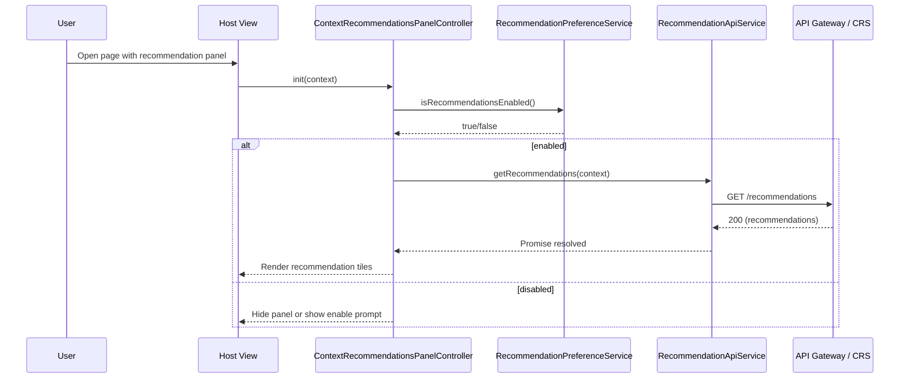
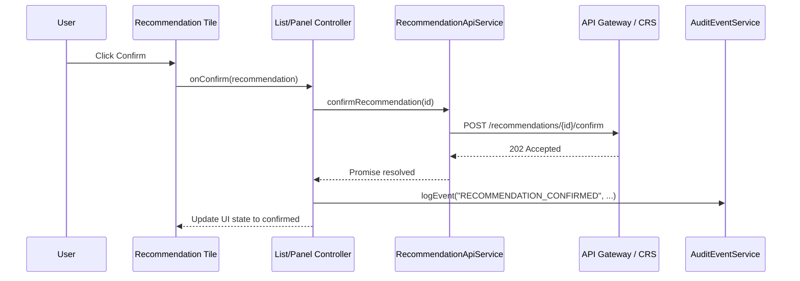
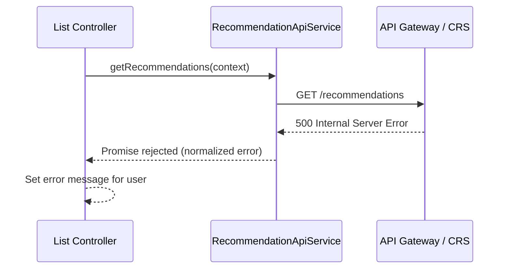

# Low-Level Design (LLD)
## Epic QE-3011 – DAVBanking1 – Context-Aware Financial Recommendations

---

## 1. Application Architecture

### 1.1 AngularJS MVC Mapping

This epic covers **context-aware financial recommendations** displayed within the DAVBanking1 web banking experience. The UI consumes recommendations from the Context-Aware Recommendation Service via the API Gateway.

- **AngularJS Module**: `davBanking.contextRecommendations`
- **Views**:
  - `context-recommendations-panel.html` – embedded panel on insight pages/dashboard.
  - `context-recommendations-full.html` – full-page list of recommendations.
  - `context-recommendation-detail.html` – detailed recommendation with explanation and actions.
- **Controllers**:
  - `ContextRecommendationsPanelController`
  - `ContextRecommendationsListController`
  - `ContextRecommendationDetailController`
- **Services**:
  - `RecommendationApiService` – REST client for Context-Aware Recommendation Service.
  - `RecommendationModelService` – in-memory store and mapper for recommendation objects.
  - `RecommendationPreferenceService` – wrapper for preference store integration.
- **Directives / Components**:
  - `crRecommendationTile` – tile/card representation of a recommendation.
  - `crRecommendationList` – container with filters and sorting.
  - `crExplainabilityBadge` – shows “Why am I seeing this?” with tooltip/modal.
- **Filters**:
  - `crPercent` – for APR/fraction to percentage.
  - `crRiskLabel` – map numeric risk indicators to user-friendly labels.

**HLD Component Mapping:**

- **Customer Channel (Mobile / Web App)** → `context-recommendations-*` views/controllers and directives.
- **API Gateway** → `RECOMMENDATIONS_API_BASE_URL` and HTTP interceptor configuration.
- **Context-Aware Recommendation Service (CRS)** → `RecommendationApiService` (front-end client).
- **AI Recommendation Engine (AIS)** → Data provider whose outputs map to `RecommendationModel`.
- **Customer Profile and Segmentation Service** → Indirect. Segment and profile fields appear in recommendation metadata for explanation; no direct UI integration.
- **Core Banking / Transaction Data Platform** → Indirect; aggregated values appear in rationale and context.
- **Authentication and Authorization Service** → `SecurityContextService` and route guards.
- **Regulatory Compliance Framework** → Exposed via flags/attributes in recommendation objects; UI respects them.
- **Recommendation Preference Store** → `RecommendationPreferenceService` and related API endpoints.

### 1.2 Project Folder Structure

```text
app/
  context-recommendations/
    context-recommendations.module.js
    config/
      context-recommendations.routes.js
      context-recommendations.constants.js
    controllers/
      context-recommendations-panel.controller.js
      context-recommendations-list.controller.js
      context-recommendation-detail.controller.js
    services/
      recommendation-api.service.js
      recommendation-model.service.js
      recommendation-preference.service.js
    directives/
      cr-recommendation-tile.directive.js
      cr-recommendation-list.directive.js
      cr-explainability-badge.directive.js
    filters/
      cr-percent.filter.js
      cr-risk-label.filter.js
    views/
      context-recommendations-panel.html
      context-recommendations-full.html
      context-recommendation-detail.html
assets/
  styles/
    context-recommendations.css
```

---

## 2. Component Specifications

### 2.1 Module `davBanking.contextRecommendations`

- **Type**: Module
- **File**: `context-recommendations.module.js`
- **Responsibility**: Group recommendation UI artifacts and declare dependencies.
- **Dependencies**: `ngRoute` (or `ui.router`), `davBanking.core`.

---

### 2.2 Controllers

#### 2.2.1 `ContextRecommendationsPanelController`

- **File**: `controllers/context-recommendations-panel.controller.js`
- **Usage**: Used in side-panel or bottom panel on related pages (insights, dashboard).
- **Responsibilities**:
  - Load context-aware recommendations based on current page context (e.g., insight being viewed, account type).
  - Manage a compact list (typically top 3 recommendations).
  - Handle user actions: expand to full view, confirm, dismiss.
- **Public Methods**:
  - `init(context)` – accept context object (e.g., `insightId`, `accountId`, `segment`).
  - `refresh()` – reload recommendations.
  - `confirmRecommendation(rec)` – trigger QE-3014 integration for confirm.
  - `dismissRecommendation(rec)` – mark as dismissed and call API.
  - `viewDetails(rec)` – navigate to detail view.
- **Inputs**:
  - `context` passed via directive attributes or parent scope.
- **Outputs**:
  - Panel view model (`vm.recommendations`, `vm.loading`, `vm.error`).
- **Dependencies**:
  - `RecommendationApiService`
  - `RecommendationModelService`
  - `RecommendationPreferenceService`
  - `SecurityContextService`
  - `$state`/`$location`, `$log`

#### 2.2.2 `ContextRecommendationsListController`

- **File**: `controllers/context-recommendations-list.controller.js`
- **Responsibilities**:
  - Full-page view of all current recommendations.
  - Filter by category, risk level, product type, and status.
  - Pagination and sort (e.g., by relevance, date).
- **Public Methods**:
  - `init()` – initial load.
  - `applyFilter(filterModel)`.
  - `onPageChange(page)`.
  - `onConfirm(rec)` / `onDismiss(rec)` / `onViewDetails(rec)`.
- **Dependencies**: same as panel controller.

#### 2.2.3 `ContextRecommendationDetailController`

- **File**: `controllers/context-recommendation-detail.controller.js`
- **Responsibilities**:
  - Present explanation metadata (why the user is seeing this recommendation).
  - Present key metrics (projected savings, costs, APR, etc.).
  - Provide CTAs: apply now, set up savings goal, schedule appointment.
  - Trigger confirm/dismiss flows.
- **Public Methods**:
  - `init()` – load detail from cache or API by `recommendationId` route param.
  - `confirm()` – confirm the recommendation.
  - `dismiss()` – dismiss the recommendation.
  - `toggleExplanation()` – show/hide explanation panel or modal.
- **Dependencies**:
  - `RecommendationApiService`
  - `RecommendationModelService`
  - `SecurityContextService`
  - `AuditEventService`
  - `$stateParams`, `$state`

---

### 2.3 Services

#### 2.3.1 `RecommendationApiService`

- **File**: `services/recommendation-api.service.js`
- **Responsibilities**:
  - Encapsulate all HTTP calls to Context-Aware Recommendation Service.
- **Public Methods**:
  - `getRecommendations(contextParams)` – fetch recommendations.
  - `getRecommendationDetail(id)`.
  - `getPreferences()`.
  - `updatePreferences(payload)`.
  - `confirmRecommendation(id)`.
  - `dismissRecommendation(id, reason)`.
- **Dependencies**:
  - `$http`, `$q`
  - `RECOMMENDATIONS_API_BASE_URL`

#### 2.3.2 `RecommendationModelService`

- **File**: `services/recommendation-model.service.js`
- **Responsibilities**:
  - Cache list and detail of `RecommendationModel` objects.
  - Provide helper functions for filtering and risk labeling.
- **Public Methods**:
  - `setRecommendations(list)`.
  - `getRecommendations()`.
  - `getRecommendationById(id)`.
  - `updateRecommendation(rec)`.
  - `clear()`.

#### 2.3.3 `RecommendationPreferenceService`

- **File**: `services/recommendation-preference.service.js`
- **Responsibilities**:
  - Wrap preference store API.
  - Provide flag for enabling/disabling recommendation features.
- **Public Methods**:
  - `loadPreferences()`.
  - `getPreferences()`.
  - `savePreferences(pref)`.
  - `isRecommendationsEnabled()`.

---

### 2.4 Directives

#### 2.4.1 `crRecommendationTile`

- **File**: `directives/cr-recommendation-tile.directive.js`
- **Responsibilities**:
  - Show a single recommendation with key info: title, short description, benefit summary, risk label.
  - Expose click handlers for confirm, dismiss, view details.
- **Bindings**:
  - `recommendation` – `=`.
  - `onConfirm`, `onDismiss`, `onViewDetails` – callbacks.

#### 2.4.2 `crRecommendationList`

- **File**: `directives/cr-recommendation-list.directive.js`
- **Responsibilities**:
  - Render list of `crRecommendationTile` with filters and pagination.
- **Bindings**:
  - `recommendations`, `filters`, `onConfirm`, `onDismiss`, `onViewDetails`.

#### 2.4.3 `crExplainabilityBadge`

- **File**: `directives/cr-explainability-badge.directive.js`
- **Responsibilities**:
  - Display a badge (e.g., “Why am I seeing this?”) with tooltip or modal that shows explanation metadata from recommendation.
- **Bindings**:
  - `explanation` – explanation object.

---

### 2.5 Filters

- **`crPercent`** – format APR or probability fractions as percentage.
- **`crRiskLabel`** – map numeric risk indicator to textual label (`"Low risk"`, `"Medium risk"`, `"High risk"`).

---

## 3. Component Responsibilities

### 3.1 Ownership of Logic

- **Controllers**:
  - Manage view state (loading flags, active filters, pagination).
  - Interpret API flags like `isEligible`, `requiresDisclosure`, `complianceStatus` to show/hide CTAs.
  - Trigger confirm/dismiss actions and handle responses.

- **Services**:
  - Isolate REST API interactions.
  - Normalize and cache models.
  - Provide convenience functions for grouping and filtering by context.

- **Directives**:
  - Visual representation and DOM behaviour only.
  - They call parent-provided callbacks to trigger actions.

- **Validation**:
  - Simple front-end validation for preference forms (e.g., frequency ranges).
  - Complex suitability and regulatory checks handled on back end; front end only consumes flags.

- **State Management**:
  - Shared state (recommendation list, detail) in `RecommendationModelService`.
  - Per-view state in controllers.

---

## 4. Interface Specifications

### 4.1 REST APIs

Base URL configured per environment via `RECOMMENDATIONS_API_BASE_URL`.

#### 4.1.1 Get Context-Aware Recommendations

- **Endpoint**: `GET {BASE_URL}/recommendations`
- **Headers**:
  - `Authorization: Bearer <JWT>`
  - `X-Client-Channel: WEB`
- **Query Parameters** (context-dependent):
  - `contextType` – `INSIGHT`, `ACCOUNT`, `DASHBOARD`.
  - `contextId` – `insightId` or `accountId` depending on contextType.
  - `limit`, `offset` – pagination.
- **Response 200**:
```json
{
  "recommendations": [
    {
      "id": "REC-1001",
      "title": "Increase your savings with a high-yield account",
      "shortDescription": "Move idle balance to a higher-yield savings account.",
      "type": "PRODUCT",
      "segment": "YOUNG_PROFESSIONAL",
      "eligibility": {
        "isEligible": true,
        "rejectionReason": null
      },
      "risk": {
        "level": "LOW",
        "score": 0.2
      },
      "expectedBenefit": {
        "annualSavings": 120.50,
        "currency": "USD"
      },
      "context": {
        "contextType": "INSIGHT",
        "contextId": "INS-12345"
      },
      "explanation": {
        "keyFactors": ["High average balance", "Low current interest rate"],
        "segment": "YOUNG_PROFESSIONAL"
      },
      "compliance": {
        "status": "APPROVED",
        "requiresDisclosure": true,
        "disclosureTextCode": "DISC-HYSA-US"
      },
      "createdAt": "2026-07-02T10:00:00Z"
    }
  ],
  "paging": {"limit": 3, "offset": 0, "total": 3}
}
```

- **Error Codes**:
  - 401, 403, 500 similar to previous epic.

#### 4.1.2 Get Recommendation Detail

- **Endpoint**: `GET {BASE_URL}/recommendations/{id}`
- **Response 200**:
```json
{
  "id": "REC-1001",
  "title": "Increase your savings with a high-yield account",
  "description": "Based on your recent balances...",
  "type": "PRODUCT",
  "productCode": "HYSA-001",
  "segment": "YOUNG_PROFESSIONAL",
  "risk": {"level": "LOW", "score": 0.2},
  "expectedBenefit": {
    "annualSavings": 120.50,
    "currency": "USD"
  },
  "fees": [{"label": "Monthly fee", "amount": 0}],
  "rates": [{"label": "Interest rate", "value": 0.025}],
  "explanation": {
    "summary": "You maintain high balances in low-interest accounts.",
    "keyFactors": ["High average balance", "Low existing yield"],
    "dataUsageNote": "We used your recent balance history to compute this." 
  },
  "compliance": {
    "status": "APPROVED",
    "requiresDisclosure": true,
    "disclosureTextCode": "DISC-HYSA-US"
  },
  "actions": [
    {"type": "APPLY", "target": "PRODUCT_APP", "label": "Apply now"},
    {"type": "REMIND_LATER", "target": "REMINDERS", "label": "Remind me later"}
  ]
}
```

#### 4.1.3 Get Recommendation Preferences

- **Endpoint**: `GET {BASE_URL}/preferences`
- **Response 200**:
```json
{
  "recommendationsEnabled": true,
  "maxPerDay": 5,
  "preferredTypes": {
    "PRODUCT": true,
    "EDUCATIONAL": true
  },
  "channels": {
    "IN_APP": true,
    "EMAIL": false
  },
  "jurisdiction": "US"
}
```

#### 4.1.4 Update Recommendation Preferences

- **Endpoint**: `PUT {BASE_URL}/preferences`
- **Request Body**:
```json
{
  "recommendationsEnabled": true,
  "maxPerDay": 3,
  "preferredTypes": {"PRODUCT": true, "EDUCATIONAL": true},
  "channels": {"IN_APP": true, "EMAIL": false}
}
```

#### 4.1.5 Confirm Recommendation

- **Endpoint**: `POST {BASE_URL}/recommendations/{id}/confirm`
- **Request Body**:
```json
{
  "sourceContext": {
    "contextType": "INSIGHT",
    "contextId": "INS-12345"
  }
}
```
- **Response 202** – forwarded to Recommendation Control Service (QE-3014) for processing.

#### 4.1.6 Dismiss Recommendation

- **Endpoint**: `POST {BASE_URL}/recommendations/{id}/dismiss`
- **Request Body**:
```json
{
  "reason": "USER_DISMISS"
}
```

---

## 5. Data Model Design

### 5.1 `RecommendationModel`

- **Attributes**:
  - `id: string` – required.
  - `title: string`.
  - `shortDescription: string`.
  - `description: string`.
  - `type: string` – enum: `PRODUCT`, `EDUCATIONAL`, `ALERT`.
  - `segment: string`.
  - `eligibility: { isEligible: boolean, rejectionReason?: string }`.
  - `risk: { level: string, score: number }` – `level` ∈ `LOW`, `MEDIUM`, `HIGH`.
  - `expectedBenefit: { annualSavings?: number, currency?: string }`.
  - `context: { contextType: string, contextId: string }`.
  - `explanation: {
      summary?: string,
      keyFactors?: string[],
      dataUsageNote?: string
    }`.
  - `compliance: {
      status: string,
      requiresDisclosure: boolean,
      disclosureTextCode?: string
    }`.
  - `actions: Array<{ type: string, target: string, label: string }>`.
  - `createdAt: Date`.
- **Defaults & Validation**:
  - `risk.level` defaults to `"MEDIUM"` if not set.
  - `expectedBenefit.annualSavings >= 0` if present.
  - `eligibility.isEligible` required; if false, `rejectionReason` should be present.

### 5.2 `RecommendationPreferencesModel`

- **Attributes**:
  - `recommendationsEnabled: boolean` – default `false`.
  - `maxPerDay: number` – min 0, max 50.
  - `preferredTypes: { [type: string]: boolean }`.
  - `channels: { IN_APP: boolean, EMAIL: boolean }`.
  - `jurisdiction: string`.
- **Validation**:
  - When `recommendationsEnabled` is true, `maxPerDay` > 0.
  - At least one `preferredTypes` must be true.

---

## 6. Data Flow

### 6.1 Panel Load Flow

1. Host view (e.g., insight detail page) includes `<cr-recommendation-panel>` directive with `context` attribute.
2. `ContextRecommendationsPanelController.init(context)` is invoked.
3. Controller calls `RecommendationPreferenceService.isRecommendationsEnabled()`; if false, panel hides content or shows enable prompt.
4. If enabled, controller calls `RecommendationApiService.getRecommendations(contextParams)`.
5. Response mapped via `RecommendationModelService.setRecommendations(list)`.
6. Controller binds `vm.recommendations` to `crRecommendationList`.

### 6.2 Confirm & Dismiss Flows

- **Confirm**:
  1. User clicks confirm on tile.
  2. `crRecommendationTile` calls `onConfirm({ recommendation: rec })`.
  3. Controller calls `RecommendationApiService.confirmRecommendation(rec.id)`.
  4. On success/202, mark recommendation as confirmed (local UI update) and emit event to QE-3014 integration if needed.

- **Dismiss**:
  1. Similar to confirm, but calls `dismissRecommendation` and sets local state to hidden.

---

## 7. Sequence Diagrams

### 7.1 Initialization of Recommendation Panel



### 7.2 Confirm Recommendation Workflow



### 7.3 API Error Handling Scenario



---

## 8. Implementation Details

### 8.1 AngularJS and ES6

- Use ES6 classes for services where feasible; use `'ngInject'` to annotate dependencies.
- Controllers defined via factory functions or ES6 classes registered via `.controller()`.

### 8.2 Dependency Injection

- Typical service example:
```js
class RecommendationApiService {
  constructor($http, $q, RECOMMENDATIONS_API_BASE_URL) {
    'ngInject';
    this.$http = $http;
    this.$q = $q;
    this.baseUrl = RECOMMENDATIONS_API_BASE_URL;
  }

  getRecommendations(params) {
    return this.$http.get(`${this.baseUrl}/recommendations`, { params })
      .then(resp => resp.data);
  }
}

angular
  .module('davBanking.contextRecommendations')
  .service('RecommendationApiService', RecommendationApiService);
```

### 8.3 Business Logic

- Front-end uses:
  - Risk level mapping using `crRiskLabel` filter.
  - Explainability data to populate tooltip/modal.
  - Preference checks to hide certain recommendation types (e.g., `PRODUCT` disabled).

### 8.4 Validation Logic

- Preference forms use min/max for `maxPerDay`.
- Dynamic disabling of fields based on jurisdiction (from preferences payload).

### 8.5 State Management

- Recommendations cached per context; optionally key by `contextType + contextId` to avoid mixing contexts.
- On sign out, service `clear()` invoked to remove data.

### 8.6 DOM Interaction

- Use Bootstrap panels/cards.
- Explanation badge uses tooltip/popover library integrated via directive, bound to explanation fields only (no raw HTML).

---

## 9. Configuration

### 9.1 Routes

Defined in `context-recommendations.routes.js`:

```js
$routeProvider
  .when('/recommendations', {
    templateUrl: 'app/context-recommendations/views/context-recommendations-full.html',
    controller: 'ContextRecommendationsListController',
    controllerAs: 'vm',
    resolve: { auth: requireAuth }
  })
  .when('/recommendations/:id', {
    templateUrl: 'app/context-recommendations/views/context-recommendation-detail.html',
    controller: 'ContextRecommendationDetailController',
    controllerAs: 'vm',
    resolve: { auth: requireAuth }
  });
```

### 9.2 Constants

- `RECOMMENDATIONS_API_BASE_URL` per environment.
- `RECOMMENDATION_TYPES`, `RISK_LEVELS` enumerations.

### 9.3 Feature Flags

- `features.contextRecommendations.enabled`.
- `features.contextRecommendations.showExplainability`.

---

## 10. Error Handling and Resiliency

- Use global HTTP interceptor for generic API error handling.
- For `confirm` and `dismiss` actions, handle failures gracefully:
  - Show toast if action fails, and revert UI state.
- When service returns `eligibility.isEligible = false`, the confirm CTA is disabled and an informational tooltip is shown.

---

## 11. Security Considerations

### 11.1 Input Validation

- Validate numeric `maxPerDay` and restrict to numeric input field.
- Validate confirm/dismiss parameters; IDs must be non-empty strings.

### 11.2 XSS & Output Safety

- Use standard Angular binding; no raw HTML from `explanation.summary` without sanitization.

### 11.3 CSRF & Auth

- Reuse global CSRF configuration.
- Route guard ensures user authenticated and authorized for recommendation features.

### 11.4 Sensitive Data

- Only high-level context used (no full PAN, only masked account numbers if needed in explanation).
- No recommendation data written to persistent browser storage.

### 11.5 Audit Logging

- Events such as `RECOMMENDATION_VIEWED`, `RECOMMENDATION_CONFIRMED`, `RECOMMENDATION_DISMISSED` logged via `AuditEventService`.

---

This LLD describes all front-end artifacts for implementing QE-3011 using AngularJS 1.x, ES6, HTML5, CSS3, Bootstrap, and REST.
