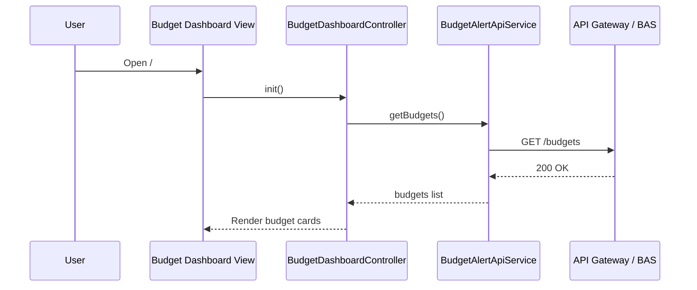
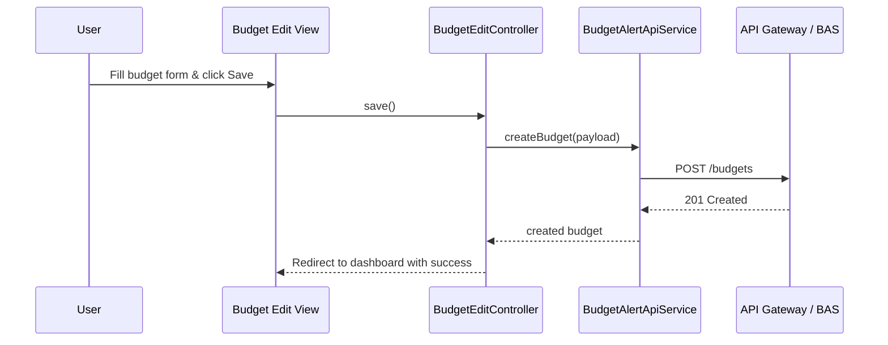
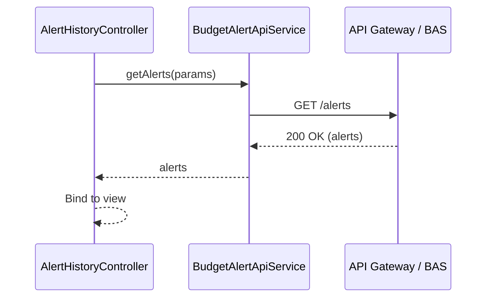
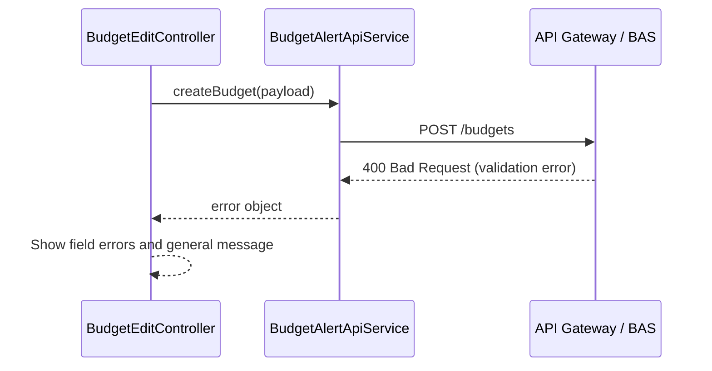

# Low-Level Design (LLD)
## Epic QE-3012 – DAVBanking1 – Budgeting and Spending Alerts

---

## 1. Application Architecture

### 1.1 AngularJS MVC Mapping

This epic implements budgeting configuration and spending alert visualization.

- **Module**: `davBanking.budgetAlerts`
- **Views**:
  - `budget-dashboard.html` – overview of budgets and status.
  - `budget-edit.html` – create/update budget thresholds.
  - `alert-history.html` – list of generated alerts.
- **Controllers**:
  - `BudgetDashboardController`
  - `BudgetEditController`
  - `AlertHistoryController`
- **Services**:
  - `BudgetAlertApiService` – interacts with Budget and Alert Service back end.
  - `BudgetModelService` – handles budget models and caching.
  - `AlertModelService` – handles alert history.
- **Directives**:
  - `baBudgetCard` – single budget visualization.
  - `baAlertRow` – alert history row.
- **Filters**:
  - `baCurrency` – budget values.
  - `baAlertStatus` – map status codes to labels.

**HLD Component Mapping:**

- **Budget and Alert Service (BAS)** → `BudgetAlertApiService`.
- **Spending Pattern and Threshold Analyzer** → influences data returned (e.g., anomaly flags), represented in `AlertModel` fields.
- **Notification Service** → referenced in alert history details (channel, delivery status).
- **Preference Store** → preferences in `BudgetPreferencesModel` via API.
- **Compliance Engine** → UI flags like `isEditable`, `jurisdiction`, `maxAlertFrequency`.

### 1.2 Folder Structure

```text
app/
  budget-alerts/
    budget-alerts.module.js
    config/
      budget-alerts.routes.js
      budget-alerts.constants.js
    controllers/
      budget-dashboard.controller.js
      budget-edit.controller.js
      alert-history.controller.js
    services/
      budget-alert-api.service.js
      budget-model.service.js
      alert-model.service.js
    directives/
      ba-budget-card.directive.js
      ba-alert-row.directive.js
    filters/
      ba-currency.filter.js
      ba-alert-status.filter.js
    views/
      budget-dashboard.html
      budget-edit.html
      alert-history.html
assets/
  styles/
    budget-alerts.css
```

---

## 2. Component Specifications

### 2.1 `BudgetDashboardController`

- **File**: `controllers/budget-dashboard.controller.js`
- **Responsibilities**:
  - Load all budgets and high-level stats (e.g., number of budgets breached).
  - Show list of budgets using `baBudgetCard`.
  - Provide navigation to edit or create budgets.
- **Methods**:
  - `init()` – load budgets.
  - `refresh()` – refresh budgets from API.
  - `createBudget()` / `editBudget(budget)`.
- **Dependencies**:
  - `BudgetAlertApiService`
  - `BudgetModelService`
  - `$state`
  - `AuditEventService`

### 2.2 `BudgetEditController`

- **File**: `controllers/budget-edit.controller.js`
- **Responsibilities**:
  - Form for creating/editing a budget threshold per category/account.
  - Input validation and error handling.
- **Methods**:
  - `init()` – load existing budget when `budgetId` route param present.
  - `save()` – validate and submit create/update request.
  - `cancel()`.
- **Dependencies**:
  - `BudgetAlertApiService`
  - `BudgetModelService`
  - `$state`, `$stateParams`
  - `$log`

### 2.3 `AlertHistoryController`

- **File**: `controllers/alert-history.controller.js`
- **Responsibilities**:
  - Paginated list of historical alerts.
  - Filters by time range, category, status.
- **Methods**:
  - `init()` – initial fetch.
  - `applyFilter(filter)`.
  - `onPageChange(page)`.
- **Dependencies**:
  - `BudgetAlertApiService`
  - `AlertModelService`
  - `$log`

---

### 2.4 Services

#### 2.4.1 `BudgetAlertApiService`

- **File**: `services/budget-alert-api.service.js`
- **Responsibilities**:
  - Provide methods for budgets and alerts API.
- **Methods**:
  - `getBudgets()` – GET budgets.
  - `getBudget(id)` – GET a single budget.
  - `createBudget(payload)` – POST new budget.
  - `updateBudget(id, payload)` – PUT budget.
  - `getAlerts(params)` – GET alert history.
- **Dependencies**: `$http`, `$q`, `BUDGET_ALERTS_API_BASE_URL`.

#### 2.4.2 `BudgetModelService`

- **File**: `services/budget-model.service.js`
- **Responsibilities**:
  - Cache `BudgetModel` instances and expose convenience operations.
- **Methods**:
  - `setBudgets(list)`.
  - `getBudgets()`.
  - `getBudgetById(id)`.
  - `clear()`.

#### 2.4.3 `AlertModelService`

- **File**: `services/alert-model.service.js`
- **Responsibilities**:
  - Cache and manage alert history (`AlertModel`).
- **Methods**:
  - `setAlerts(list)`.
  - `getAlerts()`.
  - `getAlertById(id)`.

---

### 2.5 Directives

#### 2.5.1 `baBudgetCard`

- **File**: `directives/ba-budget-card.directive.js`
- **Responsibilities**:
  - Represent a budget with progress bar and status.
- **Bindings**:
  - `budget` – `BudgetModel`.
  - `onEdit` – edit callback.

#### 2.5.2 `baAlertRow`

- **File**: `directives/ba-alert-row.directive.js`
- **Responsibilities**:
  - One row in alert history table, including category, amount, channel, status.
- **Bindings**:
  - `alert` – `AlertModel`.

---

## 3. Data Model Design

### 3.1 `BudgetModel`

- **Attributes**:
  - `id: string`.
  - `name: string` – e.g., “Dining Monthly Budget”.
  - `category: string` – transaction category.
  - `accountId: string` (masked).
  - `limitAmount: number`.
  - `currency: string`.
  - `period: string` – `MONTHLY`, `WEEKLY`.
  - `currentSpend: number`.
  - `status: string` – `ON_TRACK`, `NEAR_LIMIT`, `EXCEEDED`.
  - `alertEnabled: boolean`.
  - `createdAt`, `updatedAt`.
- **Validation**:
  - `limitAmount > 0`.
  - `currentSpend >= 0`.

### 3.2 `AlertModel`

- **Attributes**:
  - `id: string`.
  - `budgetId: string`.
  - `category: string`.
  - `amount: number`.
  - `currency: string`.
  - `triggerType: string` – `BUDGET_EXCEEDED`, `ANOMALY`.
  - `triggeredAt: Date`.
  - `channel: string` – `EMAIL`, `PUSH`, `IN_APP`.
  - `status: string` – `DELIVERED`, `FAILED`, `ACKNOWLEDGED`.
- **Validation**:
  - `amount >= 0`.

---

## 4. Interface Specifications

### 4.1 REST API – Budgets

#### 4.1.1 List Budgets

- **Endpoint**: `GET {BASE_URL}/budgets`
- **Response 200**:
```json
{
  "budgets": [
    {
      "id": "BUD-1",
      "name": "Dining Monthly Budget",
      "category": "DINING",
      "accountId": "***1234",
      "limitAmount": 300,
      "currency": "USD",
      "period": "MONTHLY",
      "currentSpend": 250,
      "status": "NEAR_LIMIT",
      "alertEnabled": true
    }
  ]
}
```

#### 4.1.2 Get Budget

- **Endpoint**: `GET {BASE_URL}/budgets/{id}`

#### 4.1.3 Create Budget

- **Endpoint**: `POST {BASE_URL}/budgets`
- **Request Body**:
```json
{
  "name": "Dining Monthly Budget",
  "category": "DINING",
  "accountId": "***1234",
  "limitAmount": 300,
  "currency": "USD",
  "period": "MONTHLY",
  "alertEnabled": true
}
```

#### 4.1.4 Update Budget

- **Endpoint**: `PUT {BASE_URL}/budgets/{id}`

### 4.2 REST API – Alerts

#### 4.2.1 List Alerts

- **Endpoint**: `GET {BASE_URL}/alerts`
- **Query Params**:
  - `from`, `to`, `status`, `category`, `page`, `size`.
- **Response 200**:
```json
{
  "alerts": [
    {
      "id": "AL-1",
      "budgetId": "BUD-1",
      "category": "DINING",
      "amount": 310,
      "currency": "USD",
      "triggerType": "BUDGET_EXCEEDED",
      "triggeredAt": "2026-07-02T10:00:00Z",
      "channel": "PUSH",
      "status": "DELIVERED"
    }
  ],
  "paging": {"page": 0, "size": 20, "total": 5}
}
```

---

## 5. Data Flow

### 5.1 Create/Update Budget

1. User navigates to `#/budgets/new` or `#/budgets/{id}`.
2. `BudgetEditController.init()` loads existing budget when editing.
3. User edits fields; Angular form validation applied.
4. On Save:
   - Controller composes payload and calls `BudgetAlertApiService.createBudget` or `.updateBudget`.
   - On success, redirect to dashboard and show success notification.

### 5.2 View Alert History

1. User navigates to `#/alerts`.
2. `AlertHistoryController.init()` calls `BudgetAlertApiService.getAlerts(params)`.
3. Response mapped to `AlertModelService` and bound to `baAlertRow` directives.

---

## 6. Mermaid Sequence Diagrams

### 6.1 Initialization – Budget Dashboard



### 6.2 Primary Workflow – Create Budget



### 6.3 Service/API Interaction – Load Alerts



### 6.4 Error Handling – Budget Save Failure



---

## 7. Implementation Details

- Use AngularJS forms with `ngMessages` for validation.
- `limitAmount` input uses `type="number"` and currency-aware formatting.
- Use Bootstrap progress bars in `baBudgetCard` to show spend vs limit.

---

## 8. Configuration

- `BUDGET_ALERTS_API_BASE_URL` per environment.
- Routes:
```js
$routeProvider
  .when('/budgets', { ... })
  .when('/budgets/new', { ... })
  .when('/budgets/:id', { ... })
  .when('/alerts', { ... });
```

- Feature flag: `features.budgetAlerts.enabled`.

---

## 9. Error Handling & Security

- Global interceptor for API errors.
- Do not show full account numbers; only masked IDs in budget and alerts.
- Form inputs sanitized and validated to prevent injection.
- CSRF protection and HTTPS enforced via shared app configuration.

---

This LLD covers UI and integration design for budgeting and spending alerts in AngularJS.
