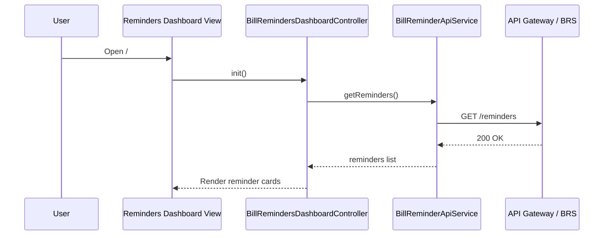
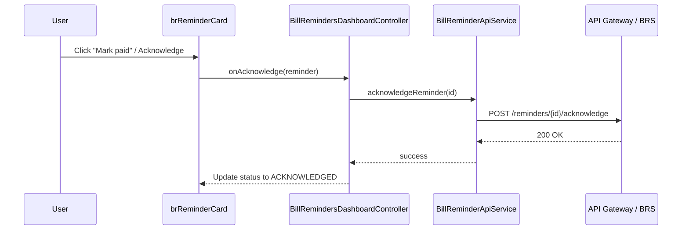
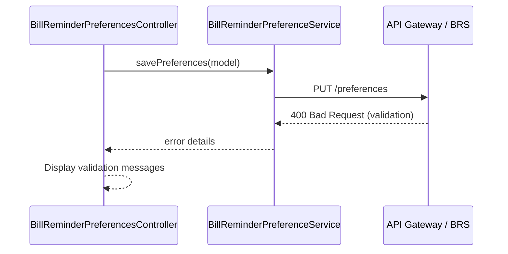

# Low-Level Design (LLD)
## Epic QE-3013 – DAVBanking1 – Bill Payment Reminders and Notifications

---

## 1. Application Architecture

### 1.1 AngularJS MVC Mapping

- **Module**: `davBanking.billReminders`
- **Views**:
  - `bill-reminders-dashboard.html` – list of upcoming bills and reminder summary.
  - `bill-reminder-preferences.html` – manage reminder settings and channels.
- **Controllers**:
  - `BillRemindersDashboardController`
  - `BillReminderPreferencesController`
- **Services**:
  - `BillReminderApiService` – REST client for Bill Reminder Service.
  - `BillReminderModelService` – manages bill reminder objects.
  - `BillReminderPreferenceService` – manages notification preferences and quiet hours.
- **Directives**:
  - `brReminderCard` – display a single upcoming bill reminder.
  - `brQuietHoursSelector` – picker for quiet hours.
- **Filters**:
  - `brDate` – formatted due date.
  - `brAmount` – bill amount.

**HLD Component Mapping:**

- **Bill Reminder Service (BRS)** → `BillReminderApiService`.
- **Bill Pattern Detection Engine** → output appears in `BillReminderModel` as schedule and predicted amounts.
- **Notification Service** → channels shown in UI; history view may show last notification status.
- **Notification Preference Store** → preferences managed by `BillReminderPreferenceService`.
- **Compliance and Legal Rules Engine** → influences allowed channels and quiet hours, encoded as flags in payloads.

### 1.2 Folder Structure

```text
app/
  bill-reminders/
    bill-reminders.module.js
    config/
      bill-reminders.routes.js
      bill-reminders.constants.js
    controllers/
      bill-reminders-dashboard.controller.js
      bill-reminder-preferences.controller.js
    services/
      bill-reminder-api.service.js
      bill-reminder-model.service.js
      bill-reminder-preference.service.js
    directives/
      br-reminder-card.directive.js
      br-quiet-hours-selector.directive.js
    filters/
      br-date.filter.js
      br-amount.filter.js
    views/
      bill-reminders-dashboard.html
      bill-reminder-preferences.html
assets/
  styles/
    bill-reminders.css
```

---

## 2. Component Specifications

### 2.1 `BillRemindersDashboardController`

- **File**: `controllers/bill-reminders-dashboard.controller.js`
- **Responsibilities**:
  - Load list of upcoming bill reminders.
  - Support marking reminders as acknowledged or dismissed.
  - Provide navigation to preferences.
- **Methods**:
  - `init()` – fetch reminders.
  - `refresh()`.
  - `acknowledgeReminder(reminder)`.
  - `dismissReminder(reminder)`.
- **Dependencies**:
  - `BillReminderApiService`
  - `BillReminderModelService`
  - `AuditEventService`
  - `$state`, `$log`

### 2.2 `BillReminderPreferencesController`

- **File**: `controllers/bill-reminder-preferences.controller.js`
- **Responsibilities**:
  - Manage notification channels and quiet hours.
  - Allow opt-in/opt-out for reminder types.
- **Methods**:
  - `init()` – load current preferences.
  - `save()` – validate and persist.
  - `reset()`.
- **Dependencies**:
  - `BillReminderPreferenceService`
  - `$log`, `$q`

---

### 2.3 Services

#### 2.3.1 `BillReminderApiService`

- **File**: `services/bill-reminder-api.service.js`
- **Responsibilities**:
  - Call Bill Reminder Service endpoints for reminders and preferences.
- **Methods**:
  - `getReminders(params)`.
  - `acknowledgeReminder(id)`.
  - `dismissReminder(id)`.
  - `getPreferences()`.
  - `updatePreferences(payload)`.
- **Dependencies**: `$http`, `$q`, `BILL_REMINDERS_API_BASE_URL`.

#### 2.3.2 `BillReminderModelService`

- **File**: `services/bill-reminder-model.service.js`
- **Responsibilities**:
  - Manage list of upcoming and recent reminders.
- **Methods**:
  - `setReminders(list)`.
  - `getReminders()`.
  - `updateReminder(reminder)`.

#### 2.3.3 `BillReminderPreferenceService`

- **File**: `services/bill-reminder-preference.service.js`
- **Responsibilities**:
  - Manage preferences payload cache and validation.
- **Methods**:
  - `loadPreferences()`.
  - `getPreferences()`.
  - `savePreferences(model)`.

---

### 2.4 Directives

#### 2.4.1 `brReminderCard`

- **File**: `directives/br-reminder-card.directive.js`
- **Responsibilities**:
  - Present upcoming bill details: biller name, due date, predicted amount, status.
  - Provide buttons for “Mark paid”, “Snooze”, “Dismiss reminder” (if permitted).
- **Bindings**:
  - `reminder` – `BillReminderModel`.
  - `onAcknowledge`, `onDismiss` – callbacks.

#### 2.4.2 `brQuietHoursSelector`

- **File**: `directives/br-quiet-hours-selector.directive.js`
- **Responsibilities**:
  - UI control to choose quiet hours (e.g., 21:00–08:00), respecting jurisdiction rules.
- **Bindings**:
  - `quietHours` – `{ start: string, end: string }` (24h format).

---

## 3. Data Model Design

### 3.1 `BillReminderModel`

- **Attributes**:
  - `id: string`.
  - `billerName: string`.
  - `maskedAccountId: string`.
  - `predictedAmount: number`.
  - `currency: string`.
  - `dueDate: Date`.
  - `leadDays: number` – days before due date when reminder is sent.
  - `status: string` – `UPCOMING`, `SENT`, `ACKNOWLEDGED`, `DISMISSED`.
  - `channel: string` – planned channel for main reminder (`EMAIL`, `PUSH`, `IN_APP`).
  - `isEditable: boolean` – from compliance engine.
- **Validation**:
  - `predictedAmount >= 0`.
  - `leadDays >= 0`.

### 3.2 `BillReminderPreferencesModel`

- **Attributes**:
  - `enabled: boolean`.
  - `channels: { IN_APP: boolean, EMAIL: boolean, PUSH: boolean }`.
  - `quietHours: { start: string, end: string }`.
  - `jurisdiction: string`.
  - `readOnlyFields: string[]`.
- **Validation**:
  - `start` and `end` valid 24h times.
  - Respect server-provided `readOnlyFields`.

---

## 4. Interface Specifications

### 4.1 REST APIs

Base URL: `BILL_REMINDERS_API_BASE_URL`.

#### 4.1.1 List Reminders

- **Endpoint**: `GET {BASE_URL}/reminders`
- **Response 200**:
```json
{
  "reminders": [
    {
      "id": "BR-1",
      "billerName": "Utility Co.",
      "maskedAccountId": "***1234",
      "predictedAmount": 75.30,
      "currency": "USD",
      "dueDate": "2026-07-15",
      "leadDays": 5,
      "status": "UPCOMING",
      "channel": "PUSH",
      "isEditable": true
    }
  ]
}
```

#### 4.1.2 Acknowledge Reminder

- **Endpoint**: `POST {BASE_URL}/reminders/{id}/acknowledge`

#### 4.1.3 Dismiss Reminder

- **Endpoint**: `POST {BASE_URL}/reminders/{id}/dismiss`

#### 4.1.4 Get Preferences

- **Endpoint**: `GET {BASE_URL}/preferences`

#### 4.1.5 Update Preferences

- **Endpoint**: `PUT {BASE_URL}/preferences`
- **Request Body**:
```json
{
  "enabled": true,
  "channels": {"IN_APP": true, "EMAIL": false, "PUSH": true},
  "quietHours": {"start": "21:00", "end": "08:00"}
}
```

---

## 5. Data Flow

### 5.1 View Reminders

1. User opens `#/bill-reminders`.
2. `BillRemindersDashboardController.init()` calls `BillReminderApiService.getReminders()`.
3. Response normalized by `BillReminderModelService` and bound to `brReminderCard` list.

### 5.2 Manage Preferences

1. User opens `#/bill-reminders/preferences`.
2. `BillReminderPreferencesController.init()` calls `BillReminderPreferenceService.loadPreferences()`.
3. User updates channels and quiet hours.
4. On Save, preferences validated and sent to back end.

---

## 6. Mermaid Sequence Diagrams

### 6.1 Initialization – Reminders Dashboard



### 6.2 Acknowledge Reminder



### 6.3 Error Handling – Preferences Save Failure



---

## 7. Implementation Details

- Use Bootstrap cards for reminder display.
- Quiet hours selector uses dropdowns for hours and minutes and prevents invalid ranges.
- AngularJS form validation for preferences and required fields.

---

## 8. Configuration

- Routes in `bill-reminders.routes.js`:
```js
$routeProvider
  .when('/bill-reminders', { ... })
  .when('/bill-reminders/preferences', { ... });
```

- `BILL_REMINDERS_API_BASE_URL` constant per environment.
- Feature flag `features.billReminders.enabled` controls navigation visibility.

---

## 9. Error Handling and Security

- Standard HTTP interceptor for error handling and auth.
- Masked account IDs only.
- No sensitive bill details in UI beyond what is already available in transactions.
- Respect opt-out and quiet hours by showing appropriate UI states and messages.

---

This LLD provides the front-end design for bill payment reminders and notifications.
