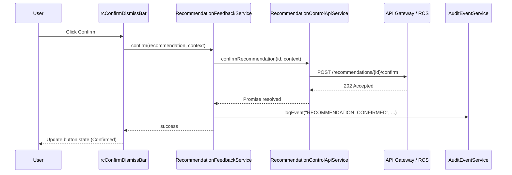
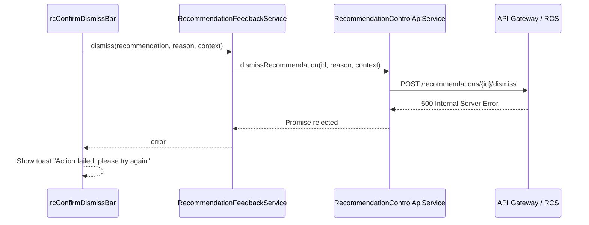

# Low-Level Design (LLD)
## Epic QE-3014 – DAVBanking1 – Recommendation Confirmation and Dismissal

---

## 1. Application Architecture

### 1.1 AngularJS MVC Mapping

This epic implements the **user interaction layer** for confirming and dismissing recommendations produced by the Context-Aware Recommendation Service (QE-3011).

- **Module**: `davBanking.recommendationControl`
- **Views**:
  - Primary UX is embedded in recommendation modules. No additional standalone screens are required beyond what QE-3011 defines, but the module may provide a dedicated history or debug view:
    - `recommendation-history.html` (optional feature) – user’s past confirm/dismiss actions.
- **Controllers**:
  - `RecommendationHistoryController` (optional).
  - Extension logic is also injected into existing controllers from QE-3011 via services and shared directives.
- **Services**:
  - `RecommendationControlApiService` – front-end client for Recommendation Control Service back end.
  - `RecommendationFeedbackService` – manages local feedback state and events.
- **Directives**:
  - `rcConfirmDismissBar` – confirm/dismiss button bar for recommendation tiles or detail.
- **Filters**: None specific.

**HLD Component Mapping:**

- **Recommendation Control Service (RCS)** → `RecommendationControlApiService`.
- **AI Recommendation Engine (AIS)** → Receives feedback; indirectly integrated via RCS.
- **Analytics and Telemetry Service** → Events emitted via `AuditEventService` and/or a specialized telemetry API.
- **Preference and Feedback Store** → `RecommendationFeedbackService` + back-end endpoints.
- **Compliance and Policy Engine** → Flags in responses control which actions allowed (e.g., `canConfirm`, `canDismiss`).

### 1.2 Folder Structure

```text
app/
  recommendation-control/
    recommendation-control.module.js
    config/
      recommendation-control.routes.js
      recommendation-control.constants.js
    controllers/
      recommendation-history.controller.js
    services/
      recommendation-control-api.service.js
      recommendation-feedback.service.js
    directives/
      rc-confirm-dismiss-bar.directive.js
    views/
      recommendation-history.html
```

The module depends on `davBanking.contextRecommendations` and `davBanking.core`.

---

## 2. Component Specifications

### 2.1 `RecommendationControlApiService`

- **File**: `services/recommendation-control-api.service.js`
- **Responsibility**:
  - Call Recommendation Control Service for confirm/dismiss actions and retrieving action history if exposed.
- **Public Methods**:
  - `confirmRecommendation(recId, context)`.
  - `dismissRecommendation(recId, reason, context)`.
  - `getHistory(params)` – optional history endpoint.
- **Inputs**:
  - `recId: string` – recommendation identifier.
  - `context: { contextType: string, contextId: string }` – origin of action.
  - `reason: string` – `USER_DISMISS`, `NOT_RELEVANT`, etc.
- **Outputs**:
  - Promise resolving to status object or history payload.
- **Dependencies**:
  - `$http`, `$q`
  - `RECOMMENDATION_CONTROL_API_BASE_URL`

### 2.2 `RecommendationFeedbackService`

- **File**: `services/recommendation-feedback.service.js`
- **Responsibility**:
  - Provide a front-end abstraction for confirm/dismiss flows.
  - Enforce idempotency at UI level (e.g., avoid duplicate submissions).
  - Integrate with `AuditEventService` and show consistent notifications.
- **Public Methods**:
  - `confirm(recommendation, context)`.
  - `dismiss(recommendation, reason, context)`.
  - `getHistory(params)`.
- **Dependencies**:
  - `RecommendationControlApiService`
  - `AuditEventService`
  - `$q`, `$log`

### 2.3 `rcConfirmDismissBar` Directive

- **File**: `directives/rc-confirm-dismiss-bar.directive.js`
- **Responsibility**:
  - Provide confirm and dismiss buttons with standardized labels, icons, and disabled states.
  - Display any compliance-required disclaimers or tooltips.
- **Bindings**:
  - `recommendation` – `RecommendationModel`.
  - `context` – e.g., { contextType: 'INSIGHT', contextId: 'INS-12345' }.
  - Optional: `onConfirmed`, `onDismissed` callbacks.

### 2.4 `RecommendationHistoryController` (Optional)

- **File**: `controllers/recommendation-history.controller.js`
- **Responsibility**:
  - Display user’s confirm/dismiss history using a table view.
- **Methods**:
  - `init()` – call `RecommendationFeedbackService.getHistory`.
- **Dependencies**:
  - `RecommendationFeedbackService`
  - `$log`

---

## 3. Data Model Design

### 3.1 `RecommendationFeedbackEventModel`

- **Attributes**:
  - `id: string`.
  - `recommendationId: string`.
  - `userId: string` (pseudonymized in UI logs).
  - `action: string` – `CONFIRM`, `DISMISS`.
  - `reason: string` – optional (for dismiss).
  - `timestamp: Date`.
  - `context: { contextType: string, contextId: string }`.

The UI only consumes aggregated or per-user events, never raw cross-user data.

---

## 4. Interface Specifications

### 4.1 REST APIs

Base URL: `RECOMMENDATION_CONTROL_API_BASE_URL`.

#### 4.1.1 Confirm Recommendation

- **Endpoint**: `POST {BASE_URL}/recommendations/{id}/confirm`
- **Request Body**:
```json
{
  "context": {"contextType": "INSIGHT", "contextId": "INS-12345"}
}
```
- **Response 200/202**:
```json
{
  "status": "ACCEPTED",
  "effectiveDate": "2026-07-02T10:00:00Z"
}
```

#### 4.1.2 Dismiss Recommendation

- **Endpoint**: `POST {BASE_URL}/recommendations/{id}/dismiss`
- **Request Body**:
```json
{
  "reason": "NOT_RELEVANT",
  "context": {"contextType": "INSIGHT", "contextId": "INS-12345"}
}
```

#### 4.1.3 Get Feedback History (Optional)

- **Endpoint**: `GET {BASE_URL}/feedback`
- **Query Params**:
  - `from`, `to`, `action`, `page`, `size`.

---

## 5. Data Flow

### 5.1 Confirm Flow

1. User clicks “Confirm” on a recommendation (tile or detail).
2. `rcConfirmDismissBar` calls `RecommendationFeedbackService.confirm(recommendation, context)`.
3. Service calls `RecommendationControlApiService.confirmRecommendation(rec.id, context)`.
4. On success, service logs `RECOMMENDATION_CONFIRMED` via `AuditEventService` and resolves promise.
5. Calling context (panel/list controller from QE-3011) updates local state (e.g., mark as confirmed, hide).

### 5.2 Dismiss Flow

1. User clicks “Dismiss” and optionally selects reason.
2. Same pattern as confirm but with `dismiss` method.

---

## 6. Mermaid Sequence Diagrams

### 6.1 Confirm Recommendation



### 6.2 Error Handling – Dismiss Failure



---

## 7. Implementation Details

- Idempotency: The feedback service tracks in-flight requests by `recommendationId` and action type to prevent rapid double submissions.
- UI disables buttons while request in progress.
- ES6 `class` syntax for services with `'ngInject'` for DI.

---

## 8. Configuration

- `RECOMMENDATION_CONTROL_API_BASE_URL` per environment.
- Route for optional history view:
```js
$routeProvider
  .when('/recommendations/history', {
    templateUrl: 'app/recommendation-control/views/recommendation-history.html',
    controller: 'RecommendationHistoryController',
    controllerAs: 'vm',
    resolve: { auth: requireAuth }
  });
```

- Feature flag `features.recommendationControl.historyEnabled` to toggle history view.

---

## 9. Error Handling & Security

- Generic error mapping similar to other modules.
- Ensure that recommendation IDs are never manipulated blindly; UI uses IDs delivered from back end only.
- No sensitive data in feedback payload beyond IDs and simple reasons.
- HTTPS and CSRF protections reused from parent app.

---

This LLD defines the interaction layer for recommendation confirmation and dismissal.
