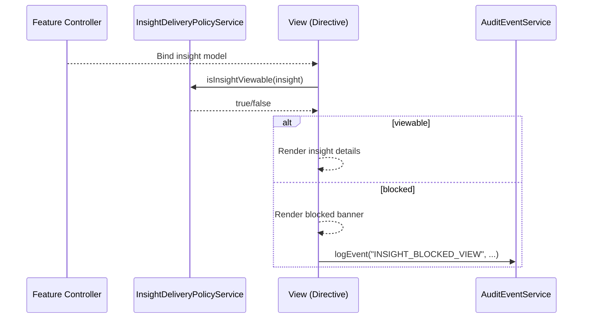
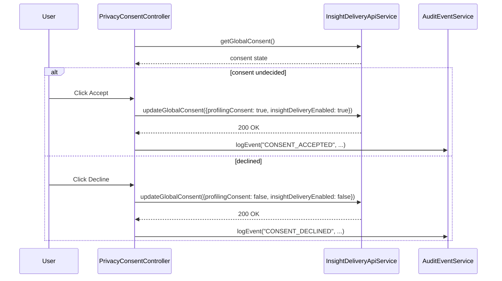
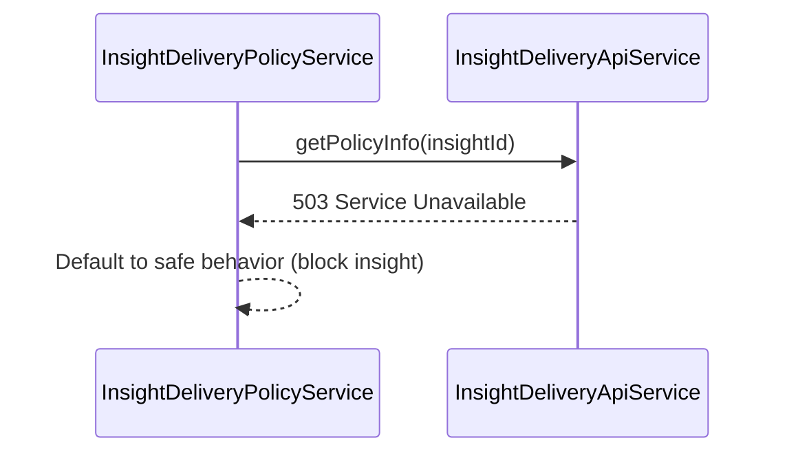

# Low-Level Design (LLD)
## Epic QE-3015 – DAVBanking1 – Secure and Compliant Insight Delivery

---

## 1. Application Architecture

### 1.1 AngularJS MVC Mapping

This epic defines **cross-cutting security, compliance, and delivery controls** for insights, recommendations, budgets, and reminders across the DAVBanking1 web app.

Instead of a standalone user feature, QE-3015 introduces core AngularJS infrastructure and shared components.

- **Module**: `davBanking.insightDelivery`
- **Views**:
  - No direct end-user pages; shared UI elements include:
    - `blocked-insight-banner.html` – banner for blocked insights.
    - `privacy-consent-dialog.html` – opt-in/out dialog.
- **Controllers**:
  - `PrivacyConsentController` – controls consent dialog.
- **Services**:
  - `InsightDeliveryPolicyService` – client-side application of policy flags from back end.
  - `InsightDeliveryApiService` – shared REST service for cross-cutting insight delivery APIs if exposed (e.g., global view permissions).
  - `SecurityContextService` – shared core service integrating Authentication and IAM (may exist already in core module; QE-3015 extends it as needed).
  - `AuditEventService` – shared event logging service enhanced with QE-3015 requirements.
- **Directives**:
  - `idPolicyGuard` – attribute directive that hides/disables elements if policies disallow display.
  - `idBlockedBanner` – component to show when an insight or recommendation is blocked.
- **Filters**: None specific.

**HLD Component Mapping:**

- **API Gateway** → enforced via base URL configs and interceptors.
- **Insight Delivery Service (AS)** → `InsightDeliveryApiService` & `InsightDeliveryPolicyService` apply constraints in UI.
- **Authentication and Authorization Service** → `SecurityContextService` & route guards.
- **Security Services (Encryption, KMS, Tokenization)** → Represented by HTTPS-only endpoints, tokenized IDs in UI.
- **Compliance and Policy Engine** → Policy flags built into response objects and interpreted by `InsightDeliveryPolicyService`.
- **Regulatory Configuration and Rules Store** → Indirect; policy fields from back end (e.g., `maskingLevel`, `policyDecision`) guide UI.
- **Audit Logging and Monitoring Platform** → `AuditEventService`.

### 1.2 Folder Structure

```text
app/
  insight-delivery/
    insight-delivery.module.js
    config/
      insight-delivery.config.js
      insight-delivery.constants.js
    controllers/
      privacy-consent.controller.js
    services/
      insight-delivery-policy.service.js
      insight-delivery-api.service.js
      security-context.service.js   (shared)
      audit-event.service.js        (shared)
    directives/
      id-policy-guard.directive.js
      id-blocked-banner.directive.js
    views/
      blocked-insight-banner.html
      privacy-consent-dialog.html
```

The module is imported by all feature modules that display AI-driven insights or recommendations.

---

## 2. Component Specifications

### 2.1 `InsightDeliveryPolicyService`

- **File**: `services/insight-delivery-policy.service.js`
- **Responsibility**:
  - Interpret policy-related fields from API payloads and determine if particular UI elements should be shown.
  - Provide convenience methods for masking, permission checks, and policy explanations.
- **Public Methods**:
  - `isInsightViewable(insight)` – returns boolean based on `insight.policyDecision` or `isViewable` flags.
  - `getMaskingLevel(insight)` – returns `NONE`, `PARTIAL`, or `FULL`.
  - `maskAccountId(maskedAccountId, maskingLevel)` – adjust display according to masking level.
  - `shouldShowBlockedBanner(insight)` – returns boolean.
- **Inputs/Outputs**:
  - Inputs: insight/recommendation objects.
  - Outputs: simple values used in templates.
- **Dependencies**:
  - `$log`

### 2.2 `InsightDeliveryApiService`

- **File**: `services/insight-delivery-api.service.js`
- **Responsibility**:
  - Provide shared endpoints needed across insight modules (e.g., global user consent, blocking reasons).
- **Public Methods**:
  - `getGlobalConsent()`.
  - `updateGlobalConsent(payload)`.
  - `getPolicyInfo(insightId)` – optional.
- **Dependencies**: `$http`, `$q`, `INSIGHT_DELIVERY_API_BASE_URL`.

### 2.3 `SecurityContextService`

- **File**: `services/security-context.service.js`
- **Responsibility**:
  - Wrap authentication tokens and user attributes for RBAC/ABAC decisions in UI.
- **Public Methods**:
  - `isAuthenticated()`.
  - `getUser()` – roles, attributes, jurisdiction.
  - `hasRole(role)`.
  - `hasAttribute(attr, value)`.
- **Dependencies**: `$window`, `$log`, token storage;

### 2.4 `AuditEventService`

- **File**: `services/audit-event.service.js`
- **Responsibility**:
  - Send structured events about insight access and actions to logging endpoint.
- **Public Methods**:
  - `logEvent(type, payload)`.
  - `logError(type, error)`.
- **Dependencies**: `$http`, `$q`, `AUDIT_API_BASE_URL`.

### 2.5 `PrivacyConsentController`

- **File**: `controllers/privacy-consent.controller.js`
- **Responsibility**:
  - Manage privacy consent dialog for insight profiling and AI-driven personalization.
- **Methods**:
  - `init()` – load global consent via `InsightDeliveryApiService.getGlobalConsent()`.
  - `accept()` – update consent and close dialog.
  - `decline()` – update consent (disable insights) and close dialog.
- **Dependencies**:
  - `InsightDeliveryApiService`
  - `AuditEventService`
  - `$uibModalInstance` or similar

### 2.6 `idPolicyGuard` Directive

- **File**: `directives/id-policy-guard.directive.js`
- **Responsibility**:
  - Hide or disable DOM elements when insight or recommendation is not allowed to be shown.
- **Usage**:
  - `<div id-policy-guard insight="insight"> ... </div>`
- **Implementation**:
  - Watches `insight` and calls `InsightDeliveryPolicyService.isInsightViewable(insight)`.

### 2.7 `idBlockedBanner` Directive

- **File**: `directives/id-blocked-banner.directive.js`
- **Responsibility**:
  - Show `blocked-insight-banner.html` when an insight/recommendation is blocked by policy.
- **Bindings**:
  - `reasonCode` – from API.
  - `jurisdiction`.

---

## 3. Data Model Design

### 3.1 Policy Fields in Insight/Recommendation Models

All feature modules (QE-3010, QE-3011, QE-3012, QE-3013) enrich their models with policy-related fields from the back end.

Common structure:

```json
{
  "policy": {
    "decision": "ALLOW" | "BLOCK" | "MASK",
    "maskingLevel": "NONE" | "PARTIAL" | "FULL",
    "reasonCode": "REG_RESTRICTED" | "CONSENT_WITHDRAWN" | "DEFAULT_SAFE_MODE"
  }
}
```

The UI uses `decision` and `maskingLevel` to guide rendering.

### 3.2 Global Consent Model

- **Attributes**:
  - `profilingConsent: boolean`.
  - `insightDeliveryEnabled: boolean`.
  - `jurisdiction: string`.

---

## 4. Interface Specifications

### 4.1 REST APIs

Base URL: `INSIGHT_DELIVERY_API_BASE_URL`.

#### 4.1.1 Get Global Consent

- **Endpoint**: `GET {BASE_URL}/consent`
- **Response 200**:
```json
{
  "profilingConsent": true,
  "insightDeliveryEnabled": true,
  "jurisdiction": "US"
}
```

#### 4.1.2 Update Global Consent

- **Endpoint**: `PUT {BASE_URL}/consent`
- **Request Body**:
```json
{
  "profilingConsent": false,
  "insightDeliveryEnabled": false
}
```

#### 4.1.3 Policy Info (Optional)

- **Endpoint**: `GET {BASE_URL}/policy/insights/{id}`

---

## 5. Data Flow

### 5.1 Insight Rendering with Policy

1. Feature controller obtains insight list from respective module.
2. For each insight, template uses `id-policy-guard` directive and `id-blocked-banner`.
3. Directive calls `InsightDeliveryPolicyService.isInsightViewable(insight)`.
4. If false:
   - Hide sensitive content; show blocked banner instead.
   - `AuditEventService.logEvent('INSIGHT_BLOCKED_VIEW', ...)`.

### 5.2 Privacy Consent Flow

1. On first login or when consent status indicates undecided, `PrivacyConsentController` is instantiated via modal.
2. Controller calls `InsightDeliveryApiService.getGlobalConsent()`.
3. If consent not given, dialog prompts user to accept or decline.
4. On Accept:
   - `updateGlobalConsent({ profilingConsent: true, insightDeliveryEnabled: true })`.
   - Log event via `AuditEventService`.
5. On Decline:
   - Update consent accordingly and broadcast event causing feature modules to hide AI-driven insights.

---

## 6. Mermaid Sequence Diagrams

### 6.1 Insight View with Policy Check



### 6.2 Privacy Consent Dialog



### 6.3 Error Handling – Policy Info Fetch Failure



---

## 7. Implementation Details

### 7.1 AngularJS and ES6

- Shared services (`SecurityContextService`, `AuditEventService`) use ES6 classes and `'ngInject'`.
- Policy guard directive uses isolated scope and `link` function to manipulate DOM.

### 7.2 Dependency Injection

- All core services registered on `davBanking.insightDelivery` and reused via dependency injection in feature modules.

### 7.3 Business Logic

- UI never overrides back-end policy decisions; if payload indicates `decision = BLOCK`, content is not displayed.
- For `MASK`, `maskingLevel` controls how much masking is applied on account/transaction identifiers.

### 7.4 Validation and State Management

- Consent dialog forms validate required selections when necessary.
- Global consent state cached in `InsightDeliveryApiService` or a small dedicated store.

---

## 8. Configuration

- `INSIGHT_DELIVERY_API_BASE_URL` and `AUDIT_API_BASE_URL` per environment.
- HTTP interceptors configured to:
  - Attach JWT token and correlation ID headers.
  - Handle 401/403/5xx globally.

- Feature flags:
  - `features.insightDelivery.enforcePolicies` – toggles usage of policy guard.
  - `features.insightDelivery.requireConsent` – toggles automatic consent dialog.

---

## 9. Error Handling and Resiliency

- If `getGlobalConsent()` fails, UI defaults to safe behavior (disable insights) and may prompt user once connectivity is restored.
- If audit logging fails, events can be queued client-side (bounded queue) and retried silently.

---

## 10. Security Considerations

- All HTTP endpoints are HTTPS-only.
- JWT tokens stored in secure, HttpOnly cookies; JavaScript reads only necessary claims from server-supplied user context.
- No PII stored in localStorage/sessionStorage; only short-lived non-sensitive flags.
- All user actions related to AI-driven insights are logged via `AuditEventService` with pseudonymized identifiers.
- Strict Content Security Policy (CSP) enforced by server; UI avoids inline scripts.

---

This LLD defines the shared front-end security and compliance layer for AI-driven insight delivery in DAVBanking1.
