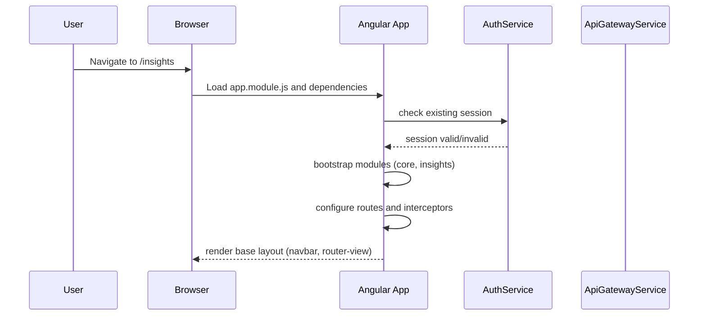
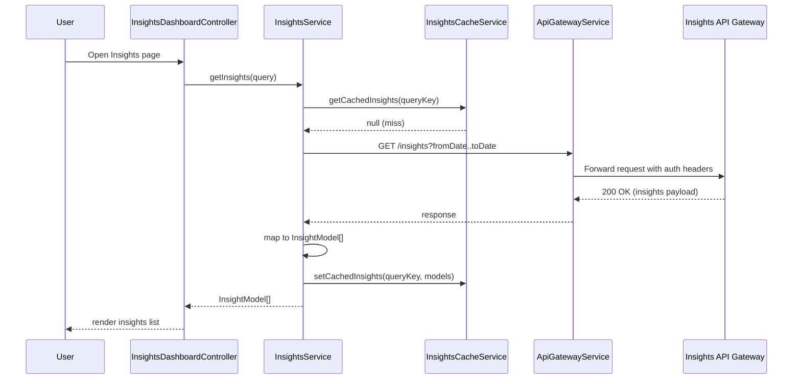
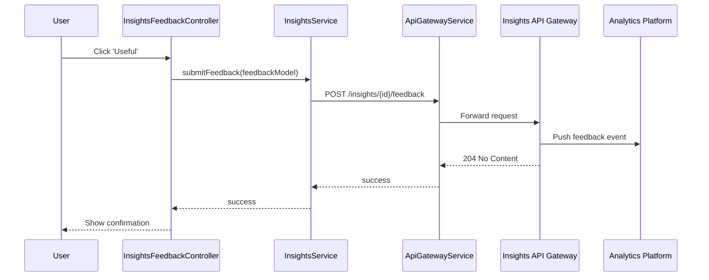
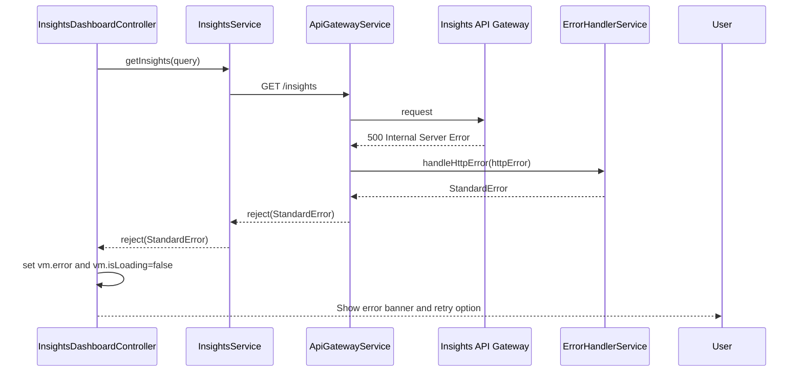
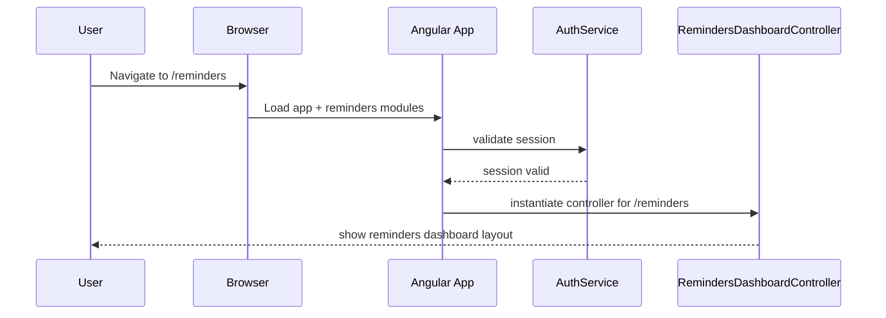
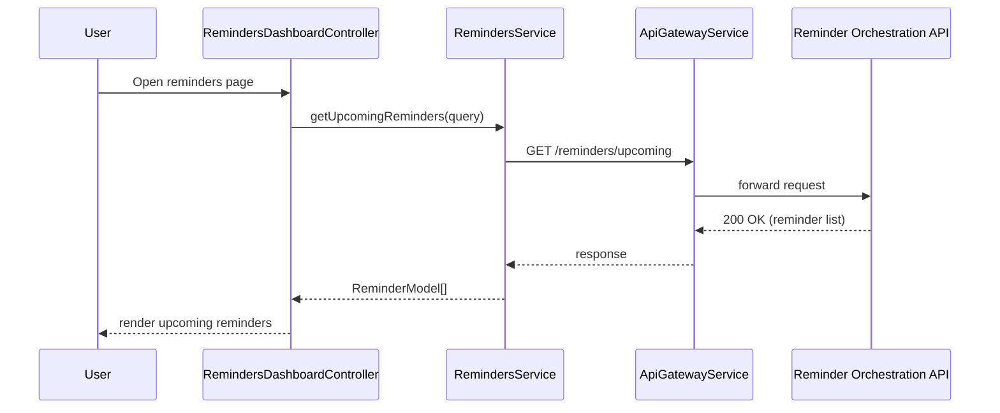
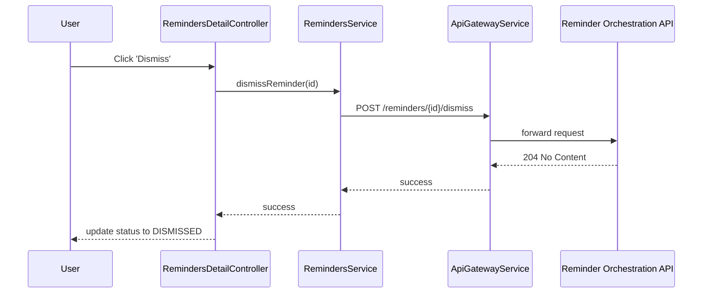
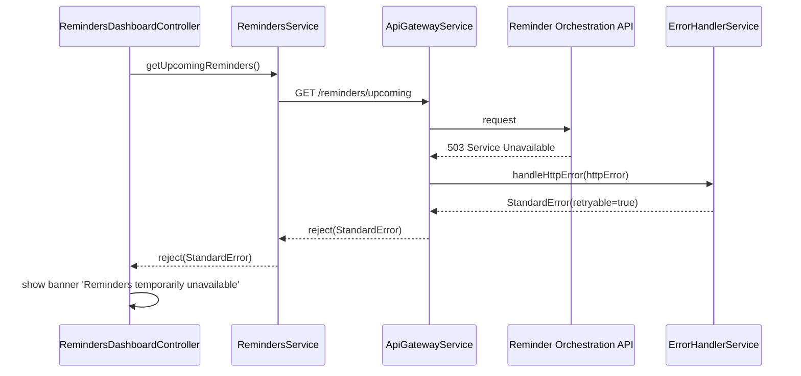

# QE-3122 – Retail Banking Personalized Insights

## 1. Application Architecture

### 1.1 Overview

This LLD defines the front-end and client-side architecture for a Retail Banking Personalized Insights feature. The solution is implemented as an enterprise-grade single-page application (SPA) using:

- AngularJS 1.x (componentized with modules, controllers, services, directives)
- JavaScript ES6 (transpiled where necessary)
- HTML5, CSS3, Bootstrap 3/4
- REST APIs for all server communication
- MVC separation: Views (HTML), Controllers (AngularJS), Models (JS objects), Services (API and business orchestration)

The client app integrates with backend services such as Authentication, RBAC/ABAC, Insights API Gateway, Insights Orchestration, Transaction data services, Profile service, Insights Engine, Compliance service, encrypted Insight datastore, logging and observability.

### 1.2 AngularJS Module Structure

```text
src/
  app/
    app.module.js
    app.config.js
    app.routes.js
    app.constants.js
    core/
      services/
        auth.service.js
        rbac.service.js
        http-interceptor.service.js
        api-gateway.service.js
        logging.service.js
        telemetry.service.js
        error-handler.service.js
      models/
        user-session.model.js
        insight.model.js
        profile.model.js
        preferences.model.js
      filters/
        date-range.filter.js
        category-label.filter.js
        currency-safe.filter.js
      directives/
        loading-spinner.directive.js
        pagination.directive.js
        insight-card.directive.js
    features/
      insights/
        insights.module.js
        insights.routes.js
        controllers/
          insights-dashboard.controller.js
          insights-detail.controller.js
          insights-feedback.controller.js
        services/
          insights.service.js
          insights-profile.service.js
          insights-config.service.js
          insights-cache.service.js
        models/
          insights-query.model.js
          insights-feedback.model.js
        views/
          insights-dashboard.html
          insights-detail.html
          insights-empty-state.html
        directives/
          insights-filter-panel.directive.js
          insights-list.directive.js
          insights-explanation.directive.js
    shared/
      components/
        navbar/
          navbar.directive.js
          navbar.html
        footer/
          footer.directive.js
          footer.html
    assets/
      css/
        main.css
        insights.css
      img/
        ...
    config/
      env.config.dev.js
      env.config.uat.js
      env.config.prod.js
      logging.config.js
    tests/
      unit/
        insights/
          insights.service.spec.js
          insights-dashboard.controller.spec.js
      e2e/
        insights/
          insights.e2e.spec.js

HLD/  (input)
LLD/  (generated docs)
```

### 1.3 Mapping HLD Components to AngularJS Artifacts

- Digital Channels (Web / Mobile App)
  - AngularJS root app module: `app/app.module.js`
  - Feature module: `features/insights/insights.module.js`
  - Route configuration: `app.routes.js`, `features/insights/insights.routes.js`

- Authentication & Session Service
  - `core/services/auth.service.js`
  - `core/models/user-session.model.js`

- RBAC/ABAC Authorization Service
  - `core/services/rbac.service.js`

- Insights UX Layer
  - Views: `insights-dashboard.html`, `insights-detail.html`, `insights-empty-state.html`
  - Controllers: `insights-dashboard.controller.js`, `insights-detail.controller.js`, `insights-feedback.controller.js`
  - Directives: `insights-list.directive.js`, `insights-filter-panel.directive.js`, `insights-explanation.directive.js`, reusable `insight-card.directive.js`
  - Styles: `assets/css/insights.css`

- Insights API Gateway / Edge Service
  - Client wrapper: `core/services/api-gateway.service.js`
  - Feature service: `features/insights/services/insights.service.js`

- Insights Orchestration Service
  - Represented as REST endpoints; consumed via `insights.service.js`

- Transaction Data Source / Ledger
  - Accessed via backend; front-end uses REST endpoints through `insights.service.js` to obtain transaction-based insight data.

- Customer Financial Profile Service
  - Client representation: `features/insights/services/insights-profile.service.js`
  - Model: `features/insights/models/profile.model.js`

- Insights Engine (Rules + Models)
  - Exposed via backend; client receives output as `InsightModel` objects.

- Insights Configuration & Policy Store
  - Client-side wrapper: `features/insights/services/insights-config.service.js`

- Compliance & Regulatory Service
  - Exposed via backend; client receives only compliant insights.
  - Client-layer checks via `rbac.service.js` and configuration flags (e.g., jurisdiction-based visibility).

- Encrypted Insights Data Store
  - Server-side persistence; client interacts via `insights.service.js` endpoints.

- Key Management Service (KMS)
  - Handled server-side; client accesses via TLS.

- Security & Audit Logging Service
  - Client sends audit events via `logging.service.js` and `telemetry.service.js` to server endpoints.

- Monitoring & Observability
  - Client emits metrics and structured logs via `telemetry.service.js`.

- Analytics & Model Monitoring Platform
  - Client collects feedback (useful/not useful) and posts via `insights-feedback.controller.js` and `insights.service.js` to analytics endpoints.


## 2. Component Specifications

Below is a core subset of components; in implementation each will be fully coded according to this spec.

### 2.1 Modules

#### 2.1.1 `app` Module

- Type: AngularJS Module
- File: `src/app/app.module.js`
- Responsibility: Root module wiring core and feature modules.
- Public Interface:
  - AngularJS module definition: `angular.module('rbApp', ['ngRoute', 'rbApp.core', 'rbApp.insights'])`
- Dependencies:
  - `ngRoute`, `rbApp.core`, `rbApp.insights`

#### 2.1.2 `rbApp.core` Module

- File: `src/app/core/core.module.js`
- Responsibility: Houses cross-cutting concerns (auth, RBAC, logging, HTTP interceptors, models, filters, shared directives).
- Dependencies:
  - `ngResource`, `ngSanitize`

#### 2.1.3 `rbApp.insights` Module

- File: `src/app/features/insights/insights.module.js`
- Responsibility: Encapsulates all insights-related controllers, services, directives and routes.
- Dependencies:
  - `rbApp.core`

### 2.2 Core Services

#### 2.2.1 AuthService

- Type: Service
- File: `src/app/core/services/auth.service.js`
- Responsibility: Handle login state, session tokens, user identity retrieval.
- Public Methods:
  - `isAuthenticated(): boolean`
  - `getToken(): string`
  - `setSession(sessionData: UserSessionModel): void`
  - `clearSession(): void`
  - `getCurrentUser(): UserSessionModel`
- Inputs:
  - Authentication response payload (token, expiry, roles)
- Outputs:
  - Session model stored in memory and `sessionStorage`.
- Dependencies:
  - `$window`, `$http`, `UserSessionModel`

#### 2.2.2 RbacService

- Type: Service
- File: `src/app/core/services/rbac.service.js`
- Responsibility: Enforce RBAC/ABAC checks on UI components and routes.
- Public Methods:
  - `canViewInsights(): boolean`
  - `canViewAggregatedMetrics(): boolean`
  - `isActionAllowed(actionCode: string, context?: object): boolean`
- Inputs:
  - Current user roles, attributes (region, product), action codes.
- Outputs:
  - Boolean decisions for UI controls and navigation.
- Dependencies:
  - `AuthService`

#### 2.2.3 ApiGatewayService

- Type: Service
- File: `src/app/core/services/api-gateway.service.js`
- Responsibility: Wrapper around `$http` that appends base URL, auth headers, correlation IDs, and unified error handling.
- Public Methods:
  - `get(path: string, config?: object): Promise`
  - `post(path: string, data: object, config?: object): Promise`
  - `put(path: string, data: object, config?: object): Promise`
  - `delete(path: string, config?: object): Promise`
- Inputs:
  - Relative path (e.g., `/insights`), request body and config.
- Outputs:
  - Promise resolving to response data or rejecting with standardized error object.
- Dependencies:
  - `$http`, `$q`, `EnvConfig`, `AuthService`, `ErrorHandlerService`

#### 2.2.4 LoggingService

- Type: Service
- File: `src/app/core/services/logging.service.js`
- Responsibility: Client-side logging with levels (debug/info/warn/error), plus forwarding to server.
- Public Methods:
  - `debug(message, meta?)`
  - `info(message, meta?)`
  - `warn(message, meta?)`
  - `error(message, meta?)`
- Dependencies:
  - `$log`, `TelemetryService`

#### 2.2.5 ErrorHandlerService

- Type: Service
- File: `src/app/core/services/error-handler.service.js`
- Responsibility: Normalize error responses, provide user-friendly messages and fallback handling.
- Public Methods:
  - `handleHttpError(httpError): StandardError`
  - `handleClientError(error): StandardError`
- Outputs:
  - StandardError: `{ code, message, severity, retryable }`

### 2.3 Insights Feature Services

#### 2.3.1 InsightsService

- Type: Service
- File: `src/app/features/insights/services/insights.service.js`
- Responsibility: Main gateway to server-side insights APIs.
- Public Methods:
  - `getInsights(query: InsightsQueryModel): Promise<InsightModel[]>`
  - `getInsightById(insightId: string): Promise<InsightModel>`
  - `submitFeedback(feedback: InsightsFeedbackModel): Promise<void>`
  - `hideInsight(insightId: string): Promise<void>`
- Inputs:
  - Query parameters (date range, category, pagination)
  - Feedback data (useful/not useful, comments)
- Outputs:
  - List of insights, single insight detail, or completion signals.
- Dependencies:
  - `ApiGatewayService`, `InsightsCacheService`, `LoggingService`, `ErrorHandlerService`

#### 2.3.2 InsightsProfileService

- Type: Service
- File: `src/app/features/insights/services/insights-profile.service.js`
- Responsibility: Retrieve and cache customer financial profile summary for display.
- Public Methods:
  - `getProfile(forceRefresh: boolean): Promise<ProfileModel>`
- Dependencies:
  - `ApiGatewayService`, `InsightsCacheService`

#### 2.3.3 InsightsConfigService

- Type: Service
- File: `src/app/features/insights/services/insights-config.service.js`
- Responsibility: Retrieve configuration such as available insight categories, thresholds, feature flags, segment-specific rules.
- Public Methods:
  - `getConfig(): Promise<object>`
  - `isFeatureEnabled(flagName: string): boolean`
- Dependencies:
  - `ApiGatewayService`, `EnvConfig`

#### 2.3.4 InsightsCacheService

- Type: Service
- File: `src/app/features/insights/services/insights-cache.service.js`
- Responsibility: Short-lived caching of insights and profiles to meet NFR of <2s response.
- Public Methods:
  - `getCachedInsights(queryKey: string): InsightModel[] | null`
  - `setCachedInsights(queryKey: string, insights: InsightModel[]): void`
  - `clear(): void`
- Dependencies:
  - `$cacheFactory`

### 2.4 Controllers

#### 2.4.1 InsightsDashboardController

- Type: Controller
- File: `src/app/features/insights/controllers/insights-dashboard.controller.js`
- Responsibility: Orchestrate insight list retrieval, filtering, pagination, and basic UI state.
- Public Scope/VM Properties:
  - `vm.insights: InsightModel[]`
  - `vm.filters: InsightsQueryModel`
  - `vm.isLoading: boolean`
  - `vm.error: StandardError | null`
- Public Methods:
  - `vm.loadInsights()`
  - `vm.applyFilters()`
  - `vm.clearFilters()`
  - `vm.onInsightSelected(insight: InsightModel)`
- Dependencies:
  - `$scope`, `$location`, `InsightsService`, `RbacService`, `LoggingService`

#### 2.4.2 InsightsDetailController

- Type: Controller
- File: `src/app/features/insights/controllers/insights-detail.controller.js`
- Responsibility: Display detail view of a specific insight, including explanations and related transactions summary.
- Public Properties:
  - `vm.insight: InsightModel`
  - `vm.isLoading`
  - `vm.error`
- Methods:
  - `vm.loadInsight()`
  - `vm.navigateBack()`
- Dependencies:
  - `$routeParams`, `$window`, `InsightsService`, `LoggingService`

#### 2.4.3 InsightsFeedbackController

- Type: Controller
- File: `src/app/features/insights/controllers/insights-feedback.controller.js`
- Responsibility: Manage user feedback (useful/not useful, hide insight) and send it to backend.
- Public Inputs (via directive bindings):
  - `insight: InsightModel`
- Methods:
  - `vm.markUseful()`
  - `vm.markNotUseful()`
  - `vm.hideInsight()`
- Dependencies:
  - `InsightsService`, `LoggingService`, `ErrorHandlerService`

### 2.5 Directives

#### 2.5.1 InsightsListDirective

- Type: Directive (Element)
- File: `src/app/features/insights/directives/insights-list.directive.js`
- Template: `insights-list.html` (inline or separate)
- Responsibility: Render list of insights as cards with category, period, and summary.
- Isolate Scope Bindings:
  - `insights` (array)
  - `onSelect` (callback)
- Dependencies:
  - `categoryLabel` filter, `insight-card` directive

#### 2.5.2 InsightsFilterPanelDirective

- Type: Directive (Element)
- File: `src/app/features/insights/directives/insights-filter-panel.directive.js`
- Responsibility: Display filtering UI (date range, categories, segments) and emit events.
- Bindings:
  - `filters` (two-way binding of `InsightsQueryModel`)
  - `onApply` (callback)
  - `onClear` (callback)

#### 2.5.3 InsightsExplanationDirective

- Type: Directive (Element)
- File: `src/app/features/insights/directives/insights-explanation.directive.js`
- Responsibility: Display explanation text in user-friendly language with compliant phrasing.
- Bindings:
  - `insight` (InsightModel)

### 2.6 Filters

#### 2.6.1 dateRange Filter

- File: `src/app/core/filters/date-range.filter.js`
- Responsibility: Format time windows like "last 3 months".

#### 2.6.2 categoryLabel Filter

- File: `src/app/core/filters/category-label.filter.js`
- Responsibility: Map internal category codes to localized display names.

#### 2.6.3 currencySafe Filter

- File: `src/app/core/filters/currency-safe.filter.js`
- Responsibility: Format currency while adhering to redaction rules (e.g., approximate values when required).


## 3. Component Responsibilities

### 3.1 Ownership of Business Logic

- Business logic related to:
  - Filtering and sorting insights is in `InsightsDashboardController` and `InsightsService`.
  - Transforming raw API responses into `InsightModel` objects is in `InsightsService`.
  - Managing profile display and mapping segments to configuration is in `InsightsProfileService` and `InsightsConfigService`.

No regulator-specific or rules engine logic resides in the client; instead, the client enforces feature flags and region restrictions via `RbacService` and `InsightsConfigService`.

### 3.2 UI Handling

- Controllers manage high-level state (loading flags, errors).
- Directives manage reusable UI structures and DOM interactions.
- Views use Bootstrap grid and components.
- `insights.css` includes theming, responsive cards, and category color coding.

### 3.3 State Management

- Session-level state: Managed via `AuthService` and stored in `sessionStorage`.
- Feature-level state: Filters and selected insight managed in controllers.
- Caching: `InsightsCacheService` holds last retrieved insights for fast reloads.

### 3.4 API Communication

- `ApiGatewayService` centralizes HTTP communication and ensures:
  - API base URL prefix
  - Authorization headers
  - Correlation IDs and tracing headers
  - Unified error transformation

- Feature services use `ApiGatewayService` and never call `$http` directly.

### 3.5 Validation

- Client-side validation:
  - Filter inputs (date ranges, categories) validated in controllers and directives.
  - Prevent overly large date ranges or unsupported categories.
- Server-side validation enforced by back-end; client passes only sanitized inputs.


## 4. Interface Specifications

### 4.1 Controller-Service Interactions

- `InsightsDashboardController` → `InsightsService.getInsights(query)`
- `InsightsDetailController` → `InsightsService.getInsightById(id)`
- `InsightsFeedbackController` → `InsightsService.submitFeedback(feedback)`, `InsightsService.hideInsight(id)`
- `InsightsDashboardController` → `InsightsProfileService.getProfile()` for summary banners.

### 4.2 Client-Server REST APIs

All endpoints are accessed via the Insights API Gateway/Edge Service. `EnvConfig` defines `INSIGHTS_API_BASE_URL` (e.g., `https://api.bank.com/insights`).

#### 4.2.1 Get Insights

- Endpoint: `GET {INSIGHTS_API_BASE_URL}/insights`
- Query Parameters:
  - `fromDate` (ISO-8601 date, required)
  - `toDate` (ISO-8601 date, required)
  - `category` (string, optional)
  - `segment` (string, optional)
  - `page` (int, default 1)
  - `pageSize` (int, default 20, max 100)
- Response (200):
  ```json
  {
    "items": [
      {
        "id": "INS-12345",
        "title": "Your grocery spending increased by 15%",
        "summary": "Compared to the previous 3 months",
        "category": "SPENDING_TREND",
        "timeWindow": {
          "from": "2024-01-01",
          "to": "2024-03-31"
        },
        "confidenceScore": 0.87,
        "segment": "MASS_AFFLUENT",
        "createdAt": "2024-04-05T12:30:00Z",
        "explanation": "Based on your last 3 months of transactions in category GROCERIES.",
        "actions": [
          {
            "type": "LINK",
            "label": "View budget suggestions",
            "url": "/budgeting"
          }
        ],
        "metadata": {
          "engineVersion": "1.2.0",
          "profileVersion": "PF-5678",
          "complianceTag": "INFORMATIONAL"
        }
      }
    ],
    "page": 1,
    "pageSize": 20,
    "totalItems": 45
  }
  ```
- Error Responses:
  - 400 Bad Request: Invalid date range or parameters.
  - 401 Unauthorized: Token missing or invalid.
  - 403 Forbidden: User not allowed to see insights.
  - 500 Internal Server Error: Generic server error.

#### 4.2.2 Get Insight by ID

- Endpoint: `GET {INSIGHTS_API_BASE_URL}/insights/{id}`
- Path Parameters:
  - `id` (string, required)
- Response (200):
  - Single `InsightModel` object as above.

#### 4.2.3 Get Profile Summary

- Endpoint: `GET {INSIGHTS_API_BASE_URL}/profile`
- Response (200):
  ```json
  {
    "customerId": "C-123",
    "segment": "MASS_AFFLUENT",
    "incomeTrend": {
      "direction": "UP",
      "percent": 5.2
    },
    "spendingCategories": [
      {
        "category": "GROCERIES",
        "monthlyAvg": 200.5
      }
    ],
    "lastUpdated": "2024-04-05T10:00:00Z"
  }
  ```

#### 4.2.4 Get Configuration

- Endpoint: `GET {INSIGHTS_API_BASE_URL}/config`
- Response (200):
  ```json
  {
    "categories": [
      { "code": "SPENDING_TREND", "label": "Spending trends" }
    ],
    "featureFlags": {
      "INSIGHTS_ENABLED": true,
      "FEEDBACK_ENABLED": true
    },
    "maxDateRangeDays": 365
  }
  ```

#### 4.2.5 Submit Feedback

- Endpoint: `POST {INSIGHTS_API_BASE_URL}/insights/{id}/feedback`
- Payload:
  ```json
  {
    "feedbackType": "USEFUL" | "NOT_USEFUL",
    "comment": "string (optional)",
    "channel": "WEB" | "MOBILE",
    "timestamp": "2024-04-05T13:45:00Z"
  }
  ```
- Response (204): No content.

#### 4.2.6 Hide Insight

- Endpoint: `POST {INSIGHTS_API_BASE_URL}/insights/{id}/hide`
- Payload: `{}`
- Response (204): No content.


## 5. Data Model Design

### 5.1 UserSessionModel

- File: `src/app/core/models/user-session.model.js`
- Fields:
  - `userId: string`
  - `token: string`
  - `expiresAt: Date`
  - `roles: string[]`
  - `attributes: object` (region, products, etc.)
- Validation:
  - `token` non-empty string
  - `expiresAt` must be future date

### 5.2 InsightModel

- File: `src/app/core/models/insight.model.js`
- Fields:
  - `id: string`
  - `title: string`
  - `summary: string`
  - `category: string`
  - `timeWindow: { from: Date, to: Date }`
  - `confidenceScore: number` (0–1)
  - `segment: string`
  - `createdAt: Date`
  - `explanation: string`
  - `actions: ActionModel[]`
  - `metadata: object`
  - `state: 'ACTIVE' | 'HIDDEN'`
- Default Values:
  - `state = 'ACTIVE'`
- Validation:
  - Mandatory: `id`, `title`, `category`, `timeWindow`
  - `confidenceScore` between 0 and 1.

### 5.3 InsightsQueryModel

- File: `src/app/features/insights/models/insights-query.model.js`
- Fields:
  - `fromDate: Date`
  - `toDate: Date`
  - `category: string | null`
  - `segment: string | null`
  - `page: number`
  - `pageSize: number`
- Default Values:
  - `page = 1`, `pageSize = 20`
- Validation:
  - `fromDate <= toDate`
  - Date range within `maxDateRangeDays` from config.

### 5.4 ProfileModel

- File: `src/app/features/insights/models/profile.model.js`
- Fields:
  - `customerId: string`
  - `segment: string`
  - `incomeTrend: { direction: 'UP'|'DOWN'|'FLAT', percent: number }`
  - `spendingCategories: Array<{ category: string, monthlyAvg: number }>`
  - `lastUpdated: Date`

### 5.5 InsightsFeedbackModel

- File: `src/app/features/insights/models/insights-feedback.model.js`
- Fields:
  - `insightId: string`
  - `feedbackType: 'USEFUL' | 'NOT_USEFUL'`
  - `comment?: string`
  - `channel: 'WEB' | 'MOBILE'`
  - `timestamp: Date`

### 5.6 State Transitions

- `InsightModel.state` transitions:
  - `ACTIVE` → `HIDDEN` when user hides an insight.
  - `ACTIVE` remains, but feedback attributes updated when feedback submitted.


## 6. Data Flow

### 6.1 User Flow – View Insights

1. User logs in → Auth token stored by `AuthService`.
2. User navigates to `/insights` route.
3. Route config instantiates `InsightsDashboardController` and loads `insights-dashboard.html`.
4. Controller initializes default `InsightsQueryModel` (e.g., last 90 days).
5. Controller calls `InsightsService.getInsights(query)`.
6. `InsightsService` checks `InsightsCacheService`:
   - Cache hit → return immediately.
   - Cache miss → `ApiGatewayService.get('/insights', query)`.
7. Backend returns insights; `InsightsService` maps to `InsightModel[]` and caches result.
8. Controller sets `vm.insights` and `vm.isLoading = false`.
9. View renders list via `insights-list` directive.

### 6.2 Feedback Flow

1. User clicks "Useful" on an insight card.
2. `insights-feedback` directive calls `InsightsFeedbackController.markUseful()`.
3. Controller creates `InsightsFeedbackModel` with type `USEFUL` and current timestamp.
4. `InsightsService.submitFeedback(model)` posts to `/insights/{id}/feedback`.
5. On success, UI shows snack-bar confirmation.


## 7. Sequence Diagrams (Mermaid)

### 7.1 Application Initialization



### 7.2 Primary Workflow – Load Insights



### 7.3 Service/API Interactions – Feedback



### 7.4 Error Handling Scenario – Backend Error




## 8. Implementation Details

### 8.1 AngularJS Implementation Approach

- Use `controllerAs` syntax (`vm = this`) to avoid `$scope` pollution.
- Use separate feature modules per domain (here: `rbApp.insights`).
- Factor re-usable components into directives and shared modules.

### 8.2 ES6 Coding Patterns

- ES6 classes for models (e.g., `class InsightModel { constructor(dto) { ... } }`).
- Arrow functions for callbacks where lexical `this` is needed.
- Use `const` and `let` instead of `var`.
- Transpilation handled by build pipeline (outside scope of this LLD).

### 8.3 Dependency Injection

- Annotate Angular components with `$inject` arrays to avoid minification issues.
- Example:
  ```js
  InsightsService.$inject = ['ApiGatewayService', 'InsightsCacheService', 'LoggingService', 'ErrorHandlerService'];
  ```

### 8.4 Business Logic Flow

- Controllers gather input, validate basic constraints, and delegate to services.
- Services construct API requests, transform responses, and manage caching.
- No business-critical rules (e.g., compliance decisions) live in the client.

### 8.5 Validation Logic

- Filters ensure date ranges and categories are within allowed config.
- Directives use AngularJS form validation (`ngModel`, custom validators) for user inputs.

### 8.6 State Management Approach

- Local controller state stored in `vm`.
- Persistent UI preferences (last used filters) stored in `localStorage` via a small utility service (not detailed here but implemented under `core/services/preferences.service.js`).

### 8.7 DOM Interaction Approach

- Direct DOM manipulation avoided; use AngularJS directives and data binding.
- For complex visualizations (charts), integration with supporting libraries (e.g., D3 or Chart.js) wrapped in dedicated directives.

### 8.8 API Integration Approach

- All API calls pass through `ApiGatewayService`.
- Uniform headers: `Authorization`, `X-Correlation-Id`, `Accept-Language`.
- Retry logic for idempotent GET requests implemented at backend; client only retries on network failures optionally via browser-level mechanisms.


## 9. Configuration

### 9.1 AngularJS Config Files

- `app.config.js`:
  - Configure `$httpProvider` interceptors.
  - Configure `$routeProvider` fallback routes.
- `app.routes.js`:
  - `/insights` → `InsightsDashboardController`/`insights-dashboard.html`.
  - `/insights/:id` → `InsightsDetailController`/`insights-detail.html`.
- `env.config.*.js`:
  - Provide environment-specific constants (API base URLs, feature flags).

### 9.2 Environment Properties

- Example `EnvConfig`:
  ```js
  angular.module('rbApp').constant('EnvConfig', {
    INSIGHTS_API_BASE_URL: 'https://api-dev.bank.com/insights',
    LOGGING_API_BASE_URL: 'https://logs-dev.bank.com',
    FEATURE_FLAGS: {
      INSIGHTS_ENABLED: true,
      FEEDBACK_ENABLED: true
    }
  });
  ```

### 9.3 Logging and Telemetry

- `logging.config.js` defines log level thresholds and destinations.
- `TelemetryService` sends events like `INSIGHTS_VIEWED`, `INSIGHT_FEEDBACK_SUBMITTED`.


## 10. Error Handling and Resiliency

### 10.1 Client-Side Exception Handling

- Global `$exceptionHandler` override to capture uncaught errors and send to logging backend.
- UI-level error banners and fallback views (e.g., `insights-empty-state.html`).

### 10.2 REST API Error Handling

- HTTP interceptor intercepts non-2xx responses:
  - Maps to `StandardError` via `ErrorHandlerService`.
  - For 401, triggers re-authentication.
  - For 403, shows authorization error page.
  - For 5xx, shows retry option.

### 10.3 Retry Mechanisms

- Client avoids aggressive retries to align with backend NFRs; network-level retries left to backend.
- Optionally, limited retry for GET `/insights` on network failures using `Retry-After` semantics when provided.

### 10.4 Logging Strategy

- Log at different levels:
  - `info` for successful insight loads and user feedback.
  - `warn` for degraded modes (e.g., using cached profile).
  - `error` for API failures.
- No PII in logs; only pseudonymous insight IDs and correlation IDs.

### 10.5 Recovery and Fallback Behavior

- If the insights API is unavailable:
  - Show cached insights if available, with banner: "Insights may be outdated".
- If configuration service fails:
  - Use local default configuration baked into `EnvConfig`.


## 11. Security Considerations

### 11.1 Input Validation and Sanitization

- Sanitize all user-provided text using `ngSanitize` and custom sanitizers.
- Enforce maximum length on text inputs (feedback comments, filter names).

### 11.2 XSS Prevention

- Use AngularJS automatic HTML escaping.
- Only allow safe HTML through `ng-bind-html` with whitelist.
- Never inject server-returned HTML directly; treat as plain text.

### 11.3 CSRF Protection

- Backend issues CSRF tokens; Angular app includes them in headers (via interceptor) for state-changing operations.

### 11.4 Secure API Communication

- All endpoints accessed via HTTPS/TLS 1.2+ (aligned with TLS 1.3 on backend).
- Strict transport security (HSTS) enforced by web server.

### 11.5 Authentication and Authorization Integration

- Auth token stored in `sessionStorage` not `localStorage`.
- `RbacService` hides or disables UI elements for unauthorized users.

### 11.6 Sensitive Data Handling

- Insight content is already filtered server-side; client ensures:
  - No account numbers or raw transaction IDs displayed.
  - Only high-level descriptions shown in UI.

### 11.7 Audit Logging Approach

- Client sends audit events for:
  - Insight viewed.
  - Insight feedback provided.
  - Insight hidden.
- Events include:
  - Insight ID, anonymized user ID, timestamp, channel, action code.

---

# QE-3125 – Retail Banking Bill Reminder UX

## 1. Application Architecture

### 1.1 Overview

This LLD describes the Bill Reminder UX in the retail banking digital channels, implemented using AngularJS 1.x, ES6, HTML5, CSS3, Bootstrap, and REST APIs. The client consumes backend services such as Authentication, RBAC/ABAC, Reminder Orchestration, Recurring Payment Detection, Calendar, Rules/Policy Engine, Notification service, Preferences store, Compliance and logging services.

### 1.2 AngularJS Module and Folder Structure

```text
src/
  app/
    app.module.js
    app.config.js
    app.routes.js
    app.constants.js
    core/
      services/
        auth.service.js
        rbac.service.js
        api-gateway.service.js
        logging.service.js
        telemetry.service.js
        error-handler.service.js
      models/
        user-session.model.js
      filters/
        date-range.filter.js
      directives/
        loading-spinner.directive.js
        pagination.directive.js
    features/
      reminders/
        reminders.module.js
        reminders.routes.js
        controllers/
          reminders-dashboard.controller.js
          reminders-detail.controller.js
          reminders-settings.controller.js
        services/
          reminders.service.js
          recurring-detection.service.js
          reminders-preferences.service.js
          reminders-calendar.service.js
        models/
          reminder.model.js
          recurring-pattern.model.js
          reminder-preferences.model.js
        views/
          reminders-dashboard.html
          reminders-detail.html
          reminders-settings.html
          reminders-empty-state.html
        directives/
          reminders-calendar.directive.js
          reminder-card.directive.js
          reminder-channel-toggle.directive.js
    shared/
      components/
        navbar/
          navbar.directive.js
          navbar.html
        footer/
          footer.directive.js
          footer.html
    assets/
      css/
        main.css
        reminders.css
      img/
        ...
    config/
      env.config.dev.js
      env.config.uat.js
      env.config.prod.js
      logging.config.js
    tests/
      unit/
        reminders/
          reminders.service.spec.js
          reminders-dashboard.controller.spec.js
      e2e/
        reminders/
          reminders.e2e.spec.js

HLD/
LLD/
```

### 1.3 Mapping HLD Components to AngularJS Artifacts

- Digital Channels (Web / Mobile App)
  - AngularJS app module and reminders feature.

- Authentication & Session Service
  - `auth.service.js`, `user-session.model.js`.

- RBAC/ABAC Authorization Service
  - `rbac.service.js` with reminder-specific checks.

- Bill Reminder UX Layer
  - Views: `reminders-dashboard.html`, `reminders-detail.html`, `reminders-settings.html`.
  - Controllers: `reminders-dashboard.controller.js`, `reminders-detail.controller.js`, `reminders-settings.controller.js`.
  - Directives: `reminders-calendar.directive.js`, `reminder-card.directive.js`, `reminder-channel-toggle.directive.js`.

- Bill Reminder Orchestration Service
  - Consumed via `reminders.service.js`.

- Recurring Payment Detection Service
  - Exposed via backend; results consumed via `recurring-detection.service.js`.

- Transaction Data Platform / Core Banking
  - Backend only; client uses orchestrated endpoints.

- Bill Schedule & Calendar Service
  - Client representation through `reminders-calendar.service.js` and calendar directive.

- Reminder Rules & Policy Engine
  - Exposed via backend; client reads eligibility indicators and allowed configuration options.

- Notification Service
  - Client interacts indirectly via orchestrated endpoints (requesting notifications or viewing status).

- User Profile & Preferences Store
  - `reminders-preferences.service.js`, `reminder-preferences.model.js`.

- Compliance & Policy Service
  - Backend; client receives error codes or flags indicating blocked communication.

- Encrypted Bill Reminder Store
  - Backend; client just consumes reminders.

- KMS, Security & Audit Logging Service, Monitoring & Observability
  - Client logs and telemetry via `logging.service.js` and `telemetry.service.js`.


## 2. Component Specifications

### 2.1 Reminders Module

#### 2.1.1 `rbApp.reminders` Module

- File: `src/app/features/reminders/reminders.module.js`
- Responsibility: Encapsulate reminder-related components.
- Dependencies: `rbApp.core`, `ngRoute`.

### 2.2 Services

#### 2.2.1 RemindersService

- Type: Service
- File: `src/app/features/reminders/services/reminders.service.js`
- Responsibility: Communicate with Reminder Orchestration Service.
- Public Methods:
  - `getUpcomingReminders(query): Promise<ReminderModel[]>`
  - `getPastReminders(query): Promise<ReminderModel[]>`
  - `getReminderById(reminderId: string): Promise<ReminderModel>`
  - `dismissReminder(reminderId: string): Promise<void>`
  - `markReminderHandled(reminderId: string): Promise<void>`
- Inputs:
  - Query params: date range, status, pagination.
- Outputs:
  - Arrays of `ReminderModel` or single reminder.
- Dependencies:
  - `ApiGatewayService`, `LoggingService`, `ErrorHandlerService`

#### 2.2.2 RecurringDetectionService

- Type: Service
- File: `src/app/features/reminders/services/recurring-detection.service.js`
- Responsibility: Request detection results for recurring payments to display candidate bills.
- Public Methods:
  - `getDetectedBills(): Promise<RecurringPatternModel[]>`
- Dependency:
  - `ApiGatewayService`

#### 2.2.3 RemindersPreferencesService

- Type: Service
- File: `src/app/features/reminders/services/reminders-preferences.service.js`
- Responsibility: Manage user notification preferences (channels, lead time).
- Public Methods:
  - `getPreferences(): Promise<ReminderPreferencesModel>`
  - `updatePreferences(preferences: ReminderPreferencesModel): Promise<void>`
- Dependencies:
  - `ApiGatewayService`, `ErrorHandlerService`

#### 2.2.4 RemindersCalendarService

- Type: Service
- File: `src/app/features/reminders/services/reminders-calendar.service.js`
- Responsibility: Transform reminder events into calendar grid structures.
- Public Methods:
  - `buildCalendarMonth(reminders: ReminderModel[], month: Date): CalendarMonth`

### 2.3 Controllers

#### 2.3.1 RemindersDashboardController

- File: `src/app/features/reminders/controllers/reminders-dashboard.controller.js`
- Responsibility: List upcoming and past reminders, provide filter controls.
- VM Properties:
  - `vm.upcomingReminders: ReminderModel[]`
  - `vm.pastReminders: ReminderModel[]`
  - `vm.filters: { fromDate, toDate, status }`
  - `vm.isLoading: boolean`
  - `vm.error: StandardError | null`
- VM Methods:
  - `vm.loadReminders()`
  - `vm.applyFilters()`
  - `vm.clearFilters()`
  - `vm.selectReminder(reminder)` (navigate to detail)
- Dependencies:
  - `$location`, `RemindersService`, `RbacService`, `LoggingService`

#### 2.3.2 RemindersDetailController

- File: `src/app/features/reminders/controllers/reminders-detail.controller.js`
- Responsibility: Show single reminder details, status and actions.
- VM:
  - `vm.reminder: ReminderModel`
  - `vm.isLoading`, `vm.error`
- Methods:
  - `vm.loadReminder()`
  - `vm.dismiss()`
  - `vm.markHandled()`
- Dependencies:
  - `$routeParams`, `$window`, `RemindersService`, `LoggingService`, `ErrorHandlerService`

#### 2.3.3 RemindersSettingsController

- File: `src/app/features/reminders/controllers/reminders-settings.controller.js`
- Responsibility: Preferences UI (channels, lead time), consent flags.
- VM:
  - `vm.preferences: ReminderPreferencesModel`
  - `vm.isSaving`, `vm.error`
- Methods:
  - `vm.loadPreferences()`
  - `vm.savePreferences()`
- Dependencies:
  - `RemindersPreferencesService`, `LoggingService`

### 2.4 Directives

#### 2.4.1 RemindersCalendarDirective

- File: `src/app/features/reminders/directives/reminders-calendar.directive.js`
- Responsibility: Render calendar view of upcoming reminders.
- Bindings:
  - `reminders` (array)
  - `onSelect` (callback)
- Uses Bootstrap grid and custom CSS.

#### 2.4.2 ReminderCardDirective

- File: `src/app/features/reminders/directives/reminder-card.directive.js`
- Responsibility: Standard card for a single reminder with due date, merchant, status, and actions.
- Bindings:
  - `reminder` (ReminderModel)
  - `onDismiss`, `onHandled` callbacks.

#### 2.4.3 ReminderChannelToggleDirective

- File: `src/app/features/reminders/directives/reminder-channel-toggle.directive.js`
- Responsibility: Channel toggle controls (in-app, email, SMS, push) with explanatory text.


## 3. Component Responsibilities

### 3.1 Business Logic

- `RemindersService`:
  - Coordinates retrieval of reminders with filters.
  - Translates server statuses into UI states (e.g., `SENT`, `DISMISSED`, `HANDLED`).
- `RemindersPreferencesService`:
  - Applies default preferences when no record exists.

### 3.2 UI Handling

- Dashboard controller drives two tabs: Upcoming and Past.
- Settings controller handles inline validation and possible server-side validation errors.
- Calendar directive manages DOM layout; controllers remain abstract from DOM.

### 3.3 State Management

- Filter state stored per session.
- Channels and preferences persisted via backend and optionally mirrored in local cache.


## 4. Interface Specifications

### 4.1 REST Endpoints (Client View)

Base URL: `REMINDERS_API_BASE_URL` (e.g., `https://api.bank.com/reminders`).

#### 4.1.1 Get Upcoming Reminders

- Endpoint: `GET {REMINDERS_API_BASE_URL}/reminders/upcoming`
- Query Params:
  - `fromDate`, `toDate`, `page`, `pageSize`.
- Response (200):
  ```json
  {
    "items": [
      {
        "id": "REM-123",
        "merchantName": "Utility Co.",
        "dueDate": "2024-05-01",
        "amount": 120.5,
        "currency": "USD",
        "status": "PENDING",
        "source": "DETECTED",
        "channels": ["APP", "EMAIL"],
        "leadTimeDays": 3,
        "createdAt": "2024-04-20T10:00:00Z"
      }
    ],
    "page": 1,
    "pageSize": 20,
    "totalItems": 10
  }
  ```

#### 4.1.2 Get Past Reminders

- Endpoint: `GET {REMINDERS_API_BASE_URL}/reminders/past`

#### 4.1.3 Get Reminder by ID

- Endpoint: `GET {REMINDERS_API_BASE_URL}/reminders/{id}`

#### 4.1.4 Dismiss Reminder

- Endpoint: `POST {REMINDERS_API_BASE_URL}/reminders/{id}/dismiss`
- Payload: `{}`
- Response: `204 No Content`.

#### 4.1.5 Mark Reminder as Handled

- Endpoint: `POST {REMINDERS_API_BASE_URL}/reminders/{id}/handled`
- Payload: `{}`
- Response: `204 No Content`.

#### 4.1.6 Get Preferences

- Endpoint: `GET {REMINDERS_API_BASE_URL}/preferences`
- Response:
  ```json
  {
    "channels": {
      "APP": true,
      "EMAIL": true,
      "SMS": false,
      "PUSH": false
    },
    "leadTimeDays": 3,
    "timezone": "Europe/London",
    "consent": {
      "email": true,
      "sms": false
    }
  }
  ```

#### 4.1.7 Update Preferences

- Endpoint: `PUT {REMINDERS_API_BASE_URL}/preferences`
- Payload: as above.

### 4.2 Error Responses

- 400: Validation errors (e.g., invalid lead time).
- 401: Unauthenticated.
- 403: Consent missing or channel not allowed.
- 409: Optimistic concurrency conflict (preferences changed elsewhere).
- 500: Server error.


## 5. Data Model Design

### 5.1 ReminderModel

- File: `src/app/features/reminders/models/reminder.model.js`
- Fields:
  - `id: string`
  - `merchantName: string`
  - `dueDate: Date`
  - `amount: number`
  - `currency: string`
  - `status: 'PENDING' | 'SENT' | 'DISMISSED' | 'HANDLED'`
  - `source: 'DETECTED' | 'BILLPAY'`
  - `channels: string[]`
  - `leadTimeDays: number`
  - `createdAt: Date`
- Validation:
  - `dueDate` not in distant past.
  - `amount >= 0`.

### 5.2 RecurringPatternModel

- File: `src/app/features/reminders/models/recurring-pattern.model.js`
- Fields:
  - `id: string`
  - `merchantName: string`
  - `estimatedDueDate: Date`
  - `averageAmount: number`
  - `frequency: 'MONTHLY' | 'WEEKLY' | 'YEARLY' | 'OTHER'`

### 5.3 ReminderPreferencesModel

- File: `src/app/features/reminders/models/reminder-preferences.model.js`
- Fields:
  - `channels: { APP: boolean, EMAIL: boolean, SMS: boolean, PUSH: boolean }`
  - `leadTimeDays: number`
  - `timezone: string`
  - `consent: { email: boolean, sms: boolean }`
- Validation:
  - `leadTimeDays` within allowed range (e.g., 0–30).

### 5.4 State Transitions

- `status` transitions:
  - `PENDING` → `SENT` when reminder delivered.
  - `SENT` → `DISMISSED` when user dismisses.
  - `SENT` → `HANDLED` when user marks handled.


## 6. Data Flow

### 6.1 User Action → Reminder Handling

1. User logs in and navigates to `/reminders`.
2. `RemindersDashboardController` loads upcoming reminders via `RemindersService.getUpcomingReminders()`.
3. The list displays via `reminder-card` directive.
4. User clicks "Dismiss".
5. Directive calls controller method `vm.dismiss(reminder)`.
6. Controller calls `RemindersService.dismissReminder(id)`.
7. Service calls `POST /reminders/{id}/dismiss`.
8. On success, controller updates `reminder.status = 'DISMISSED'` and refreshes list if needed.

### 6.2 Settings Flow

1. User navigates to `/reminders/settings`.
2. `RemindersSettingsController` calls `RemindersPreferencesService.getPreferences()`.
3. User adjusts channel toggles via `reminder-channel-toggle` directive.
4. When saving, controller validates `leadTimeDays` range then calls `updatePreferences()`.


## 7. Sequence Diagrams

### 7.1 Application Initialization (Reminders Feature)



### 7.2 Primary Workflow – Load Upcoming Reminders



### 7.3 Service/API Interactions – Dismiss Reminder



### 7.4 Error Handling Scenario – Notification Service Down




## 8. Implementation Details

### 8.1 AngularJS Approach

- Use `controllerAs` syntax.
- Place shared logic (e.g., date filter) in services or filters.

### 8.2 ES6 Patterns

- Use classes for `ReminderModel` and preferences.
- Use template literals for constructing messages.

### 8.3 Dependency Injection

- Each controller/service includes `$inject` annotations.

### 8.4 Business Logic & Validation

- Controllers enforce:
  - Valid date ranges for queries.
  - Valid `leadTimeDays`.
- Services enforce no direct display of sensitive values; e.g., amount may be replaced with `null` for channels forbidden by compliance flags.

### 8.5 State Management

- Filters persisted per session in memory.
- Preferences stored via backend; local copy to give immediate feedback.


## 9. Configuration

- `EnvConfig` contains `REMINDERS_API_BASE_URL`.
- Feature flags: `REMINDERS_ENABLED`, `REMINDERS_SMS_ENABLED`.


## 10. Error Handling and Resiliency

- HTTP interceptor handles 401/403/500 codes.
- On 403 with specific error code (e.g., `CONSENT_MISSING`), UI prompts user to go to settings.
- On 5xx, show retry option.


## 11. Security Considerations

- Input validation on custom reminder labels and notes.
- No sensitive data (full account numbers, full transaction details) shown in UI.
- Use AngularJS bindings to prevent XSS.
- CSRF token included via interceptor.
- All calls over HTTPS.
- Audit events sent for dismiss/handled actions via `TelemetryService`.
