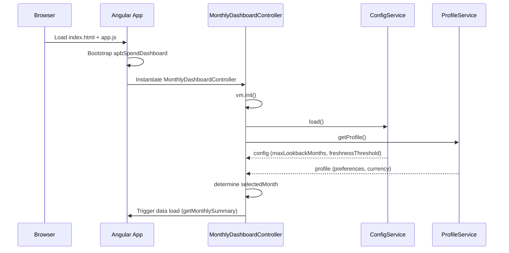
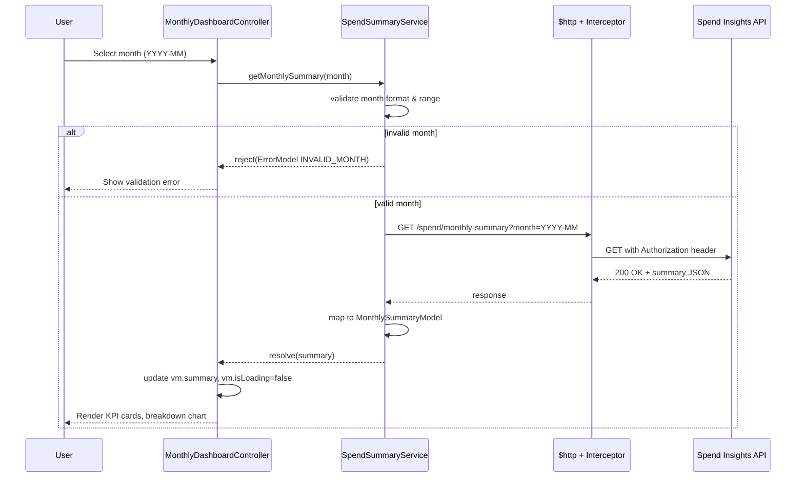
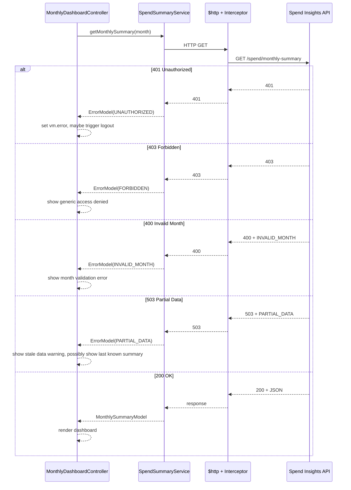
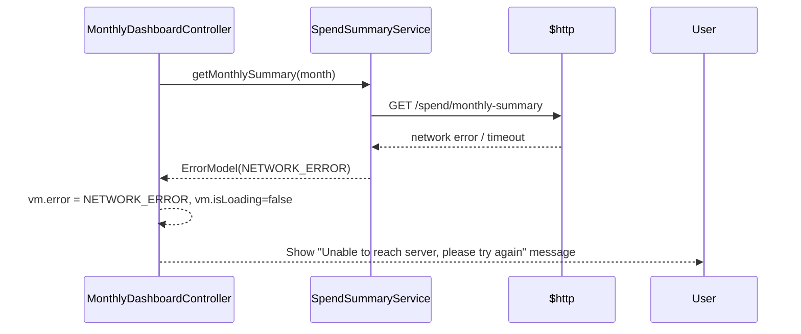

# QE-3149 – Monthly Spend Dashboard – Low-Level Design (LLD)

## 1. Overview

This Low-Level Design describes the front-end web application for the **Monthly Spend Dashboard** for credit card customers. The application is a single-page app (SPA) built with **AngularJS 1.x**, JavaScript ES6 (transpiled where needed), HTML5, CSS3, and Bootstrap. It consumes REST APIs exposed by the Spend Insights platform, primarily `GET /spend/monthly-summary?month=YYYY-MM`.

The LLD translates the high-level architecture into concrete AngularJS modules, controllers, services, models, and views so that developers can implement the application without referring back to the HLD.

The scope of this LLD is the **web frontend**; mobile is assumed to follow a similar pattern but is not covered here.

---

## 2. Application Architecture

### 2.1 AngularJS MVC Architecture Mapping

- **View (V)**
  - HTML templates rendered via AngularJS directives (`ng-view`, `ng-repeat`, `ng-if`, etc.).
  - Bootstrap-based responsive layout for dashboard cards and charts.

- **Controller (C)**
  - Orchestrates user interactions (month selection, refresh, error handling).
  - Mediates between views and services.
  - Owns transient UI state (loading flags, error messages, selected month, freshness indicators).

- **Model (M)**
  - JavaScript objects representing monthly spend summaries, KPIs, and basic breakdowns.
  - AngularJS services and factories manage creation, hydration from API, and validation.

### 2.2 AngularJS Modules and Components

Top-level module:

- `apbSpendDashboard` (root application module).

Feature modules:

1. `apb.core`
   - Application bootstrap, routing, configuration, constants, shared utilities.

2. `apb.layout`
   - Shell layout (header, footer, side navigation, notifications).

3. `apb.spendDashboard`
   - Core Monthly Spend Dashboard feature.
   - Controllers, services, models, views, directives for charts/widgets.

4. `apb.shared`
   - Reusable shared components (filters, directives, utility services, interceptors).

5. `apb.security`
   - Front-end token handling, auth-related guards.

### 2.3 Project Folder Structure

Only `HLD` and `LLD` are outside `src`. All implementation artifacts are under `src`.

```text
APB_Demo/
├── HLD/
│   └── QE-3149_HLD.md
├── LLD/
│   └── QE-3149_LLD.md   <-- this document
└── src/
    ├── index.html
    ├── app.js
    ├── core/
    │   ├── core.module.js
    │   ├── core.config.js
    │   ├── core.routes.js
    │   ├── core.constants.js
    │   └── http.interceptor.js
    ├── layout/
    │   ├── layout.module.js
    │   ├── shell.controller.js
    │   ├── header.directive.js
    │   ├── footer.directive.js
    │   └── notifications.directive.js
    ├── spend-dashboard/
    │   ├── spend-dashboard.module.js
    │   ├── controllers/
    │   │   └── monthly-dashboard.controller.js
    │   ├── services/
    │   │   ├── spend-summary.service.js
    │   │   ├── profile.service.js
    │   │   └── config.service.js
    │   ├── models/
    │   │   ├── monthly-summary.model.js
    │   │   └── breakdown.model.js
    │   ├── directives/
    │   │   ├── monthly-kpi-cards.directive.js
    │   │   ├── monthly-breakdown-chart.directive.js
    │   │   └── freshness-indicator.directive.js
    │   ├── views/
    │   │   └── monthly-dashboard.view.html
    │   └── tests/
    │       ├── monthly-dashboard.controller.spec.js
    │       └── spend-summary.service.spec.js
    ├── shared/
    │   ├── shared.module.js
    │   ├── filters/
    │   │   └── currency-short.filter.js
    │   ├── directives/
    │   │   └── loading-spinner.directive.js
    │   ├── services/
    │   │   └── logger.service.js
    │   └── models/
    │       └── error.model.js
    ├── security/
    │   ├── security.module.js
    │   └── auth-token.service.js
    ├── assets/
    │   ├── css/
    │   │   ├── main.css
    │   │   └── monthly-dashboard.css
    │   ├── img/
    │   └── fonts/
    ├── config/
    │   ├── env.config.js
    │   └── logging.config.js
    └── tests/
        └── karma.conf.js
```

---

## 3. Component Specifications

### 3.1 Modules

#### 3.1.1 `apbSpendDashboard` (Root Module)

- **Type**: AngularJS Module
- **File**: `src/app.js`
- **Responsibilities**:
  - Declare main application module and wire feature modules.
  - Bootstrap AngularJS application on `index.html`.
- **Public API**: N/A (configuration only).
- **Dependencies**:
  - External: `ngRoute`, `ngAnimate`, `ngSanitize`, `ui.bootstrap`.
  - Internal: `apb.core`, `apb.layout`, `apb.spendDashboard`, `apb.shared`, `apb.security`.

#### 3.1.2 `apb.core`

- **File**: `src/core/core.module.js`
- **Responsibilities**:
  - Global configuration and routing.
  - HTTP interceptors registration.
  - Application-wide constants.
- **Dependencies**: `ngRoute`.

#### 3.1.3 `apb.layout`

- **File**: `src/layout/layout.module.js`
- **Responsibilities**:
  - Layout shell and common UI chrome.

#### 3.1.4 `apb.spendDashboard`

- **File**: `src/spend-dashboard/spend-dashboard.module.js`
- **Responsibilities**:
  - Encapsulate Monthly Spend Dashboard feature.
  - Register controllers, services, and directives.

#### 3.1.5 `apb.shared`

- **File**: `src/shared/shared.module.js`
- **Responsibilities**:
  - Common filters, directives, services used across modules.

#### 3.1.6 `apb.security`

- **File**: `src/security/security.module.js`
- **Responsibilities**:
  - Token handling, security utilities on the client.

---

### 3.2 Controllers

#### 3.2.1 `MonthlyDashboardController`

- **Type**: Controller
- **File**: `src/spend-dashboard/controllers/monthly-dashboard.controller.js`
- **Registration**: `apb.spendDashboard.controller('MonthlyDashboardController', MonthlyDashboardController);`

- **Responsibilities**:
  - Initialize dashboard view for the current or default month.
  - Handle month selection and refresh events.
  - Call `SpendSummaryService` to fetch data.
  - Bind data to KPI and breakdown directives.
  - Handle loading, error, and degradation states.

- **Public Methods (on `$scope` or `vm` using controller-as)**:
  - `vm.init()`
    - Initialize controller, determine default month from profile/config, and load data.
  - `vm.onMonthChange(month)`
    - Triggered when user selects a different month.
  - `vm.refresh()`
    - Re-fetch data for current month.

- **Inputs**:
  - Route parameters (optional future extension).
  - User interaction events from view (month selection, refresh button).

- **Outputs**:
  - Bound view-model properties:
    - `vm.selectedMonth` (string `YYYY-MM`).
    - `vm.summary` (instance of `MonthlySummaryModel`).
    - `vm.isLoading` (boolean).
    - `vm.error` (instance of `ErrorModel` or null).
    - `vm.showStaleWarning` (boolean).

- **Dependencies (Injected Services)**:
  - `$scope` (if not using controller-as fully), `$q`, `$timeout` (for UI timers).
  - `SpendSummaryService`.
  - `ProfileService`.
  - `ConfigService`.
  - `LoggerService`.

---

### 3.3 Services

#### 3.3.1 `SpendSummaryService`

- **Type**: AngularJS Service
- **File**: `src/spend-dashboard/services/spend-summary.service.js`
- **Registration**: `apb.spendDashboard.service('SpendSummaryService', SpendSummaryService);`

- **Responsibilities**:
  - Communicate with backend Spend Insights API.
  - Validate input months before calling API.
  - Map API responses to `MonthlySummaryModel` instances.
  - Implement retry logic (bounded) and error normalization.

- **Public Methods**:
  - `getMonthlySummary(month: string): Promise<MonthlySummaryModel>`
    - Validate `month` format and range.
    - Call REST endpoint `GET /spend/monthly-summary?month=YYYY-MM`.
    - Wrap result into `MonthlySummaryModel`.
  - `isMonthInAllowedRange(month: string): boolean`
    - Validate month within last N months as configured.

- **Inputs**:
  - `month` parameter from caller.

- **Outputs**:
  - Resolved `MonthlySummaryModel` on success.
  - Rejected promise with `ErrorModel` on failure.

- **Dependencies**:
  - `$http`, `$q`.
  - `ENV_CONFIG` constant (API base URL, timeout, retry limits).
  - `ErrorModel` factory.
  - `LoggerService`.

---

#### 3.3.2 `ProfileService`

- **Type**: Service
- **File**: `src/spend-dashboard/services/profile.service.js`

- **Responsibilities**:
  - Retrieve customer profile preferences (default month range, currency, consent flags that affect UI).
  - Cache profile data within session.

- **Public Methods**:
  - `getProfile(): Promise<Profile>`
  - `getPreferredDefaultMonth(): string` (may derive from profile fields).

- **Dependencies**:
  - `$http`, `$q`.
  - `ENV_CONFIG`.

---

#### 3.3.3 `ConfigService`

- **Type**: Service
- **File**: `src/spend-dashboard/services/config.service.js`

- **Responsibilities**:
  - Fetch feature flags and configuration thresholds relevant to dashboard (e.g., max lookback months, fresh/stale thresholds).
  - Expose read-only accessors to controllers and directives.

- **Public Methods**:
  - `load(): Promise<void>`
  - `getMaxLookbackMonths(): number`
  - `getFreshnessThresholdMinutes(): number`

- **Dependencies**:
  - `$http`, `$q`.
  - `ENV_CONFIG`.

---

#### 3.3.4 `LoggerService`

- **Type**: Service
- **File**: `src/shared/services/logger.service.js`

- **Responsibilities**:
  - Standardize client-side logging.
  - Wrap `$log` and optionally send logs to remote endpoint (aligned with SIEM/central logs via API).

- **Public Methods**:
  - `info(message: string, context?: object)`
  - `warn(message: string, context?: object)`
  - `error(message: string, context?: object)`

- **Dependencies**:
  - `$log`, `$http`.
  - `LOGGING_CONFIG`.

---

#### 3.3.5 `AuthTokenService`

- **Type**: Service
- **File**: `src/security/auth-token.service.js`

- **Responsibilities**:
  - Store and retrieve access tokens issued by AUS/IdP.
  - Attach tokens to outbound API calls via HTTP interceptor.
  - Handle token expiration (logout or refresh orchestration – refresh API not implemented here but integration points defined).

- **Public Methods**:
  - `getAccessToken(): string | null`
  - `setAccessToken(token: string): void`
  - `clear(): void`
  - `isTokenExpired(): boolean`

- **Dependencies**:
  - `$window` (for `sessionStorage` / `localStorage`).

---

### 3.4 HTTP Interceptor

#### 3.4.1 `AuthHttpInterceptor`

- **Type**: Factory (HTTP interceptor)
- **File**: `src/core/http.interceptor.js`

- **Responsibilities**:
  - Add `Authorization: Bearer <token>` header from `AuthTokenService` to all API requests to Spend Insights and profile/config endpoints.
  - Handle 401/403 responses and redirect user to login or show appropriate error message.
  - Log errors using `LoggerService`.

- **Public Hooks**:
  - `request(config)`
  - `responseError(rejection)`

- **Dependencies**:
  - `$q`, `$injector` (to resolve `AuthTokenService` and `LoggerService` lazily).

---

### 3.5 Directives

#### 3.5.1 `monthlyKpiCards`

- **Type**: Directive (Element)
- **File**: `src/spend-dashboard/directives/monthly-kpi-cards.directive.js`

- **Responsibilities**:
  - Render KPI cards: total spend, number of transactions, average transaction value.
  - Use Bootstrap cards with responsive layout.

- **Scope Bindings**:
  - `summary: '='` – instance of `MonthlySummaryModel`.

- **Dependencies**:
  - None (purely presentational).

---

#### 3.5.2 `monthlyBreakdownChart`

- **Type**: Directive (Element)
- **File**: `src/spend-dashboard/directives/monthly-breakdown-chart.directive.js`

- **Responsibilities**:
  - Render basic breakdown of spend (e.g., high-level categories or online vs in-store) using a charting library (e.g., Chart.js) or simple bar/pie charts.
  - Display each breakdown bucket with amount and percentage.

- **Scope Bindings**:
  - `breakdown: '='` – array of `BreakdownModel`.

- **Dependencies**:
  - Optional external chart library wrapper.

---

#### 3.5.3 `freshnessIndicator`

- **Type**: Directive (Element or Attribute)
- **File**: `src/spend-dashboard/directives/freshness-indicator.directive.js`

- **Responsibilities**:
  - Display "Last updated" timestamp and freshness (e.g., "Up to date", "May not reflect latest transactions").

- **Scope Bindings**:
  - `timestamp: '='` – ISO date string or Date.
  - `isStale: '='` – boolean.

---

#### 3.5.4 `loadingSpinner`

- **Type**: Directive
- **File**: `src/shared/directives/loading-spinner.directive.js`

- **Responsibilities**:
  - Show a Bootstrap spinner overlay while `isLoading` is true.

- **Scope Bindings**:
  - `isLoading: '='`.

---

### 3.6 Filters

#### 3.6.1 `currencyShort`

- **Type**: Filter
- **File**: `src/shared/filters/currency-short.filter.js`

- **Responsibilities**:
  - Format currency values into human-friendly short form (e.g., 12345 → `12.3k`).

- **Signature**:
  - `currencyShort(amount: number, currencyCode: string): string`.

---

## 4. Component Responsibilities (Detailed)

### 4.1 Controllers vs Services

- Controllers hold **view-specific state** and orchestrate actions.
- Services encapsulate **business rules**, **API communication**, and **data transformation**.

For this dashboard:

- `MonthlyDashboardController`:
  - Determines the active month (default to profile/preference or most recent month).
  - Calls `SpendSummaryService.getMonthlySummary()` whenever the month changes.
  - Evaluates whether the returned summary is stale based on freshness threshold from `ConfigService`.
  - Interprets service errors (validation errors, authorization failures, internal errors) and exposes user-friendly messages to the view.

- `SpendSummaryService`:
  - Performs client-side input validation for `month` using strict regex `^\d{4}-(0[1-9]|1[0-2])$`.
  - Validates that requested month is within configured lookback period.
  - Constructs HTTP request with required query params and headers (except Authorization, handled by interceptor).
  - Handles HTTP/network errors and normalizes them into `ErrorModel` with categories (VALIDATION, AUTH, NETWORK, SERVER).

### 4.2 Ownership of Business Logic

- **Business Logic** in front-end (lightweight):
  - Month input validation before calling backend.
  - Client-side decision on stale/"may not reflect latest" messaging based on `lastUpdated` field vs current time.
  - Calculation of derived UI values such as percentages if not provided by API (while keeping backend as source of truth for primary KPIs).

- **UI Handling**:
  - Layout and presentation via directives and HTML templates.
  - Animated transitions for loading and updating cards.

- **State Management**:
  - Controller maintains in-memory state only; no complex client-side store is required.
  - Persisted preferences (e.g., last selected month) may optionally be stored in `localStorage` via a small utility in `ProfileService` (not mandatory).

- **API Communication**:
  - Solely via `SpendSummaryService` (dashboard data) and `ProfileService`/`ConfigService` (supporting data).

- **Validation**:
  - Strict client-side validation before API call; display inline form errors and avoid unnecessary network calls if month invalid.

---

## 5. Interface Specifications

### 5.1 Controller-Service Interactions

#### `MonthlyDashboardController` → `SpendSummaryService`

- **Call**: `SpendSummaryService.getMonthlySummary(month)`
- **Request**: Validated month string `YYYY-MM`.
- **Response**: Promise resolving to `MonthlySummaryModel` or rejecting with `ErrorModel`.

#### `MonthlyDashboardController` → `ProfileService`

- **Call**: `ProfileService.getPreferredDefaultMonth()`
- **Response**: Synchronous or asynchronous default month string.

#### `MonthlyDashboardController` → `ConfigService`

- **Call**: `ConfigService.getMaxLookbackMonths()` and `ConfigService.getFreshnessThresholdMinutes()`.

### 5.2 REST API Interfaces

All API URLs are relative to `ENV_CONFIG.API_BASE_URL`.

#### 5.2.1 Get Monthly Spend Summary

- **Endpoint**: `/spend/monthly-summary`
- **HTTP Method**: `GET`
- **Headers**:
  - `Authorization: Bearer <access_token>` – injected by interceptor.
  - `Accept: application/json`

- **Query Parameters**:
  - `month` (string, required) – Month in format `YYYY-MM`.

- **Request Payload**: None (GET request).

- **Response 200 (OK)** – body example structure:

```json
{
  "customerId": "obfuscated-id",
  "cardReference": "tokenized-card-id",
  "month": "2026-03",
  "currency": "USD",
  "totalSpend": 1234.56,
  "transactionCount": 42,
  "averageTransactionValue": 29.39,
  "breakdown": [
    { "label": "Everyday", "amount": 500.0, "percentage": 40.5 },
    { "label": "Lifestyle", "amount": 350.0, "percentage": 28.4 },
    { "label": "Bills", "amount": 384.56, "percentage": 31.1 }
  ],
  "lastUpdated": "2026-03-31T23:59:59Z",
  "isPreComputed": true,
  "dataFreshness": "FRESH"  
}
```

- **Error Responses**:
  - `400 Bad Request` – invalid month format or out-of-range:

    ```json
    { "code": "INVALID_MONTH", "message": "Month must be in format YYYY-MM within last 24 months." }
    ```

  - `401 Unauthorized` – missing or invalid token.

    ```json
    { "code": "UNAUTHORIZED", "message": "Authentication required." }
    ```

  - `403 Forbidden` – user lacks access to resource.

    ```json
    { "code": "FORBIDDEN", "message": "You are not allowed to view this data." }
    ```

  - `503 Service Unavailable` – downstream degradation; may include stale data flag.

    ```json
    { "code": "PARTIAL_DATA", "message": "Showing last available summary. Data may be stale." }
    ```

  - `500 Internal Server Error` – unexpected errors.

    ```json
    { "code": "SERVER_ERROR", "message": "An error occurred while fetching your summary." }
    ```

#### 5.2.2 Get Profile

- **Endpoint**: `/profile/me`
- **Method**: `GET`
- **Response (simplified)**:

```json
{
  "customerId": "obfuscated-id",
  "preferredCurrency": "USD",
  "dashboardPreferences": {
    "defaultMonthMode": "LATEST",
    "maxLookbackMonths": 24
  },
  "consentFlags": {
    "analyticsDashboardAllowed": true
  }
}
```

#### 5.2.3 Get Configuration / Feature Flags

- **Endpoint**: `/config/dashboard-monthly-spend`
- **Method**: `GET`
- **Response (simplified)**:

```json
{
  "maxLookbackMonths": 24,
  "freshnessThresholdMinutes": 60,
  "enableBreakdownWidget": true
}
```

---

## 6. Data Model Design

### 6.1 MonthlySummaryModel

- **File**: `src/spend-dashboard/models/monthly-summary.model.js`
- **Construction**: Factory function or ES5-style constructor (ES6 class transpiled if needed).

```javascript
function MonthlySummaryModel(data) {
  this.customerId = data.customerId || null;
  this.cardReference = data.cardReference || null;
  this.month = data.month || null; // string YYYY-MM
  this.currency = data.currency || 'USD';
  this.totalSpend = Number(data.totalSpend || 0);
  this.transactionCount = Number(data.transactionCount || 0);
  this.averageTransactionValue = Number(data.averageTransactionValue || 0);
  this.breakdown = (data.breakdown || []).map(function (b) { return new BreakdownModel(b); });
  this.lastUpdated = data.lastUpdated ? new Date(data.lastUpdated) : null;
  this.isPreComputed = !!data.isPreComputed;
  this.dataFreshness = data.dataFreshness || 'UNKNOWN'; // FRESH | STALE | UNKNOWN
}

MonthlySummaryModel.prototype.isStale = function (freshnessThresholdMinutes) {
  if (!this.lastUpdated) return false;
  var now = new Date();
  var diffMinutes = (now.getTime() - this.lastUpdated.getTime()) / 60000;
  return diffMinutes > freshnessThresholdMinutes;
};
```

- **Attributes & Types**:
  - `customerId: string | null` – obfuscated ID; not displayed directly.
  - `cardReference: string | null` – tokenized; used for internal correlation.
  - `month: string` – `YYYY-MM`.
  - `currency: string` – ISO 4217 code; defaults to `USD`.
  - `totalSpend: number` – >= 0.
  - `transactionCount: number` – integer >= 0.
  - `averageTransactionValue: number` – >= 0.
  - `breakdown: BreakdownModel[]`.
  - `lastUpdated: Date | null`.
  - `isPreComputed: boolean`.
  - `dataFreshness: string`.

- **Validation Rules**:
  - `month` must match regex `^\d{4}-(0[1-9]|1[0-2])$`.
  - `totalSpend >= 0`, `transactionCount >= 0`.
  - `breakdown` amounts should sum approximately to `totalSpend` (tolerance allowed; not enforced strictly in client).

---

### 6.2 BreakdownModel

- **File**: `src/spend-dashboard/models/breakdown.model.js`

```javascript
function BreakdownModel(data) {
  this.label = data.label || '';
  this.amount = Number(data.amount || 0);
  this.percentage = Number(data.percentage || 0);
}
```

- **Attributes & Types**:
  - `label: string` – high-level category (e.g., "Everyday", "Bills").
  - `amount: number` – >= 0.
  - `percentage: number` – 0–100.

- **Validation Rules**:
  - If `totalSpend > 0`, sum of `percentage` over all breakdown items should be close to 100 (client may show a warning if significantly off, but not required).

---

### 6.3 ErrorModel

- **File**: `src/shared/models/error.model.js`

```javascript
function ErrorModel(code, message, httpStatus, details) {
  this.code = code || 'UNKNOWN_ERROR';
  this.message = message || 'An unexpected error occurred.';
  this.httpStatus = httpStatus || 0;
  this.details = details || null; // any extra structured metadata
}
```

- **Usage**:
  - Wraps API or client-side errors.
  - Enables consistent error handling in controllers.

---

### 6.4 Profile Model (Lightweight)

Represented as a plain JS object based on `/profile/me` response; no dedicated class is strictly necessary but may be added for consistency.

---

## 7. Data Flow

### 7.1 User Action to UI Update Flow

1. **User Action**:
   - User opens Monthly Spend Dashboard URL.

2. **View Initialization**:
   - AngularJS bootstraps `apbSpendDashboard`.
   - Route resolves map `/dashboard/monthly-spend` to `monthly-dashboard.view.html` with `MonthlyDashboardController`.

3. **Controller Initialization** (`vm.init()`):
   - Sets `vm.isLoading = true`.
   - Calls `ConfigService.load()` and `ProfileService.getProfile()` in parallel.
   - Determines `vm.selectedMonth` based on profile preferences (e.g., latest month) and config `maxLookbackMonths`.

4. **Service Call**:
   - `MonthlyDashboardController` calls `SpendSummaryService.getMonthlySummary(vm.selectedMonth)`.
   - Service validates month format and range.
   - If invalid, rejects with `ErrorModel('INVALID_MONTH', ...)` without calling API.
   - If valid, constructs GET request to `/spend/monthly-summary?month=YYYY-MM`.
   - `AuthHttpInterceptor` injects access token header.

5. **Backend Interaction**:
   - API Gateway and Spend Insights Service validate token, RBAC/ABAC, and process request (outside scope of UI, but assumed).

6. **Response Handling**:
   - On success:
     - `SpendSummaryService` transforms JSON into `MonthlySummaryModel`.
     - Promise resolves to controller.
     - Controller sets `vm.summary = model`, computes `vm.showStaleWarning` using `summary.isStale(ConfigService.getFreshnessThresholdMinutes())`.
     - Controller sets `vm.isLoading = false`, `vm.error = null`.
   - On failure:
     - Service converts HTTP error to `ErrorModel`.
     - Controller assigns `vm.error` and sets `vm.isLoading = false`.

7. **View Rendering**:
   - `monthly-dashboard.view.html` binds:
     - `vm.summary` into `monthly-kpi-cards` and `monthly-breakdown-chart` directives.
     - `vm.error` to an error banner component.
     - `vm.showStaleWarning` and `vm.summary.lastUpdated` to `freshness-indicator`.

8. **User Month Change**:
   - User selects a different month via date/month picker.
   - `ng-change` triggers `vm.onMonthChange(selectedMonth)`.
   - Controller re-runs steps 4–7 for new month.

---

## 8. Sequence Diagrams (Mermaid)

### 8.1 Application Initialization



### 8.2 Primary User Workflow – View Monthly Summary



### 8.3 Service/API Interaction Including Error Handling



### 8.4 Error Handling Scenario – Network Failure



---

## 9. Implementation Details

### 9.1 AngularJS Implementation Approach

- Use **controller-as syntax** (`ng-controller="MonthlyDashboardController as vm"`) to avoid `$scope` where possible.
- Define modules in separate files and use `'use strict';` in all JS files.
- Use dependency injection annotations safe for minification (e.g., array notation or ng-annotate).

Example for `SpendSummaryService`:

```javascript
(function () {
  'use strict';

  angular
    .module('apb.spendDashboard')
    .service('SpendSummaryService', SpendSummaryService);

  SpendSummaryService.$inject = ['$http', '$q', 'ENV_CONFIG', 'LoggerService'];

  function SpendSummaryService($http, $q, ENV_CONFIG, LoggerService) {
    var service = {
      getMonthlySummary: getMonthlySummary,
      isMonthInAllowedRange: isMonthInAllowedRange
    };

    return service;

    function getMonthlySummary(month) {
      if (!isValidMonthFormat(month)) {
        return $q.reject(new ErrorModel('INVALID_MONTH', 'Month must be in format YYYY-MM.'));
      }
      if (!isMonthInAllowedRange(month)) {
        return $q.reject(new ErrorModel('OUT_OF_RANGE', 'Selected month is outside the allowed range.'));
      }

      var config = {
        params: { month: month },
        timeout: ENV_CONFIG.apiTimeoutMs
      };

      return $http.get(ENV_CONFIG.apiBaseUrl + '/spend/monthly-summary', config)
        .then(function (response) {
          return new MonthlySummaryModel(response.data);
        })
        .catch(function (error) {
          LoggerService.error('Failed to fetch monthly summary', { error: error });
          return $q.reject(mapHttpErrorToErrorModel(error));
        });
    }

    function isMonthInAllowedRange(month) {
      // Implementation uses ENV_CONFIG.maxLookbackMonths
      // ...
    }

    function isValidMonthFormat(month) {
      var regex = /^\d{4}-(0[1-9]|1[0-2])$/;
      return regex.test(month);
    }

    function mapHttpErrorToErrorModel(httpError) {
      // Map status codes to ErrorModel instances
      // ...
    }
  }
})();
```

### 9.2 JavaScript ES6 Coding Patterns

- Prefer `const` and `let` within build/transpile pipeline; compiled to ES5 for browser support.
- Use arrow functions in build-time code, but public browser bundle may transpile them.
- Avoid heavy runtime polyfills to keep bundle size manageable for WAF/APIG constraints.

### 9.3 Dependency Injection Details

- All Angular components must explicitly declare their dependencies via `$inject`.
- Shared services (`LoggerService`, `AuthTokenService`) defined in `apb.shared` and `apb.security` modules and injected into feature modules through module dependencies.

### 9.4 Business Logic Flow

- Primary business logic on frontend is **input validation**, **UI messaging**, and minor derivations; all sensitive and authoritative calculations reside on backend.
- Controller checks `ErrorModel.code` to select appropriate user-facing message:
  - `INVALID_MONTH`/`OUT_OF_RANGE` → inline form validation.
  - `UNAUTHORIZED` → redirect to login or show session timeout.
  - `FORBIDDEN` → generic access denied.
  - `PARTIAL_DATA` → show stale warning banner.
  - `SERVER_ERROR`/`NETWORK_ERROR` → show generic "try again" message.

### 9.5 Validation Logic

- **Month Picker**:
  - Use Bootstrap datepicker configured for month/year mode only.
  - Disallow free-text entry where possible; if allowed, validate on blur + before submit.

- **Client-side Validation**:
  - Month format check via regex.
  - Range check based on `ConfigService.getMaxLookbackMonths()`.

### 9.6 State Management

- Single controller-based state; no Redux-like store is necessary.
- If user navigates away and back, re-fetch data to ensure freshness.

### 9.7 DOM Interaction

- All DOM manipulation must be done using AngularJS bindings/directives, not raw `document` operations, except in isolated directives for chart rendering (where jQuery/vanilla JS may be needed, but must not leak out of directive).

### 9.8 API Integration Approach

- All API URLs constructed via `ENV_CONFIG.apiBaseUrl` to support environment-specific endpoints.
- Centralized error translation in services.
- HTTP timeouts and retries (if implemented at client) configured through `ENV_CONFIG`.

---

## 10. Configuration

### 10.1 AngularJS Configuration Files

- **`src/core/core.config.js`**
  - Configure `$httpProvider.interceptors.push('AuthHttpInterceptor')`.
  - Configure `$routeProvider` routes:

    ```javascript
    $routeProvider
      .when('/dashboard/monthly-spend', {
        templateUrl: 'spend-dashboard/views/monthly-dashboard.view.html',
        controller: 'MonthlyDashboardController',
        controllerAs: 'vm'
      })
      .otherwise({ redirectTo: '/dashboard/monthly-spend' });
    ```

- **`src/core/core.constants.js`**
  - Define module-wide constants.

- **`src/config/env.config.js`**
  - Expose `ENV_CONFIG`:

    ```javascript
    angular.module('apb.core')
      .constant('ENV_CONFIG', {
        apiBaseUrl: 'https://api.example.com',
        apiTimeoutMs: 8000,
        maxLookbackMonths: 24
      });
    ```

- **`src/config/logging.config.js`**
  - Expose `LOGGING_CONFIG` with log levels and remote logging endpoint.

### 10.2 Environment-Specific Properties

- Use separate env config bundles per environment (dev, qa, prod), e.g.:

```text
src/config/env.config.dev.js
src/config/env.config.qa.js
src/config/env.config.prod.js
```

Build or deployment pipeline selects appropriate file.

Attributes include:
- `apiBaseUrl`
- `authBaseUrl` (if needed for login/refresh flows)
- `apiTimeoutMs`
- `maxLookbackMonths`
- `featureFlags` (optional client-side hints)

### 10.3 Feature Flags

- `ConfigService` consumes `/config/dashboard-monthly-spend` to control:
  - `enableBreakdownWidget` – if false, hide breakdown chart directive.
  - `freshnessThresholdMinutes`.

### 10.4 Logging and Telemetry Configuration

- `LOGGING_CONFIG` includes:
  - `remoteLoggingEnabled: boolean`
  - `remoteLoggingUrl: string`
  - `logLevel: 'INFO' | 'WARN' | 'ERROR'`

`LoggerService` uses these to decide when and where to send logs.

---

## 11. Error Handling and Resiliency

### 11.1 Client-Side Exception Handling

- Wrap key controller methods in try/catch where synchronous processing might throw unexpected errors; log via `LoggerService.error`.
- Use AngularJS `$exceptionHandler` to capture uncaught exceptions and send to remote logging in non-PII-safe manner.

### 11.2 REST API Error Handling

- Normalize HTTP responses to `ErrorModel` in services:
  - 0 / network → `NETWORK_ERROR`.
  - 400 → `INVALID_REQUEST` or specific codes from backend.
  - 401 → `UNAUTHORIZED`.
  - 403 → `FORBIDDEN`.
  - 5xx → `SERVER_ERROR` or more specific if provided.

- Controller maps error codes to user messages; do not display raw backend messages directly.

### 11.3 Retry Mechanisms

- Optional light client-side retry for idempotent `GET`:
  - Implement simple exponential backoff for transient network errors (1 retry after 1–2 seconds) within the service; controlled via `ENV_CONFIG.enableClientRetry` and `ENV_CONFIG.maxClientRetries`.
- Rely primarily on backend resilience (retries, circuit breakers) rather than aggressive client retries.

### 11.4 Logging Strategy

- Log at different levels:
  - `info`: Dashboard loaded, month changed (without sensitive IDs; use anonymized tokens).
  - `warn`: Repeated invalid month selection; API returned partial data.
  - `error`: Network errors, unexpected exceptions.

- All logs must avoid full PAN, PII, or sensitive financial details; only pseudonymous identifiers allowed.

### 11.5 Recovery and Fallback Behavior

- On **network/server error**:
  - Show generic banner: "We’re unable to fetch your monthly summary right now." + optional Retry button.

- On **partial data / stale summary**:
  - Show data with visible stale warning (e.g., yellow banner from `freshness-indicator`).

- On **unauthorized/forbidden**:
  - Redirect to login or show message depending on integration with IdP (outside scope but UI hook is present).

---

## 12. Security Considerations

### 12.1 Input Validation and Sanitization

- month parameter:
  - Strict regex validation as described.
- All dynamic text rendered in views uses AngularJS bindings which HTML-escape content by default, avoiding direct `ng-bind-html` unless content is trusted and sanitized.

### 12.2 XSS Prevention

- Never use `ng-bind-html` with untrusted content.
- Disable AngularJS debug info in production.
- Ensure all third-party libraries are up to date and loaded over HTTPS.

### 12.3 CSRF Protection

- For this SPA, CSRF risk is mainly on same-origin authenticated APIs. If server uses cookies, ensure CSRF tokens are managed by backend. If pure token-based auth (Authorization header), CSRF risk is reduced.
- AngularJS `$http` automatically sends XSRF header if cookies named `XSRF-TOKEN` exist; integration with backend to be configured accordingly.

### 12.4 Secure API Communication

- All API calls target `https://` endpoints (TLS 1.2+; ideally TLS 1.3 as per enterprise standard).
- HSTS enforced at server/WAF level.

### 12.5 Authentication and Authorization Integration Points

- `AuthTokenService` retrieves tokens after user authenticates via IdP (login page or SSO). LLD assumes a separate login flow; once token available, all API calls to `/spend/monthly-summary`, `/profile/me`, and `/config/*` carry the Bearer token.
- 401/403 responses trigger either:
  - Redirect to login route.
  - Display generic message and clear token.

### 12.6 Sensitive Data Handling

- UI must **not display** full PAN, CVV, or highly sensitive PII.
- Where card identifiers are needed visually, mask them (e.g., `**** 1234`) – provided by backend.
- Avoid logging customer IDs; if necessary, use obfuscated IDs returned by backend.

### 12.7 Audit Logging Approach (Client-side)

- Client side only logs minimal usage analytics (e.g., page views, month selection events) – if enabled – via a non-sensitive analytics endpoint.
- Backend SIEM and audit logs remain the authoritative source for compliance; frontend logs support troubleshooting only.

---

## 13. Summary

This LLD specifies all AngularJS modules, controllers, services, directives, models, and views required to implement the Monthly Spend Dashboard web application for epic **QE-3149**. It defines clear API contracts, data models, client-side validation, security considerations, and error-handling patterns, ensuring alignment with enterprise architecture and enabling developers to implement the feature without referring back to the HLD.
