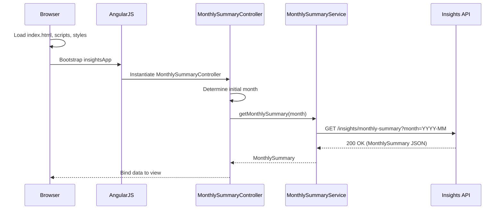
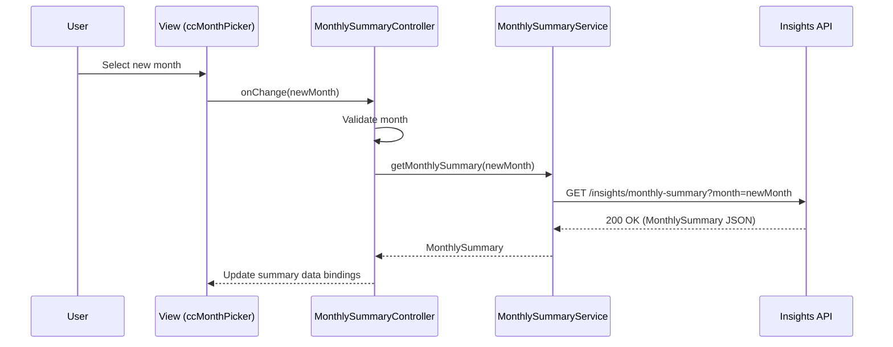
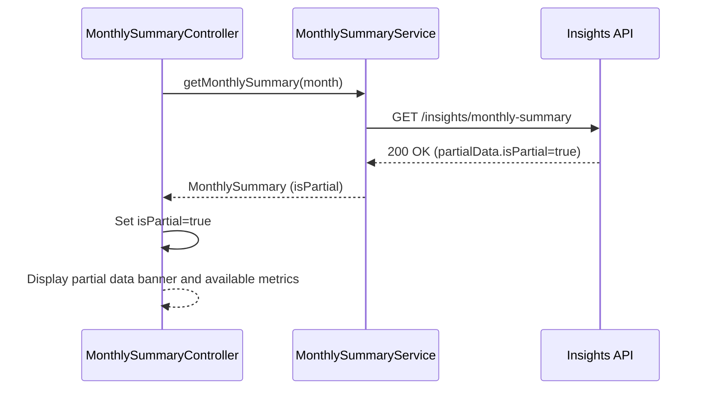
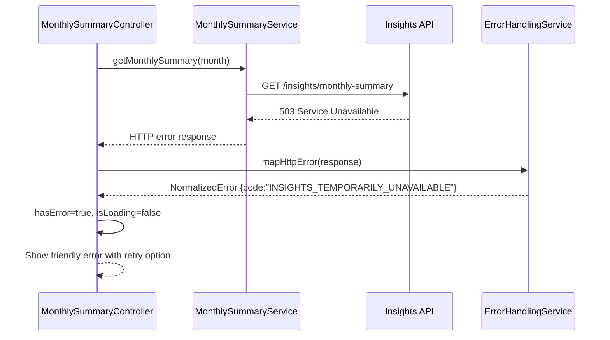

# QE-3165 – Monthly Credit Card Spend Summary Dashboard

## 1. Application Architecture

### 1.1 Overall Architecture

The "Monthly Credit Card Spend Summary Dashboard" is a single-page application (SPA) built with AngularJS 1.x, JavaScript ES6, HTML5, CSS3, and Bootstrap. It consumes REST APIs exposed by the Insights Application Service (AS) via an API Gateway (AG). The frontend strictly adheres to MVC using AngularJS modules, controllers, services, and directives.

Key characteristics:
- SPA with client-side routing for the Monthly Insights area.
- Stateless RESTful integration with backend.
- Strong separation of concerns between presentation, business orchestration, and data access.
- Enterprise-grade security and resiliency patterns implemented in the client where applicable (input validation, error handling, telemetry).

### 1.2 AngularJS MVC Mapping

**Modules**
- `insightsApp` – Root AngularJS application module.
- `insights.core` – Core cross-cutting concerns (configuration, logging, interceptors, constants).
- `insights.dashboard` – Monthly spend dashboard feature module.
- `insights.shared` – Shared directives, filters, and reusable UI components.

**Controllers**
- `MonthlySummaryController` – Orchestrates the monthly summary dashboard view.

**Services/Factories**
- `ConfigService` – Provides environment configuration (API base URL, feature flags).
- `AuthContextService` – Holds current user, roles, consent status (as provided by backend/IDP).
- `MonthlySummaryService` – Communicates with Insights API for monthly summaries.
- `TelemetryService` – Client-side logging/metrics (page views, errors, performance marks).
- `ErrorHandlingService` – Centralized client error mapping and user-facing messages.
- `DateValidationService` – Business-friendly validation for month selection.

**Directives / Components**
- `ccMonthPicker` – Month selection component.
- `ccSummaryCards` – Summary cards for total spend, transaction count, additional KPIs.
- `ccCategoryBreakdownChart` – Category breakdown visualization (chart or table).
- `ccInlineAlert` – Standardized alert component for info/warning/error/empty states.
- `ccLoadingSpinner` – Reusable loading indicator.

**Filters**
- `currencySafe` – Formats currency values safely with locale and masking options.
- `percentageSafe` – Formats numeric fractions as percentages.
- `monthLabel` – Converts YYYY-MM to human-readable month label.

### 1.3 Project Folder Structure

Only `HLD` and `LLD` exist outside `src`. All implementation artifacts are under `src`.

```text
APB_Demo/
  HLD/
    QE-3165_HLD.md
  LLD/
    QE-3165_LLD.md
  src/
    index.html
    app.js
    assets/
      css/
        main.css
      img/
        ...
    core/
      core.module.js
      config/
        env.config.js
        routes.config.js
        http-interceptor.config.js
        logging.config.js
      services/
        config.service.js
        auth-context.service.js
        telemetry.service.js
        error-handling.service.js
        date-validation.service.js
      constants/
        app.constants.js
    dashboard/
      dashboard.module.js
      controllers/
        monthly-summary.controller.js
      services/
        monthly-summary.service.js
      directives/
        cc-month-picker.directive.js
        cc-summary-cards.directive.js
        cc-category-breakdown-chart.directive.js
        cc-inline-alert.directive.js
        cc-loading-spinner.directive.js
      views/
        monthly-summary.html
    shared/
      shared.module.js
      filters/
        currency-safe.filter.js
        percentage-safe.filter.js
        month-label.filter.js
      directives/
        focus-on-load.directive.js
        tooltip.directive.js
    tests/
      unit/
        core/
        dashboard/
        shared/
      e2e/
        dashboard/
```

## 2. Component Specifications

### 2.1 `insightsApp` (Root Module)

- **Type:** AngularJS module
- **File:** `src/app.js`
- **Responsibility:**
  - Bootstrap the AngularJS application.
  - Declare dependencies on feature and core modules.
- **Public API:** N/A (module definition only).
- **Dependencies:**
  - `ngRoute`, `ngAnimate`, `ngSanitize`.
  - `insights.core`, `insights.dashboard`, `insights.shared`.

### 2.2 `insights.core` Module

- **File:** `src/core/core.module.js`
- **Responsibility:**
  - Registers core services, configuration blocks, and HTTP interceptors.

#### 2.2.1 `ConfigService`

- **Type:** Service (`service`)
- **File:** `src/core/services/config.service.js`
- **Responsibility:**
  - Expose environment-dependent configuration values: API base URLs, feature flags, logging levels.
- **Public Methods:**
  - `getApiBaseUrl(): string`
  - `getFeatureFlags(): Object`
  - `getLoggingConfig(): Object`
- **Inputs/Outputs:**
  - Inputs: None at runtime (reads from constants/env config).
  - Outputs: Plain objects or strings with configuration values.
- **Dependencies:**
  - `APP_ENV_CONFIG` constant.

#### 2.2.2 `AuthContextService`

- **Type:** Service
- **File:** `src/core/services/auth-context.service.js`
- **Responsibility:**
  - Maintain client-side representation of authenticated user and consent status.
  - Expose roles and attributes needed for conditional UI rendering.
- **Public Methods:**
  - `setContext(context: AuthContext): void`
  - `getContext(): AuthContext`
  - `hasRole(role: string): boolean`
  - `hasConsent(scope: string): boolean`
- **Inputs/Outputs:**
  - Inputs: Auth context object (from backend/session bootstrap endpoint or ID token decoding).
  - Outputs: Current context and predicate results.
- **Dependencies:** None (may use `$window` for storage if required).

#### 2.2.3 `TelemetryService`

- **Type:** Service
- **File:** `src/core/services/telemetry.service.js`
- **Responsibility:**
  - Client-side telemetry (page views, API timings, error logging) for MON.
- **Public Methods:**
  - `trackPageView(pageName: string, properties?: Object): void`
  - `trackEvent(name: string, properties?: Object): void`
  - `trackError(error: Error|Object, context?: Object): void`
  - `trackMetric(name: string, value: number, properties?: Object): void`
- **Dependencies:**
  - `$http` (optional, if sending logs to a telemetry endpoint).
  - `ConfigService` (telemetry endpoint URL).

#### 2.2.4 `ErrorHandlingService`

- **Type:** Service
- **File:** `src/core/services/error-handling.service.js`
- **Responsibility:**
  - Normalize backend errors into user-friendly messages.
  - Provide guidance for retry vs hard-fail.
- **Public Methods:**
  - `mapHttpError(response): NormalizedError`
- **Inputs/Outputs:**
  - Input: `$http` error response object.
  - Output: `{ code: string, message: string, severity: 'info'|'warning'|'error', retryable: boolean }`.
- **Dependencies:** None.

#### 2.2.5 `DateValidationService`

- **Type:** Service
- **File:** `src/core/services/date-validation.service.js`
- **Responsibility:**
  - Validate month selection according to backend rules (format, range, not in future, allowed history).
- **Public Methods:**
  - `isValidMonth(month: string): boolean` (expects `YYYY-MM`).
  - `getValidationError(month: string): string|null`.
  - `getAllowedRange(): { minMonth: string, maxMonth: string }`.
- **Dependencies:**
  - `ConfigService` (for configurable min history months).

#### 2.2.6 HTTP Interceptor (`InsightsHttpInterceptor`)

- **Type:** Factory/interceptor
- **File:** `src/core/config/http-interceptor.config.js`
- **Responsibility:**
  - Attach bearer token to outgoing API requests.
  - Attach correlation ID headers for tracing.
  - Centralized handling of 401/403/5xx responses.
- **Public Methods:**
  - Implements `$httpProvider.interceptors` interface: `request`, `response`, `responseError`.
- **Dependencies:**
  - `$q`, `$injector`, `TelemetryService`, `AuthContextService`.

### 2.3 `insights.dashboard` Module

- **File:** `src/dashboard/dashboard.module.js`
- **Responsibility:**
  - Encapsulate all monthly dashboard-related artifacts.

#### 2.3.1 `MonthlySummaryController`

- **Type:** Controller
- **File:** `src/dashboard/controllers/monthly-summary.controller.js`
- **Responsibility:**
  - Control the Monthly Summary dashboard view.
  - Bind UI elements (month picker, summary cards, charts) to the data model.
  - Manage loading, error, empty, and partial-data states.
- **Scope/ViewModel Properties (via `controllerAs vm`):**
  - `vm.selectedMonth: string` – Currently selected month in `YYYY-MM`.
  - `vm.summary: MonthlySummary | null` – Current summary data.
  - `vm.isLoading: boolean` – Indicates API call in progress.
  - `vm.hasError: boolean` – Indicates error state.
  - `vm.error: NormalizedError | null` – Error details for UI.
  - `vm.isEmpty: boolean` – Indicates no data returned (e.g., no transactions).
  - `vm.isPartial: boolean` – Indicates partial data (e.g., no category breakdown).
  - `vm.loadSummary(month?: string): void` – Public method for UI/child directives to trigger load.
- **Dependencies:**
  - `MonthlySummaryService`, `TelemetryService`, `ErrorHandlingService`, `DateValidationService`, `$location` (optional for query param handling).

#### 2.3.2 `MonthlySummaryService`

- **Type:** Service
- **File:** `src/dashboard/services/monthly-summary.service.js`
- **Responsibility:**
  - Communicate with backend REST APIs for monthly summary retrieval.
  - Encapsulate endpoint URLs and response mapping to frontend models.
- **Public Methods:**
  - `getMonthlySummary(month: string): Promise<MonthlySummary>`
- **Inputs/Outputs:**
  - Input: `month` parameter as `YYYY-MM`.
  - Output: Promise resolving to `MonthlySummary` object.
- **Dependencies:**
  - `$http`, `$q`, `ConfigService`.

### 2.4 `insights.shared` Module

- **File:** `src/shared/shared.module.js`

#### 2.4.1 `ccMonthPicker` Directive

- **Type:** Directive (component-style)
- **File:** `src/dashboard/directives/cc-month-picker.directive.js`
- **Responsibility:**
  - Render a month selection control compliant with accessibility and validation rules.
  - Expose selected month to parent controller via `ngModel`-like binding and change events.
- **Bindings (isolate scope):**
  - `ngModel: '='` – bound month (`YYYY-MM`).
  - `minMonth: '@?'` – earliest selectable month.
  - `maxMonth: '@?'` – latest selectable month.
  - `onChange: '&?'` – callback invoked when month changes.
- **Public API:**
  - Internal controller handles formatting and conversion between input type="month" and internal model.
- **Dependencies:**
  - `DateValidationService`.

#### 2.4.2 `ccSummaryCards` Directive

- **Type:** Directive
- **File:** `src/dashboard/directives/cc-summary-cards.directive.js`
- **Responsibility:**
  - Render summary KPI cards (total spend, transaction count, avg transaction, etc.).
- **Bindings:**
  - `summary: '<'` – `MonthlySummary` object.
  - `isPartial: '<'` – indicates partial data.
- **Dependencies:**
  - None directly (uses `currencySafe` filter).

#### 2.4.3 `ccCategoryBreakdownChart` Directive

- **Type:** Directive
- **File:** `src/dashboard/directives/cc-category-breakdown-chart.directive.js`
- **Responsibility:**
  - Display category breakdown using a chart (e.g., donut/bar) and accessible table.
- **Bindings:**
  - `categories: '<'` – Array of `CategoryBreakdown`.
  - `isPartial: '<'` – indicates fallback/limited view.
- **Dependencies:**
  - May integrate with a JS chart library (e.g., Chart.js) loaded via script tag.

#### 2.4.4 `ccInlineAlert` Directive

- **Type:** Directive
- **File:** `src/dashboard/directives/cc-inline-alert.directive.js`
- **Responsibility:**
  - Render standardized Bootstrap-based alert banners.
- **Bindings:**
  - `type: '@'` – `info|warning|danger|success`.
  - `message: '@'` – primary text.
  - `details: '@?'` – optional extended information.
  - `dismissible: '@?'` – whether alert can be closed.

#### 2.4.5 `ccLoadingSpinner` Directive

- **Type:** Directive
- **File:** `src/dashboard/directives/cc-loading-spinner.directive.js`
- **Responsibility:**
  - Display a centered spinner with optional label.
- **Bindings:**
  - `visible: '<'` – controls display.
  - `label: '@?'` – optional text.

#### 2.4.6 Filters

- **`currencySafe` Filter**
  - **File:** `src/shared/filters/currency-safe.filter.js`
  - **Input:** number (amount), currency code, locale.
  - **Output:** localized formatted currency string.

- **`percentageSafe` Filter**
  - **File:** `src/shared/filters/percentage-safe.filter.js`
  - **Input:** number between 0 and 1 or 0-100.
  - **Output:** percentage string with fixed decimal places.

- **`monthLabel` Filter**
  - **File:** `src/shared/filters/month-label.filter.js`
  - **Input:** `YYYY-MM` string.
  - **Output:** `"May 2026"` style label.

## 3. Component Responsibilities and Ownership

### 3.1 Presentation Layer (Views + Directives)

- HTML templates (`monthly-summary.html`) define layout using Bootstrap grid.
- Directives own encapsulated UI behavior:
  - `ccMonthPicker` – Input gathering and validation feedback.
  - `ccSummaryCards` – Presentation of KPI values without business logic.
  - `ccCategoryBreakdownChart` – Chart rendering and accessibility support.
  - `ccInlineAlert`, `ccLoadingSpinner` – Generic visual components.

Business logic (e.g., whether data is partial, what constitutes empty state) resides in `MonthlySummaryController` and services.

### 3.2 State Management

- The application is stateless across page reloads, with state kept in the controller:
  - Selected month is reflected in the URL query string for deep linking (`?month=YYYY-MM`).
  - Controller initializes state from URL or defaults to the latest allowed month.

### 3.3 API Communication

- All REST calls are made by `MonthlySummaryService`.
- `MonthlySummaryController` never calls `$http` directly.
- Errors and retry hints are returned to the controller as normalized errors.

### 3.4 Validation Ownership

- `DateValidationService`: technical validation (format, range).
- `MonthlySummaryController`: view-level validation handling and displaying messages.
- Directive-level validation for UX (input constraints, ARIA attributes).

## 4. Interface Specifications

### 4.1 REST API Interface – Monthly Summary

**Endpoint**
- `GET /insights/monthly-summary`

**Query Parameters**
- `month` (required): `YYYY-MM` string.

**Headers**
- `Authorization: Bearer <jwt>` – provided by IDP and enforced by AG.
- `X-Correlation-Id: <uuid>` – generated client-side or provided by gateway.

**Request Example**
```http
GET /insights/monthly-summary?month=2026-05 HTTP/1.1
Host: api.example.com
Authorization: Bearer eyJhbGciOi...
X-Correlation-Id: 123e4567-e89b-12d3-a456-426614174000
Accept: application/json
```

**Successful Response (200)**
```json
{
  "month": "2026-05",
  "currency": "USD",
  "totalSpend": 1234.56,
  "transactionCount": 42,
  "averageTransactionAmount": 29.39,
  "hasCategoryBreakdown": true,
  "categories": [
    { "code": "GROCERIES", "label": "Groceries", "amount": 300.50, "percentage": 24.35 },
    { "code": "TRAVEL", "label": "Travel", "amount": 200.00, "percentage": 16.20 },
    { "code": "OTHER", "label": "Other", "amount": 734.06, "percentage": 59.45 }
  ],
  "dataFreshness": {
    "computedAt": "2026-05-31T23:59:59Z",
    "source": "ISD_PRECOMPUTED",
    "isStale": false
  },
  "consent": {
    "consentId": "CONS-12345",
    "status": "GRANTED"
  },
  "partialData": {
    "isPartial": false,
    "reason": null
  }
}
```

**Empty Response (200, No Transactions)**
```json
{
  "month": "2026-05",
  "currency": "USD",
  "totalSpend": 0,
  "transactionCount": 0,
  "categories": [],
  "hasCategoryBreakdown": false,
  "partialData": { "isPartial": false, "reason": null }
}
```

**Partial Data Response (e.g., CLS unavailable)**
```json
{
  "month": "2026-05",
  "currency": "USD",
  "totalSpend": 1234.56,
  "transactionCount": 42,
  "hasCategoryBreakdown": false,
  "categories": [],
  "partialData": {
    "isPartial": true,
    "reason": "CATEGORY_SERVICE_UNAVAILABLE"
  }
}
```

**Error Responses**

- `400 Bad Request`
  - Condition: invalid month format, month out of allowed range.
  - Body:
    ```json
    {
      "errorCode": "INVALID_MONTH",
      "message": "Month must be in YYYY-MM format and within the last 36 months.",
      "details": {
        "field": "month"
      }
    }
    ```

- `401 Unauthorized`
  - Invalid or missing token.

- `403 Forbidden`
  - Consent not granted or RBAC/ABAC denies access.
  - Body:
    ```json
    {
      "errorCode": "CONSENT_REQUIRED",
      "message": "You must grant consent to view spending insights.",
      "details": {}
    }
    ```

- `404 Not Found`
  - No summary and no transactions for the month; could also use `200` with empty summary depending on backend contract. Client must handle both gracefully.

- `503 Service Unavailable`
  - Downstream system failures (CCD, AR, CLS, CM).
  - Body:
    ```json
    {
      "errorCode": "INSIGHTS_TEMPORARILY_UNAVAILABLE",
      "message": "Spending insights are temporarily unavailable. Please try again later.",
      "details": {
        "correlationId": "123e4567-e89b-12d3-a456-426614174000"
      }
    }
    ```

### 4.2 Internal Interfaces (Controller ↔ Services ↔ Directives)

- `MonthlySummaryController` calls `MonthlySummaryService.getMonthlySummary(month)`.
- Directives interact via one-way bindings and callbacks; they never call services directly.
- Error and telemetry services are injected into the controller; directives expose events (`onChange`) that the controller handles.

## 5. Data Model Design

### 5.1 `MonthlySummary` Model

- **Object Name:** `MonthlySummary`
- **Type:** Plain JavaScript object (POJO).

```js
/**
 * @typedef {Object} MonthlySummary
 * @property {string} month             // 'YYYY-MM'
 * @property {string} currency          // ISO 4217 currency code
 * @property {number} totalSpend        // total spend for the month
 * @property {number} transactionCount  // number of transactions
 * @property {number} [averageTransactionAmount]
 * @property {boolean} hasCategoryBreakdown
 * @property {CategoryBreakdown[]} categories
 * @property {DataFreshness} [dataFreshness]
 * @property {ConsentInfo} [consent]
 * @property {PartialDataInfo} [partialData]
 */
```

- **Attributes and Types:**
  - `month: string` – required; must match `^\d{4}-(0[1-9]|1[0-2])$`.
  - `currency: string` – required, 3-letter upper-case.
  - `totalSpend: number` – default `0`.
  - `transactionCount: number` – default `0`.
  - `averageTransactionAmount: number` – optional; computed as `totalSpend / transactionCount` on backend.
  - `hasCategoryBreakdown: boolean` – default `false`.
  - `categories: CategoryBreakdown[]` – default `[]`.
  - `dataFreshness: DataFreshness` – optional; if absent, UI indicates unknown freshness.
  - `consent: ConsentInfo` – optional; if absent, UI assumes consent is not granted or not applicable.
  - `partialData: PartialDataInfo` – default `{ isPartial: false, reason: null }`.

- **Validation Rules:**
  - `month` must pass `DateValidationService.isValidMonth`.
  - `totalSpend >= 0`.
  - `transactionCount >= 0`.
  - If `hasCategoryBreakdown === true`, `categories.length > 0`.

### 5.2 `CategoryBreakdown` Model

```js
/**
 * @typedef {Object} CategoryBreakdown
 * @property {string} code        // backend category code
 * @property {string} label       // localized display name
 * @property {number} amount      // total spend in this category
 * @property {number} percentage  // percentage of total spend
 */
```

- **Validation Rules:**
  - `amount >= 0`.
  - `percentage >= 0` and `percentage <= 100`.

### 5.3 `DataFreshness` Model

```js
/**
 * @typedef {Object} DataFreshness
 * @property {string} computedAt  // ISO 8601 timestamp
 * @property {string} source      // e.g., 'ISD_PRECOMPUTED', 'ON_THE_FLY'
 * @property {boolean} isStale
 */
```

### 5.4 `ConsentInfo` Model

```js
/**
 * @typedef {Object} ConsentInfo
 * @property {string} consentId
 * @property {string} status      // 'GRANTED' | 'REVOKED' | 'UNKNOWN'
 */
```

### 5.5 `PartialDataInfo` Model

```js
/**
 * @typedef {Object} PartialDataInfo
 * @property {boolean} isPartial
 * @property {string|null} reason  // 'CATEGORY_SERVICE_UNAVAILABLE', etc.
 */
```

### 5.6 `NormalizedError` Model

```js
/**
 * @typedef {Object} NormalizedError
 * @property {string} code
 * @property {string} message
 * @property {'info'|'warning'|'error'} severity
 * @property {boolean} retryable
 */
```

## 6. Data Flow

### 6.1 Main Flow: User Loads Monthly Summary

1. **User Action**
   - User navigates to "Monthly Spend Insights" page.
   - Browser loads `index.html` and AngularJS bootstrap occurs.

2. **View Initialization**
   - Route `/dashboard/monthly` loads `monthly-summary.html` and instantiates `MonthlySummaryController`.
   - Controller determines the initial `selectedMonth`:
     - If query parameter `month` present and valid → use it.
     - Else → use `DateValidationService.getAllowedRange().maxMonth`.
   - Controller calls `loadSummary(selectedMonth)`.

3. **Controller → Service**
   - `MonthlySummaryController.loadSummary`:
     - Validates month; if invalid, sets `hasError=true`, `error.code='CLIENT_VALIDATION'` and aborts.
     - Sets `isLoading=true`, `hasError=false`, `isEmpty=false`, `isPartial=false`.
     - Calls `MonthlySummaryService.getMonthlySummary(month)`.
     - Calls `TelemetryService.trackEvent('MonthlySummaryRequested', { month })`.

4. **Service → API**
   - `MonthlySummaryService`:
     - Constructs URL: `ConfigService.getApiBaseUrl() + '/insights/monthly-summary'`.
     - Calls `$http.get(url, { params: { month } })`.
     - HTTP interceptor attaches auth token and correlation ID.

5. **API → Service**
   - On success (200):
     - Service maps API JSON to `MonthlySummary` model.
     - Returns Promise resolved with `MonthlySummary`.
   - On error (4xx/5xx):
     - Service rejects Promise with HTTP response.

6. **Service → Controller**
   - On success:
     - Controller assigns `vm.summary = data`.
     - Sets `isLoading=false`.
     - Sets `isEmpty = (data.transactionCount === 0)`.
     - Sets `isPartial = data.partialData && data.partialData.isPartial`.
     - Calls `TelemetryService.trackEvent('MonthlySummaryLoaded', { month, isPartial, isEmpty })`.
   - On error:
     - Controller uses `ErrorHandlingService.mapHttpError(response)` to get `NormalizedError`.
     - Sets `hasError=true`, `error=normalized`.
     - Sets `isLoading=false`.
     - Calls `TelemetryService.trackError(response, { month })`.

7. **UI Update**
   - `monthly-summary.html` uses `ng-if` / `ng-show` to toggle between loading spinner, error state, empty state, partial data notice, and full view.
   - Child directives (`ccSummaryCards`, `ccCategoryBreakdownChart`) receive updated bindings and re-render.

### 6.2 State Changes and Event Handling

- Change of month in `ccMonthPicker` triggers `onChange` callback:
  - Controller updates URL query string.
  - Controller calls `loadSummary(newMonth)`.
- Error state persists until user changes month or presses a Retry button (bound to `loadSummary(selectedMonth)`).

## 7. Sequence Diagrams (Mermaid)

### 7.1 Application Initialization



### 7.2 Primary User Workflow – Change Month



### 7.3 Service/API Interaction with Partial Data



### 7.4 Error Handling Scenario – Backend Unavailable



## 8. Implementation Details

### 8.1 AngularJS Implementation Approach

- Use module pattern with `angular.module('insights.dashboard', [])` and chaining for configuration.
- Use `controllerAs` syntax with `vm` alias to avoid `$scope` where possible.
- Directives built as components with `bindToController` and `controllerAs` for cleaner APIs.

### 8.2 JavaScript ES6 Coding Patterns

- Use `const` and `let` for variable declarations.
- Use arrow functions where appropriate (not for AngularJS DI-annotated functions to avoid `this` issues).
- Use modular structure per file.

Example (`monthly-summary.service.js`):

```js
(function() {
  'use strict';

  angular
    .module('insights.dashboard')
    .service('MonthlySummaryService', MonthlySummaryService);

  MonthlySummaryService.$inject = ['$http', '$q', 'ConfigService'];

  function MonthlySummaryService($http, $q, ConfigService) {
    const API_BASE = ConfigService.getApiBaseUrl();

    this.getMonthlySummary = function(month) {
      const deferred = $q.defer();

      $http.get(`${API_BASE}/insights/monthly-summary`, { params: { month } })
        .then(response => {
          deferred.resolve(mapToMonthlySummary(response.data));
        })
        .catch(error => {
          deferred.reject(error);
        });

      return deferred.promise;
    };

    function mapToMonthlySummary(dto) {
      return {
        month: dto.month,
        currency: dto.currency,
        totalSpend: dto.totalSpend || 0,
        transactionCount: dto.transactionCount || 0,
        averageTransactionAmount: dto.averageTransactionAmount,
        hasCategoryBreakdown: !!dto.hasCategoryBreakdown,
        categories: dto.categories || [],
        dataFreshness: dto.dataFreshness || null,
        consent: dto.consent || null,
        partialData: dto.partialData || { isPartial: false, reason: null }
      };
    }
  }
})();
```

### 8.3 Dependency Injection

- All services, controllers, and directives must declare `$inject` arrays to support minification.
- Interceptors are registered in `config` blocks using `$httpProvider.interceptors.push('InsightsHttpInterceptor');`.

### 8.4 Business Logic Flow

- Business rules such as inclusion of posted transactions, treatment of refunds, etc., are **not implemented on the client**; the frontend trusts backend computations.
- Client-side logic focuses on:
  - Input validation (month format/range).
  - Determining which UI variant to render (empty, partial, full).
  - Displaying freshness status and consent-related messaging.

### 8.5 Validation Logic

- `DateValidationService` uses regex and range checks:

```js
const MONTH_REGEX = /^\d{4}-(0[1-9]|1[0-2])$/;
```

- Range:
  - `minMonth` and `maxMonth` configured via env (e.g., last 36 months vs today).
- UI-level constraints:
  - `<input type="month">` with `min` and `max` attributes set from allowed range.
  - Inline validation messages under the picker using `aria-live="polite"`.

### 8.6 State Management Approach

- No global state library; use route + controller state.
- Share state between directives and controller via bindings only.
- Persist last selected month in query string; optionally in `sessionStorage` as fallback.

### 8.7 DOM Interaction

- DOM manipulation done via AngularJS data binding and directives.
- No direct DOM manipulation with `document.querySelector` except within directive link functions for non-standard behaviors (kept minimal).
- Use Bootstrap classes for styling and layout; prefer CSS classes over inline styles.

### 8.8 API Integration Approach

- All API base URLs obtained from `ConfigService` to allow environment switching.
- Client does not handle retries; retries and circuit breakers are backend responsibilities. Client only exposes retry UI actions.
- `TelemetryService` records latency using timestamps around API calls if required.

## 9. Configuration

### 9.1 AngularJS Configuration Files

- `src/core/config/env.config.js`
  - Declares `APP_ENV_CONFIG` constant with per-env overrides:

```js
angular
  .module('insights.core')
  .constant('APP_ENV_CONFIG', {
    apiBaseUrl: 'https://api.example.com',
    telemetryEndpoint: 'https://telemetry.example.com',
    allowedHistoryMonths: 36,
    loggingLevel: 'INFO',
    featureFlags: {
      showAverageTransaction: true,
      enableCategoryChart: true
    }
  });
```

- `src/core/config/routes.config.js`
  - Configures routes for the dashboard.

```js
angular
  .module('insightsApp')
  .config(['$routeProvider', function($routeProvider) {
    $routeProvider
      .when('/dashboard/monthly', {
        templateUrl: 'dashboard/views/monthly-summary.html',
        controller: 'MonthlySummaryController',
        controllerAs: 'vm'
      })
      .otherwise({ redirectTo: '/dashboard/monthly' });
  }]);
```

- `src/core/config/http-interceptor.config.js`
  - Registers HTTP interceptor.

### 9.2 Environment-Specific Properties

- API base URL, telemetry endpoint, min/max months, logging level, and feature flags vary by environment (dev, test, prod).
- Deployment pipeline injects correct `APP_ENV_CONFIG` via build-time replacement or separate config bundle.

### 9.3 API Base URLs

- All endpoints must be built off `ConfigService.getApiBaseUrl()`.

### 9.4 Feature Flags

- `showAverageTransaction` – toggles display of average transaction card.
- `enableCategoryChart` – toggles chart rendering; if disabled, show tabular view only.

### 9.5 Logging and Telemetry Configuration

- Logging level controls verbosity of `TelemetryService` (e.g., info, debug).
- Telemetry endpoint can be disabled in non-prod by setting it to `null` or using feature flags.

## 10. Error Handling and Resiliency

### 10.1 Client-Side Exception Handling

- Global `$exceptionHandler` configured to:
  - Log error via `TelemetryService.trackError`.
  - Optionally show a generic toast for unrecoverable errors.

### 10.2 REST API Error Handling

- `ErrorHandlingService.mapHttpError` converts HTTP errors:
  - `400 INVALID_MONTH` → user-facing message about invalid month.
  - `403 CONSENT_REQUIRED` → show consent-related message and link to consent management page (if available).
  - `503 INSIGHTS_TEMPORARILY_UNAVAILABLE` → display retry suggestion.

### 10.3 Retry Mechanisms

- Client does not auto-retry; instead it:
  - Presents a Retry button on error state.
  - On user click: re-invokes `loadSummary(selectedMonth)`.

### 10.4 Logging Strategy

- Each API call logs events:
  - `MonthlySummaryRequested`, `MonthlySummaryLoaded`, `MonthlySummaryFailed`.
- Errors include `month`, `httpStatus`, and `errorCode` (if provided) but **never** include sensitive data.

### 10.5 Recovery and Fallback Behavior

- If category breakdown is unavailable (`hasCategoryBreakdown=false` and `partialData.isPartial=true`):
  - UI still shows total spend and transaction count.
  - Display banner: "Some insights are temporarily unavailable. We are showing limited information."
- If no data (transactionCount === 0):
  - Show empty state card with guidance.

## 11. Security Considerations

### 11.1 Input Validation and Sanitization

- Only user-provided input is the `month` parameter:
  - Validated on client via `DateValidationService` before API call.
  - UI prevents invalid months via min/max attributes.
- Any dynamically inserted text is bound using AngularJS expressions, which automatically escape HTML to mitigate XSS.

### 11.2 XSS Prevention

- No use of `ng-bind-html` unless strictly necessary.
- Any HTML from backend (if ever introduced) must be sanitized using `$sanitize`.
- Strict Content Security Policy (CSP) recommended at HTTP headers.

### 11.3 CSRF Protection

- Primary authentication and authorization is via JWT Bearer token, which is stored in a secure context by the host platform (not handled directly here).
- For state-changing requests (none in this epic), CSRF tokens would be included; not applicable for this read-only dashboard but framework support must be kept ready.

### 11.4 Secure API Communication

- All API calls use `https://` URLs (TLS 1.2/1.3).
- API Gateway handles token validation, RBAC; client ensures tokens are attached via interceptor only.

### 11.5 Authentication and Authorization Integration Points

- `AuthContextService` can be initialized from a bootstrap endpoint (`GET /session/context`) that returns user roles and consent scopes.
- UI elements (e.g., insights page link) may be hidden if user lacks `consumer_cc_insights:view` role.

### 11.6 Sensitive Data Handling

- Client only processes aggregated, non-PII-heavy data:
  - No PAN, CVV, or other sensitive card data in responses.
- Telemetry never logs transaction-level details.

### 11.7 Audit Logging Approach (Client Perspective)

- Backend `AUD` service handles formal audit logs; client ensures correlation IDs are propagated.
- When available from gateway, the client reads correlation ID from response headers for debugging; not persisted.

## 12. Presentation Layer Design

### 12.1 Screen: Monthly Spend Summary Dashboard

**Route:** `/dashboard/monthly`

**Template:** `src/dashboard/views/monthly-summary.html`

#### 12.1.1 Page Layout

- Top-level container: `.container-fluid`.
- Layout structure:

```html
<div class="container-fluid monthly-summary" ng-controller="MonthlySummaryController as vm">
  <div class="row">
    <div class="col-xs-12 col-sm-8">
      <h1 class="page-title">Monthly credit card spend</h1>
      <p class="text-muted">View total spend, transactions, and category breakdowns.</p>
    </div>
    <div class="col-xs-12 col-sm-4 text-sm-right">
      <cc-month-picker
        ng-model="vm.selectedMonth"
        min-month="{{vm.allowedRange.minMonth}}"
        max-month="{{vm.allowedRange.maxMonth}}"
        on-change="vm.onMonthChanged(month)">
      </cc-month-picker>
    </div>
  </div>

  <div class="row" ng-if="vm.isLoading">
    <div class="col-xs-12 text-center">
      <cc-loading-spinner visible="vm.isLoading" label="Loading monthly insights..."></cc-loading-spinner>
    </div>
  </div>

  <div class="row" ng-if="vm.hasError">
    <div class="col-xs-12">
      <cc-inline-alert type="danger"
                       message="{{vm.error.message}}"
                       details=""
                       dismissible="false"></cc-inline-alert>
      <button class="btn btn-primary" ng-click="vm.loadSummary(vm.selectedMonth)">Retry</button>
    </div>
  </div>

  <div class="row" ng-if="!vm.isLoading && !vm.hasError && vm.isEmpty">
    <div class="col-xs-12">
      <cc-inline-alert type="info"
                       message="No credit card transactions found for this month."
                       details="Try selecting a different month or check back later."
                       dismissible="false"></cc-inline-alert>
    </div>
  </div>

  <div class="row" ng-if="!vm.isLoading && !vm.hasError && !vm.isEmpty">
    <div class="col-xs-12">
      <cc-summary-cards summary="vm.summary" is-partial="vm.isPartial"></cc-summary-cards>
    </div>
  </div>

  <div class="row" ng-if="!vm.isLoading && !vm.hasError && !vm.isEmpty">
    <div class="col-xs-12">
      <cc-category-breakdown-chart
        categories="vm.summary.categories"
        is-partial="vm.isPartial"></cc-category-breakdown-chart>
    </div>
  </div>
</div>
```

#### 12.1.2 Navigation

- Accessed from global navigation menu under "Insights".
- Breadcrumb: `Home / Insights / Monthly credit card spend`.
- Month query parameter preserved when navigating back to this page.

#### 12.1.3 Responsive Behavior

- On desktop (>992px):
  - Month picker aligned right of header text.
  - Summary cards laid out in a 3 or 4-column grid.
  - Chart and table side-by-side where width allows.
- On tablet (768–991px):
  - Month picker below title.
  - Summary cards in 2-column grid.
- On mobile (<768px):
  - Stacked layout, full-width elements.
  - Chart scaled to viewport width.
  - Use vertical spacing between sections.

#### 12.1.4 Component Hierarchy

- `MonthlySummaryController`
  - `ccMonthPicker`
  - `ccLoadingSpinner`
  - `ccInlineAlert`
  - `ccSummaryCards`
  - `ccCategoryBreakdownChart`

#### 12.1.5 Reusable UI Components

- `ccMonthPicker` can be reused for other insights pages.
- `ccSummaryCards` accepts generic KPI definitions (extensible in future epics).
- `ccInlineAlert` used across application for uniform messaging.

#### 12.1.6 Charts/Tables/Forms

- **Month Picker Form:**
  - Uses `<input type="month">` wrapped in `ccMonthPicker`.
  - Validation messages shown under the control when invalid.

- **Summary Cards:**
  - Cards include:
    - Total Spend – formatted with `currencySafe`.
    - Number of Transactions – integer.
    - Optional: Average Transaction Amount (feature-flagged).
  - Implementation example (inside directive template):

```html
<div class="row summary-cards">
  <div class="col-xs-12 col-sm-4">
    <div class="panel panel-default">
      <div class="panel-heading">Total spend</div>
      <div class="panel-body">
        <span class="summary-value">{{ $ctrl.summary.totalSpend | currencySafe:$ctrl.summary.currency }}</span>
      </div>
    </div>
  </div>
  <div class="col-xs-12 col-sm-4">
    <div class="panel panel-default">
      <div class="panel-heading">Transactions</div>
      <div class="panel-body">
        <span class="summary-value">{{ $ctrl.summary.transactionCount }}</span>
      </div>
    </div>
  </div>
  <div class="col-xs-12 col-sm-4" ng-if="$ctrl.showAverageTransaction">
    <div class="panel panel-default">
      <div class="panel-heading">Average transaction</div>
      <div class="panel-body">
        <span class="summary-value">{{ $ctrl.summary.averageTransactionAmount | currencySafe:$ctrl.summary.currency }}</span>
      </div>
    </div>
  </div>
</div>
```

- **Category Breakdown Chart:**
  - Chart.js donut chart plus accessible table:

```html
<div class="category-breakdown">
  <div class="row">
    <div class="col-xs-12 col-md-6">
      <canvas id="categoryChart" aria-label="Category breakdown chart" role="img"></canvas>
    </div>
    <div class="col-xs-12 col-md-6">
      <table class="table table-striped" aria-label="Category breakdown table">
        <thead>
          <tr>
            <th scope="col">Category</th>
            <th scope="col" class="text-right">Amount</th>
            <th scope="col" class="text-right">% of spend</th>
          </tr>
        </thead>
        <tbody>
          <tr ng-repeat="c in $ctrl.categories">
            <td>{{ c.label }}</td>
            <td class="text-right">{{ c.amount | currencySafe:$ctrl.currency }}</td>
            <td class="text-right">{{ c.percentage | percentageSafe }}</td>
          </tr>
        </tbody>
      </table>
    </div>
  </div>
  <cc-inline-alert ng-if="$ctrl.isPartial"
                   type="warning"
                   message="Some categories could not be loaded. Showing partial data."
                   dismissible="false"></cc-inline-alert>
</div>
```

#### 12.1.7 Styling Guidelines and Design Tokens

- Define CSS variables or LESS/SASS variables for:
  - Colors:
    - `--color-primary`: brand blue.
    - `--color-accent`: brand green.
    - `--color-warning`: amber.
    - `--color-danger`: red.
  - Typography:
    - Base font: system UI / `"Helvetica Neue", Arial, sans-serif`.
    - Heading sizes aligned with Bootstrap defaults (`h1`–`h4`).
  - Spacing:
    - `--spacing-sm: 8px;`
    - `--spacing-md: 16px;`
    - `--spacing-lg: 24px;`

Example `main.css` excerpt:

```css
:root {
  --color-primary: #004f9f;
  --color-accent: #1abc9c;
  --color-warning: #f0ad4e;
  --color-danger: #d9534f;

  --spacing-sm: 8px;
  --spacing-md: 16px;
  --spacing-lg: 24px;
}

.monthly-summary .page-title {
  margin-top: var(--spacing-md);
  margin-bottom: var(--spacing-sm);
}

.summary-cards .summary-value {
  font-size: 1.6em;
  font-weight: 600;
}
```

#### 12.1.8 Accessibility

- All interactive elements (month picker, buttons) are keyboard accessible.
- Month picker has `aria-label="Select month"` and uses `<label>` association.
- Alerts use `role="alert"` and `aria-live="assertive"` where appropriate.
- Chart is accompanied by a data table for screen readers.
- Color contrast must meet WCAG AA.

#### 12.1.9 Loading, Empty, and Error States

- **Loading:**
  - Spinner with label "Loading monthly insights...".
  - Prevent duplicate API calls while loading by disabling month picker or debounce changes.

- **Empty:**
  - Message: "No credit card transactions found for this month.".
  - Provide guidance to pick a different month.

- **Error:**
  - Friendly mapped messages via `ErrorHandlingService`.
  - Retry button.

- **Partial Data:**
  - Banner message indicating limited data, while still showing whatever metrics are available.

#### 12.1.10 User Interactions

- **Hover Effects:**
  - Cards slightly elevate (box-shadow) on hover.
  - Chart segments highlight on hover with tooltip showing category name, amount, and percentage.

- **Animations:**
  - Use subtle CSS transitions for card hover and chart entrance.
  - Disable heavy animations for users who prefer reduced motion (CSP or OS-level setting if detectible).

- **Validation:**
  - If user selects an invalid month (via manual text entry if allowed):
    - Show inline error under picker.
    - Prevent API call.

- **Pagination/Filtering/Sorting:**
  - Not required for the current summary view; table is small. Future epics may extend with sortable headers.

- **Notifications:**
  - Any non-blocking informational messages (e.g., insights updated) can use toast notifications via a future shared directive; not mandatory in this epic.

---

This LLD fully specifies the AngularJS-based implementation for the Monthly Credit Card Spend Summary Dashboard derived from QE-3165 HLD, including architecture, data contracts, UI behavior, security, and error handling sufficient for development without referencing the HLD.
