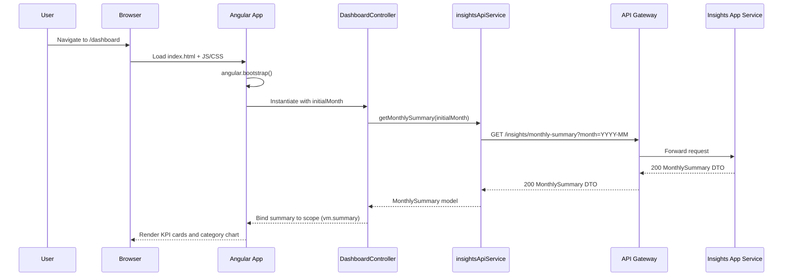
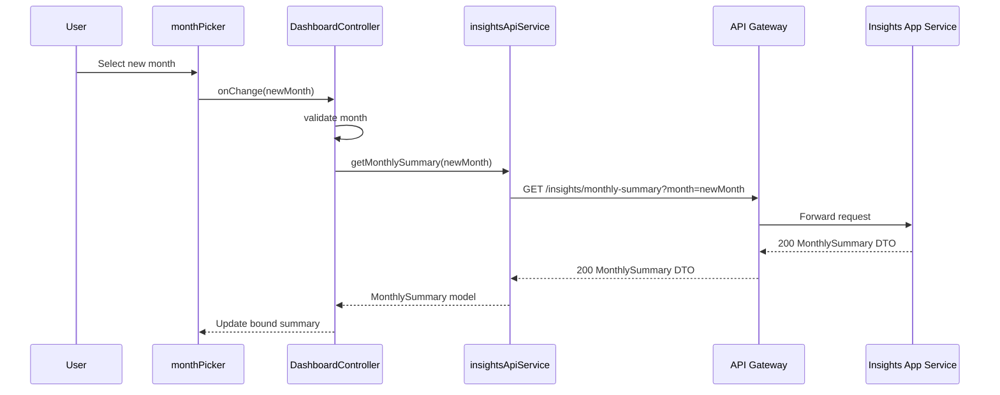
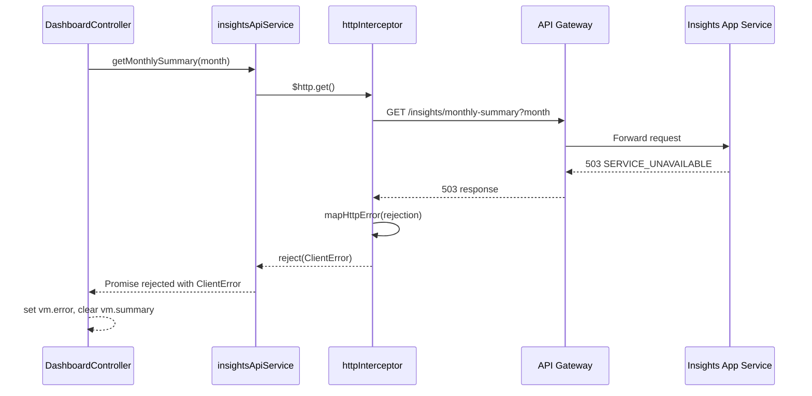
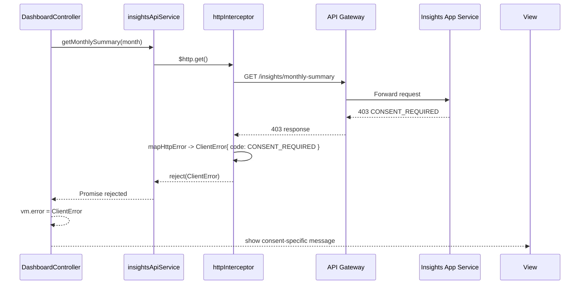

# QE-3165 – Monthly Credit Card Spend Summary Dashboard

## 1. Application Architecture

### 1.1 Overview

The "Monthly Credit Card Spend Summary Dashboard" is implemented as a single‑page web application (SPA) using AngularJS 1.x on the client and REST APIs exposed by the backend Insights Application Service (AS) and API Gateway (AG).

The AngularJS app focuses on:
- Authentication token consumption (JWT from IDP) and secure API calls via AG
- Month selection and validation
- Displaying monthly KPIs (total spend, transaction count, average amount)
- Displaying category breakdown and status/fallback messages
- Handling error and resiliency behaviors surfaced from the backend

The backend is abstracted as REST APIs and is **not** implemented in this LLD; instead, we define the client‑side integration contracts and expectations.

### 1.2 AngularJS MVC Mapping

| HLD Component | AngularJS Artifact(s) | Responsibility (Front-End Perspective) |
|---------------|------------------------|----------------------------------------|
| Customer Web/Mobile Client (U) | Root module, routing, controllers, views, services | SPA shell, navigation, layout, global error handling |
| Insights Application Service (AS) | `insightsApiService`, models, DTO mapping | Encapsulate REST calls for monthly summary, error normalization |
| Analytics & Reporting Service (AR) | Part of `insightsApiService` responses | Consume precomputed metrics, no direct call from UI |
| Rules and Scoring Engine (RS) | Validation utilities, presentation rules | Client-side display rules (threshold highlighting etc.) |
| Category & Labeling Service (CLS) | Data models and view filters | Present category breakdown, sorting and formatting |
| Consent Management Service (CM) | `consentService` | Determine if dashboard can be shown or must display consent error |
| Audit Logging Service (AUD) | `clientTelemetryService` (front-end only) | Non-PII interaction telemetry (e.g., month selection) |
| Data Loss Prevention, WAF, AG, IDP, CR, MON, SM | Configuration and HTTP interceptors | Security headers, token usage, error mapping, correlation IDs |

### 1.3 Project Folder Structure

All implementation artifacts live under `src`. Only `HLD` and `LLD` are outside.

```text
APB_Demo/
  HLD/
  LLD/
  src/
    index.html
    app/
      app.module.js
      app.config.js
      app.routes.js
      app.run.js

      core/
        config/
          env.config.js
          api.config.js
          logging.config.js
        services/
          http.interceptor.js
          auth-token.service.js
          insights-api.service.js
          consent.service.js
          telemetry.service.js
          error-mapper.service.js
        models/
          monthly-summary.model.js
          category-breakdown.model.js
          error.model.js
        utils/
          date.utils.js
          validation.utils.js
          formatting.utils.js

      features/
        dashboard/
          dashboard.module.js
          dashboard.routes.js
          controllers/
            dashboard.controller.js
          services/
            dashboard-state.service.js
          directives/
            month-picker.directive.js
            kpi-card.directive.js
            category-chart.directive.js
            error-banner.directive.js
          views/
            dashboard.html
            partials/
              kpi-cards.html
              category-breakdown.html
              error-state.html

      shared/
        directives/
          loading-spinner.directive.js
          tooltip.directive.js
        filters/
          currency-safe.filter.js
          percentage.filter.js

      assets/
        css/
          main.css
          dashboard.css
        img/
          icons/*

      tests/
        unit/
          core/*
          dashboard/*
        e2e/
          dashboard.e2e.spec.js
```

## 2. Component Specifications

### 2.1 Root Module – `app` 

- **Type**: AngularJS Module
- **File**: `src/app/app.module.js`
- **Responsibility**: Define root AngularJS module and its dependencies.
- **Public API**: N/A (configuration only)
- **Dependencies**: `ngRoute`, `ngAnimate`, `ngMessages`, `app.dashboard`, `app.core`, etc.

```js
angular.module('app.core', [
  'ngRoute',
  'ngAnimate',
  'ngMessages'
]);

angular.module('app.dashboard', []);

angular.module('app', [
  'app.core',
  'app.dashboard'
]);
```

### 2.2 App Config – Routing and HTTP

#### 2.2.1 `app.config.js`
- **Type**: Config block
- **File**: `src/app/app.config.js`
- **Responsibility**: Global route defaults, HTML5 mode, security-related config.
- **Public Methods**: N/A
- **Dependencies**: `$routeProvider`, `$locationProvider`

```js
angular.module('app')
  .config(['$routeProvider', '$locationProvider',
    function($routeProvider, $locationProvider) {
      $locationProvider.html5Mode(true);

      $routeProvider
        .otherwise({
          redirectTo: '/dashboard'
        });
    }
  ]);
```

#### 2.2.2 `app.routes.js`
- **Type**: Config block
- **File**: `src/app/app.routes.js`
- **Responsibility**: Feature-level routes.
- **Dependencies**: `$routeProvider`

```js
angular.module('app.dashboard')
  .config(['$routeProvider', function($routeProvider) {
    $routeProvider
      .when('/dashboard', {
        templateUrl: 'app/features/dashboard/views/dashboard.html',
        controller: 'DashboardController',
        controllerAs: 'vm',
        resolve: {
          initialMonth: ['dateUtils', function(dateUtils) {
            return dateUtils.getDefaultMonth();
          }]
        }
      });
  }]);
```

#### 2.2.3 `app.run.js`
- **Type**: Run block
- **File**: `src/app/app.run.js`
- **Responsibility**: Initialize global state, attach route guards, propagate correlation IDs.
- **Dependencies**: `$rootScope`, `authTokenService`, `telemetryService`

```js
angular.module('app')
  .run(['$rootScope', 'authTokenService', 'telemetryService',
    function($rootScope, authTokenService, telemetryService) {
      $rootScope.$on('$routeChangeStart', function(evt, next) {
        telemetryService.beginNavigation(next.originalPath);
        if (!authTokenService.hasValidToken()) {
          // In real app, redirect to IDP entry point
          telemetryService.logSecurityEvent('MISSING_TOKEN', next.originalPath);
        }
      });

      $rootScope.$on('$routeChangeSuccess', function(evt, current) {
        telemetryService.endNavigation(current.originalPath);
      });
    }
  ]);
```

### 2.3 Core Services

#### 2.3.1 HTTP Interceptor – `http.interceptor.js`

- **Type**: Service + config
- **File**: `src/app/core/services/http.interceptor.js`
- **Responsibility**:
  - Attach JWT bearer token to outbound requests
  - Add correlation ID header
  - Global error handling for REST responses
- **Public Methods**: `request(config)`, `responseError(rejection)`
- **Dependencies**: `$q`, `authTokenService`, `telemetryService`, `errorMapperService`, `envConfig`

```js
angular.module('app.core')
  .factory('httpInterceptor', ['$q', 'authTokenService', 'telemetryService', 'errorMapperService', 'envConfig',
    function($q, authTokenService, telemetryService, errorMapperService, envConfig) {
      return {
        request: function(config) {
          if (config.url.indexOf(envConfig.apiBaseUrl) === 0) {
            const token = authTokenService.getToken();
            if (token) {
              config.headers.Authorization = 'Bearer ' + token;
            }
            const correlationId = telemetryService.getCorrelationId();
            if (correlationId) {
              config.headers['X-Correlation-Id'] = correlationId;
            }
          }
          return config;
        },
        responseError: function(rejection) {
          const clientError = errorMapperService.mapHttpError(rejection);
          telemetryService.logHttpError(clientError);
          return $q.reject(clientError);
        }
      };
    }
  ])
  .config(['$httpProvider', function($httpProvider) {
    $httpProvider.interceptors.push('httpInterceptor');
  }]);
```

#### 2.3.2 `auth-token.service.js`

- **Type**: Service
- **File**: `src/app/core/services/auth-token.service.js`
- **Responsibility**: Manage JWT from IDP (store, retrieve, validate expiration).
- **Public Methods**: `getToken()`, `setToken(token)`, `clearToken()`, `hasValidToken()`
- **Dependencies**: `$window`

#### 2.3.3 `insights-api.service.js`

- **Type**: Service
- **File**: `src/app/core/services/insights-api.service.js`
- **Responsibility**:
  - Encapsulate REST calls to backend Insights Application Service via AG.
  - Normalize response payloads into front-end models.
- **Public Methods**:
  - `getMonthlySummary(month: string): Promise<MonthlySummary>`
- **Dependencies**: `$http`, `$q`, `envConfig`, `MonthlySummary`, `CategoryBreakdown`, `errorMapperService`

**REST Interface (front-end expectation)**

- **Endpoint**: `GET {apiBaseUrl}/insights/monthly-summary`
- **Query Parameters**: `month=YYYY-MM`
- **Headers**:
  - `Authorization: Bearer <JWT>`
  - `X-Correlation-Id: <uuid>`
- **Success Response (200)**:

```json
{
  "month": "2026-05",
  "currency": "USD",
  "totalSpend": 1234.56,
  "transactionCount": 42,
  "averageTransactionAmount": 29.39,
  "categoryBreakdown": [
    { "categoryCode": "GROCERIES", "categoryLabel": "Groceries", "amount": 500.12, "percentage": 40.51 },
    { "categoryCode": "TRAVEL", "categoryLabel": "Travel", "amount": 300.00, "percentage": 24.31 }
  ],
  "dataStatus": "COMPLETED",  
  "partialDataReason": null,    
  "consentStatus": "GRANTED",   
  "generatedAt": "2026-05-31T23:59:59Z",
  "source": "ISD"               
}
```

- **Error Responses** (normalized by backend but mapped by `errorMapperService`):
  - `400` – `INVALID_MONTH` (bad format or out of allowed range)
  - `401` – `UNAUTHENTICATED`
  - `403` – `CONSENT_REQUIRED` or `ACCESS_DENIED`
  - `404` – `NO_DATA_FOR_MONTH`
  - `503` – `SERVICE_UNAVAILABLE`, `DOWNSTREAM_TIMEOUT`, `PARTIAL_OUTAGE`

**Service Implementation Skeleton**

```js
angular.module('app.core')
  .service('insightsApiService', ['$http', '$q', 'envConfig', 'MonthlySummary', 'errorMapperService',
    function($http, $q, envConfig, MonthlySummary, errorMapperService) {
      this.getMonthlySummary = function(month) {
        const config = {
          params: { month: month }
        };

        return $http.get(envConfig.apiBaseUrl + '/insights/monthly-summary', config)
          .then(function(response) {
            return MonthlySummary.fromDto(response.data);
          })
          .catch(function(clientError) {
            // clientError is already mapped by httpInterceptor
            return $q.reject(clientError);
          });
      };
    }
  ]);
```

#### 2.3.4 `consent.service.js`

- **Type**: Service
- **File**: `src/app/core/services/consent.service.js`
- **Responsibility**: Interpret consent-related fields from the summary response and provide helper methods to the dashboard.
- **Public Methods**:
  - `isConsentGranted(summary)`
  - `getConsentMessage(summary)`
- **Dependencies**: None (pure logic)

#### 2.3.5 `telemetry.service.js`

- **Type**: Service
- **File**: `src/app/core/services/telemetry.service.js`
- **Responsibility**: Client-side telemetry (non-PII), correlation ID generation, logging navigation and HTTP errors to MON-compatible endpoints.
- **Public Methods**:
  - `getCorrelationId()`
  - `beginNavigation(path)`
  - `endNavigation(path)`
  - `logHttpError(error)`
  - `logSecurityEvent(code, details)`
- **Dependencies**: `$http`, `envConfig`

#### 2.3.6 `error-mapper.service.js`

- **Type**: Service
- **File**: `src/app/core/services/error-mapper.service.js`
- **Responsibility**: Map raw HTTP errors to structured `ClientError` model for consistent UI handling.
- **Public Methods**: `mapHttpError(rejection)`
- **Dependencies**: `ClientError`

### 2.4 Models

#### 2.4.1 `MonthlySummary` Model

- **File**: `src/app/core/models/monthly-summary.model.js`
- **Object Name**: `MonthlySummary`
- **Attributes**:
  - `month: string` (format `YYYY-MM`)
  - `currency: string`
  - `totalSpend: number`
  - `transactionCount: number`
  - `averageTransactionAmount: number`
  - `categoryBreakdown: CategoryBreakdown[]`
  - `dataStatus: 'COMPLETED' | 'PARTIAL' | 'UNAVAILABLE'`
  - `partialDataReason: string|null`
  - `consentStatus: 'GRANTED' | 'REVOKED' | 'UNKNOWN'`
  - `generatedAt: Date`
  - `source: 'ISD' | 'CCD' | 'CACHE'`

- **Methods**:
  - `static fromDto(dto)` – create instance from backend DTO

- **Validation Rules**:
  - `month` must match `^\d{4}-(0[1-9]|1[0-2])$`
  - `totalSpend >= 0`, `transactionCount >= 0`
  - `dataStatus` restricted to enum values

```js
angular.module('app.core')
  .factory('MonthlySummary', ['CategoryBreakdown', 'validationUtils',
    function(CategoryBreakdown, validationUtils) {
      function MonthlySummary(props) {
        angular.extend(this, props);
      }

      MonthlySummary.fromDto = function(dto) {
        const month = dto.month;
        if (!validationUtils.isValidMonth(month)) {
          throw new Error('Invalid month in DTO');
        }

        const categories = (dto.categoryBreakdown || []).map(CategoryBreakdown.fromDto);

        return new MonthlySummary({
          month: month,
          currency: dto.currency,
          totalSpend: dto.totalSpend || 0,
          transactionCount: dto.transactionCount || 0,
          averageTransactionAmount: dto.averageTransactionAmount || 0,
          categoryBreakdown: categories,
          dataStatus: dto.dataStatus || 'UNAVAILABLE',
          partialDataReason: dto.partialDataReason || null,
          consentStatus: dto.consentStatus || 'UNKNOWN',
          generatedAt: dto.generatedAt ? new Date(dto.generatedAt) : null,
          source: dto.source || 'ISD'
        });
      };

      return MonthlySummary;
    }
  ]);
```

#### 2.4.2 `CategoryBreakdown` Model

- **File**: `src/app/core/models/category-breakdown.model.js`
- **Attributes**:
  - `categoryCode: string`
  - `categoryLabel: string`
  - `amount: number`
  - `percentage: number` (0–100)

- **Validation Rules**:
  - `amount >= 0`
  - `0 <= percentage <= 100`

```js
angular.module('app.core')
  .factory('CategoryBreakdown', [function() {
    function CategoryBreakdown(props) {
      angular.extend(this, props);
    }

    CategoryBreakdown.fromDto = function(dto) {
      return new CategoryBreakdown({
        categoryCode: dto.categoryCode,
        categoryLabel: dto.categoryLabel,
        amount: dto.amount || 0,
        percentage: dto.percentage || 0
      });
    };

    return CategoryBreakdown;
  }]);
```

#### 2.4.3 `ClientError` Model

- **File**: `src/app/core/models/error.model.js`
- **Attributes**:
  - `code: string` (e.g., `INVALID_MONTH`, `SERVICE_UNAVAILABLE`)
  - `httpStatus: number`
  - `message: string` (user-friendly)
  - `details: any` (for debugging, not shown to end user)
  - `correlationId: string`

```js
angular.module('app.core')
  .factory('ClientError', [function() {
    function ClientError(props) {
      angular.extend(this, props);
    }
    return ClientError;
  }]);
```

### 2.5 Utilities

#### 2.5.1 `date.utils.js`

- **Responsibility**: Month calculations and formatting.
- **Methods**:
  - `getDefaultMonth(): string` – returns current or last closed month (`YYYY-MM`).
  - `isFutureMonth(month: string): boolean`
  - `isWithinAllowedHistory(month: string, maxMonths: number): boolean`

#### 2.5.2 `validation.utils.js`

- **Responsibility**: Input validation rules based on HLD business constraints.
- **Methods**:
  - `isValidMonth(month: string): boolean` – regex + range

```js
angular.module('app.core')
  .factory('validationUtils', [function() {
    const MONTH_REGEX = /^\d{4}-(0[1-9]|1[0-2])$/;

    function isValidMonth(month) {
      if (!MONTH_REGEX.test(month)) {
        return false;
      }
      // further range checks can be injected here
      return true;
    }

    return {
      isValidMonth: isValidMonth
    };
  }]);
```

### 2.6 Dashboard Feature Components

#### 2.6.1 `dashboard.module.js`

- **Type**: Module definition
- **File**: `src/app/features/dashboard/dashboard.module.js`

```js
angular.module('app.dashboard', [
  'app.core'
]);
```

#### 2.6.2 `dashboard-state.service.js`

- **Type**: Service
- **File**: `src/app/features/dashboard/services/dashboard-state.service.js`
- **Responsibility**: Maintain current month selection, loading state, summary data and last error in memory.
- **Attributes (managed state)**:
  - `selectedMonth: string`
  - `summary: MonthlySummary|null`
  - `isLoading: boolean`
  - `error: ClientError|null`

- **Public Methods**:
  - `getSelectedMonth()` / `setSelectedMonth(month)`
  - `getSummary()` / `setSummary(summary)`
  - `setLoading(isLoading)` / `isLoading()`
  - `getError()` / `setError(error)`

#### 2.6.3 `DashboardController`

- **Type**: Controller
- **File**: `src/app/features/dashboard/controllers/dashboard.controller.js`
- **Dependencies**: `insightsApiService`, `dashboardStateService`, `validationUtils`, `consentService`, `telemetryService`, `initialMonth`
- **Responsibility**:
  - Initialize dashboard with default month
  - Handle user interaction (month change, manual refresh)
  - Coordinate data fetch, error handling, and state transitions
  - Decide which UI subcomponents to show (full, partial, error, consent-required)

- **Public Methods (bound to `vm`)**:
  - `vm.month` – bound to month picker
  - `vm.summary` – bound to KPI and chart directives
  - `vm.error` – bound to error banner
  - `vm.isLoading` – bound to spinner
  - `vm.onMonthChange(newMonth)` – triggered by month-picker directive
  - `vm.refresh()` – manual refresh
  - `vm.hasData()` – derived state
  - `vm.isConsentGranted()` – uses `consentService`

**Controller Flow**

```js
angular.module('app.dashboard')
  .controller('DashboardController', ['insightsApiService', 'dashboardStateService', 'validationUtils', 'consentService', 'telemetryService', 'initialMonth',
    function(insightsApiService, dashboardStateService, validationUtils, consentService, telemetryService, initialMonth) {
      var vm = this;

      vm.month = initialMonth;
      vm.summary = null;
      vm.error = null;
      vm.isLoading = false;

      vm.onMonthChange = onMonthChange;
      vm.refresh = refresh;
      vm.hasData = hasData;
      vm.isConsentGranted = isConsentGranted;

      activate();

      function activate() {
        loadSummary(vm.month);
      }

      function onMonthChange(newMonth) {
        vm.month = newMonth;
        telemetryService.logNavigation('MONTH_CHANGED', { month: newMonth });
        loadSummary(newMonth);
      }

      function refresh() {
        telemetryService.logNavigation('REFRESH_CLICKED', { month: vm.month });
        loadSummary(vm.month, true);
      }

      function loadSummary(month, forceReload) {
        if (!validationUtils.isValidMonth(month)) {
          vm.error = { code: 'INVALID_MONTH', message: 'Please select a valid month.' };
          vm.summary = null;
          return;
        }

        vm.isLoading = true;
        vm.error = null;

        insightsApiService.getMonthlySummary(month)
          .then(function(summary) {
            vm.summary = summary;
            vm.error = null;
          })
          .catch(function(err) {
            vm.error = err;
            vm.summary = null;
          })
          .finally(function() {
            vm.isLoading = false;
          });
      }

      function hasData() {
        return !!vm.summary && vm.summary.dataStatus !== 'UNAVAILABLE';
      }

      function isConsentGranted() {
        return vm.summary && consentService.isConsentGranted(vm.summary);
      }
    }
  ]);
```

#### 2.6.4 `month-picker.directive.js`

- **Type**: Directive
- **File**: `src/app/features/dashboard/directives/month-picker.directive.js`
- **Responsibility**: Provide a reusable month-selection UI component with validation.
- **Inputs**:
  - `ng-model` (two-way bound to `vm.month`)
  - `on-change` (`&` binding to call `vm.onMonthChange`)
- **Outputs**: Emits month change events to controller.
- **Dependencies**: `dateUtils`, `validationUtils`

```js
angular.module('app.dashboard')
  .directive('monthPicker', ['dateUtils', 'validationUtils', function(dateUtils, validationUtils) {
    return {
      restrict: 'E',
      templateUrl: 'app/features/dashboard/views/partials/month-picker.html',
      scope: {
        ngModel: '=',
        onChange: '&'
      },
      link: function(scope) {
        scope.onMonthSelected = function() {
          if (validationUtils.isValidMonth(scope.ngModel)) {
            scope.onChange({ newMonth: scope.ngModel });
          } else {
            // show inline validation message
            scope.monthInvalid = true;
          }
        };
      }
    };
  }]);
```

#### 2.6.5 `kpi-card.directive.js`

- **Responsibility**: Render KPI cards for total spend, transaction count, average amount, with optional highlighting for unusual spend levels.
- **Inputs**: `summary` (`MonthlySummary`), `title`, `value`, `trend` (optional)
- **Outputs**: None

#### 2.6.6 `category-chart.directive.js`

- **Responsibility**: Render category breakdown (bar/pie chart) using Bootstrap-compatible HTML/CSS and optionally a chart library.
- **Inputs**: `categories: CategoryBreakdown[]`
- **Outputs**: None

#### 2.6.7 `error-banner.directive.js`

- **Responsibility**: Show user-friendly error messages based on `ClientError` code and consent status.
- **Inputs**: `error: ClientError`
- **Outputs**: None

### 2.7 Views

#### 2.7.1 `dashboard.html`

- Layout:
  - Header with title and month-picker
  - Loading spinner overlay when `vm.isLoading`
  - Error banner when `vm.error`
  - KPI cards when `vm.hasData()`
  - Category chart when `vm.hasData()` and `summary.categoryBreakdown.length>0`

```html
<div class="container monthly-dashboard" ng-class="{ 'is-loading': vm.isLoading }">
  <div class="row">
    <div class="col-xs-12">
      <h1>Monthly Credit Card Spend</h1>
    </div>
  </div>

  <div class="row">
    <div class="col-sm-6">
      <month-picker ng-model="vm.month" on-change="vm.onMonthChange(newMonth)"></month-picker>
    </div>
  </div>

  <error-banner error="vm.error"></error-banner>

  <loading-spinner ng-if="vm.isLoading"></loading-spinner>

  <div ng-if="vm.hasData() && vm.isConsentGranted()">
    <div class="row">
      <div class="col-sm-4">
        <kpi-card title="Total Spend" value="vm.summary.totalSpend" currency="vm.summary.currency"></kpi-card>
      </div>
      <div class="col-sm-4">
        <kpi-card title="Transactions" value="vm.summary.transactionCount"></kpi-card>
      </div>
      <div class="col-sm-4">
        <kpi-card title="Average Transaction" value="vm.summary.averageTransactionAmount" currency="vm.summary.currency"></kpi-card>
      </div>
    </div>

    <div class="row">
      <div class="col-xs-12">
        <category-chart categories="vm.summary.categoryBreakdown"></category-chart>
      </div>
    </div>
  </div>

  <div ng-if="vm.summary && !vm.isConsentGranted() && !vm.error">
    <div class="alert alert-warning">
      Insights cannot be displayed because consent is not granted. Please update your preferences.
    </div>
  </div>
</div>
```

## 3. Interface Specifications

### 3.1 Controller–Service Interactions

- `DashboardController` → `insightsApiService.getMonthlySummary(month)`
  - Input: validated `month` string
  - Output: `Promise<MonthlySummary>` or rejection with `ClientError`

- `DashboardController` → `consentService.isConsentGranted(summary)`
  - Input: `MonthlySummary`
  - Output: `boolean`

- `DashboardController` ↔ Directives
  - Binds data via `ng-model` and attribute bindings

### 3.2 REST API Interface (Front-End Contract)

**Endpoint**: `/insights/monthly-summary`

| Aspect | Specification |
|--------|---------------|
| Method | `GET` |
| Query  | `month=YYYY-MM` |
| Headers | `Authorization`, `X-Correlation-Id` |
| Success | 200 with `MonthlySummary` DTO structure as defined earlier |
| Client Errors | 400 (invalid month), 404 (no data) |
| Auth Errors | 401, 403 |
| Server Errors | 5xx mapped to `SERVICE_UNAVAILABLE` or specific codes |

**Error Handling Contract**:
- Backend returns JSON with `errorCode`, `message`, `details`.
- `errorMapperService` converts to `ClientError`.

Example error payload:

```json
{
  "errorCode": "CONSENT_REQUIRED",
  "message": "Consent not granted for spending insights.",
  "correlationId": "123e4567-e89b-12d3-a456-426614174000"
}
```

## 4. Data Model Design

### 4.1 JavaScript Models

Covered in section 2.4; additional validation and state transitions below.

### 4.2 Validation Rules

- `validationUtils.isValidMonth` enforces format; additional logic may enforce:
  - `month` not greater than current month
  - `month` not older than configured maximum history (e.g., 36 months)

- UI layer prevents API calls for invalid months.

### 4.3 State Transitions

For `MonthlySummary` display state in the dashboard:

- **States**:
  - `EMPTY` – no month selected or before first load
  - `LOADING` – API call in progress
  - `READY` – successful response with `dataStatus = COMPLETED` or `PARTIAL`
  - `ERROR` – any `ClientError`

- **Transitions**:
  - `EMPTY` → `LOADING` when first month load triggered.
  - `READY` → `LOADING` on month change or refresh.
  - `LOADING` → `READY` on success.
  - `LOADING` → `ERROR` on error.
  - `ERROR` → `LOADING` on retry/refresh.

## 5. Data Flow

### 5.1 Primary Flow

1. **User Action**: User opens `/dashboard` or navigates from elsewhere.
2. **View**: `dashboard.html` loads; `DashboardController` initializes with `initialMonth`.
3. **Controller**: Calls `insightsApiService.getMonthlySummary(initialMonth)`.
4. **Service**: `insightsApiService` triggers `$http.get()` with JWT and correlation ID via interceptor.
5. **Backend/API**: AG forwards to AS; AS orchestrates AR, RS, CLS, ISD/CCD and returns summary DTO.
6. **Service**: On success, maps DTO to `MonthlySummary` instance.
7. **Controller**: Sets `vm.summary`, clears `vm.error`, `vm.isLoading=false`.
8. **UI Update**: KPI cards and category chart render with data.

### 5.2 Error Flow (e.g., consent required)

1. User selects a month.
2. Controller validates month and calls `insightsApiService.getMonthlySummary`.
3. Backend returns `403` with `CONSENT_REQUIRED` errorCode.
4. `httpInterceptor` maps rejection via `errorMapperService` into a `ClientError`.
5. Controller sets `vm.error`; `error-banner` displays consent-specific message.

### 5.3 Partial Data / Resiliency

If backend indicates `dataStatus = PARTIAL` and sets `partialDataReason` (e.g., `CLS_UNAVAILABLE`), UI still shows total spend and transaction count but may show a banner: "Category breakdown is temporarily unavailable." This is implemented using conditional logic in `dashboard.html` and `error-banner`.

## 6. Sequence Diagrams (Mermaid)

### 6.1 Application Initialization



### 6.2 Primary User Workflow – Change Month



### 6.3 Service/API Interaction with Error Handling



### 6.4 Consent Required Scenario



## 7. Implementation Details

### 7.1 AngularJS Implementation Approach

- Use componentized architecture with dedicated feature module for dashboard.
- Controllers are kept thin; services encapsulate API logic.
- Directives are used for reusable UI widgets (month picker, KPI cards, charts, error banner, spinner).

### 7.2 JavaScript ES6 Patterns

- Prefer `const` and `let` in new code where build tooling supports transpilation; within this legacy AngularJS context examples use ES5 syntax but can be migrated to ES6 modules and arrow functions with Babel/Webpack if allowed.
- Use pure functions in utilities and service logic where possible.

### 7.3 Dependency Injection

- All dependencies declared using minification-safe array notation.
- Core services (`insightsApiService`, `authTokenService`, etc.) registered in `app.core` for reuse.

### 7.4 Business Logic Flow

- Client delegates business‑critical rules (included transactions, currency conversion, etc.) to backend (RS, AR, CLS). UI only applies **presentation rules**, such as:
  - Format numbers and currencies
  - Highlight unusually high spend if threshold indicator is included in DTO in future epics

### 7.5 Validation Logic

- Month string validated using regex and range checks before API call.
- Any invalid month prevents outbound HTTP request and results in inline error.

### 7.6 State Management

- Controller-level state for simplicity; `dashboardStateService` used if cross‑view or session‑wide state becomes necessary.
- Flags `isLoading`, `error`, `summary` determine view rendering.

### 7.7 DOM Interaction

- Direct DOM manipulation is avoided; Angular templates and directives manage DOM.
- Any exceptional DOM interaction (e.g., focusing invalid field) is done inside directives using standard jQuery-lite APIs.

### 7.8 API Integration

- All API calls go through `$http` with the global interceptor for security headers and error handling.
- `envConfig.apiBaseUrl` configured per environment.

## 8. Configuration

### 8.1 Environment Config – `env.config.js`

- **Attributes**:
  - `apiBaseUrl` – base URL for AG (e.g., `https://api.bank.com`) 
  - `maxHistoryMonths` – maximum months allowed in past
  - `featureFlags` – toggles for experimental visuals
  - `loggingLevel` – `INFO|DEBUG|ERROR`

```js
angular.module('app.core')
  .constant('envConfig', {
    apiBaseUrl: 'https://api.bank.com',
    maxHistoryMonths: 36,
    featureFlags: {
      enableAdvancedCharts: false
    },
    loggingLevel: 'INFO'
  });
```

### 8.2 API Config – `api.config.js`

- Maps logical endpoints and timeouts.

```js
angular.module('app.core')
  .constant('apiConfig', {
    monthlySummary: {
      path: '/insights/monthly-summary',
      timeoutMs: 8000
    }
  });
```

### 8.3 Logging Config – `logging.config.js`

- Defines log endpoints and redaction rules.

```js
angular.module('app.core')
  .constant('loggingConfig', {
    endpoint: '/client-logs',
    redactFields: ['token', 'Authorization', 'cardNumber']
  });
```

## 9. Error Handling and Resiliency

### 9.1 Client-Side Exception Handling

- Global `$exceptionHandler` override logs uncaught exceptions to telemetry endpoint after redacting sensitive data.
- UI shows generic error banner while preserving non-PII context.

### 9.2 REST API Error Handling

- `httpInterceptor` centralizes mapping of HTTP errors to `ClientError`.
- `error-banner` interprets `ClientError.code` values and displays specific copy:
  - `INVALID_MONTH`: "Please select a valid month within the allowed range."
  - `CONSENT_REQUIRED`: "Insights cannot be displayed because consent is not granted."
  - `SERVICE_UNAVAILABLE`: "The service is temporarily unavailable. Please try again later."

### 9.3 Retry Mechanisms

- Front-end does not auto‑retry to avoid unintended load; provides manual "Retry" button in error banner.
- Telemetry logs retries and error rates for MON.

### 9.4 Logging Strategy

- All HTTP errors and selected user actions (month change, refresh, consent error) logged via `telemetryService` with correlation ID.
- Logs exclude card numbers, full names, or other PII; use hashed or pseudonymous identifiers if needed.

### 9.5 Recovery and Fallback

- When backend returns partial data (`dataStatus = PARTIAL`):
  - KPI cards still render available fields.
  - Category chart is hidden or shows a placeholder message depending on `partialDataReason`.
- When `NO_DATA_FOR_MONTH`:
  - UI displays informational message and invites user to pick a different month.

## 10. Security Considerations

### 10.1 Input Validation and Sanitization

- Month input restricted via `month-picker` and validated by `validationUtils`.
- No arbitrary text inputs in this epic; any future free‑form input must be sanitized/escaped before rendering.

### 10.2 XSS Prevention

- All dynamic values rendered using Angular expressions which auto‑escape HTML.
- Directives that might insert HTML must use `ng-bind` and `ng-bind-html` with `$sanitize`.
- No usage of `ng-bind-html` for data originating from backend in this dashboard.

### 10.3 CSRF Protection

- All sensitive actions are authenticated with bearer JWT tokens; CSRF less relevant for pure API + token pattern.
- If same-origin cookies are used, include CSRF token header via interceptor.

### 10.4 Secure API Communication

- `envConfig.apiBaseUrl` must point to HTTPS endpoints only (TLS 1.3 enforced by infra).
- Correlation IDs generated client-side do not encode PII.

### 10.5 Authentication and Authorization Integration

- `authTokenService` reads JWT issued by IDP from browser storage (preferably `sessionStorage`).
- Missing/expired token:
  - UI prevents API calls and may redirect user to authentication entry point.
- Role- and attribute-based enforcement is done on server; client only adapts UI (e.g., hide unsupported options if role indicates limited access).

### 10.6 Sensitive Data Handling

- UI only displays aggregated numeric data and non-sensitive category labels.
- No PAN, CVV, or account numbers are fetched or stored in front-end.
- Telemetry redacts any accidental sensitive fields as an additional control.

### 10.7 Audit Logging Approach

- Business-critical audit is primarily on server (AUD in HLD).
- Client contributes supplemental telemetry:
  - Month selected
  - Whether call succeeded or failed
  - Error codes
- No PII or financial values are included in telemetry payloads.

---

This LLD provides sufficient detail for an AngularJS 1.x engineering team to implement the Monthly Credit Card Spend Summary Dashboard for epic QE-3165 without referring back to the HLD.
