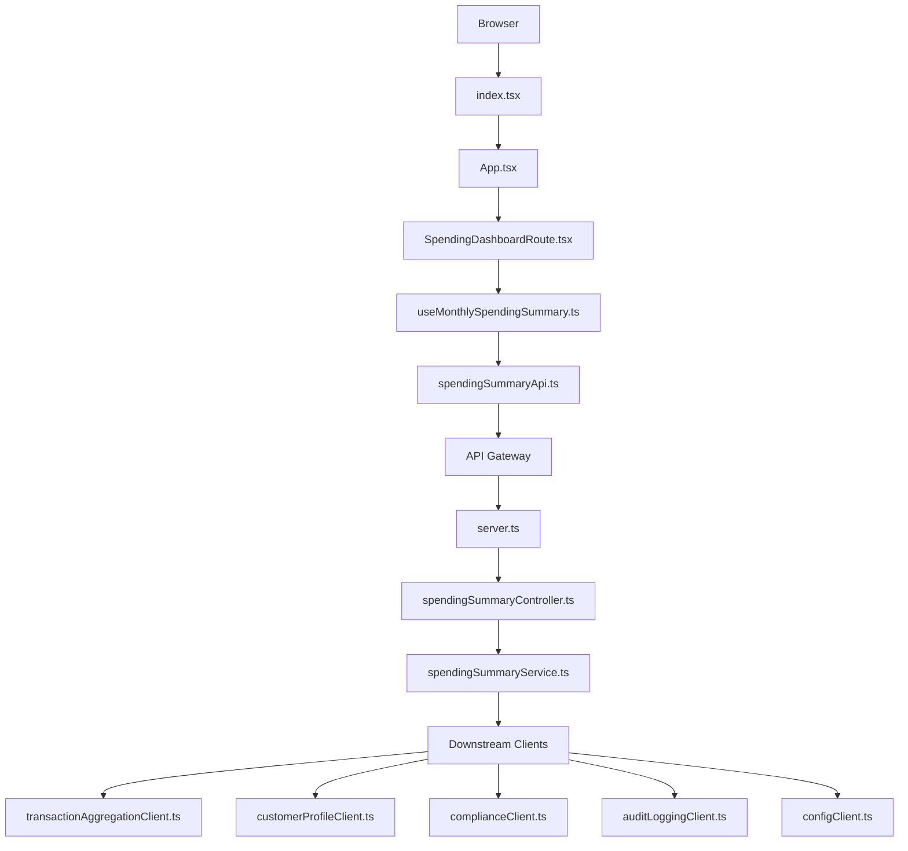

# LLD – Monthly Spending Summary Dashboard

Epic: QE-3172  
Context: Credit-card monthly spending summary for web banking customers ("Spending" dashboard)  
Target branch: SPENDING

---

## 1. Application Architecture

### 1.1 Overall Architecture Style

- **Type**: Multi-tier web application with RESTful backend services.  
- **Front-End**: Single-page web UI (Spending Dashboard) built with **React 18** + **TypeScript**.
- **Backend**: Node.js 20 + Express 4 REST API for the **Spending Summary Service** behind an API Gateway.
- **API Gateway**: Existing banking platform gateway, integrated via configuration; this LLD defines the application-side interface and constraints.
- **Downstream Services (assumed external)**:
  - Customer Profile Service (REST)
  - Transaction Aggregation Service (REST)
  - Compliance & Retention Service (REST)
  - Audit Logging Service (REST / message bus)
  - Configuration & Feature Flag Service (REST)
- **Data Store**: Aggregates and raw transactions are managed by the Transaction Aggregation Service and associated storage; this epic consumes aggregates via API instead of owning the persistence.

All application code for this epic resides inside `src/`. Only `HLD/` and `LLD/` exist at repo root.

### 1.2 Technology Stack

**Frontend**
- React 18 (functional components, hooks)
- TypeScript 5
- React Router 6 (for navigation within dashboard scope)
- Axios (HTTP client)
- CSS Modules (scoped styling) or TailwindCSS if standard in repo; for this LLD we use CSS Modules explicitly.

**Backend (Spending Summary Service)**
- Node.js 20
- Express 4
- TypeScript 5
- Axios (HTTP client to downstream services)
- Node-config (for configuration)
- Winston (structured logging – local application logs)

**Cross-cutting**
- TLS 1.3 termination is handled by the API Gateway; all backend-to-downstream traffic uses HTTPS.
- JSON Web Tokens (JWT) for authentication (validated at API Gateway; Spending Summary Service uses propagated identity claims).

### 1.3 Mapping HLD Components to Implementation Artifacts

| HLD Component                    | Implementation Artifact(s)                                                                                      |
|----------------------------------|------------------------------------------------------------------------------------------------------------------|
| Web Frontend (Spending Dashboard)| React app under `src/frontend/` with dashboard page/components, API client, routing, hooks, and styles.        |
| API Gateway                      | Configuration / expectations only; concrete implementation is out of scope. Backend exposes gateway-facing API.|
| Authentication & Authorization   | Gateway + backend auth middleware using JWT claims; integration points defined.                                 |
| Spending Summary Service         | Express-based REST service under `src/backend/spending-summary/`.                                               |
| Customer Profile Service         | Backend client module `CustomerProfileClient` under `src/backend/clients/`.                                      |
| Transaction Aggregation Service  | Backend client module `TransactionAggregationClient` under `src/backend/clients/`.                              |
| Data Store (Transactions & Agg.) | Accessed exclusively via Transaction Aggregation Service APIs (no direct DB in this epic).                      |
| Audit Logging Service            | Backend client `AuditLoggingClient` with async fire-and-forget behavior.                                        |
| Compliance & Retention Service   | Backend client `ComplianceClient` enforcing retention/consent checks per summary request.                        |
| Config & Feature Flag Service    | Backend client `ConfigClient`; feature flags also exposed to frontend via config endpoint.                      |
| Monitoring & Alerting            | Metrics emitted via logging + standard monitoring hooks (e.g., Prometheus metrics module).                      |
| Circuit Breaker / Retry Component| Resilience wrapper around HTTP clients (e.g., using opossum-like pattern, implemented locally).                 |
| Secrets Management               | Assumed existing, referenced via environment variables; not implemented here, only usage constraints defined.   |

### 1.4 Project Folder Structure

Only `HLD/` and `LLD/` may exist outside `src/`. All application code is under `src/`.

```text
HLD/
  QE-3172_HLD.md
LLD/
  QE-3172_LLD.md
src/
  frontend/
    index.tsx
    app/
      App.tsx
      routes/
        SpendingDashboardRoute.tsx
      components/
        layout/
          PageLayout.tsx
        spending/
          MonthSelector.tsx
          SpendingSummaryCards.tsx
          SpendingBreakdownChart.tsx
          LoadingState.tsx
          ErrorState.tsx
          EmptyState.tsx
      hooks/
        useMonthlySpendingSummary.ts
      api/
        httpClient.ts
        spendingSummaryApi.ts
      config/
        featureFlags.ts
      styles/
        layout.module.css
        spendingSummary.module.css
  backend/
    server.ts
    config/
      default.json
      production.json
    spending-summary/
      routes/
        spendingSummaryRoutes.ts
      controllers/
        spendingSummaryController.ts
      services/
        spendingSummaryService.ts
        resilienceService.ts
      models/
        SpendingSummary.ts
        ErrorResponse.ts
      clients/
        customerProfileClient.ts
        transactionAggregationClient.ts
        complianceClient.ts
        auditLoggingClient.ts
        configClient.ts
      middleware/
        authContextMiddleware.ts
        correlationIdMiddleware.ts
        errorHandlingMiddleware.ts
      infrastructure/
        httpClientFactory.ts
        metrics.ts
        logger.ts
```

Every referenced artifact below uses an exact path from this structure.

### 1.5 Application Initialization Flow (Mermaid)



---

## 2. Implementation Contracts (Artifacts)

Below, every artifact is defined with the mandated fields. Non-applicable fields are marked `N/A`.

### 2.1 Frontend Artifacts

#### 2.1.1 `src/frontend/index.tsx`

- **Artifact Type**: Module (entry point)
- **Module**: React application bootstrap
- **Dependencies**:
  - ReactDOM from `react-dom/client`
  - React from `react`
  - `App` from `./app/App`
- **Public API**: N/A (entry point)
- **Inputs**:
  - `document.getElementById('root')` DOM element (standard React mount point)
- **Outputs**:
  - Mounted React application; UI rendering of the dashboard route
- **Behavior**:
  - Initialization:
    - Create React root via `createRoot`.
    - Render `<App />` wrapped in `StrictMode`.
  - Business logic: N/A
  - Validation: N/A (no user input here)
  - State transitions: N/A
  - Success behavior: App loads and routes are available.
  - Error behavior: If mounting fails, log to console (development-only) – UI will not render.
  - Loading states: N/A
  - Empty states: N/A
  - Fallback behavior: N/A
- **Bindings**: N/A (no framework binding system beyond React render)
- **API Contract**: N/A
- **Dependency Constraints**:
  - Allowed dependencies: React, ReactDOM, local `App`.
  - Forbidden dependencies: Direct HTTP calls, business logic services.
  - Dependency direction: Entry point at top of UI; other UI components depend on it.
  - Circular dependency risks: None (leaf root module).

#### 2.1.2 `src/frontend/app/App.tsx`

- **Artifact Type**: Component (root)
- **Module**: React component module
- **Dependencies**:
  - React
  - `BrowserRouter`, `Routes`, `Route` from `react-router-dom`
  - `SpendingDashboardRoute` from `./routes/SpendingDashboardRoute`
  - Global layout stylesheet `layout.module.css`
- **Public API**:
  - React component `App`: `() => JSX.Element`
- **Inputs**:
  - N/A (no props)
  - User navigation via browser URL
- **Outputs**:
  - Renders routing structure; specifically renders `SpendingDashboardRoute` when path is `/spending` (or default route mapping as per configuration).
- **Behavior**:
  - Initialization:
    - Sets up `BrowserRouter`.
    - Registers route for spending dashboard.
  - Business logic:
    - Route configuration only.
  - Validation: N/A
  - State transitions:
    - Switching routes changes displayed components.
  - Success behavior:
    - Navigating to `/spending` shows spending dashboard.
  - Error behavior:
    - Unknown routes can render a simple 404; defined as separate route if needed (not required by HLD).
  - Loading states: N/A (delegated to inner components).
  - Empty states: N/A.
  - Fallback behavior: For unknown routes, show generic "Page not found" (optional).
- **Bindings**:
  - N/A – React props standard.
- **API Contract**: N/A
- **Dependency Constraints**:
  - Allowed: React, router, child route components.
  - Forbidden: Direct API calls, domain logic.
  - Dependency direction: Root UI; depends on route modules; no one depends on App.
  - Circular dependency risks: None.

#### 2.1.3 `src/frontend/app/routes/SpendingDashboardRoute.tsx`

- **Artifact Type**: Component (route container)
- **Module**: React component module
- **Dependencies**:
  - React
  - `PageLayout` from `../components/layout/PageLayout`
  - `MonthSelector`, `SpendingSummaryCards`, `SpendingBreakdownChart`, `LoadingState`, `ErrorState`, `EmptyState` from `../components/spending/...`
  - `useMonthlySpendingSummary` hook from `../hooks/useMonthlySpendingSummary`
  - CSS module `spendingSummary.module.css`
- **Public API**:
  - Component `SpendingDashboardRoute`: `() => JSX.Element`
- **Inputs**:
  - Location/route (implicit via router; month may be derived from query string or internal state)
  - User inputs via `MonthSelector` component (month selection)
- **Outputs**:
  - Rendered spending dashboard UI for selected month
- **Behavior**:
  - Initialization:
    - On mount, compute default month (e.g., current month in `YYYY-MM` format) and pass to `useMonthlySpendingSummary`.
  - Business logic:
    - Maintains selected month state.
    - Calls `useMonthlySpendingSummary(selectedMonth)` to fetch summary.
    - Based on hook outputs, renders appropriate UI state:
      - Loading: `LoadingState` component
      - Error: `ErrorState` with generic message
      - Empty (no data within compliance/retention window): `EmptyState`
      - Success: combination of `SpendingSummaryCards` and `SpendingBreakdownChart`
    - Passes `selectedMonth` and change handler to `MonthSelector`.
  - Validation:
    - Month selection is validated inside `MonthSelector` and hook; this route ensures only valid month string is passed to hook.
  - State transitions:
    - Changing month triggers re-fetch via hook.
    - Transitions between loading, error, empty, success states based on hook output.
  - Success behavior:
    - Displays total spend, transaction count, summary KPIs, and high-level breakdown chart.
  - Error behavior:
    - On API error, logs to console (frontend) and shows generic error card without leaking internal details.
  - Loading states:
    - Skeleton cards or spinner; `LoadingState` defines UI.
  - Empty states:
    - "No data available for this month" message (e.g., out of retention window or no transactions).
  - Fallback behavior:
    - If hook returns partial data (e.g., cached summary), UI indicates summary may not be fully up-to-date.
- **Bindings**:
  - React props and state only (no AngularJS bindings).
  - N/A for binding mode specifics (non-Angular framework).
- **API Contract**: N/A (delegated to hook and API client).
- **Dependency Constraints**:
  - Allowed dependencies: Layout and spending components, hooks.
  - Forbidden dependencies: Direct downstream HTTP clients; must go through `useMonthlySpendingSummary`.
  - Dependency direction: Route -> hooks -> API client; no reverse dependency.
  - Circular dependency risks: None if hooks do not import route.

#### 2.1.4 `src/frontend/app/components/layout/PageLayout.tsx`

- **Artifact Type**: Component
- **Module**: React component
- **Dependencies**:
  - React
  - CSS module `layout.module.css`
- **Public API**:
  - Component `PageLayout` with props:
    - `title: string`
    - `children: React.ReactNode`
- **Inputs**:
  - Props described above.
- **Outputs**:
  - Renders a page frame with a header displaying `title` and content area for `children`.
- **Behavior**:
  - Initialization: N/A beyond React.
  - Business logic: Layout only.
  - Validation: Ensure `title` is non-empty; default fallback if empty (e.g., "Spending Dashboard").
  - State transitions: N/A.
  - Success behavior: Consistent layout applied.
  - Error behavior: N/A.
  - Loading states: N/A.
  - Empty states: Children can be empty; layout still renders.
  - Fallback behavior: N/A.
- **Bindings**:
  - React props only; N/A for binding modes.
- **API Contract**: N/A.
- **Dependency Constraints**:
  - Allowed: Styling and children components.
  - Forbidden: Business services, APIs.
  - Direction: UI container only.

#### 2.1.5 `src/frontend/app/components/spending/MonthSelector.tsx`

- **Artifact Type**: Component (UI input)
- **Module**: React component
- **Dependencies**:
  - React
  - CSS module `spendingSummary.module.css`
- **Public API**:
  - Component `MonthSelector` with props:
    - `selectedMonth: string` (format `YYYY-MM`)
    - `onChange: (month: string) => void`
- **Inputs**:
  - Props `selectedMonth`, `onChange`.
  - User input via HTML `<select>` or `<input type="month">`.
- **Outputs**:
  - Emits month change events via `onChange` callback.
- **Behavior**:
  - Initialization:
    - Render control with `selectedMonth` as current value.
  - Business logic:
    - When user selects a month, validate format `YYYY-MM`.
    - Optionally restrict selectable range (e.g., max 12 months back) based on prop or configuration; for this epic, range is enforced via backend; frontend performs basic range check to prevent obviously invalid months (e.g., future months beyond current month+1).
  - Validation:
    - Regex validation for format: `/^\d{4}-(0[1-9]|1[0-2])$/`.
    - If invalid, do not call `onChange` and show inline error message.
  - State transitions:
    - Local state for validation error flag.
  - Success behavior:
    - On valid month selection, call `onChange` with normalized month string.
  - Error behavior:
    - Display inline error for invalid format; keep previous valid month.
  - Loading states: N/A.
  - Empty states:
    - If no months available, show disabled control with message.
  - Fallback behavior:
    - If HTML `input type="month"` not supported, fallback to `<select>` or text input with validation.
- **Bindings**:
  - React props; N/A for Angular binding modes.
- **API Contract**: N/A.
- **Dependency Constraints**:
  - Allowed: UI-only dependencies.
  - Forbidden: Direct API calls, backend clients.

#### 2.1.6 `src/frontend/app/components/spending/SpendingSummaryCards.tsx`

- **Artifact Type**: Component (UI output)
- **Module**: React component
- **Dependencies**:
  - React
  - CSS module `spendingSummary.module.css`
- **Public API**:
  - Component `SpendingSummaryCards` with props:
    - `summary: { month: string; totalSpend: number; transactionCount: number; currency: string; kpis: Array<{ id: string; label: string; value: number | string; trend?: 'up' | 'down' | 'flat' }>; isPartial: boolean }`
- **Inputs**:
  - `summary` prop as described.
- **Outputs**:
  - Renders card UI elements displaying total spend, transaction count, KPIs, and partial-data notice.
- **Behavior**:
  - Initialization: N/A.
  - Business logic:
    - Format currency using locale-aware formatting.
    - Display total spend and transaction count prominently.
    - Render additional KPI cards (e.g., average transaction size, top category share) based on `summary.kpis`.
    - If `isPartial` is true, show banner: "Summary may not be fully up to date".
  - Validation:
    - Ensure numeric fields are numbers; fallback to `0` or `"N/A"` if missing.
  - State transitions: N/A (controlled by parent).
  - Success behavior:
    - Cards show aggregated values clearly.
  - Error behavior:
    - If `summary` is missing or malformed, render generic error message within component and avoid breaking page.
  - Loading states: N/A (handled by parent).
  - Empty states:
    - If `transactionCount === 0`, show "No transactions for this month" along with zero values.
  - Fallback behavior:
    - If `kpis` array empty, render only basic cards.
- **Bindings**:
  - React props; N/A for binding modes.
- **API Contract**: N/A.
- **Dependency Constraints**:
  - Allowed: UI formatting helpers.
  - Forbidden: Direct HTTP, backend logic.

#### 2.1.7 `src/frontend/app/components/spending/SpendingBreakdownChart.tsx`

- **Artifact Type**: Component (UI visualization)
- **Module**: React component
- **Dependencies**:
  - React
  - Chart library (e.g., `recharts` or `chart.js`) – assume `recharts`.
  - CSS module `spendingSummary.module.css`
- **Public API**:
  - Component `SpendingBreakdownChart` with props:
    - `breakdown: Array<{ categoryCode: string; categoryLabel: string; amount: number; percentage: number }>`
- **Inputs**:
  - `breakdown` array.
- **Outputs**:
  - Renders a bar or pie chart with high-level categories and amounts.
- **Behavior**:
  - Initialization:
    - Create chart based on props.
  - Business logic:
    - Maps breakdown data into chart series.
    - Ensures percentages sum to approximately 100%; if not, adjust via normalization or show note about rounding.
  - Validation:
    - Ensure `amount >= 0` and `percentage >= 0`.
  - State transitions: N/A.
  - Success behavior:
    - Visual representation of monthly spend by high-level category.
  - Error behavior:
    - If breakdown array empty or invalid, show placeholder message: "No breakdown available".
  - Loading states: N/A.
  - Empty states: As above.
  - Fallback behavior:
    - If chart library fails to load, fall back to simple list markup.
- **Bindings**:
  - React props only.
- **API Contract**: N/A.
- **Dependency Constraints**:
  - Allowed: Chart library.
  - Forbidden: Direct backend calls.

#### 2.1.8 `src/frontend/app/components/spending/LoadingState.tsx`

- **Artifact Type**: Component
- **Module**: React
- **Dependencies**:
  - React
- **Public API**:
  - Component `LoadingState`
- **Inputs**:
  - Optional message prop: `message?: string`
- **Outputs**:
  - Spinner / skeleton UI.
- **Behavior**:
  - Display generic or provided message.
- **Bindings**: React props.
- **API Contract**: N/A.
- **Dependency Constraints**: UI-only.

#### 2.1.9 `src/frontend/app/components/spending/ErrorState.tsx`

- **Artifact Type**: Component
- **Module**: React
- **Dependencies**:
  - React
- **Public API**:
  - Component `ErrorState` with props:
    - `message: string`
- **Inputs**:
  - Error message string (generic, not sensitive).
- **Outputs**:
  - Error banner/card.
- **Behavior**:
  - Render non-technical message, e.g., "We were unable to load your summary right now. Please try again later.".
- **Bindings**: React props.
- **API Contract**: N/A.
- **Dependency Constraints**: UI-only.

#### 2.1.10 `src/frontend/app/components/spending/EmptyState.tsx`

- **Artifact Type**: Component
- **Module**: React
- **Dependencies**:
  - React
- **Public API**:
  - Component `EmptyState` with props:
    - `reason?: 'NO_DATA' | 'COMPLIANCE_RESTRICTED' | 'OUT_OF_RANGE'`
- **Inputs**:
  - Reason code.
- **Outputs**:
  - Contextual message.
- **Behavior**:
  - For `NO_DATA`: "No transactions for this month."
  - For `COMPLIANCE_RESTRICTED`: "We cannot show data for this month due to regulatory constraints."
  - For `OUT_OF_RANGE`: "This month is outside the available history range."
- **Bindings**: React props.
- **API Contract**: N/A.
- **Dependency Constraints**: UI-only.

#### 2.1.11 `src/frontend/app/hooks/useMonthlySpendingSummary.ts`

- **Artifact Type**: Hook (utility/service in UI layer)
- **Module**: React/TypeScript module
- **Dependencies**:
  - React hooks `useState`, `useEffect`
  - `spendingSummaryApi` from `../api/spendingSummaryApi`
- **Public API**:
  - `useMonthlySpendingSummary(month: string)` → `{ loading: boolean; error: string | null; data: SpendingSummaryViewModel | null; emptyReason: 'NO_DATA' | 'COMPLIANCE_RESTRICTED' | 'OUT_OF_RANGE' | null }`
- **Inputs**:
  - `month` string parameter (from route).
- **Outputs**:
  - Hook state object describing loading, error, data, empty reason.
- **Behavior**:
  - Initialization:
    - On first call, sets `loading` true and triggers data fetch.
  - Business logic:
    - Validates `month` format `YYYY-MM` (same regex as MonthSelector).
    - If invalid, sets `error` and does not call API.
    - Calls `spendingSummaryApi.getMonthlySummary(month)`.
    - Maps API responses to `SpendingSummaryViewModel` used by UI components.
    - Interprets API error codes or flags into `emptyReason` where applicable.
  - Validation:
    - Ensure `month` is non-empty and valid format.
  - State transitions:
    - `loading` true → API response → `loading` false.
    - `data` set on success; `error` or `emptyReason` set on failure/empty.
  - Success behavior:
    - UI components receive structured summary data.
  - Error behavior:
    - On network or server errors, set `error` with generic text; log details to console for debugging without exposing sensitive data to user.
  - Loading states:
    - `loading` boolean drives `LoadingState` component.
  - Empty states:
    - `emptyReason` drives `EmptyState` component.
  - Fallback behavior:
    - If API returns partial data, map flag `partial` to `isPartial` in view model.
- **Bindings**:
  - N/A (React hook internal state).
- **API Contract**: Uses API as defined in 2.2.4.
- **Dependency Constraints**:
  - Allowed: `spendingSummaryApi`, React hooks.
  - Forbidden: Direct downstream service knowledge (no direct customer or transaction APIs).

#### 2.1.12 `src/frontend/app/api/httpClient.ts`

- **Artifact Type**: Utility module (HTTP client)
- **Module**: Axios wrapper
- **Dependencies**:
  - Axios
- **Public API**:
  - `httpClient` Axios instance configured with base URL for the Spending Summary Service via API Gateway.
- **Inputs**:
  - Environment config (base URL), correlation ID header (provided by gateway or generated client-side), auth token header.
- **Outputs**:
  - HTTP requests and responses.
- **Behavior**:
  - Initialization:
    - Configure Axios with base URL.
    - Attach interceptors to:
      - Inject `Authorization` header with bearer token.
      - Inject correlation ID header if provided.
  - Business logic: N/A.
  - Validation:
    - Ensure base URL is defined; if not, throw configuration error.
  - State transitions: N/A.
  - Success behavior: Successful HTTP calls.
  - Error behavior:
    - Propagate Axios errors to caller; no direct UI manipulation.
  - Loading states: N/A.
  - Empty states: N/A.
  - Fallback behavior:
    - N/A; fallback handled in callers.
- **Bindings**: N/A.
- **API Contract**: Generic HTTP; actual endpoint defined elsewhere.
- **Dependency Constraints**:
  - Allowed: Axios.
  - Forbidden: UI components.

#### 2.1.13 `src/frontend/app/api/spendingSummaryApi.ts`

- **Artifact Type**: API client module
- **Module**: TypeScript module
- **Dependencies**:
  - `httpClient` from `./httpClient`
- **Public API**:
  - `getMonthlySummary(month: string): Promise<SpendingSummaryApiResponse>`
- **Inputs**:
  - `month` string.
- **Outputs**:
  - Promise resolving to `SpendingSummaryApiResponse` or rejecting with error.
- **Behavior**:
  - Validation:
    - If `month` is empty or invalid format, reject with validation error object.
  - Business logic:
    - Call backend endpoint `GET /spending-summary/v1/monthly` with query `month=<YYYY-MM>`.
    - Return parsed JSON response.
  - Success behavior:
    - Resolve with API response typed object.
  - Error behavior:
    - Reject with normalized error including HTTP status and optional error code.
  - Loading states: N/A.
  - Empty states: N/A.
  - Fallback: N/A.
- **Bindings**: N/A.
- **API Contract**:
  - **Endpoint**: `/spending-summary/v1/monthly`
  - **HTTP Method**: `GET`
  - **Request Parameters**:
    - Query: `month` (string, format `YYYY-MM`, required)
  - **Headers**:
    - `Authorization: Bearer <access_token>`
    - `X-Correlation-ID: <uuid>` (may be added by gateway; can be included here if not).
  - **Request Payload**: N/A for GET.
  - **Success Response Structure** (`200 OK`):
    ```json
    {
      "month": "2025-06",
      "currency": "USD",
      "totalSpend": 1234.56,
      "transactionCount": 42,
      "kpis": [
        {
          "id": "avg_txn_value",
          "label": "Average Transaction Value",
          "value": 29.39,
          "trend": "up"
        }
      ],
      "breakdown": [
        {
          "categoryCode": "GROCERY",
          "categoryLabel": "Groceries",
          "amount": 300.0,
          "percentage": 24.3
        }
      ],
      "partial": false,
      "emptyReason": null
    }
    ```
  - **Error Response Structure**:
    - Example `400 Bad Request` (invalid month):
      ```json
      {
        "errorCode": "INVALID_MONTH_FORMAT",
        "message": "Month must be in YYYY-MM format."
      }
      ```
    - Example `404 Not Found` (no data or out of retention range):
      ```json
      {
        "errorCode": "SUMMARY_NOT_AVAILABLE",
        "message": "Summary not available for requested month.",
        "emptyReason": "OUT_OF_RANGE" | "NO_DATA" | "COMPLIANCE_RESTRICTED"
      }
      ```
    - Example `503 Service Unavailable` (downstream failure):
      ```json
      {
        "errorCode": "SUMMARY_TEMPORARILY_UNAVAILABLE",
        "message": "Unable to compute summary at this time.",
        "partial": true
      }
      ```
  - **Timeout Behavior**:
    - Client-side timeout (e.g., 5s). On timeout, reject with `ETIMEDOUT` error; hook maps to generic error message.
  - **Retry Behavior**:
    - No automatic retry in frontend; user can manually retry by changing month or reloading.
  - **Fallback Behavior**:
    - N/A.
- **Dependency Constraints**:
  - Allowed: `httpClient` only.
  - Forbidden: Direct UI imports.

#### 2.1.14 `src/frontend/app/config/featureFlags.ts`

- **Artifact Type**: Module (config)
- **Module**: TypeScript
- **Dependencies**:
  - N/A (reads environment or static config).
- **Public API**:
  - `isBreakdownEnabled(): boolean`
  - `isAdvancedKpisEnabled(): boolean`
- **Inputs**:
  - Environment variables or JSON config fetched by backend.
- **Outputs**:
  - Boolean flags to drive UI feature toggles.
- **Behavior**:
  - Expose simple functions to check flags.
- **Bindings**: N/A.
- **API Contract**: N/A.
- **Dependency Constraints**:
  - Allowed: Environment reading.
  - Forbidden: HTTP calls.

#### 2.1.15 `src/frontend/app/styles/layout.module.css`

- **Artifact Type**: CSS
- **Module**: N/A
- **Dependencies**: N/A
- **Public API**:
  - CSS classes: `.page`, `.header`, `.content` etc.
- **Inputs**: N/A
- **Outputs**:
  - Visual styling
- **Behavior**: N/A
- **Bindings**: N/A
- **API Contract**: N/A
- **Dependency Constraints**: N/A

#### 2.1.16 `src/frontend/app/styles/spendingSummary.module.css`

- Similar treatment as above; purely styling, N/A for most fields.

---

### 2.2 Backend Artifacts (Spending Summary Service)

#### 2.2.1 `src/backend/server.ts`

- **Artifact Type**: Module (backend entry point)
- **Module**: Express app setup
- **Dependencies**:
  - Express
  - `spendingSummaryRoutes` from `./spending-summary/routes/spendingSummaryRoutes`
  - `correlationIdMiddleware` from `./spending-summary/middleware/correlationIdMiddleware`
  - `errorHandlingMiddleware` from `./spending-summary/middleware/errorHandlingMiddleware`
  - `metrics` from `./spending-summary/infrastructure/metrics`
  - `logger` from `./spending-summary/infrastructure/logger`
- **Public API**:
  - Starts HTTP server listening on configured port.
- **Inputs**:
  - Configuration (port, base path, environment).
- **Outputs**:
  - Running Express service exposing REST endpoints for spending summary.
- **Behavior**:
  - Initialization:
    - Create Express app.
    - Register `correlationIdMiddleware` globally.
    - Register JSON body parser.
    - Mount `spendingSummaryRoutes` under `/spending-summary/v1`.
    - Register `errorHandlingMiddleware` as last middleware.
    - Initialize metrics and log startup.
  - Business logic: N/A; delegated to controllers/services.
  - Validation: N/A.
  - State transitions: N/A.
  - Success behavior: Service listens and responds.
  - Error behavior:
    - Any uncaught error routed to `errorHandlingMiddleware`.
  - Loading states: N/A.
  - Empty states: N/A.
  - Fallback behavior: N/A.
- **Bindings**: N/A.
- **API Contract**: N/A; see routes.
- **Dependency Constraints**:
  - Allowed: Middleware, routes, infrastructure.
  - Forbidden: Direct downstream service calls.

#### 2.2.2 `src/backend/spending-summary/routes/spendingSummaryRoutes.ts`

- **Artifact Type**: Module (route definitions)
- **Module**: Express Router
- **Dependencies**:
  - Express `Router`
  - `spendingSummaryController` from `../controllers/spendingSummaryController`
  - `authContextMiddleware` from `../middleware/authContextMiddleware`
- **Public API**:
  - Express router mounted by `server.ts`.
- **Inputs**:
  - HTTP request from API Gateway.
- **Outputs**:
  - Delegates to controller; sends HTTP response.
- **Behavior**:
  - Define route `GET /monthly`:
    - Apply `authContextMiddleware`.
    - Call controller handler `getMonthlySummary`.
- **Bindings**: N/A.
- **API Contract**: See controller.
- **Dependency Constraints**:
  - Allowed: Middleware, controller.
  - Forbidden: Direct clients/services.

#### 2.2.3 `src/backend/spending-summary/controllers/spendingSummaryController.ts`

- **Artifact Type**: Controller
- **Module**: Express handler module
- **Dependencies**:
  - `spendingSummaryService` from `../services/spendingSummaryService`
  - `ErrorResponse` model from `../models/ErrorResponse`
  - `logger` from `../infrastructure/logger`
- **Public API**:
  - `getMonthlySummary(req: Request, res: Response, next: NextFunction): Promise<void>`
- **Inputs**:
  - Query string `month`.
  - Auth context (customer ID, roles, attributes) attached by `authContextMiddleware` to `req`.
- **Outputs**:
  - JSON HTTP response; status codes 200, 400, 404, 503 depending on outcome.
- **Behavior**:
  - Initialization: N/A.
  - Business logic:
    - Extract `month` from query.
    - Validate presence; if missing, respond `400` with `INVALID_MONTH_FORMAT`.
    - Call `spendingSummaryService.getMonthlySummary(customerContext, month)`.
    - Map service result to API response shape.
  - Validation:
    - Validate month format via service or helper.
  - State transitions: N/A.
  - Success behavior:
    - Status `200` with summary JSON structure.
  - Error behavior:
    - On validation error, respond with `400` and error structure.
    - On no data or out-of-range, respond `404` with `SUMMARY_NOT_AVAILABLE` and `emptyReason`.
    - On temporary downstream failure, respond `503` with `SUMMARY_TEMPORARILY_UNAVAILABLE` and `partial` flag.
    - Log errors with correlation ID.
  - Loading states: N/A.
  - Empty states: Represented via `404` and `emptyReason` field.
  - Fallback behavior:
    - Use partial data if service indicates.
- **Bindings**: N/A.
- **API Contract**:
  - **Endpoint**: `/spending-summary/v1/monthly`
  - **Method**: GET
  - See 2.1.13 for detailed contract; controller ensures that contract.
- **Dependency Constraints**:
  - Allowed: Service, logger.
  - Forbidden: Direct downstream client modules.
  - Services must not depend on controllers.

#### 2.2.4 `src/backend/spending-summary/services/spendingSummaryService.ts`

- **Artifact Type**: Service (feature service)
- **Module**: TypeScript service
- **Dependencies**:
  - `CustomerProfileClient` from `../clients/customerProfileClient`
  - `TransactionAggregationClient` from `../clients/transactionAggregationClient`
  - `ComplianceClient` from `../clients/complianceClient`
  - `AuditLoggingClient` from `../clients/auditLoggingClient`
  - `ConfigClient` from `../clients/configClient`
  - `resilienceService` from `./resilienceService`
  - `SpendingSummary` model from `../models/SpendingSummary`
  - `logger` and `metrics`
- **Public API**:
  - `getMonthlySummary(customerContext: CustomerContext, month: string): Promise<SpendingSummaryResult>`
- **Inputs**:
  - `customerContext`:
    - `customerId: string`
    - `roles: string[]`
    - `attributes: { region: string; productTypeFilter?: string[]; regulatoryDomain?: string }`
  - `month`: string `YYYY-MM`
- **Outputs**:
  - `SpendingSummaryResult`:
    - `summary?: SpendingSummary`
    - `emptyReason?: 'NO_DATA' | 'COMPLIANCE_RESTRICTED' | 'OUT_OF_RANGE'`
    - `partial: boolean`
- **Behavior**:
  - Initialization: N/A.
  - Business logic:
    1. **Validate Month**:
       - Use regex to validate format.
       - Check month is within allowed range from `ConfigClient` (e.g., last 12 months). If out of range, return `{ emptyReason: 'OUT_OF_RANGE', partial: false }`.
    2. **RBAC/ABAC Enforcement**:
       - Check `roles` includes `Customer` and does not include roles forbidden for this endpoint.
       - Use `attributes.regulatoryDomain`, `region`, and `productTypeFilter` to ensure access allowed.
       - If unauthorized, throw authorization error; controller maps to `403` (if needed) – though epic emphasizes permitted access, unauthorized path still defined.
    3. **Fetch Customer Credit Card Accounts**:
       - Call `CustomerProfileClient.getCreditCardAccounts(customerId)` via `resilienceService`.
       - Ensure only accounts with `productType='credit_card'` are included.
       - If none, treat as `NO_DATA`.
    4. **Compliance Check**:
       - Call `ComplianceClient.checkSummaryAccess(customerId, month, accounts)`.
       - If retention or consent denies access, return `{ emptyReason: 'COMPLIANCE_RESTRICTED', partial: false }`.
    5. **Fetch Aggregates**:
       - Call `TransactionAggregationClient.getMonthlyAggregates(customerId, accounts, month)` via `resilienceService`.
       - If aggregates exist, map to `SpendingSummary`.
       - If not, call `TransactionAggregationClient.computeAndStoreMonthlyAggregates(...)` and re-fetch.
    6. **Apply Config & Feature Flags**:
       - Use `ConfigClient` to determine:
         - Breakdown categories to include (e.g., `GROCERY`, `UTILITIES`, `TRAVEL`).
         - KPI definitions.
       - Filter or transform aggregates to match configuration.
    7. **Audit Logging**:
       - Send audit event via `AuditLoggingClient.logSummaryView` with customer, month, accounts, outcome.
       - Must be asynchronous and non-blocking; failures in audit logging do not affect main flow.
    8. **Return Result**:
       - On success: return `{ summary, emptyReason: null, partial: false }`.
       - On downstream partial failure (e.g., TransactionAggregation Service circuit open but cached data available): set `partial: true`.
  - Validation:
    - Month format and range.
    - Customer accounts exist.
  - State transitions: N/A (stateless service per request).
  - Success behavior:
    - Provide summary with totals, counts, KPIs, breakdown.
  - Error behavior:
    - For downstream failures:
      - Use `resilienceService` to implement retries and circuit breakers.
      - If all retries fail, attempt fallback (cached aggregates) or return partial/temporarily unavailable result.
    - Log errors with correlation ID.
  - Loading states: N/A.
  - Empty states:
    - Represented in `emptyReason`.
  - Fallback behavior:
    - Use most recent aggregates when transaction service unavailable, if allowed by compliance; mark `partial: true`.
    - Default to most restrictive compliance decision when ComplianceClient unavailable (deny or limited summary).
- **Bindings**: N/A.
- **API Contract**: N/A (service-level; controller defines external contract).
- **Dependency Constraints**:
  - Allowed: Downstream clients, resilience, models, logger, metrics.
  - Forbidden: Controllers, UI components.
  - Direction: Feature service depends on core services/clients; must not depend on framework infrastructure above it.
  - Circular dependency risks:
    - Ensure clients do not call back into `spendingSummaryService`.

#### 2.2.5 `src/backend/spending-summary/services/resilienceService.ts`

- **Artifact Type**: Service (utility)
- **Module**: TypeScript
- **Dependencies**:
  - `httpClientFactory` from `../infrastructure/httpClientFactory`
  - Optional circuit breaker library or in-house implementation.
- **Public API**:
  - `executeWithCircuitBreaker<T>(key: string, fn: () => Promise<T>): Promise<T>`
  - `executeWithRetry<T>(fn: () => Promise<T>, options?: { maxRetries: number; backoffMs: number }): Promise<T>`
- **Inputs**:
  - Async function `fn`; circuit key and retry options.
- **Outputs**:
  - Result or thrown error.
- **Behavior**:
  - Circuit breaker:
    - Track failures per key.
    - If failure rate exceeds threshold, open circuit and fail fast for configured period.
  - Retry:
    - For transient errors defined via error codes (e.g., network errors), perform exponential backoff retries.
  - Validation: Ensure `maxRetries >= 0`.
  - State transitions: Maintains in-memory or external circuit state.
  - Success behavior: Downstream calls succeed or fail fast.
  - Error behavior: Propagate errors to callers; mark partial/fallback path as needed.
  - Loading states: N/A.
  - Empty states: N/A.
  - Fallback behavior: Supports calling fallback functions if configured by caller.
- **Bindings**: N/A.
- **API Contract**: N/A.
- **Dependency Constraints**:
  - Allowed: HTTP infrastructure.
  - Forbidden: Controllers, UI.

#### 2.2.6 `src/backend/spending-summary/models/SpendingSummary.ts`

- **Artifact Type**: Model
- **Module**: TypeScript interface/class
- **Dependencies**: N/A (pure types)
- **Public API**:
  - Interface or class `SpendingSummary`:
    - `month: string`
    - `currency: string`
    - `totalSpend: number`
    - `transactionCount: number`
    - `kpis: Array<{ id: string; label: string; value: number | string; trend?: 'up' | 'down' | 'flat' }>`
    - `breakdown: Array<{ categoryCode: string; categoryLabel: string; amount: number; percentage: number }>`
    - `partial: boolean`
- **Inputs**: N/A
- **Outputs**: Typed summary objects.
- **Behavior**: N/A
- **Bindings**: N/A
- **API Contract**: N/A
- **Dependency Constraints**:
  - Allowed: Used by service and controller.
  - Forbidden: Depend on controllers or services.

#### 2.2.7 `src/backend/spending-summary/models/ErrorResponse.ts`

- **Artifact Type**: Model
- **Module**: TypeScript interface
- **Dependencies**: N/A
- **Public API**:
  - Interface `ErrorResponse`: `{ errorCode: string; message: string; emptyReason?: string; partial?: boolean }`
- **Inputs**: N/A
- **Outputs**: Error response shape.
- **Behavior**: N/A
- **Bindings**: N/A
- **API Contract**: Used by controller.
- **Dependency Constraints**: Same pattern as above.

#### 2.2.8 `src/backend/spending-summary/clients/customerProfileClient.ts`

- **Artifact Type**: Service (client)
- **Module**: TypeScript
- **Dependencies**:
  - `httpClientFactory` for HTTP instance
  - `resilienceService` for circuit breaker/retries
- **Public API**:
  - `getCreditCardAccounts(customerId: string): Promise<Array<{ accountId: string; productType: string; region: string }>>`
- **Inputs**:
  - `customerId` string.
- **Outputs**:
  - Promise of accounts array filtered to credit cards by the caller.
- **Behavior**:
  - Calls upstream **Customer Profile Service**.
- **API Contract**:
  - **Endpoint**: `/customer-profile/v1/customers/{customerId}/accounts`
  - **Method**: `GET`
  - **Request Parameters**:
    - Path: `customerId`
  - **Headers**:
    - `Authorization: Bearer <access_token>`
    - `X-Correlation-ID`
  - **Request Payload**: N/A
  - **Success Response Structure**:
    ```json
    {
      "customerId": "123456",
      "accounts": [
        { "accountId": "ACC1", "productType": "credit_card", "region": "US" },
        { "accountId": "ACC2", "productType": "savings", "region": "US" }
      ]
    }
    ```
  - **Error Response Structure**:
    ```json
    { "errorCode": "CUSTOMER_NOT_FOUND", "message": "Customer not found" }
    ```
  - **Timeout Behavior**:
    - E.g., 2s timeout via HTTP client.
  - **Retry Behavior**:
    - Up to 3 retries on transient network errors using `resilienceService`.
  - **Fallback Behavior**:
    - If service unavailable and cached data exists (out-of-scope for this epic if cache not provided), service returns error; spending summary service uses partial/NO_DATA logic.
- **Dependencies**:
  - Downstream infrastructure only.
- **Inputs/Outputs/Behavior**: As above.
- **Bindings**: N/A.
- **Dependency Constraints**:
  - Allowed: HTTP infrastructure, resilience.
  - Forbidden: Controllers, UI.

#### 2.2.9 `src/backend/spending-summary/clients/transactionAggregationClient.ts`

- **Artifact Type**: Service (client)
- **Module**: TypeScript
- **Dependencies**:
  - `httpClientFactory`
  - `resilienceService`
- **Public API**:
  - `getMonthlyAggregates(customerId: string, accounts: string[], month: string): Promise<TransactionAggregates | null>`
  - `computeAndStoreMonthlyAggregates(customerId: string, accounts: string[], month: string): Promise<TransactionAggregates>`
- **Inputs**:
  - `customerId`, list of account IDs, `month`.
- **Outputs**:
  - Aggregates object.
- **Behavior**:
  - Fetch or compute aggregates.
- **API Contract**:
  - **Endpoint (fetch)**: `/transaction-aggregation/v1/summary`
    - Method: GET
    - Query: `customerId`, `month`, `accountIds` (comma-separated)
  - **Endpoint (compute)**: `/transaction-aggregation/v1/summary/compute`
    - Method: POST
    - Payload:
      ```json
      {
        "customerId": "123456",
        "month": "2025-06",
        "accountIds": ["ACC1"]
      }
      ```
  - **Headers**:
    - `Authorization`, `X-Correlation-ID`
  - **Success Response Structure** (common):
    ```json
    {
      "customerId": "123456",
      "month": "2025-06",
      "currency": "USD",
      "totalSpend": 1234.56,
      "transactionCount": 42,
      "breakdown": [
        { "categoryCode": "GROCERY", "amount": 300.0, "percentage": 24.3 }
      ]
    }
    ```
  - **Error Response Structure**:
    - `404` if no data: `{ "errorCode": "NO_AGGREGATES" }`
    - Other errors similar to previous pattern.
  - **Timeout Behavior**:
    - 3s with retry on transient errors.
  - **Retry Behavior**:
    - Up to 3 retries on GET; 2 retries on POST if idempotent semantics guaranteed.
  - **Fallback Behavior**:
    - When fetch fails and compute not allowed, return null; calling service sets partial/empty.
- **Dependency Constraints**:
  - Allowed: HTTP infra, resilience.
  - Forbidden: UI, controllers.

#### 2.2.10 `src/backend/spending-summary/clients/complianceClient.ts`

- **Artifact Type**: Service (client)
- **Module**: TypeScript
- **Dependencies**:
  - `httpClientFactory`
  - `resilienceService`
- **Public API**:
  - `checkSummaryAccess(customerId: string, month: string, accountIds: string[]): Promise<{ allowed: boolean; reason?: 'OUT_OF_RANGE' | 'COMPLIANCE_RESTRICTED' }>`
- **Inputs**:
  - `customerId`, `month`, `accountIds`
- **Outputs**:
  - Access decision.
- **Behavior**:
  - Call Compliance & Retention Service.
- **API Contract**:
  - **Endpoint**: `/compliance/v1/spending-summary/access`
  - **Method**: POST
  - **Payload**:
    ```json
    {
      "customerId": "123456",
      "month": "2025-06",
      "accountIds": ["ACC1"]
    }
    ```
  - **Headers**: `Authorization`, `X-Correlation-ID`
  - **Success Response Structure**:
    ```json
    {
      "allowed": true,
      "reason": null
    }
    ```
  - **Error Response Structure**:
    ```json
    {
      "allowed": false,
      "reason": "COMPLIANCE_RESTRICTED"
    }
    ```
  - **Timeout Behavior**:
    - Short timeout (e.g., 1.5s) to avoid long delays.
  - **Retry Behavior**:
    - Minimal or none to avoid compliance loop; better fail closed.
  - **Fallback Behavior**:
    - On timeout or error, treat as `allowed=false, reason='COMPLIANCE_RESTRICTED'` (most restrictive).
- **Dependency Constraints**:
  - Allowed: HTTP infra, resilience.
  - Forbidden: UI, controllers.

#### 2.2.11 `src/backend/spending-summary/clients/auditLoggingClient.ts`

- **Artifact Type**: Service (client)
- **Module**: TypeScript
- **Dependencies**:
  - HTTP client or message bus client (e.g., Kafka producer wrapper) – assume HTTP for simplicity.
- **Public API**:
  - `logSummaryView(event: { customerId: string; month: string; accountIds: string[]; outcome: 'SUCCESS' | 'EMPTY' | 'ERROR'; emptyReason?: string; partial: boolean; correlationId: string }): Promise<void>`
- **Inputs**:
  - Audit event object.
- **Outputs**:
  - Fire-and-forget HTTP call or asynchronous send.
- **Behavior**:
  - Must not block main flow; call is awaited only to extent required by platform; errors are logged and swallowed.
- **API Contract**:
  - **Endpoint**: `/audit/v1/events`
  - **Method**: POST
  - **Payload**:
    ```json
    {
      "type": "SPENDING_SUMMARY_VIEW",
      "customerId": "123456",
      "month": "2025-06",
      "accountIds": ["ACC1"],
      "outcome": "SUCCESS",
      "emptyReason": null,
      "partial": false,
      "timestamp": "2025-06-10T12:34:56Z",
      "correlationId": "..."
    }
    ```
  - **Headers**: `Authorization`, `X-Correlation-ID`
  - **Success Response Structure**: `{ "status": "OK" }` or no body.
  - **Error Response Structure**: Not critical; on error, log locally.
  - **Timeout Behavior**:
    - Short timeout; on timeout, drop event.
  - **Retry Behavior**:
    - Optionally one retry; but must avoid coupling with main path.
  - **Fallback Behavior**:
    - N/A – lost audit event is logged locally.
- **Dependency Constraints**:
  - Allowed: HTTP infra.
  - Forbidden: Controllers, main business logic re-entry.

#### 2.2.12 `src/backend/spending-summary/clients/configClient.ts`

- **Artifact Type**: Service (client)
- **Module**: TypeScript
- **Dependencies**:
  - `httpClientFactory`
- **Public API**:
  - `getSummaryConfig(): Promise<{ maxMonthsBack: number; enabledBreakdownCategories: string[]; kpiDefinitions: any }>`
- **Inputs**: N/A
- **Outputs**: Configuration object.
- **Behavior**:
  - Calls Configuration & Feature Flag Service.
- **API Contract**:
  - **Endpoint**: `/config/v1/spending-summary`
  - **Method**: GET
  - **Headers**: `Authorization`
  - **Success Response Structure**: As per public API.
  - **Error Response Structure**: On error, return defaults defined locally (e.g., last 12 months, basic categories).
  - **Timeout Behavior**: Short; fallback to defaults.
  - **Retry Behavior**: 1–2 retries.
  - **Fallback Behavior**: Use static defaults in code.
- **Dependency Constraints**: Same as other clients.

#### 2.2.13 `src/backend/spending-summary/middleware/authContextMiddleware.ts`

- **Artifact Type**: Middleware
- **Module**: Express middleware
- **Dependencies**:
  - `logger`
- **Public API**:
  - `authContextMiddleware(req, res, next)`
- **Inputs**:
  - HTTP request headers from API Gateway, containing identity claims (e.g., `x-customer-id`, `x-roles`, `x-attributes`).
- **Outputs**:
  - Attach `customerContext` object to `req`.
- **Behavior**:
  - Extract claims set by Authentication & Authorization Service via API Gateway.
  - Validate presence of `customerId`.
  - Construct `customerContext` and attach to request.
  - On missing context, respond with `401` or `403` and error body.
- **Bindings**: N/A.
- **API Contract**: N/A.
- **Dependency Constraints**:
  - Allowed: Logger.
  - Forbidden: Downstream service clients.

#### 2.2.14 `src/backend/spending-summary/middleware/correlationIdMiddleware.ts`

- **Artifact Type**: Middleware
- **Module**: Express middleware
- **Dependencies**:
  - `uuid` library for generating IDs (if not provided by gateway).
- **Public API**:
  - `correlationIdMiddleware(req, res, next)`
- **Inputs**:
  - Request headers; may include existing `X-Correlation-ID`.
- **Outputs**:
  - Ensures `req.correlationId` and response header `X-Correlation-ID`.
- **Behavior**:
  - Read correlation ID header; if missing, generate new UUID.
  - Attach to request and response.
- **Bindings**: N/A.
- **API Contract**: N/A.
- **Dependency Constraints**:
  - Allowed: `uuid`.
  - Forbidden: Downstream clients.

#### 2.2.15 `src/backend/spending-summary/middleware/errorHandlingMiddleware.ts`

- **Artifact Type**: Middleware
- **Module**: Express error handler
- **Dependencies**:
  - `logger`
  - `ErrorResponse` model
- **Public API**:
  - `errorHandlingMiddleware(err, req, res, next)`
- **Inputs**:
  - Thrown or rejected errors from controllers/services.
- **Outputs**:
  - Standardized error responses.
- **Behavior**:
  - Map internal errors to API error responses.
  - Ensure sensitive information not leaked.
  - Always include `errorCode` and generic `message`.
- **Bindings**: N/A.
- **API Contract**: Generic error responses consistent with endpoints.
- **Dependency Constraints**:
  - Allowed: Logger.
  - Forbidden: Downstream invocation.

#### 2.2.16 `src/backend/spending-summary/infrastructure/httpClientFactory.ts`

- **Artifact Type**: Utility
- **Module**: TypeScript
- **Dependencies**:
  - Axios
  - `logger`
- **Public API**:
  - `createHttpClient(baseUrl: string, timeoutMs: number): AxiosInstance`
- **Inputs**:
  - Base URL, timeout.
- **Outputs**:
  - Configured Axios instance.
- **Behavior**:
  - Configure TLS (via HTTPS URLs), headers, interceptors for logging.
- **Bindings**: N/A.
- **API Contract**: N/A.
- **Dependency Constraints**:
  - Allowed: Axios, logger.

#### 2.2.17 `src/backend/spending-summary/infrastructure/logger.ts`

- **Artifact Type**: Utility
- **Module**: Logging
- **Dependencies**:
  - Winston
- **Public API**:
  - `logger` instance with methods `.info`, `.error`, `.debug`, etc.
- **Inputs**: Log messages.
- **Outputs**: Log entries.
- **Behavior**: Standard logging; must not depend on `$exceptionHandler` (Angular-specific N/A).
- **Bindings**: N/A.
- **API Contract**: N/A.
- **Dependency Constraints**:
  - Allowed: logging library.
  - Forbidden: HTTP clients.

#### 2.2.18 `src/backend/spending-summary/infrastructure/metrics.ts`

- **Artifact Type**: Utility
- **Module**: Metrics
- **Dependencies**:
  - Prometheus client or similar.
- **Public API**:
  - Functions to record latency, error counts, request volumes.
- **Inputs**: Metric data.
- **Outputs**: Metric series.
- **Behavior**: N/A beyond instrumentation.
- **Bindings**: N/A.
- **API Contract**: N/A.
- **Dependency Constraints**:
  - Allowed: metrics library.

---

## 3. Dependency Architecture & Constraints

### 3.1 Dependency Direction

Conforming to required direction:

- **View / Template**: React components (`SpendingDashboardRoute`, `SpendingSummaryCards`, `SpendingBreakdownChart`, etc.)
- **Controller / UI Layer**: Route container + `useMonthlySpendingSummary` hook.
- **Feature Services**:
  - Frontend: `spendingSummaryApi` and `httpClient`.
  - Backend: `spendingSummaryService`.
- **Core Services / Models**:
  - Backend clients: `CustomerProfileClient`, `TransactionAggregationClient`, `ComplianceClient`, `AuditLoggingClient`, `ConfigClient`.
  - Models: `SpendingSummary`, `ErrorResponse`.
- **Framework Infrastructure / External APIs**:
  - Express, Axios, logger, metrics, HTTP client factory, Prometheus, downstream external services.

### 3.2 Dependency Graph (High-Level)

- Frontend:
  - `index.tsx` → `App.tsx` → `SpendingDashboardRoute.tsx` → `useMonthlySpendingSummary.ts` → `spendingSummaryApi.ts` → `httpClient.ts` → API Gateway → Backend `server.ts`.
  - UI components depend on `useMonthlySpendingSummary` output; no reverse dependencies.

- Backend:
  - `server.ts` → `spendingSummaryRoutes.ts` → `authContextMiddleware.ts`, `spendingSummaryController.ts` → `spendingSummaryService.ts` → clients (`customerProfileClient.ts`, `transactionAggregationClient.ts`, `complianceClient.ts`, `auditLoggingClient.ts`, `configClient.ts`) → `httpClientFactory.ts` → Axios → external services.
  - `resilienceService.ts` is used by clients and `spendingSummaryService.ts` but does not depend on them.
  - Models are used by services and controllers; they depend on nothing.
  - Infrastructure (`logger.ts`, `metrics.ts`) is used by controllers/services but does not depend on them.

This graph is **acyclic**:
- No service depends on controller.
- No model depends on controller or UI.
- Infrastructure does not depend on higher-level services.

### 3.3 Circular Dependency Detection and Resolution

- Direct dependencies have been enumerated; no module imports another in a way that forms cycles.
- Transitive dependencies:
  - `spendingSummaryService` → `transactionAggregationClient` → `httpClientFactory` → Axios; none of these call back into `spendingSummaryService`.
  - `spendingSummaryController` depends on service and models; models are leaf-level.
- To keep graph acyclic:
  - Ensure all clients are pure and do not import `spendingSummaryService` or controllers.
  - Ensure infrastructure modules (logger/metrics) do not import feature services.

### 3.4 Dependency Constraints Summary

- Controllers may depend on services, models, and middleware; they do **not** depend on clients directly.
- Services may depend on lower-level clients, models, and infrastructure; they do **not** depend on controllers or UI.
- Models do not depend on controllers, directives, or components.
- Configuration and route setup (`server.ts`) depend only on configuration-time providers (middleware registration) and not on runtime services in a cyclic way.
- Global infrastructure (logger, metrics) does not depend on higher-level services.
- HTTP clients and interceptors do not depend on `$exceptionHandler` (AngularJS rule – N/A for this stack), nor on domain services.

---

## 4. Security Implementation Details

### 4.1 Input Validation and Sanitization

- **Frontend**:
  - `MonthSelector` and `useMonthlySpendingSummary` validate month format with regex.
  - No free-form text filters; only month selection.
- **Backend**:
  - Controller validates `month` presence and format.
  - `authContextMiddleware` validates identity headers.
  - All string inputs (month, IDs) are sanitized and used only in well-defined API calls, not concatenated into SQL.

### 4.2 XSS Prevention

- React automatically escapes rendered values.
- No injection of raw HTML from summary API.
- Any text from API used in UI (e.g., error messages) is controlled and generic, avoiding user-provided content.

### 4.3 Authentication and Authorization Integration Points

- API Gateway validates JWT and enforces RBAC/ABAC.
- `authContextMiddleware` consumes identity claims and enforces presence.
- `spendingSummaryService` performs additional ABAC checks using `customerContext.attributes`.

### 4.4 Secure API Communication

- All frontend API calls use HTTPS endpoints via API Gateway.
- Backend clients use HTTPS URLs; TLS 1.3 configured by platform.

### 4.5 Sensitive Data Handling and Logging Restrictions

- Logs never include full card numbers, detailed transaction data, or personal data beyond pseudonymous IDs.
- Audit events use customer IDs but are stored in dedicated audit systems.
- Error messages returned to frontend are generic.

### 4.6 CSRF Protection

- Banking app likely uses same-site cookies and CSRF tokens; for this epic:
  - Frontend relies on gateway's CSRF protections.
  - No state-changing POST from frontend; monthly summary endpoint is idempotent GET, reducing CSRF impact.

---

## 5. Validation Checklist Mapping

- **Parsed HLD documents vs LLD**: 1 HLD (`QE-3172_HLD.md`) → 1 LLD (`QE-3172_LLD.md`).
- **Every HLD has exactly one LLD**: Satisfied for QE-3172.
- **Every required implementation artifact has an exact file path**: All artifacts defined above include exact paths.
- **Every artifact contains all applicable implementation contract fields**: Fields provided; N/A marked where appropriate.
- **Non-applicable fields explicitly marked `N/A`**: Done throughout.
- **Every dependency is defined**: Each injected module listed in Dependencies and described.
- **Every binding has explicit binding mode where applicable**: AngularJS not used; React props noted; Angular-specific binding modes marked N/A.
- **Every service method used by another component is defined**: Methods exposed by hooks, services, and clients explicitly listed.
- **Every API response consumed by the UI is defined**: Spending Summary API response structure provided.
- **No circular dependency exists**: Dependency graph reviewed and kept acyclic.
- **Only `HLD/` and `LLD/` are outside `src/`**: Folder structure ensures this.
