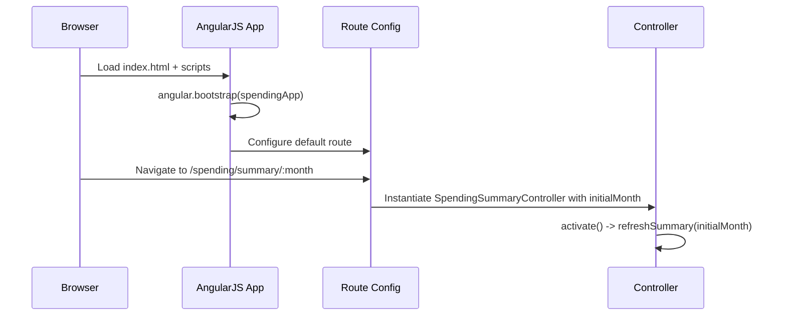
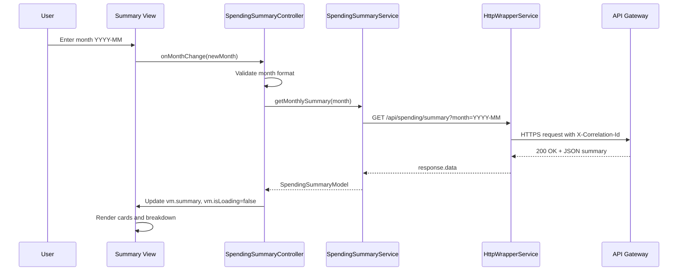
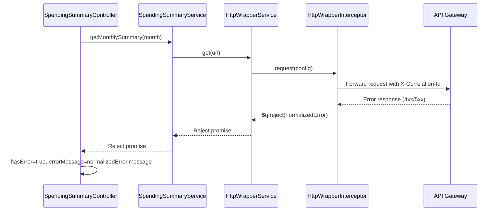
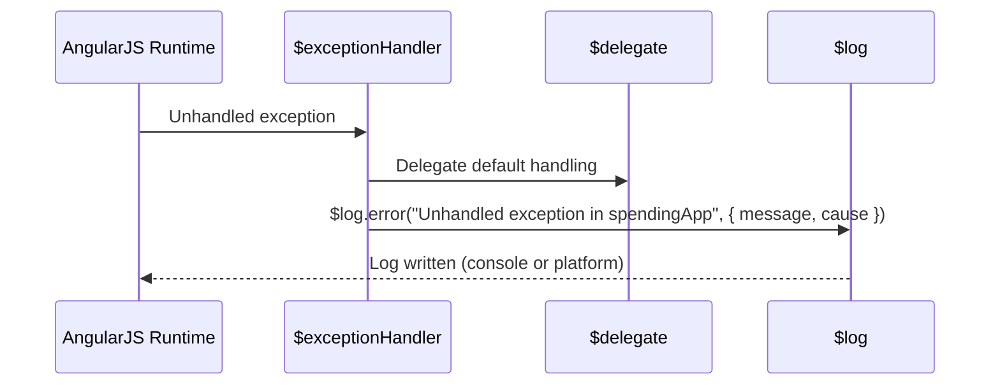

# QE-3172 – Monthly Spending Summary Dashboard LLD

## A. ARCHITECTURE

### A.1 Application Overview

AngularJS 1.x single-page web application module providing a **Monthly Spending Summary Dashboard** for credit card customers.

Technology stack:
- AngularJS 1.x (1.7.x) with `controllerAs` syntax
- ES6 (transpiled to ES5 via Babel or equivalent)
- HTML5, CSS3, Bootstrap 3/4 (CSS only)
- REST APIs over HTTPS (TLS 1.3 assumed at platform level)
- MVC architecture: AngularJS views (templates) → controllers → services → REST APIs

The application consumes a backend "Spending Summary Service" via an API Gateway. It does **not** expose or manage detailed transactions, only monthly aggregates and basic high-level breakdown.

### A.2 AngularJS Modules

1. **Root Module**: `spendingApp`
   - File: `src/app/app.module.js`
   - Responsibilities:
     - Declare main AngularJS module
     - Configure routing, HTTP interceptors, exception handling, environment constants, and feature flags
   - Dependencies: `ngRoute`, `ngAnimate`, `ngSanitize`, `ui.bootstrap` (for date picker if enabled), `spending.summary`, `spending.core`

2. **Feature Module**: `spending.summary`
   - File: `src/app/summary/summary.module.js`
   - Responsibilities:
     - Encapsulate all spending summary dashboard artifacts: controllers, services, directives, views
   - Dependencies: `ngRoute`, `spending.core`

3. **Core Module**: `spending.core`
   - File: `src/app/core/core.module.js`
   - Responsibilities:
     - Provide cross-cutting utilities: configuration, logging wrappers, error handling wrappers, environment service, feature flag service, models
   - Dependencies: `ng` (base Angular)

### A.3 Project Folder Structure

Only `HLD/` and `LLD/` may exist outside `src/`.

```text
APB_Demo/
  HLD/
    QE-3172_HLD.md
  LLD/
    QE-3172_LLD.md
  src/
    index.html
    assets/
      css/
        main.css
      img/
        spending/
          summary-placeholder.png
    app/
      app.module.js
      app.config.js
      app.routes.js
      app.constants.js
      core/
        core.module.js
        config/
          environment.service.js
          feature-flag.service.js
        logging/
          safe-exception-handler.js
          logger.service.js
        models/
          spending-summary.model.js
        services/
          http-wrapper.service.js
          compliance-guard.service.js
      summary/
        summary.module.js
        summary.routes.js
        services/
          spending-summary.service.js
        controllers/
          spending-summary.controller.js
        directives/
          spending-summary-card.directive.js
          spending-breakdown-chart.directive.js
        views/
          spending-summary.view.html
          components/
            spending-summary-card.template.html
            spending-breakdown-chart.template.html
```

### A.4 Component Mapping

**Web Frontend (Spending Dashboard)** → AngularJS artifacts:
- View: `spending-summary.view.html`
- Controller: `SpendingSummaryController`
- Service: `SpendingSummaryService`
- Directives:
  - `spendingSummaryCard` – KPI cards (total spend, transaction count)
  - `spendingBreakdownChart` – high-level breakdown chart
- Models:
  - `SpendingSummaryModel` – JS model describing the monthly summary structure

**API Gateway / Spending Summary Service / Downstream services** → Represented in frontend as REST endpoints and data contracts handled by:
- `SpendingSummaryService` (API consumer)
- `HttpWrapperService` (adds correlation IDs, common headers, basic retries)
- `ComplianceGuardService` (interprets compliance-related flags in responses)

**Configuration & Feature Flag Service** → Frontend abstractions:
- `EnvironmentService` (environment-specific base URLs, timeouts)
- `FeatureFlagService` (client-side flags controlling breakdown visualization, advanced KPIs)

**Monitoring & Alerting / Audit Logging** → Frontend responsibilities:
- `LoggerService` (structured logging to console or remote sink via separate async channel; remote logging not triggered from `$exceptionHandler`)

### A.5 Routing & Navigation

- Route: `/spending/summary/:month`
  - File: `src/app/summary/summary.routes.js`
  - Controller: `SpendingSummaryController as vm`
  - Template: `spending-summary.view.html`
  - Route resolves:
    - `initialMonth`: resolved from route parameter `month` or default to current month in `YYYY-MM` format.

## B. IMPLEMENTATION CONTRACT

### B.1 Root Module & Configuration

#### B.1.1 `src/app/app.module.js`

- Artifact Type: AngularJS module
- Registration:
  ```js
  angular.module('spendingApp', [
    'ngRoute',
    'ngAnimate',
    'ngSanitize',
    'ui.bootstrap',
    'spending.core',
    'spending.summary'
  ]);
  ```
- Responsibility: Declare main app module.
- Public API: N/A (module definition only).
- Dependencies: built-in modules and feature modules only.

#### B.1.2 `src/app/app.constants.js`

- Artifact Type: AngularJS constant
- Registration:
  ```js
  angular.module('spendingApp')
    .constant('APP_CONFIG', {
      apiBaseUrl: '<ENV_INJECTED_API_GATEWAY_BASE_URL>',
      summaryEndpoint: '/api/spending/summary',
      requestTimeoutMs: 15000,
      maxMonthsBack: 12,
      dateFormatMonth: 'YYYY-MM',
      featureFlags: {
        breakdownChartEnabled: true,
        advancedKpiEnabled: false
      }
    });
  ```
- Responsibility:
  - Provide configuration for API URLs, timeouts, allowed months, and feature flags.
- Public fields:
  - `apiBaseUrl` (string)
  - `summaryEndpoint` (string)
  - `requestTimeoutMs` (number)
  - `maxMonthsBack` (number)
  - `dateFormatMonth` (string)
  - `featureFlags` (object)

#### B.1.3 `src/app/app.config.js`

- Artifact Type: AngularJS config block
- Registration:
  ```js
  angular.module('spendingApp')
    .config(appConfig);

  appConfig.$inject = ['$httpProvider', '$provide'];
  function appConfig($httpProvider, $provide) {
    // Attach HTTP interceptor
    $httpProvider.interceptors.push('HttpWrapperInterceptor');

    // Configure safe $exceptionHandler
    $provide.decorator('$exceptionHandler', safeExceptionHandlerDecorator);
  }

  safeExceptionHandlerDecorator.$inject = ['$delegate', '$log'];
  function safeExceptionHandlerDecorator($delegate, $log) {
    return function (exception, cause) {
      // Delegate default behavior
      $delegate(exception, cause);
      // Dependency-safe logging only
      $log.error('Unhandled exception in spendingApp', {
        message: exception && exception.message,
        cause: cause
      });
    };
  }
  ```
- Responsibility:
  - Register HTTP interceptor for correlation IDs, error normalization.
  - Decorate `$exceptionHandler` with dependency-safe logging using only `$delegate` and `$log`.
- Dependencies: `$httpProvider`, `$provide`, `$delegate`, `$log`.

#### B.1.4 `src/app/app.routes.js`

- Artifact Type: AngularJS route configuration
- Registration:
  ```js
  angular.module('spendingApp')
    .config(routeConfig);

  routeConfig.$inject = ['$routeProvider'];
  function routeConfig($routeProvider) {
    $routeProvider
      .otherwise({
        redirectTo: '/spending/summary/' + moment().format('YYYY-MM')
      });
  }
  ```
- Responsibility:
  - Define default route redirecting to current month summary.
- Dependencies: `$routeProvider`, external `moment` library (must be loaded globally).

### B.2 Core Module Artifacts

#### B.2.1 `src/app/core/core.module.js`

- Artifact Type: AngularJS module
- Registration:
  ```js
  angular.module('spending.core', []);
  ```
- Responsibility: Namespace for core utilities and models.

#### B.2.2 `src/app/core/config/environment.service.js`

- Artifact Type: AngularJS service
- Registration:
  ```js
  angular.module('spending.core')
    .service('EnvironmentService', EnvironmentService);

  EnvironmentService.$inject = ['APP_CONFIG'];
  function EnvironmentService(APP_CONFIG) {
    this.getApiBaseUrl = () => APP_CONFIG.apiBaseUrl;
    this.getSummaryEndpoint = () => APP_CONFIG.summaryEndpoint;
    this.getRequestTimeoutMs = () => APP_CONFIG.requestTimeoutMs;
    this.getMaxMonthsBack = () => APP_CONFIG.maxMonthsBack;
    this.getDateFormatMonth = () => APP_CONFIG.dateFormatMonth;
  }
  ```
- Responsibility: Provide environment-aware config access.
- Public methods:
  - `getApiBaseUrl(): string`
  - `getSummaryEndpoint(): string`
  - `getRequestTimeoutMs(): number`
  - `getMaxMonthsBack(): number`
  - `getDateFormatMonth(): string`

#### B.2.3 `src/app/core/config/feature-flag.service.js`

- Artifact Type: AngularJS service
- Registration:
  ```js
  angular.module('spending.core')
    .service('FeatureFlagService', FeatureFlagService);

  FeatureFlagService.$inject = ['APP_CONFIG'];
  function FeatureFlagService(APP_CONFIG) {
    this.isEnabled = (flagName) => !!APP_CONFIG.featureFlags[flagName];
  }
  ```
- Responsibility: Expose feature flag evaluation.
- Public methods:
  - `isEnabled(flagName: string): boolean`

#### B.2.4 `src/app/core/logging/logger.service.js`

- Artifact Type: AngularJS service
- Registration:
  ```js
  angular.module('spending.core')
    .service('LoggerService', LoggerService);

  LoggerService.$inject = ['$log'];
  function LoggerService($log) {
    this.info = (message, context) => $log.info(message, context || {});
    this.warn = (message, context) => $log.warn(message, context || {});
    this.error = (message, context) => $log.error(message, context || {});
  }
  ```
- Responsibility:
  - Provide structured logging abstraction for feature components (not used inside `$exceptionHandler`).
- Public methods:
  - `info(message: string, context?: object)`
  - `warn(message: string, context?: object)`
  - `error(message: string, context?: object)`

#### B.2.5 `src/app/core/models/spending-summary.model.js`

- Artifact Type: ES6 class (AngularJS value or factory)
- Registration:
  ```js
  angular.module('spending.core')
    .factory('SpendingSummaryModel', SpendingSummaryModelFactory);

  function SpendingSummaryModelFactory() {
    class SpendingSummaryModel {
      constructor({
        customerId = null,
        month = null,
        currency = 'USD',
        totalSpend = 0.0,
        transactionCount = 0,
        kpis = [],
        breakdown = [],
        compliance = {},
        meta = {}
      } = {}) {
        this.customerId = customerId; // string | null
        this.month = month; // string (YYYY-MM)
        this.currency = currency; // string
        this.totalSpend = totalSpend; // number
        this.transactionCount = transactionCount; // number
        this.kpis = kpis; // Array<{ key: string, label: string, value: number|string }>
        this.breakdown = breakdown; // Array<{ category: string, amount: number, percentage: number }>
        this.compliance = compliance; // { restricted: boolean, reason?: string }
        this.meta = meta; // { lastUpdated: string, correlationId?: string }
      }
    }
    return SpendingSummaryModel;
  }
  ```
- Responsibility:
  - Represent monthly spending summary data in a structured form for UI binding.
- Public API:
  - Constructor initializing fields with validation-compatible defaults.

#### B.2.6 `src/app/core/services/http-wrapper.service.js`

- Artifact Type: AngularJS service + interceptor
- Registration:
  ```js
  angular.module('spending.core')
    .service('HttpWrapperService', HttpWrapperService)
    .factory('HttpWrapperInterceptor', HttpWrapperInterceptor);

  HttpWrapperService.$inject = ['$http', '$q', 'EnvironmentService'];
  function HttpWrapperService($http, $q, EnvironmentService) {
    this.get = (url, config = {}) => {
      const finalConfig = Object.assign({
        timeout: EnvironmentService.getRequestTimeoutMs()
      }, config);
      return $http.get(url, finalConfig).then(response => response.data);
    };
  }

  HttpWrapperInterceptor.$inject = ['$q'];
  function HttpWrapperInterceptor($q) {
    return {
      request: function (config) {
        // Attach correlation ID header (client-generated UUID)
        const correlationId = generateCorrelationId();
        config.headers = config.headers || {};
        config.headers['X-Correlation-Id'] = correlationId;
        return config;
      },
      responseError: function (rejection) {
        // Normalize error response
        const normalized = {
          status: rejection.status,
          message: (rejection.data && rejection.data.message) || 'Unable to load spending summary.',
          code: (rejection.data && rejection.data.code) || 'SUMMARY_ERROR',
          correlationId: (rejection.headers && rejection.headers('X-Correlation-Id')) || null
        };
        return $q.reject(normalized);
      }
    };

    function generateCorrelationId() {
      // Simple UUIDv4-like generator (no external dependency)
      /* eslint-disable */
      return 'xxxxxxxx-xxxx-4xxx-yxxx-xxxxxxxxxxxx'.replace(/[xy]/g, function (c) {
        var r = Math.random() * 16 | 0, v = c === 'x' ? r : (r & 0x3 | 0x8);
        return v.toString(16);
      });
      /* eslint-enable */
    }
  }
  ```
- Responsibility:
  - Provide HTTP GET wrapper with timeout config.
  - Attach correlation IDs and normalize error responses.
- Public methods:
  - `get(url: string, config?: object): Promise<any>` returning response data.

#### B.2.7 `src/app/core/services/compliance-guard.service.js`

- Artifact Type: AngularJS service
- Registration:
  ```js
  angular.module('spending.core')
    .service('ComplianceGuardService', ComplianceGuardService);

  function ComplianceGuardService() {
    this.isRestricted = (summaryPayload) => !!(summaryPayload && summaryPayload.compliance && summaryPayload.compliance.restricted);
    this.getRestrictionReason = (summaryPayload) => summaryPayload && summaryPayload.compliance && summaryPayload.compliance.reason || null;
  }
  ```
- Responsibility:
  - Interpret compliance-related fields in API responses.
- Public methods:
  - `isRestricted(summaryPayload: object): boolean`
  - `getRestrictionReason(summaryPayload: object): string|null`

### B.3 Summary Module Artifacts

#### B.3.1 `src/app/summary/summary.module.js`

- Artifact Type: AngularJS module
- Registration:
  ```js
  angular.module('spending.summary', ['ngRoute', 'spending.core']);
  ```
- Responsibility: Encapsulate summary feature components.

#### B.3.2 `src/app/summary/summary.routes.js`

- Artifact Type: AngularJS route configuration
- Registration:
  ```js
  angular.module('spending.summary')
    .config(summaryRouteConfig);

  summaryRouteConfig.$inject = ['$routeProvider'];
  function summaryRouteConfig($routeProvider) {
    $routeProvider
      .when('/spending/summary/:month', {
        templateUrl: 'app/summary/views/spending-summary.view.html',
        controller: 'SpendingSummaryController',
        controllerAs: 'vm',
        resolve: {
          initialMonth: ['$route', 'EnvironmentService', function ($route, EnvironmentService) {
            const routeMonth = $route.current.params.month;
            const format = EnvironmentService.getDateFormatMonth();
            // basic validation: YYYY-MM
            const isValid = /^\d{4}-\d{2}$/.test(routeMonth);
            return isValid ? routeMonth : moment().format(format);
          }]
        }
      });
  }
  ```
- Responsibility:
  - Map `/spending/summary/:month` to the summary view and controller.
  - Resolve `initialMonth` with validation.

#### B.3.3 `src/app/summary/services/spending-summary.service.js`

- Artifact Type: AngularJS service
- Registration:
  ```js
  angular.module('spending.summary')
    .service('SpendingSummaryService', SpendingSummaryService);

  SpendingSummaryService.$inject = ['HttpWrapperService', 'EnvironmentService', 'SpendingSummaryModel'];
  function SpendingSummaryService(HttpWrapperService, EnvironmentService, SpendingSummaryModel) {
    this.getMonthlySummary = function (month) {
      const baseUrl = EnvironmentService.getApiBaseUrl();
      const endpoint = EnvironmentService.getSummaryEndpoint();
      const url = baseUrl + endpoint + '?month=' + encodeURIComponent(month);

      return HttpWrapperService.get(url)
        .then(payload => {
          // Map raw payload to model
          return new SpendingSummaryModel({
            customerId: payload.customerId,
            month: payload.month,
            currency: payload.currency,
            totalSpend: payload.totalSpend,
            transactionCount: payload.transactionCount,
            kpis: payload.kpis || [],
            breakdown: payload.breakdown || [],
            compliance: payload.compliance || {},
            meta: payload.meta || {}
          });
        });
    };
  }
  ```
- Responsibility:
  - Retrieve monthly spending summary aggregates from backend and convert to model.
- Public methods:
  - `getMonthlySummary(month: string): Promise<SpendingSummaryModel>`

#### B.3.4 `src/app/summary/controllers/spending-summary.controller.js`

- Artifact Type: AngularJS controller
- Registration:
  ```js
  angular.module('spending.summary')
    .controller('SpendingSummaryController', SpendingSummaryController);

  SpendingSummaryController.$inject = ['initialMonth', 'SpendingSummaryService', 'ComplianceGuardService', 'FeatureFlagService', 'LoggerService'];
  function SpendingSummaryController(initialMonth, SpendingSummaryService, ComplianceGuardService, FeatureFlagService, LoggerService) {
    const vm = this;

    // State variables
    vm.selectedMonth = initialMonth; // string YYYY-MM
    vm.summary = null; // SpendingSummaryModel instance
    vm.isLoading = false;
    vm.hasError = false;
    vm.errorMessage = '';
    vm.isRestricted = false;
    vm.restrictionReason = null;

    // Exposed methods
    vm.onMonthChange = onMonthChange;
    vm.refreshSummary = refreshSummary;

    activate();

    function activate() {
      LoggerService.info('SpendingSummaryController activated', { month: vm.selectedMonth });
      refreshSummary(vm.selectedMonth);
    }

    function onMonthChange(newMonth) {
      if (!/^\d{4}-\d{2}$/.test(newMonth)) {
        vm.hasError = true;
        vm.errorMessage = 'Invalid month format. Please use YYYY-MM.';
        return;
      }
      vm.selectedMonth = newMonth;
      refreshSummary(newMonth);
    }

    function refreshSummary(month) {
      vm.isLoading = true;
      vm.hasError = false;
      vm.errorMessage = '';
      vm.isRestricted = false;
      vm.restrictionReason = null;

      SpendingSummaryService.getMonthlySummary(month)
        .then(function (summaryModel) {
          vm.summary = summaryModel;
          vm.isRestricted = ComplianceGuardService.isRestricted(summaryModel);
          vm.restrictionReason = ComplianceGuardService.getRestrictionReason(summaryModel);

          if (vm.isRestricted) {
            LoggerService.warn('Summary restricted by compliance', { month: month, reason: vm.restrictionReason });
          }
        })
        .catch(function (error) {
          vm.hasError = true;
          vm.errorMessage = error.message || 'We were unable to load your summary right now. Please try again later.';
          LoggerService.error('Error loading spending summary', { month: month, error: error });
        })
        .finally(function () {
          vm.isLoading = false;
        });
    }
  }
  ```
- Responsibility:
  - Manage UI state for monthly summary: loading, error, compliance restriction.
  - Handle month selection changes.
- Public methods (bound to view):
  - `vm.onMonthChange(newMonth: string)`
  - `vm.refreshSummary(month: string)`
- State variables:
  - `vm.selectedMonth`, `vm.summary`, `vm.isLoading`, `vm.hasError`, `vm.errorMessage`, `vm.isRestricted`, `vm.restrictionReason`.

#### B.3.5 `src/app/summary/directives/spending-summary-card.directive.js`

- Artifact Type: AngularJS directive (component-like)
- Registration:
  ```js
  angular.module('spending.summary')
    .directive('spendingSummaryCard', spendingSummaryCard);

  function spendingSummaryCard() {
    return {
      restrict: 'E',
      scope: {
        summary: '=', // SpendingSummaryModel two-way binding
      },
      templateUrl: 'app/summary/views/components/spending-summary-card.template.html'
    };
  }
  ```
- Responsibility:
  - Render KPI cards for total spend and transaction count.
- Bindings:
  - `summary` (`=` two-way) – instance of `SpendingSummaryModel` provided by controller.

#### B.3.6 `src/app/summary/directives/spending-breakdown-chart.directive.js`

- Artifact Type: AngularJS directive
- Registration:
  ```js
  angular.module('spending.summary')
    .directive('spendingBreakdownChart', spendingBreakdownChart);

  spendingBreakdownChart.$inject = ['FeatureFlagService'];
  function spendingBreakdownChart(FeatureFlagService) {
    return {
      restrict: 'E',
      scope: {
        breakdown: '=', // Array<{ category, amount, percentage }>
      },
      templateUrl: 'app/summary/views/components/spending-breakdown-chart.template.html',
      link: function (scope) {
        scope.breakdownChartEnabled = FeatureFlagService.isEnabled('breakdownChartEnabled');
      }
    };
  }
  ```
- Responsibility:
  - Render high-level breakdown visualization when feature flag is enabled.
- Bindings:
  - `breakdown` (`=`) – array of breakdown entries from `SpendingSummaryModel.breakdown`.

### B.4 Views & Templates

#### B.4.1 `src/app/summary/views/spending-summary.view.html`

- Artifact Type: HTML template
- Responsibility:
  - Main dashboard layout, binding to `SpendingSummaryController` (`vm`).
- Key bindings:
  - `vm.selectedMonth` (ng-model)
  - `vm.onMonthChange(month)`
  - `vm.isLoading`, `vm.hasError`, `vm.errorMessage`, `vm.summary`, `vm.isRestricted`, `vm.restrictionReason`

- Expected structure (implementation-ready skeleton):

  ```html
  <div class="container spending-summary" ng-cloak>
    <div class="row">
      <div class="col-md-12">
        <h2>Monthly Credit Card Spending Summary</h2>
      </div>
    </div>

    <div class="row">
      <div class="col-md-4">
        <label for="monthInput">Select Month (YYYY-MM)</label>
        <input id="monthInput" type="text" class="form-control" ng-model="vm.selectedMonth" ng-change="vm.onMonthChange(vm.selectedMonth)" placeholder="YYYY-MM" />
      </div>
    </div>

    <div class="row" ng-show="vm.isLoading">
      <div class="col-md-12 text-center">
        <span class="text-muted">Loading summary...</span>
      </div>
    </div>

    <div class="row" ng-show="vm.hasError">
      <div class="col-md-12">
        <div class="alert alert-danger" role="alert">{{ vm.errorMessage }}</div>
      </div>
    </div>

    <div class="row" ng-show="vm.isRestricted && !vm.hasError">
      <div class="col-md-12">
        <div class="alert alert-warning" role="alert">
          Summary for {{ vm.selectedMonth }} is limited due to compliance restrictions.
          <span ng-if="vm.restrictionReason">Reason: {{ vm.restrictionReason }}</span>
        </div>
      </div>
    </div>

    <div class="row" ng-show="!vm.isLoading && !vm.hasError && vm.summary">
      <div class="col-md-6">
        <spending-summary-card summary="vm.summary"></spending-summary-card>
      </div>
      <div class="col-md-6">
        <spending-breakdown-chart breakdown="vm.summary.breakdown"></spending-breakdown-chart>
      </div>
    </div>
  </div>
  ```

#### B.4.2 `src/app/summary/views/components/spending-summary-card.template.html`

- Artifact Type: HTML template
- Responsibility:
  - Render total spend and transaction count.
- Bindings:
  - `summary.totalSpend`, `summary.transactionCount`, `summary.currency`, `summary.kpis`

- Implementation skeleton:

  ```html
  <div class="panel panel-default spending-summary-card" ng-if="summary">
    <div class="panel-heading">Summary for {{ summary.month }}</div>
    <div class="panel-body">
      <div class="row">
        <div class="col-xs-6">
          <h4>Total Spend</h4>
          <p class="lead">{{ summary.totalSpend | currency:summary.currency }}</p>
        </div>
        <div class="col-xs-6">
          <h4>Number of Transactions</h4>
          <p class="lead">{{ summary.transactionCount }}</p>
        </div>
      </div>
      <div class="row" ng-if="summary.kpis.length">
        <div class="col-xs-12">
          <h5>Key Metrics</h5>
          <ul class="list-unstyled">
            <li ng-repeat="kpi in summary.kpis">
              <strong>{{ kpi.label }}:</strong> {{ kpi.value }}
            </li>
          </ul>
        </div>
      </div>
    </div>
  </div>
  ```

#### B.4.3 `src/app/summary/views/components/spending-breakdown-chart.template.html`

- Artifact Type: HTML template
- Responsibility:
  - Render simple breakdown list or chart conditioned on feature flag.
- Bindings:
  - `breakdownChartEnabled`, `breakdown`

- Implementation skeleton:

  ```html
  <div class="spending-breakdown" ng-if="breakdownChartEnabled && breakdown && breakdown.length">
    <h4>High-Level Breakdown</h4>
    <table class="table table-striped">
      <thead>
        <tr>
          <th>Category</th>
          <th class="text-right">Amount</th>
          <th class="text-right">Percentage</th>
        </tr>
      </thead>
      <tbody>
        <tr ng-repeat="item in breakdown">
          <td>{{ item.category }}</td>
          <td class="text-right">{{ item.amount | currency }}</td>
          <td class="text-right">{{ item.percentage | number:1 }}%</td>
        </tr>
      </tbody>
    </table>
  </div>
  <div ng-if="!breakdownChartEnabled">
    <p class="text-muted">Breakdown view is currently disabled.</p>
  </div>
  ```

### B.5 Assets

#### B.5.1 `src/assets/css/main.css`

- Artifact Type: CSS
- Responsibility:
  - Minimal styling for spending summary components.
- Example rules (implementation-ready):

  ```css
  .spending-summary {
    margin-top: 20px;
  }

  .spending-summary-card .panel-body {
    padding: 15px;
  }

  .spending-breakdown table {
    margin-top: 10px;
  }
  ```

## C. BUSINESS AND DATA FLOW

### C.1 End-to-End Flow

1. **User Action**: User navigates to `/spending/summary/:month` or default route; enters or changes month (YYYY-MM) in input.
2. **View → Controller**:
   - Input field bound to `vm.selectedMonth` (`ng-model`).
   - `ng-change` triggers `vm.onMonthChange(vm.selectedMonth)`.
3. **Controller → Service**:
   - `onMonthChange` validates format; if valid, calls `refreshSummary(newMonth)`.
   - `refreshSummary` calls `SpendingSummaryService.getMonthlySummary(month)`.
4. **Service → API**:
   - `SpendingSummaryService` builds URL: `EnvironmentService.getApiBaseUrl() + EnvironmentService.getSummaryEndpoint() + '?month=' + month`.
   - `HttpWrapperService.get()` sends GET request via `$http`.
   - `HttpWrapperInterceptor` attaches `X-Correlation-Id` header.
5. **API → Service**:
   - API Gateway and backend return JSON payload (see section D.1).
   - `HttpWrapperService` resolves with `response.data`.
   - `SpendingSummaryService` constructs `SpendingSummaryModel`.
6. **Service → Controller**:
   - Promise resolves in controller `then` block; `vm.summary` set to model.
   - `ComplianceGuardService` checks restrictions; sets `vm.isRestricted` and `vm.restrictionReason`.
7. **Controller → View**:
   - `vm.isLoading`, `vm.hasError`, `vm.summary`, `vm.isRestricted` drive conditional sections.
   - `spending-summary-card` and `spending-breakdown-chart` directives receive data via bindings.

### C.2 State Variables & Transitions

- **`vm.selectedMonth`**: user-selected month.
  - Initial: `initialMonth` resolved from route.
  - Transitions: changed via user input; validated in `onMonthChange`.

- **`vm.isLoading`**:
  - `true` when `refreshSummary` starts.
  - `false` in `finally` after API resolves/rejects.

- **`vm.hasError` / `vm.errorMessage`**:
  - Set to `false`/empty at start of `refreshSummary`.
  - On `catch(error)`, `hasError = true`, `errorMessage = normalized message`.

- **`vm.summary`**:
  - Holds current `SpendingSummaryModel`.
  - Set in `then(summaryModel)`; cleared only if new request or error occurs (implementation choice: controller may leave stale data on error; recommended to leave stale data visible with error banner).

- **`vm.isRestricted` / `vm.restrictionReason`**:
  - Set using `ComplianceGuardService` after summary retrieval.
  - Drives compliance banner section.

### C.3 Validation Rules

- Month input:
  - Format must be `YYYY-MM` (`^\d{4}-\d{2}$`).
  - Optional additional client-side check: `0 < month <= maxMonthsBack` using `EnvironmentService.getMaxMonthsBack()` and current date.
- No free-form filters or transaction-level search are exposed.
- Client performs only lightweight validation; authoritative checks enforced server-side (not described in LLD, but assumed).

### C.4 Business Logic Ownership

- UI (controller/directives):
  - Owns display logic: toggling loading, error, compliance banners.
  - Computes no financial aggregates; uses backend-provided numbers.

- Backend (Spending Summary Service, Transaction Aggregation):
  - Owns calculation of `totalSpend`, `transactionCount`, KPI values, breakdown percentages.

- Compliance behavior in UI:
  - If `compliance.restricted === true`, UI shows banner and still shows permitted data (payload may be partial).

### C.5 Error & Loading States

- Loading:
  - `vm.isLoading` shows "Loading summary..." message and may hide main content.

- Error:
  - When API error, show red alert with generic text: `vm.errorMessage`.
  - Do not expose internal codes or stack traces.

- Fallback:
  - If feature flag disables breakdown chart, show informative message that breakdown is disabled.

## D. API AND DATA CONTRACTS

### D.1 Spending Summary API Endpoint

- Endpoint: `GET {APP_CONFIG.apiBaseUrl}{APP_CONFIG.summaryEndpoint}?month={YYYY-MM}`
- HTTP Method: `GET`
- Transport: HTTPS (TLS 1.3; enforced by platform, not Angular code).

#### D.1.1 Request

- Query parameters:
  - `month` (string, required): month in `YYYY-MM` format.

- Headers (added automatically or via environment):
  - `Authorization: Bearer <access_token>` – set by hosting environment or additional interceptor (not defined here, assumed existing).
  - `X-Correlation-Id: <uuid>` – set by `HttpWrapperInterceptor`.

- Body: none.

#### D.1.2 Success Response Structure (HTTP 200)

JSON object:

```json
{
  "customerId": "C1234567890",
  "month": "2025-06",
  "currency": "USD",
  "totalSpend": 1234.56,
  "transactionCount": 42,
  "kpis": [
    { "key": "avg_ticket", "label": "Average Transaction", "value": 29.39 },
    { "key": "max_ticket", "label": "Largest Transaction", "value": 250.00 }
  ],
  "breakdown": [
    { "category": "Groceries", "amount": 300.00, "percentage": 24.3 },
    { "category": "Utilities", "amount": 150.00, "percentage": 12.1 },
    { "category": "Travel", "amount": 400.00, "percentage": 32.4 }
  ],
  "compliance": {
    "restricted": false,
    "reason": null
  },
  "meta": {
    "lastUpdated": "2025-06-30T23:59:59Z",
    "correlationId": "uuid-from-backend"
  }
}
```

Field types:
- `customerId`: string (masked or pseudonymous; not rendered in UI)
- `month`: string (YYYY-MM)
- `currency`: string (ISO currency code)
- `totalSpend`: number
- `transactionCount`: number
- `kpis`: array of `{ key: string, label: string, value: number|string }`
- `breakdown`: array of `{ category: string, amount: number, percentage: number }`
- `compliance`: `{ restricted: boolean, reason?: string }`
- `meta`: `{ lastUpdated: string (ISO-8601), correlationId?: string }`

#### D.1.3 Error Response Structure (HTTP 4xx/5xx)

Backend error JSON (before normalization):

```json
{
  "code": "SUMMARY_NOT_AVAILABLE",
  "message": "Summary temporarily unavailable.",
  "correlationId": "uuid-from-backend"
}
```

Normalized error returned to controller by `HttpWrapperInterceptor`:

```json
{
  "status": 503,
  "message": "Summary temporarily unavailable.",
  "code": "SUMMARY_NOT_AVAILABLE",
  "correlationId": "uuid-from-backend"
}
```

### D.2 Retry, Timeout, Fallback Behavior (Frontend)

- Timeout:
  - `HttpWrapperService` sets timeout to `APP_CONFIG.requestTimeoutMs` (e.g., 15000ms).

- Retries:
  - The frontend does not perform automatic retries to avoid duplicate operations; retries are handled server-side (circuit breaker). User may retry by reloading page or changing month.

- Fallback:
  - On error, show generic message and keep last successful summary visible (implementation recommended though not strictly enforced by LLD – controller may optionally not clear `vm.summary`).

### D.3 JavaScript Model Validation Rules

`SpendingSummaryModel` validations (implicit by usage):
- `month` must be non-null and match `YYYY-MM` to be considered valid for display.
- `totalSpend` and `transactionCount` default to `0` if missing.
- `breakdown` must be an array; if not, UI `ng-repeat` will simply render nothing.

## E. CODE GENERATION DETAILS

### E.1 AngularJS Registration & Syntax

- Use `angular.module('moduleName').service(...)`, `.controller(...)`, `.directive(...)`, `.factory(...)`, `.constant(...)`, `.config(...)`.
- Use `controllerAs: 'vm'` in routes and templates.
- Dependency injection annotations must use `$inject` arrays to remain minification-safe.

### E.2 ES6 Usage

- ES6 class used for `SpendingSummaryModel`, transpiled to ES5 in build pipeline.
- Arrow functions used in services where appropriate.
- No `import`/`export` statements directly; AngularJS DI handles module wiring.

### E.3 Promises

- Use AngularJS `$q` and `$http` promises.
- Interceptors return `$q.reject(normalizedError)` for error path.
- Controllers and services use `.then()`, `.catch()`, `.finally()`.

### E.4 DOM Manipulation Rules

- Use AngularJS templates, bindings, and directives only.
- Do not use direct DOM APIs (`document.querySelector`, jQuery) inside controllers or services.
- All visual logic should be within directives/components.

### E.5 Configuration & Environment Variables

- `APP_CONFIG` constant holds environment-agnostic defaults.
- Real values injected at build or runtime from environment (e.g., replaced during deployment).
- `EnvironmentService` reads constant values for use in code.

### E.6 Feature Flags

- `APP_CONFIG.featureFlags` defines feature toggles.
- `FeatureFlagService.isEnabled('breakdownChartEnabled')` drives breakdown chart visibility.
- Additional flags can be added with minimal changes confined to `APP_CONFIG` and UI logic.

### E.7 Required External Libraries

- AngularJS 1.7.x
- `angular-route` for routing
- `angular-animate`, `angular-sanitize`
- Bootstrap CSS (3.x or 4.x)
- `moment.js` (loaded globally) for month formatting

## F. ERROR HANDLING AND DEPENDENCY SAFETY

### F.1 Error Handling Strategy

- Global `$exceptionHandler` decorated for safe logging using `$delegate` and `$log` only.
- Feature components use `LoggerService` for structured logging outside exception handler.
- API errors normalized by `HttpWrapperInterceptor` and exposed to controller via `catch(error)`.
- User-facing errors are generic, non-sensitive messages.

### F.2 Dependency Graph & Safety

- `$exceptionHandler` decorator (`safeExceptionHandlerDecorator`) depends only on:
  - `$delegate`
  - `$log`

- `LoggerService` depends only on `$log`.
- `HttpWrapperService` depends on `$http`, `$q`, `EnvironmentService` (no controllers or directives).
- `SpendingSummaryService` depends on `HttpWrapperService`, `EnvironmentService`, `SpendingSummaryModel`.
- `SpendingSummaryController` depends on services and route resolve; no downward dependencies.
- Directives depend on `FeatureFlagService` or only isolated scope; no controllers or services depending on directives.

This ensures:
- No service depends on controllers or directives.
- No cycles: controllers → services → core services; core services do not depend on feature modules.

### F.3 Logging & Telemetry

- Remote telemetry (if added) must be performed asynchronously outside `$exceptionHandler` via `LoggerService` using non-blocking mechanisms.
- No synchronous remote logging from `$exceptionHandler`.

### F.4 Recovery & Fallback

- On API failures, UI shows error message, may keep last summary visible, and allows user retries.
- If breakdown is disabled by feature flag or missing from response, UI displays alternative message.

## G. SECURITY

### G.1 Input Validation & Sanitization

- Month input validated client-side with regex.
- No free-text fields are used, minimizing XSS risk from user input.
- AngularJS `ngSanitize` available for any future rich text but not used here.

### G.2 XSS Prevention

- AngularJS automatic escaping in bindings (`{{ }}`) prevents script injection.
- No HTML constructed from untrusted data; if future content requires HTML, must pass through sanitation before `ng-bind-html`.

### G.3 Authentication & Authorization Integration

- Frontend expects valid `Authorization` header attached by hosting application or separate auth interceptor (outside this epic).
- No client-side authorization logic beyond hiding features; actual access control happens server-side.

### G.4 Secure API Communication

- All API calls go to `APP_CONFIG.apiBaseUrl` over HTTPS.
- No direct communication to downstream services; UI interacts only with gateway endpoint.

### G.5 Sensitive Data & Logging Restrictions

- `SpendingSummaryController` and `LoggerService` must not log full customer identifiers; any `customerId` in payload should not be logged.
- Log context objects should contain only month, error codes, and correlation IDs.

### G.6 CSRF Protection

- API is idempotent GET; CSRF risk minimal but mitigated at platform level (same-site cookies, tokens). No additional CSRF logic required in AngularJS for this endpoint.

## H. DIAGRAMS (MERMAID)

### H.1 Application Initialization



### H.2 Primary User Workflow



### H.3 API Interaction & Error Handling



### H.4 Global Exception Handling


