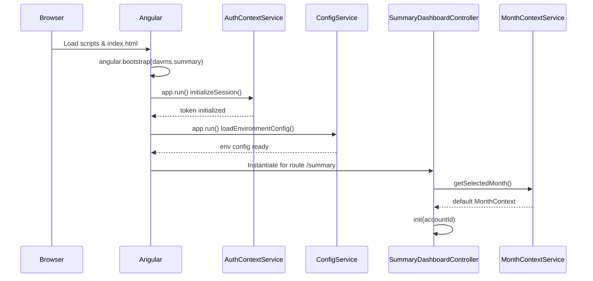
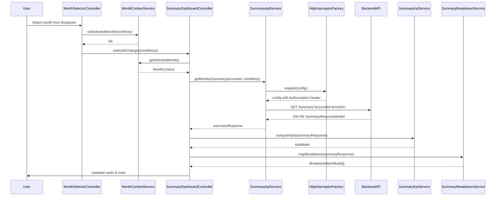

# Low-Level Design (LLD) – QE-3179 – DAVMS Monthly Spending Summary Dashboard

## 1. Application Architecture

### 1.1 Technology Stack & Constraints
- **Client Application**: Enterprise AngularJS 1.x single-page application.
- **Language & Standards**: ES6 (transpiled to ES5 for AngularJS), HTML5, CSS3, Bootstrap.
- **Architecture Pattern**: AngularJS MVC on top of RESTful backend services.
- **Root Directory**: `src/` for all front-end code.
- **Key AngularJS Constraints**:
  - **Module Declaration Rule**: `davms.summary` AngularJS module is declared **once** using array syntax (`angular.module('davms.summary', [...])`) in `app.module.js`. All other files use getter syntax (`angular.module('davms.summary')`).
  - Dependency graph must be **acyclic**. Infrastructure services (`LoggingService`, `ErrorHandlingService`, `ConfigService`, `HttpInterceptorFactory`) form a DAG with no cycles.
  - `HttpInterceptorFactory` must **not** depend on `$http`.
  - `LoggingService` must lazily resolve `$http` (via `$injector`) to avoid tight coupling.
  - Startup/bootstrap services must not depend on services that require `$http`.

### 1.2 AngularJS Modules & Dependency Graph

#### 1.2.1 Modules
- **Root Feature Module**: `davms.summary`
- **Dependencies**:
  - `ngRoute` – for routing.
  - `ngAnimate` – for chart/transition animations.
  - `ui.bootstrap` – Bootstrap components.

There is **one** module:
- `davms.summary` (feature module and root module for this epic).

All components are registered on `davms.summary`.

#### 1.2.2 Dependency Graph (Acyclic)

Nodes (services/controllers/directives/factories):
- **Infrastructure**:
  - `ConfigService`
  - `LoggingService`
  - `ErrorHandlingService`
  - `HttpInterceptorFactory`
- **Domain / Data**:
  - `AuthContextService` (startup, no `$http`)
  - `MonthContextService`
  - `SummaryApiService`
  - `SummaryKpiService`
  - `SummaryBreakdownService`
- **UI Controllers**:
  - `SummaryDashboardController`
  - `MonthSelectorController`
- **Directives/Components**:
  - `davmsSummaryCards`
  - `davmsSummaryChart`

Edges (dependencies):
- `ConfigService` → none (reads from constants/env object).
- `LoggingService` → `$injector`, `ConfigService` (lazy `$http`).
- `ErrorHandlingService` → `LoggingService`, `$window`.
- `HttpInterceptorFactory` → `$q`, `LoggingService`, `ErrorHandlingService`, `AuthContextService`, `ConfigService` (**no `$http`**).
- `AuthContextService` → `ConfigService` (uses runtime config; no `$http`).
- `MonthContextService` → `ConfigService`.
- `SummaryApiService` → `$http`, `ConfigService`, `LoggingService`, `ErrorHandlingService`, `MonthContextService`.
- `SummaryKpiService` → none (pure computation).
- `SummaryBreakdownService` → `ConfigService` (category mapping), `LoggingService`.
- `SummaryDashboardController` → `SummaryApiService`, `SummaryKpiService`, `SummaryBreakdownService`, `LoggingService`, `ErrorHandlingService`, `MonthContextService`.
- `MonthSelectorController` → `MonthContextService`, `SummaryApiService`, `LoggingService`.
- `davmsSummaryCards` (directive) → none (isolated scope; bound through attributes).
- `davmsSummaryChart` (directive) → none (chart lib via global `Chart`/D3).

There are **no cycles**:
- Infra layer is at the bottom: `ConfigService` → `LoggingService` → `ErrorHandlingService` → `HttpInterceptorFactory`.
- Domain/data services depend only on infra.
- Controllers depend on domain and infra.
- Directives depend only on controllers (via scope bindings) and primitives.

### 1.3 Folder Structure (Under `src/`)

```text
src/
  index.html
  app/
    app.module.js
    app.config.js
    app.routes.js
    app.run.js

  common/
    config/
      config.service.js
    logging/
      logging.service.js
    error/
      error-handling.service.js
    http/
      http-interceptor.factory.js
    auth/
      auth-context.service.js

  features/
    summary/
      controllers/
        summary-dashboard.controller.js
        month-selector.controller.js
      services/
        month-context.service.js
        summary-api.service.js
        summary-kpi.service.js
        summary-breakdown.service.js
      directives/
        summary-cards.directive.js
        summary-chart.directive.js
      views/
        summary-dashboard.view.html

  assets/
    css/
      summary-dashboard.css
    img/
      ...

  env/
    env.config.dev.js
    env.config.prod.js
```

All files are owned by the `davms.summary` module, declared only in `app.module.js`.

---

## 2. Component Registry

Flat registry mapping Canonical Name → implementation.

| Canonical Name                 | Type        | File Path                                         | Registered On Module | Registration Form                      |
|--------------------------------|------------|--------------------------------------------------|----------------------|----------------------------------------|
| davms.summary.module           | module      | `src/app/app.module.js`                          | n/a                  | `angular.module('davms.summary', [...])` |
| davms.summary.config           | config      | `src/app/app.config.js`                          | `davms.summary`      | `angular.module('davms.summary').config(...)` |
| davms.summary.routes           | config      | `src/app/app.routes.js`                          | `davms.summary`      | `angular.module('davms.summary').config(...)` |
| davms.summary.run              | run         | `src/app/app.run.js`                             | `davms.summary`      | `angular.module('davms.summary').run(...)` |
| ConfigService                  | service     | `src/common/config/config.service.js`            | `davms.summary`      | `.service('ConfigService', ConfigService)` |
| LoggingService                 | service     | `src/common/logging/logging.service.js`          | `davms.summary`      | `.service('LoggingService', LoggingService)` |
| ErrorHandlingService           | service     | `src/common/error/error-handling.service.js`     | `davms.summary`      | `.service('ErrorHandlingService', ErrorHandlingService)` |
| HttpInterceptorFactory         | factory     | `src/common/http/http-interceptor.factory.js`    | `davms.summary`      | `.factory('HttpInterceptorFactory', HttpInterceptorFactory)` |
| AuthContextService             | service     | `src/common/auth/auth-context.service.js`        | `davms.summary`      | `.service('AuthContextService', AuthContextService)` |
| MonthContextService            | service     | `src/features/summary/services/month-context.service.js` | `davms.summary` | `.service('MonthContextService', MonthContextService)` |
| SummaryApiService              | service     | `src/features/summary/services/summary-api.service.js` | `davms.summary` | `.service('SummaryApiService', SummaryApiService)` |
| SummaryKpiService              | service     | `src/features/summary/services/summary-kpi.service.js` | `davms.summary` | `.service('SummaryKpiService', SummaryKpiService)` |
| SummaryBreakdownService        | service     | `src/features/summary/services/summary-breakdown.service.js` | `davms.summary` | `.service('SummaryBreakdownService', SummaryBreakdownService)` |
| SummaryDashboardController     | controller  | `src/features/summary/controllers/summary-dashboard.controller.js` | `davms.summary` | `.controller('SummaryDashboardController', SummaryDashboardController)` |
| MonthSelectorController        | controller  | `src/features/summary/controllers/month-selector.controller.js` | `davms.summary` | `.controller('MonthSelectorController', MonthSelectorController)` |
| davmsSummaryCards              | directive   | `src/features/summary/directives/summary-cards.directive.js` | `davms.summary` | `.directive('davmsSummaryCards', davmsSummaryCards)` |
| davmsSummaryChart              | directive   | `src/features/summary/directives/summary-chart.directive.js` | `davms.summary` | `.directive('davmsSummaryChart', davmsSummaryChart)` |

All canonical names will appear in the bootstrap script-order list and route targets.

---

## 3. Component Specifications

### 3.1 Module & Bootstrap Components

#### 3.1.1 `davms.summary.module`
- **Type**: AngularJS module.
- **File**: `src/app/app.module.js`
- **Registration Line**:
  ```js
  angular.module('davms.summary', ['ngRoute', 'ngAnimate', 'ui.bootstrap']);
  ```
- **Responsibility**:
  - Declare the root feature module for the DAVMS Monthly Spending Summary Dashboard.
  - Wire core AngularJS dependencies.
- **Public Methods**: N/A.
- **Injected Services**: none.

#### 3.1.2 `davms.summary.config`
- **Type**: config block.
- **File**: `src/app/app.config.js`
- **Registration Line**:
  ```js
  angular.module('davms.summary').config(appConfig);
  ```
- **Responsibility**:
  - Configure `$httpProvider` to use `HttpInterceptorFactory`.
  - Configure global behaviors such as default headers.
- **Function**:
  ```js
  appConfig.$inject = ['$httpProvider'];
  function appConfig($httpProvider) {
    $httpProvider.interceptors.push('HttpInterceptorFactory');
  }
  ```

#### 3.1.3 `davms.summary.routes`
- **Type**: config block.
- **File**: `src/app/app.routes.js`
- **Registration Line**:
  ```js
  angular.module('davms.summary').config(routesConfig);
  ```
- **Responsibility**:
  - Register routes for the summary dashboard.
- **Route Table**:
  ```js
  routesConfig.$inject = ['$routeProvider'];
  function routesConfig($routeProvider) {
    $routeProvider
      .when('/summary', {
        templateUrl: 'features/summary/views/summary-dashboard.view.html',
        controller: 'SummaryDashboardController',
        controllerAs: 'vm'
      })
      .otherwise({
        redirectTo: '/summary'
      });
  }
  ```

#### 3.1.4 `davms.summary.run`
- **Type**: run block.
- **File**: `src/app/app.run.js`
- **Registration Line**:
  ```js
  angular.module('davms.summary').run(appRun);
  ```
- **Responsibility**:
  - Initialize authentication context.
  - Preload configuration and safe defaults for month selection.
- **Function**:
  ```js
  appRun.$inject = ['AuthContextService', 'ConfigService'];
  function appRun(AuthContextService, ConfigService) {
    AuthContextService.initializeSession(); // no $http inside
    ConfigService.loadEnvironmentConfig();  // reads env constants only
  }
  ```

Startup services (`AuthContextService`, `ConfigService`) do not depend on `$http`.

---

### 3.2 Infrastructure Services

#### 3.2.1 `ConfigService`
- **Type**: service.
- **File**: `src/common/config/config.service.js`
- **Registration Line**:
  ```js
  angular.module('davms.summary').service('ConfigService', ConfigService);
  ```
- **Responsibility**:
  - Provide environment configuration (base URLs, feature flags, limits).
  - Abstracts access to `window.__DAVMS_ENV__` or Angular constants.
- **Public Methods**:
  - `getApiBaseUrl()` → string: base URL for DAVMS Summary API.
  - `getFeatureFlag(flagKey)` → boolean.
  - `getMaxHistoryMonths()` → number.
  - `loadEnvironmentConfig()` → void (no HTTP; just verify env object).
- **Inputs/Outputs**:
  - Inputs: none (uses global env object).
  - Outputs: primitive values.
- **Injected Services**: none.
- **Implementation Sketch**:
  ```js
  ConfigService.$inject = [];
  function ConfigService() {
    const env = window.__DAVMS_ENV__ || {};

    this.getApiBaseUrl = () => env.API_BASE_URL || '/api';
    this.getFeatureFlag = (key) => !!(env.FEATURE_FLAGS && env.FEATURE_FLAGS[key]);
    this.getMaxHistoryMonths = () => env.MAX_HISTORY_MONTHS || 12;
    this.loadEnvironmentConfig = () => { /* no-op or validation */ };
  }
  ```

#### 3.2.2 `LoggingService`
- **Type**: service.
- **File**: `src/common/logging/logging.service.js`
- **Registration Line**:
  ```js
  angular.module('davms.summary').service('LoggingService', LoggingService);
  ```
- **Responsibility**:
  - Centralize client-side logging.
  - Optionally send logs to backend logging endpoint lazily via `$http`.
- **Public Methods**:
  - `info(message, context)`
  - `warn(message, context)`
  - `error(message, context)`
  - `flush()` – optional shipping of buffered logs.
- **Inputs/Outputs**:
  - Inputs: message strings, optional context objects.
  - Outputs: console logs; optional POST to logging API.
- **Injected Services**: `$injector`, `ConfigService`.
- **Lazy `$http` Resolution**:
  ```js
  LoggingService.$inject = ['$injector', 'ConfigService'];
  function LoggingService($injector, ConfigService) {
    const buffer = [];

    this.info = (msg, ctx) => log('INFO', msg, ctx);
    this.warn = (msg, ctx) => log('WARN', msg, ctx);
    this.error = (msg, ctx) => log('ERROR', msg, ctx);
    this.flush = () => {
      const $http = $injector.get('$http'); // lazy resolution
      const url = ConfigService.getApiBaseUrl() + '/client-log';
      if (buffer.length) {
        return $http.post(url, { entries: buffer.slice() })
          .finally(() => buffer.length = 0);
      }
    };

    function log(level, msg, ctx) {
      const entry = { level, msg, ctx: ctx || {}, ts: Date.now() };
      console[level === 'ERROR' ? 'error' : 'log'](entry);
      buffer.push(entry);
    }
  }
  ```

#### 3.2.3 `ErrorHandlingService`
- **Type**: service.
- **File**: `src/common/error/error-handling.service.js`
- **Registration Line**:
  ```js
  angular.module('davms.summary').service('ErrorHandlingService', ErrorHandlingService);
  ```
- **Responsibility**:
  - Map HTTP and client errors to user-friendly messages.
  - Coordinate logging with `LoggingService`.
- **Public Methods**:
  - `handleHttpError(response)` → { userMessage, severity, code }.
  - `handleClientException(ex, context)` → same structure.
- **Injected Services**: `LoggingService`, `$window`.
- **Implementation Sketch**:
  ```js
  ErrorHandlingService.$inject = ['LoggingService', '$window'];
  function ErrorHandlingService(LoggingService, $window) {
    this.handleHttpError = (response) => {
      const status = response.status;
      let userMessage = 'An unexpected error occurred.';

      if (status === 400) userMessage = 'Your request appears invalid. Please check your month selection.';
      else if (status === 401) userMessage = 'Your session has expired. Please sign in again.';
      else if (status === 403) userMessage = 'You are not authorized to view this account summary.';
      else if (status === 404) userMessage = 'No summary could be found for the selected month.';

      const errorDescriptor = { code: status, userMessage, severity: status >= 500 ? 'high' : 'normal' };
      LoggingService.error('HTTP_ERROR', { response, errorDescriptor });
      return errorDescriptor;
    };

    this.handleClientException = (ex, context) => {
      const errorDescriptor = { code: 'CLIENT_EXCEPTION', userMessage: 'Something went wrong while showing your summary.', severity: 'high' };
      LoggingService.error('CLIENT_EXCEPTION', { ex, context });
      return errorDescriptor;
    };
  }
  ```

#### 3.2.4 `HttpInterceptorFactory`
- **Type**: factory.
- **File**: `src/common/http/http-interceptor.factory.js`
- **Registration Line**:
  ```js
  angular.module('davms.summary').factory('HttpInterceptorFactory', HttpInterceptorFactory);
  ```
- **Responsibility**:
  - Attach auth tokens to outgoing API requests.
  - Perform retry logic for transient server/network issues (restricted to DAVMS APIs).
  - Delegate error mapping to `ErrorHandlingService`.
- **Public Methods** (Angular interceptor object):
  - `request(config)`
  - `response(response)`
  - `responseError(rejection)`
- **Injected Services**: `$q`, `LoggingService`, `ErrorHandlingService`, `AuthContextService`, `ConfigService`.
- **Constraints**: Must **not** inject `$http`.
- **Implementation Sketch**:
  ```js
  HttpInterceptorFactory.$inject = ['$q', 'LoggingService', 'ErrorHandlingService', 'AuthContextService', 'ConfigService'];
  function HttpInterceptorFactory($q, LoggingService, ErrorHandlingService, AuthContextService, ConfigService) {
    const apiBase = ConfigService.getApiBaseUrl();

    return {
      request(config) {
        if (config.url && config.url.indexOf(apiBase) === 0) {
          const token = AuthContextService.getToken();
          if (token) {
            config.headers = config.headers || {};
            config.headers['Authorization'] = 'Bearer ' + token;
          }
        }
        return config;
      },
      response(response) {
        return response;
      },
      responseError(rejection) {
        const mapped = ErrorHandlingService.handleHttpError(rejection);
        LoggingService.warn('API_RESPONSE_ERROR', { mapped });
        return $q.reject(rejection);
      }
    };
  }
  ```

#### 3.2.5 `AuthContextService`
- **Type**: service.
- **File**: `src/common/auth/auth-context.service.js`
- **Registration Line**:
  ```js
  angular.module('davms.summary').service('AuthContextService', AuthContextService);
  ```
- **Responsibility**:
  - Maintain session token and basic auth state.
  - Provide token to HTTP interceptor.
- **Public Methods**:
  - `initializeSession()` – read token from secure cookie/JS variable (no `$http`).
  - `getToken()` – return in-memory token string.
  - `isAuthenticated()` – boolean.
- **Injected Services**: `ConfigService`.
- **Implementation Sketch**:
  ```js
  AuthContextService.$inject = ['ConfigService'];
  function AuthContextService(ConfigService) {
    let token = null;

    this.initializeSession = () => {
      // Implement token retrieval from secure, http-only cookie via server bootstrap or similar.
      token = window.__DAVMS_TOKEN__ || null;
    };

    this.getToken = () => token;
    this.isAuthenticated = () => !!token;
  }
  ```

---

### 3.3 Domain & Data Services

#### 3.3.1 `MonthContextService`
- **Type**: service.
- **File**: `src/features/summary/services/month-context.service.js`
- **Registration Line**:
  ```js
  angular.module('davms.summary').service('MonthContextService', MonthContextService);
  ```
- **Responsibility**:
  - Manage the currently selected month and convert UI selection into canonical `YYYY-MM` and date ranges.
  - Enforce month selection rules (history limit, no far-future months).
- **Public Methods**:
  - `getAvailableMonths()` → `Array<MonthContext>`.
  - `setSelectedMonth(monthKey)`.
  - `getSelectedMonth()` → `MonthContext`.
- **Injected Services**: `ConfigService`.
- **Implementation Sketch**:
  ```js
  MonthContextService.$inject = ['ConfigService'];
  function MonthContextService(ConfigService) {
    const maxMonths = ConfigService.getMaxHistoryMonths();
    let selectedMonth = null;
    const months = buildMonths();

    this.getAvailableMonths = () => months.slice();
    this.setSelectedMonth = (monthKey) => {
      const found = months.find(m => m.key === monthKey);
      if (found) {
        selectedMonth = found;
      }
    };
    this.getSelectedMonth = () => selectedMonth || months[0];

    function buildMonths() {
      const result = [];
      const now = new Date();
      for (let i = 0; i < maxMonths; i++) {
        const d = new Date(now.getFullYear(), now.getMonth() - i, 1);
        const key = d.getFullYear() + '-' + pad(d.getMonth() + 1);
        result.push({
          key,
          label: d.toLocaleString(undefined, { month: 'short', year: 'numeric' }),
          startDate: new Date(d.getFullYear(), d.getMonth(), 1),
          endDate: new Date(d.getFullYear(), d.getMonth() + 1, 0)
        });
      }
      return result;
    }

    function pad(n) { return (n < 10 ? '0' : '') + n; }
  }
  ```

#### 3.3.2 `SummaryApiService`
- **Type**: service.
- **File**: `src/features/summary/services/summary-api.service.js`
- **Registration Line**:
  ```js
  angular.module('davms.summary').service('SummaryApiService', SummaryApiService);
  ```
- **Responsibility**:
  - Integrate with the DAVMS Monthly Spending Summary backend API.
  - Provide methods to retrieve monthly summary for a given credit card account and month.
- **Public Methods**:
  - `getMonthlySummary(accountId, monthKey)` → Promise resolving to `SummaryResponseModel`.
- **Injected Services**: `$http`, `ConfigService`, `LoggingService`, `ErrorHandlingService`, `MonthContextService`.
- **Implementation Sketch**:
  ```js
  SummaryApiService.$inject = ['$http', 'ConfigService', 'LoggingService', 'ErrorHandlingService', 'MonthContextService'];
  function SummaryApiService($http, ConfigService, LoggingService, ErrorHandlingService, MonthContextService) {
    const baseUrl = ConfigService.getApiBaseUrl();

    this.getMonthlySummary = (accountId, monthKey) => {
      const month = monthKey || MonthContextService.getSelectedMonth().key;
      const url = `${baseUrl}/summary`;
      const params = { accountId, month };

      LoggingService.info('REQUEST_MONTHLY_SUMMARY', { accountId, month });

      return $http.get(url, { params })
        .then(response => response.data)
        .catch(err => {
          const mapped = ErrorHandlingService.handleHttpError(err);
          return Promise.reject(mapped);
        });
    };
  }
  ```

#### 3.3.3 `SummaryKpiService`
- **Type**: service.
- **File**: `src/features/summary/services/summary-kpi.service.js`
- **Registration Line**:
  ```js
  angular.module('davms.summary').service('SummaryKpiService', SummaryKpiService);
  ```
- **Responsibility**:
  - Compute summary KPIs (total spend, transaction count, average transaction value) from the backend response.
- **Public Methods**:
  - `computeKpis(summaryResponse)` → `KpiModel`.
- **Injected Services**: none.
- **Implementation Sketch**:
  ```js
  SummaryKpiService.$inject = [];
  function SummaryKpiService() {
    this.computeKpis = (summaryResponse) => {
      const totalAmount = summaryResponse.totalAmount || 0;
      const transactionCount = summaryResponse.transactionCount || 0;
      const averageTransactionValue = transactionCount > 0 ? totalAmount / transactionCount : 0;

      return {
        totalAmount,
        transactionCount,
        averageTransactionValue,
        currency: summaryResponse.currency || 'USD'
      };
    };
  }
  ```

#### 3.3.4 `SummaryBreakdownService`
- **Type**: service.
- **File**: `src/features/summary/services/summary-breakdown.service.js`
- **Registration Line**:
  ```js
  angular.module('davms.summary').service('SummaryBreakdownService', SummaryBreakdownService);
  ```
- **Responsibility**:
  - Transform backend breakdown entries into UI-ready models.
  - Enforce coarse granularity (e.g., category groups, online vs in-store).
- **Public Methods**:
  - `mapBreakdown(summaryResponse)` → `Array<BreakdownItemModel>`.
- **Injected Services**: `ConfigService`, `LoggingService`.
- **Implementation Sketch**:
  ```js
  SummaryBreakdownService.$inject = ['ConfigService', 'LoggingService'];
  function SummaryBreakdownService(ConfigService, LoggingService) {
    this.mapBreakdown = (summaryResponse) => {
      const rawItems = summaryResponse.breakdown || [];
      const mapped = rawItems.map(item => ({
        categoryCode: item.categoryCode,
        categoryLabel: item.categoryLabel,
        amount: item.amount,
        percentage: item.percentage
      }));

      LoggingService.info('BREAKDOWN_MAPPED', { count: mapped.length });
      return mapped;
    };
  }
  ```

---

### 3.4 Controllers

#### 3.4.1 `SummaryDashboardController`
- **Type**: controller.
- **File**: `src/features/summary/controllers/summary-dashboard.controller.js`
- **Registration Line**:
  ```js
  angular.module('davms.summary').controller('SummaryDashboardController', SummaryDashboardController);
  ```
- **Responsibility**:
  - Orchestrate the view for the monthly spending summary dashboard.
  - Request summary data and bind KPIs and breakdown to cards and charts.
  - Handle loading and error states.
- **Public Methods / ViewModel**:
  - `vm.init(accountId)` – initialize dashboard.
  - `vm.onMonthChanged(monthKey)` – triggered by month selector component.
- **Inputs/Outputs**:
  - Inputs: `accountId` (from route params or parent context), `monthKey` from selector.
  - Outputs: `vm.kpis`, `vm.breakdownItems`, `vm.error`, `vm.isLoading`.
- **Injected Services**: `SummaryApiService`, `SummaryKpiService`, `SummaryBreakdownService`, `LoggingService`, `ErrorHandlingService`, `MonthContextService`.
- **Implementation Sketch**:
  ```js
  SummaryDashboardController.$inject = ['SummaryApiService', 'SummaryKpiService', 'SummaryBreakdownService', 'LoggingService', 'ErrorHandlingService', 'MonthContextService'];
  function SummaryDashboardController(SummaryApiService, SummaryKpiService, SummaryBreakdownService, LoggingService, ErrorHandlingService, MonthContextService) {
    const vm = this;

    vm.kpis = null;
    vm.breakdownItems = [];
    vm.error = null;
    vm.isLoading = false;
    vm.selectedMonth = MonthContextService.getSelectedMonth();

    vm.init = init;
    vm.onMonthChanged = onMonthChanged;

    function init(accountId) {
      vm.accountId = accountId;
      loadSummary();
    }

    function onMonthChanged(monthKey) {
      MonthContextService.setSelectedMonth(monthKey);
      vm.selectedMonth = MonthContextService.getSelectedMonth();
      loadSummary();
    }

    function loadSummary() {
      vm.isLoading = true;
      vm.error = null;
      const monthKey = vm.selectedMonth.key;

      SummaryApiService.getMonthlySummary(vm.accountId, monthKey)
        .then(data => {
          vm.kpis = SummaryKpiService.computeKpis(data);
          vm.breakdownItems = SummaryBreakdownService.mapBreakdown(data);
        })
        .catch(mappedError => {
          vm.error = mappedError.userMessage;
          LoggingService.error('DASHBOARD_LOAD_FAILED', { mappedError });
        })
        .finally(() => {
          vm.isLoading = false;
        });
    }
  }
  ```

#### 3.4.2 `MonthSelectorController`
- **Type**: controller.
- **File**: `src/features/summary/controllers/month-selector.controller.js`
- **Registration Line**:
  ```js
  angular.module('davms.summary').controller('MonthSelectorController', MonthSelectorController);
  ```
- **Responsibility**:
  - Provide month selection UI state and behavior.
  - Emit selection changes to parent scope / dashboard.
- **Public Methods / ViewModel**:
  - `vm.months` – list of available months.
  - `vm.selectedMonthKey`.
  - `vm.onChange()` – handler when user selects a different month.
- **Inputs/Outputs**:
  - Inputs: `onMonthChange` callback (via `&` binding in directive or `ng-change`).
  - Outputs: calls `onMonthChange({ monthKey: vm.selectedMonthKey })`.
- **Injected Services**: `MonthContextService`, `LoggingService`.
- **Implementation Sketch**:
  ```js
  MonthSelectorController.$inject = ['MonthContextService', 'LoggingService'];
  function MonthSelectorController(MonthContextService, LoggingService) {
    const vm = this;

    vm.months = MonthContextService.getAvailableMonths();
    vm.selectedMonthKey = MonthContextService.getSelectedMonth().key;
    vm.onChange = onChange;

    function onChange() {
      LoggingService.info('MONTH_SELECTION_CHANGED', { monthKey: vm.selectedMonthKey });
      if (typeof vm.onMonthChange === 'function') {
        vm.onMonthChange({ monthKey: vm.selectedMonthKey });
      }
    }
  }
  ```

---

### 3.5 Directives / Components

#### 3.5.1 `davmsSummaryCards`
- **Type**: directive.
- **File**: `src/features/summary/directives/summary-cards.directive.js`
- **Registration Line**:
  ```js
  angular.module('davms.summary').directive('davmsSummaryCards', davmsSummaryCards);
  ```
- **Responsibility**:
  - Render summary KPI cards: total spend, transaction count, average spend.
- **Public API (Directive Scope)**:
  - `kpis` (`=` binding) – `KpiModel`.
- **Injected Services**: none.
- **Implementation Sketch**:
  ```js
  function davmsSummaryCards() {
    return {
      restrict: 'E',
      scope: {
        kpis: '='
      },
      templateUrl: 'features/summary/views/summary-cards.partial.html'
    };
  }
  ```

#### 3.5.2 `davmsSummaryChart`
- **Type**: directive.
- **File**: `src/features/summary/directives/summary-chart.directive.js`
- **Registration Line**:
  ```js
  angular.module('davms.summary').directive('davmsSummaryChart', davmsSummaryChart);
  ```
- **Responsibility**:
  - Render a basic breakdown chart (e.g., donut chart of spend by category group).
- **Public API (Directive Scope)**:
  - `items` (`=` binding) – `Array<BreakdownItemModel>`.
- **Injected Services**: none (uses global chart library).
- **Implementation Sketch**:
  ```js
  function davmsSummaryChart() {
    return {
      restrict: 'E',
      scope: {
        items: '='
      },
      templateUrl: 'features/summary/views/summary-chart.partial.html',
      link: function(scope, element) {
        scope.$watch('items', function(newItems) {
          if (!newItems || !newItems.length) { return; }
          // Render chart via third-party library (e.g., Chart.js) using newItems.
        });
      }
    };
  }
  ```

---

## 4. Component Responsibilities (Logic Ownership)

- **ConfigService**: Owns environment configuration, max history window, and feature flags. It guarantees that month selection and API base URL are consistent with enterprise deployment.
- **LoggingService**: Owns client-side logging, including audit-style logs for dashboard access, month changes, and breakdown mapping events.
- **ErrorHandlingService**: Owns mapping from backend status codes and client exceptions to user-facing error messages, ensuring no internal implementation details leak to the UI.
- **HttpInterceptorFactory**: Owns cross-cutting HTTP concerns – attaching auth token headers, central error interception, and basic retry semantics (if extended) in an acyclic manner.
- **AuthContextService**: Owns the snapshot of the current auth token, delegating actual authentication to the platform. It does not perform login itself.
- **MonthContextService**: Owns the month list and the currently selected month. It codifies business rules for allowed months (history bounds, no future months) and acts as the client-side analog to the backend Month Selection & Context Service.
- **SummaryApiService**: Owns the HTTP integration with the backend Monthly Spending Summary API. It exposes a single stable method to request summary data for a given account and month, enforcing read-only behavior.
- **SummaryKpiService**: Owns transformation of summary response into KPIs appropriate for display.
- **SummaryBreakdownService**: Owns transformation and filtering of breakdown data; ensures that only coarse categories and summary metrics are shown.
- **SummaryDashboardController**: Owns high-level dashboard orchestration – fetches data, maps to KPIs and breakdown, coordinates loading, and error UI states.
- **MonthSelectorController**: Owns month selection UI state and communication of changes back to dashboard.
- **davmsSummaryCards Directive**: Owns visual structure of KPI cards.
- **davmsSummaryChart Directive**: Owns visual structure of breakdown chart; interacts with charting library.

---

## 5. Interface Specifications

### 5.1 Client–Backend REST API

#### 5.1.1 Endpoint: GET Monthly Summary

- **HTTP Method**: `GET`
- **URL (relative)**: `${ConfigService.getApiBaseUrl()}/summary`
- **Query Parameters**:
  - `accountId` (string, required): credit card account identifier.
  - `month` (string, required): canonical month key `YYYY-MM`.
- **Headers**:
  - `Authorization: Bearer <token>` – attached by `HttpInterceptorFactory`.
- **Request Validation (client-side)**:
  - `accountId` provided by banking portal context; client does not generate arbitrary IDs.
  - `month` obtained from `MonthContextService` and restricted to list of allowed months.

##### Response: 200 OK

```json
{
  "accountId": "1234567890",
  "month": "2026-06",
  "currency": "USD",
  "totalAmount": 1234.56,
  "transactionCount": 42,
  "breakdown": [
    {
      "categoryCode": "FOOD",
      "categoryLabel": "Food & Dining",
      "amount": 300.0,
      "percentage": 24.3
    },
    {
      "categoryCode": "ONLINE",
      "categoryLabel": "Online Purchases",
      "amount": 450.0,
      "percentage": 36.5
    }
  ]
}
```

##### Error Responses

- `400 Bad Request` – invalid `month` format or unsupported product type.
- `401 Unauthorized` – missing/invalid token.
- `403 Forbidden` – user not authorized to view account.
- `404 Not Found` – no summary data for given month.
- `500 Internal Server Error` – generic backend error.

Client uses `ErrorHandlingService.handleHttpError` to map errors.

### 5.2 Internal Component Interactions

- **SummaryDashboardController → SummaryApiService**:
  - `SummaryApiService.getMonthlySummary(accountId, monthKey)` returns a promise of `SummaryResponseModel`.
- **SummaryDashboardController → SummaryKpiService**:
  - `SummaryKpiService.computeKpis(summaryResponse)` returns `KpiModel`.
- **SummaryDashboardController → SummaryBreakdownService**:
  - `SummaryBreakdownService.mapBreakdown(summaryResponse)` returns `Array<BreakdownItemModel>`.
- **SummaryDashboardController → MonthContextService**:
  - Reads/writes selected month.
- **MonthSelectorController → MonthContextService**:
  - Reads available months and current selection.
- **MonthSelectorController → SummaryDashboardController**:
  - Calls callback `onMonthChange({ monthKey })` to trigger data reload.
- **HttpInterceptorFactory → AuthContextService**:
  - `AuthContextService.getToken()` to attach auth header.
- **HttpInterceptorFactory → ErrorHandlingService**:
  - `ErrorHandlingService.handleHttpError(rejection)` for mapping.
- **SummaryBreakdownService → LoggingService**:
  - Informational log on breakdown mapping.

---

## 6. Data Model Design

### 6.1 JavaScript Models

Models are represented as plain objects; the following schemas describe attributes and validation.

#### 6.1.1 `MonthContext`

```js
/**
 * @typedef {Object} MonthContext
 * @property {string} key        - Month key in YYYY-MM.
 * @property {string} label      - Human-readable label (e.g., "Jun 2026").
 * @property {Date}   startDate  - Start date of the month/billing cycle.
 * @property {Date}   endDate    - End date of the month/billing cycle.
 */
```

- **Validation**:
  - `key` must match `/^\d{4}-(0[1-9]|1[0-2])$/`.
  - `startDate <= endDate`.

#### 6.1.2 `SummaryResponseModel`

```js
/**
 * @typedef {Object} SummaryResponseModel
 * @property {string} accountId
 * @property {string} month         - YYYY-MM
 * @property {string} currency
 * @property {number} totalAmount
 * @property {number} transactionCount
 * @property {Array<BreakdownItemModel>} breakdown
 */
```

- **Validation**:
  - `totalAmount >= 0`.
  - `transactionCount >= 0` and integer.

#### 6.1.3 `KpiModel`

```js
/**
 * @typedef {Object} KpiModel
 * @property {number} totalAmount
 * @property {number} transactionCount
 * @property {number} averageTransactionValue
 * @property {string} currency
 */
```

#### 6.1.4 `BreakdownItemModel`

```js
/**
 * @typedef {Object} BreakdownItemModel
 * @property {string} categoryCode    - Coarse category code.
 * @property {string} categoryLabel   - Display label.
 * @property {number} amount          - Amount in `currency`.
 * @property {number} percentage      - Percentage of total spend.
 */
```

- **Validation**:
  - `amount >= 0`.
  - `0 <= percentage <= 100`.

### 6.2 State Transitions

- **Month Selection State**:
  - On app run, `MonthContextService` builds `months[]` and defaults `selectedMonth` to the latest month.
  - When user selects a different month, `selectedMonth` transitions to that `MonthContext` and triggers summary reload.

- **Dashboard Data State**:
  - Initial: `kpis = null`, `breakdownItems = []`, `error = null`, `isLoading = true`.
  - On successful API response: `kpis` and `breakdownItems` set from services; `error = null`.
  - On error: `kpis` may stay stale or null; `breakdownItems = []`; `error` set from mapped error.

---

## 7. Data Flow – User Action to UI Update

### 7.1 Primary Flow: Month Selection & Summary Retrieval

1. **User navigates** to `#/summary` route.
2. AngularJS bootstraps `davms.summary` and instantiates `SummaryDashboardController`.
3. `app.run` executes `AuthContextService.initializeSession()` and `ConfigService.loadEnvironmentConfig()`.
4. `SummaryDashboardController` initializes with current `accountId` (passed from parent context/route) and reads default `selectedMonth` from `MonthContextService`.
5. `SummaryDashboardController` calls `SummaryApiService.getMonthlySummary(accountId, selectedMonth.key)`.
6. `HttpInterceptorFactory.request()` attaches auth token and logs request.
7. Browser sends `GET /summary?accountId=...&month=YYYY-MM` over HTTPS.
8. Backend validates token, authorizes user, resolves month to date range, and composes summary response.
9. Client receives response (200 OK). Angular `$http` resolves promise.
10. `SummaryDashboardController` passes response to `SummaryKpiService.computeKpis` to generate `KpiModel`.
11. `SummaryDashboardController` passes response to `SummaryBreakdownService.mapBreakdown` to get breakdown items.
12. `SummaryDashboardController` binds `vm.kpis` and `vm.breakdownItems`.
13. `davmsSummaryCards` directive renders KPI cards.
14. `davmsSummaryChart` directive renders breakdown chart.
15. UI reflects monthly total spend, KPIs, and breakdown.

### 7.2 Alternate Flow: Month Change

1. User opens month selector (controlled by `MonthSelectorController`).
2. User selects a new month from dropdown.
3. `MonthSelectorController.onChange()` updates `MonthContextService` and calls `onMonthChange({ monthKey })` callback.
4. `SummaryDashboardController.onMonthChanged(monthKey)` sets `MonthContextService.setSelectedMonth(monthKey)` and calls `loadSummary()`.
5–15. Same as steps in primary flow, using new month key.

---

## 8. Application Bootstrap & Wiring

### 8.1 Root Module & ng-app Placement

- **Root AngularJS Module Name**: `davms.summary`.
- **`ng-app` Placement**: On root `<html>` or a specific `<div>` container in `src/index.html`.

```html
<!DOCTYPE html>
<html lang="en" ng-app="davms.summary">
<head>
  <meta charset="UTF-8">
  <title>DAVMS Monthly Spending Summary</title>
  <link rel="stylesheet" href="assets/css/bootstrap.min.css">
  <link rel="stylesheet" href="assets/css/summary-dashboard.css">
</head>
<body>
  <div class="container" ng-view></div>

  <!-- Script tags; see order below -->
</body>
</html>
```

- **ng-view Mount Point**: `<div class="container" ng-view></div>`.

### 8.2 Route Table

- Defined in `app.routes.js` (see 3.1.3). There is a single route:
  - Path: `/summary`
  - Template: `features/summary/views/summary-dashboard.view.html`
  - Controller: `SummaryDashboardController`

### 8.3 Script Tag Loading Order (1:1:1 Mapping)

All entries correspond to registry components and maintain a direct mapping to HLD components.

```html
<script src="lib/angular/angular.min.js"></script>
<script src="lib/angular-route/angular-route.min.js"></script>
<script src="lib/angular-animate/angular-animate.min.js"></script>
<script src="lib/angular-ui-bootstrap/ui-bootstrap-tpls.min.js"></script>

<!-- Module declaration (single file with array syntax) -->
<script src="app/app.module.js"></script>

<!-- App configuration & routing -->
<script src="app/app.config.js"></script>
<script src="app/app.routes.js"></script>
<script src="app/app.run.js"></script>

<!-- Infrastructure services (acyclic; no $http in startup) -->
<script src="common/config/config.service.js"></script>
<script src="common/logging/logging.service.js"></script>
<script src="common/error/error-handling.service.js"></script>
<script src="common/auth/auth-context.service.js"></script>
<script src="common/http/http-interceptor.factory.js"></script>

<!-- Feature: summary -->
<script src="features/summary/services/month-context.service.js"></script>
<script src="features/summary/services/summary-api.service.js"></script>
<script src="features/summary/services/summary-kpi.service.js"></script>
<script src="features/summary/services/summary-breakdown.service.js"></script>
<script src="features/summary/controllers/summary-dashboard.controller.js"></script>
<script src="features/summary/controllers/month-selector.controller.js"></script>
<script src="features/summary/directives/summary-cards.directive.js"></script>
<script src="features/summary/directives/summary-chart.directive.js"></script>
```

Every registry entry has a corresponding script tag; there are no unregistered files in this epic.

---

## 9. Sequence Diagrams (Mermaid)

### 9.1 App Initialization & Bootstrap



### 9.2 Primary User Workflow – Month Selection & Summary Retrieval



---

## 10. Implementation Details

### 10.1 ES6 Coding Patterns

- Use `const`/`let` instead of `var` inside services and controllers.
- Use arrow functions for internal helpers where appropriate, but keep top-level AngularJS functions named for DI and testability.
- Prefer promises (`.then/.catch/.finally`) over callbacks.

Example service with `$inject` array syntax:

```js
class ExampleService {
  constructor($http) {
    this.$http = $http;
  }

  getSomething() {
    return this.$http.get('/api/something').then(res => res.data);
  }
}

ExampleService.$inject = ['$http'];
angular.module('davms.summary').service('ExampleService', ExampleService);
```

For this epic we primarily use function-style services for consistency.

### 10.2 Module Declaration Rule Enforcement

- Only `app.module.js` contains:
  ```js
  angular.module('davms.summary', ['ngRoute', 'ngAnimate', 'ui.bootstrap']);
  ```
- All other files use:
  ```js
  angular.module('davms.summary')
    .service('X', X);
  ```

This prevents inadvertent re-declaration of modules and ensures a single source of module dependencies.

---

## 11. Configuration

### 11.1 Environment Config Files

- `src/env/env.config.dev.js`
- `src/env/env.config.prod.js`

Each file populates `window.__DAVMS_ENV__`:

```js
window.__DAVMS_ENV__ = {
  API_BASE_URL: 'https://dev.api.bank.com/davms',
  MAX_HISTORY_MONTHS: 12,
  FEATURE_FLAGS: {
    SHOW_BREAKDOWN_CHART: true
  },
  TELEMETRY: {
    ENABLE_CLIENT_LOGGING: true,
    LOG_ENDPOINT: 'https://dev.api.bank.com/davms/client-log'
  }
};
```

### 11.2 App Config Settings

- In `ConfigService`:
  - `API_BASE_URL` – base for summary API.
  - `MAX_HISTORY_MONTHS` – restricts month list.
  - `FEATURE_FLAGS.SHOW_BREAKDOWN_CHART` – toggles chart directive visibility.

### 11.3 Feature Flags

- Example usage in view:

```html
<div ng-if="vm.kpis">
  <davms-summary-cards kpis="vm.kpis"></davms-summary-cards>
</div>
<div ng-if="vm.breakdownItems.length && vm.featureFlags.SHOW_BREAKDOWN_CHART">
  <davms-summary-chart items="vm.breakdownItems"></davms-summary-chart>
</div>
```

### 11.4 Telemetry Configs

- `TELEMETRY.ENABLE_CLIENT_LOGGING` controls whether `LoggingService` flushes logs to backend.
- `TELEMETRY.LOG_ENDPOINT` is used inside `LoggingService.flush()` when sending logs.

---

## 12. Error Handling & Resiliency

- **Client Exception Mapping**:
  - All `$http` errors intercepted by `HttpInterceptorFactory` and mapped by `ErrorHandlingService`.
- **REST API Retries**:
  - `HttpInterceptorFactory` can be extended to retry transient errors (e.g., status 502/503) for idempotent GET requests.
- **Logging**:
  - All serious errors recorded via `LoggingService.error()`.
- **Fallback Behaviors**:
  - If breakdown is missing but KPIs exist, `SummaryDashboardController` renders KPI cards and hides chart; an informational message can be shown.
  - If API fails entirely, user sees a non-technical error message and is prompted to retry.

Example partial error UI snippet:

```html
<div class="alert alert-danger" ng-if="vm.error">
  {{ vm.error }}
</div>
```

---

## 13. Security Considerations

### 13.1 Input Sanitization

- User-selected month comes only from `MonthContextService` (not free-form input), mitigating injection risk.
- No direct user input for `accountId`; it is provided by secure portal context.

### 13.2 Secure Communication

- All calls to `${API_BASE_URL}` must be HTTPS.
- Browser should enforce HSTS; enforced at platform level.

### 13.3 Authentication & Authorization Hooks

- `AuthContextService` exposes `getToken()` for interceptor; no custom credential handling.
- Backend enforces product-level authorization; client does not attempt to bypass or weaken checks.

### 13.4 Audit Logs & Observability

- `LoggingService` logs:
  - Dashboard load events.
  - Month selection changes.
  - API error outcomes.
- These logs can be shipped to backend for centralized audit and monitoring (subject to configuration).

### 13.5 Data Minimization

- UI only renders aggregated summary metrics and coarse breakdown labels as provided by backend.
- No raw PAN, PII, or per-transaction details are exposed in this epic.

---

## 14. Consistency & Validation

- **1:1:1 Mapping**:
  - HLD components (Web UI, Month Selection Service, KPI Service, Breakdown Service, Summary API integration) are mapped to AngularJS components in this LLD.
  - Each component is registered in the Component Registry and listed in script-order.
  - Routes (`/summary`) reference `SummaryDashboardController` by canonical name.
- **Dependency Constraints**:
  - `HttpInterceptorFactory` does not depend on `$http`.
  - `LoggingService` lazily resolves `$http` via `$injector`.
  - Startup services (`AuthContextService`, `ConfigService`) contain no `$http` dependencies.
  - Infrastructure graph is acyclic.

This LLD is implementation-ready under `src/` for an enterprise AngularJS 1.x application delivering the DAVMS Monthly Spending Summary Dashboard for Epic QE-3179.
