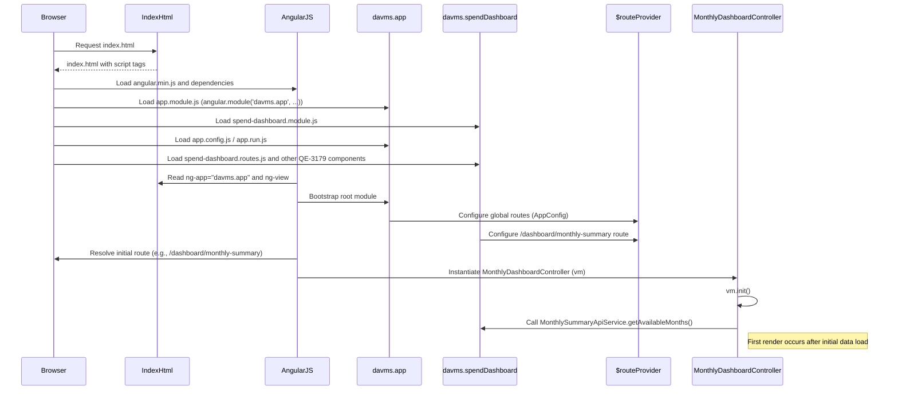
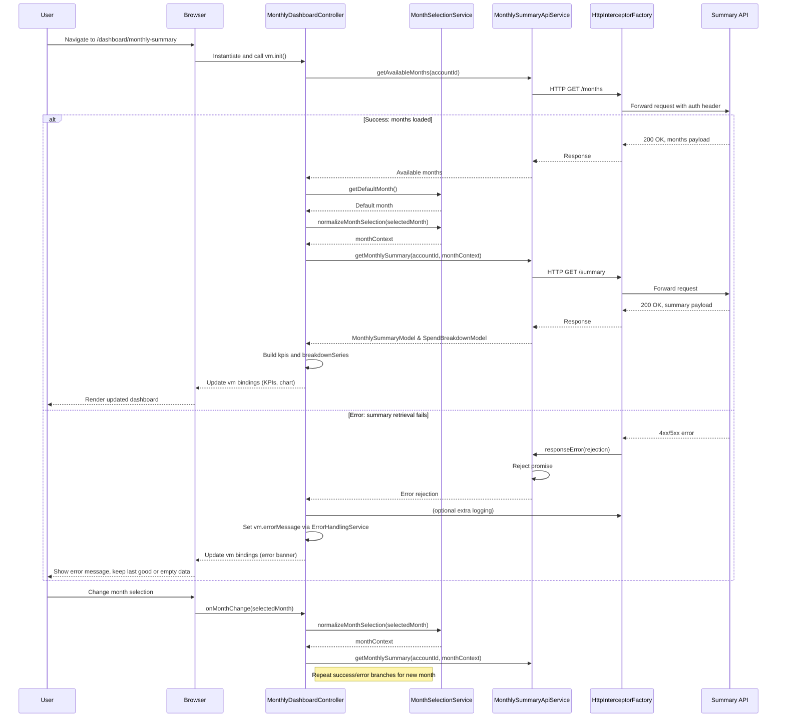

# Low-Level Design (LLD) – QE-3179 DAVMS Monthly Spending Summary Dashboard

---

## 1. Application Architecture

### 1.1 Technology Stack

- **Frontend Framework**: AngularJS (Angular 1.x) using MVC pattern
- **Language**: JavaScript ES6 (transpiled/bundled where needed to run on AngularJS 1.x)
- **Markup & Styling**: HTML5, CSS3, Bootstrap 3/4 (per enterprise standard)
- **Routing**: `ngRoute`
- **Architecture**: Client-side MVC layered over REST APIs; service layer for API orchestration; strict separation of concerns.

### 1.2 AngularJS MVC Mapping for QE-3179

The QE-3179 epic is implemented as a self-contained feature module within the DAVMS web application, focused on the Monthly Spending Summary Dashboard.

**Root Application Module**
- `davms.app` – root AngularJS module for the DAVMS application; aggregates feature modules (including QE-3179 dashboard).

**Feature Module for QE-3179**
- `davms.spendDashboard` – AngularJS module responsible for:
  - Monthly spending summary view & user interaction
  - Month selection handling
  - REST API calls to the Monthly Spending Summary backend
  - Mapping API response data to UI view-models

**Primary AngularJS Artifacts for QE-3179**

- **Modules**
  - `davms.app`
  - `davms.spendDashboard`

- **Controllers**
  - `MonthlyDashboardController` – owns the Monthly Spending Summary dashboard page logic.

- **Services**
  - `MonthlySummaryApiService` – REST client for Monthly Spending Summary API.
  - `MonthSelectionService` – client-side utility/service for month selection normalization and constraints (in sync with backend Month Selection & Context Service semantics).
  - `KpiComputationService` – client-side helper for composing and formatting KPIs from API responses (presentation-focused, not authoritative for financial math).
  - `SpendBreakdownMapperService` – maps backend breakdown data to view-friendly structures (chart series, tiles).
  - `LoggingService` – wraps browser logging and integration hooks with centralized logging endpoints.
  - `ErrorHandlingService` – centralizes client-side error interpretation and user messaging.
  - `ConfigService` – loads client configuration (API base URLs, feature flags).

- **Directives**
  - `monthSelector` – reusable UI control for selecting a month (billing cycle / calendar month) for spending summary.
  - `summaryKpiCards` – renders KPI tiles/cards.
  - `basicSpendBreakdownChart` – renders high-level spend breakdown as chart/cards.

- **Factories**
  - `HttpInterceptorFactory` – attaches auth tokens, handles HTTP-level errors globally (ties into ErrorHandlingService).

- **Filters**
  - `currencyFormat` – consistent currency formatting per enterprise rules.
  - `percentageFormat` – formats ratios for breakdown views.

### 1.3 Module Dependency Graph

Each module is listed with its direct AngularJS dependencies, which translate to the array passed to `angular.module('name', [deps])` in that module’s owner file. Only one file per module may use the array form.

1. **Module: `davms.spendDashboard`**
   - **Depends on**:
     - `ngRoute` – routing for dashboard page.
     - `ngAnimate` – animated transitions for charts/cards (optional but assumed available).
     - `ngSanitize` – safe rendering of any dynamic text.
     - `ui.bootstrap` – Bootstrap-based Angular components (modals, tooltips, etc.).
   - **Array form (owner)**:
     - `angular.module('davms.spendDashboard', ['ngRoute', 'ngAnimate', 'ngSanitize', 'ui.bootstrap']);`

2. **Module: `davms.app` (root)**
   - **Depends on**:
     - `ngRoute` – global routing.
     - `davms.spendDashboard` – QE-3179 feature module.
   - **Array form (owner)**:
     - `angular.module('davms.app', ['ngRoute', 'davms.spendDashboard']);`

All other files reference these modules using the getter form without dependency arrays:

```js
// Correct usage in non-owner files
angular.module('davms.spendDashboard')
  .controller('MonthlyDashboardController', MonthlyDashboardController);
```

### 1.4 Recommended Project Folder Structure

Only `HLD` and `LLD` exist outside `src`. All implementation artifacts live under `src`.

```text
APB_Demo/
  HLD/
    QE-3179_HLD.md
  LLD/
    QE-3179_LLD.md
  src/
    index.html
    assets/
      css/
        app.css
        spend-dashboard.css
      img/
        icons/
        charts/
      js/
        lib/               # Third-party JS libraries
          angular.min.js
          angular-route.min.js
          angular-animate.min.js
          angular-sanitize.min.js
          ui-bootstrap.min.js
          bootstrap.min.js
          jquery.min.js
          chart.min.js     # or equivalent charting library
        app/
          app.module.js    # owns davms.app
          app.config.js    # global route config and settings
          app.run.js       # run-blocks for root module
        spend-dashboard/   # QE-3179 feature implementation
          spend-dashboard.module.js        # owns davms.spendDashboard
          spend-dashboard.routes.js        # feature routes
          controllers/
            monthly-dashboard.controller.js
          services/
            monthly-summary-api.service.js
            month-selection.service.js
            kpi-computation.service.js
            spend-breakdown-mapper.service.js
            logging.service.js
            error-handling.service.js
            config.service.js
          directives/
            month-selector.directive.js
            summary-kpi-cards.directive.js
            basic-spend-breakdown-chart.directive.js
          factories/
            http-interceptor.factory.js
          filters/
            currency-format.filter.js
            percentage-format.filter.js
          models/
            monthly-summary.model.js
            spend-breakdown.model.js
          views/
            monthly-dashboard.view.html
          config/
            spend-dashboard.config.js
          tests/
            unit/
            e2e/
    config/
      env.dev.json
      env.qa.json
      env.prod.json
    telemetry/
      logging.config.js
      metrics.config.js
```

---

## 2. Component Registry (Canonical Flat Table)

Each row is a single AngularJS artifact. Canonical names are used verbatim throughout this LLD.

| Canonical Name                     | Type        | File Path                                                       | Registered On Module      | Registration Form                                  |
|------------------------------------|-------------|-----------------------------------------------------------------|---------------------------|----------------------------------------------------|
| davms.app                          | Module      | src/js/app/app.module.js                                        | davms.app                 | array — owns this module                          |
| davms.app.config                   | Config      | src/js/app/app.config.js                                        | davms.app                 | getter — adds to existing module                  |
| davms.app.run                      | RunBlock    | src/js/app/app.run.js                                           | davms.app                 | getter — adds to existing module                  |
| davms.spendDashboard               | Module      | src/js/spend-dashboard/spend-dashboard.module.js                | davms.spendDashboard      | array — owns this module                          |
| SpendDashboardRoutesConfig         | Config      | src/js/spend-dashboard/spend-dashboard.routes.js                | davms.spendDashboard      | getter — adds to existing module                  |
| MonthlyDashboardController         | Controller  | src/js/spend-dashboard/controllers/monthly-dashboard.controller.js | davms.spendDashboard   | getter — adds to existing module                  |
| MonthlySummaryApiService           | Service     | src/js/spend-dashboard/services/monthly-summary-api.service.js   | davms.spendDashboard      | getter — adds to existing module                  |
| MonthSelectionService              | Service     | src/js/spend-dashboard/services/month-selection.service.js       | davms.spendDashboard      | getter — adds to existing module                  |
| KpiComputationService              | Service     | src/js/spend-dashboard/services/kpi-computation.service.js       | davms.spendDashboard      | getter — adds to existing module                  |
| SpendBreakdownMapperService        | Service     | src/js/spend-dashboard/services/spend-breakdown-mapper.service.js | davms.spendDashboard   | getter — adds to existing module                  |
| LoggingService                     | Service     | src/js/spend-dashboard/services/logging.service.js              | davms.spendDashboard      | getter — adds to existing module                  |
| ErrorHandlingService               | Service     | src/js/spend-dashboard/services/error-handling.service.js        | davms.spendDashboard      | getter — adds to existing module                  |
| ConfigService                      | Service     | src/js/spend-dashboard/services/config.service.js                | davms.spendDashboard      | getter — adds to existing module                  |
| HttpInterceptorFactory             | Factory     | src/js/spend-dashboard/factories/http-interceptor.factory.js    | davms.spendDashboard      | getter — adds to existing module                  |
| monthSelector                      | Directive   | src/js/spend-dashboard/directives/month-selector.directive.js    | davms.spendDashboard      | getter — adds to existing module                  |
| summaryKpiCards                    | Directive   | src/js/spend-dashboard/directives/summary-kpi-cards.directive.js | davms.spendDashboard   | getter — adds to existing module                  |
| basicSpendBreakdownChart           | Directive   | src/js/spend-dashboard/directives/basic-spend-breakdown-chart.directive.js | davms.spendDashboard | getter — adds to existing module     |
| currencyFormat                     | Filter      | src/js/spend-dashboard/filters/currency-format.filter.js        | davms.spendDashboard      | getter — adds to existing module                  |
| percentageFormat                   | Filter      | src/js/spend-dashboard/filters/percentage-format.filter.js       | davms.spendDashboard      | getter — adds to existing module                  |
| MonthlySummaryModel                | Model       | src/js/spend-dashboard/models/monthly-summary.model.js          | davms.spendDashboard      | getter — adds to existing module (factory/value)  |
| SpendBreakdownModel                | Model       | src/js/spend-dashboard/models/spend-breakdown.model.js          | davms.spendDashboard      | getter — adds to existing module (factory/value)  |
| MonthlyDashboardView               | View        | src/js/spend-dashboard/views/monthly-dashboard.view.html        | davms.spendDashboard      | n/a (HTML template referenced in routes)          |
| SpendDashboardFeatureConfig        | Config      | src/js/spend-dashboard/config/spend-dashboard.config.js         | davms.spendDashboard      | getter — adds to existing module                  |
| TelemetryLoggingConfig             | Config      | src/telemetry/logging.config.js                                 | davms.app                 | getter — adds to existing module                  |
| TelemetryMetricsConfig             | Config      | src/telemetry/metrics.config.js                                 | davms.app                 | getter — adds to existing module                  |

Note: For models, registration is via `factory` or `value` on `davms.spendDashboard` and thus marked as “getter — adds to existing module”.

---

## 3. Component Specifications

### 3.1 Module: davms.app

- **Type**: Module
- **File**: `src/js/app/app.module.js`
- **Registration Line**:
  ```js
  angular.module('davms.app', ['ngRoute', 'davms.spendDashboard']);
  ```
- **Responsibility**:
  - Root AngularJS module, bootstrapped by `ng-app` in `index.html`.
  - Aggregates feature modules including `davms.spendDashboard`.
  - Provides a container for global configuration, run blocks, and telemetry wiring.
- **Public Elements**:
  - No public methods; module as container only.
- **Dependencies**:
  - `ngRoute` (built-in Angular module)
  - `davms.spendDashboard` (feature module)

### 3.2 Config: davms.app.config

- **Type**: Config block
- **File**: `src/js/app/app.config.js`
- **Registration Line**:
  ```js
  angular.module('davms.app').config(AppConfig);
  ```
- **Responsibility**:
  - Configure global routes, default route, and HTTP interceptor registration.
  - Establish global `$routeProvider` rules (e.g., redirect unknown URLs to dashboard or a home page).
- **Public Methods**:
  - `AppConfig($routeProvider, $httpProvider)` – config function.
- **Inputs/Outputs**:
  - Inputs: `$routeProvider`, `$httpProvider`.
  - Outputs: Configured route table and HTTP interceptor chain.
- **Dependencies and Injected Services** (Canonical Names):
  - Uses `HttpInterceptorFactory` via `$httpProvider.interceptors.push('HttpInterceptorFactory')`.

### 3.3 RunBlock: davms.app.run

- **Type**: Run block
- **File**: `src/js/app/app.run.js`
- **Registration Line**:
  ```js
  angular.module('davms.app').run(AppRun);
  ```
- **Responsibility**:
  - Initialize global state after modules load (e.g., fetch config, telemetry setup).
  - Hook into `$rootScope` for route change logging.
- **Public Methods**:
  - `AppRun($rootScope, LoggingService)`.
- **Inputs/Outputs**:
  - Inputs: `$rootScope`, `LoggingService`.
  - Outputs: Side effects on logging/telemetry during route changes.
- **Dependencies and Injected Services**:
  - `LoggingService`

### 3.4 Module: davms.spendDashboard

- **Type**: Module
- **File**: `src/js/spend-dashboard/spend-dashboard.module.js`
- **Registration Line**:
  ```js
  angular.module('davms.spendDashboard', ['ngRoute', 'ngAnimate', 'ngSanitize', 'ui.bootstrap']);
  ```
- **Responsibility**:
  - Encapsulates all components for the Monthly Spending Summary Dashboard.
  - Declares direct dependencies on routing, animation, sanitization, and Bootstrap UI.
- **Public Elements**:
  - Provides namespace for controllers, services, directives, etc.
- **Dependencies**:
  - `ngRoute`, `ngAnimate`, `ngSanitize`, `ui.bootstrap`.

### 3.5 Config: SpendDashboardRoutesConfig

- **Type**: Config block
- **File**: `src/js/spend-dashboard/spend-dashboard.routes.js`
- **Registration Line**:
  ```js
  angular.module('davms.spendDashboard').config(SpendDashboardRoutesConfig);
  ```
- **Responsibility**:
  - Define routes specific to the spending dashboard, including the path and mapping to view/controller.
- **Public Methods**:
  - `SpendDashboardRoutesConfig($routeProvider)`.
- **Inputs/Outputs**:
  - Inputs: `$routeProvider`.
  - Outputs: Route definitions for path `/dashboard/monthly-summary`.
- **Dependencies and Injected Services**:
  - Uses `MonthlyDashboardView` (template file) and `MonthlyDashboardController`.

#### Route Definition Example

```js
function SpendDashboardRoutesConfig($routeProvider) {
  $routeProvider
    .when('/dashboard/monthly-summary', {
      templateUrl: 'src/js/spend-dashboard/views/monthly-dashboard.view.html',
      controller: 'MonthlyDashboardController',
      controllerAs: 'vm'
    });
}
SpendDashboardRoutesConfig.$inject = ['$routeProvider'];
```

### 3.6 Controller: MonthlyDashboardController

- **Type**: Controller
- **File**: `src/js/spend-dashboard/controllers/monthly-dashboard.controller.js`
- **Registration Line**:
  ```js
  angular.module('davms.spendDashboard')
    .controller('MonthlyDashboardController', MonthlyDashboardController);
  ```
- **Responsibility**:
  - Orchestrate the Monthly Spending Summary view.
  - Handle month selection, invoke API service, process responses into view-models.
  - Manage UI state (loading, error, partial data).
- **Public Methods/Functions** (exposed via `vm`):
  - `vm.init()` – initialization; load initial month options and default summary.
  - `vm.onMonthChange(selectedMonth)` – called by `monthSelector` directive when user selects a different month.
  - `vm.refreshSummary()` – re-fetch summary for current selection.
  - `vm.navigateToInsights()` – triggers navigation to deeper analytics (outside epic) via URL or route.
- **Inputs/Outputs**:
  - Inputs: User actions (month change), injected services.
  - Outputs: Updated view-models bound to `MonthlyDashboardView`; API calls to backend; log messages.
- **Dependencies and Injected Services**:
  - `MonthlySummaryApiService`
  - `MonthSelectionService`
  - `KpiComputationService`
  - `SpendBreakdownMapperService`
  - `ErrorHandlingService`
  - `LoggingService`

### 3.7 Service: MonthlySummaryApiService

- **Type**: Service
- **File**: `src/js/spend-dashboard/services/monthly-summary-api.service.js`
- **Registration Line**:
  ```js
  angular.module('davms.spendDashboard')
    .service('MonthlySummaryApiService', MonthlySummaryApiService);
  ```
- **Responsibility**:
  - Interact with the Monthly Spending Summary backend API via REST.
  - Construct request URLs and payloads, transform raw responses into `MonthlySummaryModel` and `SpendBreakdownModel` instances.
- **Public Methods**:
  - `getAvailableMonths(accountId)` – returns list of available months for a credit card account.
  - `getMonthlySummary(accountId, monthContext)` – retrieves summary for specified account and month.
- **Inputs/Outputs**:
  - Inputs: `accountId` (string), `monthContext` (normalized month object).
  - Outputs: Promise resolving to `{ summary: MonthlySummaryModel, breakdown: SpendBreakdownModel }` or rejected with classified error.
- **Dependencies and Injected Services**:
  - `$http`
  - `ConfigService` (for base URL)
  - `ErrorHandlingService`

### 3.8 Service: MonthSelectionService

- **Type**: Service
- **File**: `src/js/spend-dashboard/services/month-selection.service.js`
- **Registration Line**:
  ```js
  angular.module('davms.spendDashboard')
    .service('MonthSelectionService', MonthSelectionService);
  ```
- **Responsibility**:
  - Normalize user-selected month into the canonical representation expected by backend Month Selection & Context Service (billing cycle or calendar month).
  - Enforce constraints on allowed months (e.g., past N months, not beyond current billing period).
- **Public Methods**:
  - `normalizeMonthSelection(rawValue)` – returns month context `{ year, month, mode }`.
  - `isMonthSelectable(rawValue)` – boolean indicating if month is allowed.
  - `getDefaultMonth()` – returns default month for initial view (e.g., last completed billing cycle).
- **Inputs/Outputs**:
  - Inputs: User’s raw month selection (string or Date).
  - Outputs: Normalized month object; booleans.
- **Dependencies and Injected Services**:
  - None beyond built-in; pure logic service.

### 3.9 Service: KpiComputationService

- **Type**: Service
- **File**: `src/js/spend-dashboard/services/kpi-computation.service.js`
- **Registration Line**:
  ```js
  angular.module('davms.spendDashboard')
    .service('KpiComputationService', KpiComputationService);
  ```
- **Responsibility**:
  - Map API quantitative values to KPI structures for UI (e.g., formatted totals, counts, average transaction value).
  - Ensure presentation-friendly rounding and labeling; authoritative numerical results come from backend.
- **Public Methods**:
  - `buildKpis(summaryModel)` – returns array/object of KPI descriptors (label, value, unit, trend indicators).
- **Inputs/Outputs**:
  - Inputs: `MonthlySummaryModel`.
  - Outputs: Array of KPI objects for `summaryKpiCards` directive.
- **Dependencies and Injected Services**:
  - `currencyFormat` filter (invoked via `$filter` service or direct injection of filter name).

### 3.10 Service: SpendBreakdownMapperService

- **Type**: Service
- **File**: `src/js/spend-dashboard/services/spend-breakdown-mapper.service.js`
- **Registration Line**:
  ```js
  angular.module('davms.spendDashboard')
    .service('SpendBreakdownMapperService', SpendBreakdownMapperService);
  ```
- **Responsibility**:
  - Convert backend breakdown categories (e.g., merchant category groups, online vs in-store) into chart-series objects or tile definitions.
  - Enforce coarse-grained breakdown only (no transaction-level details).
- **Public Methods**:
  - `toChartSeries(breakdownModel)` – produces chart.js-compatible dataset.
  - `toTiles(breakdownModel)` – produces array of tiles for `basicSpendBreakdownChart` directive.
- **Inputs/Outputs**:
  - Inputs: `SpendBreakdownModel`.
  - Outputs: Chart/tile descriptor arrays.
- **Dependencies and Injected Services**:
  - `percentageFormat` filter.

### 3.11 Service: LoggingService

- **Type**: Service
- **File**: `src/js/spend-dashboard/services/logging.service.js`
- **Registration Line**:
  ```js
  angular.module('davms.spendDashboard')
    .service('LoggingService', LoggingService);
  ```
- **Responsibility**:
  - Provide a unified logging API for client side.
  - Optionally forward logs to centralized logging endpoints defined in telemetry config.
- **Public Methods**:
  - `info(message, context)`
  - `warn(message, context)`
  - `error(message, context)`
- **Inputs/Outputs**:
  - Inputs: message strings, optional context objects.
  - Outputs: Console logs and/or HTTP calls to telemetry endpoints (non-blocking).
- **Dependencies and Injected Services**:
  - `$log`
  - `$http` (for remote telemetry)
  - `ConfigService`

### 3.12 Service: ErrorHandlingService

- **Type**: Service
- **File**: `src/js/spend-dashboard/services/error-handling.service.js`
- **Registration Line**:
  ```js
  angular.module('davms.spendDashboard')
    .service('ErrorHandlingService', ErrorHandlingService);
  ```
- **Responsibility**:
  - Classify HTTP errors from API into user-friendly error models.
  - Implement recovery and fallback behavior (e.g., partial data display).
- **Public Methods**:
  - `classifyHttpError(response)` – returns error model { type, messageKey, recoverable }.
  - `toUserMessage(errorModel)` – maps error model to UI string or i18n key.
- **Inputs/Outputs**:
  - Inputs: `$http` response objects, exceptions.
  - Outputs: Classified errors and messages consumed by controllers/directives.
- **Dependencies and Injected Services**:
  - `LoggingService`

### 3.13 Service: ConfigService

- **Type**: Service
- **File**: `src/js/spend-dashboard/services/config.service.js`
- **Registration Line**:
  ```js
  angular.module('davms.spendDashboard')
    .service('ConfigService', ConfigService);
  ```
- **Responsibility**:
  - Load environment-specific client config (API base URLs, feature flags for QE-3179).
- **Public Methods**:
  - `getApiBaseUrl()` – returns base URL for DAVMS Spending Summary API.
  - `isFeatureEnabled(flagName)` – checks feature flags like enhanced breakdown.
- **Inputs/Outputs**:
  - Inputs: `env.*.json` files via initial load.
  - Outputs: Config values used by other services.
- **Dependencies and Injected Services**:
  - `$http`

### 3.14 Factory: HttpInterceptorFactory

- **Type**: Factory
- **File**: `src/js/spend-dashboard/factories/http-interceptor.factory.js`
- **Registration Line**:
  ```js
  angular.module('davms.spendDashboard')
    .factory('HttpInterceptorFactory', HttpInterceptorFactory);
  ```
- **Responsibility**:
  - Attach auth tokens to outgoing requests.
  - Handle cross-cutting HTTP errors (401, 403, 500) and delegate to ErrorHandlingService.
- **Public Methods**:
  - Returns interceptor object with:
    - `request(config)`
    - `response(response)`
    - `responseError(rejection)`
- **Inputs/Outputs**:
  - Inputs: `$httpProvider` pipeline calls.
  - Outputs: Modified request/response or rejected promises.
- **Dependencies and Injected Services**:
  - `$q`
  - `ErrorHandlingService`

### 3.15 Directive: monthSelector

- **Type**: Directive
- **File**: `src/js/spend-dashboard/directives/month-selector.directive.js`
- **Registration Line**:
  ```js
  angular.module('davms.spendDashboard')
    .directive('monthSelector', monthSelector);
  ```
- **Responsibility**:
  - Render a dropdown/date-picker for month selection.
  - Interact with `MonthlyDashboardController` via bindings and callback when month changes.
- **Public API** (Directive scope):
  - `selectedMonth` (two-way binding)
  - `onMonthChange` (output callback)
  - `availableMonths` (input list)
- **Inputs/Outputs**:
  - Inputs: list of months from `MonthlyDashboardController`.
  - Outputs: Invokes `onMonthChange(selectedMonth)` when user selects a month.
- **Dependencies and Injected Services**:
  - `MonthSelectionService`

### 3.16 Directive: summaryKpiCards

- **Type**: Directive
- **File**: `src/js/spend-dashboard/directives/summary-kpi-cards.directive.js`
- **Registration Line**:
  ```js
  angular.module('davms.spendDashboard')
    .directive('summaryKpiCards', summaryKpiCards);
  ```
- **Responsibility**:
  - Render KPI cards using Bootstrap panels/cards.
- **Public API**:
  - `kpis` (input array)
- **Inputs/Outputs**:
  - Inputs: KPI descriptors from `MonthlyDashboardController` via `KpiComputationService`.
  - Outputs: Pure visual representation.
- **Dependencies and Injected Services**:
  - None (pure presentational directive).

### 3.17 Directive: basicSpendBreakdownChart

- **Type**: Directive
- **File**: `src/js/spend-dashboard/directives/basic-spend-breakdown-chart.directive.js`
- **Registration Line**:
  ```js
  angular.module('davms.spendDashboard')
    .directive('basicSpendBreakdownChart', basicSpendBreakdownChart);
  ```
- **Responsibility**:
  - Render a high-level spend breakdown chart or set of tiles.
  - Use Chart.js (or equivalent) for visual representation.
- **Public API**:
  - `breakdownSeries` (input array for chart dataset)
  - `mode` (input; e.g., 'chart' or 'tiles')
- **Inputs/Outputs**:
  - Inputs: Chart/tile descriptors from `SpendBreakdownMapperService`.
  - Outputs: Visual chart elements; emits no business logic events.
- **Dependencies and Injected Services**:
  - None (may use global Chart.js object).

### 3.18 Filter: currencyFormat

- **Type**: Filter
- **File**: `src/js/spend-dashboard/filters/currency-format.filter.js`
- **Registration Line**:
  ```js
  angular.module('davms.spendDashboard')
    .filter('currencyFormat', currencyFormat);
  ```
- **Responsibility**:
  - Format numeric amounts according to currency rules (e.g., two decimal places, locale).
- **Public Methods**:
  - Filter function `(amount) => formattedString`.
- **Inputs/Outputs**:
  - Inputs: numeric amounts.
  - Outputs: formatted currency strings.
- **Dependencies and Injected Services**:
  - May use `$filter('number')` internally.

### 3.19 Filter: percentageFormat

- **Type**: Filter
- **File**: `src/js/spend-dashboard/filters/percentage-format.filter.js`
- **Registration Line**:
  ```js
  angular.module('davms.spendDashboard')
    .filter('percentageFormat', percentageFormat);
  ```
- **Responsibility**:
  - Format ratios for breakdown into percentage strings.
- **Public Methods**:
  - Filter function `(value) => formattedPercentageString`.
- **Inputs/Outputs**:
  - Inputs: float ratios.
  - Outputs: formatted percentage strings.
- **Dependencies and Injected Services**:
  - May use `$filter('number')` internally.

### 3.20 Model: MonthlySummaryModel

- **Type**: Model (Factory)
- **File**: `src/js/spend-dashboard/models/monthly-summary.model.js`
- **Registration Line**:
  ```js
  angular.module('davms.spendDashboard')
    .factory('MonthlySummaryModel', MonthlySummaryModelFactory);
  ```
- **Responsibility**:
  - Define JavaScript object representing monthly summary values returned from API.
- **Structure**:
  - Properties include `accountId`, `month`, `totalSpend`, `transactionCount`, `averageTransactionValue`, `dataFreshness`, `currencyCode`.
- **Public Methods**:
  - Constructor or factory function that creates model instances and applies defaults/validation.
- **Inputs/Outputs**:
  - Inputs: raw API response.
  - Outputs: normalized model instance.
- **Dependencies and Injected Services**:
  - None.

### 3.21 Model: SpendBreakdownModel

- **Type**: Model (Factory)
- **File**: `src/js/spend-dashboard/models/spend-breakdown.model.js`
- **Registration Line**:
  ```js
  angular.module('davms.spendDashboard')
    .factory('SpendBreakdownModel', SpendBreakdownModelFactory);
  ```
- **Responsibility**:
  - Represent high-level breakdown data from API.
- **Structure**:
  - Properties include `categories` (array of `{ code, label, amount, percentage }`), `totalAmount`, `mode` (e.g., category or channel), `hasPartialData`.
- **Public Methods**:
  - Factory producing model objects and enforcing constraints on category granularity.
- **Inputs/Outputs**:
  - Inputs: raw breakdown data from API.
  - Outputs: normalized model instance.
- **Dependencies and Injected Services**:
  - None.

### 3.22 View: MonthlyDashboardView

- **Type**: HTML Template
- **File**: `src/js/spend-dashboard/views/monthly-dashboard.view.html`
- **Usage**: Referenced by route configuration as `templateUrl`.
- **Responsibility**:
  - Layout for Monthly Spending Summary dashboard, including:
    - Month selector at top.
    - KPI cards section.
    - Spend breakdown chart/tiles section.
    - Error and status messages.
- **Key Bindings**:
  - `vm.availableMonths`, `vm.selectedMonth`, `vm.kpis`, `vm.breakdownSeries`, `vm.isLoading`, `vm.errorMessage`.

### 3.23 Config: SpendDashboardFeatureConfig

- **Type**: Config block
- **File**: `src/js/spend-dashboard/config/spend-dashboard.config.js`
- **Registration Line**:
  ```js
  angular.module('davms.spendDashboard')
    .config(SpendDashboardFeatureConfig);
  ```
- **Responsibility**:
  - Configure feature-specific settings (e.g., max historical months, default mode).
- **Public Methods**:
  - `SpendDashboardFeatureConfig(ConfigServiceProvider)` (if provider used) or static constants.

### 3.24 Config: TelemetryLoggingConfig

- **Type**: Config block
- **File**: `src/telemetry/logging.config.js`
- **Registration Line**:
  ```js
  angular.module('davms.app')
    .config(TelemetryLoggingConfig);
  ```
- **Responsibility**:
  - Configure logging endpoints and minimum log level.

### 3.25 Config: TelemetryMetricsConfig

- **Type**: Config block
- **File**: `src/telemetry/metrics.config.js`
- **Registration Line**:
  ```js
  angular.module('davms.app')
    .config(TelemetryMetricsConfig);
  ```
- **Responsibility**:
  - Configure client-side telemetry metrics (e.g., route load timing events).

---

## 4. Component Responsibilities (Detailed)

- **MonthlyDashboardController**
  - Owns business-to-UI coordination for QE-3179.
  - Maintains state:
    - `availableMonths`, `selectedMonth`, `summaryModel`, `breakdownModel`, `kpis`, `breakdownSeries`, `isLoading`, `errorMessage`.
  - Handles:
    - Month selection changes.
    - Initial loading of default month summary.
    - Detection of partial data (e.g., missing breakdown) and reflection in UI.

- **MonthlySummaryApiService**
  - Owns API communication with Monthly Spending Summary backend (Flow 3.2 in HLD).
  - Encapsulates:
    - Endpoint URLs.
    - Request construction for `/summary` and `/summary/months`.
    - Response mapping and error propagation.

- **MonthSelectionService**
  - Owns client-side month selection logic.
  - Mirrors backend Month Selection & Context Service semantics by enforcing allowed month ranges and context.

- **KpiComputationService**
  - Owns UI-level KPI formatting (labels, icons, units).
  - Does not change values beyond rounding for display; no business-critical computation.

- **SpendBreakdownMapperService**
  - Owns mapping from raw breakdown model to chart datasets.
  - Ensures breakdown stays coarse and that categories align with design constraints.

- **monthSelector**
  - Owns the interactive month selection UI control.
  - Enforces allowed months and triggers controller callbacks.

- **summaryKpiCards**
  - Owns KPI UI representation (layouts, icons).

- **basicSpendBreakdownChart**
  - Owns visual representation of breakdown – chart or tiles – without business logic.

- **HttpInterceptorFactory**
  - Owns cross-cutting HTTP concerns (auth header attachment, global error handling integration).

- **LoggingService, ErrorHandlingService, ConfigService**
  - Own cross-cutting client responsibilities: logging, error classification, and configuration resolution.

---

## 5. Interface Specifications

### 5.1 REST API Interfaces (Backend)

All backend endpoints are consumed by `MonthlySummaryApiService`.

#### 5.1.1 Get Available Months

- **Endpoint**: `/api/davms/spend-summary/months`
- **Method**: `GET`
- **Query Parameters**:
  - `accountId` (string; required) – credit card account identifier.
- **Request Headers**:
  - `Authorization: Bearer <token>` – session token from Authentication & Session Service.
  - `Content-Type: application/json`
- **Request Payload**: None (query-only).
- **Response 200 (JSON)**:
  ```json
  {
    "accountId": "CC1234567890",
    "months": [
      { "year": 2026, "month": 5, "mode": "billing" },
      { "year": 2026, "month": 4, "mode": "billing" }
    ],
    "maxHistoryMonths": 12
  }
  ```
- **Error Responses**:
  - `400 Bad Request` – invalid `accountId` format.
  - `401 Unauthorized` – missing/expired token.
  - `403 Forbidden` – account not owned by user or non-credit-card.
  - `500 Internal Server Error` – unexpected backend error.

#### 5.1.2 Get Monthly Summary

- **Endpoint**: `/api/davms/spend-summary`
- **Method**: `GET`
- **Query Parameters**:
  - `accountId` (string; required)
  - `month` (string; required; `YYYY-MM`)
  - `mode` (string; optional; `billing` or `calendar`)
- **Request Headers**:
  - `Authorization: Bearer <token>`
  - `Content-Type: application/json`
- **Request Payload**: None.
- **Response 200 (JSON)**:
  ```json
  {
    "accountId": "CC1234567890",
    "month": "2026-05",
    "mode": "billing",
    "currencyCode": "USD",
    "totalSpend": 1234.56,
    "transactionCount": 42,
    "averageTransactionValue": 29.39,
    "dataFreshness": {
      "asOfDate": "2026-06-01",
      "source": "AggregationStore",
      "isApproximate": false
    },
    "breakdown": {
      "mode": "category",
      "totalAmount": 1234.56,
      "categories": [
        { "code": "FOOD", "label": "Food & Dining", "amount": 400.00, "percentage": 32.4 },
        { "code": "TRAVEL", "label": "Travel", "amount": 300.00, "percentage": 24.3 },
        { "code": "ONLINE", "label": "Online", "amount": 200.00, "percentage": 16.2 }
      ],
      "hasPartialData": false
    }
  }
  ```
- **Error Responses**:
  - `400 Bad Request` – invalid month format, unsupported product type.
  - `401 Unauthorized` – missing/invalid token.
  - `403 Forbidden` – unauthorized account access.
  - `404 Not Found` – no transactions or aggregates for given month.
  - `500 Internal Server Error` – generic backend error.

### 5.2 AngularJS Client Interfaces

#### 5.2.1 MonthlyDashboardController ↔ MonthlySummaryApiService

- **Interaction**:
  - `MonthlyDashboardController` calls `MonthlySummaryApiService.getAvailableMonths(accountId)` to populate `availableMonths`.
  - On month selection, controller calls `MonthlySummaryApiService.getMonthlySummary(accountId, normalizedMonth)`.

#### 5.2.2 MonthlyDashboardController ↔ MonthSelectionService

- **Interaction**:
  - Controller passes raw user selection into `MonthSelectionService.normalizeMonthSelection(rawValue)` to obtain canonical `{year, month, mode}`.
  - Uses `MonthSelectionService.isMonthSelectable(rawValue)` to guard UI interactions.

#### 5.2.3 MonthlyDashboardController ↔ KpiComputationService

- **Interaction**:
  - Controller passes `summaryModel` into `KpiComputationService.buildKpis(summaryModel)` to derive `vm.kpis`.

#### 5.2.4 MonthlyDashboardController ↔ SpendBreakdownMapperService

- **Interaction**:
  - Controller passes `breakdownModel` into `SpendBreakdownMapperService.toChartSeries(breakdownModel)`, populating `vm.breakdownSeries`.

#### 5.2.5 Directives ↔ Controller

- **monthSelector**:
  - Binds `availableMonths` and `selectedMonth` from `MonthlyDashboardController`.
  - Emits `onMonthChange(selectedMonth)` to controller.

- **summaryKpiCards**:
  - Consumes `vm.kpis`.

- **basicSpendBreakdownChart**:
  - Consumes `vm.breakdownSeries` and `mode`.

---

## 6. Data Model Design

### 6.1 MonthlySummaryModel

- **Object Name**: `MonthlySummaryModel`
- **Attributes**:
  - `accountId` (string) – credit card account identifier; required.
  - `month` (string) – canonical month (YYYY-MM); required.
  - `mode` (string) – `billing` or `calendar`; default `billing`.
  - `currencyCode` (string) – ISO currency; required.
  - `totalSpend` (number) – total spend for month; default `0.0`.
  - `transactionCount` (number) – count of transactions; default `0`.
  - `averageTransactionValue` (number) – derived average; default `0.0`.
  - `dataFreshness` (object) – `{ asOfDate: string, source: string, isApproximate: boolean }`.
- **Data Types**:
  - Standard JS primitives; `dataFreshness` is a nested object.
- **Default Values**:
  - When API fields missing, default to safe values (0, empty string) and mark `dataFreshness.isApproximate = true`.
- **Validation Rules**:
  - `accountId` non-empty string.
  - `month` must match `/^\d{4}-\d{2}$/`.
  - `totalSpend >= 0`.
  - `transactionCount >= 0`.
  - If `transactionCount > 0`, then `averageTransactionValue = totalSpend / transactionCount` may be recomputed client-side for display only.
- **State Transitions**:
  - Initial: empty model with defaults.
  - Loaded: populated from backend response.
  - Error/Partial: `dataFreshness.isApproximate = true` or additional flags.

### 6.2 SpendBreakdownModel

- **Object Name**: `SpendBreakdownModel`
- **Attributes**:
  - `mode` (string) – e.g., `category`, `channel`.
  - `totalAmount` (number) – must equal or approximate `MonthlySummaryModel.totalSpend`.
  - `categories` (array) – each element:
    - `code` (string) – internal category code (no PII).
    - `label` (string) – user-facing label.
    - `amount` (number) – spend amount for category.
    - `percentage` (number) – `(amount / totalAmount) * 100`.
  - `hasPartialData` (boolean).
- **Data Types**:
  - JS primitives and arrays.
- **Default Values**:
  - `mode`: `'category'`.
  - `totalAmount`: `0.0`.
  - `categories`: `[]`.
  - `hasPartialData`: `false`.
- **Validation Rules**:
  - Sum of `amount` values should be <= `totalAmount`.
  - `percentage` between 0 and 100.
- **State Transitions**:
  - Initial: empty categories.
  - Loaded: populated from backend.
  - Partial: `hasPartialData = true` when breakdown incomplete.

---

## 7. Data Flow

### 7.1 Primary Flow: User Views Monthly Summary

1. **User Action**: User navigates to `/dashboard/monthly-summary` in DAVMS.
2. **View**: `MonthlyDashboardView` is loaded via route; Angular binds it to `MonthlyDashboardController` with alias `vm`.
3. **Controller Initialization**:
   - `vm.init()` executes.
   - Controller reads `accountId` from route params or global context.
   - Calls `MonthlySummaryApiService.getAvailableMonths(accountId)`.
4. **Service → API**:
   - `MonthlySummaryApiService` builds GET request to `/api/davms/spend-summary/months` using `ConfigService.getApiBaseUrl()`.
   - `HttpInterceptorFactory` attaches `Authorization` header.
5. **API Response**:
   - On success, service maps payload to array of month objects and returns to controller.
6. **Controller State Update**:
   - `vm.availableMonths` set.
   - `vm.selectedMonth` set to `MonthSelectionService.getDefaultMonth()`.
   - Calls `vm.refreshSummary()`.
7. **Controller → MonthSelectionService**:
   - `MonthSelectionService.normalizeMonthSelection(vm.selectedMonth)` yields canonical month context.
8. **Controller → MonthlySummaryApiService**:
   - Calls `getMonthlySummary(accountId, monthContext)`.
9. **Service → API**:
   - Constructs GET `/api/davms/spend-summary?accountId=...&month=YYYY-MM&mode=billing`.
   - Sends request; interceptor ensures proper headers.
10. **Backend Processing**:
    - Summary API validates auth, calls Month Selection Service, Summary Service, KPI Service, Breakdown Service, etc. (per HLD).
11. **API Response**:
    - Service receives JSON; maps to `MonthlySummaryModel` and `SpendBreakdownModel`.
12. **Controller State Update**:
    - `vm.summaryModel` and `vm.breakdownModel` set.
    - `vm.kpis = KpiComputationService.buildKpis(summaryModel)`.
    - `vm.breakdownSeries = SpendBreakdownMapperService.toChartSeries(breakdownModel)`.
    - `vm.isLoading = false`.
13. **View Update**:
    - `monthSelector` directive displays selected month and allows change.
    - `summaryKpiCards` directive renders KPI cards.
    - `basicSpendBreakdownChart` renders breakdown chart/tiles.
14. **Event Handling**:
    - On month change, `monthSelector` calls `vm.onMonthChange(selectedMonth)` which repeats steps 7–13.

### 7.2 Error Flow (Client-Level)

- If the API call in step 9 fails:
  - `HttpInterceptorFactory.responseError(rejection)` invokes `ErrorHandlingService.classifyHttpError(rejection)`.
  - Error model is passed back to controller via rejected promise.
  - Controller sets `vm.errorMessage = ErrorHandlingService.toUserMessage(errorModel)` and `vm.isLoading = false`.
  - View shows non-blocking error banner; KPI and breakdown sections hide or show last known good data depending on `errorModel.recoverable`.

---

## 8. Application Bootstrap & Wiring

### 8.1 Root Module & ng-app Declaration

- **Root Module Name**: `davms.app`
- **HTML Declaration**:

```html
<!DOCTYPE html>
<html lang="en" ng-app="davms.app">
<head>
  <meta charset="UTF-8">
  <title>DAVMS Monthly Spending Summary Dashboard</title>
  <link rel="stylesheet" href="src/assets/css/app.css">
  <link rel="stylesheet" href="src/assets/css/spend-dashboard.css">
  <link rel="stylesheet" href="src/js/lib/bootstrap.min.css">
</head>
<body>
  <div class="container-fluid">
    <!-- Navigation, shell, etc. -->

    <!-- View mount point -->
    <div ng-view></div>
  </div>

  <!-- Script tags listed in dependency-safe order (see below) -->
</body>
</html>
```

- **View Mount Point**: `<div ng-view></div>` inside `<body>`.

### 8.2 Script Load Order (All JS Files from Component Registry)

Scripts must be included exactly once and in the following order to satisfy dependencies:

1. **Third-Party Libraries**
   ```html
   <script src="src/js/lib/jquery.min.js"></script>
   <script src="src/js/lib/bootstrap.min.js"></script>
   <script src="src/js/lib/angular.min.js"></script>
   <script src="src/js/lib/angular-route.min.js"></script>
   <script src="src/js/lib/angular-animate.min.js"></script>
   <script src="src/js/lib/angular-sanitize.min.js"></script>
   <script src="src/js/lib/ui-bootstrap.min.js"></script>
   <script src="src/js/lib/chart.min.js"></script>
   ```

2. **Root App Module & Telemetry**
   ```html
   <!-- Root module owner -->
   <script src="src/js/app/app.module.js"></script> <!-- davms.app -->

   <!-- Root app config and run blocks -->
   <script src="src/js/app/app.config.js"></script> <!-- davms.app.config -->
   <script src="src/js/app/app.run.js"></script> <!-- davms.app.run -->

   <!-- Telemetry configs on root module -->
   <script src="src/telemetry/logging.config.js"></script> <!-- TelemetryLoggingConfig -->
   <script src="src/telemetry/metrics.config.js"></script> <!-- TelemetryMetricsConfig -->
   ```

3. **Spend Dashboard Feature Module & Components**
   ```html
   <!-- Feature module owner -->
   <script src="src/js/spend-dashboard/spend-dashboard.module.js"></script> <!-- davms.spendDashboard -->

   <!-- Feature routes and config -->
   <script src="src/js/spend-dashboard/spend-dashboard.routes.js"></script> <!-- SpendDashboardRoutesConfig -->
   <script src="src/js/spend-dashboard/config/spend-dashboard.config.js"></script> <!-- SpendDashboardFeatureConfig -->

   <!-- Models -->
   <script src="src/js/spend-dashboard/models/monthly-summary.model.js"></script> <!-- MonthlySummaryModel -->
   <script src="src/js/spend-dashboard/models/spend-breakdown.model.js"></script> <!-- SpendBreakdownModel -->

   <!-- Services -->
   <script src="src/js/spend-dashboard/services/config.service.js"></script> <!-- ConfigService -->
   <script src="src/js/spend-dashboard/services/logging.service.js"></script> <!-- LoggingService -->
   <script src="src/js/spend-dashboard/services/error-handling.service.js"></script> <!-- ErrorHandlingService -->
   <script src="src/js/spend-dashboard/services/monthly-summary-api.service.js"></script> <!-- MonthlySummaryApiService -->
   <script src="src/js/spend-dashboard/services/month-selection.service.js"></script> <!-- MonthSelectionService -->
   <script src="src/js/spend-dashboard/services/kpi-computation.service.js"></script> <!-- KpiComputationService -->
   <script src="src/js/spend-dashboard/services/spend-breakdown-mapper.service.js"></script> <!-- SpendBreakdownMapperService -->

   <!-- Factory -->
   <script src="src/js/spend-dashboard/factories/http-interceptor.factory.js"></script> <!-- HttpInterceptorFactory -->

   <!-- Filters -->
   <script src="src/js/spend-dashboard/filters/currency-format.filter.js"></script> <!-- currencyFormat -->
   <script src="src/js/spend-dashboard/filters/percentage-format.filter.js"></script> <!-- percentageFormat -->

   <!-- Directives -->
   <script src="src/js/spend-dashboard/directives/month-selector.directive.js"></script> <!-- monthSelector -->
   <script src="src/js/spend-dashboard/directives/summary-kpi-cards.directive.js"></script> <!-- summaryKpiCards -->
   <script src="src/js/spend-dashboard/directives/basic-spend-breakdown-chart.directive.js"></script> <!-- basicSpendBreakdownChart -->

   <!-- Controllers -->
   <script src="src/js/spend-dashboard/controllers/monthly-dashboard.controller.js"></script> <!-- MonthlyDashboardController -->
   ```

4. **Root Module Aggregator (App Initialization)**

`app.module.js` already declares the root module; no separate aggregator file is required beyond configs and run blocks. The last script effectively engaged for initialization is `app.run.js` once Angular bootstraps via `ng-app`.

### 8.3 Route Table

| Path                           | templateUrl                                              | Controller                  | controllerAs |
|--------------------------------|----------------------------------------------------------|-----------------------------|-------------|
| `/dashboard/monthly-summary`   | `src/js/spend-dashboard/views/monthly-dashboard.view.html` | `MonthlyDashboardController` | `vm`        |

### 8.4 Module Declaration Rule (Critical)

Only the one file that owns a module may declare it using the array form:

```js
// Owner file: spend-dashboard.module.js
angular.module('davms.spendDashboard', ['ngRoute', 'ngAnimate', 'ngSanitize', 'ui.bootstrap']);
```

Every other file that registers controllers, services, directives, filters, etc. on that module **must** use the getter form with **no** dependency array:

```js
// Non-owner file: monthly-dashboard.controller.js
angular.module('davms.spendDashboard')
  .controller('MonthlyDashboardController', MonthlyDashboardController);
```

Declaring `angular.module('davms.spendDashboard', [...])` in more than one file will **recreate** the module and silently discard previous registrations, leading to a blank screen. This must never occur.

---

## 9. Sequence Diagrams (Mermaid)

### 9.1 Application Initialization



### 9.2 Primary User Workflow (Monthly Summary Retrieval with Error Handling)



---

## 10. Implementation Details

### 10.1 AngularJS & ES6 Patterns (Example)

```js
// src/js/spend-dashboard/controllers/monthly-dashboard.controller.js
(function() {
  'use strict';

  class MonthlyDashboardController {
    constructor(MonthlySummaryApiService, MonthSelectionService, KpiComputationService,
                SpendBreakdownMapperService, ErrorHandlingService, LoggingService) {
      this.MonthlySummaryApiService = MonthlySummaryApiService;
      this.MonthSelectionService = MonthSelectionService;
      this.KpiComputationService = KpiComputationService;
      this.SpendBreakdownMapperService = SpendBreakdownMapperService;
      this.ErrorHandlingService = ErrorHandlingService;
      this.LoggingService = LoggingService;

      this.availableMonths = [];
      this.selectedMonth = null;
      this.summaryModel = null;
      this.breakdownModel = null;
      this.kpis = [];
      this.breakdownSeries = [];
      this.isLoading = false;
      this.errorMessage = null;
    }

    init(accountId) {
      this.isLoading = true;
      this.MonthlySummaryApiService.getAvailableMonths(accountId)
        .then((months) => {
          this.availableMonths = months;
          this.selectedMonth = this.MonthSelectionService.getDefaultMonth(months);
          return this.refreshSummary(accountId);
        })
        .catch((err) => {
          const errorModel = this.ErrorHandlingService.classifyHttpError(err);
          this.errorMessage = this.ErrorHandlingService.toUserMessage(errorModel);
          this.isLoading = false;
          this.LoggingService.error('Failed to load available months', { err });
        });
    }

    onMonthChange(accountId, selectedMonth) {
      this.selectedMonth = selectedMonth;
      this.refreshSummary(accountId);
    }

    refreshSummary(accountId) {
      this.isLoading = true;
      const context = this.MonthSelectionService.normalizeMonthSelection(this.selectedMonth);

      return this.MonthlySummaryApiService.getMonthlySummary(accountId, context)
        .then((result) => {
          this.summaryModel = result.summary;
          this.breakdownModel = result.breakdown;
          this.kpis = this.KpiComputationService.buildKpis(this.summaryModel);
          this.breakdownSeries = this.SpendBreakdownMapperService.toChartSeries(this.breakdownModel);
          this.errorMessage = null;
          this.isLoading = false;
        })
        .catch((err) => {
          const errorModel = this.ErrorHandlingService.classifyHttpError(err);
          this.errorMessage = this.ErrorHandlingService.toUserMessage(errorModel);
          this.isLoading = false;
          this.LoggingService.error('Failed to load monthly summary', { err });
        });
    }
  }

  MonthlyDashboardController.$inject = [
    'MonthlySummaryApiService',
    'MonthSelectionService',
    'KpiComputationService',
    'SpendBreakdownMapperService',
    'ErrorHandlingService',
    'LoggingService'
  ];

  angular.module('davms.spendDashboard')
    .controller('MonthlyDashboardController', MonthlyDashboardController);
})();
```

- Demonstrates ES6 class usage with AngularJS DI via `$inject` array.
- Ensures the module registration rule: module declared with array only in `spend-dashboard.module.js`, getter form used here.

### 10.2 Business Logic & Validation

- **Business Logic Flow**:
  - Primary logic resides on backend services; client-side logic focuses on UI orchestration and simple derived metrics.
- **Validation**:
  - Client validates month selection format but defers authoritative validation to backend.
  - UI disables invalid months according to `MonthSelectionService.isMonthSelectable`.
- **State Management**:
  - Controller state drives UI; no global mutable state beyond route.
- **API Integration**:
  - All calls go through `MonthlySummaryApiService` and `HttpInterceptorFactory`.

---

## 11. Configuration

### 11.1 AngularJS Configuration Files

- `src/js/app/app.config.js`: Global routes and HTTP interceptor registration.
- `src/js/spend-dashboard/spend-dashboard.routes.js`: Feature routes.
- `src/js/spend-dashboard/config/spend-dashboard.config.js`: Feature flags and constraints for QE-3179.
- `src/telemetry/logging.config.js`: Logging endpoints.
- `src/telemetry/metrics.config.js`: Metrics configuration.

### 11.2 Environment-Specific Properties

- `config/env.dev.json`, `config/env.qa.json`, `config/env.prod.json` contain:
  - `apiBaseUrl`: base URL for DAVMS APIs per environment.
  - `telemetryEndpoint`: logging/metrics endpoints.
  - `featureFlags`: map for enabling/disabling breakdown modes.

### 11.3 API Base URLs

- Example dev config:
  ```json
  {
    "apiBaseUrl": "https://dev-api.bank.com/davms",
    "telemetryEndpoint": "https://dev-telemetry.bank.com",
    "featureFlags": {
      "enhancedBreakdown": false
    }
  }
  ```

### 11.4 Feature Flags

- `enhancedBreakdown`: toggles additional chart modes (still coarse categories).
- `showDataFreshness`: toggles display of data freshness indicator.

### 11.5 Logging & Telemetry

- `LoggingService` uses `telemetryEndpoint` to send async logs.
- `TelemetryMetricsConfig` hooks into route change events to measure dashboard load times.

---

## 12. Error Handling and Resiliency

### 12.1 Client-Side Exception Handling

- Centralized via `ErrorHandlingService`:
  - Catches HTTP errors via interceptor.
  - Provides consistent user messaging.
- AngularJS `$exceptionHandler` can be overridden to send unexpected errors to telemetry.

### 12.2 REST API Error Handling

- Client interprets backend status codes:
  - `400`: show “Invalid request – please refresh or contact support.”
  - `401`: redirect to login.
  - `403`: show “You are not authorized to view this account’s summary.”
  - `404`: show “No summary data available for the selected month.”
  - `500`: show “We are currently unable to retrieve your summary. Please try again later.”

### 12.3 Retry Mechanisms

- Limited retries for transient network errors can be implemented in `MonthlySummaryApiService` using exponential backoff for 5xx responses, while avoiding unsafe retrials on auth errors.

### 12.4 Logging Strategy

- All non-2xx HTTP responses logged with context (accountId masked, month, error code).
- User-facing errors are minimal and non-technical.

### 12.5 Recovery & Fallback

- If breakdown loading fails but summary loads, controller sets `breakdownModel.hasPartialData = true` and continues to display KPIs.
- UI displays informational message that breakdown is temporarily unavailable.

---

## 13. Security Considerations

### 13.1 Input Validation & Sanitization

- Month selector restricts to list provided by backend; no arbitrary month strings allowed.
- All user-entered/account parameters passed to API originate from trusted context (session/account selection), not free text fields.
- Use `ngSanitize` for any dynamic text rendering to avoid injection.

### 13.2 XSS Prevention

- Use `ng-bind` instead of `{{ }}` in sensitive areas.
- Disable `ng-bind-html` except where absolutely needed, and only with sanitized content.

### 13.3 CSRF Protection

- CSRF tokens handled at backend via API Gateway and authentication system; client does not store sensitive tokens in JavaScript-accessible storage.

### 13.4 Secure API Communication

- All API calls via HTTPS.
- `HttpInterceptorFactory` ensures auth tokens are added from secure storage (e.g., http-only cookies or platform-managed headers) – no manual token storage in localStorage.

### 13.5 Authentication & Authorization Integration

- Client assumes user is authenticated; unauthorized responses (401/403) cause redirection to login or show standard message.

### 13.6 Sensitive Data Handling

- No full card numbers or PII rendered; only aggregate financial data and generic category labels.
- Logging redacts account identifiers where feasible.

### 13.7 Audit Logging Approach

- Client optionally emits non-sensitive telemetry (e.g., dashboard load success/failure) to support backend audit and monitoring. Full audit remains server-side per HLD.

---

## 14. Validation of Wiring & Consistency

- **FILE marker count**: 1 (HLD/QE-3179_HLD.md) → **LLD count**: 1 (LLD/QE-3179_LLD.md).
- **Component Registry vs Script Order**:
  - Every `.js` file in Component Registry appears exactly once in the script order list.
- **Routes vs Component Registry**:
  - Route table references `MonthlyDashboardController` and template `monthly-dashboard.view.html`, both present in Component Registry.

This LLD contains sufficient detail for an implementation team to build the QE-3179 Monthly Spending Summary Dashboard end-to-end without consulting the HLD.
