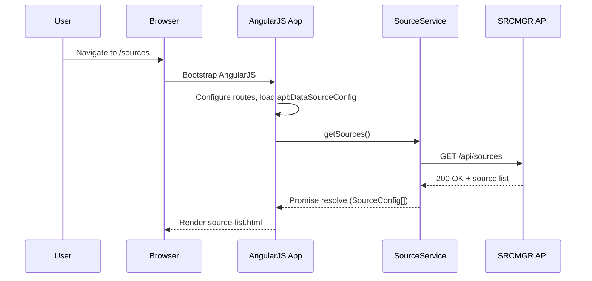
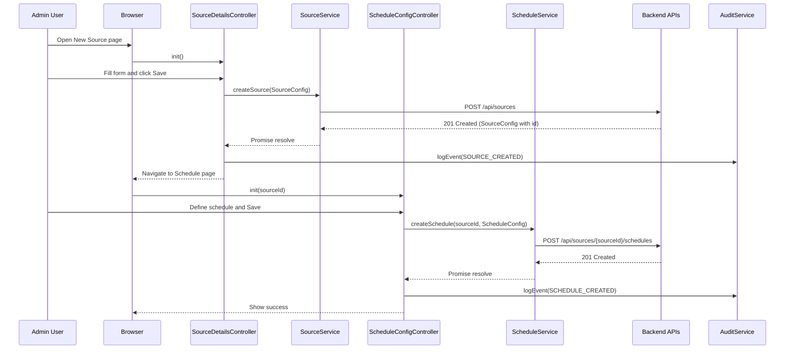
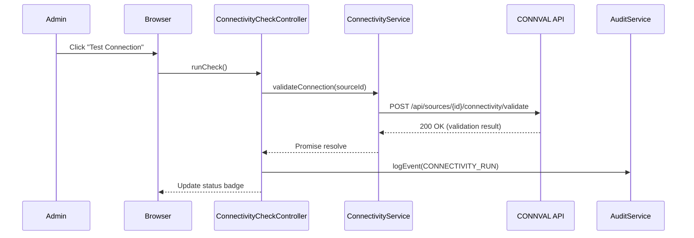
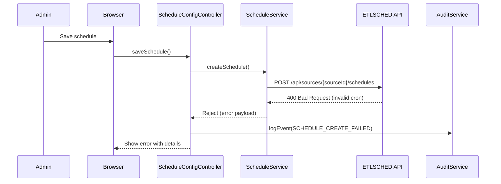

# LLD – QE-3206 Release2-Data Source Configuration and ETL Job Scheduling

## 1. Application Architecture

### 1.1 Overview
Enterprise web application module for configuring ERP/PLM/MDM data sources and scheduling ETL jobs. Built with:
- AngularJS 1.x (MVC)
- JavaScript ES6
- HTML5, CSS3, Bootstrap
- REST APIs (backend services: SRCMGR, CONNVAL, ETLSCHED, CREDS, CFGSTORE, AUD, NOTIF, DASH)

The UI provides secure configuration screens for connection details, schedules, and validation. AngularJS services call REST APIs to persist configuration and trigger validation and scheduling. Audit and notification are integrated via APIs.

### 1.2 AngularJS MVC Mapping

#### Modules
- `apbDataSourceConfig` – main feature module for QE-3206.
- `apbShared` – shared utilities (validation, interceptors, constants).

#### Key Components
- Controllers
  - `SourceConfigController` – manage list/add/edit of ERP/PLM/MDM sources.
  - `SourceDetailsController` – manage a single source configuration (credentials, connection params).
  - `ScheduleConfigController` – manage ETL job schedules (full/incremental).
  - `ConnectivityCheckController` – execute and display connectivity validation.

- Services / Factories
  - `SourceService` – CRUD for source configurations (CFGSTORE, CREDS).
  - `ScheduleService` – CRUD for ETL schedules and linkage to sources (ETLSCHED, CFGSTORE).
  - `ConnectivityService` – executes connectivity validation (CONNVAL).
  - `AuditService` – client wrapper for audit trail REST API (AUD).
  - `NotificationService` – client wrapper for notification REST API (NOTIF).
  - `AuthService` – RBAC/Session info (AUTH).

- Directives
  - `sourceConfigForm` – reusable form for source details.
  - `scheduleConfigForm` – reusable form for schedules.
  - `connectionStatusBadge` – displays validation status.

- Models
  - `SourceConfig` – JS object for source metadata and connection details.
  - `ScheduleConfig` – JS object for ETL job schedule.

- Filters
  - `etlFrequencyFilter` – human-readable schedule frequency.

- Config
  - Routing/state configuration for feature views.
  - HTTP interceptors for auth tokens, error handling, logging.

### 1.3 Project Folder Structure

```text
/webapp
  /app
    /core
      app.module.js
      app.config.js
      app.routes.js
      http-interceptors.factory.js
      auth.service.js
    /features
      /data-source-config   (QE-3206)
        datasource.module.js
        datasource.routes.js
        controllers/
          source-config.controller.js
          source-details.controller.js
          schedule-config.controller.js
          connectivity-check.controller.js
        services/
          source.service.js
          schedule.service.js
          connectivity.service.js
          audit.service.js
          notification.service.js
        directives/
          source-config-form.directive.js
          schedule-config-form.directive.js
          connection-status-badge.directive.js
        models/
          source-config.model.js
          schedule-config.model.js
        views/
          source-list.html
          source-details.html
          schedule-list.html
          schedule-details.html
          connectivity-results.html
    /shared
      constants.js
      validators.js
      filters/
        etl-frequency.filter.js
  /assets
    /css
    /js
    /img
  index.html
```

## 2. Component Specifications

### 2.1 Module: `apbDataSourceConfig`
- **Type**: AngularJS Module
- **File**: `app/features/data-source-config/datasource.module.js`
- **Responsibility**: Declares controllers, services, directives for QE-3206 feature; configures routes.
- **Public API**: N/A (module definition only).
- **Dependencies**: `apbShared`, `ui.router`, `ngMessages`, `ngAnimate`.

### 2.2 Controller: `SourceConfigController`
- **Type**: Controller
- **File**: `controllers/source-config.controller.js`
- **Responsibility**:
  - Display list of configured ERP/PLM/MDM sources.
  - Provide actions: add, edit, delete, clone, view connectivity status.
  - Coordinate filter/search/sort on sources.
- **Public Methods**:
  - `init()` – load initial list and user permissions.
  - `loadSources()` – fetch sources from `SourceService`.
  - `addSource()` – navigate to new source form.
  - `editSource(sourceId)` – navigate to edit view.
  - `deleteSource(sourceId)` – soft-delete source; prompt for confirmation.
  - `cloneSource(sourceId)` – create new source based on selected one.
  - `runConnectivity(sourceId)` – trigger connectivity validation via `ConnectivityService`.
  - `applyFilter(filterCriteria)` – filter list.
- **Inputs**:
  - Route params (`$stateParams`, e.g. selected source).
  - UI filter criteria (search text, system type).
- **Outputs**:
  - Updated view model: `vm.sources`, `vm.filters`, `vm.statusMessage`.
  - Navigation to details/schedule views (`$state.go`).
- **Injected Dependencies**:
  - `$scope`, `$state`, `$stateParams`, `SourceService`, `ConnectivityService`, `AuditService`, `NotificationService`, `AuthService`.

### 2.3 Controller: `SourceDetailsController`
- **Type**: Controller
- **File**: `controllers/source-details.controller.js`
- **Responsibility**:
  - Manage single source configuration for ERP/PLM/MDM.
  - Handle credentials, connection parameters, and validation rules.
- **Public Methods**:
  - `init()` – load existing source if editing; prepare defaults if new.
  - `save()` – validate form, persist via `SourceService`, log via `AuditService`.
  - `testConnection()` – call `ConnectivityService` and show result.
  - `reset()` – reset form to initial state.
  - `cancel()` – navigate back to list.
- **Inputs**:
  - `sourceId` from `$stateParams`.
  - Form model `vm.source` (bound to `SourceConfig` object).
- **Outputs**:
  - Persisted configuration in CFGSTORE/CREDS via REST.
  - UI messages for success/error.
- **Injected Dependencies**:
  - `$state`, `$stateParams`, `SourceService`, `ConnectivityService`, `AuditService`, `NotificationService`, `AuthService`, `Validators`.

### 2.4 Controller: `ScheduleConfigController`
- **Type**: Controller
- **File**: `controllers/schedule-config.controller.js`
- **Responsibility**:
  - Manage ETL job schedule configurations (full/incremental, windows, frequency, dependencies).
- **Public Methods**:
  - `init()` – load schedules for a given source.
  - `loadSchedules(sourceId)` – retrieve schedules from `ScheduleService`.
  - `addSchedule()` – create new schedule entry.
  - `editSchedule(scheduleId)` – modify existing schedule.
  - `saveSchedule()` – persist schedule via `ScheduleService` and log audit.
  - `deleteSchedule(scheduleId)` – deactivate schedule.
- **Inputs**:
  - `sourceId`, `scheduleId` from route.
  - `vm.schedule` model (bound to `ScheduleConfig`).
- **Outputs**:
  - Updated configuration in CFGSTORE.
  - Triggers ETLSCHED backend to register jobs.
- **Injected Dependencies**:
  - `$state`, `$stateParams`, `ScheduleService`, `AuditService`, `NotificationService`, `AuthService`, `Validators`.

### 2.5 Controller: `ConnectivityCheckController`
- **Type**: Controller
- **File**: `controllers/connectivity-check.controller.js`
- **Responsibility**:
  - Execute connectivity validations for a source.
  - Display detailed results (latency, status codes, error messages).
- **Public Methods**:
  - `init()` – load source details and last validation result.
  - `runCheck()` – call `ConnectivityService.validateConnection(sourceId)`.
  - `viewHistory()` – show previous connectivity runs.
- **Inputs**:
  - `sourceId` from route.
- **Outputs**:
  - `vm.validationStatus`, `vm.validationHistory`.
- **Injected Dependencies**:
  - `$stateParams`, `ConnectivityService`, `AuditService`, `NotificationService`.

### 2.6 Service: `SourceService`
- **Type**: Service (factory)
- **File**: `services/source.service.js`
- **Responsibility**:
  - Manage source configurations via REST APIs to SRCMGR/CFGSTORE/CREDS.
  - Encapsulate AES-256 credential handling (credentials never exposed to UI after save).
- **Public Methods (ES6)**:
  - `getSources(filter)` – GET `/api/sources` with query params.
  - `getSourceById(id)` – GET `/api/sources/{id}`.
  - `createSource(sourceConfig)` – POST `/api/sources`.
  - `updateSource(id, sourceConfig)` – PUT `/api/sources/{id}`.
  - `deleteSource(id)` – DELETE `/api/sources/{id}` (soft delete flag).
  - `getSourceConnectivityStatus(id)` – GET `/api/sources/{id}/connectivity`.
- **Inputs**:
  - `sourceConfig` object, filter criteria.
- **Outputs**:
  - Promise resolving to list/instance of `SourceConfig`.
- **Injected Dependencies**:
  - `$http`, `$q`, `ApiConfig`, `AuthService`.

### 2.7 Service: `ScheduleService`
- **Type**: Service (factory)
- **File**: `services/schedule.service.js`
- **Responsibility**:
  - CRUD for ETL job schedules.
  - Integration with ETLSCHED for job registration.
- **Public Methods**:
  - `getSchedules(sourceId)` – GET `/api/sources/{sourceId}/schedules`.
  - `getScheduleById(sourceId, scheduleId)` – GET `/api/sources/{sourceId}/schedules/{scheduleId}`.
  - `createSchedule(sourceId, scheduleConfig)` – POST `/api/sources/{sourceId}/schedules`.
  - `updateSchedule(sourceId, scheduleId, scheduleConfig)` – PUT `/api/sources/{sourceId}/schedules/{scheduleId}`.
  - `deleteSchedule(sourceId, scheduleId)` – DELETE `/api/sources/{sourceId}/schedules/{scheduleId}`.
- **Inputs**:
  - `ScheduleConfig` object, `sourceId`.
- **Outputs**:
  - Schedule metadata including job identifiers in ETLSCHED.
- **Injected Dependencies**:
  - `$http`, `$q`, `ApiConfig`, `AuthService`.

### 2.8 Service: `ConnectivityService`
- **Type**: Service
- **File**: `services/connectivity.service.js`
- **Responsibility**:
  - Execute connectivity validation against backend CONNVAL module.
- **Public Methods**:
  - `validateConnection(sourceId)` – POST `/api/sources/{sourceId}/connectivity/validate`.
  - `getHistory(sourceId)` – GET `/api/sources/{sourceId}/connectivity/history`.
- **Inputs**:
  - `sourceId`.
- **Outputs**:
  - Validation results json: status, latency, errors.
- **Injected Dependencies**:
  - `$http`, `$q`, `ApiConfig`, `AuthService`.

### 2.9 Service: `AuditService`
- **Type**: Service
- **File**: `services/audit.service.js`
- **Responsibility**:
  - Client-side helper to send audit events to backend AUD subsystem.
- **Public Methods**:
  - `logEvent(eventType, context)` – POST `/api/audit/events`.
- **Inputs**:
  - `eventType` (e.g., `SOURCE_CREATED`, `SCHEDULE_UPDATED`).
  - `context` (user id, source id, schedule id, changed fields).
- **Outputs**:
  - Acknowledgement response.
- **Injected Dependencies**:
  - `$http`, `AuthService`.

### 2.10 Service: `NotificationService`
- **Type**: Service
- **File**: `services/notification.service.js`
- **Responsibility**:
  - Interact with backend notification service to send informational alerts.
- **Public Methods**:
  - `notifyChannel(channel, message, payload)` – POST `/api/notifications`.
- **Inputs**:
  - `channel` (email, sms, in-app).
  - `message` (string), `payload` (object).
- **Outputs**:
  - Notification delivery status.
- **Injected Dependencies**:
  - `$http`, `AuthService`.

### 2.11 Directive: `sourceConfigForm`
- **Type**: Directive
- **File**: `directives/source-config-form.directive.js`
- **Responsibility**:
  - Render AngularJS form for source configuration with client-side validation.
- **Attributes/Scope**:
  - `source` – two-way bound `SourceConfig`.
  - `mode` – `create` or `edit`.
- **Inputs**:
  - Bound `source` model.
- **Outputs**:
  - Emits `onSave`, `onCancel` events.

### 2.12 Directive: `scheduleConfigForm`
- **Type**: Directive
- **File**: `directives/schedule-config-form.directive.js`
- **Responsibility**:
  - Reusable schedule form for ETL job configuration.
- **Attributes/Scope**:
  - `schedule` – `ScheduleConfig`.
  - `source-id` – parent source.
- **Outputs**:
  - Emits `onSave`, `onCancel`.

### 2.13 Directive: `connectionStatusBadge`
- **Type**: Directive
- **File**: `directives/connection-status-badge.directive.js`
- **Responsibility**:
  - Display connectivity status with Bootstrap badges (success/warning/error).
- **Inputs**:
  - `status` – enum (`OK`, `WARN`, `ERROR`).

### 2.14 Models

#### `SourceConfig`
- **File**: `models/source-config.model.js`
- **Attributes**:
  - `id` (String) – unique identifier.
  - `name` (String) – display name.
  - `systemType` (String) – `ERP` | `PLM` | `MDM`.
  - `endpointUrl` (String) – base URL.
  - `port` (Number) – optional.
  - `authType` (String) – `BASIC` | `OAUTH2` | `CERT`.
  - `username` (String) – transient, not persisted in plain form.
  - `password` (String) – transient.
  - `credentialsRef` (String) – reference key in CREDS store.
  - `connectionParams` (Object) – timeouts, read-size.
  - `active` (Boolean) – soft delete flag.
  - `createdBy`, `createdAt`, `updatedBy`, `updatedAt` (Strings/Timestamps).
- **Validation Rules**:
  - `name` required, 3–100 chars.
  - `endpointUrl` required, valid URL, HTTPS enforced.
  - `systemType` required, allowed values.
  - `authType` required.
  - If `authType === BASIC`, `username/password` required.
  - If `authType === CERT`, `credentialsRef` required.
- **State Transitions**:
  - `DRAFT` → `ACTIVE` → `INACTIVE`.

#### `ScheduleConfig`
- **File**: `models/schedule-config.model.js`
- **Attributes**:
  - `id` (String).
  - `sourceId` (String).
  - `jobType` (String) – `FULL` | `INCREMENTAL`.
  - `cronExpression` (String) – schedule definition.
  - `windowStart` (String, time).
  - `windowEnd` (String, time).
  - `timeZone` (String).
  - `maxRuntimeMinutes` (Number).
  - `enabled` (Boolean).
  - `lastRunAt` (Timestamp).
  - `lastRunStatus` (String) – `SUCCESS` | `FAILED` | `SKIPPED`.
- **Validation Rules**:
  - `sourceId` required.
  - `jobType` required.
  - Valid cron expression syntax.
  - `windowStart`/`windowEnd` consistent (`start < end`).
- **State Transitions**:
  - `DRAFT` → `SCHEDULED` → `PAUSED` → `DISABLED`.

## 3. Component Responsibilities

- **Controllers** – handle UI interactions, state management, validation before calling services. No direct REST or business logic beyond orchestration.
- **Services** – own communication with backend, transformation of raw API payload to models, error handling and retries.
- **Directives** – encapsulate reusable UI widgets/forms.
- **Models** – define client-side representation of source and schedule metadata.

Business logic ownership:
- Validation of configuration inputs: controllers & directives using shared `Validators` service.
- Connectivity flow: `ConnectivityService` interacting with CONNVAL backend.
- Schedule registration: `ScheduleService` calling ETLSCHED.
- Audit logging: `AuditService` invoked by controllers after create/update/delete operations.

## 4. Interface Specifications

### 4.1 REST API – Source Management (SRCMGR/CFGSTORE/CREDS)

#### Create Source
- **Endpoint**: `POST /api/sources`
- **Request Payload**:
```json
{
  "name": "ERP-Global",
  "systemType": "ERP",
  "endpointUrl": "https://erp.example.com/api",
  "port": 443,
  "authType": "BASIC",
  "username": "admin",
  "password": "Secret123!",
  "connectionParams": {
    "connectTimeoutMs": 5000,
    "readTimeoutMs": 30000
  }
}
```
- **Response**:
```json
{
  "id": "SRC-001",
  "name": "ERP-Global",
  "systemType": "ERP",
  "endpointUrl": "https://erp.example.com/api",
  "port": 443,
  "authType": "BASIC",
  "credentialsRef": "cred-abc123",
  "connectionParams": {
    "connectTimeoutMs": 5000,
    "readTimeoutMs": 30000
  },
  "active": true,
  "createdBy": "user123",
  "createdAt": "2025-01-01T10:00:00Z"
}
```
- **Error Responses**:
  - `400` – validation errors.
  - `401/403` – unauthorized/RBAC.
  - `500` – server error; message logged.

#### Get Sources
- **Endpoint**: `GET /api/sources?systemType=&active=`
- **Response**: array of `SourceConfig`.

#### Update Source
- **Endpoint**: `PUT /api/sources/{id}`
- **Request**: partial or full `SourceConfig` (excluding raw credentials when using `credentialsRef`).

#### Delete Source
- **Endpoint**: `DELETE /api/sources/{id}`
- **Response**: `{ "status": "DEACTIVATED" }`.

### 4.2 REST API – Connectivity Validation (CONNVAL)

#### Validate Connection
- **Endpoint**: `POST /api/sources/{id}/connectivity/validate`
- **Request Payload**:
```json
{
  "testType": "PING",
  "maxAttempts": 3
}
```
- **Response**:
```json
{
  "sourceId": "SRC-001",
  "status": "OK",
  "latencyMs": 123,
  "attempts": 1,
  "timestamp": "2025-01-01T10:05:00Z",
  "details": []
}
```
- **Error Responses**:
  - `504` – timeout from upstream.
  - `502` – bad gateway.

### 4.3 REST API – Schedule Management (ETLSCHED/CFGSTORE)

#### Create Schedule
- **Endpoint**: `POST /api/sources/{sourceId}/schedules`
- **Request Payload**:
```json
{
  "jobType": "INCREMENTAL",
  "cronExpression": "0 0 * * *",
  "windowStart": "00:00",
  "windowEnd": "01:00",
  "timeZone": "UTC",
  "maxRuntimeMinutes": 60
}
```
- **Response**:
```json
{
  "id": "SCH-001",
  "sourceId": "SRC-001",
  "jobType": "INCREMENTAL",
  "cronExpression": "0 0 * * *",
  "enabled": true,
  "createdBy": "user123",
  "createdAt": "2025-01-01T10:06:00Z"
}
```

### 4.4 REST API – Audit Trail

- **Endpoint**: `POST /api/audit/events`
- **Payload**:
```json
{
  "eventType": "SOURCE_UPDATED",
  "userId": "user123",
  "sourceId": "SRC-001",
  "changes": {
    "endpointUrl": ["https://old", "https://new"]
  },
  "timestamp": "2025-01-01T10:10:00Z"
}
```

## 5. Data Flow

### 5.1 User Action → View → Controller → Service → API → Response → UI Update

1. **User** (System Administrator) opens Source Configuration page.
2. **View** `source-list.html` initialized; `SourceConfigController.init()` executed.
3. Controller calls `SourceService.getSources()`.
4. `SourceService` performs `$http.get('/api/sources')` with auth headers.
5. Backend returns list of sources.
6. Service maps raw JSON to `SourceConfig` objects and resolves promise.
7. Controller updates `vm.sources`.
8. View re-renders with Angular `ng-repeat`.

For save:
1. User fills form in `source-details.html` (via `sourceConfigForm` directive) and clicks Save.
2. Directive emits `onSave`, `SourceDetailsController.save()` triggered.
3. Controller validates data using `Validators` and logs pre-save event.
4. On success, controller calls `SourceService.createSource(vm.source)`.
5. Service posts to `/api/sources`; backend persists to CFGSTORE, CREDS.
6. Backend returns created record.
7. Service resolves; controller logs audit via `AuditService.logEvent`.
8. Controller shows success message and navigates back to list.

### 5.2 State Changes and Events

- Source state transitions managed by backend; UI displays `active` flag and derived state.
- Connectivity results events:
  - `ConnectivityCheckController.runCheck()` triggers validation.
  - Backend writes audit & updates status; UI refreshes.

## 6. Sequence Diagrams (Mermaid)

### 6.1 Application Initialization (Data Source Config Module)



### 6.2 Primary Workflow – Create Source and Schedule



### 6.3 Service/API Interaction – Connectivity Validation



### 6.4 Error Handling Scenario – Failed Schedule Creation



## 7. Implementation Details

### 7.1 AngularJS Implementation Approach

- Use `controllerAs` syntax (`vm`) to avoid `$scope` pollution.
- Use `ui-router` for state-based routing.
- Apply dependency injection via inline array syntax to allow minification.

Example `source.service.js` (ES6 style within Angular factory):
```javascript
(function() {
  'use strict';

  angular
    .module('apbDataSourceConfig')
    .factory('SourceService', SourceService);

  SourceService.$inject = ['$http', '$q', 'ApiConfig', 'AuthService'];

  function SourceService($http, $q, ApiConfig, AuthService) {
    const baseUrl = ApiConfig.baseUrl + '/sources';

    return {
      getSources,
      getSourceById,
      createSource,
      updateSource,
      deleteSource,
      getSourceConnectivityStatus
    };

    function getSources(filter = {}) {
      const config = { params: filter, headers: AuthService.getAuthHeaders() };
      return $http.get(baseUrl, config).then(handleSuccess).catch(handleError);
    }

    function getSourceById(id) {
      return $http.get(`${baseUrl}/${id}`, { headers: AuthService.getAuthHeaders() })
        .then(handleSuccess).catch(handleError);
    }

    function createSource(sourceConfig) {
      return $http.post(baseUrl, sourceConfig, { headers: AuthService.getAuthHeaders() })
        .then(handleSuccess).catch(handleError);
    }

    function updateSource(id, sourceConfig) {
      return $http.put(`${baseUrl}/${id}`, sourceConfig, { headers: AuthService.getAuthHeaders() })
        .then(handleSuccess).catch(handleError);
    }

    function deleteSource(id) {
      return $http.delete(`${baseUrl}/${id}`, { headers: AuthService.getAuthHeaders() })
        .then(handleSuccess).catch(handleError);
    }

    function getSourceConnectivityStatus(id) {
      return $http.get(`${baseUrl}/${id}/connectivity`, { headers: AuthService.getAuthHeaders() })
        .then(handleSuccess).catch(handleError);
    }

    function handleSuccess(response) {
      return response.data;
    }

    function handleError(error) {
      // Centralized error handling: log, transform message
      return $q.reject({
        status: error.status,
        message: error.data && error.data.message ? error.data.message : 'Unexpected error'
      });
    }
  }
})();
```

### 7.2 JavaScript ES6 Patterns

- Use `const`/`let` instead of `var`.
- Arrow functions in helpers where not used by Angular DI.
- Template literals for URLs.
- Promises via `$http` returning native thenables; consider wrapping with `$q` for additional control.

### 7.3 Dependency Injection Details

- All controllers/services declare `$inject` to maintain minification compatibility.
- Common dependencies: `$http`, `$q`, `$state`, `$stateParams`, `AuthService`, `ApiConfig`.

### 7.4 Business Logic Flow

- Input validation performed on client (AngularJS) and server.
- Controllers orchestrate flows; backend enforces AES-256 storage, RBAC, and immutable logging.

### 7.5 Validation Logic

- Use `ngMessages` with custom validators from `Validators` service.
- Client side ensures URLs use `https`, cron strings are syntactically valid, required fields are populated.

### 7.6 State Management Approach

- Use `ui-router` params and controller `vm` state objects.
- For transient unsaved state, rely on controller variables; when saved, reflect backend state.

### 7.7 DOM Interaction Approach

- Prefer Angular directives and data binding over direct DOM manipulation.
- Use Bootstrap components (modals, tooltips) integrated via directives.

### 7.8 API Integration Approach

- All API calls centralized in services.
- Global `$http` interceptor for auth token injection, error logging, retry on network glitch (limited).

## 8. Configuration

### 8.1 AngularJS Configuration Files

- `app.config.js`
  - Configures `$httpProvider` interceptors.
  - Sets default headers.
- `app.routes.js`
  - States:
    - `sources.list` – `/sources`
    - `sources.new` – `/sources/new`
    - `sources.edit` – `/sources/:id`
    - `sources.schedules` – `/sources/:sourceId/schedules`

### 8.2 Environment-Specific Properties

- `ApiConfig` constant:
```javascript
angular.module('apbShared')
  .constant('ApiConfig', {
    baseUrl: '/api',
    timeoutMs: 30000
  });
```
- Overridden per environment via build-time injection (e.g., `/api-dev`, `/api-qa`, `/api-prod`).

### 8.3 API Base URLs

- Source: `/api/sources`
- Schedules: `/api/sources/{sourceId}/schedules`
- Connectivity: `/api/sources/{id}/connectivity`
- Audit: `/api/audit/events`
- Notifications: `/api/notifications`

### 8.4 Feature Flags

- `enableConnectivityHistory` – toggles history view.
- `enableAdvancedScheduling` – toggles additional schedule options.

### 8.5 Logging and Telemetry

- Client logs critical errors to remote logging endpoint.
- Performance metrics (API latency) monitored via browser timings.

## 9. Error Handling and Resiliency

### 9.1 Client-Side Exception Handling

- Use `$exceptionHandler` to capture unhandled errors and route to logging.
- Show user-friendly messages via alert/toast service.

### 9.2 REST API Error Handling

- Centralized `handleError` in each service.
- Retry strategy for connectivity checks using limited attempts.

### 9.3 Retry Mechanisms

- ConnectivityService may retry `POST /connectivity/validate` on network errors up to 3 times.

### 9.4 Logging Strategy

- Each significant user action triggers `AuditService.logEvent`.

### 9.5 Recovery and Fallback

- If configuration load fails, show fallback message and allow retry.

## 10. Security Considerations

### 10.1 Input Validation and Sanitization

- Strict form validation for URLs, strings (length, allowed characters).
- Prevent HTML/JS injection by encoding outputs.

### 10.2 XSS Prevention

- Use AngularJS auto-escaping; avoid `ng-bind-html` except with trusted content.

### 10.3 CSRF Protection

- Integrate CSRF token in headers from backend.

### 10.4 Secure API Communication

- Enforce HTTPS in `endpointUrl`.
- All API calls to backend done over TLS 1.3.

### 10.5 Authentication and Authorization Integration

- Use `AuthService` to check RBAC; hide or disable actions based on roles.

### 10.6 Sensitive Data Handling

- Credentials never stored in JS models after save; UI masks password fields.

### 10.7 Audit Logging Approach

- All configuration changes logged with user identity, timestamp, and changes list.
