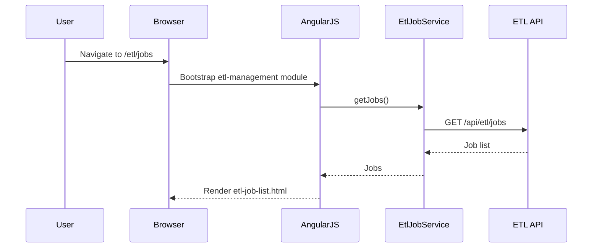
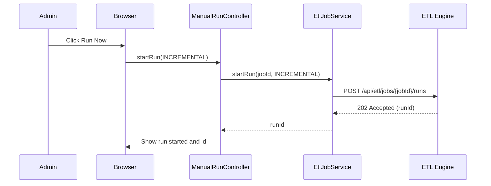
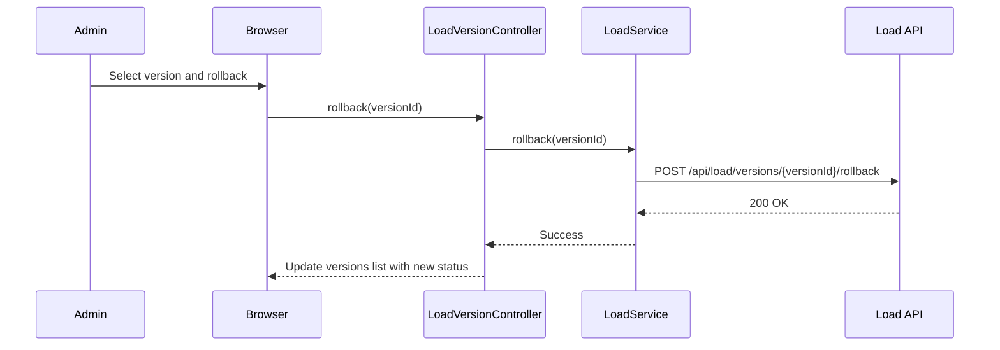
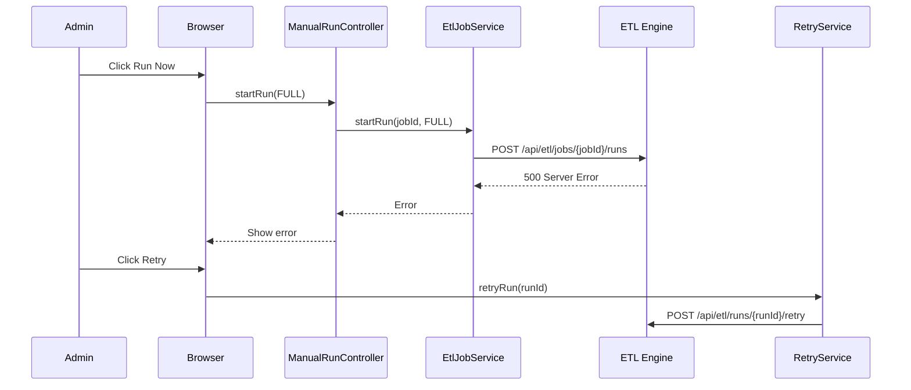

# LLD – QE-3207 Release2-Automated Data Extraction and Load Management

## 1. Application Architecture

### 1.1 Overview
This module implements UI and client-side logic for configuring and monitoring automated data extraction and load management. It builds on source configuration (QE-3206) and supports incremental/full ETL runs, load versioning, error handling, retry, and metrics visualization.

Stack:
- AngularJS 1.x (MVC)
- JavaScript ES6
- HTML5, CSS3, Bootstrap
- REST APIs for backend services: ETL Engine, EXTRACT, LOAD, RETRY, METRICS, AUD, DASH.

### 1.2 AngularJS MVC Mapping

#### Module
- `apbEtlManagement` – feature module for QE-3207.

#### Controllers
- `EtlJobListController` – list ETL jobs (configured via ETL Scheduler/CFGSTORE) and their statuses.
- `EtlJobDetailsController` – show detailed run history, metrics, and version information.
- `ManualRunController` – allow authorized users to trigger manual full/incremental runs.
- `LoadVersionController` – browse and manage load versions and rollback intents.

#### Services
- `EtlJobService` – interface with ETL Scheduler and ETL Engine.
- `ExtractionService` – interface to EXTRACT module (if separate endpoints).
- `LoadService` – manage load state and versions (DW, LOADDB).
- `RetryService` – manage retries and error classifications.
- `MetricsService` – retrieve ETL metrics and history.
- `AuditService` – audit logging.
- `NotificationService` – notifications on failures/retries.

#### Directives
- `etlJobStatusBadge` – status indicator for job state.
- `etlMetricsChart` – wrapper around charting for metrics visualization.
- `loadVersionTimeline` – display load versions and rollback points.

#### Models
- `EtlJobConfig` – metadata linking job to sources and schedules.
- `EtlRun` – representation of single ETL execution.
- `LoadVersion` – representation of a load into DW.

### 1.3 Folder Structure

```text
/app/features/etl-management
  etl-management.module.js
  etl-management.routes.js
  controllers/
    etl-job-list.controller.js
    etl-job-details.controller.js
    manual-run.controller.js
    load-version.controller.js
  services/
    etl-job.service.js
    extraction.service.js
    load.service.js
    retry.service.js
    metrics.service.js
    audit.service.js
    notification.service.js
  directives/
    etl-job-status-badge.directive.js
    etl-metrics-chart.directive.js
    load-version-timeline.directive.js
  models/
    etl-job-config.model.js
    etl-run.model.js
    load-version.model.js
  views/
    etl-job-list.html
    etl-job-details.html
    manual-run.html
    load-versions.html
```

## 2. Component Specifications

### 2.1 Controller: `EtlJobListController`
- **Type**: Controller
- **File**: `controllers/etl-job-list.controller.js`
- **Responsibility**:
  - Display list of configured ETL jobs.
  - Show last run status, next run time, job type (full/incremental), and associated source.
- **Public Methods**:
  - `init()` – load jobs and user permissions.
  - `loadJobs()` – call `EtlJobService.getJobs()`.
  - `viewDetails(jobId)` – navigate to details view.
  - `triggerManualRun(jobId, runType)` – open manual run dialog.
- **Inputs**:
  - User role (from `AuthService`).
- **Outputs**:
  - `vm.jobs` – array of `EtlJobConfig`.

### 2.2 Controller: `EtlJobDetailsController`
- **File**: `controllers/etl-job-details.controller.js`
- **Responsibility**:
  - Show ETL job run history and metrics.
  - Display execution time, record counts, error counts.
- **Public Methods**:
  - `init(jobId)` – fetch job config and recent runs.
  - `loadRuns(jobId)` – call `EtlJobService.getRuns(jobId)`.
  - `viewRun(runId)` – expand details.
- **Inputs**:
  - `jobId` from route.
- **Outputs**:
  - `vm.runs` – array of `EtlRun`.

### 2.3 Controller: `ManualRunController`
- **File**: `controllers/manual-run.controller.js`
- **Responsibility**:
  - Trigger manual full or incremental ETL run for a job.
  - Display run initiation status.
- **Public Methods**:
  - `init(jobId)`.
  - `startRun(runType)` – call `EtlJobService.startRun(jobId, runType)`.
- **Inputs**:
  - `jobId`, `runType`.
- **Outputs**:
  - `vm.runStatus` – initiation result.

### 2.4 Controller: `LoadVersionController`
- **File**: `controllers/load-version.controller.js`
- **Responsibility**:
  - List load versions for a source/job.
  - Initiate rollback.
- **Public Methods**:
  - `init(sourceId)` – get versions.
  - `rollback(versionId)` – call `LoadService.rollback(versionId)`.
- **Inputs**:
  - `sourceId`.
- **Outputs**:
  - `vm.versions` – array of `LoadVersion`.

### 2.5 Service: `EtlJobService`
- **File**: `services/etl-job.service.js`
- **Responsibility**:
  - Interface with ETL Scheduler/Engine APIs.
- **Public Methods**:
  - `getJobs(filter)` – GET `/api/etl/jobs`.
  - `getJobById(jobId)` – GET `/api/etl/jobs/{jobId}`.
  - `getRuns(jobId)` – GET `/api/etl/jobs/{jobId}/runs`.
  - `startRun(jobId, runType)` – POST `/api/etl/jobs/{jobId}/runs`.

### 2.6 Service: `ExtractionService`
- **File**: `services/extraction.service.js`
- **Responsibility**:
  - Expose extraction-specific endpoints (optional).
- **Public Methods**:
  - `getExtractStatus(runId)` – GET `/api/etl/runs/{runId}/extract`.

### 2.7 Service: `LoadService`
- **File**: `services/load.service.js`
- **Responsibility**:
  - Interact with load management, DW and LOADDB.
- **Public Methods**:
  - `getVersions(sourceId)` – GET `/api/load/versions?sourceId=`.
  - `rollback(versionId)` – POST `/api/load/versions/{versionId}/rollback`.

### 2.8 Service: `RetryService`
- **File**: `services/retry.service.js`
- **Responsibility**:
  - Manage retry operations for failed runs.
- **Public Methods**:
  - `retryRun(runId)` – POST `/api/etl/runs/{runId}/retry`.
  - `classifyError(runId)` – GET `/api/etl/runs/{runId}/error-classification`.

### 2.9 Service: `MetricsService`
- **File**: `services/metrics.service.js`
- **Responsibility**:
  - Retrieve metrics and execution history for dashboard and views.
- **Public Methods**:
  - `getJobMetrics(jobId)` – GET `/api/etl/jobs/{jobId}/metrics`.
  - `getAggregateMetrics()` – GET `/api/etl/metrics/aggregate`.

### 2.10 Models

#### `EtlJobConfig`
- **File**: `models/etl-job-config.model.js`
- **Attributes**:
  - `id` (String)
  - `sourceId` (String)
  - `jobType` (String)
  - `scheduleId` (String)
  - `enabled` (Boolean)
  - `lastRun` (Timestamp)
  - `nextRun` (Timestamp)

#### `EtlRun`
- **File**: `models/etl-run.model.js`
- **Attributes**:
  - `id` (String)
  - `jobId` (String)
  - `startTime` (Timestamp)
  - `endTime` (Timestamp)
  - `status` (String)
  - `recordsExtracted` (Number)
  - `recordsLoaded` (Number)
  - `errorsCount` (Number)

#### `LoadVersion`
- **File**: `models/load-version.model.js`
- **Attributes**:
  - `id` (String)
  - `sourceId` (String)
  - `createdAt` (Timestamp)
  - `createdBy` (String)
  - `status` (String)
  - `rollbackAvailable` (Boolean)

## 3. Interface Specifications

### 3.1 REST – ETL Jobs

#### Get Jobs
- **Endpoint**: `GET /api/etl/jobs`
- **Response**:
```json
[
  {
    "id": "JOB-001",
    "sourceId": "SRC-001",
    "jobType": "INCREMENTAL",
    "scheduleId": "SCH-001",
    "enabled": true,
    "lastRun": "2025-01-02T00:00:00Z",
    "nextRun": "2025-01-03T00:00:00Z"
  }
]
```

#### Start Run
- **Endpoint**: `POST /api/etl/jobs/{jobId}/runs`
- **Payload**:
```json
{
  "runType": "INCREMENTAL",
  "initiatedBy": "user123"
}
```

### 3.2 REST – Load Versions

#### Get Versions
- **Endpoint**: `GET /api/load/versions?sourceId=SRC-001`

#### Rollback
- **Endpoint**: `POST /api/load/versions/{versionId}/rollback`

## 4. Data Flow

### 4.1 ETL Run Initiation
1. User opens job list.
2. `EtlJobListController` loads jobs.
3. User selects "Run Now".
4. `ManualRunController.startRun()` calls `EtlJobService.startRun()`.
5. Backend ETL Engine schedules immediate run.
6. Response includes `runId`.
7. UI polls `MetricsService.getJobMetrics(jobId)` to show progress.

### 4.2 Load Versioning
1. ETL run completes; backend writes load version into LOADDB.
2. UI via `LoadService.getVersions()` displays versions.
3. User selects version to rollback.
4. Request sent to backend which performs rollback to previous state.

## 5. Sequence Diagrams

### 5.1 App Initialization – ETL Management



### 5.2 Primary Workflow – Manual Run



### 5.3 Service/API – Load Rollback



### 5.4 Error Scenario – Failed ETL Run



## 6. Implementation Details

- Controllers use `controllerAs` syntax.
- Services use ES6 patterns similar to QE-3206.
- Metrics visualization implemented via `etlMetricsChart` directive using a chart library (e.g., Chart.js) wrapped to avoid direct DOM manipulation.

## 7. Configuration

- Routes:
  - `/etl/jobs` – job list.
  - `/etl/jobs/:jobId` – details.
  - `/etl/jobs/:jobId/manual-run`.
  - `/etl/load-versions/:sourceId`.

- `ApiConfig` extended with ETL endpoints:
  - `etlBaseUrl: '/api/etl'`
  - `loadBaseUrl: '/api/load'`

## 8. Error Handling and Resiliency

- RetryService abstracts retry logic and limits maximum attempts.
- UI indicates transient vs permanent errors based on error classification.

## 9. Security Considerations

- Access to manual run and rollback restricted via RBAC.
- All endpoints called with auth token.

