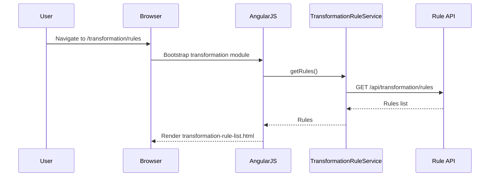
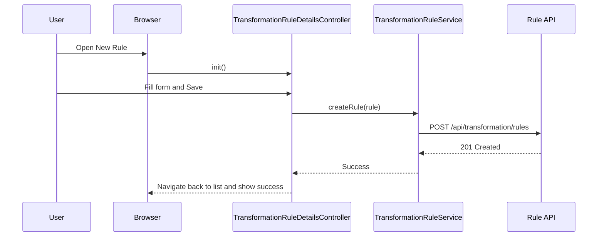
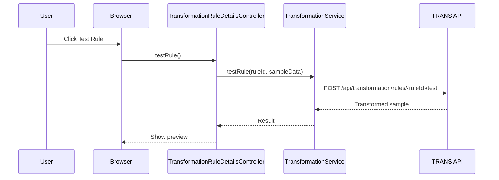
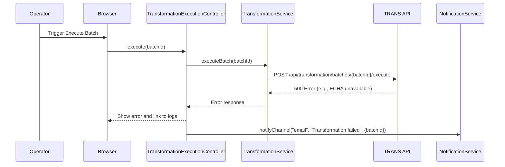

# LLD – QE-3208 Release2-Data Transformation and Regulatory Standardization

## 1. Application Architecture

### 1.1 Overview
UI/Client feature for configuring and monitoring transformation and standardization rules applied to ETL data. It manages transformation rules, displays transformation results and metadata, and supports regulatory mapping, unit conversion, and SVHC/CAS-related logic.

Stack:
- AngularJS 1.x
- JavaScript ES6
- HTML5/CSS3/Bootstrap
- REST APIs for TRANS, RULECFG, METADB, CFGSTORE, AUD, DASH.

### 1.2 AngularJS MVC Mapping

#### Module
- `apbTransformation` – feature module for QE-3208.

#### Controllers
- `TransformationRuleListController` – list existing rules.
- `TransformationRuleDetailsController` – view/edit rule details.
- `TransformationExecutionController` – display status of transformations for ETL batches.
- `TransformationMetadataController` – show lineage and metadata for transformed records.

#### Services
- `TransformationRuleService` – manage rules via RULECFG/CFGSTORE.
- `TransformationService` – interact with transformation engine (TRANS).
- `TransformationMetadataService` – query METADB.
- `AuditService` – audit changes and runs.
- `NotificationService` – notifications on transformation failures.

#### Directives
- `transformation-rule-form` – rule form widget.
- `transformation-metadata-view` – show lineage and mappings.

#### Models
- `TransformationRule` – representation of a single transformation rule.
- `TransformationBatch` – transformation batch run metadata.
- `TransformationMetadata` – per record lineage info.

### 1.3 Folder Structure

```text
/app/features/transformation
  transformation.module.js
  transformation.routes.js
  controllers/
    transformation-rule-list.controller.js
    transformation-rule-details.controller.js
    transformation-execution.controller.js
    transformation-metadata.controller.js
  services/
    transformation-rule.service.js
    transformation.service.js
    transformation-metadata.service.js
    audit.service.js
    notification.service.js
  directives/
    transformation-rule-form.directive.js
    transformation-metadata-view.directive.js
  models/
    transformation-rule.model.js
    transformation-batch.model.js
    transformation-metadata.model.js
  views/
    transformation-rule-list.html
    transformation-rule-details.html
    transformation-execution.html
    transformation-metadata.html
```

## 2. Component Specifications

### 2.1 Controller: `TransformationRuleListController`
- **File**: `controllers/transformation-rule-list.controller.js`
- **Responsibility**:
  - List all transformation rules.
  - Filter by jurisdiction (EUMDR, REACH, RoHS).
- **Public Methods**:
  - `init()` – load rules.
  - `filterRules(criteria)`.
  - `createRule()` – navigate to new rule.
  - `editRule(ruleId)`.
- **Dependencies**:
  - `TransformationRuleService`, `$state`.

### 2.2 Controller: `TransformationRuleDetailsController`
- **File**: `controllers/transformation-rule-details.controller.js`
- **Responsibility**:
  - Create/edit transformation rules: mappings, conversions, classifications.
- **Public Methods**:
  - `init(ruleId)`.
  - `save()` – validate and persist rule.
  - `testRule()` – send sample transformation request.
- **Dependencies**:
  - `TransformationRuleService`, `TransformationService`, `AuditService`, `NotificationService`, `Validators`.

### 2.3 Controller: `TransformationExecutionController`
- **File**: `controllers/transformation-execution.controller.js`
- **Responsibility**:
  - Display transformation runs, status, metrics.
- **Public Methods**:
  - `init(batchId)`.
  - `loadBatches()`.
  - `viewBatch(batchId)`.

### 2.4 Controller: `TransformationMetadataController`
- **File**: `controllers/transformation-metadata.controller.js`
- **Responsibility**:
  - Show detailed lineage of transformed records.
- **Public Methods**:
  - `init(recordId)`.
  - `loadMetadata(recordId)`.

### 2.5 Service: `TransformationRuleService`
- **File**: `services/transformation-rule.service.js`
- **Responsibility**:
  - CRUD operations for transformation rules.
- **Public Methods**:
  - `getRules(filter)` – GET `/api/transformation/rules`.
  - `getRuleById(ruleId)` – GET `/api/transformation/rules/{ruleId}`.
  - `createRule(rule)` – POST `/api/transformation/rules`.
  - `updateRule(ruleId, rule)` – PUT `/api/transformation/rules/{ruleId}`.
  - `deleteRule(ruleId)` – DELETE `/api/transformation/rules/{ruleId}`.

### 2.6 Service: `TransformationService`
- **File**: `services/transformation.service.js`
- **Responsibility**:
  - Trigger transformation runs and test transformations.
- **Public Methods**:
  - `executeBatch(batchId)` – POST `/api/transformation/batches/{batchId}/execute`.
  - `testRule(ruleId, sampleData)` – POST `/api/transformation/rules/{ruleId}/test`.

### 2.7 Service: `TransformationMetadataService`
- **File**: `services/transformation-metadata.service.js`
- **Responsibility**:
  - Query transformation metadata from METADB.
- **Public Methods**:
  - `getMetadata(recordId)` – GET `/api/transformation/metadata/{recordId}`.

### 2.8 Models

#### `TransformationRule`
- **File**: `models/transformation-rule.model.js`
- **Attributes**:
  - `id` (String)
  - `name` (String)
  - `jurisdiction` (String)
  - `sourceAttribute` (String)
  - `targetAttribute` (String)
  - `conversionType` (String)
  - `classification` (String)
  - `enabled` (Boolean)
  - `version` (Number)

#### `TransformationBatch`
- **File**: `models/transformation-batch.model.js`
- **Attributes**:
  - `id` (String)
  - `etlRunId` (String)
  - `status` (String)
  - `recordsProcessed` (Number)
  - `errorsCount` (Number)

#### `TransformationMetadata`
- **File**: `models/transformation-metadata.model.js`
- **Attributes**:
  - `recordId` (String)
  - `sourceValues` (Object)
  - `transformedValues` (Object)
  - `rulesApplied` (Array)
  - `svhcMatches` (Array)
  - `casValidationStatus` (String)

## 3. Interface Specifications

### 3.1 REST – Rules

#### Create Rule
- **Endpoint**: `POST /api/transformation/rules`
- **Payload**:
```json
{
  "name": "Unit Conversion - mg/kg to %",
  "jurisdiction": "EUMDR",
  "sourceAttribute": "concentration_mg_per_kg",
  "targetAttribute": "concentration_percent",
  "conversionType": "UNIT_CONVERSION",
  "classification": "SVHC",
  "enabled": true
}
```

### 3.2 REST – Execute Batch

- **Endpoint**: `POST /api/transformation/batches/{batchId}/execute`

## 4. Data Flow

### 4.1 Rule Creation
1. User opens rule list.
2. `TransformationRuleListController` loads rules via `TransformationRuleService`.
3. User clicks "New Rule"; navigates to details.
4. User completes form; clicks Save.
5. `TransformationRuleDetailsController.save()` validates and calls `createRule`.
6. Backend saves rule in CFGSTORE and logs audit.

### 4.2 Transformation Execution
1. ETL engine triggers transformation batch; UI displays via `TransformationExecutionController`.
2. User selects batch; controller calls `TransformationService.executeBatch()`.
3. Backend TRANS applies rules, writes to DW and METADB.

## 5. Sequence Diagrams

### 5.1 App Initialization – Transformation Module



### 5.2 Primary Workflow – Create Rule



### 5.3 Service/API – Test Rule



### 5.4 Error Scenario – Failed Transformation Execution



## 6. Implementation Details

- Use shared `Validators` to ensure rule definitions valid.
- Jurisdiction-based rule grouping handled via filter.

## 7. Configuration

- Routes:
  - `/transformation/rules` – list.
  - `/transformation/rules/new` – new.
  - `/transformation/rules/:ruleId` – edit.
  - `/transformation/batches` – batch list.
  - `/transformation/metadata/:recordId` – metadata view.

## 8. Error Handling and Resiliency

- UI indicates when external lookups (ECHA/CAS) cause failures.
- Retry, circuit breakers applied at backend; UI only surfaces status.

## 9. Security Considerations

- RBAC ensures only authorized users can edit rules.
- AuditService logs all rule changes.
