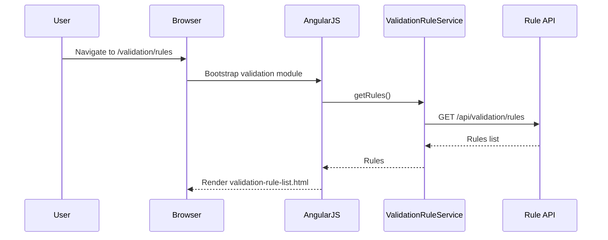
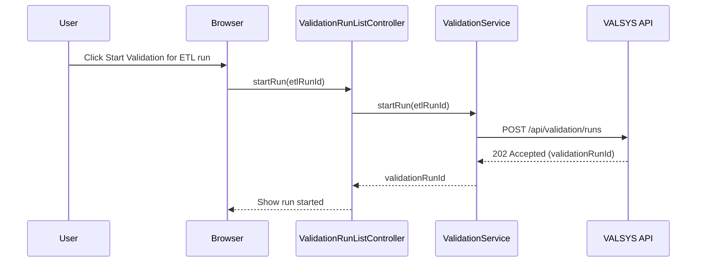
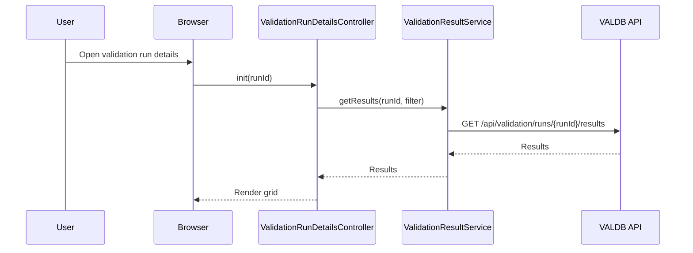
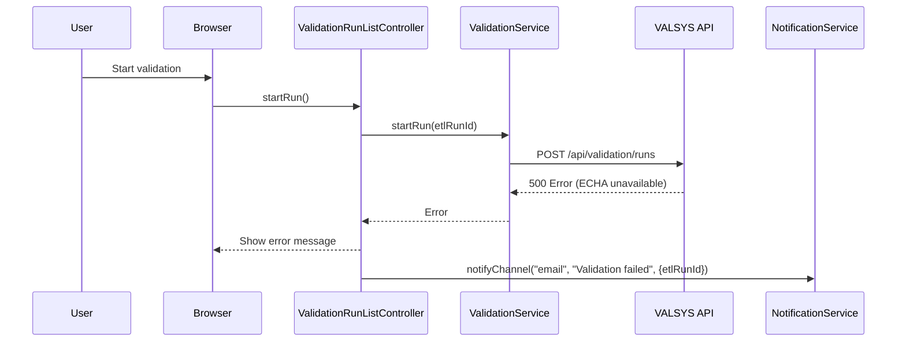

# LLD – QE-3209 Release2-Data Validation and Quality Assurance for Restricted Substances

## 1. Application Architecture

### 1.1 Overview
Feature for configuring validation rules, monitoring validation runs, viewing validation results, and managing notifications for restricted substances data.

Stack:
- AngularJS 1.x
- JavaScript ES6
- HTML5/CSS3/Bootstrap
- REST APIs for VALSYS, RULECFG, VALREP, VALDB, CFGSTORE, AUD, NOTIF, DASH.

### 1.2 AngularJS MVC Mapping

#### Module
- `apbValidation` – feature module for QE-3209.

#### Controllers
- `ValidationRuleListController` – list validation rules.
- `ValidationRuleDetailsController` – create/edit rules.
- `ValidationRunListController` – list validation runs.
- `ValidationRunDetailsController` – show detailed results per run.
- `ValidationReportController` – view generated reports.

#### Services
- `ValidationRuleService` – CRUD rules.
- `ValidationService` – trigger validation runs and get status.
- `ValidationResultService` – query VALDB.
- `ValidationReportService` – get reports from VALREP.
- `AuditService`, `NotificationService`.

#### Directives
- `validation-rule-form` – rule definition form.
- `validation-result-grid` – grid for record-level results.

#### Models
- `ValidationRule` – rule definition.
- `ValidationRun` – execution metadata.
- `ValidationResult` – per record outcome.
- `ValidationReport` – summary report.

### 1.3 Folder Structure

```text
/app/features/validation
  validation.module.js
  validation.routes.js
  controllers/
    validation-rule-list.controller.js
    validation-rule-details.controller.js
    validation-run-list.controller.js
    validation-run-details.controller.js
    validation-report.controller.js
  services/
    validation-rule.service.js
    validation.service.js
    validation-result.service.js
    validation-report.service.js
    audit.service.js
    notification.service.js
  directives/
    validation-rule-form.directive.js
    validation-result-grid.directive.js
  models/
    validation-rule.model.js
    validation-run.model.js
    validation-result.model.js
    validation-report.model.js
  views/
    validation-rule-list.html
    validation-rule-details.html
    validation-run-list.html
    validation-run-details.html
    validation-report.html
```

## 2. Component Specifications

### 2.1 Controller: `ValidationRuleListController`
- **Responsibility**:
  - List rules.
  - Filter by rule type (mandatory fields, thresholds, duplicates).
- **Public Methods**:
  - `init()`.
  - `filterRules(criteria)`.
  - `createRule()`.
  - `editRule(ruleId)`.

### 2.2 Controller: `ValidationRuleDetailsController`
- **Responsibility**:
  - Create/edit validation rules.
- **Public Methods**:
  - `init(ruleId)`.
  - `save()`.
  - `testRule()`.

### 2.3 Controller: `ValidationRunListController`
- **Responsibility**:
  - Show validation runs.
- **Public Methods**:
  - `init()`.
  - `loadRuns()`.
  - `viewDetails(runId)`.

### 2.4 Controller: `ValidationRunDetailsController`
- **Responsibility**:
  - Show details for a specific run.
- **Public Methods**:
  - `init(runId)`.
  - `loadResults(runId)`.
  - `filterResults(criteria)`.

### 2.5 Controller: `ValidationReportController`
- **Responsibility**:
  - Display summary validation reports.

### 2.6 Service: `ValidationRuleService`
- **Responsibility**:
  - CRUD rule definitions via RULECFG/CFGSTORE.
- **Public Methods**:
  - `getRules(filter)` – GET `/api/validation/rules`.
  - `getRuleById(ruleId)` – GET `/api/validation/rules/{ruleId}`.
  - `createRule(rule)` – POST `/api/validation/rules`.
  - `updateRule(ruleId, rule)` – PUT `/api/validation/rules/{ruleId}`.
  - `deleteRule(ruleId)` – DELETE `/api/validation/rules/{ruleId}`.

### 2.7 Service: `ValidationService`
- **Responsibility**:
  - Trigger validation runs.
- **Public Methods**:
  - `startRun(etlRunId)` – POST `/api/validation/runs`.
  - `getRuns(filter)` – GET `/api/validation/runs`.

### 2.8 Service: `ValidationResultService`
- **Responsibility**:
  - Query VALDB for record-level results.
- **Public Methods**:
  - `getResults(runId, filter)` – GET `/api/validation/runs/{runId}/results`.

### 2.9 Service: `ValidationReportService`
- **Responsibility**:
  - Retrieve reports from VALREP.
- **Public Methods**:
  - `getReport(runId)` – GET `/api/validation/runs/{runId}/report`.

### 2.10 Models

#### `ValidationRule`
- Attributes:
  - `id`, `name`, `type`, `jurisdiction`, `expression`, `enabled`.

#### `ValidationRun`
- Attributes:
  - `id`, `etlRunId`, `startTime`, `endTime`, `status`, `recordsValidated`, `errorsCount`.

#### `ValidationResult`
- Attributes:
  - `id`, `runId`, `recordId`, `status`, `errors`.

#### `ValidationReport`
- Attributes:
  - `runId`, `summary`, `metrics`.

## 3. Interface Specifications

### 3.1 REST – Rules

#### Create Rule
- **Endpoint**: `POST /api/validation/rules`
- **Payload**:
```json
{
  "name": "Mandatory CAS",
  "type": "MANDATORY_FIELD",
  "jurisdiction": "EUMDR",
  "expression": "CAS != null",
  "enabled": true
}
```

### 3.2 REST – Runs

#### Start Run
- **Endpoint**: `POST /api/validation/runs`
- **Payload**:
```json
{
  "etlRunId": "RUN-001"
}
```

## 4. Data Flow

### 4.1 Validation Run
1. ETL completes run.
2. UI displays ETL run and validation status.
3. User triggers validation via `ValidationService.startRun(etlRunId)`.
4. Backend VALSYS validates data, writes results to VALDB, and summaries to DW.
5. UI via `ValidationRunDetailsController` displays run results.

### 4.2 Validation Report
1. After validation, backend generates report via VALREP.
2. `ValidationReportController` calls `ValidationReportService.getReport(runId)`.
3. Report displayed and optionally exported.

## 5. Sequence Diagrams

### 5.1 App Initialization – Validation Module



### 5.2 Primary Workflow – Start Validation Run



### 5.3 Service/API – Fetch Results



### 5.4 Error Scenario – External Reference Failure



## 6. Implementation Details

- Use ES6 patterns as in other modules.
- Result grid supports pagination and filters.

## 7. Configuration

- Routes:
  - `/validation/rules`.
  - `/validation/rules/new`.
  - `/validation/rules/:ruleId`.
  - `/validation/runs`.
  - `/validation/runs/:runId`.
  - `/validation/reports/:runId`.

## 8. Error Handling and Resiliency

- UI clearly states when external references cause validation failures.

## 9. Security Considerations

- RBAC restricts rule editing to authorized roles.
- Audit logging on rule changes and validation runs.
