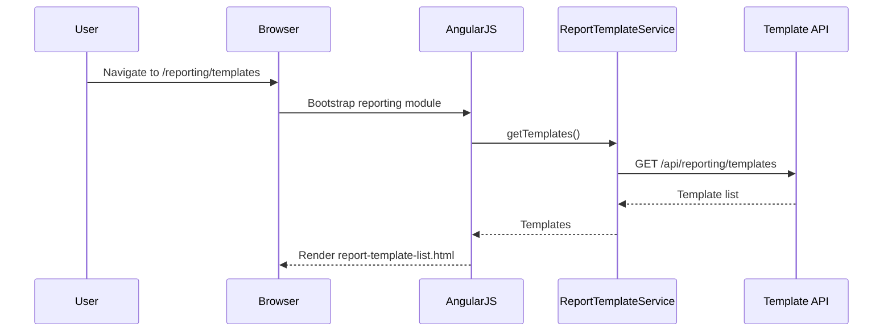
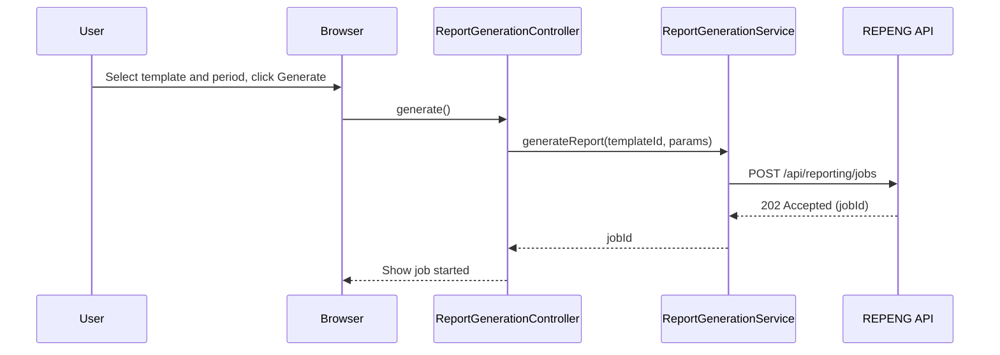
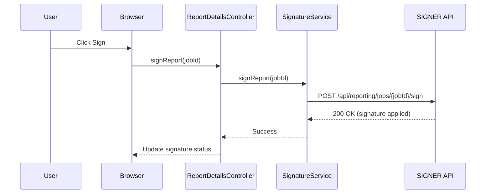
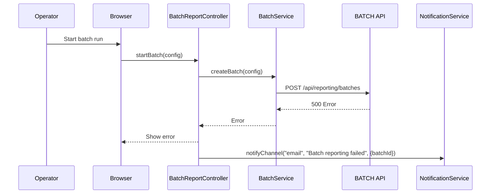

# LLD – QE-3210 Release2-Regulatory Reporting and Document Management for EUMDR

## 1. Application Architecture

### 1.1 Overview
Feature for configuring and executing regulatory report generation (XML/PDF), applying digital signatures, orchestrating batch runs, and managing report archive and search.

Stack:
- AngularJS 1.x
- JavaScript ES6
- HTML5/CSS3/Bootstrap
- REST APIs for REPENG, XMLGEN, PDFGEN, SIGNER, BATCH, ARCH, DOCREP, REPDB, AUD, NOTIF.

### 1.2 AngularJS MVC Mapping

#### Module
- `apbReporting` – feature module for QE-3210.

#### Controllers
- `ReportTemplateListController` – list EUMDR templates and configuration.
- `ReportGenerationController` – initiate and monitor report generation.
- `BatchReportController` – manage batch jobs.
- `ReportArchiveController` – search and browse archived reports.
- `ReportDetailsController` – view a single report, signature status, version history.

#### Services
- `ReportTemplateService` – CRUD templates.
- `ReportGenerationService` – orchestrate generation (XML/PDF).
- `BatchService` – manage batch runs.
- `ArchiveService` – search archiving store.
- `DocumentService` – access DOCREP.
- `SignatureService` – manage digital signatures.
- `AuditService`, `NotificationService`.

#### Directives
- `report-template-form` – template configuration form.
- `report-search-filter` – search component.
- `report-status-badge` – status indicator.

#### Models
- `ReportTemplate` – template definition.
- `ReportJob` – single reporting job.
- `ReportArtifact` – generated XML/PDF.

### 1.3 Folder Structure

```text
/app/features/reporting
  reporting.module.js
  reporting.routes.js
  controllers/
    report-template-list.controller.js
    report-generation.controller.js
    batch-report.controller.js
    report-archive.controller.js
    report-details.controller.js
  services/
    report-template.service.js
    report-generation.service.js
    batch.service.js
    archive.service.js
    document.service.js
    signature.service.js
    audit.service.js
    notification.service.js
  directives/
    report-template-form.directive.js
    report-search-filter.directive.js
    report-status-badge.directive.js
  models/
    report-template.model.js
    report-job.model.js
    report-artifact.model.js
  views/
    report-template-list.html
    report-generation.html
    batch-report.html
    report-archive.html
    report-details.html
```

## 2. Component Specifications

### 2.1 Controller: `ReportTemplateListController`
- **Responsibility**:
  - List templates and filter by jurisdiction.
  - Navigate to create/edit template.

### 2.2 Controller: `ReportGenerationController`
- **Responsibility**:
  - Allow user to select template and data set (DW) and generate report.
  - Show job progress and status.

### 2.3 Controller: `BatchReportController`
- **Responsibility**:
  - Configure batch runs and monitor batch status.

### 2.4 Controller: `ReportArchiveController`
- **Responsibility**:
  - Provide search and retrieval of archived reports.

### 2.5 Controller: `ReportDetailsController`
- **Responsibility**:
  - Show report artifacts, signature status, and version history.

### 2.6 Service: `ReportTemplateService`
- **Responsibility**:
  - CRUD templates via REPENG.
- **Public Methods**:
  - `getTemplates(filter)` – GET `/api/reporting/templates`.
  - `getTemplateById(templateId)` – GET `/api/reporting/templates/{templateId}`.
  - `createTemplate(template)` – POST `/api/reporting/templates`.
  - `updateTemplate(templateId, template)` – PUT `/api/reporting/templates/{templateId}`.

### 2.7 Service: `ReportGenerationService`
- **Responsibility**:
  - Initiate report jobs and track status.
- **Public Methods**:
  - `generateReport(templateId, params)` – POST `/api/reporting/jobs`.
  - `getJobStatus(jobId)` – GET `/api/reporting/jobs/{jobId}`.

### 2.8 Service: `BatchService`
- **Responsibility**:
  - Manage batch reporting runs.
- **Public Methods**:
  - `createBatch(config)` – POST `/api/reporting/batches`.
  - `getBatches(filter)` – GET `/api/reporting/batches`.

### 2.9 Service: `ArchiveService`
- **Responsibility**:
  - Query archiving service.
- **Public Methods**:
  - `search(criteria)` – GET `/api/reporting/archive`.

### 2.10 Service: `DocumentService`
- **Responsibility**:
  - Access document repository.
- **Public Methods**:
  - `getDocument(docId)` – GET `/api/documents/{docId}`.

### 2.11 Service: `SignatureService`
- **Responsibility**:
  - Apply and verify signatures.
- **Public Methods**:
  - `signReport(jobId)` – POST `/api/reporting/jobs/{jobId}/sign`.
  - `getSignatureStatus(jobId)` – GET `/api/reporting/jobs/{jobId}/signature`.

### 2.12 Models

#### `ReportTemplate`
- Attributes:
  - `id`, `name`, `jurisdiction`, `format`, `version`, `enabled`.

#### `ReportJob`
- Attributes:
  - `id`, `templateId`, `status`, `startTime`, `endTime`, `artifacts`, `createdBy`.

#### `ReportArtifact`
- Attributes:
  - `id`, `jobId`, `type`, `location`, `signatureStatus`.

## 3. Interface Specifications

### 3.1 REST – Generate Report

- **Endpoint**: `POST /api/reporting/jobs`
- **Payload**:
```json
{
  "templateId": "T-001",
  "parameters": {
    "periodStart": "2025-01-01",
    "periodEnd": "2025-01-31"
  }
}
```

### 3.2 REST – Get Job Status

- **Endpoint**: `GET /api/reporting/jobs/{jobId}`

### 3.3 REST – Sign Report

- **Endpoint**: `POST /api/reporting/jobs/{jobId}/sign`

## 4. Data Flow

### 4.1 Report Generation
1. User selects template and period.
2. `ReportGenerationController.generate()` calls `ReportGenerationService.generateReport()`.
3. Backend REPENG orchestrates XMLGEN/PDFGEN, stores artifacts in DOCREP/REPDB.
4. UI polls job status and shows progress.

### 4.2 Batch Reporting
1. User configures batch in `BatchReportController`.
2. `BatchService.createBatch()` posts config.
3. Backend BATCH schedules jobs and ARCH stores results.

### 4.3 Report Archive Search
1. User enters search criteria.
2. `ArchiveService.search(criteria)` queries ARCH.
3. Results show list of reports; user opens via `ReportDetailsController`.

## 5. Sequence Diagrams

### 5.1 App Initialization – Reporting Module



### 5.2 Primary Workflow – Generate Report



### 5.3 Service/API – Sign Report



### 5.4 Error Scenario – Failed Batch Job



## 6. Implementation Details

- ES6 patterns and AngularJS DI similar to other modules.

## 7. Configuration

- Routes:
  - `/reporting/templates`.
  - `/reporting/generate`.
  - `/reporting/batches`.
  - `/reporting/archive`.
  - `/reporting/details/:jobId`.

## 8. Error Handling and Resiliency

- UI indicates when DOCREP or REPENG unavailable.

## 9. Security Considerations

- RBAC ensures only authorized roles generate and sign reports.
- Audit logging of report generation and signatures.
