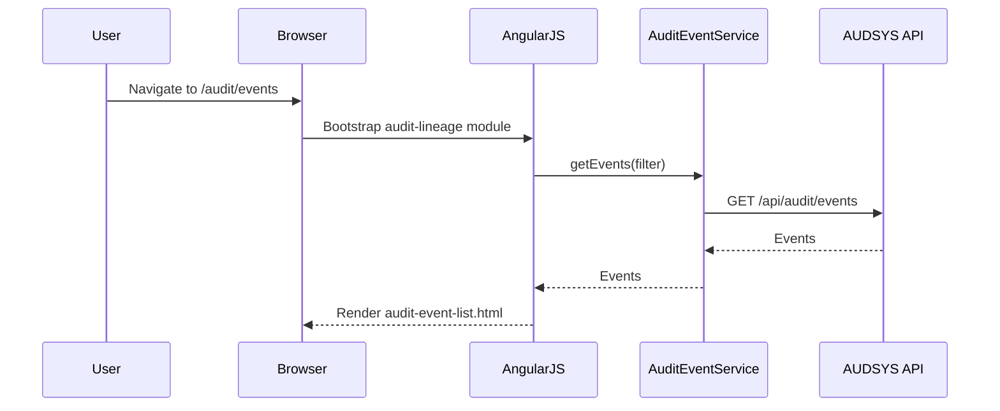
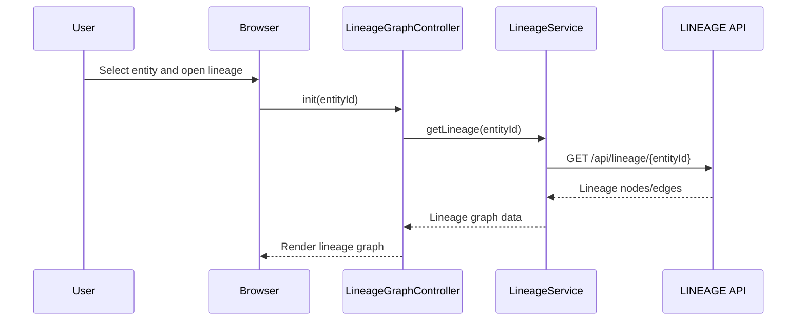
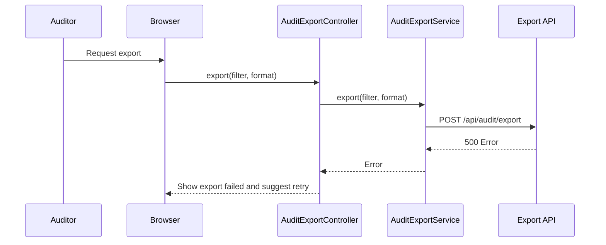

# LLD – QE-3211 Release2-Comprehensive Audit Trail and Data Lineage

## 1. Application Architecture

### 1.1 Overview
Feature providing UI and client logic for viewing audit events, exploring data lineage, and exporting audit information for investigations.

Stack:
- AngularJS 1.x
- JavaScript ES6
- HTML5/CSS3/Bootstrap
- REST APIs for AUDSYS, LINEAGE, LOGDB, META, DASH.

### 1.2 AngularJS MVC Mapping

#### Module
- `apbAuditLineage` – feature module for QE-3211.

#### Controllers
- `AuditEventListController` – list and filter audit events.
- `AuditEventDetailsController` – show details for individual event.
- `LineageGraphController` – display lineage graph for data entities.
- `AuditExportController` – export audit data for external audit.

#### Services
- `AuditEventService` – query AUDSYS/LOGDB.
- `LineageService` – query lineage engine.
- `AuditExportService` – export data according to policies.

#### Directives
- `audit-event-grid` – event listing grid.
- `lineage-graph` – visualization of lineage.

#### Models
- `AuditEvent` – single event.
- `LineageNode` – entity in lineage graph.
- `LineageEdge` – relationship.

### 1.3 Folder Structure

```text
/app/features/audit-lineage
  audit-lineage.module.js
  audit-lineage.routes.js
  controllers/
    audit-event-list.controller.js
    audit-event-details.controller.js
    lineage-graph.controller.js
    audit-export.controller.js
  services/
    audit-event.service.js
    lineage.service.js
    audit-export.service.js
  directives/
    audit-event-grid.directive.js
    lineage-graph.directive.js
  models/
    audit-event.model.js
    lineage-node.model.js
    lineage-edge.model.js
  views/
    audit-event-list.html
    audit-event-details.html
    lineage-graph.html
    audit-export.html
```

## 2. Component Specifications

### 2.1 Controller: `AuditEventListController`
- **Responsibility**:
  - List audit events and filter by time range, user, system component.

### 2.2 Controller: `AuditEventDetailsController`
- **Responsibility**:
  - Show event details including before/after states.

### 2.3 Controller: `LineageGraphController`
- **Responsibility**:
  - Display lineage graph for selected entity.

### 2.4 Controller: `AuditExportController`
- **Responsibility**:
  - Export events to file (CSV/JSON) per RBAC and policies.

### 2.5 Service: `AuditEventService`
- **Responsibility**:
  - Query audit events.
- **Public Methods**:
  - `getEvents(filter)` – GET `/api/audit/events`.
  - `getEventById(eventId)` – GET `/api/audit/events/{eventId}`.

### 2.6 Service: `LineageService`
- **Responsibility**:
  - Query lineage information.
- **Public Methods**:
  - `getLineage(entityId)` – GET `/api/lineage/{entityId}`.

### 2.7 Service: `AuditExportService`
- **Responsibility**:
  - Export with server-side generation.
- **Public Methods**:
  - `export(filter, format)` – POST `/api/audit/export`.

### 2.8 Models

#### `AuditEvent`
- Attributes:
  - `id`, `timestamp`, `userId`, `system`, `entityId`, `action`, `before`, `after`.

#### `LineageNode`
- Attributes:
  - `id`, `type`, `label`, `metadata`.

#### `LineageEdge`
- Attributes:
  - `sourceId`, `targetId`, `relationType`.

## 3. Interface Specifications

### 3.1 REST – Audit Events

#### Get Events
- **Endpoint**: `GET /api/audit/events`
- **Query**: `from`, `to`, `userId`, `system`, `entityId`.

### 3.2 REST – Lineage

#### Get Lineage
- **Endpoint**: `GET /api/lineage/{entityId}`

## 4. Data Flow

### 4.1 Event Listing
1. User opens audit event list.
2. `AuditEventListController` calls `AuditEventService.getEvents(filter)`.
3. Backend AUDSYS queries LOGDB/META and returns events.

### 4.2 Lineage Exploration
1. User selects entity.
2. `LineageGraphController` calls `LineageService.getLineage(entityId)`.
3. Backend builds lineage and returns nodes/edges.

## 5. Sequence Diagrams

### 5.1 App Initialization – Audit Lineage



### 5.2 Primary Workflow – Lineage View



### 5.3 Error Scenario – Export Failure



## 6. Implementation Details

- Use paging for event listing to handle large data sets.

## 7. Configuration

- Routes:
  - `/audit/events`.
  - `/audit/events/:eventId`.
  - `/audit/lineage/:entityId`.
  - `/audit/export`.

## 8. Error Handling and Resiliency

- UI indicates partial data when lineage incomplete due to subsystem issues.

## 9. Security Considerations

- Access to audit viewing and export restricted via RBAC and MFA.
- Export obeys data protection policies.
