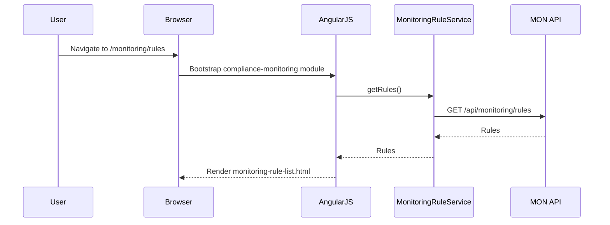
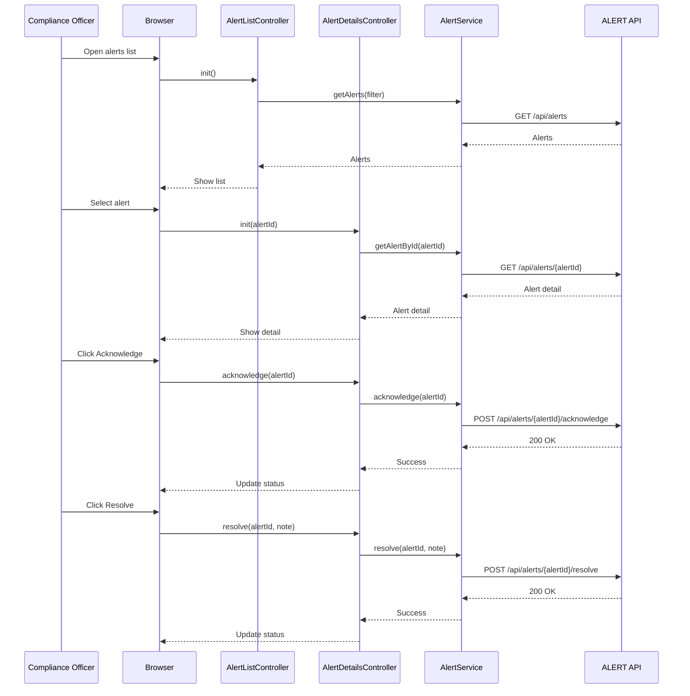
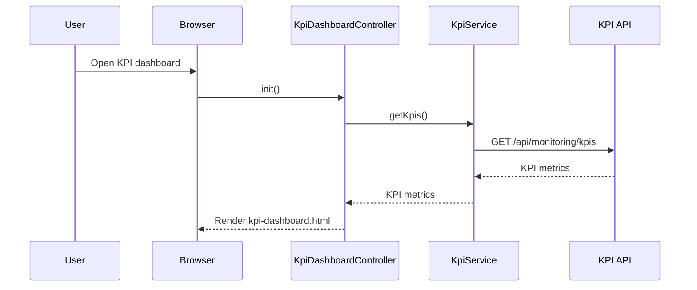
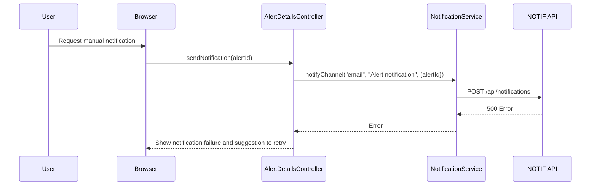

# LLD – QE-3212 Release2-Compliance Monitoring, Threshold Alerts, and Notifications

## 1. Application Architecture

### 1.1 Overview
Feature to configure compliance monitoring rules, thresholds, and alert policies; view alerts and KPIs; manage notifications and escalations.

Stack:
- AngularJS 1.x
- JavaScript ES6
- HTML5/CSS3/Bootstrap
- REST APIs for MON, RULES, ALERT, KPI, NOTIF, DASH, ALERTDB, CFGSTORE, AUD.

### 1.2 AngularJS MVC Mapping

#### Module
- `apbComplianceMonitoring` – feature module for QE-3212.

#### Controllers
- `MonitoringRuleListController` – list monitoring rules and thresholds.
- `MonitoringRuleDetailsController` – create/edit rules.
- `AlertListController` – view current and historical alerts.
- `AlertDetailsController` – manage acknowledgement and resolution.
- `KpiDashboardController` – show compliance KPIs.

#### Services
- `MonitoringRuleService` – manage monitoring rules.
- `AlertService` – manage alerts and statuses.
- `KpiService` – retrieve KPIs.
- `AuditService`, `NotificationService`.

#### Directives
- `threshold-rule-form` – form for threshold rules.
- `alert-status-badge` – display alert severity/status.
- `kpi-widget` – KPI visualization.

#### Models
- `MonitoringRule` – threshold and rule definition.
- `Alert` – alert instance.
- `KpiMetric` – KPIs for dashboard.

### 1.3 Folder Structure

```text
/app/features/compliance-monitoring
  compliance-monitoring.module.js
  compliance-monitoring.routes.js
  controllers/
    monitoring-rule-list.controller.js
    monitoring-rule-details.controller.js
    alert-list.controller.js
    alert-details.controller.js
    kpi-dashboard.controller.js
  services/
    monitoring-rule.service.js
    alert.service.js
    kpi.service.js
    audit.service.js
    notification.service.js
  directives/
    threshold-rule-form.directive.js
    alert-status-badge.directive.js
    kpi-widget.directive.js
  models/
    monitoring-rule.model.js
    alert.model.js
    kpi-metric.model.js
  views/
    monitoring-rule-list.html
    monitoring-rule-details.html
    alert-list.html
    alert-details.html
    kpi-dashboard.html
```

## 2. Component Specifications

### 2.1 Controller: `MonitoringRuleListController`
- **Responsibility**:
  - List rules; filter by jurisdiction and severity.

### 2.2 Controller: `MonitoringRuleDetailsController`
- **Responsibility**:
  - Create/edit monitoring rules and thresholds.

### 2.3 Controller: `AlertListController`
- **Responsibility**:
  - Display active and historical alerts.

### 2.4 Controller: `AlertDetailsController`
- **Responsibility**:
  - Show alert details, manage acknowledgement, resolution, and escalation.

### 2.5 Controller: `KpiDashboardController`
- **Responsibility**:
  - Show KPIs (compliance score, alert SLA, threshold violations), integrate with DASH.

### 2.6 Service: `MonitoringRuleService`
- **Responsibility**:
  - CRUD threshold and rule config.
- **Public Methods**:
  - `getRules(filter)` – GET `/api/monitoring/rules`.
  - `getRuleById(ruleId)` – GET `/api/monitoring/rules/{ruleId}`.
  - `createRule(rule)` – POST `/api/monitoring/rules`.
  - `updateRule(ruleId, rule)` – PUT `/api/monitoring/rules/{ruleId}`.

### 2.7 Service: `AlertService`
- **Responsibility**:
  - Manage alerts and statuses.
- **Public Methods**:
  - `getAlerts(filter)` – GET `/api/alerts`.
  - `getAlertById(alertId)` – GET `/api/alerts/{alertId}`.
  - `acknowledge(alertId)` – POST `/api/alerts/{alertId}/acknowledge`.
  - `resolve(alertId, resolution)` – POST `/api/alerts/{alertId}/resolve`.

### 2.8 Service: `KpiService`
- **Responsibility**:
  - Retrieve KPI metrics.
- **Public Methods**:
  - `getKpis()` – GET `/api/monitoring/kpis`.

### 2.9 Models

#### `MonitoringRule`
- Attributes:
  - `id`, `name`, `jurisdiction`, `thresholdType`, `thresholdValue`, `unit`, `severity`, `enabled`.

#### `Alert`
- Attributes:
  - `id`, `ruleId`, `status`, `severity`, `createdAt`, `acknowledgedAt`, `resolvedAt`, `assignee`.

#### `KpiMetric`
- Attributes:
  - `id`, `name`, `value`, `unit`, `period`.

## 3. Interface Specifications

### 3.1 REST – Monitoring Rules

#### Create Rule
- **Endpoint**: `POST /api/monitoring/rules`
- **Payload**:
```json
{
  "name": "SVHC Concentration Exceeds Limit",
  "jurisdiction": "EUMDR",
  "thresholdType": "CONCENTRATION",
  "thresholdValue": 0.1,
  "unit": "%",
  "severity": "HIGH",
  "enabled": true
}
```

### 3.2 REST – Alerts

#### Get Alerts
- **Endpoint**: `GET /api/alerts?status=ACTIVE&severity=HIGH`

#### Acknowledge
- **Endpoint**: `POST /api/alerts/{alertId}/acknowledge`

#### Resolve
- **Endpoint**: `POST /api/alerts/{alertId}/resolve`
- **Payload**:
```json
{
  "resolutionNote": "Confirmed issue; mitigation applied.",
  "resolvedBy": "user123"
}
```

### 3.3 REST – KPIs

- **Endpoint**: `GET /api/monitoring/kpis`

## 4. Data Flow

### 4.1 Rule Configuration
1. User opens rule list.
2. `MonitoringRuleListController` loads rules.
3. User creates new rule via `MonitoringRuleDetailsController`.
4. Backend MON/RULES store rule in CFGSTORE and log audit.

### 4.2 Alert Lifecycle
1. Monitoring service detects violation and creates alert in ALERTDB.
2. UI via `AlertListController` displays active alerts.
3. User opens alert details; `AlertDetailsController` shows data.
4. User acknowledges alert; `AlertService.acknowledge()` records acknowledgement.
5. User resolves alert; `AlertService.resolve()` records resolution.

### 4.3 KPI Display
1. Monitoring and KPI calculator write metrics to DW/ALERTDB.
2. `KpiDashboardController` calls `KpiService.getKpis()`.
3. KPIs displayed via `kpi-widget` directives.

## 5. Sequence Diagrams

### 5.1 App Initialization – Compliance Monitoring



### 5.2 Primary Workflow – Alert Acknowledgement and Resolution



### 5.3 Service/API – KPI Retrieval



### 5.4 Error Scenario – Notification Failure



## 6. Implementation Details

- ES6 and AngularJS DI as in other modules.

## 7. Configuration

- Routes:
  - `/monitoring/rules`.
  - `/monitoring/rules/new`.
  - `/monitoring/rules/:ruleId`.
  - `/monitoring/alerts`.
  - `/monitoring/alerts/:alertId`.
  - `/monitoring/kpi`.

## 8. Error Handling and Resiliency

- UI indicates when DW/ECHADB/CASREG or ALERTDB unavailable.

## 9. Security Considerations

- Threshold editing restricted via RBAC.
- Alerts visible based on jurisdiction and user role.
- Audit logging of rule changes and alert lifecycle actions.
