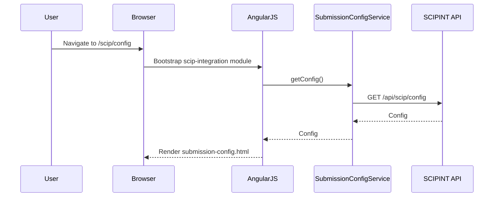
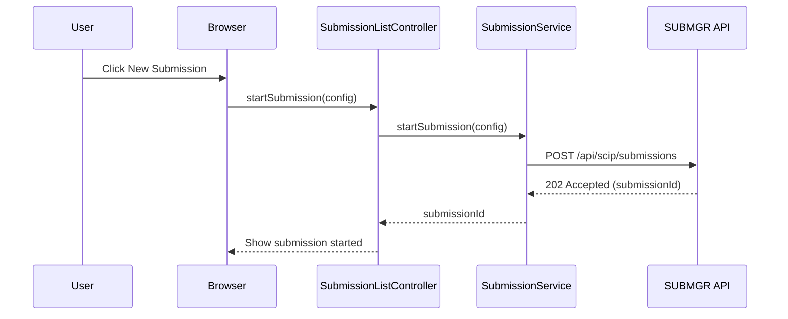
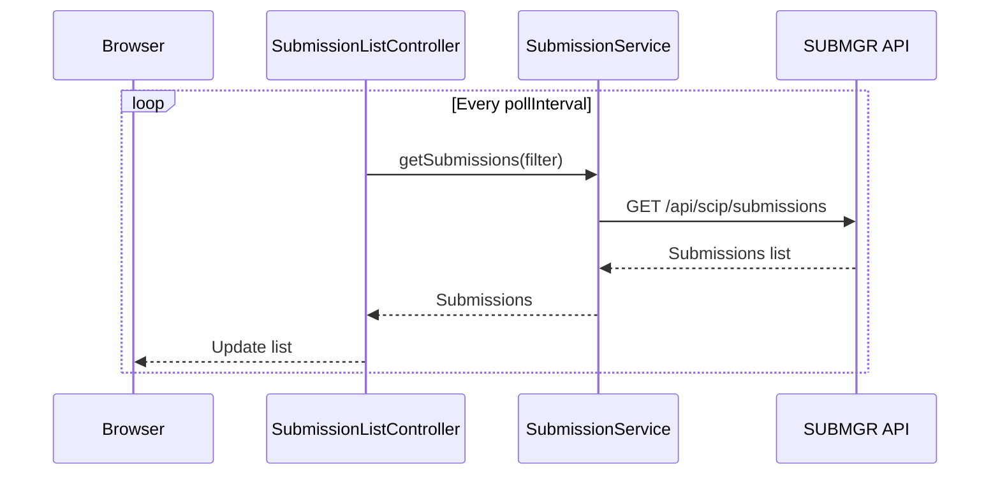
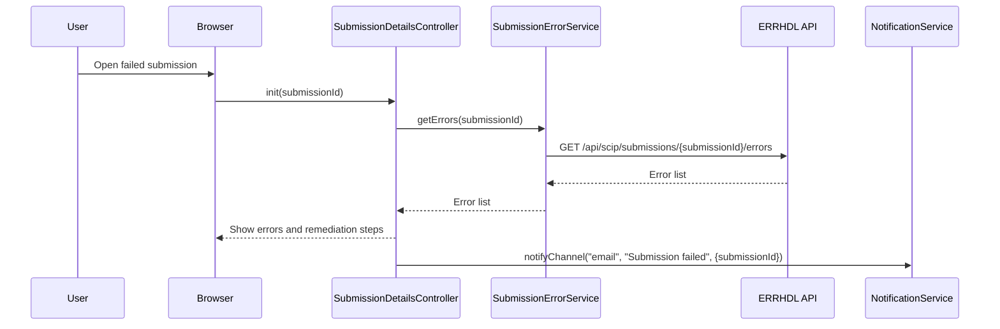

# LLD – QE-3213 Release2-SCIP Integration and IUCLID Submission Management

## 1. Application Architecture

### 1.1 Overview
Feature for managing SCIP integration and IUCLID submissions, including package generation, submission lifecycle tracking, error handling, and dashboards.

Stack:
- AngularJS 1.x
- JavaScript ES6
- HTML5/CSS3/Bootstrap
- REST APIs for SCIPINT, IUCLIDGEN, SUBMGR, ERRHDL, SUBDB, CFGSTORE, AUD, NOTIF, DASH.

### 1.2 AngularJS MVC Mapping

#### Module
- `apbScipIntegration` – feature module for QE-3213.

#### Controllers
- `SubmissionConfigController` – manage submission config (endpoints, mappings, polling intervals).
- `SubmissionListController` – list submissions and their statuses.
- `SubmissionDetailsController` – view details of a single submission.
- `SubmissionErrorController` – display and help remediate errors.

#### Services
- `SubmissionConfigService` – manage config in CFGSTORE.
- `IuclidPackageService` – interact with IUCLIDGEN.
- `SubmissionService` – manage submission lifecycle (SUBMGR/SCIPAPI).
- `SubmissionErrorService` – query errors from ERRHDL.
- `AuditService`, `NotificationService`.

#### Directives
- `submission-config-form` – config form.
- `submission-status-badge` – status indicator.
- `submission-error-grid` – display errors.

#### Models
- `SubmissionConfig` – config for submissions.
- `SubmissionRecord` – single submission.
- `SubmissionError` – error record.

### 1.3 Folder Structure

```text
/app/features/scip-integration
  scip-integration.module.js
  scip-integration.routes.js
  controllers/
    submission-config.controller.js
    submission-list.controller.js
    submission-details.controller.js
    submission-error.controller.js
  services/
    submission-config.service.js
    iuclid-package.service.js
    submission.service.js
    submission-error.service.js
    audit.service.js
    notification.service.js
  directives/
    submission-config-form.directive.js
    submission-status-badge.directive.js
    submission-error-grid.directive.js
  models/
    submission-config.model.js
    submission-record.model.js
    submission-error.model.js
  views/
    submission-config.html
    submission-list.html
    submission-details.html
    submission-errors.html
```

## 2. Component Specifications

### 2.1 Controller: `SubmissionConfigController`
- **Responsibility**:
  - View and edit submission configuration (API endpoints, retry policies, polling intervals).

### 2.2 Controller: `SubmissionListController`
- **Responsibility**:
  - List submissions, filter by status and date.

### 2.3 Controller: `SubmissionDetailsController`
- **Responsibility**:
  - Show full submission details, acknowledgements, confirmation numbers.

### 2.4 Controller: `SubmissionErrorController`
- **Responsibility**:
  - Show submission errors and remediation suggestions.

### 2.5 Service: `SubmissionConfigService`
- **Responsibility**:
  - CRUD config via CFGSTORE.
- **Public Methods**:
  - `getConfig()` – GET `/api/scip/config`.
  - `updateConfig(config)` – PUT `/api/scip/config`.

### 2.6 Service: `IuclidPackageService`
- **Responsibility**:
  - Generate IUCLID packages.
- **Public Methods**:
  - `generatePackage(submissionId)` – POST `/api/scip/submissions/{submissionId}/iuclid`.

### 2.7 Service: `SubmissionService`
- **Responsibility**:
  - Manage submissions.
- **Public Methods**:
  - `getSubmissions(filter)` – GET `/api/scip/submissions`.
  - `getSubmissionById(submissionId)` – GET `/api/scip/submissions/{submissionId}`.
  - `startSubmission(submissionConfig)` – POST `/api/scip/submissions`.
  - `pollStatus(submissionId)` – GET `/api/scip/submissions/{submissionId}/status`.

### 2.8 Service: `SubmissionErrorService`
- **Responsibility**:
  - Get submission errors.
- **Public Methods**:
  - `getErrors(submissionId)` – GET `/api/scip/submissions/{submissionId}/errors`.

### 2.9 Models

#### `SubmissionConfig`
- Attributes:
  - `id`, `endpoint`, `jurisdiction`, `pollIntervalSeconds`, `maxRetries`, `retryBackoffSeconds`.

#### `SubmissionRecord`
- Attributes:
  - `id`, `status`, `createdAt`, `completedAt`, `ackNumber`, `confirmationNumber`.

#### `SubmissionError`
- Attributes:
  - `id`, `submissionId`, `type`, `message`, `timestamp`, `retryable`.

## 3. Interface Specifications

### 3.1 REST – Submission Config

- **Endpoint**: `GET /api/scip/config`
- **Endpoint**: `PUT /api/scip/config`

### 3.2 REST – Submissions

#### Start Submission
- **Endpoint**: `POST /api/scip/submissions`
- **Payload**:
```json
{
  "datasetId": "DS-001",
  "jurisdiction": "EU",
  "initiatedBy": "user123"
}
```

#### Get Submission Status
- **Endpoint**: `GET /api/scip/submissions/{submissionId}/status`

### 3.3 REST – Errors

- **Endpoint**: `GET /api/scip/submissions/{submissionId}/errors`

## 4. Data Flow

### 4.1 Submission Start
1. User starts submission from UI.
2. `SubmissionService.startSubmission()` posts to backend.
3. Backend creates record in SUBDB and triggers IUCLID generation.

### 4.2 Status Polling
1. `SubmissionListController` periodically calls `SubmissionService.getSubmissions()`.
2. Backend polls SCIPAPI and updates statuses in SUBDB.

### 4.3 Error Handling
1. If submission fails, ERRHDL records errors in LOGDB and SUBDB.
2. UI via `SubmissionErrorController` displays errors and suggestions.

## 5. Sequence Diagrams

### 5.1 App Initialization – SCIP Integration



### 5.2 Primary Workflow – Start Submission



### 5.3 Service/API – Poll Status



### 5.4 Error Scenario – Submission Failure



## 6. Implementation Details

- ES6 patterns.

## 7. Configuration

- Routes:
  - `/scip/config`.
  - `/scip/submissions`.
  - `/scip/submissions/:submissionId`.
  - `/scip/errors/:submissionId`.

## 8. Error Handling and Resiliency

- UI surfaces retryable vs non-retryable errors.

## 9. Security Considerations

- Submission actions restricted to Regulatory Affairs roles.
- Audit logging of submissions and errors.
