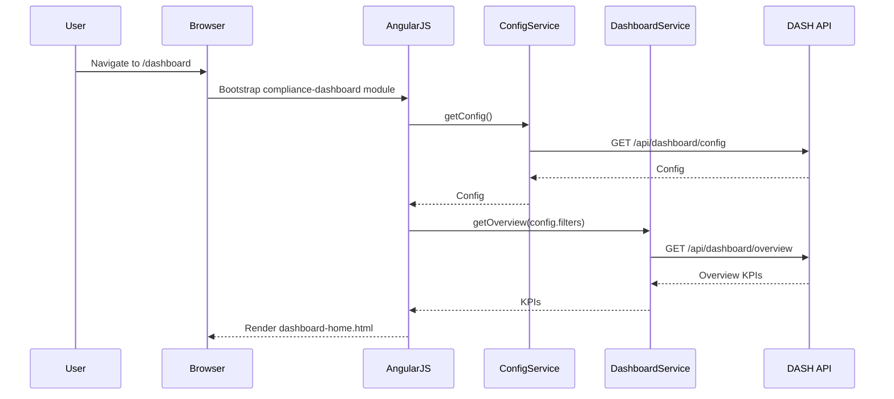
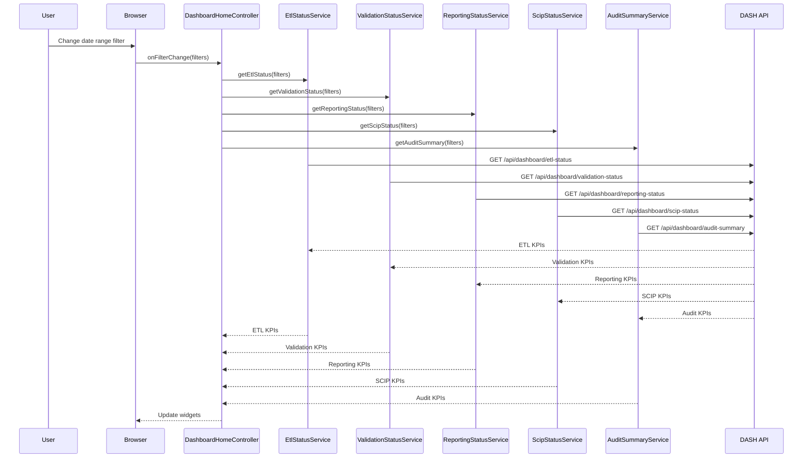
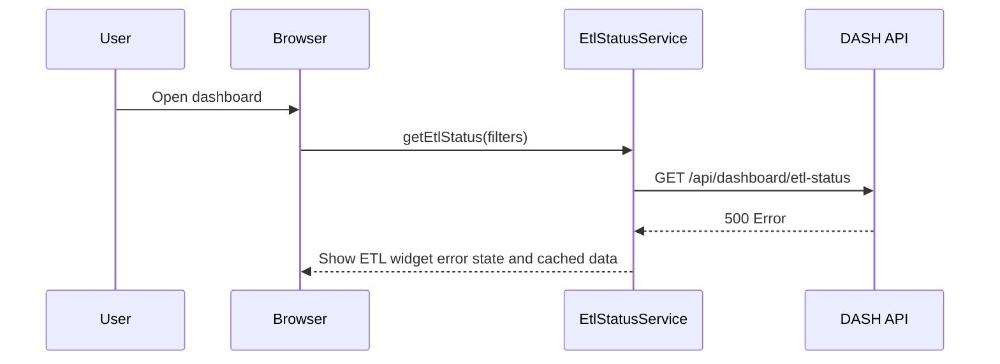

# LLD – QE-3214 Release2-Regulatory Compliance Dashboard and Operational KPIs

## 1. Application Architecture

### 1.1 Overview
Feature for a centralized compliance dashboard displaying ETL job status, validation errors, compliance scores, threshold violations, submission status, pending reports, and audit summaries.

Stack:
- AngularJS 1.x
- JavaScript ES6
- HTML5/CSS3/Bootstrap
- REST APIs for DASH, ETL, VAL, REP, SCIP, AUD, NOTIF, CFGSTORE, METRICDB, DW, LOGDB.

### 1.2 AngularJS MVC Mapping

#### Module
- `apbComplianceDashboard` – feature module for QE-3214.

#### Controllers
- `DashboardHomeController` – main overview dashboard.
- `EtlStatusWidgetController` – ETL job status widget.
- `ValidationWidgetController` – validation errors widget.
- `ReportingWidgetController` – reporting status widget.
- `ScipWidgetController` – SCIP submission widget.
- `AuditSummaryController` – audit summary and drill-down.
- `ConfigController` – manage dashboard configuration.

#### Services
- `DashboardService` – orchestrate data sources.
- `EtlStatusService` – fetch ETL stats from METRICDB/DW.
- `ValidationStatusService` – fetch validation stats.
- `ReportingStatusService` – reporting KPIs.
- `ScipStatusService` – submission KPIs.
- `AuditSummaryService` – audit KPIs.
- `ConfigService` – configuration management.
- `NotificationService`.

#### Directives
- `dashboard-widget` – generic widget wrapper.
- `compliance-score-gauge` – gauge for compliance score.
- `trend-chart` – chart for KPIs over time.

#### Models
- `DashboardConfig` – configuration.
- `WidgetConfig` – widget configuration.
- `KpiMetric` – metrics for dashboard.

### 1.3 Folder Structure

```text
/app/features/compliance-dashboard
  compliance-dashboard.module.js
  compliance-dashboard.routes.js
  controllers/
    dashboard-home.controller.js
    etl-status-widget.controller.js
    validation-widget.controller.js
    reporting-widget.controller.js
    scip-widget.controller.js
    audit-summary.controller.js
    config.controller.js
  services/
    dashboard.service.js
    etl-status.service.js
    validation-status.service.js
    reporting-status.service.js
    scip-status.service.js
    audit-summary.service.js
    config.service.js
    notification.service.js
  directives/
    dashboard-widget.directive.js
    compliance-score-gauge.directive.js
    trend-chart.directive.js
  models/
    dashboard-config.model.js
    widget-config.model.js
    kpi-metric.model.js
  views/
    dashboard-home.html
    dashboard-config.html
```

## 2. Component Specifications

### 2.1 Controller: `DashboardHomeController`
- **Responsibility**:
  - Orchestrate widgets and provide global filters (date range, jurisdiction, product line).

### 2.2 Controller: `EtlStatusWidgetController`
- **Responsibility**:
  - Show ETL job status and failures.

### 2.3 Controller: `ValidationWidgetController`
- **Responsibility**:
  - Show validation errors and data quality KPIs.

### 2.4 Controller: `ReportingWidgetController`
- **Responsibility**:
  - Show pending and completed reports.

### 2.5 Controller: `ScipWidgetController`
- **Responsibility**:
  - Show SCIP submission statuses.

### 2.6 Controller: `AuditSummaryController`
- **Responsibility**:
  - Show audit log summaries and allow drill-down.

### 2.7 Controller: `ConfigController`
- **Responsibility**:
  - Manage widget configuration and thresholds.

### 2.8 Service: `DashboardService`
- **Responsibility**:
  - Provide aggregated data for composite views.

### 2.9 Service: `EtlStatusService`
- **Responsibility**:
  - Fetch ETL KPIs.

### 2.10 Service: `ValidationStatusService`
- **Responsibility**:
  - Fetch validation KPIs.

### 2.11 Service: `ReportingStatusService`
- **Responsibility**:
  - Fetch reporting KPIs.

### 2.12 Service: `ScipStatusService`
- **Responsibility**:
  - Fetch SCIP KPIs.

### 2.13 Service: `AuditSummaryService`
- **Responsibility**:
  - Fetch audit KPIs.

### 2.14 Service: `ConfigService`
- **Responsibility**:
  - Manage dashboard config via CFGSTORE.

### 2.15 Models

#### `DashboardConfig`
- Attributes:
  - `id`, `userId`, `widgets`, `filters`.

#### `WidgetConfig`
- Attributes:
  - `id`, `type`, `position`, `size`, `thresholds`.

#### `KpiMetric`
- Attributes:
  - `id`, `name`, `value`, `unit`, `period`, `trend`.

## 3. Interface Specifications

### 3.1 REST – Dashboard Config

- **Endpoint**: `GET /api/dashboard/config`
- **Endpoint**: `PUT /api/dashboard/config`

### 3.2 REST – ETL Status

- **Endpoint**: `GET /api/dashboard/etl-status`

### 3.3 REST – Validation Status

- **Endpoint**: `GET /api/dashboard/validation-status`

### 3.4 REST – Reporting Status

- **Endpoint**: `GET /api/dashboard/reporting-status`

### 3.5 REST – SCIP Status

- **Endpoint**: `GET /api/dashboard/scip-status`

### 3.6 REST – Audit Summary

- **Endpoint**: `GET /api/dashboard/audit-summary`

## 4. Data Flow

### 4.1 Dashboard Initialization
1. User opens dashboard.
2. `DashboardHomeController` loads config via `ConfigService.getConfig()`.
3. Widgets initialized with filters and data from respective services.

### 4.2 KPI Update
1. User changes filter (date range, jurisdiction).
2. `DashboardHomeController` propagates filter changes.
3. Each widget controller calls respective services with filters.
4. Backend reads METRICDB/DW/LOGDB and returns KPIs.

## 5. Sequence Diagrams

### 5.1 App Initialization – Compliance Dashboard



### 5.2 Primary Workflow – Filter Change



### 5.3 Error Scenario – ETL Status Unavailable



## 6. Implementation Details

- Use ES6 and AngularJS DI.

## 7. Configuration

- Routes:
  - `/dashboard`.
  - `/dashboard/config`.

## 8. Error Handling and Resiliency

- Widgets show partial data when subsystems unavailable.

## 9. Security Considerations

- RBAC and ABAC for data visibility.
- Audit logging of dashboard access and configuration changes.
