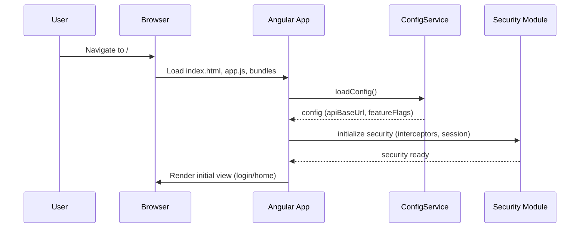
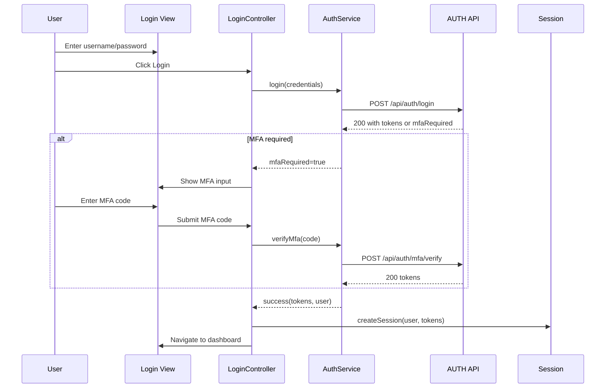
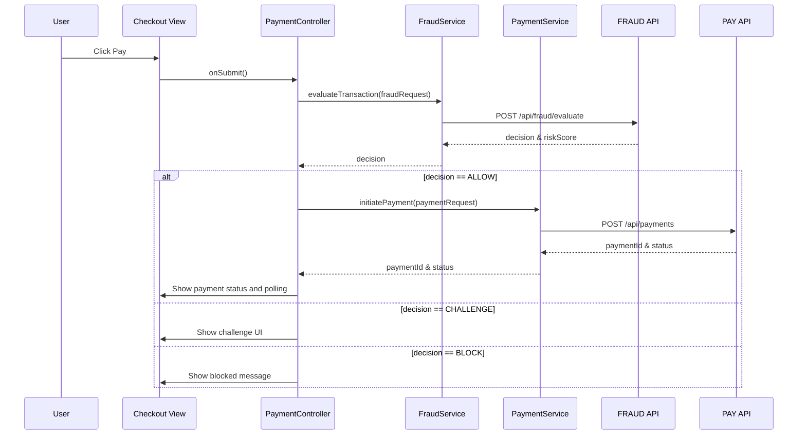
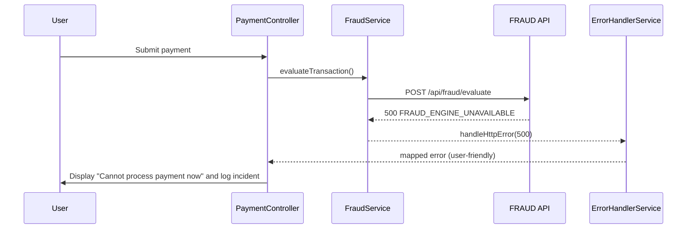

# Low-Level Design (LLD) – Epic QE-3535

## 1. Overview

This LLD defines the detailed implementation design for security, fraud, and compliance services for an enterprise-grade web application built with AngularJS (1.x), JavaScript ES6, HTML5, CSS3, Bootstrap, REST APIs, and an MVC architecture.

The scope covers:
- Web security controls (WAF integration assumptions at edge, client-side protections).
- Authentication and authorization flows.
- Payment and fraud workflows.
- Centralized logging, monitoring, and compliance enablement.

All HLD elements are translated into concrete AngularJS artifacts and REST interfaces.

---

## 2. Application Architecture

### 2.1 AngularJS MVC Mapping

The application is structured as a single-page application (SPA) using AngularJS 1.x with the following core modules:

- `app.core` – Core configuration, routing, constants, interceptors.
- `app.security` – Authentication, authorization, session management, security utilities.
- `app.payments` – Payment initiation, status handling, card token usage.
- `app.fraud` – Fraud evaluation UIs and integration hooks.
- `app.audit` – Audit log viewer and filters (for admin/soc users).
- `app.shared` – Reusable directives, filters, and utility services.

Each module maps the HLD components as follows:

- **Authentication & Identity Service (AUTH)** → AngularJS services `AuthService`, `SessionService`, `TokenStorageService`; controllers `LoginController`, `MfaController`, `ProfileSecurityController`.
- **Core Application Services (APP)** → AngularJS services `OrderService`, `CartService`, `CatalogService`, etc., with embedded security checks via `AuthorizationService`.
- **Payment Gateway Integration (PAY)** → AngularJS service `PaymentService`, `PaymentTokenService` plus backend REST APIs.
- **Fraud Detection Engine (FRAUD)** → AngularJS service `FraudService`, background interaction via REST and status polling.
- **Key Management / Secrets Vault (KMS)** → Consumed only via backend; in front-end, configuration is injected via `ConfigService` and constants.
- **Security Log & Audit Store (LOG)** → Exposed via `AuditLogService`; UI via `AuditLogController`.
- **SIEM, CMP, DLP, MON, NOTI** → Surfaced via REST APIs consumed by `ComplianceService`, `NotificationService`, `MonitoringService` where UI is needed; otherwise, handled on backend.

### 2.2 Project Folder Structure

```text
src/
  index.html
  app/
    app.module.js
    app.routes.js
    app.config.js
    app.constants.js

    core/
      core.module.js
      http.interceptor.js
      error-handler.service.js
      config.service.js
      logger.service.js

    security/
      security.module.js
      auth.service.js
      auth.interceptor.js
      authorization.service.js
      session.service.js
      token-storage.service.js
      login.controller.js
      mfa.controller.js
      profile-security.controller.js

    payments/
      payments.module.js
      payment.service.js
      payment-token.service.js
      payment.controller.js
      payment-status.controller.js

    fraud/
      fraud.module.js
      fraud.service.js
      fraud-banner.directive.js
      fraud-review.controller.js

    audit/
      audit.module.js
      audit-log.service.js
      audit-log.controller.js

    shared/
      shared.module.js
      directives/
        form-error-messages.directive.js
        secure-input.directive.js
      filters/
        mask-card.filter.js
      services/
        notification.service.js
        monitoring.service.js

  assets/
    css/
      main.css
      security.css
    js/
      polyfills.js
  environments/
    env.dev.js
    env.qa.js
    env.prod.js
```

---

## 3. Component Specifications

### 3.1 AuthService

- **Type**: AngularJS Service (`factory`)
- **File**: `app/security/auth.service.js`
- **Responsibility**:
  - Handle login, logout, token refresh, and MFA verification.
  - Communicate with backend AUTH APIs.
  - Maintain authentication lifecycle and error handling.
- **Public Methods**:
  - `login(credentials)`
  - `verifyMfa(mfaPayload)`
  - `logout()`
  - `refreshToken()`
  - `getCurrentUser()`
  - `isAuthenticated()`
- **Inputs/Outputs**:
  - `login(credentials: { username: string, password: string })` → `Promise<{ accessToken, refreshToken, user }> `
  - `verifyMfa({ code: string })` → `Promise<{ accessToken, refreshToken }>`
  - `logout()` → `Promise<void>`
  - `refreshToken()` → `Promise<{ accessToken, refreshToken }>`
  - `getCurrentUser()` → `User` object or `null`
  - `isAuthenticated()` → `boolean`
- **Dependencies (DI)**:
  - `$http`, `$q`, `TokenStorageService`, `SessionService`, `$log`, `ConfigService`.

### 3.2 AuthInterceptor

- **Type**: HTTP Interceptor
- **File**: `app/security/auth.interceptor.js`
- **Responsibility**:
  - Attach `Authorization: Bearer <token>` header for authenticated requests.
  - Handle 401/403 responses and route to login or error pages.
- **Public Methods**:
  - `request(config)`
  - `responseError(rejection)`
- **Inputs/Outputs**:
  - `request(config)` → modified `config` with auth header.
  - `responseError(rejection)` → promise rejection or redirect.
- **Dependencies**:
  - `$q`, `$injector`, `TokenStorageService`, `LoggerService`.

### 3.3 AuthorizationService

- **Type**: AngularJS Service
- **File**: `app/security/authorization.service.js`
- **Responsibility**:
  - RBAC and ABAC evaluation for view and action-level permissions.
  - Expose helper functions for directives and controllers.
- **Public Methods**:
  - `hasRole(role)`
  - `hasAnyRole(rolesArray)`
  - `isAuthorized(action, contextAttributes)`
- **Inputs/Outputs**:
  - `hasRole(role: string)` → `boolean`
  - `hasAnyRole(roles: string[])` → `boolean`
  - `isAuthorized(action: string, context: object)` → `boolean`
- **Dependencies**:
  - `SessionService`, `ConfigService` (for ABAC rule configs).

### 3.4 SessionService

- **Type**: AngularJS Service
- **File**: `app/security/session.service.js`
- **Responsibility**:
  - Maintain current user session in memory and synchronize with storage.
  - Handle session timeout and idle detection.
- **Public Methods**:
  - `createSession(user, tokens)`
  - `destroySession()`
  - `getUser()`
  - `getRoles()`
  - `setLastActivity()`
  - `getLastActivity()`
- **Dependencies**:
  - `$rootScope`, `$timeout`, `TokenStorageService`.

### 3.5 TokenStorageService

- **Type**: AngularJS Service
- **File**: `app/security/token-storage.service.js`
- **Responsibility**:
  - Securely store access and refresh tokens in browser storage.
  - Prefer `sessionStorage`; fallback to `localStorage` if allowed by policy.
  - Ensure XSS mitigation by avoiding direct injection into DOM.
- **Public Methods**:
  - `setTokens(accessToken, refreshToken)`
  - `getAccessToken()`
  - `getRefreshToken()`
  - `clearTokens()`
- **Dependencies**:
  - `$window`.

### 3.6 LoginController

- **Type**: AngularJS Controller
- **File**: `app/security/login.controller.js`
- **Responsibility**:
  - Handle login form interactions, input validation, error display.
  - Call `AuthService.login` and route to MFA if needed.
- **Public Methods (Scope/API)**:
  - `vm.login()`
  - `vm.clearErrors()`
- **Inputs/Outputs**:
  - Inputs: `vm.credentials = { username, password }` bound to the view.
  - Outputs: Emits events `auth:loginSuccess`, `auth:loginFailed`.
- **Dependencies**:
  - `$state`, `AuthService`, `NotificationService`.

### 3.7 PaymentService

- **Type**: AngularJS Service
- **File**: `app/payments/payment.service.js`
- **Responsibility**:
  - Initiate payments with the backend PAY service.
  - Handle payment status polling and error handling.
  - Ensure PCI DSS constraints on data handling (no raw PAN storage).
- **Public Methods**:
  - `initiatePayment(paymentRequest)`
  - `getPaymentStatus(paymentId)`
  - `cancelPayment(paymentId)`
- **Inputs/Outputs**:
  - `initiatePayment(paymentRequest)` → `Promise<{ paymentId, status, redirectUrl? }>`
  - `getPaymentStatus(paymentId: string)` → `Promise<{ status, reason? }>`
  - `cancelPayment(paymentId: string)` → `Promise<{ status }>`
- **Dependencies**:
  - `$http`, `$q`, `ConfigService`, `FraudService`, `LoggerService`.

### 3.8 FraudService

- **Type**: AngularJS Service
- **File**: `app/fraud/fraud.service.js`
- **Responsibility**:
  - Interact with FRAUD REST APIs to evaluate transactions.
  - Provide risk scores and decisions to payment and auth flows.
- **Public Methods**:
  - `evaluateTransaction(transactionPayload)`
  - `getRiskScore(transactionId)`
- **Inputs/Outputs**:
  - `evaluateTransaction(payload)` → `Promise<{ decision: 'ALLOW' | 'CHALLENGE' | 'BLOCK', riskScore: number }>`
  - `getRiskScore(transactionId: string)` → `Promise<{ riskScore: number }>`
- **Dependencies**:
  - `$http`, `$q`, `ConfigService`, `LoggerService`.

### 3.9 FraudBannerDirective

- **Type**: Directive
- **File**: `app/fraud/fraud-banner.directive.js`
- **Responsibility**:
  - Display fraud-related warnings or challenges in the UI.
- **Public API**:
  - Attributes:
    - `fraud-decision` – Decision string.
    - `fraud-score` – Numeric risk score.
- **Dependencies**:
  - None (isolated scope).

### 3.10 AuditLogService

- **Type**: AngularJS Service
- **File**: `app/audit/audit-log.service.js`
- **Responsibility**:
  - Retrieve paginated audit log entries from LOG backend.
  - Support filters by user, action, date range.
- **Public Methods**:
  - `getAuditLogs(filter)`
- **Inputs/Outputs**:
  - `filter: { userId?, action?, fromDate?, toDate?, page?, size? }`
  - Returns `Promise<{ items: AuditLogEntry[], total: number }>`
- **Dependencies**:
  - `$http`, `ConfigService`.

### 3.11 ErrorHandlerService

- **Type**: AngularJS Service
- **File**: `app/core/error-handler.service.js`
- **Responsibility**:
  - Provide centralized client-side error handling.
  - Map exception types to user-friendly messages.
- **Public Methods**:
  - `handleHttpError(rejection)`
  - `handleClientError(error)`
- **Dependencies**:
  - `NotificationService`, `LoggerService`.

---

## 4. Component Responsibilities

### 4.1 UI & Business Logic Ownership

- **Controllers** (e.g., `LoginController`, `PaymentController`):
  - Manage UI state, form models, and validation feedback.
  - Delegate business logic to services.
  - Orchestrate flows (e.g., login → MFA → redirect).

- **Services** (Auth, Payment, Fraud, Audit):
  - Own business logic related to security, payment, and logging.
  - Perform REST calls, interpret responses, and manage state.

- **Directives**:
  - Own DOM behavior such as showing validation errors, secure input masking, fraud banners.

- **Models/Data Objects**:
  - Represent tokens, user identities, payments, fraud decisions in plain JS objects.

- **Interceptors**:
  - Cross-cutting concerns such as auth headers, API error normalization, and logging.

### 4.2 Security Responsibilities

- **AuthService** and **AuthorizationService**:
  - Enforce RBAC/ABAC at client level (e.g., hiding buttons not allowed by role).
  - Ensure tokens and sessions are valid before performing operations.

- **PaymentService** and **FraudService**:
  - Ensure fraud evaluation occurs before critical payment actions.
  - Fail closed: if FRAUD or PAY calls fail, respond with safe errors and do not bypass checks.

- **AuditLogService**:
  - Ensure all sensitive operations are logged by calling backend endpoints that produce tamper-evident entries.

---

## 5. Interface Specifications

### 5.1 REST API – Authentication & Identity

All endpoints are served via the backend AUTH service and discovered via `ConfigService.apiBaseUrl`.

#### 5.1.1 Login

- **Endpoint**: `POST /api/auth/login`
- **Description**: Authenticate user and issue access/refresh tokens.
- **Request Payload**:
```json
{
  "username": "string",
  "password": "string",
  "deviceInfo": {
    "deviceId": "string",
    "deviceType": "WEB",
    "ipAddress": "string"
  }
}
```
- **Response 200**:
```json
{
  "accessToken": "jwt-string",
  "refreshToken": "jwt-string",
  "user": {
    "id": "string",
    "username": "string",
    "roles": ["CONSUMER", "SELLER"],
    "attributes": {
      "geo": "string",
      "deviceRisk": "LOW|MEDIUM|HIGH"
    }
  },
  "mfaRequired": false
}
```
- **Response 401**:
```json
{
  "code": "AUTH_INVALID_CREDENTIALS",
  "message": "Invalid username or password"
}
```
- **Response 423** (locked account):
```json
{
  "code": "ACCOUNT_LOCKED",
  "message": "Account locked due to multiple failed attempts"
}
```

#### 5.1.2 MFA Verification

- **Endpoint**: `POST /api/auth/mfa/verify`
- **Request**:
```json
{
  "mfaToken": "string",
  "code": "string"
}
```
- **Response 200**:
```json
{
  "accessToken": "jwt-string",
  "refreshToken": "jwt-string"
}
```

#### 5.1.3 Token Refresh

- **Endpoint**: `POST /api/auth/token/refresh`
- **Request**:
```json
{
  "refreshToken": "jwt-string"
}
```
- **Response 200**:
```json
{
  "accessToken": "jwt-string",
  "refreshToken": "jwt-string"
}
```

#### 5.1.4 Logout

- **Endpoint**: `POST /api/auth/logout`
- **Request**:
```json
{
  "refreshToken": "jwt-string"
}
```
- **Response 204**: No content.

### 5.2 REST API – Payments (PAY)

#### 5.2.1 Initiate Payment

- **Endpoint**: `POST /api/payments`
- **Request**:
```json
{
  "orderId": "string",
  "amount": 0,
  "currency": "USD",
  "paymentMethodToken": "string",
  "channel": "WEB",
  "metadata": {
    "deviceId": "string",
    "browserFingerprint": "string"
  }
}
```
- **Response 202**:
```json
{
  "paymentId": "string",
  "status": "PENDING|REQUIRES_AUTH|COMPLETED|FAILED",
  "redirectUrl": "string"
}
```
- **Error 400** (invalid request):
```json
{
  "code": "PAYMENT_VALIDATION_ERROR",
  "message": "Invalid payment payload",
  "details": ["amount must be > 0"]
}
```

#### 5.2.2 Payment Status

- **Endpoint**: `GET /api/payments/{paymentId}`
- **Response 200**:
```json
{
  "paymentId": "string",
  "status": "PENDING|COMPLETED|FAILED|CANCELLED",
  "failureReason": "string"
}
```

### 5.3 REST API – Fraud Detection (FRAUD)

#### 5.3.1 Evaluate Transaction

- **Endpoint**: `POST /api/fraud/evaluate`
- **Request**:
```json
{
  "transactionId": "string",
  "orderId": "string",
  "amount": 0,
  "currency": "USD",
  "userId": "string",
  "attributes": {
    "ipAddress": "string",
    "deviceId": "string",
    "geo": "string"
  }
}
```
- **Response 200**:
```json
{
  "decision": "ALLOW|CHALLENGE|BLOCK",
  "riskScore": 0,
  "rulesTriggered": ["string"]
}
```

- **Error 500** (engine unavailable):
```json
{
  "code": "FRAUD_ENGINE_UNAVAILABLE",
  "message": "Fraud engine temporarily unavailable"
}
```

### 5.4 REST API – Audit Logs (LOG)

- **Endpoint**: `GET /api/audit/logs`
- **Query Params**: `userId`, `action`, `from`, `to`, `page`, `size`.
- **Response 200**:
```json
{
  "items": [
    {
      "id": "string",
      "timestamp": "2024-01-01T12:00:00Z",
      "userId": "string",
      "action": "LOGIN_SUCCESS|PAYMENT_INITIATED|PAYMENT_FAILED|ROLE_CHANGED",
      "resource": "string",
      "details": "string",
      "ipAddress": "string"
    }
  ],
  "total": 123
}
```

### 5.5 REST API – Compliance & Policy (CMP)

- **Endpoint**: `GET /api/compliance/policies`
- **Endpoint**: `GET /api/compliance/reports/{reportId}`

These endpoints are mainly used by admin dashboards and not directly by end-users.

---

## 6. Data Model Design

### 6.1 User Model

```js
// app/security/models/user.model.js
export class User {
  constructor() {
    this.id = null;           // string
    this.username = null;     // string
    this.roles = [];          // string[]
    this.attributes = {       // object
      geo: null,             // string
      deviceRisk: null       // 'LOW' | 'MEDIUM' | 'HIGH'
    };
  }
}
```
- **Validation Rules**:
  - `username` required, 3–64 chars.
  - `roles` must be from allowed set (`CONSUMER`, `SELLER`, `ADMIN`).

### 6.2 Token Model

```js
export class TokenPair {
  constructor() {
    this.accessToken = null;  // string (JWT)
    this.refreshToken = null; // string (JWT)
  }
}
```
- **Validation**: Non-empty strings; expiration validated by backend; client decodes expiry (optional) for UX.

### 6.3 Payment Model

```js
export class PaymentRequest {
  constructor() {
    this.orderId = null;               // string, required
    this.amount = 0.0;                 // number, >0
    this.currency = 'USD';             // string, 3-letter ISO
    this.paymentMethodToken = null;    // string, tokenized
    this.channel = 'WEB';              // 'WEB'
    this.metadata = {                  // object
      deviceId: null,
      browserFingerprint: null
    };
  }
}
```

- **Validation Rules**:
  - `orderId` required.
  - `amount` > 0.
  - `paymentMethodToken` required (no raw PAN allowed).

### 6.4 Fraud Evaluation Model

```js
export class FraudEvaluationRequest {
  constructor() {
    this.transactionId = null; // string
    this.orderId = null;       // string
    this.amount = 0.0;         // number
    this.currency = 'USD';     // string
    this.userId = null;        // string
    this.attributes = {
      ipAddress: null,
      deviceId: null,
      geo: null
    };
  }
}
```

- **Validation Rules**:
  - All fields required for production; optional in non-prod.

### 6.5 Audit Log Entry Model

```js
export class AuditLogEntry {
  constructor() {
    this.id = null;
    this.timestamp = null;
    this.userId = null;
    this.action = null;
    this.resource = null;
    this.details = null;
    this.ipAddress = null;
  }
}
```

---

## 7. Data Flow

### 7.1 Login Flow

**Path**: User → View → Controller → AuthService → AUTH API → Response → UI

1. User enters credentials in login form.
2. `LoginController` validates input locally (non-empty, length constraints).
3. `LoginController` calls `AuthService.login(credentials)`.
4. `AuthService` sends `POST /api/auth/login`.
5. On success:
   - `TokenStorageService.setTokens(accessToken, refreshToken)`.
   - `SessionService.createSession(user, tokens)`.
   - Emit `auth:loginSuccess` event.
   - Redirect user based on role.
6. On failure:
   - `ErrorHandlerService.handleHttpError(rejection)`.
   - Show error banner (e.g., invalid credentials, account locked).

### 7.2 Payment with Fraud Check Flow

**Path**: User → Checkout View → PaymentController → PaymentService/FraudService → PAY/FRAUD APIs → Response → UI Update

1. User clicks "Pay" on checkout page.
2. `PaymentController` builds `PaymentRequest` object.
3. `PaymentController` constructs `FraudEvaluationRequest` and calls `FraudService.evaluateTransaction`.
4. FRAUD backend responds with decision:
   - `ALLOW`: proceed.
   - `CHALLENGE`: show additional verification (e.g., OTP), or route to manual review.
   - `BLOCK`: show error and block transaction.
5. If `ALLOW`:
   - `PaymentService.initiatePayment(paymentRequest)` calls PAY backend.
   - PAY responds with `paymentId` & `status`.
   - UI displays appropriate message and polls `getPaymentStatus` until final.
6. If FRAUD unavailable:
   - `FraudService` returns error mapped by `ErrorHandlerService`.
   - `PaymentController` applies fail-closed strategy: stop payment and show "We cannot process your payment now".

### 7.3 Audit Logging Flow

1. Sensitive operations (login, logout, payment, role change) trigger audit events in backend.
2. Admin user opens audit dashboard.
3. `AuditLogController` calls `AuditLogService.getAuditLogs(filter)`.
4. Logs displayed in paginated table with filtering.

---

## 8. Sequence Diagrams (Mermaid)

### 8.1 Application Initialization



### 8.2 Login with MFA



### 8.3 Payment with Fraud Check



### 8.4 Error Handling Scenario (Fraud Engine Down)



---

## 9. Implementation Details

### 9.1 AngularJS Implementation Approach

- Use `ui-router` for modular state management.
- Define feature modules (`app.security`, `app.payments`, `app.fraud`, `app.audit`) and lazy-load if required.
- Use `$http` with interceptors for auth and error handling.

### 9.2 JavaScript ES6 Patterns

- Use ES6 classes for models (`User`, `PaymentRequest`, etc.).
- Use arrow functions for callbacks to preserve lexical `this` where appropriate.
- Use `const` and `let` instead of `var`.

### 9.3 Dependency Injection

- Register services using `.service()` or `.factory()` with explicit annotation (`$inject`) to support minification.
- Configure interceptors in `app.config.js`:

```js
angular
  .module('app.security')
  .config(['$httpProvider', function($httpProvider) {
    $httpProvider.interceptors.push('AuthInterceptor');
  }]);
```

### 9.4 Business Logic Flow

- Authentication flows ensure MFA and account lockout logic handled by backend; front-end ensures proper UI behavior.
- Payment flows always invoke FRAUD service before contacting PAY.
- Fraud decisions drive UI paths (allow, challenge, block).

### 9.5 Validation Logic

- Use AngularJS form validation (`ngMessages`) with custom directives for password and card token validation.
- Client-side validation mirrors backend rules but backend remains source of truth.

### 9.6 State Management

- Keep authenticated user state in `SessionService`.
- Use `$rootScope` events for login/logout to update navigation and restricted areas.

### 9.7 DOM Interaction

- Use directives for complex UI behaviors (masking, conditional banners) instead of direct DOM manipulation.
- Avoid use of `innerHTML` with untrusted content; use `ng-bind` and strict contextual escaping.

### 9.8 API Integration

- Base URLs and endpoints managed by `ConfigService` which reads environment configs (`environments/env.*.js`).
- All API calls pass through interceptors for logging, auth, and error translation.

---

## 10. Configuration

### 10.1 AngularJS Config Files

- `app.config.js` – Routing, HTTP interceptors, global settings.
- `app.constants.js` – Non-secret constants (roles, action names, feature flags keys).
- `environments/env.<env>.js` – Environment-specific endpoints.

### 10.2 Environment Properties

Example `env.prod.js`:

```js
window.__env = {
  apiBaseUrl: 'https://api.prod.example.com',
  authApiBaseUrl: 'https://auth.prod.example.com',
  paymentApiBaseUrl: 'https://pay.prod.example.com',
  fraudApiBaseUrl: 'https://fraud.prod.example.com',
  auditApiBaseUrl: 'https://audit.prod.example.com',
  featureFlags: {
    enableMfa: true,
    enableFraudChallengeUi: true
  },
  logging: {
    level: 'info'
  }
};
```

### 10.3 Feature Flags

- `enableMfa` – Enables MFA UI.
- `enableFraudChallengeUi` – Enables challenge UI flows.

### 10.4 Logging & Telemetry

- Use `LoggerService` wrapping `$log` and sending events to backend logging endpoint (`/api/logs/client`).
- Log categories: `AUTH`, `PAYMENT`, `FRAUD`, `SECURITY`.

---

## 11. Error Handling & Resiliency

### 11.1 Client-Side Exception Handling

- Global `$exceptionHandler` overridden to capture uncaught exceptions and send to telemetry.
- `ErrorHandlerService` maps errors to user-facing messages with correlation IDs.

### 11.2 REST API Error Handling

- HTTP errors normalized with structure `{ code, message, details }`.
- Interceptor inspects status codes:
  - `401`: redirect to login.
  - `403`: show access denied.
  - `429`: show rate-limit message.
  - `5xx`: show generic error and log incident.

### 11.3 Retry Mechanisms

- Idempotent GET requests may use automatic retries with exponential backoff for transient network errors.
- Critical POSTs (payments) do not auto-retry on client; rely on backend idempotency keys.

### 11.4 Recovery & Fallback

- If `ConfigService` fails to load config, fall back to baked-in defaults and display banner about degraded mode.
- If FRAUD engine unavailable, prevent payments (fail-closed) and prompt user to retry later.

---

## 12. Security Considerations

### 12.1 Input Validation & Sanitization

- All forms use AngularJS validation plus custom directives.
- Use whitelists for fields like currency, country.
- Strip or escape HTML in user-provided text before rendering.

### 12.2 XSS Prevention

- Use AngularJS strict contextual escaping (`$sce`) for trusted content only.
- Avoid `ng-bind-html` unless content sanitized.
- Disable inline event handlers; use Angular event bindings instead.

### 12.3 CSRF Protection

- Backend uses CSRF tokens or relies on stateless JWT with proper CORS.
- If CSRF token required, `AuthInterceptor` reads token from cookie/meta and adds header `X-CSRF-Token`.

### 12.4 Secure API Communication

- All API endpoints are HTTPS-only; mixed content blocked.
- HSTS enforced at browser via response headers (backend responsibility).

### 12.5 Authentication & Authorization

- JWT tokens signed and validated on backend; client only stores and forwards.
- Front-end hides unauthorized UI elements but does not rely solely on this for enforcement.

### 12.6 Sensitive Data Handling

- No raw card numbers stored or logged.
- Tokens only used; masked representations displayed with `mask-card` filter.
- Logs scrub PII before sending to backend (e.g., mask usernames where required by policy).

### 12.7 Audit Logging

- Each client action that should be audited passes correlation IDs to backend.
- Audit view enforces that only authorized roles (ADMIN, SECURITY_ANALYST) can see full log details.
