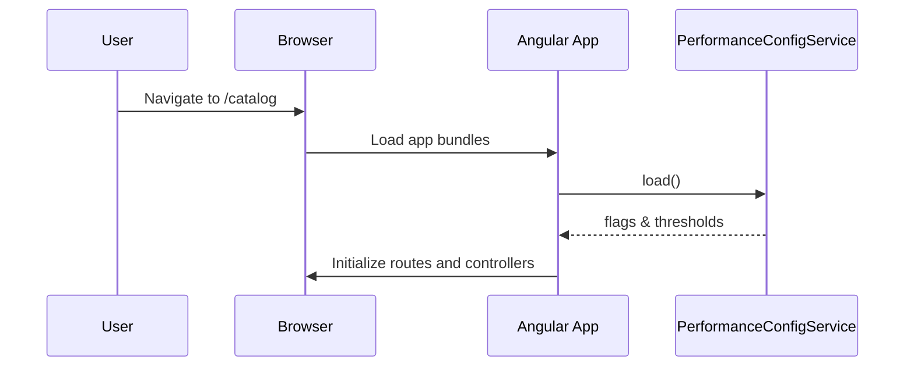
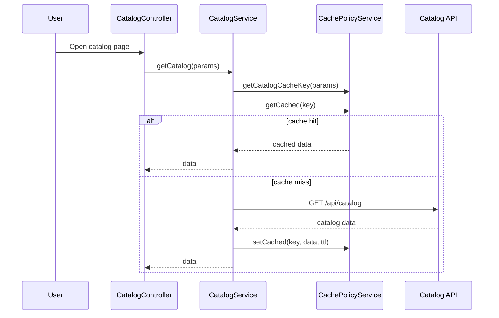
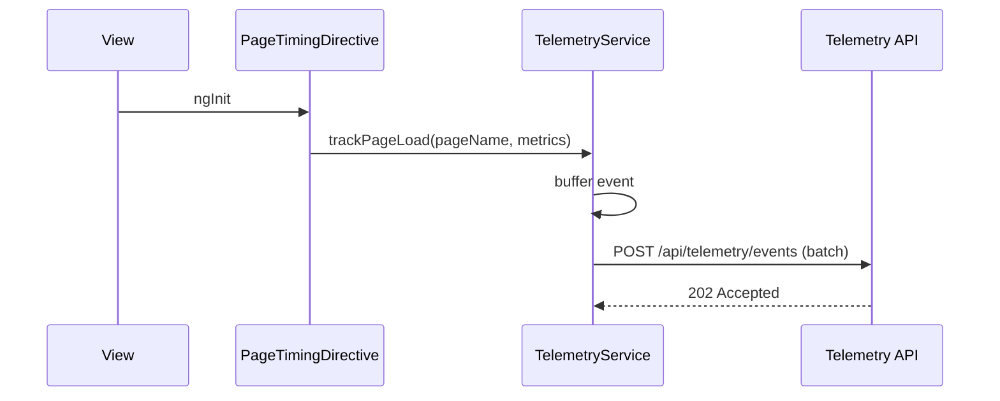
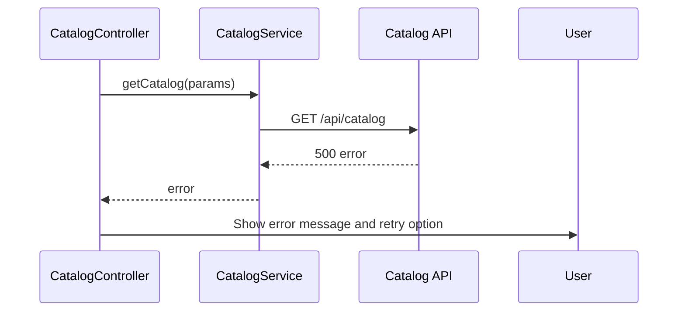

# Low-Level Design (LLD) – Epic QE-3536

## 1. Overview

This LLD defines the implementation design for performance, scalability, and resiliency improvements of an enterprise web application built on AngularJS (1.x), JavaScript ES6, HTML5, CSS3, Bootstrap, REST APIs, and an MVC architecture.

The design focuses on:
- Efficient static asset delivery with CDN.
- Stateless front-end behavior.
- Caching strategies.
- Observability hooks.
- Graceful degradation and failover behaviors.

---

## 2. Application Architecture

### 2.1 AngularJS MVC Mapping

AngularJS modules for this epic:

- `app.core` – shared configuration, routing, HTTP interceptors.
- `app.performance` – performance tuning utilities, caching, throttling, feature flags.
- `app.catalog` – high-read catalog views optimized with cache.
- `app.orders` – order tracking with efficient polling and caching.
- `app.observability` – client-side telemetry collection.

Mapping from HLD components:

- **CDN / Edge Cache** – configured at deployment; front-end built to support cache-busting and static asset versioning.
- **WAF / Rate Limiter** – edge concern; front-end provides request identifiers and avoids chatty patterns.
- **API Gateway / Load Balancer (GW)** – invoked through `ConfigService.apiBaseUrl`; front-end remains stateless.
- **Stateless Front-End (FE)** – AngularJS SPA with session stored in tokens; no server-side sessions.
- **Distributed Cache (CACHE)** – backend; FE encourages cache use by using GETs with cacheable headers for catalog and order summaries.
- **Observability Stack (OBS)** – integrated via `TelemetryService` sending client metrics.
- **Config Store (CF)** – exposed via `/api/config` and consumed by `PerformanceConfigService`.
- **MQ, JOB, DR, BKP, SM** – primarily backend; FE interacts via generic APIs and adjusts UX based on statuses.

### 2.2 Project Folder Structure

```text
src/
  app/
    performance/
      performance.module.js
      performance-config.service.js
      cache-policy.service.js
      rate-limit.directive.js
      lazy-load.directive.js

    catalog/
      catalog.module.js
      catalog.service.js
      catalog.controller.js
      catalog-list.component.js

    orders/
      orders.module.js
      order.service.js
      order-list.controller.js

    observability/
      observability.module.js
      telemetry.service.js
      page-timing.directive.js
```

---

## 3. Component Specifications

### 3.1 PerformanceConfigService

- **Type**: Service
- **File**: `app/performance/performance-config.service.js`
- **Responsibility**:
  - Load runtime performance-related configuration from backend CF.
  - Expose feature flags and throttling settings.
- **Public Methods**:
  - `load()` – loads config at startup.
  - `getFlag(flagKey)` – returns boolean.
  - `getThreshold(key)` – returns numeric threshold.
- **Inputs/Outputs**:
  - `load()` → `Promise<void>`
  - Config structure cached internally.
- **Dependencies**:
  - `$http`, `$q`, `ConfigService`.

### 3.2 CachePolicyService

- **Type**: Service
- **File**: `app/performance/cache-policy.service.js`
- **Responsibility**:
  - Define client-side caching rules for catalog and order data.
  - Coordinate with backend cache headers.
- **Public Methods**:
  - `getCatalogCacheKey(params)`
  - `getOrderCacheKey(orderId)`
  - `getCached(key)`
  - `setCached(key, value, ttlMs)`
  - `invalidate(key)`
- **Dependencies**:
  - `$window`, `$timeout`.

### 3.3 RateLimitDirective

- **Type**: Directive
- **File**: `app/performance/rate-limit.directive.js`
- **Responsibility**:
  - Prevent abusive UI interactions (e.g., repeated clicks).
  - Debounce button clicks and certain API triggers.
- **Usage**:
  - Attribute directive `rate-limit` with parameters `rate-limit-ms`.

### 3.4 LazyLoadDirective

- **Type**: Directive
- **File**: `app/performance/lazy-load.directive.js`
- **Responsibility**:
  - Lazy load non-critical content (e.g., recommendations, images below fold).
  - Observe scroll position and inject components on demand.

### 3.5 CatalogService

- **Type**: Service
- **File**: `app/catalog/catalog.service.js`
- **Responsibility**:
  - Fetch product catalog listings using cache-aware strategy.
- **Public Methods**:
  - `getCatalog(params)`
- **Inputs/Outputs**:
  - `params: { page, size, filters }`.
  - Returns `Promise<{ items, total }>`.
- **Dependencies**:
  - `$http`, `CachePolicyService`, `ConfigService`.

### 3.6 CatalogController

- **Type**: Controller
- **File**: `app/catalog/catalog.controller.js`
- **Responsibility**:
  - Manage catalog view state, paging, and filters.
  - Track rendering times for telemetry.

### 3.7 TelemetryService

- **Type**: Service
- **File**: `app/observability/telemetry.service.js`
- **Responsibility**:
  - Collect client-side metrics (page load time, API latency, error counts).
  - Send telemetry events to OBS backend.
- **Public Methods**:
  - `trackPageLoad(pageName, metrics)`
  - `trackApiCall(endpoint, latency, status)`
  - `trackError(error)`
- **Dependencies**:
  - `$http`, `$window`, `ConfigService`.

### 3.8 PageTimingDirective

- **Type**: Directive
- **File**: `app/observability/page-timing.directive.js`
- **Responsibility**:
  - Measure time from route change to view fully rendered.
  - Report metrics to `TelemetryService`.

---

## 4. Component Responsibilities

- **PerformanceConfigService**: Owns retrieval of performance and feature flags; ensures consistent config across modules.
- **CachePolicyService**: Owns client caching policy, TTLs, invalidation for high-read views.
- **CatalogService**: Handles interaction with backend cache-enabled endpoints and merges cached and fresh data.
- **TelemetryService**: Owns client observability, ensures minimal overhead and batching.
- **Directives (RateLimit, LazyLoad, PageTiming)**: Own DOM-level performance optimizations.

---

## 5. Interface Specifications

### 5.1 Config Store (CF)

- **Endpoint**: `GET /api/config/performance`
- **Response**:
```json
{
  "featureFlags": {
    "enableLazyLoad": true,
    "enableClientCache": true,
    "enablePerfTelemetry": true
  },
  "thresholds": {
    "catalogCacheTtlMs": 60000,
    "orderCacheTtlMs": 30000,
    "maxRetryAttempts": 3
  }
}
```

### 5.2 Catalog API (CACHE/DB)

- **Endpoint**: `GET /api/catalog`
- **Query Params**: `page`, `size`, `category`, `sort`.
- **Response**:
```json
{
  "items": [
    {
      "id": "string",
      "name": "string",
      "price": 0,
      "inventory": 0,
      "lastUpdated": "2024-01-01T00:00:00Z"
    }
  ],
  "total": 1000
}
```

### 5.3 Orders API

- **Endpoint**: `GET /api/orders`
- **Query Params**: `page`, `size`, `status`.

### 5.4 Telemetry API (OBS)

- **Endpoint**: `POST /api/telemetry/events`
- **Request**:
```json
{
  "sessionId": "string",
  "events": [
    {
      "type": "PAGE_LOAD|API_CALL|ERROR",
      "name": "string",
      "timestamp": "2024-01-01T00:00:00Z",
      "attributes": {
        "latencyMs": 123,
        "status": 200,
        "endpoint": "/api/catalog"
      }
    }
  ]
}
```

---

## 6. Data Model Design

### 6.1 CatalogItem

```js
export class CatalogItem {
  constructor() {
    this.id = null;
    this.name = null;
    this.price = 0;
    this.inventory = 0;
    this.lastUpdated = null;
  }
}
```

### 6.2 TelemetryEvent

```js
export class TelemetryEvent {
  constructor(type, name) {
    this.type = type; // PAGE_LOAD|API_CALL|ERROR
    this.name = name;
    this.timestamp = new Date().toISOString();
    this.attributes = {};
  }
}
```

---

## 7. Data Flow

### 7.1 Page Load and Config

1. On app bootstrap, `PerformanceConfigService.load()` is invoked.
2. Config flags (lazy loading, client cache, telemetry) are stored in memory.
3. Routes use these flags to enable or disable features.

### 7.2 Catalog View

1. User navigates to catalog.
2. `CatalogController` calls `CatalogService.getCatalog(params)`.
3. `CatalogService` computes cache key -> `CachePolicyService.getCatalogCacheKey(params)`.
4. If `enableClientCache` and cached item not expired, returns cached data.
5. Otherwise, GET `/api/catalog` is called.
6. Response stored in cache with TTL, then returned.
7. `PageTimingDirective` measures render time and sends `PAGE_LOAD` telemetry.

### 7.3 Telemetry Flow

1. `TelemetryService` buffers events in memory.
2. On buffer threshold or timer, batched `POST /api/telemetry/events` is sent.
3. Failures trigger retry with backoff up to `maxRetryAttempts`; beyond that, events are dropped locally.

---

## 8. Sequence Diagrams

### 8.1 Application Initialization (Performance Focus)



### 8.2 Catalog Fetch with Cache



### 8.3 Telemetry Event Submission



### 8.4 Cache Fallback Scenario



---

## 9. Implementation Details

### 9.1 AngularJS & ES6

- Use ES6 modules transpiled to ES5 for browser compatibility.
- Use `$q` wrapped around promises for async APIs.

### 9.2 Dependency Injection

- Configure `PerformanceConfigService` to be resolved in app run block.

```js
angular.module('app.performance')
  .run(function(PerformanceConfigService) {
    PerformanceConfigService.load();
  });
```

### 9.3 Validation Logic

- Client-side validation of pagination and filters.
- Maximum page size configured via config store.

### 9.4 State Management

- UI state is kept in controllers; no server-side sessions.
- Query parameters represent filters for deep linking.

### 9.5 DOM Interaction

- LazyLoadDirective uses IntersectionObserver when available, falls back to scroll listeners.

---

## 10. Configuration

- `env.*.js` contains performance-related flags separate from security flags.
- Cache TTLs and telemetry endpoints configured per environment.

---

## 11. Error Handling and Resiliency

- Telemetry failures are non-blocking; no user impact.
- Catalog failures show fallback messages and suggest retry.
- RateLimitDirective avoids multiple submissions of forms.

---

## 12. Security Considerations

- Telemetry and performance logs avoid PII.
- APIs used for telemetry enforce authentication and TLS.
- Client caching does not store sensitive data (e.g., no tokens, no PII in caches).
