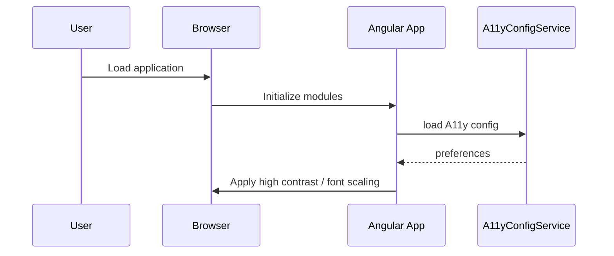
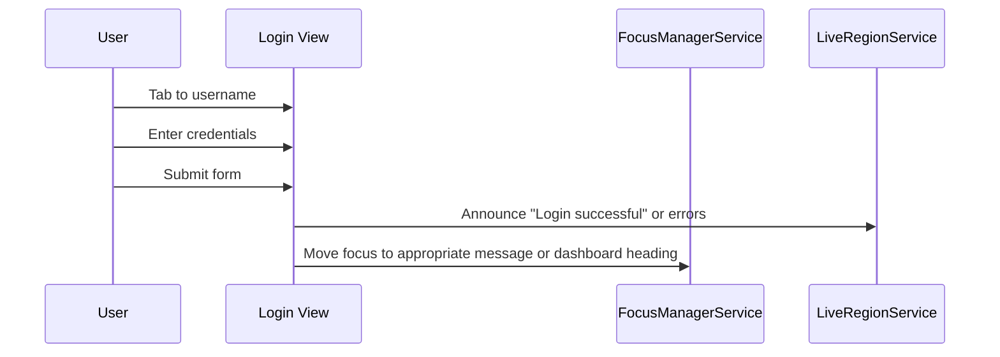

# Low-Level Design (LLD) – Epic QE-3537

## 1. Overview

This LLLD defines the detailed implementation design for accessibility (A11y) and UX improvements across primary user journeys in an enterprise AngularJS (1.x) web application. It ensures compliance with WCAG 2.1 AA while maintaining performance and security non-functional requirements.

---

## 2. Application Architecture

### 2.1 AngularJS MVC Mapping

Modules:

- `app.core` – base configuration and shared services.
- `app.a11y` – accessibility layer components.
- `app.designSystem` – shared UI components and styles.
- `app.user` – registration, login, profile flows.
- `app.catalog` – product catalog.
- `app.cart` – shopping cart.
- `app.checkout` – checkout.
- `app.orders` – order tracking.
- `app.dashboard` – seller/admin dashboards.

Mapping from HLD components:

- **Design System / UI Component Library (DS)** → `app.designSystem` directives, components, CSS.
- **Accessibility Layer (AX)** → `app.a11y` services and directives.
- **Front-End Web Application (FE)** → feature modules using DS and AX.
- **API Gateway / BFF (GW)** → backend endpoints consumed via `ConfigService`.
- **Monitoring & Accessibility Scanner (MON)** → `A11yMonitoringService` and CI integrations.
- **Security Services (SEC)** → shared input validation and security directives.
- **LOG, CONF, SM** → backend-supported; front-end uses feature flags and secure storage.

### 2.2 Project Folder Structure

```text
src/app/
  design-system/
    design-system.module.js
    components/
      button/btn-primary.directive.js
      form/form-field.directive.js
      modal/modal.directive.js
      nav/nav-bar.directive.js
    styles/
      design-system.css

  a11y/
    a11y.module.js
    a11y-config.service.js
    focus-manager.service.js
    live-region.service.js
    skip-link.directive.js
    focus-trap.directive.js
    a11y-announce.directive.js

  user/
    user.module.js
    login.controller.js
    register.controller.js

  catalog/
    catalog.module.js
    catalog.controller.js

  cart/
    cart.module.js
    cart.controller.js

  checkout/
    checkout.module.js
    checkout.controller.js

  orders/
    orders.module.js
    orders.controller.js

  dashboard/
    dashboard.module.js
    dashboard.controller.js

  shared/
    shared.module.js
    security/
      secure-input.directive.js
      sanitize-output.filter.js
    services/
      notification.service.js
      config.service.js
      a11y-monitoring.service.js
```

---

## 3. Component Specifications

### 3.1 Design System Components

#### 3.1.1 btnPrimaryDirective

- **Type**: Directive
- **File**: `design-system/components/button/btn-primary.directive.js`
- **Responsibility**:
  - Standardized primary button with WCAG-compliant contrast, focus outline, and ARIA labels.
- **Public API**:
  - Attributes: `ds-btn-primary`, `aria-label`, `ng-disabled`.

#### 3.1.2 formFieldDirective

- **Type**: Directive
- **File**: `design-system/components/form/form-field.directive.js`
- **Responsibility**:
  - Wrap inputs with label, help text, and error messages; associate `for` and `id` attributes.
- **Public API**:
  - Transclusion for input; attributes for `label`, `hint`, `required`.

#### 3.1.3 navBarDirective

- **Type**: Directive
- **File**: `design-system/components/nav/nav-bar.directive.js`
- **Responsibility**:
  - Provide top navigation with landmarks, keyboard-accessible menus.

### 3.2 A11y Layer

#### 3.2.1 A11yConfigService

- **Type**: Service
- **File**: `a11y/a11y-config.service.js`
- **Responsibility**:
  - Load user accessibility preferences (e.g., high contrast, font size) via CONF.

#### 3.2.2 FocusManagerService

- **Type**: Service
- **File**: `a11y/focus-manager.service.js`
- **Responsibility**:
  - Manage focus order on route changes and modal dialogs.
- **Public Methods**:
  - `setFocus(selector)`
  - `restoreFocus()`

#### 3.2.3 LiveRegionService

- **Type**: Service
- **File**: `a11y/live-region.service.js`
- **Responsibility**:
  - Announce dynamic updates via ARIA live regions.

#### 3.2.4 skipLinkDirective

- **Type**: Directive
- **File**: `a11y/skip-link.directive.js`
- **Responsibility**:
  - Provide skip-to-content links for keyboard users.

#### 3.2.5 focusTrapDirective

- **Type**: Directive
- **File**: `a11y/focus-trap.directive.js`
- **Responsibility**:
  - Trap focus within modals and menus.

### 3.3 Security-Related Components

#### 3.3.1 secureInputDirective

- **Type**: Directive
- **File**: `shared/security/secure-input.directive.js`
- **Responsibility**:
  - Enforce input sanitization rules, limit allowed characters for sensitive fields.

#### 3.3.2 sanitizeOutputFilter

- **Type**: Filter
- **File**: `shared/security/sanitize-output.filter.js`
- **Responsibility**:
  - Sanitize dynamic content before rendering using `$sanitize`.

### 3.4 A11yMonitoringService

- **Type**: Service
- **File**: `shared/services/a11y-monitoring.service.js`
- **Responsibility**:
  - Collect A11y metrics and issues and send to LOG/MON.
- **Public Methods**:
  - `reportIssue(issue)`
  - `trackA11yMetric(metric)`

---

## 4. Component Responsibilities

- **Controllers**: enforce use of DS components and A11y services, ensure headings and landmarks are correct.
- **A11y services**: manage focus, announcements, and preferences.
- **Security directives**: ensure safe input/output in accessible forms.

---

## 5. Interface Specifications

### 5.1 Accessibility Config API (CONF)

- **Endpoint**: `GET /api/a11y/config`
- **Response**:
```json
{
  "highContrast": false,
  "fontScale": 1.0,
  "enableSkipLinks": true
}
```

### 5.2 A11y Monitoring API

- **Endpoint**: `POST /api/a11y/events`
- **Request**:
```json
{
  "userId": "string",
  "sessionId": "string",
  "events": [
    {
      "type": "ISSUE|METRIC",
      "name": "missing-label",
      "details": "Login button missing aria-label"
    }
  ]
}
```

---

## 6. Data Model Design

### 6.1 A11yPreference

```js
export class A11yPreference {
  constructor() {
    this.highContrast = false;
    this.fontScale = 1.0;
  }
}
```

### 6.2 A11yIssue

```js
export class A11yIssue {
  constructor() {
    this.type = 'ISSUE';
    this.name = '';
    this.details = '';
  }
}
```

---

## 7. Data Flow

### 7.1 Route Change Focus Management

1. User navigates to a new route.
2. `FocusManagerService` is notified.
3. Service moves focus to top-level heading.

### 7.2 Form Submission with A11y Feedback

1. User submits form.
2. Validation errors are announced via `LiveRegionService`.
3. Screen reader users hear errors and know where to fix.

---

## 8. Sequence Diagrams

### 8.1 Application Initialization with A11y



### 8.2 Accessible Login Flow



---

## 9. Implementation Details

- Use semantic HTML tags (`<main>`, `<nav>`, `<header>`, `<footer>`).
- Ensure all interactive elements are reachable via keyboard.
- Use minimal JS for focus management to avoid performance regressions.

---

## 10. Configuration

- Feature flags to enable/disable high contrast and large text.
- Logged via A11yMonitoringService when toggled.

---

## 11. Error Handling and Resiliency

- A11y services fail gracefully: if config fails, defaults used.
- Monitoring failures are non-blocking.

---

## 12. Security Considerations

- Inputs sanitized via `secureInputDirective`.
- Outputs sanitized via `sanitizeOutputFilter`.
- A11y preferences stored securely and minimally.
