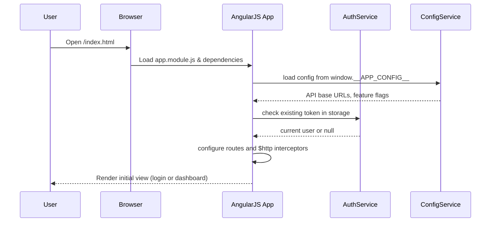
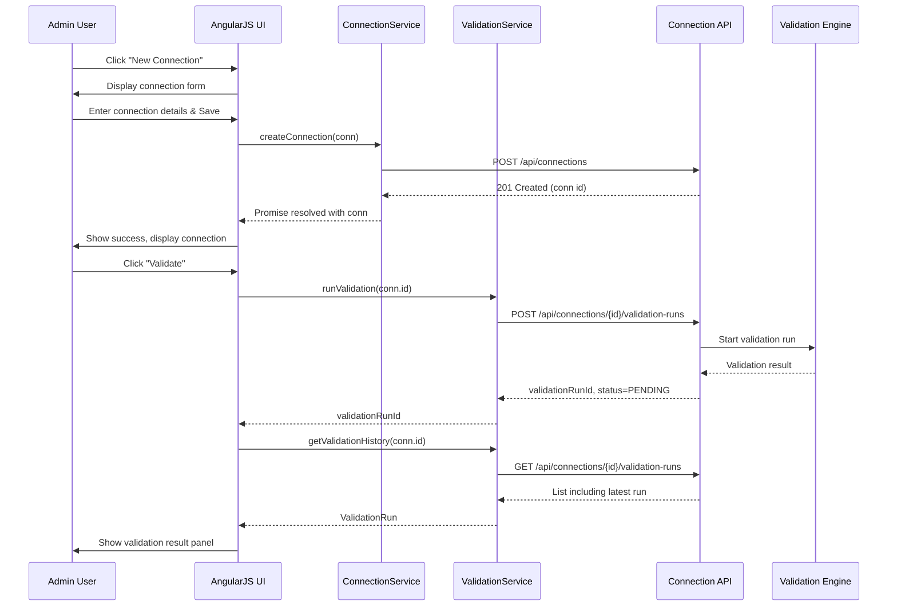
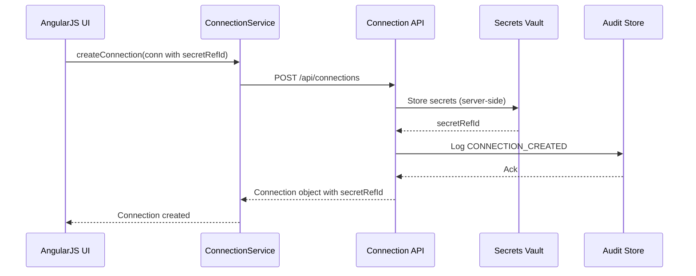
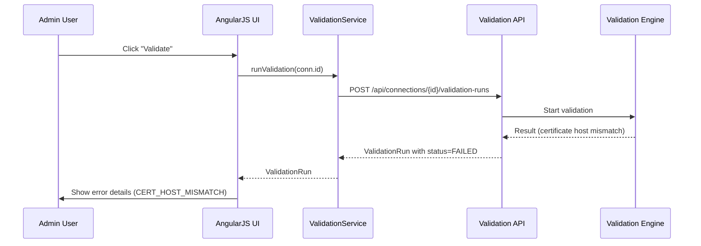

# Low-Level Design (LLD) for Epic QE-3550 – Secure Connection Configuration & Validation

## 1. Application Architecture

### 1.1 Overall Architecture

This LLD defines an enterprise-grade web application for secure configuration and validation of connections to ERP, PLM, and external substance databases. The stack is:

- Frontend: AngularJS 1.x, JavaScript (ES6-style where possible), HTML5, CSS3, Bootstrap 3/4.
- Backend API layer: Assumed existing REST APIs (Connection Configuration Service, Validation Engine, IAM, Vault, etc.). This LLD focuses on the AngularJS client and its interactions with REST services.
- Architecture pattern: AngularJS MVC with service-based data access and directive-based reusable UI components.

The application provides:
- A configuration UI for creating, editing, validating, and viewing connection definitions.
- Integration with identity and access management (IAM) via JWT or session tokens.
- Integration with a Secrets Vault for credential management.
- Integration with a Validation Engine for TLS and credential validation.
- Central logging and audit integrations.

### 1.2 AngularJS MVC Mapping

#### AngularJS Modules

- `app.core` – Core module for configuration, routing, constants, and cross-cutting services.
- `app.auth` – Authentication and authorization helpers (integration with IAM).
- `app.connections` – Connection configuration features (views, controllers, services).
- `app.validation` – Validation result views and services.
- `app.audit` – Audit history views and services.
- `app.shared` – Shared directives, filters, and components.

#### Controllers

- `ConnectionListController` – Manages list of connections.
- `ConnectionDetailController` – Manages create/edit/view of a single connection.
- `ConnectionValidateController` – Manages validation execution and displays results.
- `AuditHistoryController` – Displays configuration and validation history.
- `LoginController` – Handles login and token acquisition (if UI includes login page).

#### Services / Factories

- `AuthService` – Authentication, token management, and IAM integration.
- `ConnectionService` – CRUD operations for connection configurations.
- `ValidationService` – Trigger validation and fetch validation results.
- `VaultService` – Abstraction for secret references (never exposes raw secrets in UI).
- `AuditService` – Fetches audit trails from backend.
- `LoggingService` – Client-side logging and integration with central log collector.
- `NotificationService` – UI notifications (toasts, alerts, confirmations).
- `ConfigService` – Provides environment configuration (API URLs, feature flags).

#### Directives / Components

- `connCard` – Displays a connection summary card.
- `connForm` – Reusable form for connection details.
- `validationResultPanel` – Displays validation result, status, detailed messages.
- `auditTimeline` – Renders audit events in a timeline-like widget.
- `hasRole` – Structural directive to show/hide UI based on user roles.

#### Filters

- `connectionStatusLabel` – Converts status codes to human-readable labels.
- `maskSecret` – Partially masks secret-related fields for display.

### 1.3 Project Folder Structure

```text
web/
  index.html
  app/
    app.module.js
    app.routes.js
    app.config.js

    core/
      core.module.js
      config.service.js
      logging.service.js
      notification.service.js

    auth/
      auth.module.js
      auth.service.js
      login.controller.js
      has-role.directive.js

    connections/
      connections.module.js
      connection-list.controller.js
      connection-detail.controller.js
      connection-validate.controller.js
      connection.service.js
      validation.service.js
      vault.service.js
      connection-card.directive.js
      connection-form.directive.js
      validation-result-panel.directive.js

    audit/
      audit.module.js
      audit.service.js
      audit-history.controller.js
      audit-timeline.directive.js

    shared/
      filters/
        connection-status-label.filter.js
        mask-secret.filter.js
      directives/
        focus-on-load.directive.js

  assets/
    css/
      main.css
    js/
      vendor.js
    img/
      ...
```

## 2. Component Specifications

### 2.1 Modules

#### 2.1.1 `app.core`

- **Type:** AngularJS module
- **File:** `app/core/core.module.js`
- **Responsibility:** Provides core configuration and shared services.
- **Public API:** N/A (module definition)
- **Dependencies:** `ngRoute`, `ngAnimate`, `ngMessages`, `ui.bootstrap` (if used), etc.

#### 2.1.2 `app.connections`

- **File:** `app/connections/connections.module.js`
- **Responsibility:** Feature module aggregating connection configuration controllers, services, and directives.
- **Dependencies:** `app.core`, `app.auth`, `app.shared`.

### 2.2 Services

#### 2.2.1 `ConfigService`

- **Type:** Service
- **File:** `app/core/config.service.js`
- **Responsibility:** Provide environment-specific properties and API base URLs.
- **Public Methods:**
  - `getApiBaseUrl()` → `string`
  - `getLoggingUrl()` → `string`
  - `getFeatureFlags()` → `Object`
- **Inputs:** None directly; consumes global JS object `window.__APP_CONFIG__`.
- **Outputs:** Configuration values.
- **Dependencies:** `$window`.

#### 2.2.2 `AuthService`

- **Type:** Service
- **File:** `app/auth/auth.service.js`
- **Responsibility:** Handle authentication, token storage, role retrieval.
- **Public Methods:**
  - `login(username, password)` → `Promise<Token>`
  - `logout()` → `void`
  - `getToken()` → `string | null`
  - `getCurrentUser()` → `User`
  - `hasRole(roleName)` → `boolean`
- **Inputs:** User credentials, IAM tokens.
- **Outputs:** JWT/token, user roles.
- **Dependencies:** `$http`, `$q`, `ConfigService`, `$window`.

#### 2.2.3 `ConnectionService`

- **Type:** Service
- **File:** `app/connections/connection.service.js`
- **Responsibility:** CRUD operations for connection definitions via REST.
- **Public Methods:**
  - `getConnections(filterParams)` → `Promise<Connection[]>`
  - `getConnectionById(id)` → `Promise<Connection>`
  - `createConnection(conn)` → `Promise<Connection>`
  - `updateConnection(conn)` → `Promise<Connection>`
  - `deleteConnection(id)` → `Promise<void>`
  - `testConnection(id)` → `Promise<ValidationRun>` (delegates to `ValidationService` or specialized endpoint)
- **Inputs:** Connection model objects; filter parameters.
- **Outputs:** Connection model data.
- **Dependencies:** `$http`, `$q`, `ConfigService`, `AuthService`.

#### 2.2.4 `ValidationService`

- **Type:** Service
- **File:** `app/connections/validation.service.js`
- **Responsibility:** Interact with Connection Validation Engine (VALCN) to trigger and retrieve validation results.
- **Public Methods:**
  - `runValidation(connectionId)` → `Promise<ValidationRun>`
  - `getValidationHistory(connectionId)` → `Promise<ValidationRun[]>`
- **Inputs:** Connection identifier.
- **Outputs:** ValidationRun objects.
- **Dependencies:** `$http`, `$q`, `ConfigService`, `AuthService`.

#### 2.2.5 `VaultService`

- **Type:** Service
- **File:** `app/connections/vault.service.js`
- **Responsibility:** Manage interaction with Secrets Vault via backend; UI only deals with references/aliases.
- **Public Methods:**
  - `createSecretReference(secretAlias, secretMeta)` → `Promise<SecretRef>`
  - `listSecretReferences(filter)` → `Promise<SecretRef[]>`
- **Inputs:** Secret metadata (description, type), not raw secrets.
- **Outputs:** Secret reference IDs/aliases.
- **Dependencies:** `$http`, `ConfigService`, `AuthService`.

#### 2.2.6 `AuditService`

- **Type:** Service
- **File:** `app/audit/audit.service.js`
- **Responsibility:** Fetch audit and configuration history.
- **Public Methods:**
  - `getConnectionAudit(connectionId)` → `Promise<AuditEvent[]>`
  - `getValidationAudit(connectionId)` → `Promise<AuditEvent[]>`
- **Inputs:** Connection id, filters.
- **Outputs:** Audit events.
- **Dependencies:** `$http`, `ConfigService`, `AuthService`.

#### 2.2.7 `LoggingService`

- **Type:** Service
- **File:** `app/core/logging.service.js`
- **Responsibility:** Client-side logging abstraction.
- **Public Methods:**
  - `info(message, context)`
  - `warn(message, context)`
  - `error(message, context)`
  - `sendToServer(level, message, context)`
- **Inputs:** Message strings and optional context.
- **Outputs:** Console logs and optional REST calls.
- **Dependencies:** `$log`, `$http`, `ConfigService`.

#### 2.2.8 `NotificationService`

- **Type:** Service
- **File:** `app/core/notification.service.js`
- **Responsibility:** Provide consistent UI notifications.
- **Public Methods:**
  - `success(message)`
  - `error(message)`
  - `info(message)`
- **Inputs:** Notification text.
- **Outputs:** Bootstrap alerts/toasts.
- **Dependencies:** `$rootScope` (for broadcasting), possibly `toastr`.

### 2.3 Controllers

#### 2.3.1 `ConnectionListController`

- **File:** `app/connections/connection-list.controller.js`
- **Responsibility:** Display and manage list of connections.
- **Public Methods (on $scope / vm):**
  - `loadConnections()`
  - `filterConnections()`
  - `deleteConnection(connection)`
  - `openCreate()`
  - `openEdit(connection)`
  - `runValidation(connection)`
- **Inputs:** HTTP query params, user filters.
- **Outputs:** Populated connections list; navigation; user notifications.
- **Dependencies:** `ConnectionService`, `ValidationService`, `NotificationService`, `$location`, `LoggingService`.

#### 2.3.2 `ConnectionDetailController`

- **File:** `app/connections/connection-detail.controller.js`
- **Responsibility:** Handle create/edit/view of a single connection.
- **Public Methods:**
  - `init()`
  - `save()`
  - `cancel()`
  - `onSecretReferenceSelected(ref)`
- **Inputs:** Route params (connectionId), form model.
- **Outputs:** Save/update requests, navigation.
- **Dependencies:** `ConnectionService`, `VaultService`, `$routeParams`, `NotificationService`, `LoggingService`.

#### 2.3.3 `ConnectionValidateController`

- **File:** `app/connections/connection-validate.controller.js`
- **Responsibility:** Execute and visualize validation runs.
- **Public Methods:**
  - `init()`
  - `runValidation()`
  - `refreshHistory()`
- **Inputs:** Connection id.
- **Outputs:** ValidationRun data bound to `validationResultPanel`.
- **Dependencies:** `ValidationService`, `NotificationService`, `LoggingService`, `$routeParams`.

#### 2.3.4 `AuditHistoryController`

- **File:** `app/audit/audit-history.controller.js`
- **Responsibility:** Display audit history for a connection.
- **Public Methods:**
  - `init()`
  - `loadAudit()`
  - `filterAudit()`
- **Inputs:** Connection id, time range filters.
- **Outputs:** Audit timeline display.
- **Dependencies:** `AuditService`, `LoggingService`, `$routeParams`.

### 2.4 Directives / Components

#### 2.4.1 `connCard` Directive

- **File:** `app/connections/connection-card.directive.js`
- **Responsibility:** Reusable UI card showing connection summary.
- **Scope Bindings:**
  - `connection` (one-way)
  - `onEdit` (callback)
  - `onValidate` (callback)
- **Template:** `templates/connection-card.html`
- **Dependencies:** `connectionStatusLabel` filter.

#### 2.4.2 `connForm` Directive

- **File:** `app/connections/connection-form.directive.js`
- **Responsibility:** Encapsulated form for connection details.
- **Scope Bindings:**
  - `model` – connection object
  - `onSave` – function
  - `onCancel` – function
  - `mode` – 'create' | 'edit' | 'view'
- **Template:** `templates/connection-form.html`

#### 2.4.3 `validationResultPanel` Directive

- **File:** `app/connections/validation-result-panel.directive.js`
- **Responsibility:** Visualize results from validation runs.
- **Scope Bindings:**
  - `validationRun` – object
  - `history` – list of validation runs
- **Template:** `templates/validation-result-panel.html`

#### 2.4.4 `auditTimeline` Directive

- **File:** `app/audit/audit-timeline.directive.js`
- **Responsibility:** Display chronological audit events.
- **Scope Bindings:**
  - `events` – `AuditEvent[]`
- **Template:** `templates/audit-timeline.html`

#### 2.4.5 `hasRole` Directive

- **File:** `app/auth/has-role.directive.js`
- **Responsibility:** Show/hide UI fragments based on user roles.
- **Usage:** `<div has-role="['ADMIN','SYS_ADMIN']">...</div>`

### 2.5 Filters

#### 2.5.1 `connectionStatusLabel`

- **File:** `app/shared/filters/connection-status-label.filter.js`
- **Responsibility:** Transform status codes into display strings and Bootstrap label classes.

#### 2.5.2 `maskSecret`

- **File:** `app/shared/filters/mask-secret.filter.js`
- **Responsibility:** Mask sensitive text (e.g., show `****` or partial value).

## 3. Component Responsibilities

### 3.1 Business Logic Ownership

- **Controllers:** Handle view-specific logic, user interactions, and orchestrate calls to services.
- **Services:** Contain business rules that are independent of specific views (e.g., how to test a connection, how to interpret statuses).
- **Directives:** Own UI structure and minor presentational behavior.
- **Validation Engine (backend):** Owns low-level connectivity tests, TLS enforcement, and credential verification.

#### Example Decisions:

- `ConnectionService` ensures only allowed protocols (`https`, `tls`) are used by validating allowed values before sending payloads.
- `ConnectionDetailController` ensures non-sensitive metadata is captured, but never handles raw secrets; only reference IDs from `VaultService`.
- `ValidationService` abstracts the REST APIs so controllers are agnostic to endpoint URLs.

### 3.2 UI Handling & State Management

- Controllers use the "controller as" syntax (e.g., `vm = this`) and maintain simple view models.
- Global state such as current user and roles is held in `AuthService`.
- Temporary UI state (e.g., loading indicators, error messages) is maintained within controllers.
- Bootstrapping: `app.module.js` wires up modules and registers run blocks to enforce authentication on route changes.

### 3.3 API Communication Responsibilities

- All REST calls go through `$http` with interceptors configured in `app.config.js` to:
  - Attach Authorization headers.
  - Handle common errors (401, 403, 500).
  - Log failures via `LoggingService`.

## 4. Interface Specifications

### 4.1 REST API Interfaces

> Note: Actual paths are examples; align with backend specifications during integration.

#### 4.1.1 Connection Management APIs

- **Endpoint:** `GET /api/connections`
  - **Description:** Retrieve a paginated list of connection definitions.
  - **Query Params:**
    - `page` (int), `size` (int), `type` (ERP|PLM|EXTDB), `status`.
  - **Response 200:**
    ```json
    {
      "items": [
        {
          "id": "conn-123",
          "name": "ERP-SAP-PRD",
          "systemType": "ERP",
          "host": "sap-prd.company.com",
          "port": 443,
          "protocol": "TLS1_3",
          "status": "VALID",
          "secretRefId": "vault:conn/erp/prd",
          "createdBy": "admin1",
          "createdAt": "2024-05-01T10:00:00Z",
          "updatedAt": "2024-05-10T12:30:00Z"
        }
      ],
      "page": 0,
      "size": 20,
      "total": 3
    }
    ```
  - **Error Responses:**
    - `401 Unauthorized`
    - `403 Forbidden`

- **Endpoint:** `GET /api/connections/{id}`
  - **Description:** Get specific connection details.
  - **Response 200:** `Connection` object as above.

- **Endpoint:** `POST /api/connections`
  - **Description:** Create a new connection configuration.
  - **Request Body:**
    ```json
    {
      "name": "ERP-SAP-PRD",
      "systemType": "ERP",
      "host": "sap-prd.company.com",
      "port": 443,
      "protocol": "TLS1_3",
      "connectionProfile": "SAP_DEFAULT",
      "secretRefId": "vault:conn/erp/prd",
      "metadata": {
        "environment": "PROD",
        "owner": "IT-OPS",
        "description": "Production SAP ERP connection"
      }
    }
    ```
  - **Response 201:** Created `Connection` with `id`.
  - **Error 400:** Validation error (invalid protocol, missing host, etc.)

- **Endpoint:** `PUT /api/connections/{id}`
  - **Description:** Update connection configuration.

- **Endpoint:** `DELETE /api/connections/{id}`
  - **Description:** Soft-delete/deactivate a connection.

#### 4.1.2 Validation APIs (VALCN)

- **Endpoint:** `POST /api/connections/{id}/validation-runs`
  - **Description:** Trigger a validation run.
  - **Request Body:**
    ```json
    {
      "requestedBy": "admin1",
      "reason": "Initial configuration",
      "validationProfile": "DEFAULT"
    }
    ```
  - **Response 202:**
    ```json
    {
      "validationRunId": "val-789",
      "status": "PENDING"
    }
    ```

- **Endpoint:** `GET /api/connections/{id}/validation-runs/{runId}`
  - **Description:** Get specific validation run details.
  - **Response 200:**
    ```json
    {
      "id": "val-789",
      "connectionId": "conn-123",
      "status": "FAILED",
      "startedAt": "2024-05-10T12:30:00Z",
      "completedAt": "2024-05-10T12:30:05Z",
      "results": {
        "tlsHandshake": "FAILED",
        "certificateChainValid": false,
        "hostnameMatch": false,
        "credentialValid": true,
        "errors": [
          {
            "code": "CERT_HOST_MISMATCH",
            "message": "Certificate CN does not match host sap-prd.company.com"
          }
        ]
      }
    }
    ```

- **Endpoint:** `GET /api/connections/{id}/validation-runs`
  - **Description:** Get history of validation runs.

#### 4.1.3 Audit APIs

- **Endpoint:** `GET /api/audit/connections/{id}`
  - **Description:** Fetch audit history for connection changes.

### 4.2 Client-Server Interaction

- All client requests include `Authorization: Bearer <token>` header provided by `AuthService` via `$http` interceptor.
- IAM enforces RBAC to permit only System Administrators or authorized roles to create or modify connections.

## 5. Data Model Design

### 5.1 JavaScript Models

All models are plain ES5 objects with ES6-like naming conventions, used by services and controllers.

#### 5.1.1 `Connection`

- **Attributes:**
  - `id` (string, default `null`)
  - `name` (string, required)
  - `systemType` (string, enum: `"ERP" | "PLM" | "EXTDB"`)
  - `host` (string, required)
  - `port` (number, required, default `443`)
  - `protocol` (string, enum: `"TLS1_3"` only by default)
  - `connectionProfile` (string, optional)
  - `secretRefId` (string, required)
  - `status` (string, enum: `"DRAFT" | "ACTIVE" | "DEPRECATED" | "DISABLED"`)
  - `metadata` (object: `environment`, `owner`, `description`)
  - `createdBy`, `createdAt`, `updatedBy`, `updatedAt` (audit fields)

- **Validation Rules:**
  - `name`: non-empty, 3–100 chars.
  - `host`: valid hostname or IP (regex check).
  - `port`: integer between 1 and 65535.
  - `protocol`: must be `TLS1_3` (UI blocks non-TLS; toggles for exceptions disabled by default).
  - `secretRefId`: non-empty and matches pattern `vault:.*`.

#### 5.1.2 `ValidationRun`

- **Attributes:**
  - `id` (string)
  - `connectionId` (string)
  - `status` (string enum: `"PENDING" | "RUNNING" | "SUCCESS" | "FAILED"`)
  - `startedAt`, `completedAt` (ISO timestamps)
  - `results` (object):
    - `tlsHandshake` (`"SUCCESS" | "FAILED"`)
    - `certificateChainValid` (boolean)
    - `hostnameMatch` (boolean)
    - `credentialValid` (boolean)
    - `networkReachable` (boolean)
    - `errors` (array of `ValidationError`)

#### 5.1.3 `ValidationError`

- **Attributes:**
  - `code` (string, e.g., `"CERT_HOST_MISMATCH"`)
  - `message` (string)
  - `severity` (string: `"INFO" | "WARN" | "ERROR"`)

#### 5.1.4 `AuditEvent`

- **Attributes:**
  - `id` (string)
  - `type` (string, e.g., `"CONNECTION_CREATED"`, `"VALIDATION_RUN"`)
  - `connectionId` (string)
  - `timestamp` (ISO string)
  - `user` (string)
  - `details` (object; free-form key-value pairs)

### 5.2 State Transitions

- `Connection.status` transitions:
  - `DRAFT` → `ACTIVE` after first successful validation and approval.
  - `ACTIVE` → `DISABLED` when manually deactivated.
  - `ACTIVE` → `DEPRECATED` when replaced by newer configuration.

- `ValidationRun.status` transitions:
  - `PENDING` → `RUNNING` when validation starts.
  - `RUNNING` → `SUCCESS` or `FAILED` when completed.

## 6. Data Flow

### 6.1 User Action to UI Update

1. **User Action:** Admin navigates to Connections list.
2. **View:** `connection-list.html` loads; `ConnectionListController` initializes.
3. **Controller:** Calls `ConnectionService.getConnections()`.
4. **Service:** Composes GET `/api/connections` request using `ConfigService` base URL.
5. **Model/API:** Backend returns JSON list of connections.
6. **Controller:** Assigns result to `vm.connections`.
7. **View:** `ng-repeat` renders `connCard` directives with connection data.
8. **UI Update:** User sees list; statuses shown via `connectionStatusLabel` filter.

### 6.2 Create Connection Flow

1. **User Action:** Clicks "New Connection".
2. **View:** Navigates to `connection-detail.html` with `mode='create'`.
3. **Controller:** `ConnectionDetailController` sets up empty `vm.connection` with defaults.
4. **User:** Fills form, selects secret reference via `VaultService`-backed dropdown.
5. **Controller:** On `Save`, validates client-side rules; if valid, calls `ConnectionService.createConnection(vm.connection)`.
6. **Service:** Sends POST `/api/connections` with metadata (no secrets).
7. **Backend:** Persists configuration and orchestrates storing secrets in Vault.
8. **Service:** Resolves Promise with created connection.
9. **Controller:** Displays success via `NotificationService`, redirects to list.
10. **Audit:** Backend writes `CONNECTION_CREATED` event; `AuditService` may later load this for viewing.

### 6.3 Validation Flow

1. **User Action:** On a connection card, user clicks "Validate".
2. **View:** `connCard` triggers `onValidate(connection)` callback.
3. **Controller:** `ConnectionListController.runValidation()` calls `ValidationService.runValidation(connection.id)`.
4. **Service:** POST `/api/connections/{id}/validation-runs`.
5. **Backend:** Connection Validation Engine starts TLS and credential checks.
6. **Service:** Returns `validationRunId` with status `PENDING`.
7. **Controller:** Navigates to validation detail view.
8. **Controller:** `ConnectionValidateController` polls or subscribes for run status via `getValidationHistory` or `GET /validation-runs/{runId}`.
9. **Backend:** On completion, returns detailed `results` object.
10. **View:** `validationResultPanel` binds to `validationRun`, showing TLS status, certificate errors, etc.

### 6.4 Error Handling Flow

- If backend returns `401`:
  - `$http` interceptor redirects to login page and shows message.
- If `400` validation error:
  - `ConnectionDetailController` maps field-level errors to AngularJS `ngMessages` for inline display.
- If network error:
  - `LoggingService.error` logs; `NotificationService.error` shows generic message (no internal details).

## 7. Sequence Diagrams (Mermaid)

### 7.1 Application Initialization



### 7.2 Primary Workflow – Create & Validate Connection



### 7.3 Service/API Interactions – Secrets and Audit



### 7.4 Error Handling Scenario – TLS Failure



## 8. Implementation Details

### 8.1 AngularJS Implementation Approach

- Use module-per-feature pattern (`app.connections`, etc.).
- Use `controllerAs` syntax and avoid `$scope` where possible.
- Implement `$http` interceptors in `app.config.js` for auth and error handling.
- Use `ui-router` or `ngRoute` depending on project standard; this LLD assumes `ngRoute`.

### 8.2 JavaScript ES6 Coding Patterns

- Use `const`/`let` in build pipeline with Babel (or ES5 fallback in transpiled output).
- Prefer arrow functions for callbacks in services where supported.
- Use promises via `$q` or native promises where available.

Example service (ES6-style, transpiled as needed):

```js
(function() {
  'use strict';

  angular
    .module('app.connections')
    .service('ConnectionService', ConnectionService);

  ConnectionService.$inject = ['$http', '$q', 'ConfigService'];

  function ConnectionService($http, $q, ConfigService) {
    const apiBase = ConfigService.getApiBaseUrl();

    this.getConnections = (params) => {
      return $http.get(`${apiBase}/connections`, { params })
        .then(response => response.data);
    };

    this.createConnection = (conn) => {
      return $http.post(`${apiBase}/connections`, conn)
        .then(response => response.data);
    };

    // ... other methods ...
  }
})();
```

### 8.3 Dependency Injection

- All services, controllers, and directives must use `$inject` arrays or `/* @ngInject */` for safe minification.
- Example:

```js
ConnectionDetailController.$inject = ['$routeParams', 'ConnectionService', 'NotificationService'];
```

### 8.4 Business Logic Flow

- Client-side validation complements server-side validation but does not replace it.
- Security-related rules (enforcing TLS only, preventing insecure ports) must be validated server-side; UI mirrors them to reduce user errors.

### 8.5 Validation Logic

- Use AngularJS `ngMessages` for field validation messages.
- Implement custom directives for hostname validation if necessary.
- Example rule: If `protocol` != `TLS1_3`, reject and show error that non-encrypted connections are not allowed.

### 8.6 State Management Approach

- No global two-way bound state; controllers own local state.
- For cross-view state (e.g., selected connection), use services (`ConnectionService`) or route parameters.

### 8.7 DOM Interaction

- Avoid direct DOM manipulation in controllers; use directives.
- Use Bootstrap for layout and components; modest custom CSS in `assets/css/main.css`.

### 8.8 API Integration

- Base URL and paths configured via `ConfigService` and environment-specific config.
- Handle timeouts and retries via backend; UI only handles standard HTTP retries if needed.

## 9. Configuration

### 9.1 AngularJS Config Files

- `app/app.config.js`:
  - Configure routes (`$routeProvider`).
  - Configure `$httpProvider.interceptors` for auth and error handling.
  - Configure global constants for statuses.

Example routes:

```js
$routeProvider
  .when('/connections', {
    templateUrl: 'app/connections/connection-list.html',
    controller: 'ConnectionListController',
    controllerAs: 'vm'
  })
  .when('/connections/:id', {
    templateUrl: 'app/connections/connection-detail.html',
    controller: 'ConnectionDetailController',
    controllerAs: 'vm'
  })
  .when('/connections/:id/validation', {
    templateUrl: 'app/connections/connection-validate.html',
    controller: 'ConnectionValidateController',
    controllerAs: 'vm'
  })
  .otherwise({ redirectTo: '/connections' });
```

### 9.2 Environment-Specific Properties

- Provided via `window.__APP_CONFIG__` loaded before Angular bootstrap:

```js
window.__APP_CONFIG__ = {
  apiBaseUrl: 'https://api.company.com/conn-config',
  loggingUrl: 'https://logs.company.com',
  featureFlags: {
    enableLegacyTlsExceptionFlow: false
  }
};
```

### 9.3 API Base URLs

- `ConfigService.getApiBaseUrl()` returns `window.__APP_CONFIG__.apiBaseUrl`.

### 9.4 Feature Flags

- `enableLegacyTlsExceptionFlow`: If true, UI exposes a controlled workflow for legacy/non-TLS systems (default false).

### 9.5 Logging & Telemetry

- `LoggingService` sends structured logs to `loggingUrl`.
- Logs include correlation IDs per request (generated client-side and passed via headers, e.g., `X-Correlation-Id`).

## 10. Error Handling & Resiliency

### 10.1 Client-Side Exception Handling

- Wrap critical controller operations in `try/catch` and log via `LoggingService`.
- Use `$exceptionHandler` decorator to route uncaught exceptions to `LoggingService`.

### 10.2 REST API Error Handling

- `$http` interceptor inspects responses:
  - `401`: redirect to login.
  - `403`: show access denied message.
  - `5xx`: show generic error and log details.

### 10.3 Retry Mechanisms

- UI does not perform automatic retries for mutating operations.
- For idempotent GETs (e.g., loading validation history), optional simple retry with backoff can be implemented in `ValidationService`.

### 10.4 Logging Strategy

- Client logs focus on:
  - User actions (create/update/validate connection).
  - API failures and response codes.
- Sensitive details (hostnames, secret references) are logged only when necessary and never include actual secrets.

### 10.5 Recovery & Fallback

- If audit or logging backend unavailable, UI continues functioning and logs locally (console) with minimal disruption.
- If validation service unavailable, UI warns user and suggests retry later.

## 11. Security Considerations

### 11.1 Input Validation & Sanitization

- All text inputs (`name`, `host`, `metadata.description`) sanitized via AngularJS bindings (no `ng-bind-html` for these fields).
- Client-side regex checks for `host` and `name`; server still authoritative.

### 11.2 XSS Prevention

- Use `{{ }}` interpolation (auto-escaping) for untrusted data.
- Avoid `ng-bind-html` unless content is explicitly trusted; use `$sanitize` when required.

### 11.3 CSRF Protection

- Rely on backend CSRF tokens if session-based; UI reads CSRF token from cookie and sets header (`X-CSRF-Token`) via `$http` interceptor.
- If purely token-based (JWT), CSRF risk mitigated by not using cookies for auth tokens.

### 11.4 Secure API Communication

- All API URLs use `https` with TLS 1.2+; enforced by configuration and server.
- UI rejects `http` base URLs in configuration.

### 11.5 Authentication & Authorization Integration

- `AuthService` integrates with IAM login endpoint (`/auth/login`).
- Roles and permissions stored in token or user info:
  - `SYS_ADMIN`, `SEC_ADMIN`, `AUDITOR`, etc.
- `hasRole` directive restricts access to configuration controls (e.g., only `SYS_ADMIN` can create connections).

### 11.6 Sensitive Data Handling

- UI does not collect or display raw credentials where policy prohibits it.
- When credential entry is required, it is sent directly to backend via secure form and never cached in client storage.
- `maskSecret` filter ensures any optional display of secret-related information is masked.

### 11.7 Audit Logging Approach

- Client logs important user actions via `LoggingService` with context (user id, connection id).
- Server-side audit trail (outside scope of Angular LLD) captures full record of configuration changes and validation runs.
