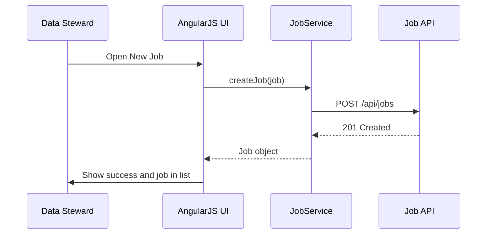
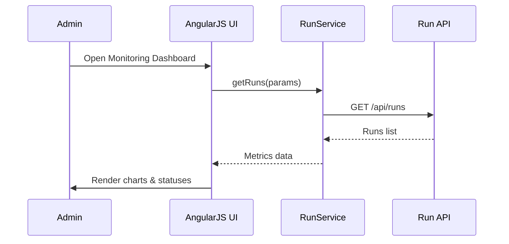

# Low-Level Design (LLD) for Epic QE-3551 – Extraction & Incremental Load

## 1. Application Architecture

This LLLD describes the AngularJS-based UI and client behavior for configuring and monitoring ETL extraction jobs, incremental loads, and related metadata for restricted substances data.

### 1.1 Architecture Overview

- **Frontend:** AngularJS 1.x, ES6-style JavaScript, HTML5, CSS3, Bootstrap.
- **Backend:** REST APIs for Job Scheduler/Orchestrator, Extraction Services, Incremental Load Controller, Metadata Store, Audit & Lineage Store, Notification & Alerting.
- **Pattern:** AngularJS MVC with separate feature modules for jobs, runs, monitoring, and configuration.

### 1.2 AngularJS Module Mapping

- `app.core` – shared core functionality.
- `app.auth` – authentication and IAM integration.
- `app.jobs` – job configuration and scheduling UI.
- `app.runs` – job run history, run details, and metrics.
- `app.monitoring` – dashboards, alerts visualization.
- `app.shared` – reusable directives and filters.

### 1.3 AngularJS Artifacts

#### Modules

- `app.jobs`
- `app.runs`
- `app.monitoring`

#### Controllers

- `JobListController`
- `JobDetailController`
- `JobRunListController`
- `JobRunDetailController`
- `MonitoringDashboardController`

#### Services

- `JobService`
- `RunService`
- `ExtractionConfigService`
- `NotificationService` (reused from core)
- `AuthService` (from auth module)
- `LoggingService` (from core)

#### Directives

- `jobCard`
- `jobScheduleForm`
- `runStatusBadge`
- `metricsChart`

#### Filters

- `jobStatusLabel`
- `runStatusLabel`
- `durationFormat`

### 1.4 Project Structure (Additions)

```text
app/
  jobs/
    jobs.module.js
    job-list.controller.js
    job-detail.controller.js
    job.service.js
    job-card.directive.js
    job-schedule-form.directive.js
  runs/
    runs.module.js
    job-run-list.controller.js
    job-run-detail.controller.js
    run.service.js
    run-status-badge.directive.js
  monitoring/
    monitoring.module.js
    monitoring-dashboard.controller.js
    metrics-chart.directive.js
  shared/filters/
    job-status-label.filter.js
    run-status-label.filter.js
    duration-format.filter.js
```

## 2. Component Specifications

### 2.1 Services

#### 2.1.1 `JobService`

- **File:** `app/jobs/job.service.js`
- **Responsibility:** Manage extraction job definitions and schedules.
- **Public Methods:**
  - `getJobs(params)` → `Promise<Job[]>`
  - `getJobById(id)` → `Promise<Job>`
  - `createJob(job)` → `Promise<Job>`
  - `updateJob(job)` → `Promise<Job>`
  - `deleteJob(id)` → `Promise<void>`
  - `triggerJob(id)` → `Promise<JobRun>` (ad-hoc run)
- **Inputs:** Job models, filters.
- **Outputs:** Job models and run references.
- **Dependencies:** `$http`, `$q`, `ConfigService`, `AuthService`.

#### 2.1.2 `RunService`

- **File:** `app/runs/run.service.js`
- **Responsibility:** Retrieve job run history, status, and metrics.
- **Public Methods:**
  - `getRuns(params)` → `Promise<JobRun[]>`
  - `getRunsByJob(jobId, params)` → `Promise<JobRun[]>`
  - `getRunById(runId)` → `Promise<JobRun>`
  - `retryRun(runId)` → `Promise<JobRun>`
- **Dependencies:** `$http`, `ConfigService`, `AuthService`.

#### 2.1.3 `ExtractionConfigService`

- **File:** `app/jobs/extraction-config.service.js`
- **Responsibility:** Provide reference data for source systems, increment strategies, and templates.
- **Public Methods:**
  - `getSourceSystems()` → `Promise<SourceSystem[]>`
  - `getIncrementStrategies()` → `Promise<IncrementStrategy[]>`
  - `getJobTemplates()` → `Promise<JobTemplate[]>`

### 2.2 Controllers

#### 2.2.1 `JobListController`

- **File:** `app/jobs/job-list.controller.js`
- **Responsibility:** Display jobs and allow filtering, triggering, and basic actions.
- **Public Methods:**
  - `loadJobs()`
  - `filterJobs()`
  - `triggerJob(job)`
  - `deleteJob(job)`
  - `openJob(job)`
- **Dependencies:** `JobService`, `NotificationService`, `LoggingService`, `$location`.

#### 2.2.2 `JobDetailController`

- **File:** `app/jobs/job-detail.controller.js`
- **Responsibility:** Edit/create a job definition, including schedule and incremental logic.
- **Public Methods:**
  - `init()`
  - `save()`
  - `cancel()`
- **Dependencies:** `JobService`, `ExtractionConfigService`, `NotificationService`, `$routeParams`.

#### 2.2.3 `JobRunListController`

- **File:** `app/runs/job-run-list.controller.js`
- **Responsibility:** Show run history for jobs, including status and metrics.
- **Public Methods:**
  - `loadRuns()`
  - `filterRuns()`
  - `viewRun(run)`
  - `retryRun(run)`

#### 2.2.4 `JobRunDetailController`

- **File:** `app/runs/job-run-detail.controller.js`
- **Responsibility:** Show details of a specific run: record counts, errors, duration, source latency.
- **Public Methods:**
  - `init()`
  - `loadRun()`

#### 2.2.5 `MonitoringDashboardController`

- **File:** `app/monitoring/monitoring-dashboard.controller.js`
- **Responsibility:** Visual dashboards showing job status, durations, anomalies.
- **Public Methods:**
  - `loadSummary()`
  - `refresh()`

### 2.3 Directives

#### 2.3.1 `jobCard`

- **File:** `app/jobs/job-card.directive.js`
- **Responsibility:** Display job summary including next run time, last run status, and actions.

#### 2.3.2 `jobScheduleForm`

- **File:** `app/jobs/job-schedule-form.directive.js`
- **Responsibility:** Encapsulate schedule editor (cron-like UI, time zone selection).

#### 2.3.3 `runStatusBadge`

- **File:** `app/runs/run-status-badge.directive.js`
- **Responsibility:** Visual representation of run status (`SUCCESS`, `FAILED`, `RETRYING`, etc.).

#### 2.3.4 `metricsChart`

- **File:** `app/monitoring/metrics-chart.directive.js`
- **Responsibility:** Wrapper around a chart library (e.g., Chart.js) to visualize record counts, durations.

### 2.4 Filters

- `jobStatusLabel` – map job status to labels.
- `runStatusLabel` – map run status.
- `durationFormat` – convert milliseconds to human-readable durations.

## 3. Data Model Design

### 3.1 `Job`

- **Attributes:**
  - `id` (string)
  - `name` (string, required)
  - `description` (string)
  - `sourceSystem` (string, required; references ERP, PLM, EXTDB)
  - `schedule` (string, cron expression)
  - `incrementStrategy` (string enum: `"LAST_SUCCESS_TS" | "CDC_MARKER" | "VERSION_COUNTER"`)
  - `lastSuccessfulRunTime` (string ISO, readonly)
  - `status` (string enum: `"ACTIVE" | "DISABLED" | "DRAFT"`)
  - `createdBy`, `createdAt`, `updatedBy`, `updatedAt`

- **Validation Rules:**
  - `name`: 3–100 chars.
  - `schedule`: validated via backend; client uses simple pattern check.
  - `sourceSystem`: must be one of allowed values depending on reference data.

### 3.2 `JobRun`

- **Attributes:**
  - `id` (string)
  - `jobId` (string)
  - `status` (`"PENDING" | "RUNNING" | "SUCCESS" | "FAILED" | "RETRYING" | "CANCELLED"`)
  - `startTime`, `endTime` (ISO string)
  - `recordsExtracted` (number)
  - `recordsLoaded` (number)
  - `deltaRecords` (number)
  - `sourceLatencyMs` (number)
  - `errorCount` (number)
  - `retryCount` (number)
  - `batchId` (string)
  - `sources` (array of `SourceRunSummary`)

### 3.3 `SourceRunSummary`

- **Attributes:**
  - `sourceId` (string)
  - `status` (enum)
  - `recordsExtracted` (number)
  - `errors` (array of `RunError`)

### 3.4 `RunError`

- **Attributes:**
  - `code` (string)
  - `message` (string)
  - `severity` (string)

## 4. Data Flow

### 4.1 Job Configuration Flow

1. User navigates to Job list.
2. `JobListController` loads jobs via `JobService.getJobs()`.
3. User clicks "New Job" → route to Job detail.
4. `JobDetailController` loads source systems and strategies via `ExtractionConfigService`.
5. User fills job form and saves.
6. `JobService.createJob(job)` calls `POST /api/jobs`.
7. Backend stores definition and schedule in Scheduler.
8. User sees confirmation and job appears in list.

### 4.2 Incremental Run Flow

1. Scheduler triggers backend; UI is not initiator but monitors.
2. Backend logs job run metadata.
3. `RunService.getRunsByJob(jobId)` loads runs for UI.
4. UI displays `deltaRecords`, `lastSuccessfulRunTime`.

## 5. REST Interfaces (Client Perspective)

### 5.1 Job APIs

- `GET /api/jobs`
- `GET /api/jobs/{id}`
- `POST /api/jobs`
- `PUT /api/jobs/{id}`
- `DELETE /api/jobs/{id}`
- `POST /api/jobs/{id}/trigger`

### 5.2 Job Run APIs

- `GET /api/runs` (global)
- `GET /api/jobs/{id}/runs`
- `GET /api/runs/{runId}`
- `POST /api/runs/{runId}/retry`

### 5.3 Metadata & Audit

- `GET /api/metadata/source-systems`
- `GET /api/metadata/increment-strategies`
- `GET /api/audit/jobs/{id}`

## 6. Sequence Diagrams

### 6.1 Job Creation



### 6.2 Monitoring Dashboard



## 7. Implementation Details

- Use `ui-bootstrap` date/time pickers in `jobScheduleForm`.
- Ensure `JobService` and `RunService` handle pagination and sorting.
- IAM integration via `AuthService` ensures only authorized roles manage jobs.

## 8. Configuration & Security

- Feature flags for `enableAdHocRuns` to allow or block manual triggers.
- Logging of job config changes through server; UI logs user actions.
- Enforce TLS for all API endpoints; `ConfigService` only accepts `https` base URLs.
