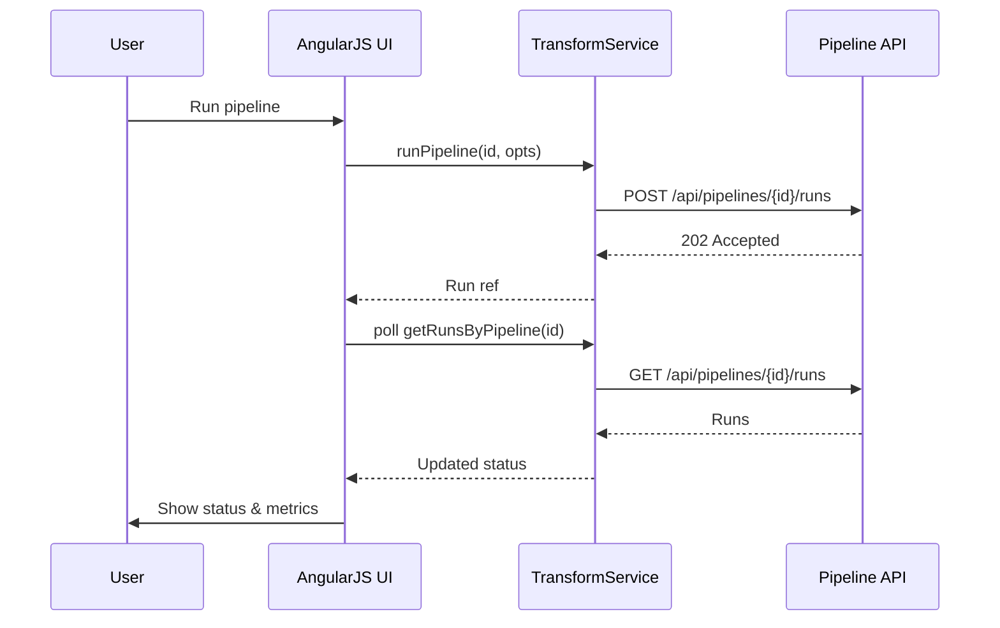

# Low-Level Design (LLD) for Epic QE-3552 – EUMDR Transformation ETL

> Focus: AngularJS-based UI for configuring and monitoring EUMDR transformation rules, pipelines, and data lineage.

## 1. Application Architecture

### 1.1 Overview

- **Frontend:** AngularJS 1.x SPA for EUMDR transformation management.
- **Backend:** REST APIs for Transformation Engine, MDM, Regulatory Reference DB, Audit & Lineage, Configuration & Rules Repository, DMS.
- **Pattern:** Modular AngularJS MVC architecture.

### 1.2 Module and Component Mapping

- Modules:
  - `app.transform` – transformation configuration & monitoring.
  - `app.rules` – rule management.
  - `app.lineage` – lineage visualization.

- Controllers:
  - `TransformPipelineController`
  - `RuleListController`
  - `RuleDetailController`
  - `LineageViewController`

- Services:
  - `TransformService`
  - `RuleService`
  - `ReferenceDataService`
  - `LineageService`

- Directives:
  - `pipelineStageDiagram`
  - `ruleMappingTable`
  - `lineageGraph`

## 2. Component Specifications

### 2.1 Services

#### 2.1.1 `TransformService`

- **File:** `app/transform/transform.service.js`
- **Responsibility:** Coordinate pipeline executions: reading from staging, triggering transformations, monitoring status.
- **Methods:**
  - `getPipelines()` → `Promise<Pipeline[]>`
  - `getPipelineById(id)` → `Promise<Pipeline>`
  - `runPipeline(id, options)` → `Promise<PipelineRun>`
  - `getRunsByPipeline(id)` → `Promise<PipelineRun[]>`

#### 2.1.2 `RuleService`

- **File:** `app/rules/rule.service.js`
- **Responsibility:** CRUD operations for transformation rules.

#### 2.1.3 `ReferenceDataService`

- **Responsibility:** Retrieve regulatory snapshots and MDM references.

### 2.2 Controllers

- `TransformPipelineController` – manage list of pipelines and executions.
- `RuleListController` – rule catalog view.
- `RuleDetailController` – detailed rule editing, including mappings.
- `LineageViewController` – show lineage for transformed datasets.

### 2.3 Directives

- `pipelineStageDiagram` – visual representation of ETL stages.
- `ruleMappingTable` – editing field mappings.
- `lineageGraph` – display lineage using Mermaid-like visualization.

## 3. Data Models

### 3.1 `Pipeline`

- `id`, `name`, `description`, `status`, `sourceSystems`, `targetSchema`, `ruleSetVersion`.

### 3.2 `PipelineRun`

- `id`, `pipelineId`, `status`, `startTime`, `endTime`, `recordsIn`, `recordsOut`, `errors`.

### 3.3 `Rule`

- `id`, `name`, `type` (`MAPPING`, `UNIT_CONVERSION`, `CLASSIFICATION`), `sourceField`, `targetField`, `expression`, `version`, `effectiveFrom`, `effectiveTo`.

## 4. Data Flow & Sequence Diagrams

### 4.1 Pipeline Execution

## 5. Implementation Details

- Strong reliance on backend for heavy transformation; UI is management and visibility layer.
- Use charts and tables to show converted units, SVHC status, etc., but values come from API.

## 6. Security & Configuration

- IAM integration with RBAC/ABAC for rule changes.
- Logging of rule edits and pipeline runs.
