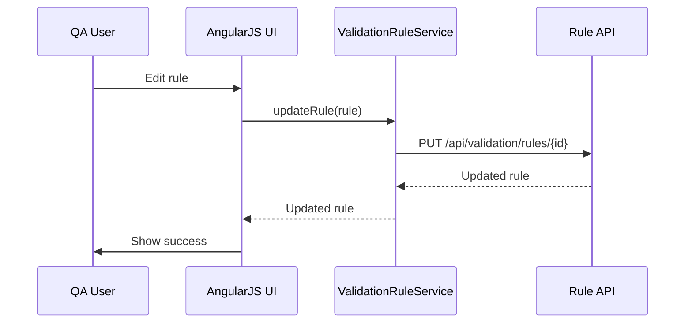

# Low-Level Design (LLD) for Epic QE-3553 – Validation & QA Engine UI

## 1. Architecture

- AngularJS module `app.validation` providing UI to manage and monitor validation rules and results.

## 2. Components

### 2.1 Services

- `ValidationRuleService` – CRUD for rules.
- `ValidationRunService` – view validation runs.

### 2.2 Controllers

- `ValidationRuleListController`
- `ValidationRuleDetailController`
- `ValidationRunListController`
- `ValidationRunDetailController`

### 2.3 Directives

- `ruleConditionBuilder` – UI for building rule conditions.
- `validationResultTable` – show validation errors.

## 3. Data Models

- `ValidationRule` – id, name, type, condition, severity, version.
- `ValidationRun` – id, batchId, status, startTime, endTime, recordCounts.

## 4. Sequence Diagrams

### 4.1 Rule Update

