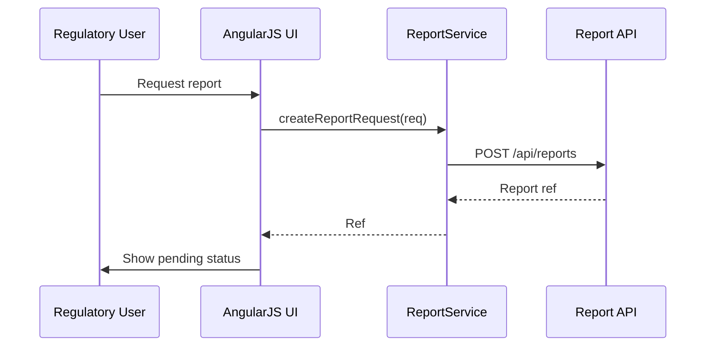

# Low-Level Design (LLD) for Epic QE-3554 – Reporting & Digital Signatures

## 1. Architecture

- AngularJS module `app.reporting` for report selection, generation, and access.

## 2. Components

### 2.1 Services

- `ReportService` – request and track reports.
- `SignatureService` – check digital signature status.

### 2.2 Controllers

- `ReportListController`
- `ReportRequestController`
- `ReportDetailController`

### 2.3 Directives

- `reportMetadataPanel` – display report metadata.
- `signatureStatusBadge` – show signature status.

## 3. Data Models

- `ReportRequest` – product, date range, report type.
- `Report` – id, status, generatedAt, signedAt, location.

## 4. Sequence Diagram

