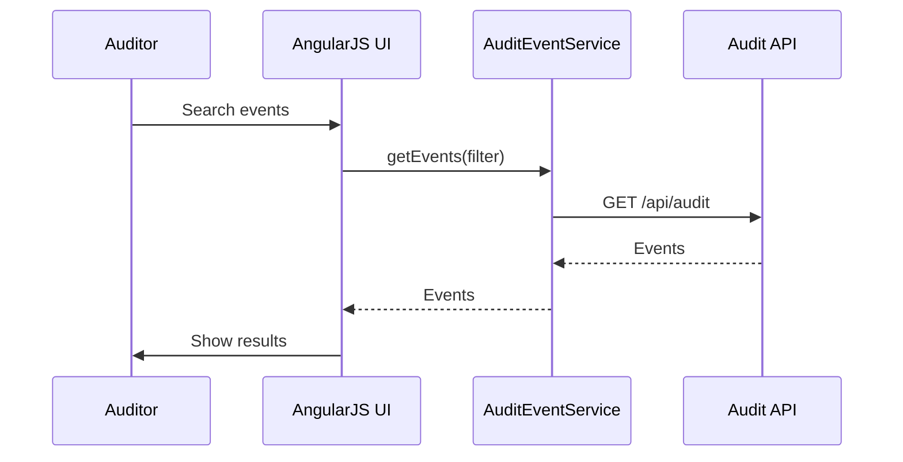

# Low-Level Design (LLD) for Epic QE-3555 – Audit & Lineage UI

## 1. Architecture

- AngularJS module `app.audit` providing comprehensive audit trail browsing and lineage analysis UIs.

## 2. Components

### 2.1 Services

- `AuditEventService` – fetch audit events and lineage.

### 2.2 Controllers

- `AuditEventListController`
- `AuditEventDetailController`
- `LineageExplorerController`

### 2.3 Directives

- `auditEventTable` – display events.
- `lineageTree` – hierarchical visualization.

## 3. Data Models

- `AuditEvent` – id, type, timestamp, user, entityId, details.

## 4. Sequence Diagram

